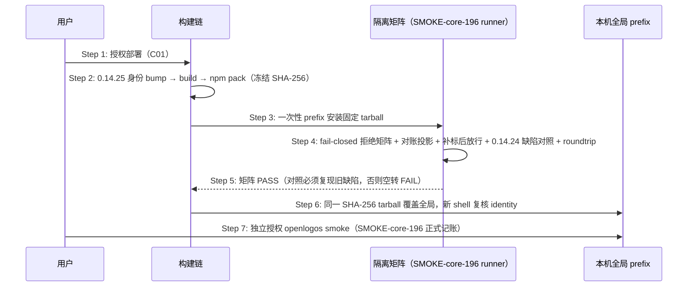

# core-S19-smoke-gate delta — fix-deploy-done-leak-failclosed-selfheal

## MODIFIED — smoke 前置依赖 deploy-done

`openlogos smoke` 只能在部署完成状态明确后运行。部署完成状态由 `openlogos deploy-done` 写入的 `DEPLOY_DONE` 与已全勾的 `[deploy]` section 共同表达。

smoke 的前置校验必须保持：
- 提案声明需要 smoke。
- 提案部署决策无冲突。
- `DEPLOY_DONE` 存在。
- `[deploy]` section 已全部勾选。

`openlogos smoke` 不得替代 `openlogos deploy-done` 写入部署完成 marker；如果缺少 `DEPLOY_DONE`，应提示先完成部署并执行 `openlogos deploy-done`。

重新执行 `openlogos deploy-done` 会清理旧的 `SMOKE_PASS` / `SMOKE_FAIL`，因此 smoke 结果只对应最近一次确认完成的部署。

### 前置校验的可验收契约（fail-closed 固化）

上述四项前置在 20260907 事故前只有行为描述、无实现与可验收断言——`cli/src/commands/smoke.ts` 完全没有该校验，导致缺 `DEPLOY_DONE` 时 smoke 照常执行并写入 `SMOKE_PASS`（规格已定、实现缺失）。本节把它升格为**可验收的 fail-closed 契约**。

**判定时机**：在执行 `smoke.command` 之前、进入 sandbox 之前完成，属主时序 Step 3 与 Step 4 之间的门。

**判定顺序与错误码**（固定 ①→②→③→④，命中即停，只报第一个错误码）：

| # | 前置 | 错误码 | 补救命令 |
|---|---|---|---|
| ① | `smoke_required=true` | `SMOKE_NOT_REQUIRED` | 无需 smoke，直接 `openlogos archive <slug>` |
| ② | `deployment_decision_conflict=false` | `SMOKE_DEPLOY_DECISION_CONFLICT` | 先修正 `proposal.md` / `tasks.md` 部署决策 |
| ③ | `DEPLOY_DONE` 存在 | `SMOKE_DEPLOY_NOT_DONE` | `openlogos deploy-done` |
| ④ | `[deploy]` section 全勾 | `SMOKE_DEPLOY_TASKS_INCOMPLETE` | 补齐 `[deploy]` 任务后 `openlogos deploy-done` |

**零副作用（强制）**：拒绝时不执行 `smoke.command`、不进入 sandbox、不写 `SMOKE_PASS` / `SMOKE_FAIL`、不生成 `smoke-report.md`、不追加 `smoke-results.jsonl`。错误信封写 stderr 并非零退出（`--format json` 走 `spec/cli-json-output.md` §6 通用错误 envelope），message 必须含上表对应的补救命令。

**禁止 auto-heal（红线）**：缺 `DEPLOY_DONE` 时 smoke **不得自动补写** `DEPLOY_DONE`——那会绕过半自动模式下 `deploy-done` 的人类确认点语义，并把「人确认过部署完成」与「机器推断部署完成」混为同一事实。smoke 只能拒绝，不能代写。

**两档模式语义不变**：前置校验只关命令自身的上游事实，不新增人类确认点。半自动下 smoke 仍需人类授权；`--auto` 下 standing 授权照常放行执行，但**放行的是"运行 smoke 这个动作"，不是"跳过前置门"**——前置不满足时 `--auto` 同样 fail-closed 拒绝。

**零回归边界**：四项前置全满足时放行，既有 sandbox 执行、runner / reporter 覆盖预检、gate 判定与 `gate.reason` 取值、skip 统计口径、`auto_execute` 信号逐项不变。

#### EX-19.5: 缺 DEPLOY_DONE 的 smoke 请求
- **触发条件**：活跃提案 `smoke_required=true`、部署决策无冲突，但 `DEPLOY_DONE` 不存在（人或 Agent 漏跑 `openlogos deploy-done`）。
- **期望响应**：`SMOKE_DEPLOY_NOT_DONE` 写 stderr 并非零退出，message 含 `openlogos deploy-done`。
- **副作用**：零——`smoke.command` 未执行、无 smoke marker、无报告、无 JSONL 追加。

#### EX-19.6: `[deploy]` 未全勾的 smoke 请求
- **触发条件**：`DEPLOY_DONE` 存在（历史或旁路写入），但 `tasks.md` 的 `[deploy]` section 仍有未勾条目。
- **期望响应**：`SMOKE_DEPLOY_TASKS_INCOMPLETE` 拒绝，提示补齐部署任务后执行 `openlogos deploy-done`。
- **副作用**：零。

### 与 archive 链条校验的关系

smoke 门是链条的中段，archive 链条校验（S09）是末端兜底：即使 smoke 因历史版本或旁路被绕过，`openlogos archive` 仍会在需部署且需 smoke 的提案上要求 `DEPLOY_DONE` + `SMOKE_PASS`，缺一即 fail-closed 拒绝归档。两道门叠加构成纵深防御——本次事故中两道门同时缺席，才让缺口一路走到归档。

## ADDED — OpenLogos 0.14.25 生命周期 fail-closed 候选发布时序

### 场景目标

把生命周期命令 fail-closed 收口（smoke 前置校验、archive 链条校验）与 `state_inconsistency` 对账投影冻结为唯一 `0.14.25` tarball，经隔离矩阵（含拒绝矩阵、对账投影、补标后放行与 0.14.24 缺陷复现对照）与回滚演练后覆盖本机全局，并以 SMOKE-core-196 完成正式 smoke。

### 参与者

- **用户**：部署与 smoke 两个独立确认点的授权者。
- **OpenLogos CLI 构建链**：身份 bump、build、npm pack。
- **隔离 prefix / SMOKE-core-196 runner**：安装态验收执行者。
- **本机全局 prefix**：部署目标。

### 前置条件

smoke 前置校验、archive 链条校验与 `state_inconsistency` 投影已合并入仓、代码切片完成且 `openlogos verify` PASS（提案 `fix-deploy-done-leak-failclosed-selfheal`）。

### 成功后置条件

全局 `openlogos --version` 精确 `0.14.25`，identity 全同源；SMOKE-core-196 pass、`SMOKE_PASS` 在场；本机任何项目上缺 `DEPLOY_DONE` 时 smoke 与 archive 均 fail-closed 拒绝，孤儿 `SMOKE_PASS` 状态下 `status` / `next` 输出对账投影与补救命令。

### 时序图

### 步骤说明

1. **用户** 明确授权部署（与 smoke 分离的两个确认点；C01 用户决策「发 0.14.25 并本机部署」）。
2. **构建链** 同步候选身份全链（`LOCAL_RELEASE_CANDIDATE_VERSION=0.14.25`、`ROLLBACK=0.14.24`）并真实 `npm pack`，任何重新 pack 产生新 candidate identity。
3. **runner** 在 `mktemp -d` 一次性 prefix 从绝对入口执行，杜绝 workspace link。
4. **矩阵** 核心断言（全部在一次性临时项目内构造，不触碰本仓与用户其它项目）：
   - **smoke 拒绝**：构造 `VERIFY_PASS` + 需部署需 smoke 但缺 `DEPLOY_DONE` 的提案 → `openlogos smoke` 非零退出、错误码 `SMOKE_DEPLOY_NOT_DONE`、提示含 `openlogos deploy-done`，且 `SMOKE_PASS` / `smoke-report.md` / `smoke-results.jsonl` 均未产生；`[deploy]` 未全勾场景 → `SMOKE_DEPLOY_TASKS_INCOMPLETE`。
   - **archive 拒绝**：缺 `VERIFY_PASS` → `ARCHIVE_VERIFY_NOT_PASSED`；需部署缺 `DEPLOY_DONE` → `ARCHIVE_DEPLOY_NOT_DONE`；需 smoke 缺 `SMOKE_PASS` → `ARCHIVE_SMOKE_NOT_PASSED`；三者均不移动目录、不删 guard。
   - **对账投影**：构造孤儿状态（`SMOKE_PASS` 在场、`DEPLOY_DONE` 缺失）→ `status --format json` 的 `active_change.state_inconsistency` 三字段齐备；`next` 人读引导含 `openlogos deploy-done`。
   - **补标后放行**：执行 `openlogos deploy-done` 后重跑 → smoke 进入正常执行路径、archive 链条通过、投影字段消失。
   - **零回归**：无需部署提案 `VERIFY_PASS` 后 archive 照常成功；一致状态下 `status` / `next` 输出无 `state_inconsistency` 字段。
   - `0.14.24→0.14.25` roundtrip 无混装。
5. **对照**：固定 0.14.24 上重放缺标场景，**必须复现缺陷**——smoke 照常执行并写 `SMOKE_PASS`、archive 照常成功、`status` / `next` 无投影字段（防断言空转）。
6. **全局覆盖** 后 identity 复核全同源 0.14.25。
7. **smoke** 独立授权，写唯一 SMOKE-core-196 记录。

### 异常与边界

#### EX-63.1：隔离矩阵失败
- **触发条件**：任一矩阵断言红（拒绝未生效、副作用未清零、投影缺字段、补标后未放行）。
- **期望响应**：停止部署、回实现、重新 verify/build/pack；不得为过矩阵伪造 marker 或跳过对照。
- **副作用**：全局不受影响。

#### EX-63.2：对照空转
- **触发条件**：0.14.24 上缺标场景也被拒绝（旧版本就有该门）。
- **期望响应**：判 FAIL 并重写矩阵，而非放行部署。
- **副作用**：无。

#### EX-63.3：全局覆盖后行为异常
- **触发条件**：identity 漂移，或 fail-closed 误伤（前置满足却被拒绝）、投影漂移（一致状态下仍输出字段）。
- **期望响应**：按固定 0.14.24 tarball 回滚并复核 identity 全回 0.14.24。
- **副作用**：回滚留痕于部署报告。

### 追溯

- 需求：OpenLogos 0.14.25 候选发布需求。
- 功能规格：§2.67.5。
- 测试：UT-S19-45；smoke：SMOKE-core-196。
