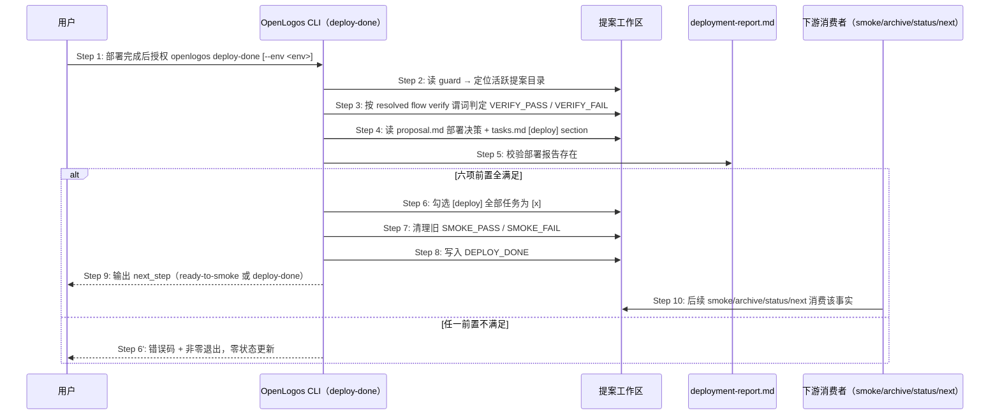

# core-S21-deploy-done-marker delta — fix-deploy-done-leak-failclosed-selfheal（CREATE，整文档）

## ADDED — S21: 标记部署完成 — 时序图

# S21: 标记部署完成 — 时序图

## 场景目标

把「部署已完成」从一个由 AI 手写文件表达的隐式约定，收敛为一条受控命令 `openlogos deploy-done`：它是 `DEPLOY_DONE` 这一权威事实的**唯一 writer**，在人类授权完成实际部署之后，一次性完成校验、`[deploy]` 勾选同步、旧 smoke 结论清理与 marker 写入，并把下一步交给 smoke 或 archive。

S21 位于 S13（verify）与 S19（smoke）之间：它**不执行任何部署动作**（build / push / ssh / npm publish / Cloudflare deploy 全部属于部署方案与人类确认点），只在部署由人类授权完成后确认状态。

## 参与者

- **用户**：部署执行的授权者；部署完成后授权运行 `openlogos deploy-done`（`--auto` 下由 standing 授权放行）。
- **OpenLogos CLI（`deploy-done` 命令）**：`DEPLOY_DONE` 的唯一 writer。
- **提案工作区**（`logos/changes/<slug>/`）：`VERIFY_PASS` / `DEPLOY_DONE` / `SMOKE_PASS` / `SMOKE_FAIL` marker 与 `tasks.md` 的载体。
- **部署报告**（`logos/resources/verify/deployment-report.md`）：部署已实际发生的证据。
- **下游消费者**：`openlogos smoke`（S19）、`openlogos archive`（S09）、`openlogos status`（S11）、`openlogos next`（S05）。

## 前置条件

1. 当前目录存在 `logos/logos.config.json`。
2. `logos/.openlogos-guard` 指向有效活跃提案。
3. 活跃提案存在 `VERIFY_PASS` 且不存在 `VERIFY_FAIL`（按 resolved flow 的 `verify` 节点谓词判定：默认 marker 谓词，overlay 可改为 `cmd:` 谓词就地求值）。
4. 提案部署决策无冲突，且 `deployment_required=true`。
5. `tasks.md` 存在 `[deploy]` section 且至少有一个部署任务。
6. `logos/resources/verify/deployment-report.md` 已存在（部署确实发生过的证据）。

## 成功后置条件

1. `tasks.md` 的 `[deploy]` section 任务全部勾选为 `[x]`。
2. `logos/changes/<slug>/DEPLOY_DONE` 在盘。
3. 同一提案中旧的 `SMOKE_PASS` / `SMOKE_FAIL` 已清理——smoke 结论只对应最近一次确认完成的部署。
4. 输出下一步：`smoke_required=true` → `next_step="ready-to-smoke"`，提示 `openlogos smoke --env <env>`；否则 `next_step="deploy-done"`，提示 `openlogos archive <slug>`。
5. `status` / `next` 的 `proposal_step` 离开 `ready-to-deploy`。

## 主时序

## 步骤说明

1. **用户授权**：半自动（无 `--auto`）下部署执行与 `deploy-done` 均需人类明确授权；全自动（`--auto`）下由 standing run-scoped 授权放行，放行事件写 `GATE_AUTO_PASSED` 审计行。无论哪档，下文六项前置照常校验。
2. **CLI 定位提案**：读 `logos/.openlogos-guard` 的 `activeChange` 得到 slug 与提案目录；guard 缺失或非法即 `NO_ACTIVE_CHANGE`。
3. **verify 判定**：加载 resolved launched flow 的 `verify` 节点，按其 `fail_when` / `done_when` 谓词判定（`fail_when` 优先）。谓词只允许 `cmd:` / `marker:`；出现其它形态即 `FLOW_SCHEMA_INVALID` fail loud，不得降级为「验收未通过」——否则同一非法 flow 下 `status` 与 `deploy-done` 错误码不一致，自动化会把配置错当成验收未通过。
4. **部署决策与任务**：读 `proposal.md` 的 `## 部署影响` 与 `tasks.md` 的 `[deploy]` section；决策冲突、`deployment_required=false`、无 `[deploy]` section 或 section 为空各自对应独立错误码。
5. **部署报告校验**：`logos/resources/verify/deployment-report.md` 必须已存在——这是「部署确实发生过」的最低证据，`deploy-done` 只确认状态、不能凭空宣告部署完成。
6. **勾选同步**：把 `[deploy]` section 中所有 `- [ ]` 改为 `- [x]`，保证 marker 与结构化任务证据同步（两者共同表达部署完成状态，S19 前置校验会同时读取）。
7. **清理旧 smoke 结论**：删除同一提案中的 `SMOKE_PASS` / `SMOKE_FAIL`，输出 `cleared_smoke_markers`。重新部署后旧 smoke 结论必须失效，否则 archive 会拿上一轮部署的 smoke 结论给这一轮盖章。
8. **写入 marker**：写 `logos/changes/<slug>/DEPLOY_DONE`。
9. **输出下一步**：按 `smoke_required` 分流；`--format json` 输出 `DeployDoneData`（契约见 `spec/cli-json-output.md` §4）。
10. **下游消费**：见「消费侧收口」一节。

## 原子性与唯一 writer 不变量

1. **唯一 writer**：`DEPLOY_DONE` 只能由 `openlogos deploy-done` 写入。AI、宿主 driver 与任何其它命令都不得手写或代写该 marker——尤其 `openlogos smoke` 不得在检测到缺标时 auto-heal 补写（那会绕过半自动下的人类确认点语义并掩盖遗漏事实）。
2. **不产生部分状态更新**：任何错误分支都不得写入 `DEPLOY_DONE`、不得勾选 `[deploy]` 任务、不得清理 smoke marker。特别地，禁止「只写 marker 而未勾选 `[deploy]` 任务」——那会让 S19 的第 ④ 项前置与第 ③ 项前置互相矛盾。
3. **成功路径顺序**：勾选 → 清理旧 smoke → 写 marker。marker 最后写，保证「marker 在盘」蕴含「勾选与清理都已完成」。
4. **幂等**：对已 `DEPLOY_DONE` 的提案重跑，前置仍逐项校验；重跑会再次清理 smoke 结论（这正是「重新部署使旧 smoke 失效」的语义）。

## 异常与边界

### EX-21.1: 无活跃提案
- **触发条件**：`logos/.openlogos-guard` 缺失或 `activeChange` 为空/非法 JSON。
- **期望响应**：`NO_ACTIVE_CHANGE`，非零退出。
- **副作用**：零。

### EX-21.2: verify 未通过
- **触发条件**：`VERIFY_FAIL` 在场，或 `VERIFY_PASS` 缺失，或 cmd 谓词求值未满足/超时。
- **期望响应**：`VERIFY_NOT_PASSED`；cmd 谓词分支的 message 须携带 `verify.<field> = cmd:<command>` 与 exit code / 超时事实。
- **副作用**：零——不写 marker、不勾选、不清理。

### EX-21.3: 部署决策冲突或无需部署
- **触发条件**：`proposal.md` 与 `tasks.md` 部署决策冲突；或 `deployment_required=false`。
- **期望响应**：`DEPLOYMENT_DECISION_CONFLICT` / `DEPLOYMENT_NOT_REQUIRED`，提示先修正提案。
- **副作用**：零。

### EX-21.4: 缺 `[deploy]` 任务
- **触发条件**：`tasks.md` 无 `[deploy]` section，或 section 内无任何任务条目。
- **期望响应**：`DEPLOY_TASKS_MISSING`。
- **副作用**：零。

### EX-21.5: 缺部署报告
- **触发条件**：`logos/resources/verify/deployment-report.md` 不存在。
- **期望响应**：`DEPLOYMENT_REPORT_MISSING`，提示先生成部署报告。
- **副作用**：零。

### EX-21.6: flow 配置非法
- **触发条件**：resolved `verify` 节点谓词非 `cmd:` / `marker:`，或项目级 `cmd_timeout_seconds` 非法。
- **期望响应**：`FLOW_SCHEMA_INVALID` fail loud（在跑 cmd / 写 marker 之前），绝不吞错、绝不误报 `VERIFY_NOT_PASSED`。
- **副作用**：零。

### EX-21.7: 漏跑 deploy-done（本场景的缺席态）
- **触发条件**：部署与 smoke 实际都已完成，但执行者（人或 Agent）漏跑 `openlogos deploy-done`，`DEPLOY_DONE` 缺失。
- **期望响应**：**不由 S21 自愈**——`deploy-done` 是唯一 writer，缺席只能靠补跑该命令修复。下游按 fail-closed 与对账两层处置：`openlogos smoke` 拒绝执行并提示补跑（S19）、`openlogos archive` 拒绝归档（S09）、`status` / `next` 输出 `state_inconsistency` 对账投影并给出 `openlogos deploy-done` 补救命令（S11 / S05）。
- **副作用**：无缺口扩散——缺标状态下不会产生 `SMOKE_PASS`，也不会被归档固化。

## 消费侧收口

`DEPLOY_DONE` 与已全勾的 `[deploy]` section 共同表达部署完成状态，四个下游消费者的口径固定为：

| 消费者 | 消费方式 | 缺 `DEPLOY_DONE` 时 |
|---|---|---|
| `openlogos smoke`（S19） | 前置 fail-closed 校验（四项前置之三、之四） | `SMOKE_DEPLOY_NOT_DONE` 拒绝，零副作用，提示 `openlogos deploy-done` |
| `openlogos archive`（S09） | 链条 fail-closed 校验 | 需部署提案 `ARCHIVE_DEPLOY_NOT_DONE` 拒绝，不移动目录、不删 guard |
| `openlogos status`（S11） | 只读派生 + 矛盾对账投影 | 停在 `ready-to-deploy`；有矛盾下游证据时挂 `state_inconsistency` |
| `openlogos next`（S05） | 只读派生 + 矛盾对账引导 | 建议部署授权；有矛盾下游证据时显式给出补救命令 |

**消费者共同不变量**：任何消费者都不得写 `DEPLOY_DONE`，不得由「smoke 已过」反推「部署已完成」。消费者只能拒绝（fail-closed）或点名（对账投影）。

`deployment_progress.status=done` 仅用于展示，**不等价于部署完成**；只有 `DEPLOY_DONE` 在场才能离开 `ready-to-deploy`。

## 追溯

- 需求：`core-01-requirements.md` — 生命周期命令 fail-closed 与状态对账需求（S21 场景文档化要求）。
- 功能规格：§2.11 deploy-done 受控落标命令（含 §2.11.1 消费侧收口）、§2.67 生命周期命令 fail-closed 与状态对账。
- JSON 契约：`spec/cli-json-output.md` §4 `openlogos deploy-done --format json`。
- 流程契约：`spec/change-management.md` 变更工作流步骤 10–12。
- 关联场景：S13（verify）、S19（smoke 门禁）、S09（archive 链条）、S11（status 投影）、S05（next 引导）。
- 决策记录：D12 — 生命周期命令 fail-closed 与显式对账不变量。
- 测试：既有 `UT-S21-*` 与 `cli/test/s21-deploy-done.test.ts` 覆盖校验、勾选同步与 smoke 标记清理。
