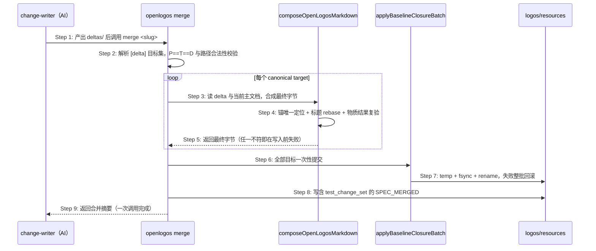

# Delta: core-S09-change-lifecycle.md

> change: lite-cut1b-remove-merge-transaction
> 目标：`logos/resources/prd/3-technical-plan/2-scenario-implementation/core-S09-change-lifecycle.md`

## REMOVED — S09 合并事务单一权威生命周期

事务化合并生命周期（规划 → 逐 slot 提交 → seal → apply → receipt）随外壳删除，改由 `openlogos merge` 一次调用完成，见本次新增的直接合并时序。

## REMOVED — S09 公共 staging、abort 与 completed receipt 时序补充

公共 staging 声明、abort 分支与 completed receipt 依附于事务，随之删除。

## REMOVED — S09 Seal Preflight 与 Legacy Sealed Reopen 时序

seal 绑定 preflight 与 legacy sealed 的局部 reopen 依附于事务相位机，随之删除；其规格结构检查能力由 `openlogos lint-specs` 承接。

## REMOVED — S09 嵌套章节锚 Slot 的 Seal Preflight 与同事务恢复时序

嵌套锚解析能力属合并引擎并随引擎保留；本节描述的是其在 slot preflight 与同事务恢复中的用法，随事务删除。

## REMOVED — S09 归档提案的事务只读寻址与写动作 fail-closed

归档提案的事务只读寻址依附于事务命令面。归档目录的只读性由文件系统与归档语义保证，不再需要事务准入矩阵。

## REMOVED — S09 merge 事务前沿推进生产链路时序（flow 契约自洽）

前沿事务事实作为第二事实源随事务删除；merge 节点完成回归单一判据 `SPEC_MERGED` 在场。

## ADDED — S09 merge 直接合并时序

### 场景目标

把规格合并从「N×3+3 次 CLI 往返的事务链」收敛为**一次调用**：读 delta → 逐目标合成最终字节（含物质结果复验）→ 一次性原子落盘 → 写含 `test_change_set` 的 `SPEC_MERGED`。失败即整批回滚，git 工作区是回滚点。

### 参与者

- **change-writer（AI）**：产出 `deltas/` 下的 delta 文件。
- **openlogos merge（CLI）**：合并的唯一执行者与写入者。
- **合并引擎 `composeOpenLogosMarkdown`**：章节锚定位、标题 rebase、物质结果复验。
- **原子落盘原语 `applyBaselineClosureBatch`**：全部目标一次提交，失败整批回滚。

### 前置条件

`[delta]` 全部产出、change-lint 通过、`logos/resources/` 工作区干净（便于回滚）。

### 成功后置条件

全部 canonical target 落盘为最终态；`SPEC_MERGED` 在场且含结构化 `test_change_set`；无任何事务中间态文件残留。

### 时序图

### 步骤说明

1. **change-writer** 产出全部 delta 后调用 `openlogos merge <slug>`。
2. **merge** 解析目标集并做既有 P==T==D 与路径合法性校验——校验全部前置于写入。
3-5. **合并引擎**逐目标合成最终字节；`verifyAgentMaterialOutcome` 在此复验「delta 是否真被正确应用」，任一目标不符即在写入任何文件前整体失败。
6-7. **原子落盘原语**一次性提交全部目标，失败整批回滚，主文档保持合并前字节。
8. **merge** 末步写 `SPEC_MERGED`，含由 `buildTestChangeSet` 构建的结构化 `test_change_set`。
9. 至此一次 CLI 往返完成合并（此前 11 目标需 36 次）。

### 异常与边界

#### EX-9.20：某目标合成失败
- **触发条件**：章节锚解析到 0 或多处、delta 段标记缺失、物质结果复验不通过。
- **期望响应**：在写入任何文件前整体失败并点名该目标与原因；`logos/resources/` 零改动。
- **副作用**：无。

#### EX-9.21：落盘中途失败
- **触发条件**：rename 失败、磁盘异常。
- **期望响应**：整批回滚到合并前字节，不写 `SPEC_MERGED`；错误信息附 `git checkout logos/resources/` 作为兜底回滚点。
- **副作用**：无半新半旧的主文档。

#### EX-9.22：重新合并
- **触发条件**：已合并后发现 delta 有误。
- **期望响应**：`git checkout logos/resources/` 回到合并前，修正 delta 后重跑 `openlogos merge`——不存在 reopen 通道，也不需要（无中间态可恢复）。
- **副作用**：无。

### 追溯

- 需求：merge 直接合并与规格结构检查要求。
- 功能规格：§2.69。
- 测试：UT-S09-340、UT-S09-341、ST-S09-140。
