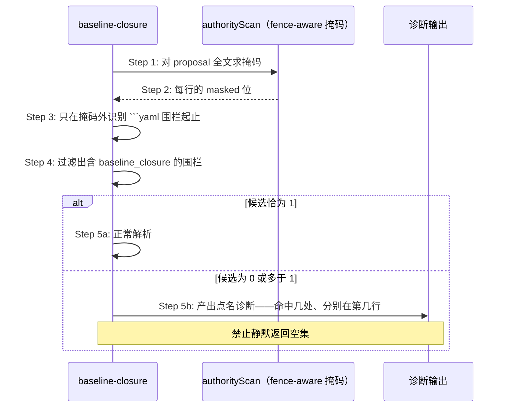

# Delta: core-S35-change-lint.md

> change: lite-cut2a-remove-authority-closure
> 目标：`logos/resources/prd/3-technical-plan/2-scenario-implementation/core-S35-change-lint.md`

## REMOVED — S35 Authority Closure L10 共享求值门

本节定义 L10 权威闭包检查的共享求值时序：`authority_impact` 声明解析、fact 字段闭合校验、`applicability` 分支、cutover 四子字段与 `tests` 引用存在性，以及该结论如何被 plan-package / change-lint / merge 三处消费。L10 删除后本节失去定义对象。

## REMOVED — S35 L10 authority closure 的分阶段校验时序

本节定义 L10 在 plan 与 spec 两阶段的校验强度差异（plan 只校验结构与 ID 格式、存在性校验后移到 spec 与 merge preflight）及阶段宽严对称要求。该分阶段设计是为绕开 L10 自身在 plan 阶段不可满足而引入的，随 L10 一并删除。

「门禁前置条件必须在其所处阶段可满足」这一通用要求由本文件的围栏/可满足性节继续约束，其判据不依赖 authority 语义。

## MODIFIED — S35 围栏提取单点、可归因诊断与门禁可满足性断言

### 场景目标

消除 `change-lint` 判定链上的两处判据分裂（YAML 围栏提取、测试 ID 语法），让多命中不再静默降级，并为「门在其阶段可满足」建立可执行的失败信号。

### 参与者与前置条件

| 别名 | 组件 | 说明 |
|---|---|---|
| C | `change-lint` evaluator | L0～L9 的完整判定 |
| S | `markdown-scan.authorityScan` | 围栏 / 缩进代码 / HTML 注释掩码的唯一判据（函数名承自历史，判据本身与 authority 无关） |
| G | 测试 ID 语法权威 | 语法与三种具名读法的唯一铸造点 |
| T | 门禁可满足性断言 | 每道门 × 该阶段合法最小提案 |

### 围栏提取归位时序

**Step 3 的判据**：全部 YAML 围栏提取器一律走 `markdown-scan` 的 fence-aware 掩码，不得自建裸正则。对含嵌套围栏的文档（如四反引号 markdown 块内示意一段 yaml），裸正则会比 fence-aware 多命中一个围栏——这正是掩码必须单点的原因。

**多命中不得静默降级**：任一围栏提取器在候选数不为 1 时，必须产出点名的诊断，说明命中了几处、分别在哪；不得静默返回空集或取第一个命中。

### 测试 ID 语法的单点与具名读法

| 读法 | 消费方 | 与权威语法的关系 |
|---|---|---|
| 结构化判定 | `test-change-set`、`test-slice-manifest`、`baseline-closure` | 完整语法 |
| 表格首列提取 | `test-slice-manifest` | 完整语法 + 行首锚定 |
| 正文扫描 | `automation-diagnostic` | 完整语法减去 SMOKE |

读法差异正当，各自定义不正当。本次消除的是四份独立演化的定义。

**语法与数据的一致性锚**：断言已合并测试规格中每一个表格首列 ID 都被权威语法接纳。原始缺陷不是正则写错了，而是没人检查正则与真实数据是否还对得上——11 个 JSON 系 ID 因此静默失联。

### 门禁可满足性断言

对每一道门构造「该门所处阶段的合法最小提案」，断言其通过：

| 阶段 | 合法最小提案含有 | 不含 |
|---|---|---|
| plan | 完整 proposal（含 baseline_closure）+ tasks（`[delta]` 已规划、`[code]` 空标题） | 任何 delta |
| spec / merge | 上述 + 全部已规划 delta | `[code]` 切片 |

断言的价值不在验证当前 11 道门，而在新增门禁时立刻给出失败信号（架构 §四十一.6.2）。

### 诊断可归因要求

全部门禁诊断必须点名导致失败的实体本身——fact_id、测试 ID、文件路径、字段名。禁止「为空、非法或不在某集合中」这类无法定位的措辞。

### 不变量

1. **围栏判据唯一**：四个提取器对同一文档得到同一组围栏。
2. **多命中不静默**：候选数异常时必须产出诊断，不得降级为空集或空结论。
3. **语法唯一、读法具名**：语法恰一处定义；每种读法从其具名派生，不得独立定义。
4. **语法与数据不漂移**：已合并规格中每个表格首列 ID 都被权威语法接纳。
5. **门禁可满足性有断言**：每道门都有对应的「该阶段合法最小提案通过」断言。

### 异常与边界

- 文档不含任何 YAML 围栏：`extractDeclaration` 返回 `missing`，行为不变。
- 语法放宽只增不减：不存在此前被接纳、此后被拒绝的 ID。
- 元测试发现语法与数据漂移时，修复方向是调整语法或修正数据，**不得放宽断言本身**。

### 追溯

- 需求：AC-MERGEGATE-03、AC-MERGEGATE-04、AC-MERGEGATE-06～08。
- 功能规格：§2.51.3、§2.51.5～§2.51.7；架构：§四十一.6.1、§四十一.6.2。
- 测试：UT-S35-127～UT-S35-131、ST-S35-24；安装态 SMOKE-core-173。

