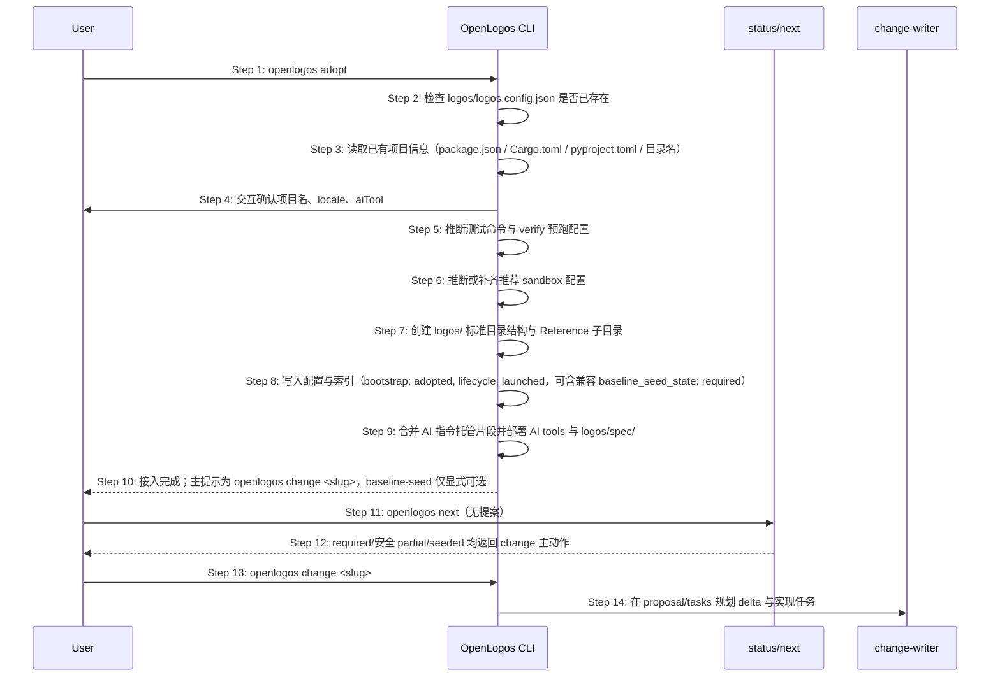
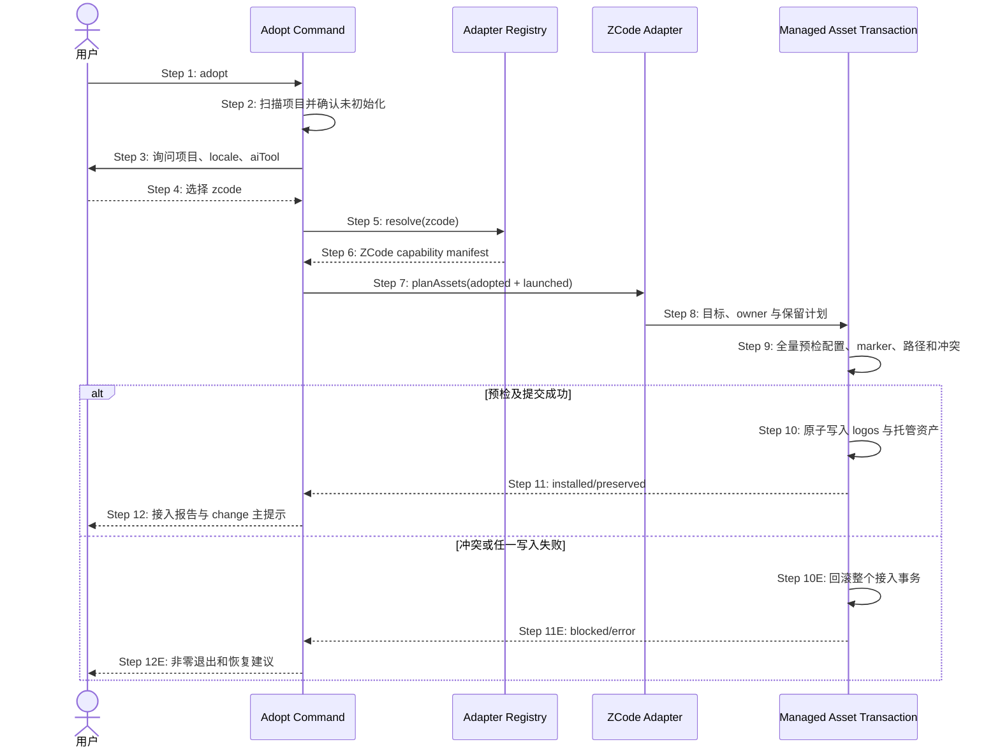
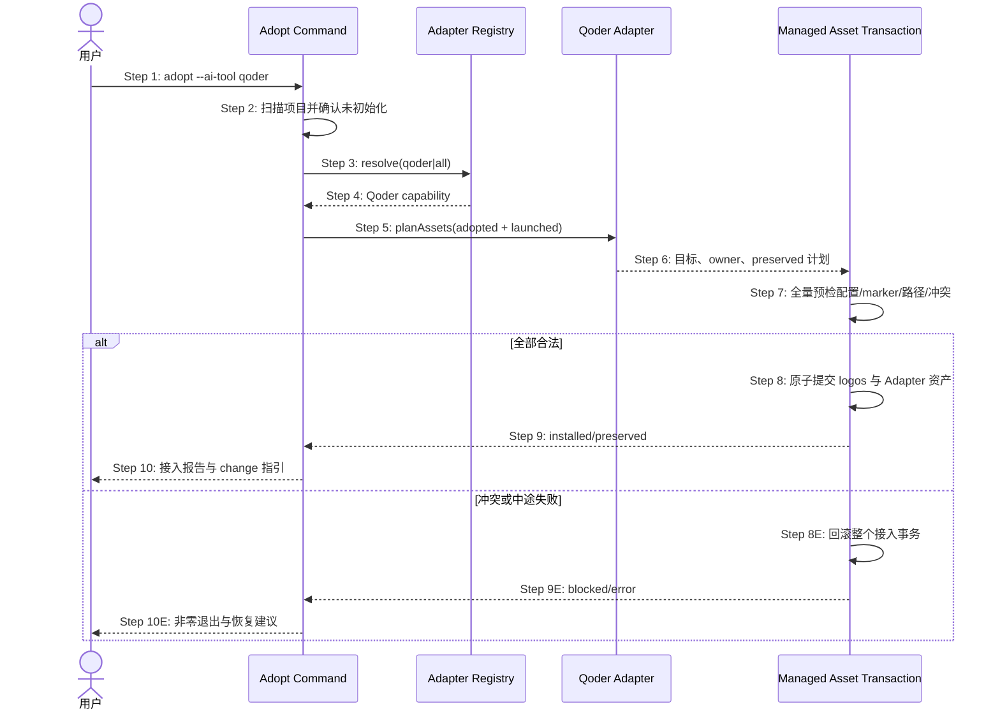
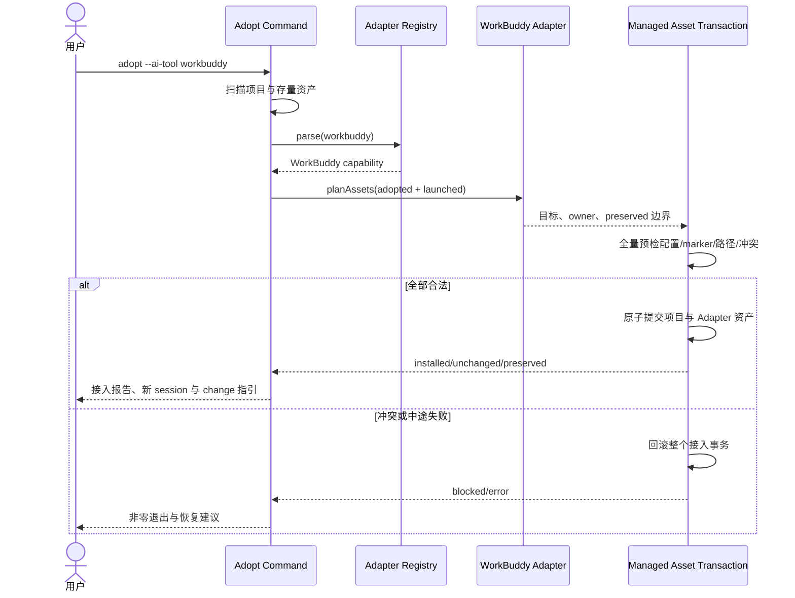
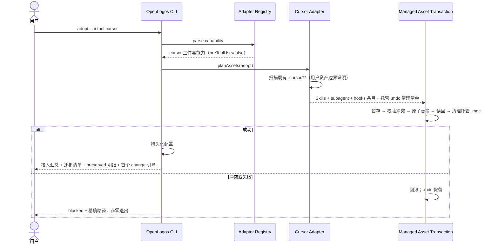

# Delta: core-S20-adopt-existing-project.md

> change: lite-cut2b-remove-baseline-closure
> 目标：`logos/resources/prd/3-technical-plan/2-scenario-implementation/core-S20-adopt-existing-project.md`

本文件的 6 处闭包引用分散在 mermaid 时序图与四个 H2 章节中，其中时序图一处直属 H1、无更细的可寻址章节，故整份以 H1 锚做一次 MODIFY；除这 6 行外逐字节不变。

## MODIFIED — S20: 已有项目接入 OpenLogos — 时序图

> **交接说明**：`adopt` 只做确定性初始化，CLI 本身不启动 AI、不产逆向内容、不声称规格基线已建立。可继续写 `baseline_seed_state: required` 以兼容旧消费者，但 driver 不得因该状态自动派发 `brownfield-adopter`。默认交接对象是首个 change；只有用户或宿主显式选择 eager seed 时才进入 S33。

## 步骤说明
1. **用户**执行 `openlogos adopt`。
2. **CLI** 校验 `logos/logos.config.json` 是否已存在，若已存在则报错退出。
3. **CLI** 扫描当前目录，按优先级读取 `package.json` → `Cargo.toml` → `pyproject.toml` → 目录名，提取项目名称。
4. **CLI** 交互式确认项目名、locale 与 aiTool（有默认值，可直接回车确认）。
5. **CLI** 推断测试命令。Node 项目优先读取 `package.json` 的 `test` 脚本；Python / Go / Rust 项目按常见命令推断。无法推断时记录 TODO。
6. **CLI** 推断或补齐推荐的 `verify.sandbox_mode=auto`、`verify.sandbox_root` 和 `verify.sandbox_deny_workspace_write=true`，但不得覆盖用户已有沙箱配置。
7. **CLI** 创建 `logos/` 标准目录结构（与 `init` 相同）；其中 `logos/resources/reference/` 下必须同时创建 `requirement/`、`todolist/`、`code/`、`image/`、`temp/`、`note/` 子目录，并写入 `.gitkeep`。
8. **CLI** 写入 `logos.config.json` 与 `logos-project.yaml`；`logos.config.json` 包含 `verify.result_path`，并在可推断时包含 verify 预跑命令与推荐沙箱配置；`logos-project.yaml` 中模块 `bootstrap` 为 `adopted`、`lifecycle` 为 `launched`，可保留兼容枚举 `baseline_seed_state: required`。该枚举不是 change gate。
9. **CLI** 写入根目录 AI 指令文件时复用 `init` 的 managed block 合并策略：已有用户内容必须保留；OpenLogos 内容写入或刷新在托管片段内；同时部署 AI 工具资产与 `logos/spec/`。
10. **CLI** 输出接入报告，说明 verify/sandbox 配置结果，并把主提示写成「现在可直接运行 `openlogos change <slug>`；提案将按触达场景补齐规格」。可附显式 `baseline-seed` 预扫选项，但不得把它写成下一步前置。
11. **next/status 读取门**在访问资源、索引或覆盖率前，先在同一模块锁内恢复未终结 seed commit journal。无法恢复时返回 `baseline_commit_in_progress`，不得读取半新集合；安全 open run / staging 则排除后继续。
12. 无未终结 journal 时，`required`、安全 `partial`、`seeded` 均不得改写 next 的 change 主动作；状态只作旁路信息。
13. 用户直接创建首个提案，不需要先运行 S33。
14. change-writer 按变更范围规划唯一 delta tasks；目标缺失时 delta 携带完整新文档，已有目标按章节增量修改。合并时目标集由 `deltas/` 目录派生，模式按目标是否存在即时判定（§2.71）。

## 异常用例
### EX-2.1: 项目已初始化
- **触发条件**：`logos/logos.config.json` 已存在。
- **期望响应**：输出错误并退出，提示该项目已初始化，不覆盖已有文件。
- **副作用**：无文件被修改。

### EX-5.1: 无法推断测试命令
- **触发条件**：已有项目没有可识别测试脚本或测试框架。
- **期望响应**：adopt 成功，但接入报告显示 TODO，提示用户配置 `verify.pre_run_command` 或 `verify.regression_command`，并说明 sandbox 配置仍可按默认推荐值写入。
- **副作用**：不写入虚假的测试命令。

### EX-9.1: AI 指令文件 marker 不完整
- **触发条件**：已有项目的 `AGENTS.md` / `CLAUDE.md` 中只存在 `OPENLOGOS:BEGIN` 或只存在 `OPENLOGOS:END`。
- **期望响应**：adopt 失败并提示用户修复指令文件托管片段边界。
- **副作用**：不得覆盖用户既有 AI 指令文件。

### EX-10.1: adopt 不越权逆向扫描
- **触发条件**：adopt 完成初始化。
- **期望响应**：adopt 不启动 AI、不产任何逆向基线内容、不声称基线已建立；默认提示创建 change。AI 能力缺失不影响 change；显式 seed 才派发 `brownfield-adopter`（见 S33）。
- **副作用**：可保留 `baseline_seed_state: required` 兼容值，但不得据此自动派发或阻断。

### EX-11.1: 安全 partial 与未终结 journal 必须分流
- **触发条件**：adopted 模块存在 seed run。
- **期望响应**：仅 open run / 未提交 staging 时排除 staging，next 仍指向 change并附非阻断重试信息；journal=`prepared|committing` 时先恢复，恢复失败返回 `baseline_commit_in_progress`，不得继续读取 resources/index 或输出 change 建议。
- **副作用**：不把半新资源当权威，不把安全 staging 升格为硬门。

### EX-11.2: 不得把自动 skip 当永久技术结论
- **触发条件**：adopt 自动写入 `skip_phases`，首个 change 实际出现 API/持久化边界。
- **期望响应**：change-writer 必须为真实存在的 HTTP 边界规划 API/编排 delta，不得因接入元数据而略过；缺规格由测试覆盖度在 verify 暴露。
- **副作用**：Initial 阶段豁免保持，launched change 的适用性单独判定。

## S20 存量项目选择 ZCode 的安全接入时序

### 场景目标

存量项目执行 adopt 时可选择 `zcode`，在保留已有根 `AGENTS.md`、`.zcode` 配置与非 OpenLogos 插件的前提下，以同 init 等级的原子事务部署 Registry、ZCode 插件和 guard 基础设施，并保持“接入后可直接 change”的主路径。

### 参与者

- **用户**：确认项目元数据、locale 与 ZCode 宿主。
- **Adopt Command**：扫描存量项目、编排接入事务和输出交接。
- **Adapter Registry**：解析 `zcode`/`all` 并提供资产能力。
- **ZCode Adapter**：规划插件、指令、AGENTS 与 Hooks 资产。
- **Managed Asset Transaction**：保护存量 owner、原子提交或回滚。

### 前置条件

- 当前目录尚无 `logos/logos.config.json`。
- 存量项目可以包含用户 `AGENTS.md`、`.zcode/config.json`、`.zcode` 其它内容或已安装插件。
- 随包 ZCode 模板和共享 Hook runtime 均可读取。

### 成功后置条件

- 配置持久化 `aiTool: zcode`，模块为 `bootstrap: adopted`、`lifecycle: launched`。
- OpenLogos ZCode 资产完整可发现，存量用户资产逐项 preserved。
- 接入报告仍以 `openlogos change <slug>` 为下一主动作，不增加 ZCode 特有前置门。

### 时序图

### 步骤说明

1. 用户在存量项目根执行 adopt。
2. CLI 读取项目事实并拒绝覆盖已初始化项目。
3. 交互选项由 Registry 枚举，ZCode 与既有宿主并列；非交互参数同样接受 `zcode`。
4. 用户选择被规范化为稳定 id，不用自由文本触发宿主分支。
5. Adopt Command 向 Registry 解析单宿主或 `all`。
6. capability manifest 声明 ZCode 支持 init/sync/launch/adopt、AGENTS、插件与 Hooks。
7. adopted 模块直接选 launched 资产变体，不先部署 initial 再覆盖。
8. 计划区分 OpenLogos 托管目标、已存在用户目标和不可安全合并的冲突。
9. 根 AGENTS 必须能安全插入完整 marker 对；现有 `.zcode/config.json` 和非 OpenLogos 插件只读不覆盖。
10. logos 结构、配置、索引、spec 与 Adapter 资产作为一个接入提交单元处理。
11. 成功结果列出 installed、unchanged、preserved；不得把 preserved 误报为 installed。
12. 交接明确 ZCode 需新 session 装载插件，同时保留可直接创建 change 的路径。

### 异常与边界

#### EX-ZC-1：AGENTS marker 不完整

- **触发条件**：根 AGENTS 只有 BEGIN 或 END marker。
- **期望响应**：在任何写入前阻断，给出人工修复路径。
- **副作用**：不得创建半套 logos 或 ZCode 资产。

#### EX-ZC-2：ZCode 目标存在不同 owner

- **触发条件**：OpenLogos 插件 identity 或目标文件名已被非 OpenLogos 资产占用。
- **期望响应**：默认阻断，不覆盖、不改名规避、不删除。
- **副作用**：完整回滚接入事务，用户资产保持字节不变。

#### EX-ZC-3：存量 `.zcode/config.json`

- **触发条件**：项目已有 ZCode 配置，包含用户模型、权限或其它插件配置。
- **期望响应**：不把项目级配置当 Hook 安装点，不改写用户设置；OpenLogos Hooks 随插件交付。
- **副作用**：配置保留结果进入接入报告。

#### EX-ZC-4：接入后首个 change

- **触发条件**：adopt 成功后执行 status/next/change。
- **期望响应**：与其它宿主相同，直接进入首个 change 的规格产出；不得要求先运行 ZCode 专用 seed。
- **副作用**：ZCode 只是宿主能力，不改变 OpenLogos 方法论前沿。

### 追溯

- 需求：S20 ZCode 存量接入、保护与后续 change 可达性。
- 架构：28.2 Adapter Registry、28.3 资产事务、28.5 打包边界。
- 测试：UT-S20-20～UT-S20-26、ST-S20-14～ST-S20-16。

## S20 存量项目选择 Qoder 的安全接入时序

### 场景目标

存量项目选择 `qoder` 后，在保留既有 AGENTS、Qoder settings、非 OpenLogos 插件和未知文件的前提下，以原子事务部署完整 Qoder 资产，并保持接入后可直接创建 change。

### 参与者

- **用户**：确认项目、locale 与 Qoder 宿主。
- **Adopt Command**：扫描存量事实并编排接入。
- **Adapter Registry**：解析 qoder/all 与 capability。
- **Qoder Adapter**：规划 launched 插件与指令。
- **Managed Asset Transaction**：保护 owner、提交或回滚。

### 前置条件

- 当前项目未存在 OpenLogos 配置。
- 项目可包含现有 AGENTS、Qoder settings、用户插件或未知 Qoder 文件。
- 随包模板与共享 runtime 可读。

### 成功后置条件

- 配置为 `aiTool: qoder`，module 为 `bootstrap: adopted`、`lifecycle: launched`。
- OpenLogos Qoder 资产完整，用户资产逐项 preserved。
- 下一主动作仍是 `openlogos change <slug>`，无 Qoder 专用 seed 前置。

### 时序图

### 步骤说明

1. 用户以交互或非交互方式选择 Qoder。
2. Adopt 扫描项目并拒绝覆盖已初始化项目。
3. 宿主选择由 Registry 枚举/解析。
4. capability 声明 Qoder 的 instructions、plugin、组件与 Hook 支持。
5. adopted module 直接选择 launched 变体，不先落 initial 再覆盖。
6. 计划区分 OpenLogos 托管目标、用户目标与不安全冲突。
7. AGENTS marker、Qoder settings/插件 owner、模板和所有目标在首个写入前全量校验。
8. logos、配置、索引、spec 与 Qoder 资产作为同一接入提交单元。
9. 结果区分 installed/unchanged/preserved/blocked。
10. 提示新 Qoder CLI session 装载插件，同时保留 change 主路径。

### 异常与边界

#### EX-QD-S20-1：AGENTS marker 不完整
- **触发条件**：根 AGENTS 仅有一个 OpenLogos marker。
- **期望响应**：任何写入前阻断并指出修复位置。
- **副作用**：不创建半套 logos 或插件。

#### EX-QD-S20-2：Qoder 插件 identity 冲突
- **触发条件**：同名路径属于非 OpenLogos 插件。
- **期望响应**：默认 blocked，不覆盖、删除或改名规避。
- **副作用**：总事务回滚，用户资产不变。

#### EX-QD-S20-3：既有 Qoder settings
- **触发条件**：项目/隔离用户目录已有模型、权限、市场源或插件配置。
- **期望响应**：只读验证并报告 preserved；OpenLogos Hook 由独立插件交付。
- **副作用**：settings 哈希不变。

#### EX-QD-S20-4：接入后首个 change
- **触发条件**：adopt 成功后执行 status/next/change。
- **期望响应**：直接进入既有的首个 change 规格产出，不新增 Qoder 方法论前沿。
- **副作用**：Qoder 仅是宿主能力。

### 追溯

- 需求：S20 Qoder 存量接入验收。
- 架构：29.2 Qoder 资产模型、29.6 资产事务与提交顺序。
- 测试：UT-S20-27～UT-S20-33、ST-S20-17～ST-S20-19。

## S20 WorkBuddy 存量项目安全接入时序

### 场景目标

在不覆盖项目既有指令、WorkBuddy settings、用户插件和原生记忆的前提下，部署 OpenLogos WorkBuddy 插件并直接进入首个 change 主路径。

### 前置与后置条件

- 前置：目录为可接入的存量项目，尚未形成完整 OpenLogos 项目。
- 成功后置：配置持久化 `workbuddy`，adopted + launched 资产一次收敛，用户边界不变。
- 失败后置：logos、配置、索引、spec 和插件作为同一事务回滚。

### 主时序

### 步骤与不变量

1. 宿主选择由 Registry 枚举和解析，配置只持久化规范 id `workbuddy`。
2. adopted module 直接规划 launched 变体，不先落 initial 再覆盖。
3. 首个写入前全量校验项目指令 marker、插件 identity、模板、所有目标和回滚能力。
4. WorkBuddy settings 和原生记忆只作为不可写边界；OpenLogos 不读取个性化记忆内容。
5. 成功提示新 session 装载插件，并继续既有的首个 change 规格产出；WorkBuddy 不引入方法论分叉。

### 异常

- `EX-WB-S20-1`：项目指令托管 marker 残缺时任何写入前阻断。
- `EX-WB-S20-2`：插件路径属于不同 identity 时 blocked，不覆盖或改名规避。
- `EX-WB-S20-3`：已有 settings、用户插件或原生记忆时全部 preserved，前后证据一致。
- `EX-WB-S20-4`：提交中途失败时整个接入事务回滚，不伪造完成状态。

### 追溯

- 需求：S20 WorkBuddy 存量接入验收。
- 架构：30.2 资产模型、30.4 生命周期与事务顺序。
- 测试：UT-S20-34～UT-S20-40、ST-S20-20～ST-S20-22。

## S20 读取门锁获取有界重试补充（fix-baseline-readlock-reader-contention）

> 本节补充「步骤说明」规则 11 的**锁获取时序**语义，与架构 §四.B（补 §4.4）同步。规则 11 的既有文本与语义——读取门先在同一模块锁内恢复未终结 seed commit journal、无法恢复返回 `baseline_commit_in_progress`、不得读取半新集合、安全 open run / staging 排除后继续——**逐字不变**。

### 补充语义

1. **锁获取有界重试**：next/status 等读取门入口（含 `openlogos change` / adopt 后首次读取路径经过的 `readGate` / `withBaselineReadLock` / `withRecoveredReadLocks`）取模块锁时，锁被占不再立即失败，而是按架构 §四.B 有界指数退避重试（默认总预算 2000ms、25ms 起步、单次封顶 400ms；预算与时钟可注入）。
2. **判据**：预算内取到锁 → 走规则 11 既有恢复门逻辑不变；预算耗尽仍被占用 → 按规则 11 返回 `baseline_commit_in_progress`，error envelope 合同不变。
3. **并发只读不假阳性**：无 writer、无未终结 journal 时，并发的只读入口（如 change 入口读取门与并发 status）互相之间不得触发 `baseline_commit_in_progress`；writer 真持锁（seed commit 在飞行）超预算时仍硬阻断，EX-11.1 的分流语义零回退。
4. **写路径不变**：baseline-seed `begin` / `commit` 的 fail-fast 与死锁回收协议不适用重试，逐字保留。

### 追溯

- 需求：AC-READLOCK-01～06；功能规格：§2.54；架构：§四.B。
- 测试：UT-S20-41～UT-S20-42；安装态：SMOKE-core-177。

## S20 存量项目 Cursor 三件套接入与 .mdc 迁移时序

### 场景目标

`adopt --ai-tool cursor` 在保留既有项目指令、用户 rules/skills/hooks 与项目资产的前提下部署三件套资产、完成历史托管 `.mdc` 迁移，并继续引导首个 change。

### 前置与后置条件

- 前置：存量项目（可能已有 `.cursor/rules/` 历史托管 `.mdc`、用户自有 rules 或 hooks.json）。
- 成功后置：三件套资产就位、托管 `.mdc` 已迁移清理、配置持久化，用户资产字节不变，首个 change 引导可达。
- 失败后置：不留半套资产（Skills 已部署但 `.mdc` 未清理、hooks 条目残缺），不伪造接入完成信息。

### 主时序

### 步骤与不变量

1. 既有项目的用户 `.cursor/rules/`（非托管名单）、`.cursor/skills/` 非托管目录、hooks 非托管条目全部保留并逐项计入 preserved。
2. 历史托管 `.mdc`（Skill 名单 + `openlogos-policy.mdc`）在 Skills 部署成功后同一次执行内清理；任何失败路径不提前删除。
3. 冲突判定在首个写入前完成：目标 Skills 目录存在非 OpenLogos 内容、hooks 托管条目身份冲突时 blocked。
4. 接入完成后 `openlogos next` / 首个 change 引导链路与其他宿主一致。

### 异常

- `EX-CU-S20-1`：用户已有同名 `.cursor/skills/<openlogos-skill>/` 非托管内容 → blocked，报告冲突路径，零写入。
- `EX-CU-S20-2`：接入中途失败 → 事务回滚，`.mdc` 保留，配置不持久化，不打印接入成功。
- `EX-CU-S20-3`：hooks.json 不可解析 → blocked，零写入，给出修复建议。

### 追溯

- 需求：S20 Cursor 存量接入验收。
- 架构：46.2 资产模型与 owner、46.5 生命周期与事务顺序。
- 测试：UT-S20-43～UT-S20-48、ST-S20-23～ST-S20-25。

