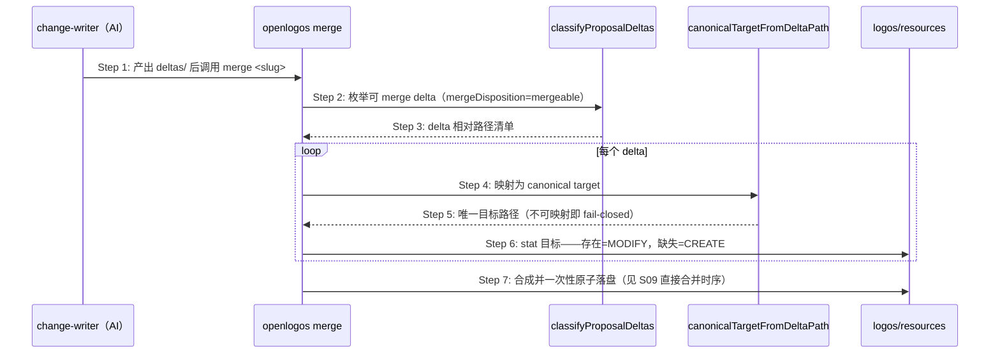
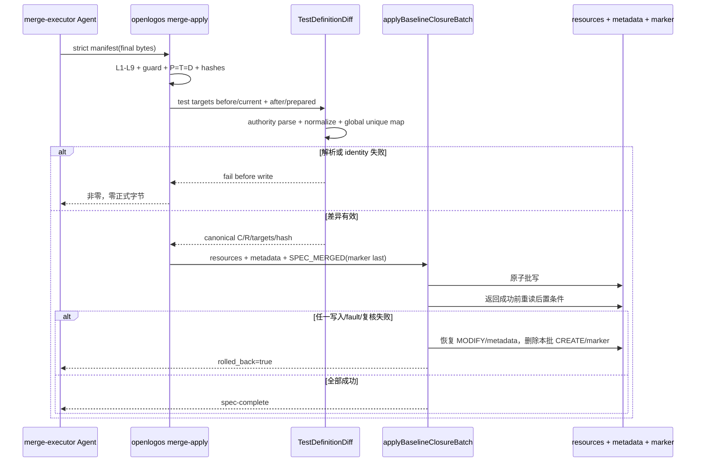
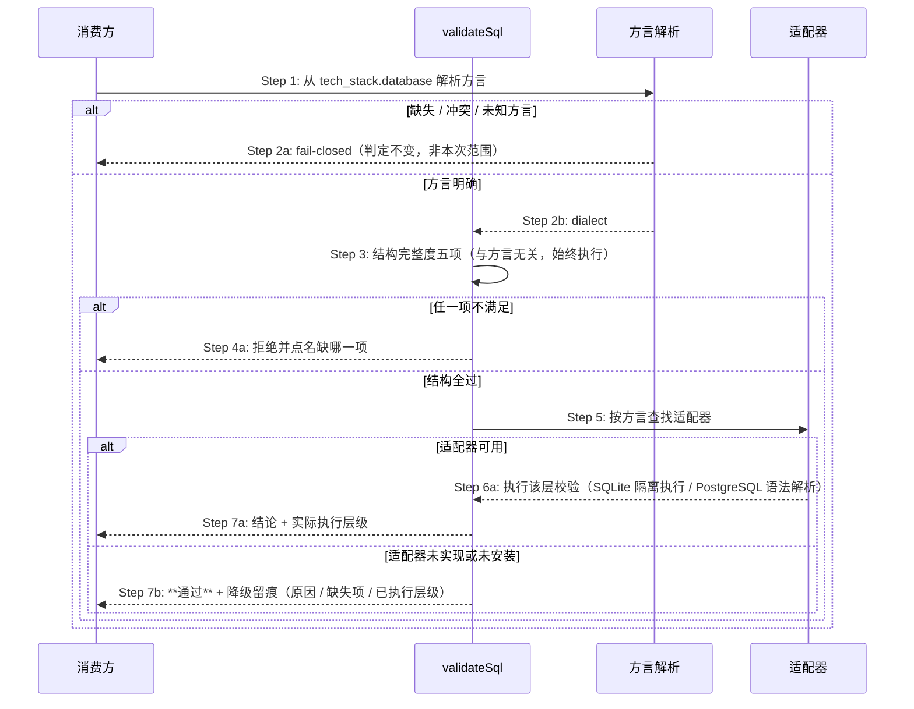

# Delta: core-S39-baseline-on-touch.md

> change: lite-cut2b-remove-baseline-closure
> 目标：`logos/resources/prd/3-technical-plan/2-scenario-implementation/core-S39-baseline-on-touch.md`

本文件的通用 H2（`场景目标`/`参与者`/`异常与边界`/`追溯` 等）与后续子场景的同名 H3 重复，章节锚与路径锚均无法唯一定位，故整份以 H1 锚做一次 MODIFY。保留的两节（测试变更集原子 Apply 扩展、SQL delta 分层校验与适配器路由）逐字节复制；删除的是闭包主体、无环提交闭包补充（其引用的 `MERGE_RECEIPT.json` 已随 lite-cut1b 删除）与勘误散文订正通道。

## MODIFIED — S39：提案规划时按触达目标形成规格闭包

> **本场景已重新定界（lite-cut2b）**：原主体「按触达目标形成规格闭包」随 change-lint L9 删除；
> 现主体为「delta→canonical target 派生」。文档 H1 标题因 delta 机制无法修改文档级标题而暂留旧名，
> 待后续提案统一订正。

## 场景目标

把「合并要处理哪些目标」这一集合，从作者手工枚举的闭包计划，改为 `deltas/` 目录的无逻辑投影：产出了哪些 delta，就合并哪些目标。集合不需要声明，只需要枚举。

## 用户价值

作者不再需要预测「本次改动波及哪些规格」，也不再需要为每个触达场景补齐四维目标与证据化 disposition。规格是否波及完整，由 `openlogos verify` 的 ID 覆盖检查在验收时暴露——那是机器天然知道的事实，而非人的预测。

## 参与者

| 角色 | 职责 |
|---|---|
| change-writer（AI） | 按变更范围产出 `deltas/` 下的 delta 文件 |
| `classifyProposalDeltas` | 可 merge delta 的枚举判据（与 change-lint L6 同源） |
| `canonicalTargetFromDeltaPath` | delta 相对路径 → 唯一 canonical target 的映射判据 |
| `openlogos merge` | 目标集的唯一消费者，模式按磁盘事实即时判定 |

## 前置条件

`[delta]` 已产出；`logos/resources/` 工作区干净。**不需要**任何闭包声明。

## 成功后置条件

每个可 merge delta 恰好对应一个 canonical target；目标存在的按 MODIFY 合并、缺失的按 CREATE 落盘；`proposal.md` 的任何 YAML 声明均未被读取。

## 时序图

## 步骤说明

1. **change-writer** 按变更范围产出 delta，不写任何闭包声明。
2. **merge** 经共享分类器枚举可 merge delta——路径枚举、隐藏规则、symlink containment 只在 `delta-classify` 实现一次，change-lint L6 与 merge 同源。
3. 分类器返回 delta 相对路径清单；IO 错误 fail-fast，绝不把不可读产物投影成空清单。
4. 逐 delta 经 `canonicalTargetFromDeltaPath` 映射为唯一 canonical target。
5. 不可映射（绝对路径、`..`、symlink escape、未知类别目录）即在写入任何文件前整体失败并点名该文件。
6. 模式按磁盘事实即时判定：目标存在为 MODIFY、缺失为 CREATE。**计划与事实不再是两份数据**，因此不存在需要对账的不一致，也不存在「plan 后目标被外部创建」的模式漂移。
7. 合成与落盘见 S09「merge 直接合并时序」。

## 异常与边界

### EX-39.1：delta 路径不可映射为 canonical target
- **触发条件**：绝对路径、`..` 上跳、symlink 越界、未知类别目录。
- **期望响应**：在写入任何文件前整体失败并点名该 delta 文件；`logos/resources/` 零改动。判据与 change-lint L6 同源，不新增第二份。
- **副作用**：无。

### EX-39.2：两个 delta 映射到同一 canonical target
- **触发条件**：路径别名（`./`、分隔符差异）经规范化后指向同一目标。
- **期望响应**：拒绝并点名两个 delta 文件——顺序应用下后写会覆盖前写。
- **副作用**：无。

### EX-39.3：存量提案仍带 baseline_closure 块
- **触发条件**：历史提案的 `proposal.md` 含 `## 基线闭包计划` 与其 YAML。
- **期望响应**：忽略而非报错，不解析、不校验、不迁移；merge 照常按 `deltas/` 派生目标集。
- **副作用**：无。

## API 与数据库派生结论

API / DB canonical target 不是 Markdown 章节文档：其 delta 首行为控制标记、正文即最终字节，由 `validateAndStripNonMarkdownDelta` 做标记校验与剥离后整文件落盘。该协议与闭包规划无关，逐行保留；其在 change-lint 中的挂载点由 L9 迁至 **L4（delta 段标记与脱模板）**。

## 非目标与安全边界

- 不新增命令、不新增 lifecycle/gate/marker。
- 不引入任何形式的「确认」机制（无 `verified` / `confirmed_*` / JIT advisory）。
- 不放宽路径安全判据：越界、`..`、symlink escape 一律拒绝。
- 不承担「规格是否波及完整」的判定——那由 `openlogos verify` 的 ID 覆盖检查负责。

## 追溯

- 需求：merge 目标集由 delta 文件派生要求。
- 功能规格：§2.71。
- 测试：UT-S39-03～06、UT-S39-26～27、UT-S39-68～69、ST-S39-13、ST-S39-30。

## 测试变更集原子 Apply 扩展

### 场景目标

当 baseline closure 批次触及正式测试规格时，`merge-apply` 在自身掌握 before/final 字节的唯一安全时点计算语义 changed/removed ID，并与 resources、metadata、`SPEC_MERGED` 全有或全无提交。

### 参与者

- 用户授权的 merge-executor Agent
- `openlogos merge-apply`
- BaselineClosurePlan / strict apply manifest
- TestDefinitionDiff / TestChangeSetReader
- `applyBaselineClosureBatch()`
- 正式测试 resources、metadata 与提案 marker

### 前置条件

- plan/spec L1～L9 全过，P=T=D。
- `MERGE_APPLY_MANIFEST.json` 严格符合 `openlogos/baseline-merge-apply@1`，每个 prepared target 的 source/before/final hash 已校验。
- `SPEC_MERGED` 不存在，guard 与 slug/module 匹配。

### 成功后置条件

- 所有正式目标和 metadata 等于 prepared final bytes。
- `SPEC_MERGED.test_change_set` 符合 `openlogos/test-change-set@1`，C/R 与 before/final 结构化差异一致。
- marker 中 `manifest_sha256` 继续绑定严格 apply manifest；change-set target identity 与 category=test 的 canonical targets 一致。
- 重启后无需 Git 即可读得相同 C/R。

### 步骤说明

1. 根据 BaselineClosurePlan 确定 category=`test` 的 canonical targets；严格 manifest 本身不增加字段。
2. MODIFY 从当前正式目标读取 before；CREATE 使用空前态；after 使用已校验 `content_base64` 最终字节。
3. 在所有 targets 的 before/after 上建立全局唯一测试记录映射，计算新增、修改、未变与删除。
4. 生成严格字段、ASCII 排序、无时间戳、带 canonical payload hash 的 change set。
5. 构造包含 change set 的完整 `SPEC_MERGED` 字节，并作为批事务最后一个 prepared input。
6. 写入后重读 test targets 与 marker，复核 after hashes、payload hash、change/module、target identity 和 apply-manifest 绑定。
7. 只有后置条件全部成立才报告成功；否则使用事务备份回滚。

### 异常与边界

- 前/后任一侧重复 ID：首写前失败，不采用“最后一行获胜”。
- 非法 UTF-8、表格结构歧义、escaped pipe 解析失败：首写前失败。
- before_sha256 在 Agent 准备 manifest 后漂移：拒绝，不用新磁盘内容静默重算。
- 只触及非 test targets：仍写合法空 C/R 与空 targets，使“无测试变化”和“事实缺失”可区分。
- no-delta merge 不走本批 apply；reader 仅在 marker 类型正确且磁盘确无 mergeable delta 时可信派生空 C/R。
- 事后人为修改正式测试 target 导致 after hash 漂移：后续 reader fail-closed，不从 Delta 重建。
- 不依赖 Git repository、commit、parent、branch、squash 或 rebase 状态。

### 追溯

- 需求：S32/S39 测试变更 ID 语义差异与持久化要求。
- 功能规格：§2.37.1～§2.37.3。
- 架构：§27.3～§27.6。
- 规范：`spec/baseline-closure.md` §18、`spec/test-slice-manifest.md`。
- 测试：UT-S39-33～UT-S39-38、ST-S39-17～ST-S39-19。

## S39 SQL delta 的分层校验与适配器路由

### 场景目标

让 non-Markdown SQL delta 的校验按「结构层 + 方言层」分开：结构层始终执行且与方言无关；方言层按本机可用适配器路由，不可用时降级为跳过并留痕，绝不阻断交付。

### 参与者与前置条件

| 别名 | 组件 | 说明 |
|---|---|---|
| C | 消费方 | change-lint L9 / merge / baseline-apply 三处 |
| V | `validateSql` | SQL delta 校验的唯一判定 |
| R | 方言解析 | 从 `tech_stack.database` 解析方言，缺失/冲突/未知 fail-closed |
| A | 适配器 | SQLite：`sqlite3` 二进制；PostgreSQL：libpg_query WASM |

前置：delta 首行 marker 合法、payload 已剥离、canonical target 落在 `logos/resources/database/**` 且扩展名为 `.sql`。

### 主时序

### 步骤说明

- **Step 3 始终执行**：五项结构检查源码中不引用 `dialect`，本就与方言无关。此前实现亦如此——错误逐级前进正是证据。
- **Step 5 是查找，不是假定**：SQLite 分支此前已经先 `spawnSync` 再判断可用性；非 SQLite 分支此前直接假定不可用并 early return。本次把「先查找」统一到全部方言。
- **Step 7b 是通过而非失败**：适配器未实现（PostgreSQL 之外的方言）与未安装（`sqlite3` 缺失）都走这里。交付照常推进（架构 §四十二.1）。
- **Step 7a/7b 都携带层级**：结论必须自述实际执行到哪一层，消费方据此如实呈现（架构 §四十二.2）。

### 方言路由与强度

| 方言 | 适配器 | 执行层级 |
|---|---|---|
| SQLite | `sqlite3` 二进制 | 隔离执行：`BEGIN` → payload → 表/索引计数 → `ROLLBACK` |
| PostgreSQL | libpg_query WASM | 语法解析（AST），不执行、不连库 |
| MySQL | 无 | 仅结构 + 留痕 |
| 上述任一但适配器不可用 | — | 仅结构 + 留痕 |

**PostgreSQL 得到的是语法级而非执行级**——它不会发现「引用了不存在的表」这类只有执行才能发现的问题。此不对称由 Step 7a 的层级自述如实反映。

### 跨方言冒充禁止

- PostgreSQL / MySQL payload **绝不**进入 sqlite 执行路径；
- 降级是**不执行方言层**，而非改用别的方言执行；
- 不存在「用 SQLite 兜底」这一路径。

既有 `UT-S39-27`（用例名「不冒充通过」）锁的正是此意图，但实现方式是「必须硬失败」。本场景将其改写为正向断言：断言 PG/MySQL payload 未被送入 sqlite 校验器，而非断言它必然失败。

### 不变量

1. **结构层无条件**：五项检查在全部方言、全部适配器可用性下一致生效。
2. **能力缺失只降级**：适配器不可用只能降低层级，不得改变通过与否（架构 §四十二.1）。
3. **层级如实自述**：结论必须携带实际执行层级；不得以结构检查冒充方言校验（架构 §四十二.2）。
4. **不跨方言冒充**：任何 payload 不得送入其它方言的校验器。
5. **三消费方同源**：change-lint、merge、baseline-apply 对同一 payload 与方言得到同一层级结论与同一留痕。

### 异常与边界

- 方言缺失、冲突或未知：维持既有 fail-closed，本次不改——那是提案缺陷而非能力缺失。
- 适配器可用但校验失败（如 PG 语法错误）：正当拒绝，点名错误位置。
- 适配器加载本身抛错：按「未安装」处理，降级并把错误信息计入留痕的缺失项。

### 追溯

- 需求：AC-SQLGATE-01～07。
- 功能规格：§2.52.2～§2.52.6；架构：§四十二.1、§四十二.2。
- 测试：UT-S39-59～UT-S39-64、ST-S39-28；安装态 SMOKE-core-174。

