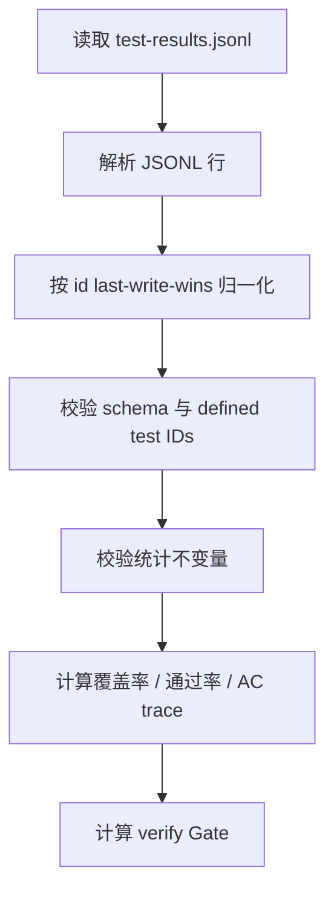
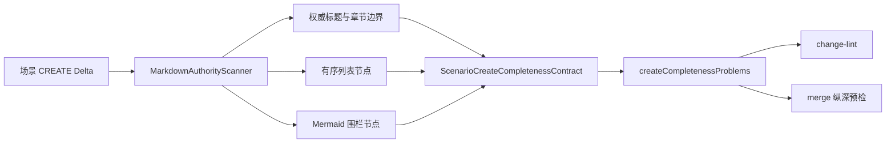
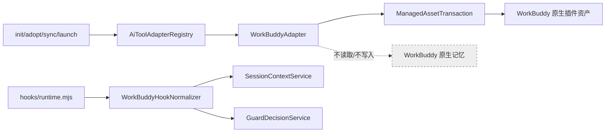
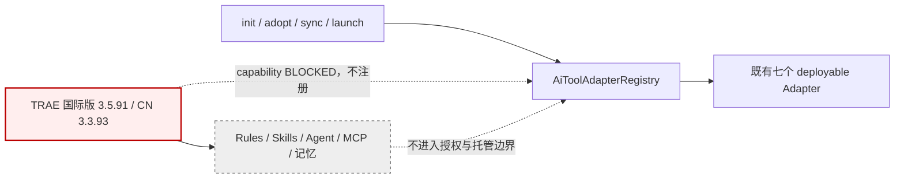
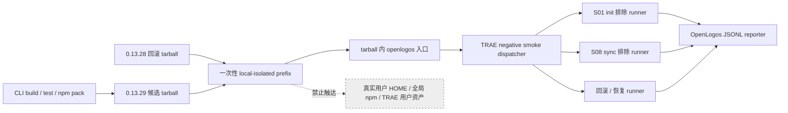
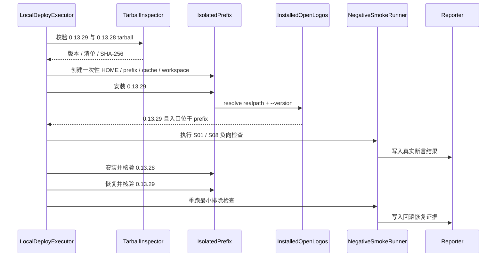
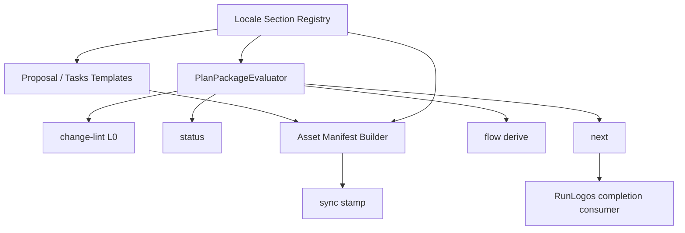
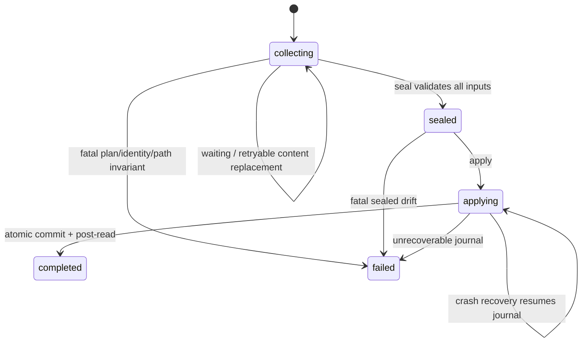
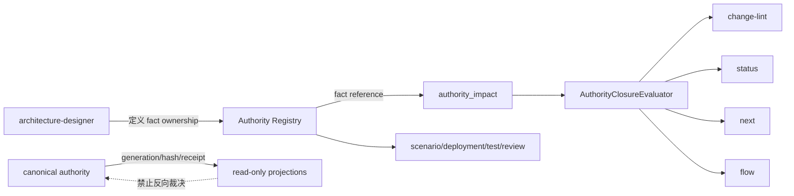

# core-01-architecture-overview

## 一、架构总览
OpenLogos 由 CLI、规范源码、Skills、插件模板、静态文档站和示例项目组成。

## 二、系统组件
- `cli/`：核心命令、阶段判断逻辑、AI 工具资产同步逻辑和插件模板部署逻辑。
- `spec/`：方法论规范源码。
- `skills/`：OpenLogos 方法论 Skills 源码。
- `plugin/`、`plugin-codex/`、`plugin-opencode/`：宿主工具插件模板；其中 OpenLogos 官方插件只承载 OpenLogos 方法论技能。
- `website/`：文档站。
- `logos/resources/`：项目内真相源。
- 用户项目中的 `.agents/plugins/`、`.claude/skills/`、项目独立插件目录：项目 / 产品 / 仓库专属 Skill 的归属位置，不属于 OpenLogos 官方方法论命名空间。

## 三、技术选型
- 语言：TypeScript。
- CLI 运行时：Node.js。
- 文档站：Astro。
- 输出策略：文本 + JSON envelope。

## 四、部署约束
- CLI 与文档站可独立发布。
- 不依赖业务数据库。
- 主要外部依赖是宿主 AI 工具、npm 发布和站点托管。

## 五、非功能性约束
- 阶段判断必须确定性。
- 索引同步必须幂等。
- 变更门禁必须可追溯。
- 测试命令执行必须可选沙箱化，且沙箱结果必须可诊断、可降级、可强制失败。

## 六、项目索引目标
`logos/logos-project.yaml` 应明确：
- `tech_stack`
- `modules`
- `scenario_counter`
- `scenarios`（可选 `feature` 归属字段，见「二十、feature 功能分组模型层」）
- `feature_counter`（可选，AI 维护，仿 `scenario_counter`）
- `features`（可选，feature 分组注册表）
- `deployment_gates`
- `resource_index`

## 七、实现映射
| 场景 | 主要代码路径 | 主要测试路径 |
|------|-------------|-------------|
| S01 | `cli/src/commands/init.ts` | `cli/test/s01-init.test.ts` |
| S05 | `cli/src/commands/next.ts`、`cli/src/lib/flow-derive.ts` | `cli/test/s05-next.test.ts`、`cli/test/s11-flow-derive.test.ts` |
| S08 | `cli/src/commands/sync.ts` | `cli/test/s08-sync.test.ts` |
| S09 | `cli/src/commands/change.ts`、`merge.ts`、`archive.ts`、`cli/src/lib/proposal-lifecycle.ts`、`cli/src/lib/flow-derive.ts` | `cli/test/s09-change.test.ts`、`cli/test/s09-flow-derive-launched.test.ts` |
| S11 | `cli/src/commands/status.ts`、`cli/src/lib/proposal-lifecycle.ts`、`cli/src/lib/flow-derive.ts` | `cli/test/s11-status.test.ts`、`cli/test/s11-flow-derive.test.ts`、`cli/test/s09-flow-derive-launched.test.ts` |
| S13 | `cli/src/commands/verify.ts` | `cli/test/s13-verify.test.ts` |
| S14 | `cli/src/commands/launch.ts` | `cli/test/s14-launch.test.ts` |
| S15 | `cli/src/lib/sql-comments.ts` | `cli/test/s15-sql-comments.test.ts` |
| S16 | `cli/src/lib/json-output.ts` | `cli/test/s16-json-output.test.ts` |
| S17 | `cli/src/commands/module.ts` | `cli/test/s17-module.test.ts` |
| S18 | `cli/src/lib/sync-resource-index.ts` | `cli/test/s18-sync-resource-index.test.ts` |
| S19 | `cli/src/commands/smoke.ts` | `cli/test/s19-smoke.test.ts` |
| S20 | `cli/src/commands/adopt.ts` | `cli/test/s20-adopt.test.ts` |
| S21 | `cli/src/commands/deploy-done.ts` | `cli/test/s21-deploy-done.test.ts` |
| S22 | `cli/src/lib/flow.ts`、`cli/src/commands/flow.ts` | `cli/test/s22-flow.test.ts` |
| S23 | `cli/src/commands/watch.ts`（轮询 `collectStatusData`） | `cli/test/s23-watch.test.ts` |
| S24 | `cli/src/commands/next.ts`、`cli/src/lib/flow-derive.ts`（gate 查询助手） | `cli/test/s24-auto-gate.test.ts` |
| S25 | `cli/src/lib/flow-derive.ts`（三入口接入 resolved）、`cli/src/lib/flow.ts`（applyOverlay 校验）、`cli/src/commands/{status,next,watch}.ts`（node 级视图 / 错误信封） | `cli/test/s25-overlay-derive.test.ts` |
| S26 | `cli/src/lib/flow-cmd.ts`（cmd 求值器）、`cli/src/lib/flow.ts`（cmd_timeout schema + FlowErrorCode）、`cli/src/lib/flow-overlay-derive.ts`（pending 态 + 校验）、`cli/src/commands/{next,status,watch}.ts` | `cli/test/s26-cmd-predicate.test.ts` |
| S27 | `cli/src/lib/flow.ts`（overlay `set-loop` + loop schema 校验）、`cli/src/lib/flow-loop-derive.ts`（读 `LOOP_ITERS` + resolved loop → `loop_state`）、`cli/src/lib/flow-overlay-derive.ts` / `flow-derive.ts`（未收敛不推进）、`cli/src/commands/verify.ts`（写 `LOOP_ITERS` 账本）、`cli/src/commands/{next,status,watch}.ts`、`cli/src/i18n.ts` | `cli/test/s27-loop-iterate.test.ts` |
| S28 | `cli/src/lib/flow-derive.ts`（新增 `PHASE_KEY_TO_NODE_ID` + `resolveNextNode`，复用 `flow-overlay-derive.ts` 导出的 `STEP_TO_CURRENT_BUILTIN`）、`cli/src/commands/next.ts`（输出 `next_node` + 文本展示）、`cli/src/i18n.ts` | `cli/test/s28-next-node.test.ts` |
| S29 | `cli/src/lib/flow.ts`（`set-loop` 的 `set` 白名单扩入 `exhausted_gate` + 子结构校验、node 解析 `coverage_threshold`）、`cli/src/lib/flow-loop-derive.ts`（`loop_state` 派生 `exhausted_skippable`）、`cli/src/lib/flow-derive.ts`（fan-out 覆盖 `coverage_threshold` 判 done）、`cli/src/commands/next.ts`（`--auto` 在 `escalated && exhausted_skippable` 放行退出 gate） | `cli/test/s29-gate-fanout-loop.test.ts` |
| S30 | `cli/src/lib/flow.ts`（overlay `modify` 的 `(节点,字段)` cmd: 精确白名单 + 决策 B 双 cmd: + 空命令 + F·loop 正交校验）、`cli/src/lib/flow-derive.ts`（`markerName` 容忍 cmd:、`extractLaunchedMarkers` per-field 标 cmd-gate、`detectProposalStepViaFlow` 改 cmd-aware）、`cli/src/lib/flow-overlay-derive.ts`（内部 `pending_cmd` 扩到 builtin gate、派生 JSON 字段 `cmd_gate`、budget=1 共享）、`cli/src/commands/next.ts`（builtin gate cmd 求值入 budget=1 + 回灌 detection + 瞬态 proposal_step + `next_node` R3）、`cli/src/commands/{status,watch}.ts`（输出 `cmd_gate`、停门前、observe 不执行）、`cli/src/lib/flow-cmd.ts`（S26 求值器复用，不改） | `cli/test/s30-cmd-builtin-gate.test.ts` |

## 八、提案级部署决策架构
部署门禁分为两层：
- **模块级默认值**：`logos-project.yaml` 中 `modules[].deployment_required`、`modules[].smoke_required` 和 `deployment_gates` 描述模块在 Initial / launch 阶段的默认部署要求。
- **提案级决策**：活跃提案的 `proposal.md` 与 `tasks.md` 描述本次变更是否真的需要部署与 smoke。

运行态优先级：
1. 存在活跃提案时，`status` / `next` / JSON 输出优先读取提案级部署决策。
2. 提案级声明无需部署且无 `[deploy]` section 时，verify PASS 后进入 `verify-passed`，下一步为 archive。
3. 提案级声明需要部署且存在 `[deploy]` section 时，verify PASS 后进入 `ready-to-deploy`。
4. 部署完成后，只有提案级 `smoke_required: true` 才进入 `ready-to-smoke`。
5. 历史提案缺少结构化部署决策时，CLI 可回退到 `[deploy]` section 和模块级默认值，但必须标注 `deployment_decision_source`。

实现映射补充：
| 能力 | 主要代码路径 | 主要测试路径 |
|------|-------------|-------------|
| 提案级部署决策解析 | `cli/src/commands/status.ts`、`cli/src/commands/next.ts` | `cli/test/s05-next.test.ts`、`cli/test/s11-status.test.ts` |
| 提案模板部署影响字段 | `cli/src/i18n.ts`、`cli/src/commands/change.ts` | `cli/test/s09-change.test.ts` |
| JSON 输出部署决策 | `cli/src/commands/status.ts`、`cli/src/lib/json-output.ts` | `cli/test/s16-json-output.test.ts` |

## 八.A AI Skill 命名空间边界架构

OpenLogos 的 AI 资产同步由“官方方法论插件”和“项目专属技能”两条边界组成。

### Codex repo marketplace

Codex 新版推荐部署结构：

```text
<user-project>/
├── .agents/
│   ├── plugins/
│   │   ├── marketplace.json
│   │   ├── openlogos/
│   │   │   ├── .codex-plugin/plugin.json
│   │   │   ├── hooks/session-start.sh
│   │   │   └── skills/<openlogos-skill>/SKILL.md
│   │   └── <project-plugin>/
│   │       └── skills/<project-skill>/SKILL.md
│   └── skills/
│       └── <legacy-or-local-project-skill>/SKILL.md
├── .codex/
│   └── config.toml
└── AGENTS.md
```

规则：
1. `openlogos` 插件命名空间只由 OpenLogos CLI 维护，只包含 OpenLogos 方法论技能、OpenLogos SessionStart hook 和 OpenLogos 上下文注入逻辑。
2. 项目专属技能必须保留在项目插件命名空间或 repo-scoped local skill 目录；未知 skill 默认按项目资产处理。
3. `.agents/plugins/marketplace.json` 是 repo marketplace 入口，用于声明 `openlogos` 插件与项目插件并存；`sync` 可刷新 OpenLogos 条目，不删除或改写项目插件条目。
4. 历史 `.codex-plugin/` 继续作为兼容路径；迁移时只迁移 OpenLogos 自有资产，不吸收未知 `.agents/skills/*`。

### Claude Code 边界

Claude Code 中 OpenLogos 官方插件只承载 OpenLogos 方法论技能、guard 和 hook。项目专属技能推荐位于：

```text
<user-project>/
├── .claude/
│   └── skills/<project-skill>/SKILL.md
└── plugin/
    └── <project-plugin>/skills/<project-skill>/SKILL.md
```

规则：
1. OpenLogos 官方 Claude 插件不得把 `.claude/skills/*` 项目技能复制到 OpenLogos 插件 `plugin/skills`。
2. 项目插件若需要分发，应使用项目自己的命名空间，例如 `/adcn:release-guard`，不得使用 `/openlogos:*`。
3. `CLAUDE.md` managed block 负责说明边界，不负责重排项目技能目录。

### 实现映射补充

| 能力 | 主要代码路径 | 主要测试路径 |
|------|-------------|-------------|
| Codex repo marketplace 生成与兼容迁移 | `cli/src/commands/init.ts`、`cli/src/commands/sync.ts`、`plugin-codex/`、`.codex-plugin/` | `cli/test/s01-init.test.ts`、`cli/test/s08-sync.test.ts` |
| OpenLogos / 项目 Skill 归属判定 | `cli/src/commands/init.ts`、`cli/src/commands/sync.ts` | `cli/test/s01-init.test.ts`、`cli/test/s08-sync.test.ts` |
| Claude Code 项目技能边界说明 | `cli/src/commands/init.ts`、`cli/src/commands/sync.ts`、`cli/src/commands/launch.ts`、`plugin/` | `cli/test/s01-init.test.ts`、`cli/test/s08-sync.test.ts`、`cli/test/s14-launch.test.ts` |
| 生成文档与官网同步 | `spec/agents-md.md`、`spec/codex-plugin.md`、`website/` | `cli/test/s01-init.test.ts`、`cli/test/s08-sync.test.ts`、发布 smoke |

### 不变量
- 无项目专属 skill 的项目，生成的 OpenLogos 方法论体验应保持兼容。
- 已有项目专属 skill 的项目，执行 `init --ai-tool`、`sync` 或 `launch` 后，项目 skill 的路径、命名空间和内容不得被 OpenLogos 托管逻辑重写。
- AI 工具运行时上下文必须能表达“OpenLogos 方法论规则”和“当前仓库规则”的区别；若两者同时存在，项目规则可补充具体工程约束，但不得删除或绕过 OpenLogos 变更管理门禁。

## 九、verify 预执行架构
verify 预执行由 CLI 统一编排，RunLogos 等客户端只调用 `openlogos verify --format json`，不复制测试编排逻辑。

配置优先级：
1. 若配置 `verify.regression_command` 或 `verify.incremental_command`，启用两阶段模型。
2. 若未配置两阶段命令但配置 `verify.pre_run_command`，执行旧的单阶段全量测试模型。
3. 若均未配置，verify 保持兼容，直接读取现有 `verify.result_path`；覆盖不足时输出诊断与修复建议。

结果路径：
- `verify.result_path`：最终验收读取的逻辑结果路径。
- `verify.regression_result_path`：回归阶段结果路径，可选。
- `verify.incremental_result_path`：增量阶段结果路径，可选。
- 未配置阶段路径时，CLI 需要通过临时快照或等价机制避免增量阶段 reporter 清空回归结果。

合并策略：
- 默认 `last-write-wins`，同一用例 ID 以最后一次阶段结果生效。
- 合并结果写入 `verify.result_path`，供现有 `collectVerifyData` / 报告生成逻辑复用。
- 预跑命令状态、合并来源和诊断进入 `VerifyData` 与 JSON 输出。

实现映射补充：
| 能力 | 主要代码路径 | 主要测试路径 |
|------|-------------|-------------|
| verify 预执行与结果合并 | `cli/src/commands/verify.ts` | `cli/test/s13-verify.test.ts` |
| 初始化预跑配置推断 | `cli/src/commands/init.ts` | `cli/test/s01-init.test.ts` |
| sync 预跑配置补齐 | `cli/src/commands/sync.ts` | `cli/test/s08-sync.test.ts` |
| adopt 预跑配置推断 | `cli/src/commands/adopt.ts` | `cli/test/s20-adopt.test.ts` |
| verify JSON 预跑状态 | `cli/src/commands/verify.ts`、`cli/src/lib/json-output.ts` | `cli/test/s16-json-output.test.ts` |

## 九.A verify 结果账本一致性架构

verify 结果汇总在 `cli/src/commands/verify.ts` 中增加一致性校验层，位于 JSONL 解析 / last-write-wins 归一化之后、Gate 判定与报告写入之前。

### 数据流



### 一致性校验职责

1. `parseJsonl` 或其后置归一化逻辑必须区分“可用于统计的合法结果”和“需要诊断的非法结果”，不得把非法 `status` 结果作为已执行但既非 pass / fail / skip 的幽灵行放入 PASS 路径。
2. `collectVerifyData` 必须获得以下诊断输入：
   - `invalid_result_lines`：不可解析 JSON、缺少 `id` / `status`、非法 `status`、`fail` 缺少 `error`；
   - `unknown_result_ids`：结果 ID 不属于已定义自动化用例；
   - `manual_result_ids`：结果 ID 对应 `[manual]` 用例；
   - `count_mismatches`：`passed + failed + skipped != executed`、`executed > defined`、`pass_rate < 100` 但无失败 / 跳过解释等。
3. `VerifyData` JSON 输出应增加可选 `consistency` 字段：
   ```json
   {
     "ok": false,
     "reasons": ["invalid_test_result_status", "unknown_test_result_id"],
     "unknown_result_ids": ["UT-S13-GHOST"],
     "invalid_results": [{"line": 2, "id": "UT-S13-X", "reason": "invalid_status"}],
     "count_mismatches": ["passed_failed_skipped_ne_executed"]
   }
   ```
4. 当 `consistency.ok === false` 时，`gate.result` 必须为 `FAIL`，`gate.reason` 必须为 `result_ledger_inconsistent` 或更具体的首个一致性错误码。

### 实现映射补充

| 能力 | 主要代码路径 | 主要测试路径 |
|------|-------------|-------------|
| verify JSONL schema 与结果账本一致性 | `cli/src/commands/verify.ts` | `cli/test/s13-verify.test.ts` |
| verify JSON consistency 字段稳定输出 | `cli/src/commands/verify.ts`、`cli/src/lib/json-output.ts` | `cli/test/s16-json-output.test.ts` |

### 兼容性

- 合法结果的 last-write-wins 行为保持不变。
- 没有非法行、没有未定义 ID、全部自动化用例通过的项目输出仍保持 PASS。
- 新增 `consistency` 字段是向后兼容字段；旧客户端可继续读取 `gate`，新客户端可用 `consistency` 展示更精确诊断。

## 十、verify / smoke 沙箱执行架构
OpenLogos CLI 需要在运行时层面支持测试命令隔离，避免外部测试脚本误写工作区。

### 配置优先级
1. `logos.config.json.verify.sandbox_mode` / `logos.config.json.smoke.sandbox_mode`
2. `sandbox_root`
3. `sandbox_deny_workspace_write`
4. 既有预跑 / smoke 命令配置

### 执行边界
- `verify` 与 `smoke` 的沙箱执行是 CLI 责任，不由外部客户端复制。
- 沙箱执行器只能回收配置声明的结果文件和报告文件。
- `always` 模式下，任何非白名单写入都应视为安全违规并导致失败。
- `auto` 模式下，若当前平台无法提供有效隔离，CLI 必须输出告警并在 JSON 中标记降级。

### 实现映射补充
| 能力 | 主要代码路径 | 主要测试路径 |
|------|-------------|-------------|
| verify 沙箱执行与结果回收 | `cli/src/commands/verify.ts`、`cli/src/lib/sandbox.ts`（新增） | `cli/test/s13-verify.test.ts`、`cli/test/s16-json-output.test.ts` |
| smoke 沙箱执行与结果回收 | `cli/src/commands/smoke.ts`、`website/scripts/smoke-releases.mjs` | `cli/test/s19-smoke.test.ts` |
| verify / smoke 沙箱配置同步 | `cli/src/commands/init.ts`、`cli/src/commands/adopt.ts`、`cli/src/commands/sync.ts` | `cli/test/s01-init.test.ts`、`cli/test/s20-adopt.test.ts`、`cli/test/s08-sync.test.ts` |
| 沙箱 JSON 诊断 | `cli/src/lib/json-output.ts`、`cli/src/commands/verify.ts`、`cli/src/commands/smoke.ts` | `cli/test/s16-json-output.test.ts` |

## 十一、DEPLOY_DONE 受控落标架构

部署完成状态由三类事实共同决定：

1. `VERIFY_PASS`：由 `openlogos verify` 根据验收门禁自动写入。
2. `[deploy]` section：由当前提案 `tasks.md` 描述部署执行任务，并由 `openlogos deploy-done` 成功后统一勾选。
3. `DEPLOY_DONE`：由 `openlogos deploy-done` 在前置条件全部满足后写入。

CLI 不提供通用 `deploy` 命令，因为实际部署动作依赖项目部署方案，可能包含 npm 发布、GitHub Actions、Cloudflare Pages、SSH、容器发布或其他外部步骤。CLI 只负责部署动作完成后的状态确认。

实现映射补充：

| 能力 | 主要代码路径 | 主要测试路径 |
|------|-------------|-------------|
| 部署完成落标命令 | `cli/src/commands/deploy-done.ts`、`cli/src/index.ts` | `cli/test/s21-deploy-done.test.ts` |
| 部署状态与下一步建议 | `cli/src/commands/status.ts`、`cli/src/commands/next.ts` | `cli/test/s05-next.test.ts`、`cli/test/s11-status.test.ts` |
| deployment-executor 调用命令 | `logos/skills/deployment-executor/SKILL.md` | `cli/test/s21-deploy-done.test.ts` |

状态一致性要求：
- `DEPLOY_DONE` 不得绕过 `VERIFY_PASS`。
- `DEPLOY_DONE` 不得在部署决策冲突时写入。
- `DEPLOY_DONE` 与 `[deploy]` section 全勾必须同步满足，状态机才可离开 `ready-to-deploy`。
- 重新写入 `DEPLOY_DONE` 时必须清理旧的 `SMOKE_PASS` / `SMOKE_FAIL`，因为旧 smoke 结论只对应旧部署环境。

资源索引同步要求：
- `logos-project.yaml` 的 `scenario_counter.next_id` 应从 `21` 推进到 `22`。
- `logos-project.yaml` 的 `scenarios` 应新增 `S21 标记部署完成`，模块为 `core`。
- `logos-project.yaml` 的 `resource_index` 应补录 `core-S21-deploy-done-marker.md`、`core-S21-test-cases.md` 和新增命令实现路径。

## 十二、initial phase 派生引擎（flow-derive）

M1 切片 B1 引入 `cli/src/lib/flow-derive.ts`，把 **initial 模块**的 phase 派生从硬编码的
`PHASE_KEYS` / `PHASE_SUBPATHS` 数组改为**从内置（builtin）flow 模型派生**，让声明式 flow
真正成为 `status` / `next` 的事实来源。行为严格 1:1 不变，由 golden 快照 + 全量测试 +
测试期并跑断言三重锁定。

### 引擎定位

- **数据来源 = builtin initial flow**（`spec/flow/initial.yaml` 经 loader 加载的内置模型），
  **本切片不应用项目 overlay**。理由：overlay（skip/add/modify/reorder）会按设计改变流程，
  属于有意的行为变更，与 1:1 目标冲突；overlay 驱动 status/next 留作后续独立切片。
- **launched 的 `detectProposalStep` 状态机不在本切片范围**（高风险改造留切片 B2），
  `flow-derive` 只服务 initial 模块。

### 派生流程

1. 求值各 node 的 `when` 上下文标志（`bootstrap` / `api_enabled` / `db_enabled` /
   `scenario_enabled` / `deployment_required` / `smoke_required`），不满足者标 skipped。
   - `deployment_required = module.deployment_required !== false && !skip_phases.includes('deployment')`；
   - `smoke_required = deployment_required && module.smoke_required !== false`
     （`module.smoke_required` 未声明视为 `true`，仅显式 `false` 才关闭）。
2. 按 `done_when` 判定每个 node：`dir_nonempty` / `file:<path>` / fan-out 场景覆盖；
   fan-out 节点输出覆盖数据 `{ total, covered, missing }`。场景文件匹配**保留 legacy
   `includes()` 子串匹配**（不采用 flow-spec §141 的 glob 精确匹配——glob 是未来的有意修正）。
3. 经 **code 侧 node-id → phase-key 映射表**（维护在 `flow-derive.ts`，使 `spec/flow/*.yaml`
   保持纯净）把 node 结果翻译为 `phase_progress` / 顶层 `phases[]` / `current_phase`。
   13 个节点 1:1 映射：`prd→phase.1`、`product-design→phase.2`、`architecture→phase.3-0`、
   `scenario-modeling→phase.3-1`、`api-design→phase.3-2-api`、`db-design→phase.3-2-db`、
   `deployment-design→phase.3-3-deployment`、`test-cases→phase.3-4a`、
   `orchestration-test→phase.3-4b`、`code→phase.3-5`、`verify→phase.3-6`、
   `deploy→phase.3-7-deploy`、`smoke→phase.3-8-smoke`。

### done 规则由消费端分别保持（两套 legacy 语义）

引擎只产数据，**done 判定规则由消费端各自套用，二者均与现状 1:1**：

- **场景阶段**（`phase.3-1` / `phase.3-4a`）：顶层 `phases[]` = 目录有任意文件即 done
  （any-present）；per-module `phase_progress` = 场景全覆盖才 done（all-present，产
  covered/total/missing）。
- **非场景阶段**：顶层 `phases[]` = 扫整个目录有任意文件即 done；per-module（多模块时）
  = 仅按 `{module}-` 前缀过滤后有任意文件即 done。

### 消费方与约束

- `status` 的 `deriveModulePhaseProgress` 与顶层 `phases[]` 改用引擎数据，JSON 输出 shape
  不变；`next` 的 initial 路径消费引擎派生的 `current_phase`（launched 路径不动）。
- **并跑断言仅存在于测试期**：在测试套件里对同一 fixture 同时跑新引擎与旧
  `deriveModulePhaseProgress` / `phases[]` 并断言相等，**不进入生产 CLI 路径**——生产路径
  直接用新派生，运行时绝不因断言导致 status/next 崩溃。

## 十三、launched 变更生命周期派生引擎（flow-derive）

M1 切片 B2 把 **launched 模块**的变更生命周期判定 `detectProposalStep`（11+ 态 `ProposalStep`
状态机）改为从**内置（builtin）launched flow**（`spec/flow/launched.yaml`）派生，新增
`detectProposalStepViaFlow(proposalDir, moduleDefaults)`，让声明式 flow 也成为 launched 路径的
事实来源。行为严格 1:1 不变，由 golden 快照 + 全量测试 + 测试期并跑等价断言三重锁定。

### 先抽公共 lib 断循环依赖

为让 `flow-derive.ts` 能复用 launched 判定所依赖的纯函数，又不与 `status.ts` 形成运行时循环依赖，
先把这批 proposal-lifecycle 纯函数下沉到新的 `cli/src/lib/proposal-lifecycle.ts`：
`resolveProposalDeploymentDecision` / `parseTaskSections` / `getDeploySectionSummary` /
`hasSmokeCasesForProposal` / `isProposalTemplateFilled` / `isTasksTemplateFilled` /
`countMergeableDeltaFiles` / `allTasksChecked` / `getDeployTasks`，以及
`detectProposalStep` 本身。`status.ts` 改为从该 lib `import` 并 **re-export**（对外接口不变），
`flow-derive.ts` 依赖该 lib。该下沉与 B1 把 `listFiles` 下沉到 `cli/src/lib/list-files.ts` 同理。

### 引擎定位（诚实的范围边界）

launched flow 红利是**部分的**：`launched.yaml` 提供**节点序列 + 各节点 `done_when`/`fail_when`**，
但 `detectProposalStep` 的两类核心逻辑作为**引擎派生规则保留、不下沉到 flow**：

- **marker 优先级（非对称，须精确复刻）**：`VERIFY_FAIL` 是**全局最先**判定（在 template 检查、
  merge、deploy 之前）；而 `SMOKE_FAIL` / `SMOKE_PASS` **不是全局优先**——仅在 `VERIFY_PASS`
  成立、需要部署、`DEPLOY_DONE` 存在且 deploy 任务全勾之后的 deploy 子块内才评估，否则仍停在
  `ready-to-deploy`（对照 `status.ts` 旧 `detectProposalStep`：`VERIFY_FAIL` 在最前 vs
  `SMOKE_FAIL`/`SMOKE_PASS` 在 deploy 子块内）。
- **提案级部署决策**：`resolveProposalDeploymentDecision`（含冲突态、`deployment_required` /
  `smoke_required` 是否需要、deploy 任务勾选）继续复用——`launched flow` 的 `deployment_required` /
  `smoke_required` 取**提案级**决策（见 flow-spec §163），**不得**回退到模块默认。
- **section 完成语义按 legacy**：`done_when: section_complete:<tag>` 须按旧 `detectProposalStep`
  实现为 **`total > 0 && checked === total`**（present-but-empty 的 `[delta]`/`[code]`
  **不算完成**），**不**采用 flow-spec §184 字面的"全部勾选或不存在"（否则空 section 会让状态漂移）。

即 B2 = 「节点序列声明化 + 规则仍在引擎」，与 B1 中 fallback-skip / 多模块交集留在引擎同理。

### 派生流程

`detectProposalStepViaFlow` 按 `launched.yaml` 的节点顺序（propose → merge → implement →
deliver → close）求值各节点的 `done_when` / `fail_when`，叠加上述引擎规则映射为 `ProposalStep`：

1. **全局优先**：`fail_when: marker:VERIFY_FAIL` 命中 → `verify-failed`（最先判定，先于 template /
   merge / deploy）。
2. **propose 子流程**：`done_when: proposal_package_filled`（proposal.md + tasks.md 均脱模板）未满足
   → `writing`；`write-delta` 节点 `done_when: section_complete:delta` 未满足（`[delta]` 存在且未全勾）
   → `delta-writing`，全勾 → `ready-to-merge`；纯代码提案（无 `[delta]`，`when: delta_required` 为假）
   整段跳过 merge。
3. **merge 子流程**（`when: delta_required`）：`generate-merge-prompt` 的
   `done_when: any_present:[MERGE_PROMPT_GENERATED, MERGE_PROMPT.md]` 满足而 `apply-merge` 的
   `done_when: any_present:[SPEC_MERGED, MERGED]` 未满足 → `merge-generated`。
4. **implement 子流程**：`code` 节点 `done_when: section_complete:code` 未满足 → `coding`，满足
   （或纯代码提案无 `[delta]` 时直接评估 `[code]`、旧格式无 section 兜底）→ `ready-to-verify`；
   `verify` 节点 `done_when: marker:VERIFY_PASS` 满足后进入 deliver。
5. **deliver 子流程**：经 `resolveProposalDeploymentDecision` 取提案级决策——
   决策冲突或 `deployment_required !== true` → `verify-passed`；需部署但无 deploy 任务、或
   `DEPLOY_DONE` 缺失、或 deploy 任务未全勾 → `ready-to-deploy`；满足后在 deploy 子块内按
   `fail_when: marker:SMOKE_FAIL` → `smoke-failed`、`done_when: marker:SMOKE_PASS` → `smoke-passed`、
   `smoke_required=false` → `deploy-done`、`smoke_required=true`（或未声明但存在 smoke 用例）→ `ready-to-smoke`。

### 消费方与约束

- `status` 的 `detectProposalStep` 调用点切换到 `detectProposalStepViaFlow`；旧
  `detectProposalStep` 保留导出，供测试期并跑对照。`active_change.proposal_step` 的 JSON 契约
  （`cli-json-output` 的 `proposal_step` 枚举）保持不变——这正是 1:1 目标。
- `next` 经 `collectStatusData` 消费同一 `proposal_step` 映射到 `action` / `detail`，间接受益但行为不变。
- **并跑断言仅存在于测试期**：在测试套件对同一 fixture 同时跑 `detectProposalStepViaFlow` 与旧
  `detectProposalStep` 并断言相等，覆盖全部 `ProposalStep` 态与边角，**不进入生产 CLI 路径**——
  生产路径直接用新派生，运行时绝不因断言导致 status/next 崩溃。

## 十三点一、slice 子流程派生与 ready-to-implement 驻留态（split-slice-planner-stage）

把 `[code]` 切片划分从 plan 段（merge 前、`change-writer`）剥离为 spec-complete 之后的独立 `slice` 子流程（`spec/flow/launched.yaml` 节点 `plan-slices`，`skill: slice-planner`），并在 `detectProposalStepViaFlow` 的节点序列中于 **merge 子流程与 implement 子流程之间**插入前置门禁。

### spec-complete 统一信号

1. 含 `[delta]` 的提案：只有 `SPEC_MERGED` / `MERGED` 存在，才表示 delta 已合并进主规格。
2. 无 `[delta]` 的纯代码提案：不进入 `write-delta`，但必须通过 `openlogos merge <slug>` 执行 no-op merge 并写入 `SPEC_MERGED`，表示 no-delta spec-complete。
3. `SPEC_MERGED` 的新写入内容应为可解析审计对象，至少包含：

```json
{
  "type": "no_delta_spec_complete",
  "reason": "pure-code proposal has no spec delta",
  "completed_at": "..."
}
```

### 新增派生阻塞

- `spec-complete-required`：`code_required==true`，但提案未完成 spec-complete。该状态输出 `reason:"no_delta_spec_marker_missing"` 或等价诊断，`next_node` 不得指向 `plan-slices`。
- `test-id-required`：spec-complete 已完成，且 `code_required==true`，但相关真实 `UT-*` / `ST-*` / `SMOKE-*` ID 不可解析。该状态输出 `reason:"code_change_requires_real_test_ids"` 或等价诊断，`next_node` 不得指向 `plan-slices`。

### `ready-to-implement`

仅当 spec-complete 已完成、测试 ID 已稳定、`code_required==true` 且 `SLICES_APPROVED` 不存在时，才能派生 `ready-to-implement`。该驻留态内部仍按 `tasks_code_filled` 二分：

- `[code]` 未脱模板：前沿是 `plan-slices`，宿主派发 `slice-planner`。
- `[code]` 已脱模板：前沿是 `slice-exit` 门，宿主不得重派 `slice-planner`。

### driver 边界

RunLogos 等宿主不得自行用 `delta_required==false` 推断可以派发 `slice-planner`。宿主必须消费 OpenLogos `next/status` 的结构化前沿：只有 `next_node.id=="plan-slices"` 且无阻塞诊断时才派发 `slice-planner`。

## 十三点二、缺失 [code] section 的代码必需态兜底

S32 的 `slice` 子流程以 `when: code_required` 控制是否进入切片规划。该谓词不能只由 `tasks.md` 是否存在非空 `[code]` section 推导，否则会把“上游产物漏掉 `[code]` 标题”误判成“纯文档提案无需代码”，导致 merge 后直接进入 verify。

### `code_required` 的来源

`code_required` 是提案级语义谓词，来源包括：

- `tasks.md` 存在 `## [code]` section（空 section 也表示需要 merge 后规划切片）；
- `proposal.md` 声明代码级修复，或变更范围包含 CLI 派生、业务代码、测试代码、runner、reporter、面板展示等实现对象；
- delta 新增或修改实现相关 `UT-*` / `ST-*` / `SMOKE-*` 测试用例；
- delta 文字要求后续代码实现、测试 reporter 或 golden 更新。

### 缺失 `[code]` 的派生

当 `SPEC_MERGED` 在场且 `code_required==true` 时：

- `tasks.md` 缺失 `## [code]` section 是 `tasks-code-section-missing`，不是 `code_required=false`；
- 派生仍落 `ready-to-implement`，`next_node.id=="plan-slices"`；
- `slice-planner` 可以创建缺失的 `## [code]` section 并写入真实切片；
- `next --auto` 不得消费 `slice-exit`、不得写 `SLICES_APPROVED`、不得进入 `coding` / `verify`。

### implement loop 前置

S31 的 implement loop 只能在 `SLICES_APPROVED` 存在，或 `[code]` 切片确已规划并经 slice-exit 门确认后进入。缺失 `[code]` 的代码必需态不得输出会驱动宿主 `_loopRepair()` 或 canonical verify 的前沿。空 `[code]` 退化为 `tests_green` 仅适用于明确无需代码的纯文档提案。

## 十四、watch 与 next --auto（skip-gate）架构

M1 切片 C 在已就绪的派生层（A `flow show` + B1 initial 派生 + B2 launched 派生）之上补两个新能力，让 M1 的「声明式可编排 + 实时观测 + 基础自动化」闭环。

### watch（实时观测，只读）
- `cli/src/commands/watch.ts` 轮询 `collectStatusData`（与 `status` 同一派生数据源），**启动先输出一次初始快照**，之后**仅在派生 `data` 深比较变化时**输出，每条含 `seq` / `timestamp`。
- 继承 `--module` 过滤；`--interval` 默认 2s；`--format json` 输出行分隔 JSON 流；Ctrl-C / SIGINT 优雅退出。
- **只读、A 架构一致**：不写文件、不推进状态、不接入 status / next 写副作用。watch 的 `status` 与 `openlogos status` 的 `data` 严格同构。

### next --auto（skip-gate，最小 A 方案）
- `cli/src/commands/next.ts` 新增 `--auto`；gate 查询助手在 `cli/src/lib/flow-derive.ts`，从内置 launched flow 取某停顿步（`proposal_step`）对应 subflow gate 的 `skippable`。
- **gate 范围（精确锁定）**：
  - **propose 出口 gate（`skippable:true`）→ `ready-to-merge`**：auto 下放行。
  - **deliver 入口 gate（`skippable:false`）→ `ready-to-deploy`**：auto 下仍卡住。
  - `smoke` **无对应 gate**，`ready-to-smoke` 不在范围；initial 的 WHY/WHAT 建议门本轮不接入（仅 schema 预留）。
- **A 架构一致**：引擎只派生"此 gate 可跳 + 当前 auto → 视为通过"，是否进入 auto 由宿主（`--auto`）决定。

### GATE_AUTO_PASSED 纯审计语义
- 文件 = 活跃提案目录下 JSONL 审计日志（`logos/changes/<slug>/GATE_AUTO_PASSED`）。
- 每次 auto 放行**总是追加一行** `{gate_id, proposal_step, timestamp}`（**不去重、不覆盖**）。
- **纯审计、不改变派生**：默认 `next`（无 `--auto`）与 `status` **忽略**该文件、输出 1:1 不变——绝不因其存在而让默认 `next` 自动越过 gate。
- **幂等**仅指对默认 `next`/`status` 的派生结论无影响、可安全重跑，并非审计去重。

### 边界与零漂移约束
- **默认 `next`（无 `--auto`）与 `status` 严格 1:1 不变**，由 `golden-baseline.test.ts` 锁定零漂移；`--auto` 与 `watch` 均为纯 opt-in 新能力。
- 本切片**不做**（M2）：overlay 驱动派生、loop 真迭代、`cmd:` 谓词。
- 切片 C 完成后，M1 的「派生层（A/B1/B2）+ 实时观测 + launched skip-gate」闭环；initial 建议门的 gate 化属已知后续项。

## 十五、overlay 驱动派生架构（flow-overlay-derive）

M2 切片 1a 把派生引擎 `cli/src/lib/flow-derive.ts` 的三个入口（initial / launched / gate）从
`loadBuiltinFlow(lifecycle)` 改为读 **resolved flow**：

```
resolved = applyOverlay(loadBuiltinFlow(lifecycle), readOverlay(root, lifecycle))
```

复用 `cli/src/lib/flow.ts` 中 `flow show --resolved` 已有的同一套合并件，**不新造合并器**。

**1. node→维度映射**：`NODE_TO_PHASE_KEY` 仍只覆盖 13 个内置节点；overlay `op:add` 节点无 phase key /
proposal_step，经 node 级视图（`overlay_nodes` / `current_node`，见 `spec/cli-json-output.md`）承载，
参与 current 选取与 next 建议。

**2. 校验分层（与 flow show 解耦）**：
- `applyOverlay`（结构层）保持宽松，仅新增**拦截 `op:modify` 覆盖 `id`**（`FLOW_SCHEMA_INVALID`）——
  故 `flow show --resolved` 仍可展示结构合法节点，**现有 S22 测试不受影响**。
- **派生入口**（语义层）校验：overlay-add 节点须有可求值 `done_when`/`produces` 组合；
  launched 上对 builtin 节点的 `skip`/`reorder` 视为非法——均抛 `FlowError(FLOW_SCHEMA_INVALID)`。

**3. launched 的 marker 驱动约束**：`detectProposalStepViaFlow` 由各节点 marker/section 按固定优先级判定 step、
**不消费 flow 顺序**；故 launched builtin `skip`/`reorder` 本切片不生效并 fail loud；`add`/`modify` 生效。
其中 `modify` 对**经 flow 读取的 marker 名**（verify/deploy/smoke 节点的 `markerName`）生效；
`section_complete:*` 的 tag（`delta`/`code`）由 `parseTaskSections` 固定读取，**本切片不承诺经 modify 覆盖**。
launched current 落 overlay-added 节点时 `proposal_step` = 前序最近 builtin step（无前序则 `writing`）。

**4. 命令层错误信封**：`status`/`next`/`watch` 捕获派生 `FlowError`，JSON 模式输出
`makeErrorEnvelope(command, e.code, e.message)`（用 `e.code` 不硬编码）到 stderr、非零退出；`watch` 不进入/停止轮询。

**5. 安全红线**：无 overlay 文件时 `resolved == builtin`，`NODE_TO_PHASE_KEY` 全命中、无新增节点、node 级字段全省略 →
派生与机器输出逐字节不变 → `golden-baseline.test.ts` 零漂移。

**边界**：本切片不含 `cmd:` 谓词、loop 真迭代（属 S26 及之后）。

## 十六、cmd: 谓词求值架构（flow-cmd-predicate）

M2 切片 1b 点亮 `cmd:<command>` 谓词（**仅 overlay-add 节点**），让节点完成判定由命令退出码决定。

**1. 求值器 `cli/src/lib/flow-cmd.ts`**：`spawn(cmd, { shell: true, cwd: 项目根, detached: POSIX })`；两级超时（节点级 > 项目级 `flow.cmd_timeout_seconds` > 60s，均须整数 ≥1）；
stdout/stderr 持续 drain、每路尾部 ≤64KiB 截断、不写父进程 stdout；返回 `{ exitCode, timedOut }`；仅 child_process `'error'` 事件抛错（→ `FLOW_CMD_SPAWN_FAILED`），命令不存在按 exit 127/9009 非 0 返回；超时尽力杀进程树（POSIX 进程组 / Windows `taskkill /T`）。暴露仅测试用 `opts.shell?`。

**2. 双模式派生**：
- **观察派生（status/watch）**：`cli/src/lib/flow-overlay-derive.ts` 对 `cmd:` overlay-add 节点**不执行**、态 = `pending`（`OverlayNodeState` 枚举追加 `pending`），阻断后续推进。
- **求值派生（next）**：`cli/src/commands/next.ts` 对当前 cmd 节点执行一次（先 `fail_when:cmd` 后 `done_when:cmd`）；exit 0 瞬态续推、不落盘；**cmd budget = 1**（续推后遇下一个 cmd 节点停为 current/pending）。

**3. 校验**（`flow-overlay-derive.ts` 派生入口）：`cmd:` 仅 overlay-add（builtin modify-cmd → `FLOW_SCHEMA_INVALID`）；禁同节点双 cmd；`cmd_timeout_seconds` < 1 → `FLOW_SCHEMA_INVALID`。`FlowErrorCode` 扩展 `FLOW_CMD_SPAWN_FAILED`。

**4. 结果字段**：next success envelope 带 `cmd_node_id` / `cmd_predicate_field` / `cmd_exit_code` / `cmd_timed_out` / `cmd_satisfied`（仅本次执行 cmd 时出现）。

**5. 安全红线**：内置模板零 `cmd:`、无 cmd 节点的项目派生与机器输出逐字节不变 → `golden-baseline.test.ts` 零漂移。

**边界**：不含 loop 真迭代、测试绿收敛、modify-cmd-on-builtin（属 M2 后续）。

## 十七、loop 真迭代派生架构（flow-loop-iterate）

M2 切片 2 把 implement（code/verify）子流程的 `loop { until: tests_green, max_iters }` 从 M1 的退化环（仅解析、不驱动）点亮为**真迭代派生**。严格 **A 被动派生**：OpenLogos 只派生「第几轮 / 是否收敛 / 是否升级 gate」，**不自驱动跑测试**——迭代由 working_agent 修复后重跑 `openlogos verify` 推进，CLI 只读账本派生措辞与进度。

### 激活条件（仅 overlay，守 golden 零漂移）

- builtin `initial.yaml` / `launched.yaml` 的 implement subflow 保持 `loop: { until: tests_green, max_iters: 1 }`（**模板零变更**）。
- 仅当 resolved 的 implement subflow `max_iters > 1`（经 overlay `set-loop` 改写）才进入真迭代派生：verify 写账本 + status/next/watch 派生 `loop_state`。未激活时所有派生与机器输出逐字节不变。
- **initial 多模块不支持（不激活）**：verify 是项目级单次测试运行，无法把一次 run 归属到某模块的 loop——故 initial 多模块即便 overlay 写了 `max_iters>1` 也**不激活**（不写账本、不输出 `loop_state`、派生退化为旧行为）。
- initial 单模块 / launched（单提案）两条 implement 走**同一套 loop 派生引擎**，仅在激活处生效。

### overlay `set-loop`（subflow 级能力）

- `cli/src/lib/flow.ts` 的 `applyOverlay` 新增 op **`set-loop`**：按 `subflow:<id>` 定位子流程、把 `set` 合并到该 subflow 的 `loop`（节点级 skip/add/modify/reorder 不变）。

  ```yaml
  - op: set-loop
    subflow: implement
    set: { max_iters: 3 }      # until 缺省沿用 builtin 的 tests_green
  ```

- **`set` 字段白名单**：`set` 仅允许 `max_iters` / `until`；`max_iters` 须整数 ≥1、`until` 仅枚举 `tests_green`；出现任何未知 key（如 `exhausted_gate`）→ `FLOW_SCHEMA_INVALID`（**不静默保留、不进 resolved flow**）。非法 subflow / 缺 `set` 亦 → `FLOW_SCHEMA_INVALID`。

### `LOOP_ITERS` 迭代账本（verify 写、单向追加）

迭代计数来源 = `openlogos verify` 追加 `LOOP_ITERS`（append-only JSONL，与 `GATE_AUTO_PASSED` 同理念），由 **CLI 主进程在 workspace 追加**，**不交给 pre-run 命令写**（否则需处理 sandbox allowed-write 白名单）。

- **写入时机/责任**：仅 loop 激活时，在 verify **算出 gate 结果（PASS/FAIL）之后**——紧接 `collectVerifyData` + sandbox 降级、取最终 `data.gate.result`——的**一段不依赖 guard 的共享路径**写，**而非**只在 launched 的 marker（guard）块里。launched 额外写 marker（`VERIFY_PASS`/`VERIFY_FAIL`）+ 写账本；**initial 不进 guard 块、只写 `LOOP_ITERS`**。
- **行结构**：`{ iter, node: "verify", result: "pass" | "fail", module, timestamp }`。`result` 取 verify 是否测试绿（PASS=pass / FAIL=fail），与 verify 节点 `done_when: marker:VERIFY_PASS` / `fail_when: marker:VERIFY_FAIL`（launched）一致。
- **`iter` 计算**：追加前 `iter = 同 module 已有行数 + 1`（**按 module 过滤后计数**，与读取侧 `iteration` 对齐），**不取整文件总行数**（initial 账本含多 module 行时整文件行数会串号）。
- **配置类早退不写**：`NO_TEST_RESULTS` / `NO_TEST_CASES` / `PROJECT_NOT_INITIALIZED` 等早退（`process.exit(1)`）**不计为一次迭代**、不写账本——它们是环境/配置错误，不是一次"测试未绿"的轮次。
- **路径与隔离**：launched 写 `logos/changes/<slug>/LOOP_ITERS`（提案级 episode）；initial 写 `logos/resources/verify/LOOP_ITERS`（项目级，行带 `module` 字段，派生按当前 module 过滤）。**launch 后** initial 账本仅作历史产物，launched 派生**只读提案目录账本**，绝不读 initial 账本。
- **写入侧 module 来源**：launched = `guard.module`（活跃提案归属模块）；initial 单模块 = 该唯一模块；initial 多模块 = 无法归属 → 不写账本（loop 视为未激活）。

### loop 派生引擎（`flow-loop-derive.ts`）

新增/扩展 `cli/src/lib/flow-loop-derive.ts`（或并入 `flow-overlay-derive.ts`）：读 `LOOP_ITERS` 账本（**按当前 module 过滤**）+ resolved implement loop，产 `loop_state`，**仅 `max_iters>1` 激活时产出，否则返回 null**（golden 零漂移）。

派生语义（A 被动派生）：

- `iteration` = `LOOP_ITERS`（按当前 module 过滤后）行数（已完成的 verify 轮次）。
- `converged` = 最后一行 `result == "pass"`（tests_green）。
- `escalated` = `iteration >= max_iters && !converged`。

### 出环条件 = `converged`，覆盖内节点 `done_when`（R2/R8）

loop 激活时，implement subflow 的出环（done）以 `loop_state.converged` 为准，**覆盖其内节点（含 verify）各自的 `done_when`**。关键修正：initial 的 verify 节点 `done_when: file:logos/resources/verify/acceptance-report.md`，而 `openlogos verify` 无论 PASS/FAIL 都会写该报告——若不覆盖，initial 首次 FAIL 会被误判为 done、错误推进到 deploy/launch。

「未收敛不得推进」必须落到**每条**会判定 verify/implement 完成的派生入口，否则 `current_phase` / `proposal_step` 仍按旧 `done_when` 前进：

- `flow-overlay-derive.ts` 的 node 级走查（`current_node`）；
- `deriveModulePhaseProgressViaFlow`（`flow-derive.ts`）：initial per-module verify phase（原判 = 报告文件存在 → 改由 `converged` 把关）；
- 顶层 phases 扫描（`status.ts` `phase.done = listFiles(...)` 扫 `acceptance-report.md`）；
- `detectProposalStepViaFlow`（launched）：marker 已 FAIL-safe → **只保持既有 step 枚举、不在此函数引入文案职责**（loop 未收敛/escalated 的文案放在 next/status 消费 `loop_state` 的层）。

统一原则：loop 激活且 `!converged` 时，verify/implement 视为**未完成**，上述各路径一律不推进到 deliver/deploy/launch。

### 达上限升级 = loop 退出 human gate（本切片不可 overlay 覆盖）

`escalated` 时派生为 implement subflow 的退出 gate（human），`skippable` 本切片固定 `false`，`gate_id = gate:<subflow_id>:loop-exhausted`（如 `gate:implement:loop-exhausted`）。next `--auto` 在 escalated 时输出 `gate_id` + `skippable:false`、照常阻塞、**不 auto-pass、不写 `GATE_AUTO_PASSED`**（与现有 deploy gate `skippable:false` 在 auto 下行为一致）。

「继续迭代」= 人类把 `max_iters` 调大（overlay `set-loop`）→ `iteration >= max_iters` 不再成立 → `escalated` 自动解除；或直接修到测试绿（`converged`）出环。**gate 本身不重置计数**。`loop-exhausted` **不是新的 `proposal_step` 枚举值**——`proposal_step` 保持现有 13 值集合不变，「是否达上限」只由 `loop_state.escalated` + `next --auto` 的 `gate_id`/`skippable` 表达（复用既有字段，非新字段）。

### `loop_state` JSON 契约与挂载位置

仅激活时输出，否则省略（golden 零漂移）：

```json
"loop_state": {
  "subflow_id": "implement",
  "until": "tests_green",
  "max_iters": 3,
  "iteration": 2,
  "converged": false,
  "escalated": false
}
```

挂载与 `overlay_nodes` / `current_node` 同构：有 `modules[]` 的项目挂 `modules[].loop_state`（按模块）；legacy 无 `modules[]` 才回退顶层 `loop_state`；`next` 同步挂 `next.modules[].loop_state`、顶层仅 legacy fallback；`watch.data`（与 status 同构）继承同样规则。next 措辞：未收敛 & `iteration < max_iters` → 「第 N/M 轮未绿 → 修复后重跑 `openlogos verify`（继续迭代）」；`escalated` → 「已达迭代上限仍未绿 → 升级人类确认点」；收敛 → 出环续推。

### Episode 边界与状态回退

一个提案的 implement loop = 一个 episode，账本随提案目录走、`archive` 时随提案归档/清理；initial loop = 项目级 episode（账本按 module 过滤），launch 后仅历史产物。收敛后再改再 verify 时复用现有 verify 行为：再次 FAIL 会清除 `VERIFY_PASS` 及下游 `DEPLOY_DONE` / `SMOKE_PASS` / `SMOKE_FAIL` marker → verify 节点回到"未 done" → `converged` 转 false → implement loop 重新打开；账本续写，`iteration` 继续增长、`converged` 反映最后一次结果。该回退对 launched 与 initial 一致（initial 由 `converged` 出环规则保证不被 report 文件误判为已完成）。

### 安全红线（零漂移）

无 loop 激活的项目（含**所有** golden fixture）：verify 不写账本、`loop_state` 省略、出环判定回退到既有 `done_when` → status / next / watch 输出逐字节不变 → `golden-baseline.test.ts` 零漂移。

**边界**：本切片不做 `exhausted_gate.skippable` 的 overlay 覆盖、不做"无人值守放行非收敛代码进入交付"（auto bypass 非收敛，语义危险，留独立切片）；initial 多模块 loop 为已知不支持项（读取侧 module 过滤仍保留作防御）。

## 十八、next_node 编排提示派生架构（flow-next-node）

S28 让 `openlogos next` 输出 **`next_node`**——把「本次 `next` 响应**最终建议处理的真实 flow node**」的编排提示（`skill` / `working_agent` / `review_agent` / `pre_script` / `post_script`）以**机器可读字段**透出，让宿主据此照「乐谱」编排（派哪个 skill/agent、是否跑脚本），不再回去读 `CLAUDE.md` 的 Phase→skill 散文映射。严格 **A 被动派生**：OpenLogos 只**声明**节点的 hints，**不映射 agent、不执行 script**——如何映射真实 agent、是否执行 script 由宿主权限模式决定（与 §十一信任边界一致）。本切片**有意**为 `next` 新增输出字段，故 `golden-baseline.test.ts` 的 `next --json` 快照需**重新 baseline**（`status`/`watch`/`flow show` 快照不变）。

### 字段定义（全套编排提示）

`next_node` = 取自 **resolved flow（含 overlay）** 的目标节点的 hints：

```json
"next_node": {
  "id": "code",
  "name": "代码实现",
  "subflow_id": "implement",
  "skill": "code-implementor",
  "working_agent": null,
  "review_agent": null,
  "pre_script": null,
  "post_script": null
}
```

- `id` / `name` / `subflow_id` 为 `string`；`skill` / `working_agent` / `review_agent` / `pre_script` / `post_script` 为 **`string | null`**（这 5 个字段固定存在、用 `null` 表示无绑定，如 verify/deploy/smoke 的 `skill` 为 `null`）。消费方**不得**把 `skill` 当作必有 `string`。
- 五个编排字段均为**不透明标签**：OpenLogos 不解释、不校验、不驱动；overlay `modify code set:{review_agent: my-reviewer}` 会**如实反映**为 `next_node.review_agent = "my-reviewer"`（overlay 重绑 agent 是关键价值）。
- builtin 模板里 `working_agent` / `review_agent` / `pre_script` / `post_script` 多为 `null`（留用户 overlay 填），`skill` 多已填（prd→prd-writer、code→code-implementor…；verify/deploy/smoke 由 CLI 驱动、`skill` 为 null）。

### 派生引擎：`resolveNextNode`（默认前沿节点 → resolved flow 取 hints）

`resolveNextNode(...)` 解析「最终建议处理节点」，再从 **resolved flow** 按 id 取该节点的 `{id,name,subflow_id,skill,working_agent,review_agent,pre_script,post_script}`。**默认 = 当前前沿节点**，三路解析（A 被动，复用既有映射）：

1. **overlay-added 当前节点**：`current_node` 存在 → 直接取该节点；
2. **launched builtin**：`STEP_TO_CURRENT_BUILTIN[proposal_step]` → builtin 节点 id；
3. **initial builtin**：`current_phase` → builtin 节点 id——经**显式新增的 `PHASE_KEY_TO_NODE_ID` map/helper**（`flow-derive.ts`）映射。**【R6】严禁拿正向表 `NODE_TO_PHASE_KEY` 反查**（避免实现误用），phase key → node id 是单独维护的显式表。

**单一来源约束**：`STEP_TO_CURRENT_BUILTIN` 当前是 `flow-overlay-derive.ts` 的私有常量；`resolveNextNode` 须**复用这唯一一份**（将其 export 后复用），**禁止复制第二份 step→node mapping** 以防漂移。

**挂载位置**（与 `current_node` / `loop_state` 同构）：有 `modules[]` → `modules[].next_node`；legacy 无 `modules[]` → 顶层 `next_node`。无目标节点（见下省略规则）则整体省略 `next_node`。

### 默认前沿的例外（R3 / R4 / R5 / R7）

`next_node` **仅当当前建议指向一个真实 flow 节点时输出**；以下例外覆盖或省略默认前沿：

- **【R3】cmd 瞬态求值续推**：`next.ts` 先 `cmdEval` 当前 pending cmd 再 `collectStatusData(cmdEval)` 续推（flow-spec §12 cmd 双模式「exit 0 本次响应内视为 done 并续推」）。故 `next_node` 取 **cmdEval 回灌后的最终建议处理节点**：
  - cmd done（exit 0）续推 → 指向续推后落到的节点（**不**指向刚求值已 done 的 cmd 节点）；
  - cmd 失败 / 超时 → 节点未完成，指向该 cmd 节点（需重跑）；
  - budget=1 遇第二个 cmd → 指向第二个 pending cmd 节点。
- **【R4】`--auto` gate 自动放行**：`gate_auto_passed === true` → **省略 `next_node`**——避免「机器字段仍指放行前节点、action 却已 proceed」的不一致；放行落地后宿主重新 `next` 派生下一节点。非放行的 `--auto`（gate 不可跳、仍阻塞）与无 `--auto` 时按前沿正常输出。
- **【R7】loop 阻塞**：S27 loop 未收敛时前沿钉在 verify，但 next 的 action 实为「让 working_agent 修复后重跑 verify」（修代码，非跑 verify）。故：
  - **阻塞、未达上限（继续迭代）**：`next_node` = **loop subflow 的工作节点 code**（含 overlay 重绑的 skill/working_agent）；`verify` 是 CLI 驱动度量节点（skill 为 null）不作 next_node。工作节点取法：① 若有 overlay-added `current_node` 仍**优先**（按默认解析，不被本条覆盖）；② 否则取 resolved flow 中 **`id == "code"` 且未 `skipped`** 的节点（不依赖「第一个」，兼容 overlay `reorder`）；③ 若 `code` 缺失 / 被 overlay `skip` → **省略 `next_node`**（loop 仍有效，宿主读 `loop_state`）。该省略分支**仅适用于合法 resolved flow（如 initial）**——launched 对 builtin `code` 的 `skip`/`reorder` 在 **S25 派生入口已 `FLOW_SCHEMA_INVALID`（fail loud）**，根本走不到此省略逻辑。
  - **达上限（`escalated` → `gate:implement:loop-exhausted` human gate）**：**省略 `next_node`**（同 R4，人类确认点、无可派发节点；宿主读 `loop_state.escalated`）。
  - 非阻塞（`iteration=0` / 已收敛 / 无 loop）：按前沿正常输出（如 `verify`）。`next_node` 与 `loop_state` 并存互补——`loop_state` 给环状态，`next_node` 给「这一轮该派发哪个节点的 skill/agent」。
- **【R5】命令级建议一律省略**（非某 flow node，`resolveNextNode` 返回 null）：`all_done`（流程走完）、launched 或 adopted 无 active proposal（journal 恢复门通过后的 `required`、安全 `partial`、`seeded` 均建议 `openlogos change <slug>`）、`openlogos launch` 等其它命令级提示、`--auto` gate 已放行（R4）；三态共用 direct-change 分支，不存在 `add-baseline-docs` fixture。

### 范围边界与零漂移约束

- 本切片仅 `next` 暴露 `next_node`；`status` / `watch` **不动**（守其 golden，留后续切片决定是否镜像）。
- golden：`next` 对有当前节点的项目新增 `next_node`（builtin 节点恒有 skill 等），故**有意**重新 baseline `golden-baseline.test.ts`；**强约束**：必须在**干净基线**上重新 baseline 并**逐项复核 snapshot diff**，确认**唯一漂移就是新增 `next_node`**、无其它字段漂移（防止借 re-baseline 掩盖意外回归）。

## 十八点一、S31 切片子任务 checkbox 派生架构

S31 的切片派生需要从“逐行 checkbox 计数”升级为“顶层切片 + 缩进子任务”的两层模型，仍保持 A 被动派生：OpenLogos 只读取 `tasks.md`、派生机器状态，不代勾 checkbox，不运行测试，不解释宿主执行结果。

### 解析规则

- 只解析活跃提案 `tasks.md` 的 `## [code]` section。
- 顶层 checkbox 行表示父切片。顶层识别以 Markdown 列表缩进层级为准，`- [ ]` / `- [x]` 等价支持。
- 父切片下的缩进 checkbox 行表示该父切片的子任务。子任务归属最近的上一个顶层父切片。
- 缩进普通 bullet 仍是说明文字，不计入完成判定。
- 缩进 checkbox 不得增加 `slice_state.total`，不得作为 `slice_state.current` 的候选切片。

### 完成规则

```text
parent_slice_done =
  parent_checkbox_checked
  ∧ every(child_checkbox.checked == true)

code_slices_green =
  every(parent_slice_done)
  ∧ tests_green
```

空 `[code]` 或顶层切片数为 0 时，继续退化为 `tests_green`。父切片已勾但子任务未全勾时，父切片仍未完成；`slice_state.done` 不增加，`slice_state.current` 仍指向该父切片。

### 机器字段

`deriveSliceState` 在既有 `{total, done, current, remaining}` 基础上增加可选字段：

- `current_children: Array<{ text: string; checked: boolean }>`：当前父切片下所有缩进 checkbox 子任务。
- `current_unchecked_children: string[]`：当前父切片下未勾选子任务文本。

`next.ts` 在 loop 阻塞且 `next_node.id == "code"` 时，除既有 `next_node.slice = slice_state.current` 外，若存在 `slice_state.current_children`，同步挂载：

```json
{
  "next_node": {
    "id": "code",
    "slice": "切片1：...",
    "slice_children": [
      {"text": "扩展 AgentAdapter 状态入口。", "checked": false}
    ]
  }
}
```

### 兼容性约束

- 无子任务 checkbox 的既有 S31 fixture、golden 与用户项目语义保持不变。
- initial 多模块仍不激活切片循环，不输出 `slice_state`。
- `LOOP_ITERS.slice` 仍记录父切片标题，不记录子任务列表。
- `section_complete:code` 在 `code_slices_green` 语境下采用父切片完成规则；其它 section 的完成语义不受影响。

## 十九、M2 预留收尾派生架构（gate 可跳 / fan-out 阈值 / loop 整组收敛）

S29 一次收掉 `spec/flow-spec.md §13` 边界表 M2 列里**三个轻量预留项**，**复用既有 flow 派生引擎**、不新造组件：A·loop 达上限退出 gate 的 `skippable` 可经 overlay 覆盖（含 `--auto` 放行非收敛代码）；B·fan-out 聚合阈值 `coverage_threshold`；C·loop 内 fan-out 收敛语义定死为「整组收敛」。三项**全部 overlay/字段 opt-in，builtin 模板零变更 → `golden-baseline.test.ts` 零漂移**。严格 **A 被动派生**：OpenLogos 只**声明** gate/字段语义，是否放行、是否执行由 `--auto` + 用户 overlay 显式声明驱动，CLI 不自行决策。规格契约见 `spec/flow-spec.md`（§6/§7/§9/§10.4/§12.2/§13）与 `spec/cli-json-output.md`（§3.9/§9/§11.1）。

### A·loop 退出 gate `skippable` 可覆盖（含 auto 放行非收敛代码）

S27 把 loop 达上限的退出 human gate（`gate:<subflow>:loop-exhausted`）的 `skippable` 固定为 `false`。S29 让它可经 overlay 覆盖，**沿用 S27 的 `set-loop` + `loop_state` + `GATE_AUTO_PASSED` 既有路径**，不新增 marker、不新增 `proposal_step` 枚举值：

- **`set-loop` 白名单扩容**（`cli/src/lib/flow.ts`）：`applyOverlay` 的 `set-loop` 的 `set` 白名单由 `max_iters` / `until` 扩入 **`exhausted_gate`**。`exhausted_gate` **仅允许 `{ skippable: boolean }`**——`skippable` 非布尔、或出现其它 key、或 `exhausted_gate` 出现其它未知兄弟 key → `FLOW_SCHEMA_INVALID`（不静默保留、不进 resolved flow）。resolved loop 据此带出 `exhausted_gate`。
- **`loop_state` 派生新增 `exhausted_skippable`**（`cli/src/lib/flow-loop-derive.ts`）：取 resolved implement loop 的 `exhausted_gate.skippable`。**仅当 resolved loop 含 `exhausted_gate` 时才把该键加入 `loop_state`；不写则省略**（消费方按 `false` 处理）——这样既有 S27 激活-loop（仅 `max_iters>1`、无 `exhausted_gate`）的 `loop_state` JSON **不新增字段**（真零漂移）；builtin/未激活 loop 整个 `loop_state` 省略。挂载位置与 S27 `loop_state` 同构。
- **`next --auto` 放行逻辑**（`cli/src/commands/next.ts`）：仅当 **`escalated === true` 且 `exhausted_skippable === true`** 时放行 loop-exhausted gate——输出 `skippable: true`、`gate_auto_passed: true`、向 `GATE_AUTO_PASSED` 账本**追加审计行**、追加文案标记 `GATE_AUTO_PASSED`、action 转 **proceed**（放行未收敛代码进入后续 subflow，无人值守）。**复用既有 `GATE_AUTO_PASSED` 写入路径与 gate 字段助手**（与 S24 deploy gate / S27 退出 gate 同一套字段输出），不新造放行通道。`exhausted_skippable !== true`（默认）时仍固定 `skippable: false`、照常阻塞、不 auto-pass、不写账本（**S27 行为不变**）。
- **安全红线**：`skippable: true` 是高危 opt-in（自动放行未通过测试的代码），须用户在 overlay 显式写 `exhausted_gate.skippable: true`；默认关闭。A 角色边界严守——OpenLogos 只声明 gate 是否可跳，是否进入 `--auto`、是否真放行由宿主与用户 overlay 显式驱动，引擎不自行决策。

### B·fan-out 聚合阈值（`coverage_threshold`）

让 fan-out 节点可在 ≤100% 覆盖时即判 done，**复用既有 fan-out 覆盖度派生**（`{ total, covered, missing }` 计算），不改覆盖度对象结构：

- **node schema 解析**（`cli/src/lib/flow.ts`）：node 新增可选字段 **`coverage_threshold`**（float，`0 < x <= 1`）；非法值或类型 → `FLOW_SCHEMA_INVALID`。**仅对 `done_when: all_present` 的 fan-out 节点合法**；设在非 `all_present`（或无 `for_each`/非 fan-out）节点 → `FLOW_SCHEMA_INVALID`（fail loud，不静默忽略）。
- **覆盖判定**（fan-out 覆盖派生处——`cli/src/lib/flow-derive.ts` 或现有 `all_present` 覆盖计算）：判 done 规则由「全覆盖」放宽为 **`covered / total >= coverage_threshold`**。**缺省（不写）= 等价 `all_present`**（阈值 `1.0`、要求 100% 覆盖）；**`total == 0` 维持现状**（`all_present` 现状：0 场景视为未 done，不被阈值短路为 done）。
- **机器输出**：覆盖度对象 `{ total, covered, missing }` 不变；阈值仅作为声明出现在 **`flow show` 节点字段** `coverage_threshold`（仅设置时，见 `spec/cli-json-output.md §9`）；`status`/`watch`/`next` **不新增字段**，仅其 `done` 按阈值判定。
- **零漂移**：builtin 模板不写 `coverage_threshold` → 判定与 `all_present` 1:1，机器输出无新增字段 → golden 零漂移。

### C·loop 内 fan-out 收敛语义（定死=整组收敛，无新增代码字段）

把 loop（implement 子流程）内含 fan-out 节点时的「每实例 vs 整组」收敛语义**定死为「整组收敛」**，关闭该预留项。**本子能力无新增代码字段、无 schema 改动**——仅在架构文档与测试里把语义钉死：

- **收敛裁判仍是 loop 的测试绿**（`flow-loop-derive.ts` 的 `converged`，即 S27 `until: tests_green`）：loop 是否出环只看最后一轮 verify 是否绿，**不为单实例各自计 `iteration`、不新增 per-instance 字段、不留悬空 schema**。
- **fan-out 节点 done** 仍走各自的 `all_present` / `coverage_threshold`（B）独立判定。
- 现状 builtin loop 仅 `implement`（code/verify，无 fan-out）；fan-out-in-loop 只可能由用户 overlay 把 fan-out 节点加进 implement——此时同样整组收敛。语义写进 `spec/flow-spec.md §6`，并由 S29 测试断言「整组收敛、不做 per-instance」锁定。
- 无新增字段、无 builtin 变更 → golden 零漂移。

### 范围边界与零漂移约束

- 三项均**复用既有引擎**（`set-loop` / `loop_state` / `GATE_AUTO_PASSED` / fan-out 覆盖派生），不引入新组件、新 marker、新 `proposal_step` 枚举值。
- 三项全部 overlay/字段 opt-in，builtin `initial.yaml` / `launched.yaml` 不写 `exhausted_gate` / `coverage_threshold`，loop 仍 `max_iters: 1` 退化环 → 无 loop 激活、无新增字段 → status / next / watch / flow show 输出逐字节不变 → `golden-baseline.test.ts` **零漂移**。
- **A 被动派生不变**：A 项尤其严守——OpenLogos 只声明退出 gate 的 `skippable`，是否放行/执行由 `--auto` + 用户 overlay 显式声明驱动，引擎不自行越过 gate。
- 本切片**不做**：`modify-cmd-on-builtin`（§13 M2 列剩余的唯一重项，单独成切片）。

## 二十、modify-cmd-on-builtin 派生架构（cmd: 放开到 verify/deploy/smoke gate）

S30 收掉 `spec/flow-spec.md §13` 边界表 M2 列**最后一项** `modify-cmd-on-builtin`：把 S26 点亮的 `cmd:<command>` 谓词从「仅 overlay-add 节点」放开到 **overlay-`modify` 的 launched `verify`/`deploy`/`smoke` 三个 gate**，使这些门禁可接外部命令/CI（如 `gh pr checks`、自定义部署校验脚本）。**复用既有 flow 派生引擎与 S26 cmd 求值器**、不新造组件。语义采用 **per-field 独立求值**（cmd 字段 live 重评瞬态、非 cmd 字段照常，`fail_when` 优先 `done_when` 不变）+ **不写 marker**。严格 **A 被动派生**：`next` 对 cmd 字段求值**不写状态 marker**，cmd 字段每次重评、瞬态。**cmd-gate 仅经 overlay `modify` opt-in 激活；builtin 三模板仍 `marker:` → `golden-baseline.test.ts` 零漂移**。规格契约见 `spec/flow-spec.md`（§9.2 放开范围、§10.3 modify per-field 边界、§12 launched 检测 cmd-aware + loop 正交、§13 关闭最后一项）与 `spec/cli-json-output.md`（§3.8 cmd 结果字段复用、新增 `cmd_gate`、`next_node` R3），此处不重复全文。

### A·overlay `modify` 校验：`(节点,字段)` 精确白名单（`cli/src/lib/flow.ts`）

`applyOverlay` 的 `op:modify` 把 `done_when`/`fail_when` 改为 `cmd:` 时，按 **精确 `(节点, 字段)` 白名单**校验，越界即 `FLOW_SCHEMA_INVALID`（fail loud、不进 resolved flow）：

- **合法**：`verify.done_when` ✅ / `verify.fail_when` ✅ / `smoke.done_when` ✅ / `smoke.fail_when` ✅ / `deploy.done_when` ✅。
- **非法**：`deploy.fail_when:cmd` ❌（deploy builtin **无 `fail_when`**，见 `spec/flow/launched.yaml`；本切片不为 deploy 引入 `fail_when:cmd`）；其它任意 builtin 节点（initial 全部 + launched 的 `write-proposal`/`write-delta`/`generate-merge-prompt`/`apply-merge`/`code`/`archive`）的任意字段改 cmd: → `FLOW_SCHEMA_INVALID`（它们承载 OpenLogos 内部状态 proposal_package/section/marker，cmd: 无意义）。
- **决策 B（沿用 S26）**：同一节点 `done_when` 与 `fail_when` **不得均为 cmd:**（→ `FLOW_SCHEMA_INVALID`，仅 verify/smoke 适用）；混合（一 cmd 一 marker）按字段独立求值。
- **空命令** `cmd:`（命令体为空）→ `FLOW_SCHEMA_INVALID`。
- **F·loop 正交（fail loud 隔离）**：`implement` 子流程经 `set-loop` 激活 loop（`max_iters>1`）且 `verify` 的 `done_when` 或 `fail_when` **任一**为 cmd: → `FLOW_SCHEMA_INVALID`（两者同在 overlay、resolved 校验时静态可检）。**严格版**：不区分 done/fail 字段，verify 任一字段带 cmd 即与激活 loop 互斥（loop 出环靠 `LOOP_ITERS` 末轮 pass 账本、由 `openlogos verify` 写；cmd-gate 的 `next` 不写账本 → 激活 loop 时 cmd exit 0 也无法出环，故隔离）。`deploy`/`smoke` 在 `deliver` 子流程、无 loop → 无此冲突。本切片**不触碰 loop 收敛逻辑**。

### B·检测 cmd-aware（核心改造，`cli/src/lib/flow-derive.ts`）

把 launched proposal_step 状态机改为 cmd-aware，使其在 verify/deploy/smoke gate 接 cmd: 时不再因取不到 marker 名而崩，同时保持 marker: 路径 1:1 不变：

- **`markerName` 容忍 cmd:**：verify/deploy/smoke 的 `done_when`/`fail_when` 若为 cmd:，`markerName` **不再抛错**——不抽 marker 名，返回 cmd 描述符（标记为 cmd gate）。
- **`extractLaunchedMarkers` per-field 标 cmd-gate**：为 verify/deploy/smoke **逐字段**判定——cmd 字段标记为「cmd gate」（per-field），marker 字段照常抽 marker 名。
- **`detectProposalStepViaFlow` 改 cmd-aware（新增可选 cmd-eval 入参）**：
  - **非 cmd 字段照常**：marker: 等谓词仍按原规则求值，`fail_when` 优先 `done_when` 不变（如 `fail_when:marker:VERIFY_FAIL` 命中 → `verify-failed`）——status/watch/next 一致、与今天逐字节相同。
  - **无 cmd-eval 入参（`status`/`watch`）**：**仅对未被非 cmd 字段解析的前沿 cmd gate** 视为 unknown → 判 `pending`、proposal_step 停在门前（`verify`→`ready-to-verify`、`deploy`→`ready-to-deploy`、`smoke`→`ready-to-smoke`）；**非 cmd 字段已把节点解析为 done/failed 的，照常 done/failed、不停门前、不输出 pending**（frontier 模型，与 §12 cmd 观察语义一致——不为已解析节点跑命令）。
  - **有 cmd-eval 入参（`next`）**：仅对**前沿**节点按 cmd exit code 判 done/failed/未过（已 done/failed 的非前沿节点不求值其 cmd 字段）；前沿节点按 fail>done：`fail_when:cmd` 先（exit 0 → failed），未命中再 `done_when:cmd`（exit 0 → done）。
  - **marker: 路径 1:1 不变**：对纯 marker: 的 builtin（无 overlay 项目）detection 逐字节不变 → golden 锁定。
- **cmd 执行语义整体复用 S26**（`cli/src/lib/flow-cmd.ts`，本切片不改）：`spawn(shell)`、两级超时（节点 `cmd_timeout_seconds` > 项目 `flow.cmd_timeout_seconds` > 60s）、64KiB drain、`exit 0`=谓词命中（按字段：`done_when` 命中为 done、`fail_when` 命中为 failed）、命令输出不进契约、信任边界委托宿主。

### C·机器契约承载：`cmd_gate` + 内部 `pending_cmd` 扩展（`cli/src/lib/flow-overlay-derive.ts`）

现有契约 `current_node` 仅承载 overlay-added 节点（builtin 节点不输出 `current_node`），故 builtin cmd gate 需新字段机器可读地表达「这是 cmd pending」：

- **内部 `pending_cmd` 载荷扩到 builtin gate**：S26 的内部 `pending_cmd` 载荷（**不在 JSON 契约**、仅供 next 执行器取命令）扩展为可指向 builtin verify/deploy/smoke gate（含 field/command/timeout）。
- **派生 JSON 字段 `cmd_gate`**（observe-pending 时输出）：当当前前沿是 verify/deploy/smoke 且其 cmd 字段仍 pending（status/watch 恒未求值；next 中 cmd 非 0/超时/未命中，**或因 budget=1 被前序 cmd 耗尽而未求值**）时输出 `cmd_gate = { node_id: "verify"|"deploy"|"smoke", field: "done_when"|"fail_when", command, timeout_seconds }`。**挂载与 `loop_state`（§十七）同构**：有 `modules[]` → `modules[].cmd_gate`（**与 `active_change` 平级、不挂其下**——因 `next` 的 module item 里 `active_change` 是字符串而非 status 的对象）；legacy 无 `modules[]` → 顶层 `cmd_gate`；`next` base data 同步挂 `next.modules[].cmd_gate`。消费方先读 `modules[].*`、缺则读顶层（与 `loop_state`/`current_node` 一致）。
- `current_node` **维持只给 overlay-add**（不破坏现有契约约束）；builtin cmd gate 由 **`cmd_gate` + `proposal_step`（停门前）**共同表达。
- **budget=1 与 overlay-add cmd 共享**：builtin gate cmd 求值与 S26 overlay-add cmd 共用同一 budget=1，按 flow 顺序先到先求值（前有 overlay-add cmd + 后有 builtin cmd gate → 先执行前者、后者保持 pending）。

### D·next 求值与瞬态态（`cli/src/commands/next.ts`）

- **求值入 budget=1 + 回灌 detection**：对 builtin gate（verify/deploy/smoke）的 cmd 求值纳入 budget=1，结果回灌 `detectProposalStepViaFlow` 的 cmd-eval 入参；**复用现有 §3.8(c) cmd 结果字段**（`cmd_node_id`/`cmd_predicate_field`/`cmd_exit_code`/`cmd_timed_out`/`cmd_satisfied`，`cmd_node_id` 天然支持 builtin id 如 `"verify"`），无需新增字段。
- **瞬态 proposal_step（落契约）**：`done_when:cmd` exit 0 → 本次 envelope 的 `proposal_step` 显示推进过门（如 `ready-to-deploy`），但**不写 marker** → **下一次 `status` 回到 `ready-to-verify`**——这是**有意的 next/status 不一致**（`next` 门后态据本次 cmd 求值合成、`status`/`watch` 反映持久化前沿停门前）。`fail_when:cmd` exit 0 → 瞬态失败态 `verify-failed`/`smoke-failed`（非推进；deploy 无 `fail_when:cmd`）；非 0/超时 → 未命中、停门前。
- **`next_node` R3 扩到 builtin cmd gate**：cmd 命中续推 → `next_node` 指向续推后节点；cmd 失败/超时 → 指向该 builtin gate 节点（明确 `cmd_gate.node_id`/`cmd_satisfied`/`next_node`/`proposal_step` 的瞬态关系）。
- **不写任何状态 marker**：cmd 字段不持久化、每次 `next` 重评；`next` 不写 `VERIFY_PASS`/`DEPLOY_DONE`/`SMOKE_PASS`/`*_FAIL`（A 被动派生）。**现有 `openlogos verify`/`deploy-done`/`smoke` 命令的 marker 写入行为完全不变**（照常可跑、照常写各自 marker），这些 marker 只在仍为 marker: 谓词的字段上参与判定。

### E·status / watch 输出（`cli/src/commands/{status,watch}.ts`）

cmd-gate 时输出 `cmd_gate` 字段、`proposal_step` 停门前；**observe 不执行 cmd**（无新写入）。**仅有 cmd gate（overlay modify）时 `cmd_gate` 出现、否则整字段省略**。

### 范围边界与零漂移约束

- **复用既有引擎**：S26 cmd 求值器（`flow-cmd.ts`）、`detectProposalStepViaFlow` / `extractLaunchedMarkers` 检测层、overlay `modify` 路径——不引入新组件、新 marker、新 `proposal_step` 枚举值。
- **cmd-gate 仅经 overlay `modify` opt-in 激活**；`markerName` / `detectProposalStepViaFlow` 对 marker: 路径行为不变；JSON 字段 `cmd_gate` 仅 cmd gate 时出现。builtin 三模板 verify/deploy/smoke 仍 `marker:` → 无 overlay 项目 detection/status/next/watch **逐字节不变** → `golden-baseline.test.ts` 零漂移。
- **A 被动派生严守**：`next` 不写状态 marker、cmd 字段每次重评；OpenLogos 只声明 gate 接 cmd:，是否求值/推进由宿主 + 用户 overlay 显式驱动，引擎不自行越门。
- 本切片**收掉** `spec/flow-spec.md §13` M2 列最后一项 `modify-cmd-on-builtin`（M2 列清空）；**不触碰 loop 收敛逻辑**（与 verify cmd gate 经 fail-loud 隔离）。

## 二十、feature 功能分组模型层（add-feature-model）

在 module 与 scenario 之间引入**可选的 feature（功能）分组层**，形成三层模型 `module → feature → scenario`。feature 是轻量组织/导航维度，不承担部署/生命周期语义。

### 数据模型（logos-project.yaml）

```yaml
feature_counter:          # 可选，AI 维护，仿 scenario_counter
  next_id: 4
features:                 # 可选，feature 注册表
  - id: F01               # F0X 项目全局唯一（>99 进位三位）
    name: 项目生命周期与初始化
    module: core          # 归属单一 module（子分组、不跨 module）
    spec: core-01         # 可选：feature-specs 文档序号，缺失视为未链接
scenarios:
  - id: S01
    module: core
    feature: F01          # 可选
```

- **单一事实源读取侧**：`cli/src/lib/project-yaml.ts` 的 `ProjectYamlData` 补 `features[]` / `feature_counter`，`ProjectYamlScenario` 补可选 `feature`，`normalizeProjectYaml` / `normalizeScenario` 解析新字段。status/next/feature 命令统一从此读取。

### AI 维护范式（与 scenario 同构）

CLI 从不读写 `scenario_counter.next_id`（取号是 AI 职责）。feature 沿用同一范式：`feature_counter` / `features[]` / `scenario.feature` 由 AI 维护（Skill 指导），CLI **不新建取号机制**，只做只读消费与 prompt 生成。

- **取号**：读 `next_id` → 用作 `F0X` → `+1` 写回。
- **冲突恢复（两步式）**：`allocated = max(configured_next_id, max(existing)+1)`，用 `allocated` 创建，持久化 `feature_counter.next_id = allocated + 1`（防 off-by-one 重号）。

### 五条不变量

1. **feature 完全可选**：纯 pre-feature 项目**逐字节完全等同今天（含 `contract.version` 保持 `1.0.0`，条件版本见不变量 5）**；`normalizeScenario` 只读已知字段，旧 CLI 天然忽略新字段，新 CLI 读旧 yaml 视为无 feature（双向 CLI 兼容）。
2. **混合态一等合法**：同 module 下部分场景有 feature、部分没有 → "未分组"（`__ungrouped__`）桶收纳。
3. **feature 不承担 lifecycle/deployment**：纯组织维度。
4. **归属降级（独立规范）**：`scenario.feature` 缺失/指向未知 feature/跨 module 三态一律入所属 module 的"未分组"桶，不报错、不阻断。本层**不**类比 `scenario.module`（后者仅对缺失兜底 core，显式未知不回退），且不改动 `scenario.module` 现状。
5. **契约条件版本 minor（回应 delta-F1=B）**：新增可选 `modules[].features` 字段属 minor；采**条件版本发射**——`contract.version` = `1.1.0` **当且仅当**本次响应含 ≥1 个 `modules[].features`，否则**保持 `1.0.0`**。故纯 pre-feature 响应逐字节完全不变（含版本）、无 golden 重拍；仅带 feature 响应升 `1.1.0`。两版契约并存（1.0.0 无 features / 1.1.0 可含 features），`features`⟺`1.1.0`；两份 schema 的 `contract.version` 由 const 放宽为 `enum ["1.0.0","1.1.0"]` + 根级 allOf 约束（`version==1.0.0 ⟹ 无 features`），CI 校验"响应 version ∈ 支持集 + features⟹1.1.0"。**版本发射唯一改点 = `cli/src/lib/step-registry.ts`**：由单常量 `CONTRACT_VERSION` 改为导出两版本常量（`1.0.0`/`1.1.0`）或选择器；status/next import 后**按本次响应是否含 features 条件选择**发射版本（不各自硬编码——回应 delta-F6）。

### 派生与命令架构

- **契约版本发射（唯一改点，条件版本）**：`cli/src/lib/step-registry.ts` 由单常量 `CONTRACT_VERSION` 改为导出 `1.0.0`/`1.1.0` 两版本常量（或选择器 helper）；`status.ts:1227` / `next.ts:999` import 后**按本次响应是否含 `features` 条件选择**发射版本（含 features → 1.1.0，否则 1.0.0），不各自硬编码——保证两命令、两版 schema 与条件版本约束一致（回应 delta-F1=B / F6）。
- **status 分组桶**：`cli/src/commands/status.ts` 的 `collectStatusData` 在按 module 分组（`s.module ?? 'core'`）之下再按 `features[]` 声明顺序建 feature 桶（含成员为空的注册 feature，`scenarios:[]`）；`ModuleStatusItem` 补可选 `features`（元素含 `id`/`name`/`spec`/`scenarios:[{id,name}]` 稳定成员列表——与 phase 无关，**不复用**依附 phase 的 `ScenarioCoverage`）；overlay 路径 `cli/src/lib/flow-overlay-derive.ts` 同款分组处同步。
- **省略/降级派生规则（How 层，回应 delta-F10）**：`collectStatusData`（及 overlay 派生）**省略 `features` 当且仅当**该 module 既无注册 feature（`features[]` 中 `module==本 module`）**且**其下无任何场景带 `feature` 键（纯 pre-feature 项目）。**只要**有 ≥1 注册 feature，**或**有 ≥1 场景带 `feature` 键（含未知/跨 module 悬空引用），即**输出** `features` 并在末位补 `__ungrouped__` 降级桶——因此未知/跨 module 引用一定进入 `__ungrouped__`，不因"无注册 feature"被省略（与 UT-S34-12/13、产品规格、CLI 契约、schema `$comment` 一致）。`feature list` 为专用分组视图（无零漂移约束）：module 有场景但无注册 feature 时仍返回 `[{__ungrouped__}]`，`[]` 仅用于真正空 module。
- **next**：透传 status 的 feature 结构（`NextModuleItem` 增同形 `features?`），不在 feature 层改变"下一步"选择逻辑。
- **feature list**：`cli/src/commands/feature.ts` 只读视图，复用 `makeEnvelope`/`makeErrorEnvelope`（未注册 module → `MODULE_NOT_FOUND`）。
- **feature-backfill**：以 `cli/src/commands/index-cmd.ts` 为范式样板，生成 `logos/feature-backfill-prompt.md`，不改 yaml、幂等。
- **命令注册**：`cli/src/index.ts` 挂 `feature` / `feature-backfill` 命令 + HELP + `--format` 清单。

### 实现映射补充（S34）

| 场景 | 主要代码路径 | 主要测试路径 |
|------|-------------|-------------|
| S34 | `cli/src/lib/step-registry.ts`（版本发射唯一改点：单常量→1.0.0/1.1.0 双常量或选择器，条件发射）、`cli/src/lib/project-yaml.ts`（features[]/feature_counter/scenario.feature 解析）、`cli/src/commands/status.ts`（feature 分组桶，消费 CONTRACT_VERSION）、`cli/src/lib/flow-overlay-derive.ts`（overlay 分组同步）、`cli/src/commands/feature.ts`（feature list）、`cli/src/commands/feature-backfill.ts`（生成 prompt）、`cli/src/index.ts`（命令注册） | `cli/test/s34-feature.test.ts` |

## 二十.A feature-backfill 纳入逆向候选架构（feature-backfill-brownfield）

补上「二十、feature 功能分组模型层」与「brownfield-adopter（S33，`core-06-provenance-data-model`）」之间的读侧桥接。

### 问题结构

- feature 侧（`feature list` / `feature-backfill` / status 分组）以顶层 `scenarios[]` 为唯一输入。
- S33 逆向候选活在文档 `## 逆向基线来源` 章节的 `candidates[]` + yaml 派生 `baseline_index`，**不进** `scenarios[]`。
- ⇒ 逆向接入的存量项目其候选在 feature 侧不可见、无从聚类。

### 场景候选唯一查询协议（回应 F1：候选无 `kind` 字段，须显式筛类）

**约束**：`BaselineCandidate`（`cli/src/lib/baseline-provenance.ts`）**不含 `kind`**；`scanModuleCandidates()` 会同时返回 `scenario-candidates` 与 `system-map` 两类产物的候选，`baseline_index[module]` 也只有聚合 hash/覆盖率/时间、无 `kind→target_path`。直接复用会把 system-map 候选（模块图/入口/依赖）误纳入 feature 聚类并多计 `baseline_candidates_total`。

**协议(权威、可持久重建)**：
- **权威来源 = 已提交 run manifest 的 `expected[{kind, target_path, candidate_keys[]}]`**（S33 §run 记录：`begin` 必含 `kind: system-map` + `kind: scenario-candidates`）。取该 module **最新 committed（非 `superseded`）run** 的 `expected[]` 中 `kind == "scenario-candidates"` 的 `target_path` 集合 → **只取这些文档** `## 逆向基线来源` 章节的候选,即"逆向场景候选"。
- **去重与顺序**：候选按 `key` 去重、按目标文档 + 文档内 `key` 升序（确定性、幂等，与 `scanModuleCandidates` 同序）。
- **筛选谓词（回应 delta-r2-F1，固定布尔）**：`state == "active" && verified == false`。`tombstone`/`retired` 不纳入;**`verified:true` 候选排除**——不纳入、不计数。⇒ 纳入项**全部**是 `verified:false`,prompt 统一标注 `verified:false` 即**如实**（不虚假标注）,`baseline_candidates_total` 口径= active 且未验证的场景候选数。
- **回退(run 历史缺失/迁移项目)**：无 committed run manifest 时,回退按 S33 既有 scenario-candidates 文档的**目标类型/命名约定**识别（与 `baseline-seed` 的 `target_path` 允许目录一致）;仍无法确定类别 → 该 module 记为**候选不可信**,走 F6 降级（不静默计 0）。

### 提交恢复门与同锁读取(回应 F2：feature-backfill 是新机器消费者)

`feature-backfill` 作为**新的基线机器消费者**,必须接入 S33 §4.4 的崩溃一致性读取门:
- **同锁临界区**：候选筛选（含上节 kind/module/state 过滤）、计数、prompt 内容构造**全部在 `withRecoveredReadLocks(root, at, moduleIds, cb)`（`cli/src/lib/baseline-seed-txn.ts`)的同一临界区内完成**（与 `openlogos index` 同范式);读前检测并恢复 `prepared`/`committing` journal。
- **无法取锁/恢复**：返回 `baseline_commit_in_progress`——**不写、不覆盖** `logos/feature-backfill-prompt.md`;`--format json` 走错误 envelope（错误码 `BASELINE_COMMIT_IN_PROGRESS`)、非零退出;文本模式打印同义错误。**绝不**把半新多文档集合当权威、绝不生成缺项/重复项 prompt。
- **多 module 锁顺序（无 `--module`)**：按 `modules[]` 声明顺序取锁（稳定顺序,防死锁与跨 module 混合快照);`listProjectModuleIds` 提供 module 集合。

### 降级语义(回应 F6：解析失败 / 索引 stale)

- **无 `baseline_index` 且无逆向产物**（真·非存量）→ `baseline_candidates_total=0`、prompt 无候选段、命中"非存量零改动"。
- **有权威章节但索引 stale / hash 不符** → 在读锁内**从权威文档 `## 逆向基线来源` 重算**（不信 stale 索引);重算成功即照常纳入。
- **权威章节解析失败（坏 fenced YAML 等)（回应 delta-r2-F6，唯一行为)** → **走错误 envelope、稳定错误码 `BASELINE_PROVENANCE_INVALID`、非零退出、不写/不覆盖 prompt**（不静默降为 0 冒充非存量、不走"warning 成功"以免与必填计数无法闭合)。与"真·零候选"（成功、`baseline_candidates_total=0`)明确区分。

### 五条不变量（How 层）

1. **导航 ≠ 可信度**：`scenarios[]` 登记是导航注册；provenance `verified` 权威源仍是 `## 逆向基线来源` 章节，覆盖率派生（`human_verified / 分母`）单独重算、不受 `scenarios[]` 影响,本命令**不触发索引重写或任何覆盖率副作用**。
2. **status/next 仍只读 `scenarios[]`**：不接入 `baseline_index` 候选到 status/next 输出；adopted 项目在 AI 回写前逐字节零漂移、条件版本沿用（无 features → `1.0.0`）。
3. **CLI 只读 + 生成 prompt**：`feature-backfill` 不取号、不写 yaml、不启动 AI；scenario/feature 取号由 AI 按 prompt 回写（见二十.B）。
4. **非存量零改动**：无逆向场景候选时 `baseline_candidates_total=0`、prompt 与今天一致。
5. **不改 merge / provenance 协议**：不扩展 provenance schema、不引入双有序 delta / 嵌套 change;不改 `candidates[]` 结构（不新增 `kind` 字段——类别经 run manifest 派生）。

### 实现映射补充（feature-backfill-brownfield）

| 场景 | 主要代码路径 | 主要测试路径 |
|------|-------------|-------------|
| S34（feature-backfill-brownfield） | `cli/src/commands/feature-backfill.ts`（读锁临界区内:场景候选唯一查询 + 计数 + prompt 标注/取号指令 + `baseline_candidates_total` + `BASELINE_COMMIT_IN_PROGRESS`/降级)、`cli/src/lib/baseline-provenance.ts` + `baseline-seed-txn.ts`（复用 `scanModuleCandidates` / `withRecoveredReadLocks` / run manifest 只读)、（可选）`cli/src/commands/{next,status}.ts`（adopted 路径引导） | `cli/test/s34-feature-backfill.test.ts`（扩展） |

## 二十.A' 扫描侧 canonical 采信 + 错误 envelope 富化（provenance-scan-canonical-recompute）

补 §二十.A：修复 provenance 扫描侧采信强度低于写侧导致的「文档示例毒化基线」——既堵 `feature-backfill` 硬报错，也堵覆盖率分母/新鲜度静默污染。

### 扫描侧 canonical 重算采信（读写强度对齐）

- **问题**：`cli/src/lib/baseline-provenance.ts` 的 `scanModuleCandidates` / `listModuleProvenanceDocs`（经 `listResourceMarkdown` 递归全扫 `logos/resources/**`）采信候选仅 `key.startsWith("<module>::")` 前缀匹配，**不校验 hash**；而写侧 `baseline-seed`（`validateSeedCandidate`）是 `key === candidateKey(module, anchor)` 重算比对。示例/教学编造 key（格式合法、hash 失配）被读侧误采信。
- **改法**：读侧采信判据收紧为 `key === candidateKey(module, anchor) ∨ ∃ a∈aliases[] : key === candidateKey(module, a)`（**alias-aware**，见 core-06 §一.A / §三 身份继承）。`candidateKey` 已存在（`baseline-provenance.ts`），零新约定；判据加在 `listModuleProvenanceDocs` 的文档持有判定与 `scanModuleCandidates` 的候选聚合两处，读侧全链一致（`buildBaselineCoverage`、`feature-backfill` 同源受益）。
- **不变量**：合法基线项目（含改名继承 / tombstone / superseded 候选）覆盖率数值、`aggregate_hash`、freshness 逐字节不变；仅排除不可重算的幽灵候选。

### `BASELINE_PROVENANCE_INVALID` envelope 富化（可诊断性）

- §二十.A「降级语义」的 `BASELINE_PROVENANCE_INVALID` 失败路径，错误 envelope 补两字段（向后兼容、错误码/退出码/「不写不覆盖 prompt」红线不变）：
  - `paths[]`：判定为 provenance 迹象、导致失败的文件相对项目根路径清单（确定性排序）。
  - `reason`：`unparseable`（坏 fenced YAML）| `unclassifiable-evidence`（有迹象但无 manifest 且无约定命名文件、不可定类）。
- 与 canonical 采信配合：编造/示例 key 在采信阶段即排除、不再进入本错误路径；进入者必为真实坏结构或真不可定类，`paths[]` 直指问题文件。

### 实现映射补充（provenance-scan-canonical-recompute）

| 关注点 | 主要代码路径 | 主要测试路径 |
|------|-------------|-------------|
| 扫描侧 alias-aware canonical 采信 | `cli/src/lib/baseline-provenance.ts`（`listModuleProvenanceDocs` / `scanModuleCandidates` 加 `key===candidateKey(module, anchor∪aliases)` 过滤，复用 `candidateKey`） | `cli/test/s33-*.test.ts`（UT-S33-37…40） |
| 错误 envelope `paths[]`+`reason` | `cli/src/commands/feature-backfill.ts`（`BASELINE_PROVENANCE_INVALID` envelope 补触发文件路径 + 分类） | `cli/test/s34-feature-backfill.test.ts`（UT-S34-23/24） |

## 二十.A'' legacy 缺省语义统一派生架构（baseline-seed-legacy-default-unify）

补 §二十.A / core-06 §4.1：legacy adopted 项目（YAML 无 `baseline_seed_state`）在 `next`、`status`、`baseline-seed` 三入口共享同一缺省派生 helper，但该 helper 只属于 **journal 恢复门通过后的正常成功路径**。不可恢复 journal 是更高优先级的操作错误，不能为满足正常字段 shape 而跨门扫描或猜测状态。

### 共享派生 helper（单一事实源）

- **唯一权威**：`cli/src/lib/baseline-jit.ts` 导出 `effectiveBaselineSeedState(root, moduleId, explicit?): { state: BaselineSeedState; legacy: boolean }`。恢复门通过后按以下规则派生：explicit 优先；缺省时有候选且有安全 open run → `partial`，有候选且无 open run → `seeded`，无候选 → `required`；正常成功 envelope 废除 `unknown` 第三态。“有候选”来自 `scanModuleCandidates`；“有安全 open run”仅指不存在 `prepared|committing` journal 时，该模块 `status:'open'` 的 run record。
- **恢复门与读锁纪律（先门、后 helper）**：调用方先取得模块锁并检查未终结 journal；可安全前滚/回滚时先恢复为全旧或全新，再在同一锁区间调用 helper。helper 可提供 `{ assumeLocked }` 一类入参复用外层锁，禁止门检查后锁外扫描造成 TOCTOU。若 journal 无法恢复，立即非零返回 `baseline_commit_in_progress` 通用 error envelope；错误只携最小安全 module/run/journal 诊断与恢复提示，**不调用 helper、不扫描 candidate/run/index/coverage、不输出正常 `modules[]`、`baseline_seed_state`、coverage、action 或 suggestion，也不猜测枚举**。
- **全量清点（一次收编，禁止残留）**：恢复成功后的 `next.ts`、`baseline-seed.ts`、`status.ts` 全部经共享 helper 取 legacy 有效状态；删除 status 私有 `effectiveAdoptedState` 与本地 `?? 'required'` 一类第二规则。验收同时清零任何“`!derived.ok` 后仍调用 helper/扫描候选/兜底枚举”的分支。
- **status 输出边界**：恢复门通过后的正常成功 envelope 中，adopted 模块 `modules[].baseline_seed_state` 恒输出 explicit 或派生值；不可恢复 journal 只返回上述错误 envelope，正常恒输出契约不适用，也不得退回“原始字段缺失 → 猜值/省略后继续成功”。

### sync 迁移落盘（migrate-lifecycle 扩展）

- `cli/src/lib/migrate-lifecycle.ts` 在既有“布尔→枚举”迁移之后，仅当模块 journal 恢复门通过，才对 `bootstrap: adopted`（含历史 `skipped` 兼容读取）且仍无 `baseline_seed_state` 的模块调用共享 helper，写入显式枚举，并在 changes 记录派生依据（如 `core: baseline_seed_state 缺省 → required（派生：无逆向候选）`）。已有显式值不覆盖；历史布尔迁移行为不回归；幂等、写前备份。
- journal 无法恢复时 sync 同样返回 `baseline_commit_in_progress`，不得扫描半新资源、不得运行 helper、不得写 YAML 或 changes。恢复成功后 legacy 缺省态才可物理消亡；运行时派生仅作迁移尚未执行时的过渡兜底。

### 实现映射补充（baseline-seed-legacy-default-unify）

| 关注点 | 主要代码路径 | 主要测试路径 |
|------|-------------|-------------|
| journal 恢复硬门 + 共享派生 helper | `cli/src/lib/baseline-seed-txn.ts` / `baseline-jit.ts`（先锁内恢复，成功后 `effectiveBaselineSeedState` 复用 `scanModuleCandidates` / run 读取） | `cli/test/s33-*.test.ts`（正常三入口一致性 + UT-S33-47 不可恢复零读取） |
| 三入口收编（删私有缺省规则） | `cli/src/commands/next.ts`、`cli/src/commands/baseline-seed.ts`、`cli/src/commands/status.ts`（恢复失败直接 error envelope；正常路径删除私有 `effectiveAdoptedState`） | `cli/test/s05-next.test.ts`、`cli/test/s11-status.test.ts`、`cli/test/s33-*.test.ts` |
| sync 迁移落盘 | `cli/src/lib/migrate-lifecycle.ts`（恢复成功后无字段 adopted 派生回填；失败零写入） | `cli/test/s33-*.test.ts`（迁移 UT + 不可恢复 journal） |
| status JSON 正常/错误边界 | `cli/src/commands/status.ts`（正常 adopted 恒输出 seed state；错误不输出正常 modules/seed/coverage/suggestion） | `cli/test/s11-status.test.ts`、`cli/test/s16-json-output.test.ts`、golden |

## 二十一、步骤注册表架构（step-registry 唯一铸造点，contract-self-description）

### 现状问题

`proposal_step` 字面量铸造点分散、无统一铸造点：`cli/src/lib/proposal-lifecycle.ts` 的 `detectProposalStep` 与 `cli/src/lib/flow-derive.ts` 的 `detectProposalStepViaFlow` 是**两套镜像实现**，另有 `cli/src/commands/status.ts`、`cli/src/commands/next.ts` 直接产字面量或覆盖派生结果。driver 侧被迫用本地枚举集反推步骤语义，已多次漂移。

### 改造：唯一铸造点

- 新增 `cli/src/lib/step-registry.ts` 作为 `proposal_step` 的**唯一铸造点**：任何代码路径产生 `proposal_step` 必须经注册表——收敛 `detectProposalStep` 与 `detectProposalStepViaFlow` 双镜像为一，`status.ts` / `next.ts` 的直接字面量与覆盖点一并改走注册表。
- 注册表为每个步骤铸造 `step_meta: {phase, kind}`（`phase ∈ pre-implement|implement|post-implement`、`kind ∈ produce|gate|command-required|residency`），由 `status` / `next` 的 `modules[].active_change.step_meta` 随步骤携带输出。全量注册表（**不新增 `proposal_step` 枚举值**）以功能规格 2.28 为唯一事实源。
- `step_meta` 不构成第二枚举——phase/kind 为小闭合枚举，且契约明文规定消费方遇未知值必须走保守分支。

### CI lint（注册表旁路防回归）

配套 lint 进 CLI 的 CI：全仓扫描「字面量赋给 `proposal_step` 却不在注册表」→ 挂测试失败。注册表成为步骤语义漂移的结构性闸门，而非约定。

### 实现映射补充

| 关注点 | 主要代码路径 | 主要测试路径 |
|------|-------------|-------------|
| 步骤注册表 + step_meta | `cli/src/lib/step-registry.ts`（新增）、`cli/src/lib/proposal-lifecycle.ts`、`cli/src/lib/flow-derive.ts`、`cli/src/commands/{status,next}.ts` | `cli/test/s11-status.test.ts`、`cli/test/s05-next.test.ts`、注册表 lint 测试 |

## 二十二、机器契约层架构（contract.version 与 spec/schema/ 版本化 JSON Schema，contract-self-description）

### 契约版本握手

- `status` / `next` 的 `data` 顶层新增 `"contract": {"version": "1.0.0"}`（语义化契约版本，独立于 CLI 版本；与既有 envelope `version`（CLI 版本串）、flow 文件整数 schema `version` 是三个不同的版本维度，互不混用）。
- SemVer 规则：**major** = 必填字段删除/改义、闭合枚举语义变化（含移除值）、既有字段挂出判据变更；**minor** = 向后兼容扩展（新增可选字段、闭合枚举新增值）；**patch** = 不改形态与语义的澄清。
- 消费方约定（规范性引用，验收归 runlogos R5）：未知 major / 缺 `contract` 字段 → 保守模式（仅 next 驱动普通推进 + 看门狗，启发式判定降级为仅观察）；契约内任何枚举遇未知值 → 保守分支。

### 版本化 JSON Schema（spec/schema/）

- CLI 仓发布 status/next 的 JSON Schema：`spec/schema/status.schema.json`、`spec/schema/next.schema.json`（内嵌契约版本号，随 npm prepack 打包，附包内容验证测试）。
- **版本-schema 一一映射**：响应 `contract.version` 必须与打包 schema 版本一致，CI 加校验；契约演进时 schema 与版本号同步推进。

### 权威事实与派发契约的数据流（单一事实源）

- **facts**：`modules[].active_change.facts` 由 CLI 权威计算输出（复用既有权威判定 `hasSpecCompleteMarker` / `isTasksCodeFilled` 等，导出为单一实现）；`loop_state` 激活判据与 facts **同源**（同一份计算，不允许两处实现）。
- **dispatch**：权威数据源 = flow 节点定义——内置模板 `spec/flow/initial.yaml`、`spec/flow/launched.yaml` 逐节点补齐 `dispatch` 声明（flow 文件 schema 与加载层同步扩展，涉及 S22 加载/解析、S25 overlay 派生）；`defaults.dispatch.timeout_seconds` 为唯一默认值源（fallback），resolved 时物化进每个节点，输出层不再有第二处默认；**不从 produces/done_when 推导**（推导算法本身会成为新的隐式世界模型）。

### CI 一致性证伪（生产者契约）

- 每个注册步骤/节点必须通过 schema 校验（含 step_meta/dispatch 必填，overlay-add 未声明 dispatch 走保守默认后同样过校验）。
- **生产者一致性漂移注入测试**：在 CLI 注册全新步骤（如 `x-future-step`, `phase=pre-implement`）→ 断言 (a) 注册表/step_meta/schema 三方同步、schema 校验通过；(b) 该 pre-implement 步骤下 `loop_state` 不输出（激活判据的反面锚——`pre-implement + loop_state` 是非法组合，生产者测试断言其不存在，而非将其固化为合法夹具）。
- **验收边界**：本架构只承诺**生产者契约**（contract 版本字段在场、注册表/schema/输出三方同步、dispatch/facts 字段来源正确、包内 schema 完整）；消费方保守模式 / 零误杀 / suspect 可逆态验收归 runlogos R5 提案，双向契约测试是跨仓总方案完成定义。

### golden 影响（主动破例）

`data` 顶层新增 `contract` 打破「data 顶层逐字节不变（golden 零漂移）」——全部 9 个 golden 基线快照重拍（`cli/test/golden-baseline.test.ts`），破坏性集中在此、随大版本发布；`active_change` 新增 `step_meta` / `facts` 走既有可控扩展口径（仅有活跃提案的 golden 重拍）。

### 实现映射补充

| 关注点 | 主要代码路径 | 主要测试路径 |
|------|-------------|-------------|
| contract 版本握手 + schema 打包 | `cli/src/lib/json-output.ts`、`spec/schema/status.schema.json`、`spec/schema/next.schema.json`、npm prepack | `cli/test/s16-json-output.test.ts`、包内容验证测试 |
| facts 权威事实块 | `cli/src/lib/proposal-lifecycle.ts`（权威判定导出）、`cli/src/commands/{status,next}.ts` | `cli/test/s11-status.test.ts`、`cli/test/s05-next.test.ts` |
| dispatch 节点元数据 | `spec/flow/{initial,launched}.yaml`、`cli/src/lib/flow.ts`（schema + 加载）、`cli/src/lib/flow-overlay-derive.ts`（透传/保守默认） | `cli/test/s22-flow.test.ts`、`cli/test/s25-overlay-derive.test.ts`、`cli/test/s28-next-node.test.ts` |
| loop_state 激活收紧 | `cli/src/lib/flow-loop-derive.ts`（四事实合取判据）、SLICES_APPROVED 结构化 marker 写入点 | `cli/test/s27-loop-iterate.test.ts`、`cli/test/golden-baseline.test.ts` |
| 生产者漂移注入 | `cli/src/lib/step-registry.ts` + schema 校验测试 | 漂移注入（`x-future-step`）一致性测试 |

## 二十三、change-lint 打包调用层架构（change-lint-shift-left S35）

### 定位与不变量

`openlogos change-lint` 是**既有共享判据函数的打包调用层**。不变量（与 step-registry 唯一铸造点同级强度）：

- **严禁第二份判据**：lint 的每一项检查必须调用与 flow-derive / merge 相同的共享函数；判据改一处，消费点（惰性）与检查点（主动）同时生效。禁止在 lint 内复制正则、映射表或判定逻辑（教训参照 baseline-seed 三入口分歧事故）。
- **只读**：不写任何项目文件 / marker / 哈希清单；不改变任何 step/gate 派生语义。

### 实现映射

| 检查 | 共享函数（`cli/src/lib/`） | 说明 |
|------|--------------------------|------|
| L1 | `parseTaskSections`（proposal-lifecycle.ts） | 既有，直接复用 |
| L2 | `isCodeRequiredForProposal` × section 在场判定（proposal-lifecycle.ts） | 既有，直接复用 |
| L3 | 新共享结构化 test-id evaluator（含权威 parser `parseTestCaseIds` 与阶段分类函数） | 前置重构①：ID 闭合文法（锚定正则 + token 边界 + 整串匹配，见功能规格 §2.30）与阶段分类（marker × `[delta]` 勾选度 → plan / spec-complete / slice 三级证据；勾选度计数基**仅含任务文字带 `deltas/` 目标路径的 delta 产出条目**，非 delta / merge-time checkbox 不参与计数）单点实现；复用声明按固定语法逐项解析并校验已合并规格存在性；`hasRealTestIdsForProposal` / flow-derive 改为其打包调用（显式语义收紧之一） |
| L4 | 新共享 `validateMarkdownDelta` | 前置重构②：自 merge.ts 私有 `SECTION_MARKER_RE` 演进，结构化返回 `missing_section_marker` / `template_skeleton_present`。**模板骨架为结构规则而非全文词表**：先解析 marker block 并剔除行内代码、代码围栏内容，然后 (a) marker 标题本身等于占位标题即命中；(b) 块正文中**只要仍存在任一独占一行的权威模板占位符行**（未替换占位行）即命中——**不要求正文全部由占位构成**，真实标题/真实内容与残留占位行混合的部分脱模板产物同样报 `delta_template_skeleton`（否则该文件会被 merge 写入未替换占位内容）；行内代码、代码围栏中的引用与正常说明文字**不得命中**。占位字面量以**唯一常量表**承载，覆盖两个权威模板（`spec/change-management.md` `[新增内容标题]` 系 + 根 Skill `[新增章节标题]` 系）× ADDED/MODIFIED/REMOVED 全部标题与正文占位变体；merge 改为其打包调用（显式语义收紧之二），回归含「真实骨架全拒 + 真实内容混合残留占位行拒 + 合法引用不拒 + 本提案 delta 自检通过」 |
| L5 | `resolveProposalDeploymentDecision`（proposal-lifecycle.ts:740） | 既有，读 `deployment_decision_conflict` 布尔字段 |
| L6 | 新共享 delta 分类器（正交双结论） | 前置重构③：自 merge.ts 私有 `DELTA_TO_RESOURCE` + `scanDeltas` 演进；`mergeDisposition`（merge 消费，行为逐字节零改动）⊥ `lintValidity`（lint 报 `delta_path_invalid`）；原型资产通道（`commitVerifiedPrototypes`）语义不变 |
| L7 | `evaluateUiPrototype` 纯 evaluator + 共享 proposal-context resolver | 前置重构④：拆纯 evaluator（只读）与产物写入 wrapper（`UI_PROTOTYPE_HASHES.json` 归 wrapper，`check-ui-prototype` 命令行为不变）；激活判据 = 模块 `product_type ∈ GUI`，坏声明（缺段/坏 YAML/非布尔）报独立新码不被 false 吞。**前置重构⑤（模块归属单一事实源）**：把 merge.ts 私有 `readProposalModule` 提取为共享 proposal-context resolver——`proposal.md > module:` 头优先（持久事实源）；头缺失且 guard.activeChange==slug 才回退 guard.module；冲突以头为准；无法解析或模块不在 yaml → 操作错误 `module_unresolved`（fail-closed）。L7 及一切 module-aware 判据统一消费其结果，`--slug` 指向的提案按其自身模块判定、与 guard 指向无关 |

### violation code 注册表归属

`ChangeLintViolationCode` 为**23 码闭合注册表**（L1–L6 共 7 码 + L7 既有 13 码 + L7 新增 3 结构码），以导出的 TypeScript union/常量表承载，禁开放字符串；`spec/cli-json-output.md` §3.15 为契约唯一枚举源。仅 L2/L3/L5 三处语义真实重合携带可选 `flow_reason` 映射（L2 → `CodePlanningDiagnostic.reason` 枚举成员 `tasks-code-section-missing`；L3 → `ProposalBlockReason` 枚举成员 `code_change_requires_real_test_ids`；L5 → `resolveProposalDeploymentDecision` 返回值的 `deployment_decision_conflict` 布尔字段名）。

### 同源回归锚（守护测试架构）

不做「violation 集合 == flow 停因」判等（非同构：lint 多违规并发，flow 单停因）；改为对同一夹具断言**共享 evaluator 在 lint 与 flow-derive / merge 两侧 pass/fail 与结构化细节一致**。兼容回归锚定：占位串提案不再绕过 `test-id-required`；模板骨架 delta 被 merge 拒绝；unknown/reference 忽略语义（UT-S09-02/10）与已知 category 任意扩展名文件、文件 symlink 的 merge 消费行为逐字节零漂移。

## 二十四、delta 条目守恒判据架构（merge-conservation-archive-audit S37）

> 位于「二十三、change-lint 打包调用层架构（S35）」之后。

### 判据落点与共享（严禁第二份判据）

- 守恒判据以**纯函数**落 `cli/src/lib/change-lint.ts` **单点实现**（与 L4 `validateMarkdownDelta` 同文件同纪律）：输入（delta 内容, 目标主文档内容），输出结构化违规列表（`delta_implicit_id_removal` / `delta_removed_unknown_id` / `delta_section_anchor_unresolvable`，含缺失 ID、所属章节锚、fix_hint）。
- 两个消费点**打包调用同一函数**：`change-lint.ts` 作为 L8 检查项（产出点，exit 2 报违规）；`merge.ts` 在生成 MERGE_PROMPT 前调用（消费点，违规即拒绝、与模板骨架拒绝同级）。延续 S35 确立的「lint 与 merge / flow-derive 共享同一批判据函数（单一事实源，严禁第二份判据）」不变量。
- 同源回归锚：同一夹具断言 lint 与 merge 两侧 pass/fail 及结构化细节一致（对齐 §二十三「同源回归锚」模式）。

### 章节锚解析器（fail-closed，禁止猜测）

- 段标记标题即章节锚，支持**单段锚**（标题在目标文档中唯一时）与**标题路径锚**（`父级标题 > 目标标题`，` > ` 分隔，覆盖标题重复语料——`core-smoke-test-cases.md` 中 `### 二、冒烟测试用例补充` 重复 7 次、分属不同父章节）。
- 解析器按 heading 层级树匹配路径；结果为 **0 个或 ≥2 个**章节 → 返回 `delta_section_anchor_unresolvable`（诊断含 not-found / ambiguous 区分与候选位置列表）。**实现红线：不得取第一个命中、不得合并同名章节、不得用 delta 内容反猜目标。**
- L8 / merge 消费点 / merge-executor（人工定位，歧义暂停询问）三方共用同一定位规则。

### ID 模式注册表与结构化抽取（防散文绕过）

- 新增导出常量注册表（形如 `ID_PATTERN_REGISTRY`），每类含**token 文法**与**结构化抽取位置**双要素——ID 的「存在 / 保留 / 点名」只认结构位置，散文提及、非 ID 列单元格、fence 内引用一律不计：
  1. **测试 ID**（`UT-*` / `ST-*` / `SMOKE-*`）——结构位置：测试用例表 **ID 首列单元格**（结构识别对齐既有 `extractStructuredTestIds` 模式）；token 判形**复用既有 `parseTestCaseIds` 权威 parser**（锚定整串兼容基线 + 减法拒绝），不新建第二 parser。
  2. **场景 ID**（`SXX`）——结构位置：`## SXX:` / `### SXX` 形态章节标题；场景总览 / 场景地图表**行首列**。
  3. **节号**——**完整编号 token 文法**：`N(.N)*` 多级数字 + 可选**直接单字母后缀**或**末级点分单字母**（等价 `N(?:\.N)*(?:[A-Za-z]|\.[A-Za-z])?`），覆盖既有全部形态（`2.33`、`2.29.1`、`2.29.2`、`2.2b`、`2.2c`、`2.5a`、`2.7A`、`2.13.1`、`2.19.A`–`2.19.C`、`2.20.A`–`2.20.D`）；**完整 token 即 ID**（`2.29.1` ≠ `2.29.2` ≠ `2.29`；`2.2b` ≠ `2.2c`；`2.19.A` ≠ `2.19.B` ≠ `2.19`）；结构位置：仅**标题行**——版本号（`0.13.21`）与散文小数天然排除。
- **兼容语料回归（强制）**：从当前全部受管规格标题生成 corpus，闭合文法必须全量识别；逐个删除任一标题必须产生守恒违规（防文法漏形态）。
- 逐章节归属对账：保留 / 点名必须发生在 ID 原所在章节锚定的块内，跨章节引用不背书。
- 注册表是守恒判据的唯一 ID 事实源；未来扩类（如决策记录 `DXX`）只改注册表，判据函数零改动。**严禁在注册表外散落第二份 ID 正则。**

### 判定流程（两消费点同流程）

1. 解析 delta 的 `ADDED / MODIFIED / REMOVED / REMOVED-ITEMS` 块（段标记解析扩展承认 REMOVED-ITEMS；仅含 REMOVED-ITEMS 无物质变更块 → 非法）；
2. 目标主文档不存在 → 跳过（新文件无守恒义务）；
3. 逐锚解析章节（0 / ≥2 命中 → `delta_section_anchor_unresolvable`，该锚不再进入后续对账）；
4. 对每个被 MODIFIED / REMOVED / REMOVED-ITEMS 触及的章节，从目标切片的真实根标题到章节末尾按注册表**结构化抽取**既有 ID 集合；
5. 对唯一命中的 MODIFIED 块构造真实最终章节视图：`effectiveLines = ["#".repeat(hit.level) + " " + hit.text, ...block.lines]`，再以 `chunkRootIsFirstHeading=true` 调用现有 `extractRegistryIds` 抽取 retained。禁止从 anchor 字符串提取 ID；标题路径中的父标题或散文 token 不得成为保留伪证；
6. 逐章节集合对账：既有 ID −（最终章节视图的结构 ID ∪ 同锚 REMOVED-ITEMS 点名 ID ∪ 整节 REMOVED 的全节 ID）≠ ∅ → 逐 ID 产 `delta_implicit_id_removal`；点名 ID ∉ 锚定章节既有集合 → `delta_removed_unknown_id`；REMOVED-ITEMS 无同锚 MODIFIED 配对 → 按 `delta_implicit_id_removal` 对偶缺陷报出；
7. 违规稳定排序（L8 位于 L7 之后，同 path 按源位置出现序）。

### 事后点数（职责在 Skill 层，非 CLI）

- merge-executor（AI）合并落盘后、写 `SPEC_MERGED` 前，按同一注册表**结构化口径**清点：合并后主文档实际 ID 集合 == 合并前 − REMOVED 整节 ID − REMOVED-ITEMS 点名 + 新增；不符即报告并暂停。该步骤是 AI 行为规范（`skills/merge-executor/SKILL.md`），不新增 CLI 面；CLI 侧事前门已确定性拦截 delta 缺陷，事后点数只兜底「执行出错」。REMOVED-ITEMS 为纯声明性标记，merge-executor 不据其执行编辑。

### 实现映射

| 面 | 位置 | 内容 |
|----|------|------|
| 判据纯函数 + 锚解析器 + ID 模式注册表 | `cli/src/lib/change-lint.ts` | 守恒对账函数、heading-path 锚解析、`ID_PATTERN_REGISTRY`（文法 + 结构位置双要素）、violation code 定义 |
| 根标题最终态重建 | `cli/src/lib/change-lint.ts` 的 `evaluateDeltaConservation` | 锚唯一命中后复用 `hit.level` / `hit.text` 重建根标题，与 MODIFIED 正文共同形成 retained 抽取输入；不得解析 anchor token |
| L8 检查项接线 | `cli/src/commands/change-lint.ts`（经 lib 打包） | L8 汇入 violations 聚合与稳定排序 |
| merge 消费点拒绝 | `cli/src/commands/merge.ts` | 生成 MERGE_PROMPT 前打包调用，违规非零退出 |
| 违规文案 | `cli/src/i18n.ts` | L8 违规与 merge 拒绝文案 key（zh/en）；本修复不改变文案与错误码 |
| 契约登记 | `spec/cli-json-output.md` §3.15 | `ChangeLintViolationCode` 闭合枚举维持不变 |
| 回归测试 | `cli/test/s37-delta-conservation.test.ts` | 根标题 SXX/DXX/数字节号正例、内嵌 ID 删除反例、标题路径与 lint/merge CLI 闭环 |
| 映射一致性回归 | `cli/test/`（S37 测试） | `DELTA_TO_RESOURCE` 与 `spec/change-management.md`、change-writer 目录映射表三方一致（含 `spec → 根 spec/`、`skills → 根 skills/`） |

### 架构不变量

1. 守恒判据纯函数、无副作用、不读写文件系统之外的状态（输入即字符串）。
2. lint 与 merge 共享同一判据、同一锚解析器、同一注册表，严禁第二份。
3. 锚解析 fail-closed：0 / 多命中一律拒绝，禁止任何猜测式回退；只有唯一命中后才能构造最终章节视图。
4. 根标题身份来自目标命中的真实 `level/text`，不来自控制锚字符串；控制锚可能是标题路径，父级 ID 不得进入 retained。
5. 结构化归属：根标题重建只证明该根标题仍在最终文档中；内嵌标题、测试表和带身份场景表行仍按原结构位置逐项守恒，任何正文 token 扫描式实现均不合规。
6. 零回归：L1–L7 判据、合法 delta 的 merge 消费行为、违规码、JSON envelope、稳定排序与 `ADDED / MODIFIED / REMOVED / REMOVED-ITEMS` 操作语义不变；L8 只消除根标题假阳性。
7. archive audit-only 契约（见功能规格 §2.33.6）不引入任何读 archive 的代码路径——resources 自足性在代码面的体现是「archive 只写不读」维持现状并固化为红线。


## 二十五、决策记录沉淀能力实现映射（S38，decision-record-capability）

> 来源变更：decision-record-capability（社区 RFC issue #12 补充观察）。位于 §二十四（S37 守恒判据实现映射）之后。delta-r1 复审后补齐自举路径、落盘所有权、索引扫描器与编号唯一性。

### 25.1 delta 类别注册（delta-r1 F1，解自举死锁）

- 现行 `cli/src/lib/delta-classify.ts` 的 `DELTA_TO_RESOURCE` 与合法类别校验（`invalidReason` 白名单）仅含 `prd/api/database/scenario/test/spec/skills`（+ `reference`），对 `deltas/decisions/` 判 `delta_path_invalid`。`cli/src/lib/flow-derive.ts` 的 `MERGE_SUPPORTED_DELTA_DIRS_FOR_UI` 与 `cli/src/lib/proposal-lifecycle.ts` 的 `MERGE_SUPPORTED_DELTA_DIRS` 同为该白名单的第二、三处副本。
- **`[code]` 注册 `decisions` 类别**：三处白名单 + `DELTA_TO_RESOURCE` 新增 `decisions → logos/resources/decisions/`（同源维护，一致性由回归测试锚定）。注册上线后 `deltas/decisions/` 才成为合法可 merge 类别——**首条 dogfood `core-D01` 由后续变更产出**（本案不含 `deltas/decisions/` 记录，见 §2.34.0）。

### 25.2 目录、编号与落盘所有权（delta-r1 F2/F5）

- **决策记录目录**：顶层 `logos/resources/decisions/`，文件 `<module>-DXX-<slug>.md`。
- **`decision_counter` 是「AI 维护、CLI 不取号、仅读取侧解析」**（比照 `project-yaml.ts` 现状：`scenario_counter` / `feature_counter` 由 AI 维护、CLI 不取号、只 read-side parse——**当前该模块无计数器写 helper**，delta-r1 F5 已核实）。故 `cli/src/lib/project-yaml.ts` 仅新增 `decision_counter` 的**读取侧解析**（缺失时 read-side 视为未配置，取号时按公式回落），**不新增 CLI 取号 / 写 helper**（不引入第二套计数逻辑）。
- **取号 / 落盘所有者 = merge-executor（AI），不是 `openlogos merge`（delta-r1 F2）**：`openlogos merge` 只校验 delta + 生成 `MERGE_PROMPT` / `MERGE_PROMPT_GENERATED`（`merge.ts` 不写资源、不改计数器）。merge-executor 在 apply 时于**同一提交**内：① 应用 delta 写决策记录主文档；② 按分配公式定号；③ 持久化 `decision_counter.next_id`；④ 更新 `resource_index`；⑤ 写 `SPEC_MERGED`。失败回滚（不提前消耗编号）、重试幂等。
- **分配公式（全局唯一，闭合；delta-r2 F5：基准只含已落盘、不含本批）**：`base = max(configured_next_id ?? 1, max(resources/decisions/ 中【已落盘】DXX，空集按 0) + 1)`——**基准只从已落盘记录取 max，绝不纳入本批 `deltas/decisions/` 待落盘 DXX**。本提案候选按不依赖待分配 DXX 的稳定顺序（文件名 slug 声明序）排列，第 `i` 条（0 基）`expected_i = base + i`；校验「文件名 DXX == 标题 DXX == `expected_i`」，与既有资源 / 本提案内重复即拒绝；全部 apply 成功后持久化 `next_id = base + 候选数`。**先扫已落盘最大 DXX** 消解「counter 缺失 / stale 但决策文件已存在 → 重复分配」；**排除本批** 消解「首条拟号 D01 被 `max(1,1+1)` 算成 D02 后自拒」（delta-r2 F5）。

### 25.3 resource_index 扫描器扩展（delta-r1 F3，需代码）

- 现行 `cli/src/lib/sync-resource-index.ts` 的 `scanCandidateFiles()` 逐项扫描 `prd/api/database/test/scenario/verify/implementation`，**无 `decisions`**；`inferResourceDesc()` 无决策记录规则。
- **`[code]` 扩展统一扫描器**：`scanCandidateFiles()` 纳入 `logos/resources/decisions/`；`inferResourceDesc()` 增 `logos/resources/decisions/(?:[a-z][a-z0-9-]*-)?D\d+-.+\.md$` 的内容化 desc 规则。扩展后 `openlogos index` / `sync` 才能发现新决策记录、生成内容化描述并进入 `resource_index`（AC7 / ST-S38-06 的机器保障）。`sync-resource-index.ts` 及其测试列入实现面；端到端用例从「索引无该项」的真实 YAML 起、落盘后跑权威 index/sync、断言路径 + desc 补入且重复运行幂等。

### 25.4 判据与守恒门联动 + change-lint warning（delta-r1 F4）

- **`DXX` 扩册进 `ID_PATTERN_REGISTRY`**（`cli/src/lib/change-lint.ts`，S37 §2.33.3 已预留「注册表扩展只改一处、判据函数零改动」）：token 文法 `D\d+`、结构化抽取位置 = 决策记录文档标题 / 决策表首列。扩册后决策记录条目**自动获得** S37 守恒门保护（`delta_implicit_id_removal`），无需第二份判据。superseded 用 `MODIFIED` 携整条剩余全量、仅改状态字段——`DXX` 在场、守恒通过。
- **change-lint 决策 warning（独立 warnings 通道）**：`change-lint.ts` 检测「proposal 含『已确定的设计决策』章节 且 `[delta]` 无 `deltas/decisions/` 任务」→ 产 warning（code `decision_record_section_without_delta`）。**warning 走独立 `warnings[]` 输出通道**，`pass` / exit code 不受影响、**不进** `ChangeLintViolationCode` 闭合枚举。其 JSON 契约（出现 / 省略 / 排序 / envelope）以 `spec/cli-json-output.md` §3.15 为唯一事实源；**仅非空时出现、否则省略**（零漂移）。文本经 `cli/src/commands/change-lint.ts` 追加 `⚠` 行、`cli/src/i18n.ts` 承载文案。复用 S35 change-lint 既有 proposal / tasks 解析，纯结构判定、无第二份 proposal 解析。

### 25.5 不变量

1. **判据单一事实源**：`DXX` 守恒复用 S37 `change-lint.ts` 判据函数，严禁第二份 ID 正则 / 判据（承 §二十四）。
2. **计数逻辑不重复**：`decision_counter` 复用 `scenario_counter` / `feature_counter` 的「AI 维护、CLI 只读」范式，取号由 merge-executor 按闭合公式执行，CLI 不新增取号逻辑。
3. **零回归**：无「已确定的设计决策」章节的提案，change-lint / merge / merge-executor / archive 行为逐字节不变；`warnings` 空时省略、DXX 类别注册不影响既有类别校验。

## 自动流程证据边界与责任分工

### 证据源

OpenLogos 自动流程涉及四类证据：

1. `tasks.md`：声明切片与任务完成状态，但不单独证明测试已通过。
2. `logos/resources/verify/test-results.jsonl`：OpenLogos reporter 写入的测试 ID 执行证据。
3. `logos/resources/verify/acceptance-report.md`：`openlogos verify` 汇总的全量验收结论。
4. driver audit / progress：RunLogos 或其它宿主记录的 agent dispatch、artifact 声明与调度结果。

架构上必须避免把四类证据压缩成单一布尔值。尤其是“本片 reporter 通过”和“全量验收失败”可以同时为真，二者应驱动 repair，而不是驱动 hard block。

### OpenLogos 主责

OpenLogos CLI 负责提供权威、结构化、可机器消费的状态：

- 当前 `proposal_step` / `next_node`；
- 当前 loop / slice 是否收敛；
- verify 的失败测试与覆盖诊断；
- artifacts / reporter / focused tests 的校验结果；
- 建议下一节点与是否需要人类介入。

### 外部 driver 主责

RunLogos / 外部 driver 负责执行调度：

- 根据 OpenLogos 输出派发 agent；
- 收集 agent 完成回报与 artifacts；
- 将 artifacts 与 OpenLogos 证据对齐；
- 在可恢复失败时重派 repair / code；
- 仅在 OpenLogos 明确输出硬阻塞或需要人类判断时停止。

### 设计约束

- `retry-exhausted` 不得作为所有校验失败的兜底出口。
- audit / progress 中的失败事件必须保留可恢复原因，不能只保留最终抽象原因。
- 当 driver 自身无法验证 artifacts 时，应输出 `driver-cannot-validate-artifacts`，而不是推断 agent 虚报。

## 二十六、按触达目标规格闭包架构（S39，baseline-on-touch）

### 26.1 职责边界

S39 分成“语义规划”和“确定性校验”两层：

- **change-writer（语义所有者）**：理解提案意图、识别 feature/scenario、判断 API/DB/架构/测试适用性、区分现状证据与新增意图，生成闭包矩阵及一目标一 task。
- **共享 closure evaluator（结构事实所有者）**：规范化目标路径、对账磁盘存在性与 `MODIFY|CREATE`、查重、比较 plan 与实际 delta、执行类别最低完整度检查。change-lint 与 merge 只能打包调用，不得复制判据。
- **专业 Skill（内容生产者）**：按 Why → What → How 顺序读取 effective view，生成场景/API/DB/测试内容，但不得自行创建第二份同目标 delta。
- **merge-executor（apply 所有者）**：对已通过检查的唯一 delta 做修改或创建、更新元数据与 resource_index，并以事务方式写 `SPEC_MERGED`。

### 26.2 核心数据结构

```ts
type BaselineClosureMode = "MODIFY" | "CREATE" | "SKIP" | "AMBIGUOUS";

interface BaselineClosureTarget {
  scenarioIds: string[];
  category: "requirement" | "feature" | "architecture" | "scenario" |
    "api" | "database" | "test" | "orchestration" | "deployment" | "smoke" |
    "spec" | "skill" | "decision";
  deltaPath: string | null;
  targetPath: string | null;
  canonicalTargetPath: string | null;
  mode: BaselineClosureMode;
  reason: string;
  applicabilityEvidence: string[];
  missingEvidence: string[];
}

interface BaselineClosurePlan {
  policy: "on-touch-v1";
  schemaVersion: 1;
  touchedScenarioIds: string[];
  targets: BaselineClosureTarget[];
}
```

持久化单一事实源是 proposal `## 基线闭包计划` 下唯一 fenced YAML 的 `baseline_closure` 对象；固定含独立 `touched_scenario_ids[]` 与 `targets[]`。CLI 只把 snake_case 持久字段映射为上述内部 camelCase，不得从 tasks 反向派生 targets，也不得用人读表补漏。tasks 与 deltas 是后续对账集合，不是 SKIP/AMBIGUOUS 或目标全集来源；不新增独立状态文件。

每个持久 target 固定含 `category`、`scenario_ids`、`mode`、`delta_path`、`reason`、`evidence[]`、`missing_evidence[]`。字段/组合、排序、重复 YAML key 与 touched scenario 维度完备规则以 `spec/baseline-closure.md` §5.1–5.3 为唯一规范。parser 必须启用 duplicate-key fail-closed；未知 schema_version 不降级 legacy。

### 26.3 effective view

`EffectiveTargetView(target)` 的唯一公式：

```text
已合并 target bytes
  + 当前 change 同 canonical target 的唯一合法 delta 预期结果
  = 下游生成器读取的 effective view
```

- 没有当前 delta 时读取主规格；目标缺失且规划 CREATE 时视为空目标。
- staged/partial baseline-seed、其它活跃/归档 change、未授权草稿不进入 effective view。
- 同目标出现多个 task、多个 delta 来源或路径归一化冲突时直接失败，不定义“最后一个赢”。
- API 生成器必须读取有效时序；DB/测试生成器必须读取有效需求、场景和 API，保证 Why → What → How 有序传播。

### 26.4 canonical target resolver

建议新增共享模块 `cli/src/lib/baseline-closure.ts`（最终文件边界由 slice-planner/实现阶段确认），复用 `delta-classify` 的目录映射与 containment：

1. 将 `deltas/prd/**`、`deltas/api/**`、`deltas/database/**`、`deltas/scenario/**`、`deltas/test/**`、`deltas/spec/**`、`deltas/skills/**`、`deltas/decisions/**` 映射到目标根；
2. 统一 `/`、移除安全的 `.` 段、拒绝 `..`、绝对路径和 symlink escape；
3. 按平台既有路径大小写策略规范化；
4. 返回 canonical target path，作为 task 与 delta cardinality 的唯一键。

该 resolver 必须由 change-lint、merge/proposal lifecycle 与 change-writer 产物检查共同消费，禁止各自维护路径映射副本。

### 26.5 plan/spec 两阶段 evaluator

| 阶段 | 输入 | 硬检查 |
|---|---|---|
| plan | proposal targets + tasks + 主目标存在性 | 严格 schema；touched scenario 维度完备；`P(proposal non-skip)==T(tasks)`；模式与存在性一致；AMBIGUOUS=0；部署结论一致 |
| spec | plan 结果 + deltas | `P==T==D(deltas)`；一目标一文件；marker/整文件协议合法；CREATE 最低完整；既有 L4/L6/L7/L8 全过 |
| merge | spec evaluator 结果 | 纵深重跑结构判据；任何漂移 fail-closed，不生成可 apply 指令 |

legacy proposal 未声明 `baseline_closure.policy: on-touch-v1` 时按既有 L1–L8 兼容，不突然阻塞存量活跃 change；新版提案模板写入策略后 L9 fail-closed。

### 26.6 CREATE 最低完整度检查

最低完整度采用类别注册表而非全文长度：

- scenario：身份/目标、参与者、Mermaid sequenceDiagram、步骤、异常/边界；
- API：OpenAPI/接口版本、paths/channels、schema、错误、鉴权/兼容；
- database：实体/DDL、键/约束/索引、迁移/回滚；
- test：真实 UT/ST ID、主/异常/边界、追溯、OpenLogos reporter；
- orchestration：请求链、断言、fixture/cleanup、reporter；
- decision：状态、背景、决策、理由、备选、影响面、来源。

检查只证明结构完整，不声称业务语义正确；业务正确性仍由方案审核与后续测试证明。

### 26.7 CREATE apply 与元数据事务

缺失目标继续使用 `ADDED` 语义，不新增 CREATE merge 操作：Markdown 用 ADDED 章节；API/DB 非 Markdown 用整文件首行 `ADDED` 控制 marker，声明 canonical target 并在 parse/落盘前确定性剥离。MODIFY 的非 Markdown 目标同理用首行 MODIFIED 做整文件替换。merge-executor 在 apply 前确认存在性、marker mode 与声明 target 一致；若 plan 后漂移，停止且不静默覆盖。

apply 事务顺序：

1. 预计算所有 MODIFY/CREATE 目标新字节与旧字节备份；
2. 校验 canonical target 唯一、CREATE 完整度与 S37 守恒；API/DB 非 Markdown 还须剥离首行 marker 后通过 OpenAPI/YAML/JSON 或方言 SQL parse/执行预检；
3. 原子写全部目标；
4. 登记新 scenario/decision 编号并更新 `resource_index`；
5. 事后点数与路径对账；
6. 全部成功才写 `SPEC_MERGED`，失败按备份回滚。

本提案 apply 时登记 S39/F04、推进 `scenario_counter.next_id=40`，并在 D02 落盘后推进 `decision_counter.next_id=3`。

### 26.8 seed、skip 与引导实现映射

- `adopt.ts`：完成后主提示改为直接创建 change；兼容字段可继续写入。
- `next.ts`/`status.ts`：保留 baseline JSON shape，但 seed state 不决定默认 action；活跃提案始终优先。
- `project-yaml.ts`：对 `bootstrap: adopted` 将历史 `skip_phases` 解释为 Initial 豁免；S39 适用性另由场景证据决定。
- baseline-seed 恢复门必须位于任何 resources/index/coverage 读取之前并覆盖真实读取；安全 open run/未提交 staging 排除后可继续，未终结 journal 无法恢复则硬报 `baseline_commit_in_progress`，不得运行 closure evaluator。
- change-lint/i18n：增加 L9 稳定 codes 与 fix_hint；无 JIT warning 通道。

### 26.9 架构不变量

1. canonical target path 一对一映射 task、delta、apply 结果。
2. 语义判断只有 change-writer 一处；确定性判据只有共享 evaluator 一处。
3. CREATE 是计划模式；ADDED 是既有 merge 控制语义。Markdown ADDED 为章节，API/DB ADDED 为可剥离整文件首行，两者均不得写进最终目标。
4. effective view 只含已合并资源与当前 change 的唯一 delta。
5. API 必须源自时序图；测试必须追溯需求/场景/API/DB。
6. 不新增 baseline 状态、JIT 确认、verified 写回、baseline/JIT gate 或专用 marker；API/DB 整文件首行控制语法不属于确认状态，且合并后不得留在目标中。
7. 未触达区域零写入、零迁移、零强制 seed 成本。
8. proposal `touched_scenario_ids` 与 `targets[]` 是独立全集；L9 以它们发现漏场景/漏维度，不允许任务集合自证完备。

## 二十七、切片验收事实、Gate 与恢复架构

### 27.1 组件与单一事实源

```text
MERGE_APPLY_MANIFEST + before/final test bytes
                    │
                    ▼
        TestDefinitionDiff（纯函数）
                    │
                    ▼
resources + metadata + SPEC_MERGED.test_change_set
              （同一原子事务）
                    │
                    ▼
        TestChangeSetReader（先验来源门）
                    │
                    ▼
slice-planner ──原子写──► TEST_SLICE_MANIFEST.json
                              │
                 ┌────────────┴────────────┐
                 ▼                         ▼
       SliceVerificationService      status/next/change-lint
                 │                         │
        ┌────────┴────────┐                └──► recovery 或 human block
        ▼                 ▼
 verify collector   SLICE_CHECKPOINTS.jsonl
        │
        ├──► VERIFY_PASS / VERIFY_FAIL
        └──► LOOP_ITERS(attempted_slice_id)
```

`TestDefinitionDiff` 是测试表解析、规范化、before/after 差异与 canonical hash 的唯一实现；`TestChangeSetReader` 是 marker/schema/hash/target identity 校验的唯一实现；`SliceVerificationService` 是 manifest、fingerprint、attempted slice、eligible/pending 与模式选择的唯一计算点。命令层只能消费这些不可变结果，禁止各自扫描 Delta、Git 历史或 checkbox 建立第二套算法。

### 27.2 文件职责

| 文件/事实 | 写入者 | 语义 |
|---|---|---|
| `MERGE_APPLY_MANIFEST.json` | merge-executor Agent | 严格 `baseline-merge-apply@1` prepared/metadata 最终字节；合同键不扩展 |
| `SPEC_MERGED.test_change_set` | `openlogos merge-apply` | `openlogos/test-change-set@1`；C/R、测试 target before/after identity 与 payload hash |
| `TEST_SLICE_MANIFEST.json` | `slice-planner` | 稳定切片身份、C 的唯一归属、runner selector、task/spec fingerprint |
| `SLICE_CHECKPOINTS.jsonl` | `openlogos verify` | append-only checkpoint；PASS 绑定 `slice_id + slice_manifest_sha256` |
| `LOOP_ITERS` | `openlogos verify` | 真实 Gate 尝试；checkpoint 行携 verify mode 与 attempted identity |
| `VERIFY_PASS` | `openlogos verify` | 仅 final 全量 Gate PASS |
| `VERIFY_FAIL` | `openlogos verify` | eligible/final 的真实失败；来源或 manifest 恢复态不写 |

change set 不含时间戳，输入相同则字节稳定；`SPEC_MERGED.completed_at` 继续是 marker 审计字段，不进入 change-set hash。checkpoint 读取先按 slice manifest 哈希过滤，过期行只保留审计。

### 27.3 TestChangeSet v1 数据模型

```ts
interface TestChangeSetV1 {
  schema: 'openlogos/test-change-set@1';
  change: string;
  module: string;
  source: 'semantic-before-after-diff';
  changed_test_ids: string[];
  removed_test_ids: string[];
  targets: Array<{
    target_path: string;
    before_sha256: string | null;
    after_sha256: string;
  }>;
  sha256: `sha256:${string}`;
}
```

顶层与 target 项均严格键；ID 与 target 按 ASCII 排序、去重；C/R 不相交。`sha256` 对排除自身字段的固定键序 canonical JSON 计算。change/module 与 guard 匹配；targets 与 baseline plan 中 category=test 的 prepared targets 一一相等；MODIFY before 非空，CREATE before 为 null。

### 27.4 结构化解析与差异算法

1. 使用 Markdown authority scanner 排除围栏代码与 HTML 注释。
2. 只识别具有表头、分隔行且首逻辑单元格精确匹配 canonical UT/ST/SMOKE ID 的行；逻辑 cell parser 支持 escaped pipe 与 inline-code pipe。
3. 为每个 ID 构造 `{target_path, column_identity[], cell_semantics[]}`；统一 LF、外围空白与表格对齐，不折叠内部语义文本。
4. 前态或后态的全局 ID 重复、非法 UTF-8、无法唯一确定表结构均 fail-closed。
5. 后态新增或同 ID 记录变化进入 C；前后相同留 baseline；前有后无进入 R；target_path 变化视为修改。
6. 行顺序、CRLF/LF、对齐与外围空白不触发修改；列身份/顺序或有意义 cell 变化触发修改。

### 27.5 merge-apply 原子提交

`merge-apply` 在任何写入前完成 L1～L9、guard、严格 manifest、P=T=D、source/before/final hashes、CREATE/MODIFY 与 metadata 预检。随后对全部 test targets 计算 change set，构造完整 marker，并把 resources、metadata、`SPEC_MERGED` 作为同一 `applyBaselineClosureBatch()` inputs；marker 最后写。

事务返回成功前必须重读测试 targets 与 marker，复核 after hashes、change-set hash、schema、change/module 和 manifest 绑定。任一预检、写入、fault injection 或事后复核失败，都恢复 MODIFY/metadata、删除本批 CREATE 和 marker，不留下半完成 spec-complete。

### 27.6 状态推导与恢复分层

1. 已有合法 final `VERIFY_PASS` 的 legacy 提案保持完成。
2. no-delta marker 且确无 mergeable delta时可信派生空 C/R。
3. 其余多切片提案先加载 change set；缺失、unsupported、hash/target 漂移时返回 `test-slice-manifest-invalid` + `test-slice-change-set-*` violation + human action，不派 `plan-slices`。
4. change set 有效后加载 slice manifest；missing/invalid/stale 才返回既有 `plan-slices` recovery。
5. 两层均有效时，从 PASS checkpoints 恢复 confirmed，选择首个未确认 slice 为 attempted；存在 attempted 进入 checkpoint，无 attempted 且 code 完成进入 final。

### 27.7 失败域隔离

- change set 来源失败：规格来源域；无 runner/Gate/loop/checkpoint 副作用，不能由 slice-planner 修复。
- slice manifest 缺失/已知 schema 非法/fingerprint 漂移：切片规划恢复域，不消耗代码 repair budget。
- slice 归属重复、未知 ID或 selector 不闭合：保守切片阻塞域。
- eligible 测试失败：当前 slice repair 域，写 attempted identity。
- final 失败：最终回归 repair 域，pending 必须为空。

### 27.8 OpenLogos 与 RunLogos 边界

OpenLogos 提供 C/R、violation、manifest state、next node 与 Gate 结论；RunLogos 只消费结构化动作。OpenLogos change-set 不可信时不得伪造可恢复动作；RunLogos 的 `manifest_data` 可空解析、`classifyManifest()` 生产接线、WorkUnit 与 allowlist 修复属于 companion change，不在本仓修改。

### 27.9 实现映射

- `cli/src/commands/merge-apply.ts`：before/final 输入接线、marker 构造与事务后置复核。
- 新共享纯函数模块：authority table parser、规范化 diff、canonical hash、strict reader。
- `cli/src/lib/test-slice-manifest.ts`：生产路径移除 `extractChangedTestIds()`，改从 reader 获取 C/R。
- status/next/change-lint/verify：继续消费共享 slice state，不直接解析 marker。
- `cli/test/`：S32/S39 UT/ST、fault injection、无 Git/重启与事故 fixture。

### 27.10 架构不变量

1. `MERGE_APPLY_MANIFEST` 严格合同不扩展；change set 随 marker 原子持久化。
2. `O = C` 与唯一归属继续 fail-closed；R 不进入 O。
3. C 只来自 before/after 结构化语义差异，不来自 Delta 出现集合或 Git。
4. change set 无效不得误派 slice-planner；slice manifest 无效且 change set 有效才可恢复。
5. attempted slice 从 manifest + checkpoint 恢复，不从 checkbox 反推。
6. pending 不是结果；checkpoint PASS 不等于 final PASS。
7. final 始终覆盖全部已定义非 manual 测试。

## 场景 CREATE 的结构化 Markdown 完整性架构（S39）

### 组件边界与所有权

- **`ScenarioCreateCompletenessContract`**：持有 canonical 标题、受控读取别名和各结构维度阈值；它是 CLI 校验器的单一事实源。Skill 以文字引用该合同，不在运行时维护第二份正则集合。
- **`MarkdownAuthorityScanner`**：在原始 delta 中识别 fenced code、HTML 注释、ATX 标题、章节边界、有序列表和 Mermaid fence；只返回权威正文节点，不判断 S39 业务适用性。
- **`createCompletenessProblems()`**：消费 scanner 结果并按目标类别运行结构校验；scenario 分支不再对整段 payload 执行关键词正则。
- **change-lint / merge**：继续调用同一个 baseline closure evaluator，前者前移诊断，后者作为纵深防御；二者不得复制标题或完整性算法。
- **change-writer / scenario-architect**：只负责生成 canonical 文档并在交付前运行 lint，不决定 CLI 如何解析 Markdown。

### 数据与控制流



扫描器只读取当前 change 的目标 delta 字节，不读取其它 change、archive 或 partial seed staging。该能力不持久化新状态，不引入 API/数据库边界。

### 结构合同

```ts
interface ScenarioCreateCompletenessContract {
  canonicalStepHeading: '步骤说明';
  acceptedStepHeadingAliases: readonly [
    '步骤说明', '主路径步骤', '主路径', '主流程', '正常流程', 'main path'
  ];
  minimumOrderedSteps: 3;
  minimumParticipants: 2;
  minimumMessages: 1;
}
```

标题匹配对去除首尾空白后的完整标题文本做大小写不敏感比较，不做子串命中。步骤别名只在围栏与 HTML 注释之外的 ATX 标题节点生效；散文、链接、表格、代码样例或 Mermaid 消息中的相同文字均不生效。

### 校验算法

1. 复用 authority scan 状态机划分普通正文、fenced code 与 HTML 注释；未闭合围栏按现有 Markdown 安全策略保守排除其后内容。
2. 收集权威标题及其章节范围；步骤别名命中的章节必须恰好一个，缺失或重复均失败。
3. 在步骤章节直属正文中收集有序列表项；至少 3 项，每项去除 marker 后正文非空。普通段落、无序列表和其它章节中的编号不计入。
4. 收集 info string 为 `mermaid` 的 fenced block；其中必须有 `sequenceDiagram`、至少 2 个 `participant|actor` 声明和至少 1 条 `->>|-->>|->|-->` 消息。普通 fence、散文或注释中的字符串不计入。
5. 异常/边界章节与追溯章节必须各有唯一权威标题，并在排除注释、围栏和空白后含非空正文或列表。
6. 将所有缺口稳定排序后返回；同一文件可一次报告多个精确缺口，方便 producer 一轮修复。

### 失败策略与诊断

外层 violation code 保持 `create_target_incomplete` 兼容，`message`/`missingEvidence`/`fix_hint` 精确区分：步骤章节缺失或重复、步骤列表少于 3 项或有空项、Mermaid 围栏无效、参与者或消息不足、异常/边界为空、追溯为空。解析器异常、未知结构或目标模式漂移均 fail-closed，不退回全文正则。

change-lint 只读返回 exit 2；merge 在任何资源写入和 `MERGE_PROMPT.md` 生成前重跑同一 evaluator。任一失败不得修改资源、guard、counter、resource index、`SPEC_MERGED` 或其它 marker。

### 实现映射

- `cli/src/lib/baseline-closure.ts`：用结构化 scenario 分支替换现有全文正则表，并保持其它类别判据不变。
- 现有 authority scan 模块或提取后的共享 Markdown scanner：输出标题、章节、有序列表与 fenced block 结构；不得为 S39 复制第二个 fence/comment 状态机。
- `cli/test/s39-baseline-on-touch.test.ts`：覆盖 canonical/alias 矩阵、围栏与注释反例、列表阈值、Mermaid 结构和空章节。
- change-lint/merge 场景测试：覆盖四份历史 fixture 与真实缺步骤时的原子失败。

### 架构不变量

1. canonical 写入与兼容读取分离；兼容别名不能改变新文档输出格式。
2. 结构证据只来自权威 Markdown 节点，关键词本身永远不是完整性证据。
3. change-lint 与 merge 对同一字节必须得出相同问题集合。
4. 本修复只改变 scenario CREATE 完整性，不放宽其它类别、不删除 merge 纵深预检。
5. RunLogos 的 write-delta lint barrier 是独立 companion change；本仓只保证 CLI/Skill 合同完整。

## 二十八、AI Tool Adapter Registry 与 ZCode 薄适配架构

### 28.1 组件与所有权

```text
init / adopt / sync / launch
            │
            ▼
     AiToolAdapterRegistry
       │ parse / expand / get
       │
       ├────────► Claude/OpenCode/Codex/Cursor Adapters
       │
       └────────► ZCodeAdapter
                     │ planAssets
                     ▼
              ManagedAssetTransaction
                     │
          ┌──────────┼──────────┐
          ▼          ▼          ▼
     AGENTS.md   ZCode plugin   package manifest
                         │
                         ▼
                  Hook thin wrapper
                         │ normalized event
                         ▼
                 OpenLogos Hook Runtime
                  ├─ SessionContextService
                  └─ GuardDecisionService
```

- `AiToolAdapterRegistry` 是规范值、别名、`all` 展开和能力查询的唯一事实源。
- 生命周期命令拥有流程编排与事务边界，不拥有任何宿主名称分支。
- Adapter 只拥有协议翻译、目标布局和资产清单，不复制 OpenLogos 状态派生或 guard 判据。
- `SessionContextService` 与 `GuardDecisionService` 是宿主无关领域层；Claude Code、Codex 与 ZCode 包装器只做 stdin/stdout 和字段映射。
- `ManagedAssetTransaction` 只管理 OpenLogos 标记或清单声明的资产，禁止扫描后删除未知文件。

### 28.2 Registry 数据模型

Registry 初始化时对以下不变量 fail fast：

1. 规范 `id` 与所有 `aliases` 归一化后全局唯一。
2. 每个可部署 Adapter 有非空资产规划器和稳定排序键。
3. 声明 `sessionStart` / `preToolUse` 能力时必须同时提供 Hook 映射器和共享 runtime 入口。
4. `all` 只展开 `deployable=true` 的 Adapter，输出按注册顺序稳定并去重。
5. 配置序列化只写规范 ID，不持久化别名、displayName 或运行时 capability。

Registry 返回不可变 Adapter；测试可注入 fixture Registry，但生产入口不得动态加载项目代码作为 Adapter，避免配置文件成为任意代码执行入口。

### 28.3 资产规划与原子部署

`planAssets(context)` 返回目标相对路径、资产类型、owner、内容哈希、冲突策略与文件权限。部署采用两阶段事务：

```text
plan → validate all targets → stage temp siblings → verify bytes/mode
     → atomic rename in deterministic order → report
```

- 托管文本资产按完整 marker 合并；marker 不完整立即阻断。
- 独占插件资产必须有 OpenLogos manifest identity；同路径为非 OpenLogos owner 时阻断而非覆盖。
- 事务提交失败时，恢复已替换目标的备份；若恢复失败，返回明确残留清单并使整个入口失败。
- `sync` 的 `.openlogos-sync.json` 位于所有 Adapter 事务成功之后，不能成为单个 Adapter 的副作用。

### 28.4 ZCode Adapter

ZCode Adapter 使用独立 `zcode-plugin-template/` 随 npm 包发布，模板根至少包含：

| 路径 | 所有权 | 作用 |
|---|---|---|
| `.zcode-plugin/plugin.json` | ZCode Adapter | 插件身份、版本与组件元数据 |
| `skills/*/SKILL.md` | OpenLogos | 方法论 Skills |
| `commands/*.md` | OpenLogos | `/` 命令入口 |
| `agents/*.md` | OpenLogos | 必要的专业子智能体定义 |
| `hooks/hooks.json` | ZCode Adapter | SessionStart / PreToolUse 注册 |
| `hooks/runtime.mjs` | 共享 runtime 构建产物 | stdin/stdout 协议与领域服务入口 |

`hooks/hooks.json` 采用 ZCode 标准自动发现路径，不在 manifest 重复声明。当前 ZCode 不执行项目级 Hook 配置，因此 `.zcode/config.json` 只作为用户配置事实保留，团队 guard 必须随启用的插件运行。

### 28.5 Hook 输入归一化与输出映射

输入归一化顺序：

1. 限长读取 stdin，并要求一个 JSON 对象。
2. 对公共字段同时读取 camelCase 与 snake_case；两种字段同时出现且值冲突时 fail closed。
3. 校验 `hookEventName/hook_event_name` 与当前入口相符。
4. 将 `toolName/tool_name`、`toolInput/tool_input`、`toolUseId/tool_use_id` 规范化为内部事件。
5. 把 `cwd` 解析为真实项目根内路径；不可解析、越界或符号链接逃逸时拒绝。

SessionStart 输出：

```json
{"hookSpecificOutput":{"hookEventName":"SessionStart","additionalContext":"<阶段上下文>"}}
```

PreToolUse 阻断输出：

```json
{"hookSpecificOutput":{"hookEventName":"PreToolUse","permissionDecision":"deny","permissionDecisionReason":"<非空原因>"}}
```

阻断同时使用 exit 2；允许使用 exit 0 和 `permissionDecision:"allow"`。未知异常不得仅返回其它非零码，因为 ZCode 会把其它非零视为可恢复 Hook 失败而继续处理后续 Hook；安全路径必须显式 deny。

### 28.6 状态读取与缓存边界

- 每次 Hook 调用重新读取当前项目状态，不跨调用缓存 active guard 或 proposal step。
- 单次 SessionStart 可把派生结果格式化为上下文；PreToolUse 必须重新求值，不能信任会话启动时快照。
- ZCode 会在新 session 捕获 Hook 配置快照，因此同步或 launch 后的验证必须创建新 session；领域状态仍在每次进程调用读取。
- transcript 临时路径不作为 OpenLogos 状态源，不写入长期数据。

### 28.7 打包与兼容边界

1. `cli/package.json.files` 或等价随包清单必须包含 `zcode-plugin-template/` 和共享 runtime 构建产物。
2. 构建期校验模板清单、Hooks JSON、Skills frontmatter、Commands frontmatter 和路径大小写；tarball 内容检查是 staging 部署前置。
3. 现有 Adapter 迁入 Registry 时先用 golden/快照锁定解析、路径、配置合并和输出，再移除旧分支；迁移不得改变用户可观察行为。
4. Qoder、TraeCode CLI 与 WorkBuddy 只能以后续 Adapter 加入，不在本提案注册占位实现。

### 28.8 实现映射

- 新增 Registry、Adapter 类型、资产事务和共享 Hook runtime 到 `cli/src/lib/` 的独立模块。
- `cli/src/commands/init.ts` 仅保留通用流程，并让 `adopt.ts`、`sync.ts`、`launch.ts` 复用同一部署入口。
- 新增 `plugin-zcode/` 或等价模板源，并在 CLI 构建/打包配置中注册。
- 现有 Claude/Codex Hook 包装器逐步调用共享 runtime；宿主特有字段映射保留在各 Adapter。

### 28.9 架构不变量

1. 新增宿主只新增 Adapter 与模板，不修改四个生命周期命令的宿主分支。
2. guard 决策只有一份；任何宿主包装器不得自行实现 allowlist。
3. 用户资产默认保留，OpenLogos 只更新可证明由自己拥有的目标。
4. 失败时不写成功版本戳、不输出全局成功、不以可恢复 Hook 错误代替 deny。
5. 部署验证仅限已确认的 staging tarball + 真实 ZCode，不隐式扩大为公开发布。

## 二十九、Qoder 薄 Adapter、插件边界与 Hook 映射架构

### 29.1 组件与所有权

```text
init / adopt / sync / launch
            │
            ▼
     AiToolAdapterRegistry
            │ qoder capability
            ▼
        QoderAdapter ──planAssets──► ManagedAssetTransaction
            │                              │
            │                              ├─ AGENTS managed block
            │                              └─ qoder-plugin-template
            ▼
     Qoder Hook Wrapper
            │ normalized event
            ▼
   OpenLogos Shared Hook Runtime
      ├─ SessionContextService
      └─ GuardDecisionService
```

- Registry 拥有 `qoder` 身份、别名、capability、`all` 展开和稳定顺序。
- 生命周期命令拥有总事务、版本戳/lifecycle 提交时机与结果汇总。
- Qoder Adapter 拥有目录布局、manifest、Qoder 环境变量、事件字段与输出/退出码映射。
- 共享 runtime 独占 lifecycle、active change、`proposal_step`、路径规范化与 allow/deny 方法论事实。
- 用户拥有 Qoder settings、不同 identity 插件、未知文件和 AGENTS marker 外内容。

### 29.2 Qoder 资产模型

| 路径 | owner | 作用 |
|---|---|---|
| `.qoder-plugin/plugin.json` | Qoder Adapter | 稳定插件 identity、版本与元数据 |
| `skills/*/SKILL.md` | OpenLogos template | 方法论 Skills |
| `commands/**/*.md` | OpenLogos template | Qoder CLI Commands |
| `agents/*.md` | OpenLogos template | 必要专业 Agents |
| `hooks/hooks.json` | Qoder Adapter | SessionStart / PreToolUse 注册 |
| `hooks/runtime.mjs` | Shared runtime build | stdin/stdout 入口与领域服务桥接 |

Qoder 可从约定目录自动发现组件；若 manifest 显式声明组件，资产规划器必须保证同一路径不被重复注册。`plugin.json` 至少校验必需 `name`、合法 JSON、稳定 identity 和 CLI 同源版本。

### 29.3 Hook 启动与环境边界

- `hooks/hooks.json` 的 command 使用双引号包裹的 `${QODER_PLUGIN_ROOT}` 或 argv 形式定位 runtime，兼容含空格/元字符的安装路径。
- 不依赖 `cwd` 等于项目根或插件根；`QODER_PROJECT_DIR`/事件 `cwd` 只作为定位输入，最终项目根由共享服务按配置事实验证。
- stdin 限长读取一个 JSON 对象；stdout 仅一条协议 JSON；日志与内部错误写 stderr。
- Qoder CLI 是本案协议验收权威。IDE 差异由未来独立入口适配，不得把产品特有字段推入共享服务。

### 29.4 事件归一化与映射

Qoder 公共输入字段为 `session_id`、`transcript_path`、`cwd`、`hook_event_name`；PreToolUse 另含 `tool_name`、`tool_input`。Adapter 先校验事件名、类型与必需字段，再构造宿主无关事件。

SessionStart exit 0 输出：

```json
{"hookSpecificOutput":{"hookEventName":"SessionStart","additionalContext":"<阶段上下文>"}}
```

PreToolUse allow exit 0 输出：

```json
{"hookSpecificOutput":{"hookEventName":"PreToolUse","permissionDecision":"allow"}}
```

PreToolUse deny 输出非空 reason，并 exit 2：

```json
{"hookSpecificOutput":{"hookEventName":"PreToolUse","permissionDecision":"deny","permissionDecisionReason":"<可操作原因>"}}
```

Qoder 将其它非零退出视为非阻断错误，因此安全异常必须生成协议 deny 并采用 exit 2；不得仅抛异常或退出 1。

### 29.5 状态读取与路径安全

1. 每次 Hook 调用重新读取 guard、active slug、tasks、`proposal_step` 与必要规格，不跨调用缓存授权。
2. 文件工具目标和命令工具潜在写目标经绝对化、realpath、symlink 与工作区边界校验后再决策。
3. 未知潜在写工具、间接写盘无法可靠分类、状态矛盾或服务异常默认 deny。
4. SessionStart 可格式化当前上下文，但 PreToolUse 不信任会话快照；旧 session 也必须立即遵循最新磁盘事实。

### 29.6 资产事务与提交顺序

`planAssets` 返回目标路径、owner、内容哈希、冲突策略与权限。总流程为：

```text
plan all adapters → validate → stage → verify bytes/mode
→ atomic commit → read back → commit sync stamp/lifecycle → report
```

任一 Qoder 模板缺失、manifest/hooks/frontmatter 非法、owner 冲突、rename/读回失败都回滚本次总事务；版本戳/lifecycle 保持旧值。不得用目录镜像删除未知用户资产。

### 29.7 打包、实现与兼容边界

- npm 随包清单包含 `qoder-plugin-template/`、共享 runtime 和被声明的全部 Skills/Commands/Agents；tarball 清单是 staging 前置证据。
- 新增 Qoder Adapter 与宿主 wrapper；不修改共享 guard 判据，不在四个生命周期命令添加 Qoder 条件树。
- 现有五个宿主通过解析、资产计划、输出与 golden 回归证明零漂移。
- TRAE/TraeCode、WorkBuddy 与 Qoder IDE 特有合同不在本案实现范围。

### 29.8 架构不变量

1. Qoder Adapter 不决定阶段或权限，共享核心不解析 Qoder 专有协议。
2. 用户资产默认 preserved；只有可证明 owner 的目标可更新。
3. 所有已选 Adapter 成功后才提交 lifecycle/版本戳和全局成功。
4. hard guard 必须同时具备可观察 deny、非空原因、exit 2 与目标未变化证据。
5. 真实 tarball + 真实 Qoder CLI smoke 不得被源码合同测试替代。

## 三十、WorkBuddy 薄 Adapter、记忆隔离与真实宿主架构

### 30.1 组件边界



- Registry 仍是规范 id、稳定顺序、alias 冲突和 capability 的唯一来源；新增 `workbuddy` 不允许四个生命周期命令出现新的宿主名称分支。
- WorkBuddyAdapter 只规划插件布局和宿主协议映射；共享事务、状态派生和 guard 判定不复制到 Adapter。
- 原生记忆是明确的外部边界，不进入 OpenLogos asset inventory、状态输入、备份、同步或回滚集合。

### 30.2 资产模型与 owner

| 资产 | OpenLogos owner | 策略 |
|---|---:|---|
| `.workbuddy-plugin/plugin.json` | 是 | identity 匹配后原子更新 |
| `skills/`、`commands/`、`agents/` 托管文件 | 是 | 清单级更新，不做目录镜像删除 |
| `hooks/hooks.json`、`hooks/runtime.mjs` | 是 | 协议校验、暂存、读回 |
| WorkBuddy settings、其它插件、未知文件 | 否 | preserve；冲突时 block |
| WorkBuddy 原生记忆 | 否 | 禁止读写、迁移、清空和授权依赖 |

模板使用 `.workbuddy-plugin/plugin.json`，Hook 命令通过 `${CODEBUDDY_PLUGIN_ROOT}` 定位 runtime。manifest 版本与 npm 包版本同源，`0.13.28` 制品清单必须覆盖所有声明组件。

### 30.3 Hook 归一化与决策流水线

```text
stdin JSON
  → 限长/类型/事件校验
  → WorkBuddy CLI/桌面工具名与字段归一化
  → cwd + 目标 realpath/symlink 边界校验
  → 每次从磁盘读取 guard、slug、tasks、proposal_step
  → SessionContextService 或 GuardDecisionService
  → WorkBuddy 协议 JSON（stdout）+ 诊断（stderr）+ exit code
```

- SessionStart 仅提供说明性上下文，不能缓存为授权；它不读取宿主记忆。
- PreToolUse 将 `Write`/`Edit`/`Bash` 和 `write_to_file`/`replace_in_file`/`execute_command` 等映射到共享动作，未知潜在写工具 fail-closed。
- allow 为 `permissionDecision=allow` + exit 0；deny 为 `permissionDecision=deny` + 非空 reason + exit 2。解析或决策异常必须被包装为同一 deny 合同。

### 30.4 生命周期与事务顺序

1. `init`/`adopt`/`sync`/`launch` 先由 Registry 选择 Adapter，再收集所有资产计划。
2. 全量预检 owner、marker、manifest、hooks、tarball 清单和目标可写性。
3. 在隔离暂存区生成并校验内容，按稳定顺序原子替换，再从磁盘读回。
4. 任一步失败回滚所有已选 Adapter 的本次变更；同步版本戳和 lifecycle 最后提交。
5. 成功后要求新 WorkBuddy session 装载插件；同一旧 session 的 PreToolUse 仍每次重读磁盘事实。

### 30.5 capability probe 与兼容边界

- 仓库 UT/ST 验证合同和事务；隔离 staging 使用 `0.13.28` 真实 npm tarball 与 WorkBuddy 5.3.5+ 验证版本、插件发现、组件和扩展 Hook capability。
- “文件已复制”不等于宿主已支持；真实 capability 缺失时部署和 smoke 保持未完成。
- 既有 Adapter 的规范值、目标、资产哈希语义和输出结构保持回归锁定；历史配置未选择 WorkBuddy 时不自动部署。
- 本架构不授权公开 npm 发布、Git tag、GitHub Release、官网部署或 push。

### 30.6 失败模型

- manifest/Hook 非法、制品缺资产、owner 冲突或读回失败：写入前阻断或全事务回滚。
- 版本低于 5.3.5、插件未发现或 Hook capability 不可用：隔离 staging 失败，不用 mock 冒充。
- 非法事件、路径逃逸、状态矛盾、未知潜在写工具或 runtime 异常：显式 deny + exit 2。
- 原生记忆前后证据发生变化：部署/smoke 失败并回滚 OpenLogos 托管资产，不尝试改写记忆“修复”。

## 三十一、TRAE capability BLOCKED 与架构排除边界

### 31.1 结论与组件边界



- 不创建 `TraeAdapter`、`TraeHookNormalizer`、插件/资产模板或宿主 wrapper；共享核心也不增加 TRAE 名称判断。
- Registry 继续独占规范 id、别名、capability、稳定顺序与 `all` 展开；不登记 non-deployable 占位。
- `ManagedAssetTransaction` 不接收 `.trae/**` 计划；`SessionContextService` 与 `GuardDecisionService` 不接受 TRAE 专有事件。

### 31.2 证据链与失败模型

两个真实客户端的内置 `Write` 均执行了目标改写，而项目 `.trae/hooks.json` 的拒绝脚本未生成 stdin 证据或拒绝理由。架构判定以“目标变化发生在 guard 之前或 guard 未执行”为硬失败，不因以下信号降级：

1. 客户端存在 Hooks UI、`PreToolUse` 字符串或 deny/block 处理代码；
2. Rules、Skills、自定义 Agent 或 MCP 能表达禁止写入；
3. 用户可手工将工作区加入 `enabled_folders`；
4. wrapper 可被直接调用并返回拒绝。

项目资产存在但需要每个工作区的用户信任开关，说明 Adapter 无法在不改变用户安全状态的前提下可靠部署。解析、运行、超时或状态异常若继续执行，则同样不满足 fail-closed。

### 31.3 所有权矩阵

| 对象 | OpenLogos owner | 架构策略 |
|---|---:|---|
| TRAE Rules、Skills、Agents、Commands、MCP | 否 | preserve；不扫描、不生成、不删除 |
| TRAE settings、账号与工作区信任状态 | 否 | 禁止静默改写 |
| TRAE 原生记忆 | 否 | 不读正文、不写入、不迁移、不用于授权 |
| TRAE Hook/normalizer/template | 不存在 | 不创建伪实现或占位 |
| 既有七宿主 Adapter 与托管资产 | 是/沿既有合同 | 顺序、路径、哈希与事务语义不变 |

### 31.4 重新开启架构门

未来独立提案只有在国际版与 CN 均可由项目可部署资产激活、且真实内置写/编辑/命令工具共同通过完整矩阵后，才能设计薄 Adapter。矩阵须覆盖路径边界、symlink、未知潜在写工具、非法输入、runtime 缺失、状态矛盾和超时；deny 必须先于工具执行，返回非空原因并保持目标哈希不变。任一客户端或异常路径 fail-open 即维持排除。

### 31.5 版本与部署影响

本架构决策面向 `0.13.29`，但没有源码、模板、package 或运行时变更。原定真实 `0.13.29` tarball 双客户端 staging 仅在 capability PASS 后成立；当前 BLOCKED，因此不构建、不安装、不回滚、不 smoke，也不公开发布。

## 三十二、TRAE 本地负向制品验证架构

### 32.1 架构边界

本节新增的是 OpenLogos CLI 候选制品验证链，不是 TRAE Adapter 架构。`AiToolAdapterRegistry`、`ManagedAssetTransaction`、`SessionContextService` 与 `GuardDecisionService` 的 TRAE 排除边界保持不变；新 runner 只能从公开 CLI 行为和隔离 fixture 观察 non-deployable 不变量，不接收 TRAE 专有事件。



### 32.2 组件职责

| 组件 | 职责 | 禁止行为 |
|---|---|---|
| Tarball Inspector | 校验包名、版本、清单、大小、SHA-256 和必要 runtime | 从网络下载未固定制品、接受版本漂移 |
| Isolation Allocator | 创建并验证 prefix、HOME、cache、workspace、evidence root | 复用真实 HOME、全局 prefix 或用户项目 |
| Installed CLI Resolver | 解析 tarball 内 `openlogos` 绝对路径并核验 realpath | 回退到 PATH 中全局 CLI、workspace link 或源码入口 |
| TRAE Negative Runner | 执行显式拒绝、`all`/sync 排除和合成用户边界哈希检查 | 启动真实 TRAE、读取记忆正文、构造 Adapter/模板 |
| Rollback Runner | 在同一 prefix 完成 `0.13.29 → 0.13.28 → 0.13.29` | 修改真实全局安装或把“可重新安装”当成已回滚 |
| Smoke Dispatcher / Reporter | 发现 SMOKE-core-124～129，执行真实断言并写 JSONL | 伪造 pass、把缺失或 skip 计为成功 |

### 32.3 隔离与所有权不变量

1. 所有可写路径必须位于一次性根目录的 realpath 下；环境变量、symlink 和命令解析不得逃逸。
2. fixture 可以包含合成 `.trae/**`、settings、账号占位、`enabled_folders` 与不透明记忆样本；runner 只比较文件清单、大小和 SHA-256。
3. 真实 TRAE 国际版/CN 的应用路径与版本只作为不变背景证据；不启动客户端，不重跑 hard guard 探测。
4. `trae` 不进入 Registry、`all`、帮助、交互、资产规划、版本戳或 reporter 的“支持宿主”字段。
5. 公共发布端点、Git 远端、Cloudflare 与用户全局 npm 均在架构边界外，runner 不提供调用路径。

### 32.4 执行与失败顺序



任何步骤失败都停止后续成功标记；失败清理不得改写被测证据。保留失败现场时只允许保留一次性根内的脱敏数据，并由显式开关控制。

### 32.5 版本与兼容边界

- `cli/package.json`、lockfile 和随包插件 manifest 统一为 `0.13.29`，版本读取以打包后内容为准。
- `0.13.28` 仅作明确提供且哈希固定的回滚输入，不从公共 registry 动态解析。
- 既有七宿主 Adapter、`all` 稳定顺序和用户资产所有权不变；新代码位于部署/smoke runner 与 reporter 边界，不向共享 Adapter 核心添加 TRAE 特例。
- 本架构不包含 npm publish、tag、Release、官网部署或 push。

### 33.1 架构边界



OpenLogos 拥有 Markdown 语义、完成判断、issue、CLI JSON 和制品资产合同；宿主只拥有 WorkUnit 生命周期与展示。宿主不得反向实现 proposal/tasks parser。

### 33.2 模块与类型

- `cli/src/lib/plan-package-contract.ts`：schema、locale registry、issue code、严格类型与 canonical 序列化。
- `cli/src/lib/plan-package.ts`：纯读取 evaluator；输入为 proposal/tasks、阶段事实与现有共享 evaluator 结果。
- `cli/src/lib/proposal-lifecycle.ts`：旧导出降为 wrapper，内部委托 PlanPackageEvaluator。
- `cli/src/lib/change-lint.ts`：L0 调用 evaluator，将 issues 投影为 violations，保持 exit 0/2/1 分层。
- status/next/flow：消费同一 evaluation，不解析章节或模板字符串。
- asset manifest builder：对权威 Skill、模板和生成插件做 canonical SHA-256。

### 33.3 核心数据合同

```ts
interface CompletionIssue {
  code: string;
  path: string;
  section_id?: string;
  line?: number;
  actual?: string;
  expected?: string;
  message: string;
  fix_hint: string;
}

interface PlanPackageEvaluation {
  schema: 'openlogos/plan-package-evaluation@1';
  contract_version: string;
  ready: boolean;
  proposal: { filled: boolean; issues: CompletionIssue[] };
  tasks: {
    plan_filled: boolean;
    code_required: boolean;
    code_slices_filled: boolean;
    issues: CompletionIssue[];
  };
  issues: CompletionIssue[];
}
```

issue 集合先按 contract-defined severity/check order，再按 path、line、section_id、code 排序；同一输入必须逐字节稳定。

### 33.4 控制流与只读性

1. 命令层解析项目根、guard、slug 与阶段事实。
2. evaluator 读取 proposal/tasks 并调用既有 clarification、deployment、baseline closure、UI 声明 evaluator。
3. locale registry 完成 authority scan，识别 missing/duplicate/empty/placeholder/invalid。
4. tasks parser 分别计算 plan/code-required/code-slices 三态。
5. 聚合 issues 后计算 ready；消费者只能投影，不能覆盖。
6. change-lint/status/next/flow 运行前后不得写内容、marker、cache 或审批。

### 33.5 Plan 前沿等价与历史旁路

等价只在“尚无 Delta、无 `PLAN_APPROVED`、无更高优先级 marker/error”的 plan 前沿成立。存在 `PLAN_APPROVED|SPEC_MERGED|MERGED|VERIFY_PASS` 时先按历史阶段继续，模板新规则最多生成非阻塞 warning，不改变前沿。

### 33.6 Asset manifest 与 sync

`openlogos/asset-manifest@1` 顶层包含 `version`、`planContractVersion`、`skills`、`templates` 与 canonical payload hash。构建从根权威生成插件副本后校验无 diff；缓存键至少含 semver + payload hash。同 semver/hash 不匹配必须 fail loud。

项目 sync stamp 增加合同版本与 `managedAssetsHash`。CLI 期望 hash 与 stamp 不同时，status/next 输出过期诊断；只读仍可执行，但 producer dispatch 不得静默声称可用旧 Skill。

### 33.7 失败模型

| 失败 | 处理 | 副作用 |
|---|---|---|
| proposal 章节缺失/重复/空 | 精确 issue，ready=false | 无 |
| plan 阶段 code checkbox | `tasks_code_entry_before_spec_complete` | 无 |
| evaluator 内部读取/解析错误 | 操作错误 exit 1，禁止成功 envelope | 无 |
| 四方结论不一致 | 一致性 ST 失败，阻止制品 | 无发布 |
| 生成插件与权威 hash 不同 | 构建失败 | 不产候选包 |
| 项目 Skill 过期 | 提示 sync + 重开 session | 不覆盖用户资产 |

### 33.7.1 TestChangeSet 历史重复收敛

`TestDefinitionDiff` 将 before 表示为 `Map<TestId, TestDefinitionRecord[]>`，after 表示为严格唯一的 `Map<TestId, TestDefinitionRecord>`。before 扫描允许同 ID 多候选，并跳过列数不一致的历史歧义行；after 扫描继续复用严格 duplicate/ambiguous/UTF-8 门。差异规则固定为：after 定义与 before 任一候选 canonical bytes 相等则 unchanged；否则 changed；before ID 在 after 不存在则 removed。

该兼容层只改变内存中的 before 归并，不改变 `openlogos/test-change-set@1` marker shape、target before/after SHA-256、原子事务或后置读取校验。merge-apply 必须先证明 after 唯一，再允许历史 before 重复参与收敛，确保系统只从坏基线走向唯一最终态。

### 33.8 实现映射与不变量

- S05：next、dispatch completion、JSON Schema。
- S08：sync stamp、asset manifest、缓存诊断。
- S09：i18n scaffold、proposal lifecycle wrapper、历史兼容。
- S11：status plan_state/completion issues。
- S35：L0、问题码、四方一致性、只读测试。
- 不变量：单一 evaluator、A 被动派生、只读零写、历史不回退、宿主不复制规则、公开发布零授权。

## 三十四、合并事务单一权威架构

### 34.1 组件与所有权

```text
MergePlanBuilder (OpenLogos)
  ├─ canonical target/mode/source/before identity
  ├─ deterministic OpenLogos-produced metadata targets
  └─ canonical plan_hash / transaction_id / target_ref
            ↓
MergeTransactionStore
  ├─ MERGE_TRANSACTION.json（OpenLogos 原子写）
  ├─ merge-content/<transaction-id>/<target-id>.content（Agent 唯一写区）
  └─ private journal/staging/backup（OpenLogos 唯一写区）
            ↓ seal
MergeTransactionValidator
  ├─ slot/path/symlink/size/encoding/hash
  ├─ Markdown conservation + API/DB/schema validators
  └─ plan/target/source/before drift
            ↓ apply
BaselineClosureBatchApplier
  ├─ resources + metadata + prototype/dogfood
  ├─ test change set + completed receipt
  └─ SPEC_MERGED（最后写）
```

OpenLogos 是 plan、transaction、phase、error、正式字节、receipt 和 marker 的唯一 writer。Agent 对 transaction、正式目标和 marker 只读，只能原子替换声明的 content slot；RunLogos 只消费 CLI JSON 和 `allowed_actions/next_action`，不解析磁盘私有状态来重建权威。

### 34.2 身份与确定性

`plan_hash` 必须由稳定排序的 canonical change/module/targets/modes/source hashes/before hashes/producer/validator/contract version 经过唯一 canonical JSON 编码后计算；禁止纳入绝对路径、时间戳、进程 ID 或主机信息。`transaction_id` 与 opaque `target_ref/slot_id` 必须由冻结算法从 plan identity 派生，并用 golden fixture 锚定源码态与 tarball 安装态一致性。

相同输入重试得到相同计划身份；计划内容变化必须得到不同 `plan_hash`，不能在旧 transaction 上静默换目标。

### 34.3 状态机与动作权威



任何状态响应都携带 `allowed_actions` 和至多一个 `next_action`。内容缺失或 validator 失败不得进入 failed；fatal 不得被通用 deadline 覆盖。failed 与 completed 都是终态，重复读取必须返回同一身份和结果。

### 34.4 原子 slot 与 seal 边界

Agent 写 slot 时必须使用 transaction 声明的同目录临时路径与 rename 规则；OpenLogos 不读取半写文件。seal 在单一锁内检查缺失/多余/空/超限/symlink/逃逸/临时残留/编码/validator/hash，并冻结每个 slot 的 sealed hash。validator 失败保持 collecting，允许 Agent 替换目标 slot；seal 成功后 slot 不可变。

API/DB 等专用 validator 目标及 decision/counter/index/resource index、根 spec/skill dogfood、UI receipt 绑定、test change set、marker 由 OpenLogos 确定性生成，不经 Agent slot。

### 34.5 Apply、journal 与崩溃恢复

`applyBaselineClosureBatch()` 继续作为内部原子原语，但不再暴露外部 manifest owner。apply 先完成全批预演，再原子写 journal，随后 staging、backup 和 rename；正式提交顺序以 marker 最后写为硬约束。journal 至少冻结 transaction identity、目标 before/final hash、备份位置、提交进度和恢复策略。

启动 status/seal/apply 时先恢复未终结 journal：要么前滚到全部 final + completed receipt，要么回滚到全部 before；不得返回半新成功态。response lost 后重复 apply 必须通过 completed receipt 幂等返回，不得重新提交或产生第二个 marker。

### 34.6 no-delta、UI 与 metadata

- no-delta 创建零 Agent slot transaction，OpenLogos 直接 seal/apply并写同形 receipt；
- UI prototype 作为同批 OpenLogos target，或以不可变 UI commit receipt 绑定 `plan_hash`；
- scenario/decision counter、resource index、dogfood 与 test change set 均在同一批次计算并提交；
- `SPEC_MERGED` 只引用 completed transaction/receipt identity，不能独立 touch。

### 34.7 公共边界与实现映射

- 新增 `cli/src/lib/merge-transaction.ts`、`cli/src/commands/merge-transaction.ts` 与 receipt/contract-hash 唯一构造模块；
- `merge.ts` 只创建或读取 transaction，不直接形成第二条 no-delta/UI 成功链；
- `status.ts`、`next.ts`、flow derive/overlay/lifecycle 只投影公共状态；
- `i18n.ts` 生成的提示不再要求 Agent 写 manifest、正式目标或执行 Git；
- `merge-apply.ts` 的外部成功路径删除或固定非零退出，内部 batch applier 继续复用；
- package/prepack/postpack 必须把 schema、双语 Skill 与 golden 一起打入 `0.14.0` tarball。

### 34.8 架构不变量

1. 同一 merge change 只有一个 canonical plan、一个 transaction、一个最终 receipt。
2. 普通 Agent 对正式 target、metadata、transaction control、journal 和 marker 零写入。
3. status 只读，next/flow 不猜动作，RunLogos 不维护影子错误分类或 deadline 成功判定。
4. resources、metadata、dogfood、test change set 与 marker 全有或全无。
5. Plan Package completion 与 merge transaction 的 schema、identity、journal 和 dispatch 命名空间完全分离。
6. 本机全局 `0.14.0` tarball 与 RunLogos 真实 E2E 是架构交付门，不以源码 fixture 代替。

## Merge transaction 消费者合同完成架构


### 边界与所有权

- MergeTransactionPlanner：生成 target/slot identity 和唯一 staging 写域。
- ContentSlotGateway：验证声明路径、原子文件、编码、大小与 hash，提交为内部不可变 content。
- MergeTransactionService：唯一维护 phase、classification、allowed actions、abort 与 recover。
- ReceiptBuilder：生产无自引用 payload receipt。
- ArtifactProjector：在 receipt 外层计算 receipt/marker 文件 hash。
- RunLogos/Agent：只消费公共投影；不得读取内部 content、backup、journal 或正式 target 推导状态。

### 数据流与控制流

Agent 写声明 staging path → RunLogos 等待 WorkUnit quiescent → CLI submit-content 校验并接收 → seal 冻结输入 → apply 原子提交 payload/receipt/marker → ArtifactProjector 计算外层 hashes → completed projection 返回精确 commit_paths。

abort 只在 apply 前进入 failed/aborted，并清理全部私有制品；apply 已开始只能 recover，不能 abort。

### 不变量

1. 一个 slot 只有一个声明 staging path，file 参数必须与之相同。
2. `final_hashes` 仅覆盖 payload；`artifact_hashes` 仅覆盖 receipt/marker；并集精确等于 commit_paths。
3. receipt_sha256 不包含自身字段，任何层都不把自身文件 hash 写入自身。
4. public action 集中的每个 action 都有唯一 CLI 子命令。
5. status/next 不产生写入，不从 Git 或正式目标反推新的完成事实。

### 失败与回滚

路径、symlink、字节、schema、hash 或集合不变量失败时零正式副作用。abort 清理私有制品；apply 故障按 journal 前滚/回滚。无法证明全旧或全新时保持 recovery_required，绝不降级为 completed。

### 实现映射

主要落点为 `cli/src/lib/merge-transaction.ts`、`cli/src/commands/merge-transaction.ts`、公共 schema、status/next projector、安装态 smoke runner 与 reporter。

## 三十五、Merge Transaction Preflight/Reopen 架构


### 35.1 组件与所有权

```text
MergeTransactionService
  ├─ PreflightBuilder              纯只读构建 canonical view
  ├─ PreflightValidator            校验 before/final/derived identity
  ├─ PreflightErrorAttributor      structured target → Agent slot
  ├─ MergeSealWriter               preflight_sha256 → seal_sha256
  ├─ MergeReopenWriter             原子 collecting 状态替换
  └─ BaselineClosureApplyWriter    applying/journal/正式批提交
```

- `PreflightBuilder` 独占 planned/derived target 聚合，不写 transaction、journal、staging 或正式目标。
- `PreflightErrorAttributor` 只消费结构化 error 与冻结 target map，不解析 message。
- `MergeReopenWriter` 只允许首写前转换 sealed/ready→collecting；apply writer 一旦接管即不可逆。
- status/next 只读取 transaction projection，不读取 merge-content/merge-staging 反推状态。

### 35.2 内部数据模型

```ts
interface MergePreflightView {
  schema: 'openlogos/merge-preflight@1';
  transaction_id: string;
  plan_sha256: string;
  target_set_sha256: string;
  targets: Array<{
    path: string;
    mode: 'CREATE' | 'MODIFY';
    producer: 'agent' | 'openlogos';
    before_sha256: string | null;
    final_sha256: string;
  }>;
  test_change_set_sha256: string;
  final_target_paths: string[];
  sha256: string;
}

interface MergePreflightErrorFact {
  code: string;
  target_paths: string[];
  producer: 'agent' | 'openlogos' | 'mixed' | 'unknown';
  retryable: boolean;
}
```

数组必须去重稳定排序；hash 使用 canonical serialization。内部 preflight 记录为 optional，以便读取 legacy stored transaction；不进入公共 projection schema。

### 35.3 Seal 与 Apply 同一性

新 seal 同时绑定 content hashes 与 `preflight_sha256`。apply 的首个可变动作之前重算 view：

1. 校验 Delta source、正式 before、slot content/sealed hash；
2. 重建 planned/derived final bytes；
3. 重建测试定义与 change set；
4. 比较 target path 集合及所有 hash；
5. 完全相等才持久化 `phase=applying` 并进入 batch writer。

metadata 在 seal 后漂移属于 fatal before/derived drift，不允许动态合并新 metadata。

### 35.4 Legacy Sealed 分支

缺 preflight record 且 phase=sealed 的 0.14.1 transaction 进入 legacy branch。它在首写前运行同一 builder/validator：pass 时沿用旧 seal和旧 receipt identity算法；attributable content fail 时执行 reopen。reopen 后的下一次 seal切换到新 preflight算法。completed、applying、存在 journal/receipt/marker 的事务不进入本分支。

### 35.5 Reopen 提交协议

1. 在锁/单 writer 边界内复核无 apply artifacts 和正式 drift。
2. 计算 rejected slot set；若任一错误不可唯一归因则整体 fatal。
3. 构造 collecting snapshot：外层 seal null、所有 target sealed hash null、rejected content hash null、其余 content hash不变。
4. durable temp → fsync → rename → fsync 持久化 transaction。
5. 状态成功后清理 rejected merge-content/merge-staging；清理幂等且不影响 projection。

禁止跨文件“同时删除”伪原子语义。状态文件是提交点，私有字节删除只是垃圾回收。

### 35.6 不可逆边界与失败分类

| 事实 | 允许动作 |
|---|---|
| ready/sealed、无 apply artifacts、可归因 Agent 内容错 | reopen collecting |
| contract/schema/plan/source/before/seal/path/internal invariant | fail closed，保留 slot |
| OpenLogos producer 或 mixed/unknown attribution | fail closed，保留 slot |
| applying/journal/staging/backup/正式新字节 | recover/rollback only |
| completed receipt + marker | 幂等 completed only |

### 35.7 实现与测试映射

- `cli/src/lib/merge-transaction.ts`：builder 编排、seal/apply/reopen 状态边界。
- `cli/src/lib/test-change-set.ts`：结构化 target-aware 错误。
- `cli/src/lib/baseline-apply.ts`：apply 不可逆边界保持不变。
- `cli/src/lib/merge-transaction-semantic.ts` 与 schemas/golden：公共 projection不增字段、collecting 投影同源。
- UT/ST 覆盖 fault injection、legacy fixture、多 target attribution、metadata drift、残留私有字节与 reporter；SMOKE覆盖真实 0.14.2 tarball和 RunLogos 原事务。

## 三十六、Authority Closure 单一语义权威架构

### 36.1 边界与所有权

- `spec/authority-closure.md`：方法论合同唯一源，拥有术语、schema 与 AC-01～AC-08。
- 项目 Architecture Authority Registry：项目级 fact ownership 唯一实例源。
- `authority_impact`：当前 change 的变化计划，只引用 fact，不重定义 owner 表。
- `AuthorityClosureEvaluator`：Plan Package 中唯一结构化求值者。
- Skill：角色执行投影；package/plugin/cache：由根源构建的资产投影。
- status/next/flow/change-lint/merge precheck：evaluation 消费者，不拥有完成谓词。

### 36.2 Authority Registry 数据模型

```ts
interface AuthorityFact {
  fact_id: string;
  semantic_scope: string;
  authority_owner: string;
  canonical_state: string;
  sole_writer: string;
  mutation_entry: string;
  decision_api: string;
  projections: Array<{
    id: string;
    consumer: string;
    freshness_proof: string;
    rebuild_rule: string;
    writable: false;
  }>;
  recovery_source: string;
  forbidden_shadow_sources: string[];
  cutover_exit: string;
}
```

`fact_id` 表达业务问题而非存储路径。canonical state 可由事务文件、数据库行、事件日志或服务状态承载；物理技术不改变其唯一裁决语义。

### 36.3 数据流与控制流



写控制流只允许 `command → mutation_entry → sole_writer → canonical_state → projection refresh`。读控制流优先 `decision_api → authority decision`；读取 projection 时必须携带 freshness identity。恢复控制流只从 canonical authority/receipt 开始，残留投影只能被校验、丢弃或重建。

### 36.4 Authority Closure evaluator

`AuthorityClosureEvaluator` 严格解析唯一 `openlogos/authority-impact@1`，验证 applicability、fact 引用、字段闭包、真实测试 ID、retired shadow source 与 cutover exit。它返回不可变 evaluation：summary、稳定 issues、ready。调用方只能序列化或派生展示，禁止重新按关键词求值。

Plan Package evaluator 组合该结果与现有 proposal/tasks/clarification/baseline/UI 结果；同一输入只求值一次。change-lint/status/next/flow 可共享函数调用或规范化结果，但不能通过复制 parser 达成“看似一致”。

### 36.5 writer cutover 状态机

```text
planned
  -> authority identity frozen
  -> old writer stopped
  -> new mutation entry enabled
  -> projections rebuilt
  -> freshness/negative probes passed
  -> cutover completed
```

在 `old writer stopped` 之前允许回滚到旧版本；新 writer 已产生不可逆业务写入后，回滚只能恢复兼容 reader/adapter，不能重新开启旧 writer 形成双权威。每阶段必须有持久化证据和幂等重试语义。

### 36.6 失败与恢复策略

- fact 无唯一 owner/writer：plan blocked，回到架构设计。
- projection 无 freshness proof：不得作为 decision 输入；先重建或读 authority。
- 响应丢失/进程重启：按 authority transaction/receipt 查询，不扫描 marker 猜测完成。
- 旧 writer 未关闭或两个 mutation entry 可写：cutover 未闭合，部署/审查 Critical。
- evaluator 输入 malformed：fail closed；不得退化为 not_applicable。
- packaged asset hash 漂移：candidate smoke 失败，恢复冻结安装版本。

### 36.7 实现映射

- parser/evaluator：`cli/src/lib/authority-closure.ts`（名称可在实现切片中按现有模块边界微调，但唯一 evaluator 职责不变）。
- Plan Package 组合：`cli/src/lib/plan-package.ts`。
- CLI 输出：`cli/src/lib/change-lint.ts`、status/next/flow 既有 projection 层。
- proposal scaffold 与资产：CLI templates、根 `skills/`、plugin/build asset manifest。
- UT/ST：S04/S06/S07/S09/S12/S16/S19/S35；安装态：SMOKE-core-163～167。

### 36.8 架构不变量

1. 一个 `fact_id` 只有一个 authority owner/canonical state/sole writer/mutation entry。
2. Registry、proposal、Skill、Decision 和根 spec 的职责不重叠；引用不复制。
3. projection 永不成为 fallback authority，freshness 必须绑定权威 identity。
4. 所有完成消费者共享 evaluator；不得实现第二状态机或第二 parser。
5. writer 迁移必须有终点，不能以长期双写换取表面兼容。
6. 静态门 + 故障注入 + Critical review 共同构成 AC-08，不夸大单一证据能力。

## 三十七、Merge Transaction Section Anchor Authority 架构

### 37.1 Authority Registry 实例

```yaml
- fact_id: delta.section-anchor-resolution
  semantic_scope: 给定冻结 Markdown Delta 与 before/final 字节，哪个物质 block 命中哪个真实章节，以及该操作是否可被 seal/apply
  authority_owner: MarkdownSectionAuthority
  canonical_state: fence-aware Delta blocks、before/final heading tree 与唯一 ResolvedSectionAnchor(level,text,path,start,end)
  sole_writer: MergeTransactionService 的受控 seal/apply writer
  mutation_entry: submit-content 原始 slot 入库；seal preflight 与 apply 首写前重验
  decision_api: parseDeltaBlocks、resolveSectionAnchor、verifyAgentMaterialOutcome、composeOpenLogosMarkdown
  projections:
    - id: change-lint-conservation-result
      consumer: ChangeLintCommand 与 MergeCommand precheck
      freshness_proof: Delta source SHA-256 + before SHA-256 + resolver result identity
      rebuild_rule: 从冻结 Delta 与 before 字节重跑共享 parser/resolver/evaluator
      writable: false
    - id: merge-preflight-target-final
      consumer: MergeSealWriter 与 MergeApplyWriter
      freshness_proof: transaction/plan/target-set identity + source/before/content/final SHA-256 + preflight SHA-256
      rebuild_rule: OpenLogos target 由 Delta/before 确定性合成；Agent target 从冻结 slot/hash恢复后重验 before/final
      writable: false
    - id: completed-target-section
      consumer: 正式 resources/spec/skills 读取者
      freshness_proof: completed receipt + final_hashes + artifact_hashes + seal/preflight identity
      rebuild_rule: 从 completed transaction receipt 与正式 target hash 校验；不从 marker/mtime 反向重算
      writable: false
  recovery_source: MERGE_TRANSACTION.json、冻结 Delta/before/slot hash、preflight/seal identity、apply journal 与 completed receipt
  forbidden_shadow_sources:
    - merge-transaction.ts 非 fence-aware parseDeltaSections 正则
    - validateAgentSemantics 整条路径扁平 heading 正则
    - applyMarkdownDelta 精确 H2 匹配器
    - 按叶标题首命中、mtime、文件存在性或 marker 反向裁决
  cutover_exit: UT-S09-271～274、ST-S09-106～107、UT-S37-37～40、ST-S37-09～10 与 SMOKE-core-168 全部通过，且 RunLogos 原 transaction completed
```

同一 `fact_id` 只有本行；S37 ConservationEvaluator 是该 authority 的守恒消费者，不再私有拥有标题解析器。Registry 的 owner 表达语义组件，sole writer 表达正式状态写入组件，二者不得复制为多个 owner/writer 字段或共同裁决者。

### 37.2 组件边界

```text
MarkdownSectionAuthority
  ├─ FenceAwareDeltaBlockParser       解析控制块与 REMOVED-ITEMS 声明
  ├─ FenceAwareHeadingTreeParser      解析真实 ATX heading tree
  ├─ SectionAnchorResolver            返回唯一 level/text/path/range
  ├─ AgentMaterialOutcomeVerifier     验证 before/final 的物质操作后置条件
  └─ OpenLogosMarkdownComposer        从 Delta + before 合成 candidate

ChangeLint ConservationEvaluator ──read──> MarkdownSectionAuthority
MergeTransaction PreflightBuilder ──read──> MarkdownSectionAuthority
MergeTransaction Apply Recheck    ──read──> MarkdownSectionAuthority
MergeSealWriter / ApplyWriter      ──write─> Transaction / canonical targets
```

- 共享模块预期落在独立 `cli/src/lib/markdown-section-authority.ts`（最终文件名可在实现阶段按现有模块约定调整），不得继续由 `change-lint.ts` 私有导出实现细节。
- `change-lint.ts` 保留 ID 注册表、existing/retained 对账与 violation 组装，只消费共享 block/hit。
- `merge-transaction.ts` 保留 transaction 状态机、hash、preflight、归因、reopen、journal 与 batch writer，只消费 verifier/composer 结果。
- `submitMergeContent()` 不调用 resolver；它只在 transaction writer 边界持久化安全原始字节与 `content_sha256`。

### 37.3 共享解析与身份算法

1. 单次扫描 Markdown，跟踪反引号/波浪线代码围栏，只在围栏外识别 Delta 控制行与 ATX heading。
2. block parser 按源序返回物质块和声明块；物质块 anchor 为空、同 anchor 多 writer 或无物质块时结构化失败。
3. heading parser 按 level 维护祖先栈，记录规范化 text、原始行、byte/character range 与父路径。
4. 单段 anchor 在所有 heading 中精确匹配 text；路径 anchor 逐段匹配完整祖先链。候选数不等于 1 时返回 not-found/ambiguous，不允许内容相似度或首命中 fallback。
5. 唯一 hit 的章节终点是下一 `level <= hit.level` 的围栏外 heading 起点或 EOF；命中 identity 至少绑定 `level/text/path/start/end`。
6. change-lint、Agent verifier 与 composer 必须直接消费同一个不可变解析结果；消费者不得重新用 regex 解释 anchor。

### 37.4 两类 producer 的物化合同

#### Agent producer

Agent slot 是最终 target bytes，不由 OpenLogos 替 Agent 重写。seal/apply verifier 以冻结 Delta 与 before/final 的共享解析结果证明：ADDED 形成唯一新节，MODIFIED 的真实叶标题与父路径身份守恒且完整正文落在该节，REMOVED 的原路径消失。失败产生带唯一 `target_paths[]` 的内部 error fact，只有可归因 Agent target 才允许局部 reopen。

#### OpenLogos producer

OpenLogos composer 对 MODIFIED/REMOVED 使用 before hit 的 `[start,end)`；MODIFIED 根标题从真实原始 heading 保留并拼接 block body，REMOVED 删除完整范围。ADDED 沿用既有追加语义。candidate 完成后必须重跑共享 resolver/verifier；未触及范围不得因全局 trim、错误 H2 边界或路径字面化被改写。

`REMOVED-ITEMS` 不进入 composer。它只供 ConservationEvaluator 解释显式条目删除，确保物质写入与审计声明仍是单一职责。

### 37.5 Seal、Reopen 与 Apply 时序

```mermaid
sequenceDiagram
    participant C as Consumer
    participant T as MergeTransactionService
    participant A as MarkdownSectionAuthority
    participant S as TransactionStore
    participant W as AtomicApplyWriter

    C->>T: submit-content(raw final bytes)
    T->>S: write slot bytes + content_sha256
    C->>T: seal(transaction)
    T->>A: parse/resolve/verify(delta,before,final)
    alt 唯一嵌套锚且物质结果合法
        A-->>T: immutable result identity
        T->>S: atomic sealed + preflight_sha256
        C->>T: apply(transaction)
        T->>A: re-evaluate frozen inputs
        A-->>T: same identity
        T->>W: commit prepared bytes
        W-->>T: receipt + hashes
    else 可唯一归因 Agent 内容错误
        A-->>T: target-scoped retryable error
        T->>S: atomic collecting; rejected content hash null
        T-->>C: submit_content same transaction
    else OpenLogos/mixed/identity 漂移
        A-->>T: fatal error
        T-->>C: fail closed; no slot cleared/no official write
    end
```

apply 必须比较重算 result/preflight 与 sealed identity；不一致时在 `phase=applying` 和 journal 之前失败。reopen 继续遵守“先 transaction 原子状态、后私有字节清理”，且只允许首写前执行。

### 37.6 Cutover、回滚与证伪

1. 冻结当前 parser/resolver golden、RunLogos transaction identity、其它 6 个 slot hash 与本机全局 `0.14.3` 制品。
2. 停止 transaction 私有 `parseDeltaSections`、扁平路径正则和精确 H2 matcher；旧函数不得由 feature flag、catch fallback 或 legacy 分支继续可达。
3. 启用共享 authority，并从同一输入重建 change-lint、preflight 与 composer 投影。
4. 运行 fence 伪 marker、重复叶标题、错误父链、0/多命中、slot response-lost、apply 重启和旧 parser 冲突负向探针。
5. 在 candidate 首次产生不可逆正式写入之前可以回滚 `0.14.3`；RunLogos 原 transaction 成功 apply 后不重新启用旧 parser，只允许前滚。
6. exit evidence 是全部 UT/ST、`0.14.4↔0.14.3` 往返、SMOKE-core-168 与原 transaction completed receipt，单独的安装成功不等于 cutover 完成。

### 37.7 实现与测试映射

| 职责 | 预期实现落点 | 证据 |
|---|---|---|
| 共享 block/heading/path/range | `cli/src/lib/markdown-section-authority.ts` | UT-S37-37、UT-S37-38 |
| Agent material verifier | `cli/src/lib/merge-transaction.ts` 消费共享模块 | UT-S37-39、UT-S09-272 |
| OpenLogos composer | `cli/src/lib/merge-transaction.ts` 消费共享模块 | UT-S37-40、ST-S37-10 |
| submit/seal/reopen/apply 生命周期 | merge transaction lib/command 与真实 CLI | UT-S09-271～274、ST-S09-106～107 |
| 安装态与跨仓恢复 | 固定 `0.14.4` tarball、smoke runner/reporter | SMOKE-core-168 |

所有测试代码必须使用 OpenLogos reporter。API、数据库与 API orchestration 不适用；公共 transaction schema 与 JSON envelope 保持不变。

## 三十八、项目 YAML 单一 AST 写者与内置版本单一权威架构

本节冻结两条不变量。两者是同一类缺陷的两个投影：**写者自带一份对权威事实的猜测**——一处猜 YAML 的当前形态，一处猜内置模板的当前版本——猜测与权威失同步即产出错误，且都不会在写入时报错。

### 三十八.1 不变量 A：`logos-project.yaml` 只有 AST 写者

`logos-project.yaml` 是项目资源索引与模块元数据的正式文档，其权威状态是磁盘字节及其 YAML 文档树。所有程序化写者统一走同一形态：

```
读取字节 → parseDocument() 得文档树 → 操作目标节点 → toString() 写回
```

约束：

1. **禁止新增按正则或行锚猜测目标键当前形态的写者。** 资源索引补录、合并事务的元数据写入、决策计数器写入是同一权威的三个写入口，必须消费同一套结构化读写入口。合并事务的元数据写入已是该形态，作为范式。
2. **写者不得对目标键的形态做假设。** 同一份文件在真实项目中同时存在空 flow sequence（`init` 模板产出）、空 block 与键缺失三种形态；任何只覆盖其中一种的写者都会在其余形态上产出错误结果，且不自我暴露。
3. **后置判据是可解析性，不是字符串包含。** 每次写回后产物必须能被 CLI 捆绑的解析器无异常解析。以「产物包含某段文本」为断言的测试无法拦截本类缺陷——这正是既有回归测试放过它的原因：其 fixture 与 `init` 真实模板形态不一致，追加走了另一条分支。
4. **写回原子：** 失败不留半成品，目标文件字节保持原样。

### 三十八.2 不变量 B：内置模板内容版本只有一个来源

内置模板内容版本的唯一权威是 flow loader 维护的版本映射。它有三类投影：项目实例 overlay 的 `extends` 字段、`flow show` 输出的 `builtin_version`、版本不匹配告警的判定。约束：

1. **写入端与判定端读同一映射。** overlay 写入端组装 `builtin:<lifecycle>@<映射值>`，判定端比对同一映射值，两者结构上不可能失同步。
2. **禁止影子来源。** 写入端字面量、方法论规格文档中的版本枚举、测试 fixture 与期望值中的具体版本号，都是该权威的复制品；任一存在即会随 bump 腐化。规格文档只描述「唯一来源是 loader 映射」，测试断言引用映射本身。
3. **自检判据：** CLI 新写出的 overlay 经 overlay 解析后 `warnings` 不含版本不匹配告警。写者产出立即触发本进程告警，即为不变量被破坏。

### 三十八.3 降级可见性架构

`logos-project.yaml` 解析失败时进入恢复分支，恢复器只抢救 `modules` / `scenarios` / `deployment_gates`；未列入恢复范围的字段（含 `resource_index`）被丢弃。恢复的目的是让 CLI 在部分损坏下仍可用，不是让损坏不可见。因此：

- 降级状态必须在**人类可读通道**与机器通道同时可见，两通道对同一状态的判断一致；
- 人类可读告警至少说出解析状态与未被恢复的字段名，并指向重建入口；
- 健康项目零新增输出（golden 零漂移）；
- **恢复不等于修复**：CLI 不代用户改写正式文档，处置权归人。自动重建会用规则推断的 desc 覆盖人工撰写的条目且不可回滚。

### 三十八.4 存量 overlay 迁移的判据边界

版本不匹配告警的语义是「请复核 overlay 是否仍引用有效 node id」。它对两类对象同时触发：CLI 刚生成的新文件（无需复核）与真正引用了已删除节点的老 overlay（需要复核）。修好写入端只解决前者的增量，存量仍在。

迁移判据取「该 overlay 引用的全部 node id 在新版本内置模板中是否仍可解析」：全部可解析 → 自动提升并提示；任一失效 → 保持原值并继续告警。该判据恰好等价于告警文案所问的问题本身，因此迁移之后残留的告警一律是真告警。迁移幂等，对已是当前版本的 overlay 为 no-op，且不触碰用户自定义的 overlay 操作。

### 三十八.5 追溯

- 需求：AC-YAMLW-01～08；功能规格：§2.47。
- 场景：S08（补录时序与后置判据）、S09（overlay 注入与迁移）、S11（降级告警出口）。
- 测试：UT-S08-43～46、ST-S08-30～31、UT-S09-275～278、ST-S09-108、UT-S11-75～77、ST-S11-44；安装态 SMOKE-core-169。

## 三十九、事务可寻址性与 smoke 账本可审计架构

本节冻结两条不变量。两者是同一个失败模式的两次出现：**一个真实存在的事实失去了出口**——一次是已终结事务不可读，一次是环境不具备被静默吞掉。都不报错，都表现为「看起来正常」或「无法归因的红」。

### 三十九.1 不变量 A：事务身份的可寻址性不随生命周期消失

merge transaction 的权威状态是提案目录下的 `MERGE_TRANSACTION.json` 与 `MERGE_RECEIPT.json` 字节。`archive` 只**移动**这些字节的位置，不销毁它们——因此可寻址性也不应随之消失。

约束：

1. **解析按固定顺序、单点实现**：`logos/changes/<slug>` → `logos/changes/archive/<时间戳>-<slug>`，命中即止。该查找只有一个实现；runner、跨仓工具与其它消费方一律调用它。任何第二套目录拼接规则都是影子源，会随归档命名规则演进而腐化。
2. **可读性 ≠ 可写性**：归档提案只放行只读动作，写动作 fail-closed 并给出稳定 classification。归档的语义是「该变更已终结」；恢复可读是为了审计与重放判据，不是为了让终结的东西重新可改写。这条边界一旦放开，「归档」就不再是一个状态，而只是一次目录搬迁。
3. **禁止绕行**：不得通过把 guard 指回已归档提案来获得可读性。那会把另一个正在进行的变更挤出活跃位，用破坏当前状态的方式换取读取历史状态。
4. **多命中即歧义**：同一 slug 命中多个归档目录时 fail-closed 要求显式消歧，不取第一个——与本仓章节锚解析的既有 fail-closed 原则一致。

### 三十九.2 不变量 B：smoke 账本必须能区分 not-applicable 与 not-run

门禁判据是 `failed == 0 && uncovered == 0 && diagnostics == 0`，其中 `uncovered` = 已定义但**没有任何结果记录**的用例。因此「记录的有无」本身就是一个判据输入——runner 静默零记录退出，等于把「我不适用」和「我没跑」压成同一个信号。

约束：

1. **不适用必须留痕**：runner 判定环境不具备时，为其全部 owned 用例写 `skip` 记录并携带不适用原因，成功退出。skip 的统计口径沿用 S19 已合并规则（计入 executed、不计入 uncovered、不计入 failed），本节不新增语义。
2. **判据不为容忍缺口而放宽**：出路是补全账本，不是接受 uncovered。放宽 `isPass` 会让门禁永久失去对「该跑没跑」的检测能力。
3. **不适用不是通过**：禁止以伪造 `pass` 填补覆盖；同样禁止把真实失败降级为 skip。三种状态各自承载不同事实，混用即毁掉账本的可审计性。
4. **一次性用例以终态为判据**：迁移 / 恢复类用例的被测对象是会被消费的外部事务，其判据必须是「终态可重放」而非「处于某中间相位」。以中间相位为必要条件的用例，会在被测能力**正常工作之后**反而永久失败——这正是 `SMOKE-core-168` 的失效机理。

### 三十九.3 与既有单一权威原则的关系

不变量 A 是 §三十八 两条不变量的同族推论：写者不得自带对权威事实的猜测（§三十八），消费者也不得自带对权威**位置**的猜测（本节）。两者合起来才构成完整的单点：权威的内容与权威的寻址方式都只有一个来源。

不变量 B 与 §三十八.3 的降级可见性同构：恢复机制（YAML 恢复 / smoke skip）存在的意义是让系统在部分不可用时仍能工作，**不是**让不可用变得不可见。恢复必须留痕，痕迹必须可审计。

### 三十九.4 追溯

- 需求：AC-TXADDR-01～05、AC-SMOKE-NA-01～04；功能规格：§2.48。
- 场景：S09（归档事务只读寻址与写动作 fail-closed）、S19（不适用显式 skip 与门禁判定）。
- 测试：UT-S09-279～282、ST-S09-109、UT-S19-29～32、ST-S19-18；安装态 SMOKE-core-170。

## 四十、AI 资源视图的输入边界与路径判据锚定架构

本节冻结两条不变量。它们与 §三十八、§三十九同族：那两节管的是**权威的内容**与**权威的位置**不得被猜测，本节管的是**喂给 AI 的输入集合**不得被污染，以及**路径判据**不得比它该覆盖的范围更宽。

### 四十.1 不变量 A：事务内部工作区不进入 AI 资源视图

`resource_index` 是 CLI 生成的 `CLAUDE.md` / `AGENTS.md` 指示 AI 首先读取的资源视图。它的输入集合必须只含权威规格文档。

约束：

1. **产物与报告分层**：`logos/resources/verify/` 顶层是验收/冒烟报告（属规格产出，收录）；其子目录是事务工作区、证据包与部署制品（属运行产物，排除）。判据按这条**结构**划线，不按目录名枚举——枚举会在每次新增证据目录时腐化。
2. **与 baseline-closure 规范一致**：`logos/spec/baseline-closure.md` 已明文禁止 baseline-seed staging/partial 未提交集合进入 effective view。`resource_index` 就是一种 effective view，因此该禁令天然适用。本不变量不是新增约束，而是消除实现与既有规范之间的漂移。
3. **副本不得与权威并列**：事务工作区中的 `staging/`、`resolved/` 存放主文档的完整副本。它们与权威文档同名、常常内容更旧。一旦并列进索引，AI 就在两个同名条目之间无从选择——这比缺条目更糟，因为它看起来是正常的。
4. **禁止为放行内部目录而在描述层开特例**：若某个内部目录确有收录必要，应在候选范围层显式表达，而不是让它借描述规则蒙混进来。

### 四十.2 不变量 B：路径判据必须从项目根锚定

路径 → 文档语义的推断规则，其判据必须锚定到项目根，禁止子串命中。

约束：

1. **嵌套路径不得冒充权威**：任何把权威路径整体内嵌其中的路径（事务工作区、归档、备份、临时拷贝），都不得命中权威规则。未锚定的判据会让副本获得与权威**逐字相同**的描述。
2. **独立于输入边界**：本不变量不依赖不变量 A 的取舍。即便某天某个内部目录被有意放行，嵌套路径仍不得冒充权威文档的描述——两条判据各自成立，不互为前提。
3. **无匹配即无描述**：推断不出描述的路径走 skipped，不被收录。这条既有语义保持不变；但它意味着**描述规则的覆盖面等于索引的收录面**，所以规则漏了什么，索引就永久缺什么（见不变量 C）。

### 四十.3 不变量 C：跨模块的 kind 集合与描述规则必须有机器锚

baseline-seed 的 kind 集合与资源索引的描述规则分处两个模块：前者定义「棕地 seed 必须产出什么」，后者定义「什么路径能被索引识别」。两者之间此前只有人的记忆维系，于是发生了失配——CLI 要求产出的必需 kind，CLI 自己的索引认不出来，该文档因此永远缺席。

约束：

1. 每个 kind 的规范产出路径都必须能推断出非空描述；该对齐由测试锚定，不靠约定。
2. 兜底规则按**目录**补，不按文件名开洞——同一目录下的其它合法 kind 必须一并覆盖，否则下一个 kind 会重犯同样的错。
3. 这是「两个模块各自持有同一事实的一部分」的典型形态：与 §三十八.2 的版本号、§三十九.1 的目录位置同类，差别只在于这次分裂的是**集合的覆盖面**而非某个值。

### 四十.4 追溯

- 需求：AC-RIDX-01～07；功能规格：§2.49。
- 场景：S08 同步 AI 工具资产与资源索引。
- 测试：UT-S08-47～50、ST-S08-32～33；安装态 SMOKE-core-171。

## 四十一、门禁前置可满足性与阶段宽严一致架构

本节冻结两条不变量。它们治的是一类此前没有被命名的缺陷：**门禁自身构成的环**——通过条件依赖了通过之后才被允许的产物，于是门永远打不开，且失败原因看起来像是用户没填完。

### 四十一.1 不变量 A：门禁的前置条件必须在该门所处状态下可满足

每个门都定义了它所处的状态；该状态同时规定了此刻**允许存在**哪些产物。门的通过条件不得依赖该状态下不允许存在的产物。

约束：

1. **判据必须与状态定义相容**。`flow-spec` §12.4 把 plan 门所处状态定义为「`proposal.md` 与 `tasks.md` 均已脱模板、但尚未产出任何 delta」。任何要求「某个 delta 已存在」的通过条件都与该定义直接矛盾——两个条件不可能同时成立，环因此闭合。
2. **不可满足的前置条件必须被识别为缺陷，而非用户错误**。本缺陷的诊断文案是「proposal/tasks 尚未完成脱模板」，而 proposal 已完全脱模板；缺的是一个此刻不可能满足的条件。**误导性归因是这类环的典型伴生症状**：它把系统性死锁伪装成填写不全，使用户在正确的方向上反复徒劳。
3. **解法是分阶段，不是放行**。把「此刻可判的」与「此刻不可判的」分开：前者在当前阶段判，后者推迟到产物本该存在的阶段判。最终强度不降——只是拦截点移到它能真正生效的位置。
4. **禁止以手工 marker 绕过门禁派生**。绕过会丢失 gate 的审计轨迹与 provenance 输入，把一个可诊断的缺陷转成不可见的状态漂移。

### 四十一.2 不变量 B：同一校验器对同类产物的阶段宽严必须一致

同一校验器中，若两个字段引用的是同类产物（都是「本提案计划产出、此刻可能尚不存在」的引用），它们在每个阶段必须适用同等宽严。

约束：

1. **不对称即缺陷信号**。`authority_ref` 已建模「plan 阶段产物尚不存在」（接受闭包计划中声明 CREATE 的目标），`tests` 却要求此刻已在 effective view——两条判据对「当前处于哪个阶段」持有不同假设，而阶段是同一个事实。谁对谁错不需要争论：**同一事实不能有两种读法**。
2. **已有的建模应被复用而非各写一份**。plan 阶段的「产物尚不存在」这一概念在本模块中已经存在实现；新增判据应消费它，不得另起炉灶。
3. 阶段对称性由测试锚定，不靠约定——两个字段在同一提案下的判定结论必须可成对断言。

### 四十一.3 与既有不变量的关系

本节与 §四十.3（跨模块集合覆盖面必须有机器锚）同属「同一事实被两处各自持有」的族谱，差别在于分裂的维度：

| 节 | 分裂的是 | 表现 |
|---|---|---|
| §三十八.2 | 某个**值**（内置模板版本号） | 写入端与判定端失同步，产物一出生就触发自身告警 |
| §三十九.1 | 权威的**位置**（提案目录布局） | 归档后事务不可寻址 |
| §四十.3 | 集合的**覆盖面**（kind 集合 ↔ 描述规则） | CLI 要求产出的 kind，CLI 自己认不出 |
| §四十一.2 | 事实的**读法**（当前处于哪个阶段） | 同一校验器两个字段对阶段假设不一致，其一构成死锁 |
| §四十一.4 | **判据实现本身**（同一问题的多份答案） | 权威判据存在却被绕过，其中一份读法还不同 |

四者的修法一致：认定唯一权威，让所有消费方读同一处，并用机器判据锚住。

### 四十一.4 不变量 C：一个判据只能有一个实现

前四条不变量管的是「事实的值 / 位置 / 覆盖面 / 读法」不得分裂。第五条管的是更前一层：**判据的实现本身不得分裂**。

> 对同一个问题，代码库中只能有一个能被指名的权威实现。消费方一律调用它，不得内联复制一份等价逻辑，也不得各自维护一份等价常量。

判定分裂的提问顺序：

1. 这个事实有没有一个能被指出来的唯一所有者？
2. 若两处答案不同，谁说了算？

第 2 问答不出，即为分裂。**等价复制同样是分裂**——它今天不出错，只是因为两份恰好还一致；它把「保持一致」从编译期保障降级成人工纪律，而这种降级从不留下失败信号。

三种典型形态与本次的实例：

| 形态 | 危害 | 本次实例 |
|---|---|---|
| 权威 helper 存在但被绕过 | 绕过者可以悄悄漂移出不同语义 | `hasSpecCompleteMarker` 存在，`change-lint` 却只认 `SPEC_MERGED` |
| 同一常量集合各列一份 | 新增成员时只改一处，另一处静默落后 | `HISTORICAL_MARKERS` 在两个文件各列一份 |
| 投影只有冻结、没有一致性锚 | sha256 只证明「没被改」，不证明「与源一致」 | `next.schema.json` 的 `proposalStep` 枚举 |

第三种形态需要单独点明：**冻结不是锚**。哈希冻结保证文件未被意外改动，但源头前进时，冻结的副本会安静地落在后面，而校验依然全绿。要证明一致，必须有一条直接比对源与投影的断言；投影有几份，锚就得有几条。

### 四十一.5 追溯

- 需求：AC-PLANGATE-01～11；功能规格：§2.50。
- 场景：S05 查看下一步建议（`proposal_step` 派生）、S35 提案计划产物左移硬检查。
- 测试：UT-S05-47～50、ST-S05-22、UT-S35-121～126、ST-S35-22～23；安装态 SMOKE-core-172。

## 四十一.6、判据分裂的第四形态与门禁可满足性的可执行保障

本节补充 §四十一.1 与 §四十一.4 两条既有不变量的落地缺口：前者至今只是文字，没有失败信号；后者的形态清单还缺一种最隐蔽的。

### 四十一.6.1 第四种分裂形态：消费方自建缩水副本

§四十一.4 已列出三种形态：权威 helper 被绕过、同一常量各列一份、投影只有冻结没有锚。本次发现第四种：

> **权威判据存在、也确实被调用了，但消费方只采信它的一部分结论。**

| 形态 | 调用链看起来 | 分裂藏在哪 |
|---|---|---|
| 权威 helper 被绕过 | 错的（没调用） | 调用与否 |
| 同一常量各列一份 | 无调用 | 定义处 |
| 投影只有冻结没有锚 | 正确 | 缺一致性断言 |
| **消费方自建缩水副本** | **正确（确实调用了）** | **结果被怎样使用** |

第四种最难发现：`runChangeLint` 确实跑了，返回值也确实被读了，日志里能看到它的结论。分裂发生在下一行——消费方用一份自己维护的白名单过滤掉了大部分结论。任何只看「有没有调用权威」的检查都会放过它。

**判定问法要相应扩展**。§四十一.4 的两问是「这个事实有没有唯一所有者」「两处答案不同时谁说了算」。补第三问：

> **消费方是否完整采信了权威的结论？还是只挑了其中一部分？**

挑选本身就是在自建判据。「只关心这几类违规」等价于「我有一套自己的合规定义」。

### 四十一.6.2 不变量 D：门禁可满足性必须由可执行断言保障

§四十一.1 冻结了「门禁的前置条件必须在该门所处状态下可满足」。但它至今只是架构文字——违反它不会让任何测试变红。plan 门死锁能长期潜伏，根因正是**没有任何自动手段能发现一道门在它自己的阶段不可能过**。

> **每一道门都必须有一条可执行断言：为该门所处阶段构造合法最小提案，断言其通过。**

「合法最小提案」＝ 只包含该阶段按流程定义应当存在的产物，不多不少。plan 阶段的最小提案不含任何 delta；merge 阶段的含完整 proposal/tasks 与全部 delta、不含 `[code]` 切片。

这条断言的价值不在验证当前门集（它们都已核对可满足），而在**新增门禁时立刻给出失败信号**。

一般原则：

> **写在架构里的不变量，如果没有对应的可执行断言，就只是一句愿望。** 冻结一条不变量的同时必须冻结它的失败信号——否则它只在有人记得时成立。

这与 §四十一.4 第三形态「冻结不是锚」是同一件事在不同层面的表现：那里说的是数据副本需要比对断言，这里说的是架构约束需要执行断言。**没有失败信号的约束不是约束。**

### 四十一.6.3 收紧判据时的误伤边界

准入判据收紧会拒绝更多提案。「误伤」特指提案合规却被拒，只有两个来源，且都可逐门核对：

| 来源 | 核对方法 |
|---|---|
| 门在其阶段不可满足 | 该阶段应有的产物是否足以满足其前置——由 §四十一.6.2 的断言持续保障 |
| 门依赖作者控制不了的外部状态 | 该门的读取范围是否超出提案目录；超出时须核对并发模型能否使其变化 |

**收紧前必须完成这两项核对，并把结论写进提案。** 只做收紧不做核对，等于把误伤风险留给用户在生产中发现——这正是 plan 门死锁的产生方式。

同样禁止以「先告警后阻断」的灰度过渡替代核对：灰度会让同一判据在同一时刻有两种强度，本身即 §四十一.4 要消除的形态。

### 四十一.6.4 与既有不变量的关系

| 条目 | 分裂的对象 | 典型症状 |
|---|---|---|
| §三十八.2 | 某个**值**（内置模板版本号） | 写入端与判定端失同步 |
| §三十九.1 | 权威的**位置**（提案目录布局） | 归档后事务不可寻址 |
| §四十.3 | 集合的**覆盖面**（kind 集合 ↔ 描述规则） | CLI 要求产出的 kind，CLI 自己认不出 |
| §四十一.2 | 事实的**读法**（当前处于哪个阶段） | 同一校验器两字段对阶段假设不一致 |
| §四十一.4 | **判据的实现**（同一问题的多份答案） | 权威判据存在却被绕过 |
| §四十一.6.1 | **结论的采信范围**（调用了但只信一半） | 两条准入路径对同一提案给出不同结果 |
| §四十一.6.2 | **约束与其失败信号**（有约束无断言） | 违反不变量不会让任何测试变红 |

### 四十一.6.5 追溯

- 需求：AC-MERGEGATE-01～11；功能规格：§2.51。
- 场景：S05、S09、S13、S19、S32、S35。
- 测试：UT-S09-283～286、UT-S35-127～131、ST-S09-110、ST-S35-24；安装态 SMOKE-core-173。

## 四十二、环境能力缺失不得成为交付阻断

§四十一.1 冻结了「门禁的前置条件必须在该门所处状态下可满足」，处理的是**阶段**维度：门要求的产物在它自己的阶段不可能存在。本节补上同一原则在**环境**维度的表现，并给出分层校验的自述义务。

### 四十二.1 不变量 E：能力缺失只能降级，不能阻断

> **环境能力的缺失不得成为交付阻断。**校验器发现所需适配器不可用时，只能降级为可留痕的较弱层级，不得把「我做不到」表述为「你不合格」。

判定一件事属于「能力缺失」还是「提案缺陷」，看**责任归属**：

| 情形 | 归属 | 正确处置 |
|---|---|---|
| payload 缺 `CREATE TABLE` | 提案缺陷 | 拒绝 |
| payload 语法错误 | 提案缺陷 | 拒绝 |
| 本机没装 `sqlite3` | 环境能力 | 降级 + 留痕 |
| 该方言的适配器尚未实现 | **产品能力** | 降级 + 留痕 |

第四行最容易被误判——它看上去像「校验没通过」，实际是**产品尚未提供该能力**。把它表述为失败，等于让用户为工具的未完成买单。

这类缺陷比 §四十一.1 的阶段死锁更硬：阶段死锁至少还有绕法（补齐产物、换个顺序），而能力缺失对用户**没有任何合法出路**——除了谎报环境。而谎报正是闭包机制要防的事，于是门禁反过来诱导了它本要防止的行为。

**识别信号**：当一条错误信息里出现「不可用」「不支持」「未实现」，而它导致的是**拒绝**而非**降级**时，几乎一定违反本不变量。

### 四十二.2 不变量 F：分层校验必须如实自述层级

> **任何分层校验都必须如实报告其实际执行到的层级；不得以层级不足冒充已通过该层级。**

降级之后若只回一个「通过」，用户会以为得到了完整校验。因此降级必须携带三项可归因信息：**原因、缺失项、实际执行到的层级**。

这与 §四十一.4 第三形态「冻结不是锚」是同一件事在不同层面的表现：

| 条目 | 弱证据 | 被误当成 |
|---|---|---|
| §四十一.4 | sha256 冻结（文件没被改） | 一致性锚（与源一致） |
| §四十二.2 | 结构检查（形状完整） | 方言校验（语法/执行真实） |

两处都是**证明力弱的东西声称成了强的**。防法相同：让证据自述其强度，而不是让消费方假定。

### 四十二.3 降级留痕与既有契约的同构

S19 已冻结的 smoke「不适用留痕」处理的是同一形状：环境不具备时写显式 `skip` + 原因 + 缺失项，而非静默零记录或伪造通过。本节把该契约推广为**跨维度的通用要求**：

| 维度 | 能力缺失的表现 | 留痕形态 |
|---|---|---|
| smoke（S19） | 历史制品不在本机 | `skip` + reason + missing_requirements |
| SQL 校验（S39） | 方言适配器未实现/未安装 | 通过 + 降级原因 + 缺失项 + 已执行层级 |

**共同判据**：能力不具备时，「不适用」与「没跑」不得在结果里同形。

### 四十二.4 与既有不变量的关系

| 条目 | 分裂/缺口的对象 | 典型症状 |
|---|---|---|
| §四十一.1 | 门禁前置的**可满足性（阶段）** | 通过条件依赖该门之后才允许产出的产物 |
| §四十一.4 | **判据的实现** | 权威判据存在却被绕过 |
| §四十一.6.1 | 结论的**采信范围** | 调用了权威却只信一半 |
| §四十一.6.2 | 约束与其**失败信号** | 违反不变量不会让任何测试变红 |
| §四十二.1 | 门禁前置的**可满足性（环境）** | 产品未实现的能力被表述为用户不合格 |
| §四十二.2 | 证据的**强度自述** | 弱层级冒充强层级 |

### 四十二.5 追溯

- 需求：AC-SQLGATE-01～09；功能规格：§2.52。
- 场景：S35、S39。
- 测试：UT-S39-59～UT-S39-64、ST-S39-28、UT-S35-132～UT-S35-133、ST-S35-25；安装态 SMOKE-core-174。

## 四十三、产物写入权必须与判定权同源

§四十一.4 管的是**判据的实现**不得分裂，§四十一.6.1 管的是**结论的采信范围**，§四十二.1 管的是**能力缺失的责任归属**。本节补上一个此前未被冻结的维度：**产物的写入权**。

### 四十三.1 不变量 G：写入权与判定权同源

> **规格声明由谁判定某个产物是否合法，该产物就必须由谁写出。**判定权与写入权分离时，判定方只能在事后发现问题，无法在事前防止问题。

典型症状是「规格写着 X 是唯一生产者，实际生产者却是别人」。识别方法是问一个具体问题：

> **这个产物的字节，最后一次是被谁写进磁盘的？**

答案与规格声明的生产者不一致，即为分离。

本次的实例：`spec/test-slice-manifest.md` 声明「slice-planner 是 manifest 唯一生产者」，OpenLogos 也确实导出了 `writeTestSliceManifestAtomic()`——但 `cli/src/` 中该函数**调用方为 0**。真正写出字节的是 Agent，以 `node -e` 手工调用该导出函数。

**判定方拥有全部业务原语却不拥有写入权，是最隐蔽的一种分离**：它看上去很完备（原语齐全、判定正确、诊断可归因），唯独在最后一步把笔交给了别人。

### 四十三.2 不变量 H：原子一致性必须由构造保证

> **多个产物之间存在硬性一致性约束时，该一致性必须由构造保证——同一次事务、同一个写入者、同一个时刻——不得由纪律、约定或自查维持。**

判断一条约束是「构造保证」还是「纪律维持」，看它被违反时会发生什么：

| | 违反时 |
|---|---|
| 构造保证 | 不可能发生，或立刻失败并回滚 |
| 纪律维持 | 悄悄发生，事后才被发现 |

本次的实例：manifest 的 `task_fingerprint` 是对 `tasks.md` 的 `[code]` 段求得的指纹。二者由同一 Agent 分两次写出，中间存在漂移窗口。现行规格用文字要求「必须在同一轮规划中共同收敛」，并设了一道 `change-lint` 硬门——但该门**由被检查者自己运行**。

**自查不是门。** 生产者兼任检查者时，检查是否发生、发生在哪个时刻，都取决于生产者自己。这与 §四十一.6.2「没有失败信号的约束不是约束」是同一族问题的两种形态：那里是缺少断言，这里是断言的执行权在被断言者手里。

### 四十三.3 两条不变量的关系

不变量 G 是因，H 是果：

- 写入权分散到多方（G 被违反）→ 多产物无法在同一次写入中收敛（H 只能靠纪律）
- 写入权收归单一方（G 成立）→ 原子性可由构造直接提供（H 自然成立）

因此修复顺序只能是先 G 后 H。反过来先给分散的写入者加约束（「请更小心地保持一致」），是在给症状加纪律。

### 四十三.4 迁移形态：不双跑、不回退

写入权转移是**唯一权威的切换**，不是能力的叠加。因此：

- 不保留「旧写入者仍可写」的兼容分支；
- 消费方缺事务投影时结构化 fail closed，**不得**回落到旧链；
- 不为「执行期间替换 CLI」设计兼容——该情形只出现在自举开发，由人工处理。

保留回退分支会让两个写入者并存，等于把 G 的违反固化为设计。

### 四十三.5 与既有不变量的关系

| 条目 | 分裂/缺口的对象 | 典型症状 |
|---|---|---|
| §三十八.2 | 某个**值** | 写入端与判定端失同步 |
| §三十九.1 | 权威的**位置** | 归档后事务不可寻址 |
| §四十.3 | 集合的**覆盖面** | CLI 要求产出的 kind，CLI 自己认不出 |
| §四十一.2 | 事实的**读法** | 同一校验器两字段对阶段假设不一致 |
| §四十一.4 | **判据的实现** | 权威判据存在却被绕过 |
| §四十一.6.1 | 结论的**采信范围** | 调用了权威却只信一半 |
| §四十一.6.2 | 约束与其**失败信号** | 违反不变量不会让任何测试变红 |
| §四十二.1 | 能力缺失的**责任归属** | 产品未实现的能力被表述为用户不合格 |
| §四十二.2 | 证据的**强度自述** | 弱层级冒充强层级 |
| §四十三.1 | 产物的**写入权** | 规格声明的生产者不是实际写入者 |
| §四十三.2 | 一致性的**保证方式** | 硬约束由纪律而非构造维持 |

### 四十三.6 追溯

- 需求：AC-SLICETX-01～12；功能规格：§2.53。
- 场景：S09、S13、S19、S28、S32。
- 测试：UT-S32-52～58、ST-S32-18～19、UT-S28-45～46、UT-S09-287～288、UT-S13-67、UT-S19-34；安装态 SMOKE-core-175。
