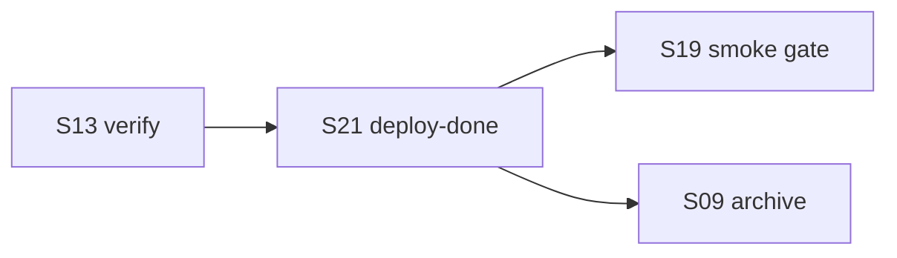

# core-00-scenario-overview

## 场景地图
| 编号 | 场景名称 | 主要代码 | 主要测试 | 状态 |
|------|---------|---------|---------|------|
| S01 | 初始化 OpenLogos 项目 | `init.ts` | `s01-init.test.ts` | 进行中 |
| S05 | 查看下一步建议 | `next.ts` | `s05-next.test.ts` | 进行中 |
| S08 | 同步 AI 工具资产与资源索引 | `sync.ts` | `s08-sync.test.ts` | 进行中 |
| S09 | 创建、合并、归档变更提案 | `change.ts` / `merge.ts` / `archive.ts` | `s09-change.test.ts` | 进行中 |
| S11 | 查看阶段进度与活跃变更 | `status.ts` | `s11-status.test.ts` | 进行中 |
| S13 | 运行测试验收并生成报告 | `verify.ts` | `s13-verify.test.ts` | 进行中 |
| S14 | 切换到 launched 生命周期 | `launch.ts` | `s14-launch.test.ts` | 进行中 |
| S15 | 处理 SQL 注释规范 | `sql-comments.ts` | `s15-sql-comments.test.ts` | 进行中 |
| S16 | 输出机器可读 JSON | `json-output.ts` | `s16-json-output.test.ts` | 进行中 |
| S17 | 管理模块注册表 | `module.ts` | `s17-module.test.ts` | 进行中 |
| S18 | 同步 resource_index | `sync-resource-index.ts` | `s18-sync-resource-index.test.ts` | 进行中 |
| S19 | 执行部署后 smoke 门禁 | `smoke.ts` | `s19-smoke.test.ts` | 进行中 |
| S20 | 已有项目接入 OpenLogos | `adopt.ts` | `s20-adopt.test.ts` | 进行中 |
| S21 | 标记部署完成 | `deploy-done.ts` | `s21-deploy-done.test.ts` | 进行中 |
| S22 | 查看与解析 flow 编排 | `lib/flow.ts` / `commands/flow.ts` | `s22-flow.test.ts` | 进行中 |
| S23 | 实时观测派生研发状态（watch） | `commands/watch.ts` | `s23-watch.test.ts` | 进行中 |
| S24 | next --auto skip-gate | `commands/next.ts` / `lib/flow-derive.ts` | `s24-auto-gate.test.ts` | 进行中 |
| S25 | overlay 驱动 status/next/watch 派生 | `lib/flow-derive.ts` / `lib/flow.ts` / `commands/{status,next,watch}.ts` | `s25-overlay-derive.test.ts` | 进行中 |

## 场景依赖关系
- S01 生成基础项目结构，为后续所有场景提供配置与目录前提。
- S20 与 S01 并列，同为入场路径，但专为已有项目设计；S20 生成的 `bootstrap: adopted` 标记影响 S05、S11、S14 的行为，并要求 CLI 兼容历史 `bootstrap: skipped`。
- S08 依赖 S01 或 S20 生成的配置与资产目录。
- S09 依赖已初始化项目和 guard 机制。
- S11/S13/S14/S19 依赖前序阶段文档与测试结果；S14 对 S20 接入的模块豁免 Initial 文档门禁。
- S21 位于 S13 verify 与 S19 smoke 之间；它不执行部署动作，只在部署由人类授权完成后确认状态。
- S22 独立于主研发链：它只加载内置 flow 模板（包内 `spec/flow/`）并解析项目 overlay 供 `flow show` 查看，本切片**不接入** S05 / S11 等的派生逻辑（零行为变更），因此不构成对其他场景的运行时依赖。
- S23 复用 S11 的 `collectStatusData` 派生数据源做实时轮询；**只读**、不写文件、不接入写副作用，因此对 S11 是数据消费依赖而非行为依赖，默认 `status` 行为不变。
- S24 在 S05 `next` 的派生基础上叠加 auto 模式，gate 范围来自 launched flow（S09/B2 的 `flow-derive` 已派生的 launched gate）；**默认 `next`（无 `--auto`）严格 1:1 不变，且忽略 `GATE_AUTO_PASSED`**，由 golden 锁定零漂移。
- S25 把派生引擎（`flow-derive.ts`，S22/B1/B2 已建）从「只读 builtin flow」升级为「读 resolved flow（含项目 overlay）」，使 overlay 真正驱动 S05（next）/ S11（status）/ S23（watch）；是 S26（`cmd:` 谓词）的前置。**安全红线**：无 overlay 文件时 resolved==builtin，S05/S11/S22/S23 派生逐字节不变（golden 零漂移）。**lifecycle 边界**：initial 四操作全生效；launched 仅 add/modify 生效，builtin skip/reorder 派生入口 fail loud。

## 场景索引
- [S01](./core-S01-cli-init.md)
- [S05](./core-S05-next-guidance.md)
- [S08](./core-S08-sync-ai-tools.md)
- [S09](./core-S09-change-lifecycle.md)
- [S11](./core-S11-status-progress.md)
- [S13](./core-S13-verify-results.md)
- [S14](./core-S14-launch-lifecycle.md)
- [S15](./core-S15-sql-comment-convention.md)
- [S16](./core-S16-machine-json-output.md)
- [S17](./core-S17-module-management.md)
- [S18](./core-S18-resource-index-sync.md)
- [S19](./core-S19-smoke-gate.md)
- [S20](./core-S20-adopt-existing-project.md)
- [S21](./core-S21-deploy-done-marker.md)
- [S22](./core-S22-flow-loading.md)
- [S23](./core-S23-watch.md)
- [S24](./core-S24-auto-gate.md)
- [S25](./core-S25-overlay-derive.md)

## S21 依赖关系

