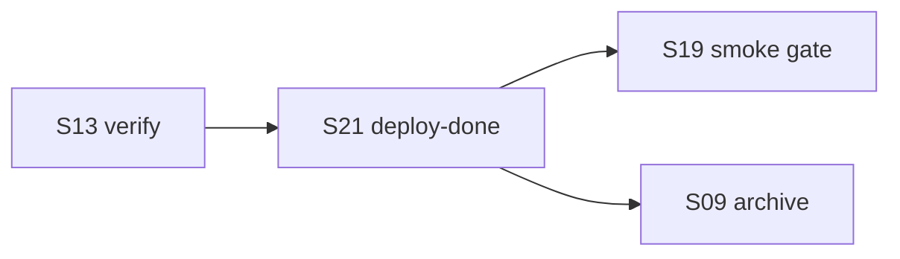

# core-00-scenario-overview

## 场景地图
| 编号 | 场景名称 | 主要代码 | 主要测试 | 状态 |
|------|---------|---------|---------|------|
| S01 | 初始化 OpenLogos 项目 | `init.ts` | `s01-init.test.ts` | 进行中 |
| S05 | 查看下一步建议 | `next.ts` | `s05-next.test.ts` | 进行中 |
| S08 | 同步 AI 工具资产与资源索引 | `sync.ts` | `s08-sync.test.ts` | 进行中 |
| S09 | 创建、合并、归档变更提案 | `change.ts` / `merge.ts` / `archive.ts` | `s09-change.test.ts` | 进行中 |
| S11 | 查看阶段进度与活跃变更 | `status.ts` | `s11-status.test.ts` | 进行中 |
| S13 | 运行测试验收并生成报告 | `verify.ts` | `s13-verify.test.ts` | 进行中 |
| S14 | 切换到 launched 生命周期 | `launch.ts` | `s14-launch.test.ts` | 进行中 |
| S15 | 处理 SQL 注释规范 | `sql-comments.ts` | `s15-sql-comments.test.ts` | 进行中 |
| S16 | 输出机器可读 JSON | `json-output.ts` | `s16-json-output.test.ts` | 进行中 |
| S17 | 管理模块注册表 | `module.ts` | `s17-module.test.ts` | 进行中 |
| S18 | 同步 resource_index | `sync-resource-index.ts` | `s18-sync-resource-index.test.ts` | 进行中 |
| S19 | 执行部署后 smoke 门禁 | `smoke.ts` | `s19-smoke.test.ts` | 进行中 |
| S20 | 已有项目接入 OpenLogos | `adopt.ts` | `s20-adopt.test.ts` | 进行中 |
| S21 | 标记部署完成 | `deploy-done.ts` | `s21-deploy-done.test.ts` | 进行中 |
| S22 | 查看与解析 flow 编排 | `lib/flow.ts` / `commands/flow.ts` | `s22-flow.test.ts` | 进行中 |
| S23 | 实时观测派生研发状态（watch） | `commands/watch.ts` | `s23-watch.test.ts` | 进行中 |
| S24 | next --auto skip-gate | `commands/next.ts` / `lib/flow-derive.ts` | `s24-auto-gate.test.ts` | 进行中 |
| S25 | overlay 驱动 status/next/watch 派生 | `lib/flow-derive.ts` / `lib/flow.ts` / `commands/{status,next,watch}.ts` | `s25-overlay-derive.test.ts` | 进行中 |
| S26 | cmd: 谓词在 next 求值 | `lib/flow-cmd.ts` / `lib/flow-overlay-derive.ts` / `commands/{next,status,watch}.ts` | `s26-cmd-predicate.test.ts` | 进行中 |
| S27 | implement(code/verify) loop 真迭代派生 | `lib/flow-loop-derive.ts` / `lib/flow.ts` / `commands/{verify,next,status,watch}.ts` | `s27-loop-iterate.test.ts` | 进行中 |
| S28 | next 暴露 next_node 编排提示 | `commands/next.ts` / `lib/flow-overlay-derive.ts` / `lib/flow-derive.ts` | `s28-next-node.test.ts` | 进行中 |
| S29 | M2 预留收尾（loop 退出 gate 可放行 / fan-out 阈值 / loop 内整组收敛） | `lib/flow.ts` / `lib/flow-loop-derive.ts` / `lib/flow-derive.ts` / `commands/next.ts` | `s29-gate-fanout-loop.test.ts` | 进行中 |
| S30 | cmd: 放开到 verify/deploy/smoke gate（modify-cmd-on-builtin） | `lib/flow.ts` / `lib/flow-derive.ts` / `lib/flow-overlay-derive.ts` / `commands/{next,status,watch}.ts` | `s30-cmd-builtin-gate.test.ts` | 进行中 |

## 场景依赖关系
- S01 生成基础项目结构，为后续所有场景提供配置与目录前提。
- S20 与 S01 并列，同为入场路径，但专为已有项目设计；S20 生成的 `bootstrap: adopted` 标记影响 S05、S11、S14 的行为，并要求 CLI 兼容历史 `bootstrap: skipped`。
- S08 依赖 S01 或 S20 生成的配置与资产目录。
- S09 依赖已初始化项目和 guard 机制。
- S11/S13/S14/S19 依赖前序阶段文档与测试结果；S14 对 S20 接入的模块豁免 Initial 文档门禁。
- S21 位于 S13 verify 与 S19 smoke 之间；它不执行部署动作，只在部署由人类授权完成后确认状态。
- S22 独立于主研发链：它只加载内置 flow 模板（包内 `spec/flow/`）并解析项目 overlay 供 `flow show` 查看，本切片**不接入** S05 / S11 等的派生逻辑（零行为变更），因此不构成对其他场景的运行时依赖。
- S23 复用 S11 的 `collectStatusData` 派生数据源做实时轮询；**只读**、不写文件、不接入写副作用，因此对 S11 是数据消费依赖而非行为依赖，默认 `status` 行为不变。
- S24 在 S05 `next` 的派生基础上叠加 auto 模式，gate 范围来自 launched flow（S09/B2 的 `flow-derive` 已派生的 launched gate）；**默认 `next`（无 `--auto`）忽略 `GATE_AUTO_PASSED`、不因其越过 gate**（`next` base data 仍按当前契约、S28 起可能含 `next_node`），由 golden 锁定 auto/gate 字段零漂移。
- S25 把派生引擎（`flow-derive.ts`，S22/B1/B2 已建）从「只读 builtin flow」升级为「读 resolved flow（含项目 overlay）」，使 overlay 真正驱动 S05（next）/ S11（status）/ S23（watch）；是 S26（`cmd:` 谓词）的前置。**安全红线**：无 overlay 文件时 resolved==builtin，S05/S11/S22/S23 派生逐字节不变（golden 零漂移）。**lifecycle 边界**：initial 四操作全生效；launched 仅 add/modify 生效，builtin skip/reorder 派生入口 fail loud。
- S26 在 S25 已就位的 resolved 派生上点亮 `cmd:` 谓词（仅 overlay-add 节点）：`next`（S05）执行命令求值、`status`（S11）/`watch`（S23）显示 `pending` 不执行。瞬态不持久化、每次 next cmd budget=1。**安全红线**：内置零 cmd→无 cmd 项目 golden 零漂移。
- S27 在 S25 resolved 派生上点亮 implement（code/verify）子流程的 `loop {until: tests_green, max_iters}` 真迭代派生：**仅 overlay `set-loop`（`max_iters>1`）激活**（builtin `max_iters:1` 退化环不变），激活时 S19/S13 的 `openlogos verify` 在算出 gate 结果后追加 `LOOP_ITERS` 账本，S05（next）/ S11（status）/ S23（watch）据账本 + resolved loop 派生 `loop_state`（`iteration`/`converged`/`escalated`）。与 S26（`cmd:`）同属 next 求值族但**正交**（loop 读 verify 账本派生轮次，cmd 求值谓词，互不依赖）。**核心红线**：loop 激活且 `!converged` 时出环以 `loop_state.converged` 为准，**覆盖内节点（含 initial verify 的 `done_when: file:acceptance-report.md`）的 done_when**，未收敛一律不得推进到 deliver/deploy/launch；达上限 escalated → 退出 human gate（`gate:implement:loop-exhausted`，`skippable:false`，`next --auto` 照常阻塞不 auto-pass）。**安全红线**：无激活项目（含所有 golden fixture）status/next/watch 逐字节不变（golden 零漂移）。统一引擎下 initial + launched 两条 implement 同一套派生。
- S28 在 S05（next 派生）与 S25（resolved flow 含 overlay、overlay-add `current_node`）的基础上，把「本次 `next` 响应最终建议处理的真实 flow node」的编排提示（`skill`/`working_agent`/`review_agent`/`pre_script`/`post_script`）作为机器字段 `next_node` 透出，使宿主据「乐谱」编排而无需回读 `CLAUDE.md` 散文。**默认 = 当前前沿节点**（三路解析：overlay-add `current_node` > launched `STEP_TO_CURRENT_BUILTIN[step]` > initial `current_phase`→`PHASE_KEY_TO_NODE_ID`），再从 resolved flow 取该节点 hints；依赖 S22 resolved flow 的 `skill`/agent/script 字段、依赖 S25 的 overlay `current_node` 派生（overlay `modify ... set:{review_agent}` 重绑 agent 如实反映为 `next_node.review_agent`）。与 S26（`cmd:` 求值）、S27（loop 阻塞）**正交**但有明确例外耦合：**R3** cmd done(exit0)续推→`next_node` 指向续推后节点（非已 done 的 cmd 节点），cmd 失败/超时→指向该 cmd 节点；**R4** `--auto` gate 放行（`gate_auto_passed`）→省略 `next_node`；**R7** loop 阻塞未达上限→`next_node` 指向 loop 工作节点（`id=code` 未 `skipped`，对齐 action「修代码」、非 verify；overlay `current_node` 优先；`code` 缺失/被 skip→省略，仅 initial 等合法 resolved flow，launched builtin skip 在 S25 已 `FLOW_SCHEMA_INVALID`），达上限 escalated→省略；**R5** 命令级建议（all_done / 无 active proposal→`change <slug>` / 补 baseline / launch）一律省略。挂载与 `current_node`/`loop_state` 同构（`modules[].next_node` / legacy 顶层）。**严格 A 被动派生**：`next_node` 各字段为不透明标签，OpenLogos 只声明、不解释/不校验/不执行，agent 映射与 script 执行由宿主权限模式决定。**范围边界**：仅 `next` 暴露，`status`/`watch` 本切片不动；本切片**有意**为 next 新增输出字段并重新 baseline `golden-baseline.test.ts`（逐项复核 diff 仅 `next_node`）。
- S29 在 S27（loop 真迭代）、S24（`next --auto` skip-gate）、S25（overlay resolved 派生）、S11（status `scenario_coverage`）/S22（flow fan-out）既有覆盖派生的基础上，一次性收掉 `spec/flow-spec.md §13` 的三个轻量 M2 预留项：**A** loop 达上限退出 gate（`gate:<subflow>:loop-exhausted`）的 `skippable` 可经 overlay `set-loop` 的 `set.exhausted_gate.skippable` 覆盖（默认 `false` 维持 S27 阻塞；`true` 时 `next --auto` 在 `escalated` 自动放行未收敛代码：`skippable:true`/`gate_auto_passed:true`/追加 `GATE_AUTO_PASSED`/proceed，复用 S24 既有 auto-pass 路径，**高危 opt-in**）；**B** fan-out 节点新增 `coverage_threshold`（`0<x<=1`，仅 `done_when: all_present` 节点，`covered/total>=阈值` 即 done，缺省等价 `all_present` 即阈值 `1.0`，`total==0` 维持现状，非法→`FLOW_SCHEMA_INVALID`）；**C** loop 内 fan-out 收敛语义**定死=整组收敛**（收敛裁判仍为测试绿 `until: tests_green`，fan-out 节点按各自 `all_present`/`coverage_threshold` 独立完成，**不引入 per-instance 迭代**、不新增字段）。与 S26（`cmd:`）、S28（`next_node`）**正交**：A 走 loop_state/gate 派生族，B 走 fan-out 覆盖派生，C 仅钉死语义。**安全红线**：三项全部 overlay/字段 opt-in，builtin 模板零变更 → 无 overlay 项目 status/next/watch/flow show 逐字节不变（**golden 零漂移**）。**A 严格被动派生**：放行与否由用户 overlay 显式声明 + `--auto` 驱动，OpenLogos 只声明 gate 字段、不自行决策。
- S30 在 S26（`cmd:` 求值器 / 两级超时 / budget=1 / `spawn(shell)`）、S09/B2（launched `proposal_step` 派生：`detectProposalStepViaFlow` / `extractLaunchedMarkers`）、S25（overlay `modify` 驱动 resolved 派生）的基础上，把 `cmd:` 谓词从「仅 overlay-add 节点」放开到 **overlay-modify 的 launched `verify`/`deploy`/`smoke` 三个 gate**（收掉 `spec/flow-spec.md §13` M2 最后一项 `modify-cmd-on-builtin`），使门禁可接外部命令/CI（如 `gh pr checks`、部署校验脚本）。**精确白名单**：`verify.done_when`/`verify.fail_when`/`smoke.done_when`/`smoke.fail_when`/`deploy.done_when` ✅；其余 `(节点,字段)`（含 `deploy.fail_when`、所有 initial 节点与 launched 的 proposal/delta/merge/code/archive）改 cmd: → `FLOW_SCHEMA_INVALID`（它们承载 OpenLogos 内部状态 proposal_package/section/marker，cmd: 无意义）。**语义 = per-field 独立求值 + frontier 模型**：一个 gate 节点的 `done_when`/`fail_when` 各按其谓词类型独立判定（`fail_when` 优先于 `done_when` 不变），cmd 字段 **live 重评、瞬态、不持久化**——`status`/`watch` 不执行 cmd（cmd 字段视为 unknown，仅前沿且无非 cmd 字段解析时判 `pending` 停门前），`next` 求值 cmd（与 S26 overlay-add cmd **共享 budget=1**，按 flow 顺序先到先求值，仅对前沿 pending 节点）；非 cmd 字段（marker: 等）行为不变、status/watch/next 一致。**`next` 对 cmd 字段求值不写 marker**（不写 `VERIFY_PASS`/`DEPLOY_DONE`/`SMOKE_PASS`/`*_FAIL`，严守 A 被动派生：`next` 不改项目状态），现有 `openlogos verify`/`deploy-done`/`smoke` 命令的 marker 写入行为**完全不变**。**proposal_step 停门前 / 推进过门**：cmd 未命中 → 停门前（`ready-to-verify`/`ready-to-deploy`/`ready-to-smoke`）；`next` 中 `done_when:cmd` exit 0 → 推进过门、`fail_when:cmd` exit 0 → 瞬态 failed（`verify-failed`/`smoke-failed`）——均为**仅本次 envelope 的瞬态合成态**，与 `status`/`watch` 反映的持久化前沿**有意不一致**。**机器契约**：新增 JSON 字段 `cmd_gate`（与 `loop_state`/`current_node` 同构，挂 `modules[].cmd_gate` / legacy 顶层；`pending_cmd` 仅内部执行载荷不入契约），承载 builtin gate 的 `node_id`/`field`/`command`/`timeout_seconds`；`current_node` 维持只给 overlay-add；`next_node` R3 扩到 builtin cmd 续推；检测层 `extractLaunchedMarkers`/`detectProposalStepViaFlow` 改 **cmd-aware**。与 S26（`cmd:`）、S28（`next_node`）**正交**，与 **S27（implement loop）F·正交隔离**：`verify` 在 `implement` 子流程内，禁止「激活 loop（`set-loop max_iters>1`）+ `verify` 的 `done_when` 或 `fail_when` 任一为 cmd:」并存（resolved 校验即 `FLOW_SCHEMA_INVALID`，严格版不区分字段）；`deploy`/`smoke` 在 `deliver` 子流程无 loop、无此冲突。**安全红线**：builtin 三模板的 verify/deploy/smoke 仍是 `marker:`，cmd-gate 仅经 overlay `modify` opt-in 激活，`cmd_gate` 字段仅 cmd gate 时出现 → 无 overlay 项目 detection/status/next/watch/flow show 逐字节不变（**golden 零漂移**）。

## 场景索引
- [S01](./core-S01-cli-init.md)
- [S05](./core-S05-next-guidance.md)
- [S08](./core-S08-sync-ai-tools.md)
- [S09](./core-S09-change-lifecycle.md)
- [S11](./core-S11-status-progress.md)
- [S13](./core-S13-verify-results.md)
- [S14](./core-S14-launch-lifecycle.md)
- [S15](./core-S15-sql-comment-convention.md)
- [S16](./core-S16-machine-json-output.md)
- [S17](./core-S17-module-management.md)
- [S18](./core-S18-resource-index-sync.md)
- [S19](./core-S19-smoke-gate.md)
- [S20](./core-S20-adopt-existing-project.md)
- [S21](./core-S21-deploy-done-marker.md)
- [S22](./core-S22-flow-loading.md)
- [S23](./core-S23-watch.md)
- [S24](./core-S24-auto-gate.md)
- [S25](./core-S25-overlay-derive.md)
- [S26](./core-S26-cmd-predicate.md)
- [S27](./core-S27-loop-iterate.md)
- [S28](./core-S28-next-node.md)
- [S29](./core-S29-gate-fanout-loop.md)
- [S30](./core-S30-cmd-builtin-gate.md)

## S21 依赖关系

