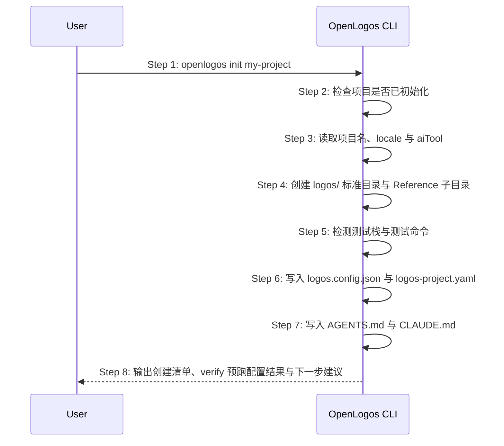

# S01: 初始化 OpenLogos 项目 — 时序图

## 步骤说明
1. **用户**执行 `openlogos init`。
2. **CLI** 校验当前目录是否已初始化。
3. **CLI** 解析项目名、语言与 AI 工具配置。
4. **CLI** 创建标准目录结构；其中 `logos/resources/reference/` 下必须同时创建 `requirement/`、`todolist/`、`code/`、`image/`、`temp/`、`note/` 子目录，并写入 `.gitkeep`。
5. **CLI** 检测常见测试栈与测试脚本。若可推断测试命令，准备写入 `verify.pre_run_command`；若无法推断，准备输出 TODO。
6. **CLI** 写入配置和项目索引。不得覆盖用户显式传入或后续已有的 verify 预跑配置。
7. **CLI** 写入 AI 指令文件。
8. **CLI** 输出下一步建议，并说明 verify 预跑配置是否已补齐。

## 异常用例
### EX-2.1: 项目已初始化
- **触发条件**：`logos/logos.config.json` 已存在。
- **期望响应**：输出错误并退出。
- **副作用**：不覆盖现有文件。

### EX-2.2: logos/ 目录已存在（应改用 adopt）
- **触发条件**：`logos/logos.config.json` 已存在。
- **期望响应**：输出错误并退出；若检测到是已有项目（存在 `package.json` 等项目清单文件），额外提示用户改用 `openlogos adopt`。
- **副作用**：不覆盖现有文件。

### EX-5.1: 无法推断测试命令
- **触发条件**：当前目录没有可识别的测试脚本或测试框架配置。
- **期望响应**：`init` 仍然成功，但输出 TODO，提示用户补充 `verify.pre_run_command` 或 `verify.regression_command`。
- **副作用**：不写入伪造测试命令。
