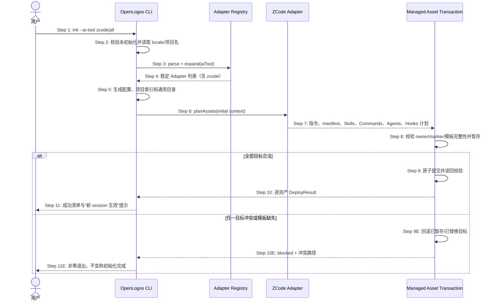
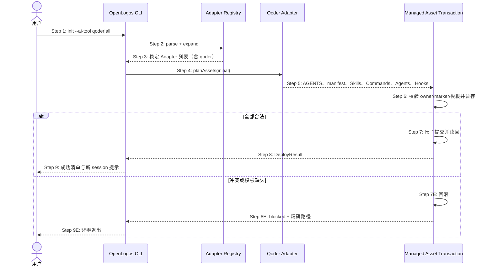
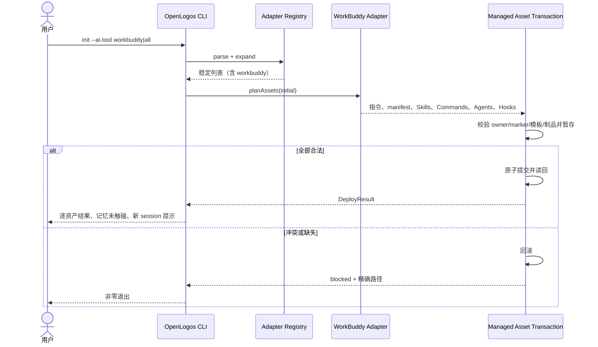
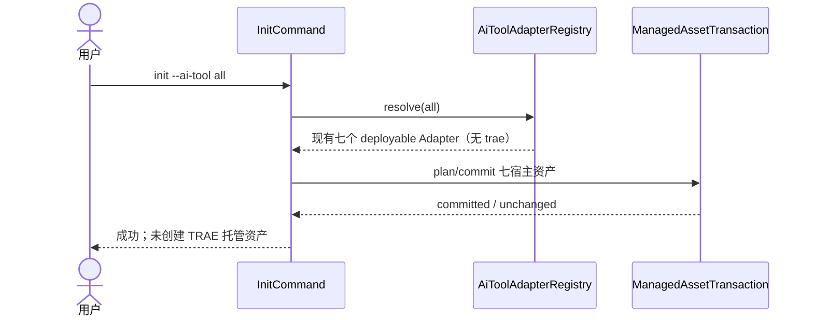
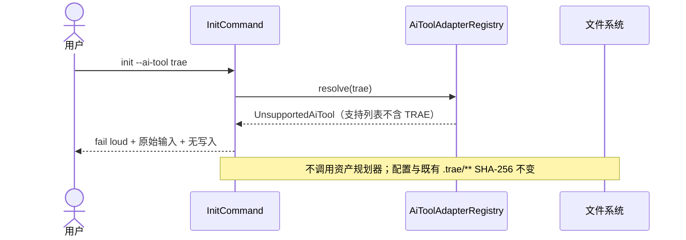

# S01: 初始化 OpenLogos 项目 — 时序图

```mermaid
sequenceDiagram
    participant U as User
    participant C as OpenLogos CLI

    U->>C: Step 1: openlogos init my-project
    C->>C: Step 2: 检查项目是否已初始化
    C->>C: Step 3: 读取项目名、locale 与 aiTool
    C->>C: Step 4: 创建 logos/ 标准目录与 Reference 子目录
    C->>C: Step 5: 检测测试栈与测试命令
    C->>C: Step 6: 写入 logos.config.json 与 logos-project.yaml
    C->>C: Step 7: 查找 AGENTS.md / CLAUDE.md 及大小写变体
    C->>C: Step 8: 发现既有项目专属 Skill 与插件资产
    C->>C: Step 9: 通过 managed block 合并写入 AI 指令文件
    C->>C: Step 10: 为目标 AI 工具生成 OpenLogos 官方插件与命名空间边界
    C-->>U: Step 11: 输出创建清单、verify 预跑配置结果、AI 资产边界与下一步建议
```

> 主时序图与下方「步骤说明」逐步对齐（均为 11 步）；其中 Step 8 / Step 10 承载 AI 工具专属 Skill 发现与 OpenLogos 官方插件命名空间边界。

## 步骤说明
1. **用户**执行 `openlogos init`。
2. **CLI** 校验当前目录是否已初始化。
3. **CLI** 解析项目名、语言与 AI 工具配置。
4. **CLI** 创建标准目录结构；其中 `logos/resources/reference/` 下必须同时创建 `requirement/`、`todolist/`、`code/`、`image/`、`temp/`、`note/` 子目录，并写入 `.gitkeep`。
5. **CLI** 检测常见测试栈与测试脚本。若可推断测试命令，准备写入 `verify.pre_run_command`；若无法推断，准备输出 TODO。
6. **CLI** 写入配置和项目索引。不得覆盖用户显式传入或后续已有的 verify 预跑配置。
7. **CLI** 写入 AI 指令文件前，按大小写不敏感方式查找当前目录已有 `AGENTS.md` / `CLAUDE.md` 及常见大小写变体，优先复用既有真实路径。
8. **CLI** 扫描目标宿主相关的既有项目专属 Skill 和插件资产，例如 `.agents/skills/*`、`.agents/plugins/*`、`.claude/skills/*`、项目独立 Claude 插件；未知归属的 skill 默认视为项目资产。
9. **CLI** 通过 `OPENLOGOS:BEGIN` / `OPENLOGOS:END` managed block 合并写入 OpenLogos 指令：已有完整 marker 时只替换托管片段；无 marker 且包含用户内容时保留原文并追加托管片段；历史纯 OpenLogos 旧模板可迁移为带 marker 文件；marker 不完整时 fail loud，不猜测边界覆盖。
10. **CLI** 为目标 AI 工具生成 OpenLogos 官方插件资产：Codex 使用 repo marketplace / `openlogos` 插件命名空间承载方法论技能；Claude Code 使用 OpenLogos 官方插件承载方法论技能，同时保留 `.claude/skills/` 或项目独立插件中的项目专属技能。
11. **CLI** 输出下一步建议，并说明 verify 预跑配置是否已补齐；当发现项目专属 Skill 时，输出其保留位置和不属于 OpenLogos 官方命名空间的提示。

## 异常用例
### EX-2.1: 项目已初始化
- **触发条件**：`logos/logos.config.json` 已存在。
- **期望响应**：输出错误并退出。
- **副作用**：不覆盖现有文件。

### EX-2.2: logos/ 目录已存在（应改用 adopt）
- **触发条件**：`logos/logos.config.json` 已存在。
- **期望响应**：输出错误并退出；若检测到是已有项目（存在 `package.json` 等项目清单文件），额外提示用户改用 `openlogos adopt`。
- **副作用**：不覆盖现有文件。

### EX-5.1: 无法推断测试命令
- **触发条件**：当前目录没有可识别的测试脚本或测试框架配置。
- **期望响应**：`init` 仍然成功，但输出 TODO，提示用户补充 `verify.pre_run_command` 或 `verify.regression_command`。
- **副作用**：不写入伪造测试命令。

### EX-8.1: AI 指令文件 marker 不完整
- **触发条件**：已有 `AGENTS.md` / `CLAUDE.md` 中只存在 `OPENLOGOS:BEGIN` 或只存在 `OPENLOGOS:END`。
- **期望响应**：输出明确错误，提示用户修复或备份指令文件后重试。
- **副作用**：不得写入或覆盖该文件。

### EX-10.1: Codex 项目专属 Skill 与 OpenLogos 插件命名空间冲突
- **触发条件**：初始化前存在 `.agents/skills/release-guard/SKILL.md`，且目标工具包含 Codex。
- **期望响应**：初始化成功；OpenLogos 方法论技能部署到 `openlogos` 插件命名空间；`release-guard` 保持项目专属归属，不生成 `openlogos:release-guard`；输出项目技能命名空间提示。
- **副作用**：不得复制、删除或改写项目专属 Skill。

### EX-10.2: Claude Code 项目 Skill 被误放入 OpenLogos 插件目录
- **触发条件**：初始化前检测到用户准备把项目专属 skill 放进 OpenLogos Claude 插件目录，或历史目录中存在非 OpenLogos 官方 skill。
- **期望响应**：CLI 保守跳过该 skill 的 OpenLogos 托管刷新，并提示应迁移到 `.claude/skills/<skill>/SKILL.md` 或项目独立 Claude 插件。
- **副作用**：不得把该 skill 暴露为 `/openlogos:*`。

## S01 ZCode 初始化与 Adapter Registry 扩展时序

### 场景目标

用户通过 `openlogos init --ai-tool zcode` 或 `--ai-tool all` 初始化项目时，由统一 Registry 解析宿主并原子部署完整 ZCode 插件、根指令和 Hook runtime，同时保护既有用户资产。

### 参与者

- **用户**：选择 ZCode 或 all 并接收逐资产结果。
- **OpenLogos CLI**：编排初始化、配置写入和部署事务。
- **Adapter Registry**：解析工具、展开 all 并返回 ZCode Adapter。
- **ZCode Adapter**：规划插件、指令和 Hook 资产。
- **Managed Asset Transaction**：预检冲突、暂存、原子提交或回滚。

### 前置条件

- 当前目录尚未存在 `logos/logos.config.json`。
- ZCode 模板、共享 Hook runtime 与所有方法论 Skills/Commands 已随 CLI 包可读。
- 不存在无法恢复的 baseline seed commit journal。

### 成功后置条件

- 配置持久化规范工具值 `zcode`，或 `all` 展开结果包含 ZCode。
- 根 `AGENTS.md` OpenLogos 托管片段和完整 ZCode 插件资产落盘，用户内容保持不变。
- 所有目标通过读回校验，CLI 输出可审计的 created/updated/unchanged/preserved 清单。

### 时序图

```mermaid
sequenceDiagram
    actor U as 用户
    participant C as OpenLogos CLI
    participant R as Adapter Registry
    participant Z as ZCode Adapter
    participant T as Managed Asset Transaction

    U->>C: Step 1: init --ai-tool zcode|all
    C->>C: Step 2: 校验未初始化并读取 locale/项目名
    C->>R: Step 3: parse + expand(aiTool)
    R-->>C: Step 4: 稳定 Adapter 列表（含 zcode）
    C->>C: Step 5: 生成配置、项目索引和通用目录
    C->>Z: Step 6: planAssets(initial context)
    Z-->>T: Step 7: 指令、manifest、Skills、Commands、Agents、Hooks 计划
    T->>T: Step 8: 校验 owner/marker/模板完整性并暂存
    alt 全部目标合法
        T->>T: Step 9: 原子提交并读回校验
        T-->>C: Step 10: 逐资产 DeployResult
        C-->>U: Step 11: 成功清单与“新 session 生效”提示
    else 任一目标冲突或模板缺失
        T->>T: Step 9E: 回滚已暂存/已替换目标
        T-->>C: Step 10E: blocked + 冲突路径
        C-->>U: Step 11E: 非零退出，不宣称初始化完成
    end
```

### 步骤说明

1. 用户选择单独 ZCode 或 all。
2. CLI 在任何写入前完成既有初始化前置校验。
3. CLI 把原始配置交给 Registry，不手写宿主枚举。
4. Registry 返回稳定去重的 Adapter；all 包含所有可部署宿主但不包含 other。
5. CLI 准备通用 OpenLogos 配置，其中只持久化规范工具 ID。
6. ZCode Adapter 按 initial lifecycle 生成资产计划。
7. 计划包含 `.zcode-plugin/plugin.json`、Skills、Commands、Agents、`hooks/hooks.json`、共享 runtime 和根 `AGENTS.md` 托管片段。
8. 事务层先校验全部目标的所有权、marker 完整性、内容与随包模板。
9. 所有校验通过后才按稳定顺序原子写入，并从磁盘读回哈希和权限。
10. CLI 汇总真实结果；all 中其它 Adapter 复用同一事务合同。
11. 用户获得明确路径、保留项和新 ZCode session 才加载 Hook 的提示。

### 异常与边界

#### EX-ZC-1：ZCode 模板未随包

- **触发条件**：`.zcode-plugin/plugin.json`、Hooks 或共享 runtime 任一缺失。
- **期望响应**：在写用户项目文件前失败，指出缺失的包内相对路径。
- **副作用**：不留下半初始化目录或伪造的 ZCode 成功行。

#### EX-ZC-2：同名插件不属于 OpenLogos

- **触发条件**：目标插件目录已有不同 manifest identity 或未知 owner。
- **期望响应**：标记 `blocked`，建议用户改名或备份；不得合并未知插件内容。
- **副作用**：既有插件逐字节不变。

#### EX-ZC-3：根指令 marker 残缺

- **触发条件**：根 `AGENTS.md` 只有一个 OpenLogos marker。
- **期望响应**：在事务预检阶段 fail loud。
- **副作用**：配置、插件和根指令均不提交。

### 追溯

- 需求：S01 ZCode 初始化验收、公共能力要求、ZCode 资产与协议要求。
- 架构：二十八、AI Tool Adapter Registry 与 ZCode 薄适配架构。
- 测试：UT-S01-100～UT-S01-107、ST-S01-15～ST-S01-17。

## S01 Qoder 初始化与原生插件原子部署时序

### 场景目标

用户以 `--ai-tool qoder` 或 `all` 初始化时，由 Registry 解析 Qoder，并在保护用户资产的前提下原子部署根指令、原生插件、Skills、Commands、Agents 与 Hooks。

### 参与者

- **用户**：选择宿主并接收逐资产结果。
- **OpenLogos CLI**：编排初始化和总事务。
- **Adapter Registry**：解析/展开宿主集合。
- **Qoder Adapter**：规划 Qoder 资产与 owner。
- **Managed Asset Transaction**：预检、暂存、提交/回滚与读回。

### 前置条件

- 项目尚未初始化，seed journal 已恢复或不存在。
- Qoder 模板与共享 runtime 均存在于当前 CLI 安装包。

### 成功后置条件

- 配置持久化 `qoder`，或 `all` 结果包含 Qoder。
- 根 AGENTS 托管片段与完整 Qoder 插件落盘，用户资产不变。
- 逐资产结果与磁盘读回一致。

### 时序图

```mermaid
sequenceDiagram
    actor U as 用户
    participant C as OpenLogos CLI
    participant R as Adapter Registry
    participant Q as Qoder Adapter
    participant T as Managed Asset Transaction
    U->>C: Step 1: init --ai-tool qoder|all
    C->>R: Step 2: parse + expand
    R-->>C: Step 3: 稳定 Adapter 列表（含 qoder）
    C->>Q: Step 4: planAssets(initial)
    Q-->>T: Step 5: AGENTS、manifest、Skills、Commands、Agents、Hooks
    T->>T: Step 6: 校验 owner/marker/模板并暂存
    alt 全部合法
        T->>T: Step 7: 原子提交并读回
        T-->>C: Step 8: DeployResult
        C-->>U: Step 9: 成功清单与新 session 提示
    else 冲突或模板缺失
        T->>T: Step 7E: 回滚
        T-->>C: Step 8E: blocked + 精确路径
        C-->>U: Step 9E: 非零退出
    end
```

### 步骤说明

1. CLI 在写入前完成未初始化、locale、项目名与 seed journal 校验。
2. 原始宿主选择交给 Registry，`all` 按稳定顺序展开且排除 `other`。
3. Registry 返回规范 id，CLI 不维护 Qoder 名称分支。
4. Qoder Adapter 按 initial lifecycle 生成完整资产计划。
5. 计划至少包含 `.qoder-plugin/plugin.json`、约定组件目录、`hooks/hooks.json`、runtime 与 AGENTS managed block。
6. 事务层校验 manifest/hooks/frontmatter、owner、marker 和所有目标可写性。
7. 全部预检通过后按稳定顺序提交，任何失败恢复备份。
8. 结果按 created/updated/unchanged/preserved/blocked 汇总。
9. 成功提示新 Qoder CLI session 才装载插件/Hook 快照。

### 异常与边界

#### EX-QD-S01-1：随包模板缺失
- **触发条件**：manifest、声明组件或 runtime 任一未进入 tarball。
- **期望响应**：首个项目写入前失败并点名包内路径。
- **副作用**：无半初始化目录或伪造成功行。

#### EX-QD-S01-2：插件 owner 冲突
- **触发条件**：目标已有不同 identity 或未知 owner。
- **期望响应**：blocked，禁止覆盖/吸收未知插件。
- **副作用**：用户插件字节不变。

#### EX-QD-S01-3：AGENTS marker 残缺
- **触发条件**：只有 BEGIN 或 END。
- **期望响应**：总事务预检失败并给出修复位置。
- **副作用**：配置、logos 与插件均不提交。

### 追溯

- 需求：S01 Qoder 初始化验收。
- 架构：29.2 Qoder 资产模型、29.6 资产事务与提交顺序。
- 测试：UT-S01-108～UT-S01-115、ST-S01-18～ST-S01-20。

## S01 WorkBuddy 原生插件原子初始化时序

### 场景目标

通过 `init --ai-tool workbuddy|all` 部署完整 WorkBuddy 原生插件，同时保护用户 settings、插件、项目资产和原生记忆。

### 前置与后置条件

- 前置：项目未初始化；选择值可由 Registry 解析；随包模板完整。
- 成功后置：配置持久化规范 id，托管指令和插件全部读回成功，用户资产与记忆不变。
- 失败后置：不留下半初始化目录或部分插件，不打印总成功。

### 主时序

```mermaid
sequenceDiagram
    actor U as 用户
    participant C as OpenLogos CLI
    participant R as Adapter Registry
    participant W as WorkBuddy Adapter
    participant T as Managed Asset Transaction
    U->>C: init --ai-tool workbuddy|all
    C->>R: parse + expand
    R-->>C: 稳定列表（含 workbuddy）
    C->>W: planAssets(initial)
    W-->>T: 指令、manifest、Skills、Commands、Agents、Hooks
    T->>T: 校验 owner/marker/模板/制品并暂存
    alt 全部合法
        T->>T: 原子提交并读回
        T-->>C: DeployResult
        C-->>U: 逐资产结果、记忆未触碰、新 session 提示
    else 冲突或缺失
        T->>T: 回滚
        T-->>C: blocked + 精确路径
        C-->>U: 非零退出
    end
```

### 步骤与不变量

1. Registry 负责 `workbuddy` 和 `all`，CLI 不维护 WorkBuddy 分支。
2. Adapter 规划 `.workbuddy-plugin/plugin.json`、约定组件、`hooks/hooks.json` 与 runtime；命令使用 `${CODEBUDDY_PLUGIN_ROOT}`。
3. 事务层在首个写入前验证模板、manifest、Hook、marker、owner 和所有目标可写性。
4. WorkBuddy settings、其它插件、项目未知文件和原生记忆只做边界证明，不进入写计划。
5. 全部资产提交并读回后才写配置和打印成功；重复初始化规划必须幂等。

### 异常

- `EX-WB-S01-1`：`0.13.28` tarball 缺任一声明资产时，首个项目写入前失败。
- `EX-WB-S01-2`：目标属于不同插件 identity 时 blocked，用户插件字节不变。
- `EX-WB-S01-3`：托管 marker 残缺或 Hook 配置非法时总事务不提交。

### 追溯

- 需求：S01 WorkBuddy 初始化验收。
- 架构：30.2 资产模型、30.4 生命周期与事务顺序。
- 测试：UT-S01-116～UT-S01-123、ST-S01-21～ST-S01-23。

## TRAE non-deployable 初始化负向时序

### 目标

S01 在 Registry 选择阶段即排除 TRAE：`all` 只选择既有七个 deployable Adapter；显式 `trae` 在任何资产规划、暂存或写入之前 fail loud。客户端已安装、已登录或存在 `.trae/**` 不改变该结论。

### `all` 初始化时序

```mermaid
sequenceDiagram
    actor U as 用户
    participant C as InitCommand
    participant R as AiToolAdapterRegistry
    participant P as ManagedAssetTransaction
    U->>C: init --ai-tool all
    C->>R: resolve(all)
    R-->>C: 现有七个 deployable Adapter（无 trae）
    C->>P: plan/commit 七宿主资产
    P-->>C: committed / unchanged
    C-->>U: 成功；未创建 TRAE 托管资产
```

### 显式 `trae` 失败时序

```mermaid
sequenceDiagram
    actor U as 用户
    participant C as InitCommand
    participant R as AiToolAdapterRegistry
    participant F as 文件系统
    U->>C: init --ai-tool trae
    C->>R: resolve(trae)
    R-->>C: UnsupportedAiTool（支持列表不含 TRAE）
    C-->>U: fail loud + 原始输入 + 无写入
    Note over C,F: 不调用资产规划器；配置与既有 .trae/** SHA-256 不变
```

### 不变量

- 不把 `trae` 映射为 `other`，不创建 placeholder Adapter/capability。
- 帮助、交互列表和结构化支持值全部由 Registry 派生，保持七宿主稳定顺序。
- TRAE Rules、Skills、Agents、Hooks、MCP、settings、账号和记忆均为用户/宿主资产，初始化不扫描或修改。
