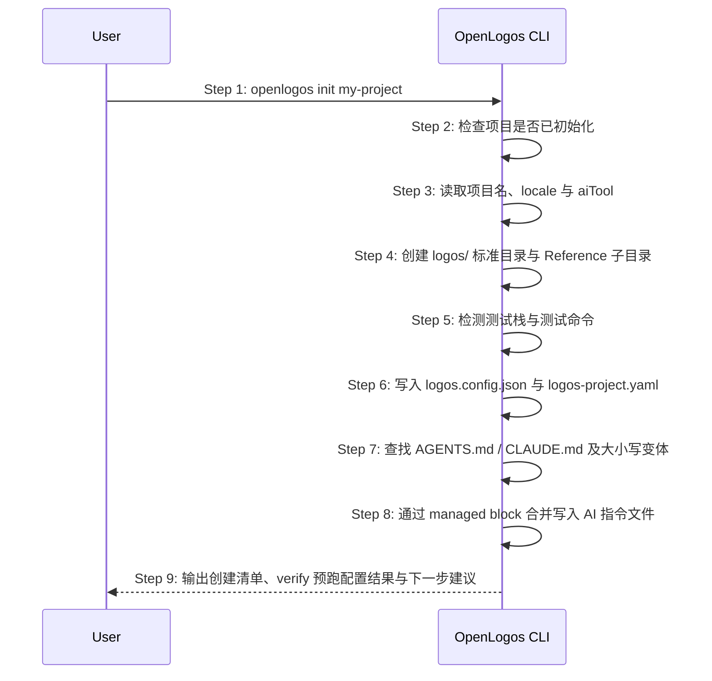
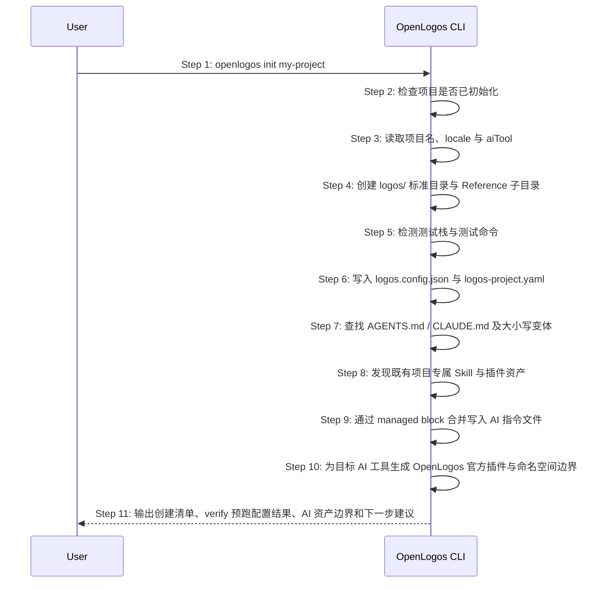

# S01: 初始化 OpenLogos 项目 — 时序图

```mermaid
sequenceDiagram
    participant U as User
    participant C as OpenLogos CLI

    U->>C: Step 1: openlogos init my-project
    C->>C: Step 2: 检查项目是否已初始化
    C->>C: Step 3: 读取项目名、locale 与 aiTool
    C->>C: Step 4: 创建 logos/ 标准目录与 Reference 子目录
    C->>C: Step 5: 检测测试栈与测试命令
    C->>C: Step 6: 写入 logos.config.json 与 logos-project.yaml
    C->>C: Step 7: 查找 AGENTS.md / CLAUDE.md 及大小写变体
    C->>C: Step 8: 通过 managed block 合并写入 AI 指令文件
    C-->>U: Step 9: 输出创建清单、verify 预跑配置结果与下一步建议
```

## 步骤说明
1. **用户**执行 `openlogos init`。
2. **CLI** 校验当前目录是否已初始化。
3. **CLI** 解析项目名、语言与 AI 工具配置。
4. **CLI** 创建标准目录结构；其中 `logos/resources/reference/` 下必须同时创建 `requirement/`、`todolist/`、`code/`、`image/`、`temp/`、`note/` 子目录，并写入 `.gitkeep`。
5. **CLI** 检测常见测试栈与测试脚本。若可推断测试命令，准备写入 `verify.pre_run_command`；若无法推断，准备输出 TODO。
6. **CLI** 写入配置和项目索引。不得覆盖用户显式传入或后续已有的 verify 预跑配置。
7. **CLI** 写入 AI 指令文件前，按大小写不敏感方式查找当前目录已有 `AGENTS.md` / `CLAUDE.md` 及常见大小写变体，优先复用既有真实路径。
8. **CLI** 扫描目标宿主相关的既有项目专属 Skill 和插件资产，例如 `.agents/skills/*`、`.agents/plugins/*`、`.claude/skills/*`、项目独立 Claude 插件；未知归属的 skill 默认视为项目资产。
9. **CLI** 通过 `OPENLOGOS:BEGIN` / `OPENLOGOS:END` managed block 合并写入 OpenLogos 指令：已有完整 marker 时只替换托管片段；无 marker 且包含用户内容时保留原文并追加托管片段；历史纯 OpenLogos 旧模板可迁移为带 marker 文件；marker 不完整时 fail loud，不猜测边界覆盖。
10. **CLI** 为目标 AI 工具生成 OpenLogos 官方插件资产：Codex 使用 repo marketplace / `openlogos` 插件命名空间承载方法论技能；Claude Code 使用 OpenLogos 官方插件承载方法论技能，同时保留 `.claude/skills/` 或项目独立插件中的项目专属技能。
11. **CLI** 输出下一步建议，并说明 verify 预跑配置是否已补齐；当发现项目专属 Skill 时，输出其保留位置和不属于 OpenLogos 官方命名空间的提示。

## AI 工具 Skill 命名空间边界补充时序

```mermaid
sequenceDiagram
    participant U as User
    participant C as OpenLogos CLI

    U->>C: Step 1: openlogos init my-project
    C->>C: Step 2: 检查项目是否已初始化
    C->>C: Step 3: 读取项目名、locale 与 aiTool
    C->>C: Step 4: 创建 logos/ 标准目录与 Reference 子目录
    C->>C: Step 5: 检测测试栈与测试命令
    C->>C: Step 6: 写入 logos.config.json 与 logos-project.yaml
    C->>C: Step 7: 查找 AGENTS.md / CLAUDE.md 及大小写变体
    C->>C: Step 8: 发现既有项目专属 Skill 与插件资产
    C->>C: Step 9: 通过 managed block 合并写入 AI 指令文件
    C->>C: Step 10: 为目标 AI 工具生成 OpenLogos 官方插件与命名空间边界
    C-->>U: Step 11: 输出创建清单、verify 预跑配置结果、AI 资产边界和下一步建议
```

## 异常用例
### EX-2.1: 项目已初始化
- **触发条件**：`logos/logos.config.json` 已存在。
- **期望响应**：输出错误并退出。
- **副作用**：不覆盖现有文件。

### EX-2.2: logos/ 目录已存在（应改用 adopt）
- **触发条件**：`logos/logos.config.json` 已存在。
- **期望响应**：输出错误并退出；若检测到是已有项目（存在 `package.json` 等项目清单文件），额外提示用户改用 `openlogos adopt`。
- **副作用**：不覆盖现有文件。

### EX-5.1: 无法推断测试命令
- **触发条件**：当前目录没有可识别的测试脚本或测试框架配置。
- **期望响应**：`init` 仍然成功，但输出 TODO，提示用户补充 `verify.pre_run_command` 或 `verify.regression_command`。
- **副作用**：不写入伪造测试命令。

### EX-8.1: AI 指令文件 marker 不完整
- **触发条件**：已有 `AGENTS.md` / `CLAUDE.md` 中只存在 `OPENLOGOS:BEGIN` 或只存在 `OPENLOGOS:END`。
- **期望响应**：输出明确错误，提示用户修复或备份指令文件后重试。
- **副作用**：不得写入或覆盖该文件。

### EX-10.1: Codex 项目专属 Skill 与 OpenLogos 插件命名空间冲突
- **触发条件**：初始化前存在 `.agents/skills/release-guard/SKILL.md`，且目标工具包含 Codex。
- **期望响应**：初始化成功；OpenLogos 方法论技能部署到 `openlogos` 插件命名空间；`release-guard` 保持项目专属归属，不生成 `openlogos:release-guard`；输出项目技能命名空间提示。
- **副作用**：不得复制、删除或改写项目专属 Skill。

### EX-10.2: Claude Code 项目 Skill 被误放入 OpenLogos 插件目录
- **触发条件**：初始化前检测到用户准备把项目专属 skill 放进 OpenLogos Claude 插件目录，或历史目录中存在非 OpenLogos 官方 skill。
- **期望响应**：CLI 保守跳过该 skill 的 OpenLogos 托管刷新，并提示应迁移到 `.claude/skills/<skill>/SKILL.md` 或项目独立 Claude 插件。
- **副作用**：不得把该 skill 暴露为 `/openlogos:*`。
