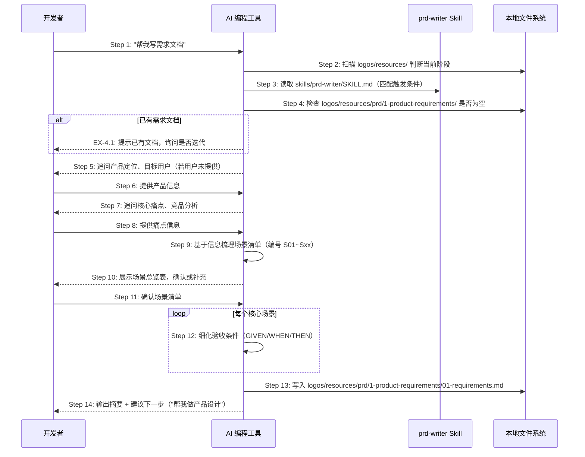

# S02: AI 辅助写需求文档 — 场景实现

> Phase 3 Step 1 · 场景建模

## 参与方

| 别名 | 组件 | 说明 |
|------|------|------|
| U | 开发者 | 在 AI 编程工具中输入自然语言 |
| AI | AI 编程工具 | Cursor / Claude Code / OpenCode，读取并执行 Skill |
| SK | prd-writer Skill | `skills/prd-writer/SKILL.md` |
| FS | 本地文件系统 | 资源目录 |

## 时序图

## 步骤说明

1. **开发者**在 AI 编程工具中输入「帮我写需求文档」（或类似意图的自然语言）。
2. **AI 编程工具**扫描 `logos/resources/` 目录结构，判断当前项目处于哪个阶段。

> AI 工具通过 `AGENTS.md` 的 Phase detection logic 判断当前处于 Phase 1。

3. **AI 编程工具**读取 `skills/prd-writer/SKILL.md`，获取需求文档撰写的执行步骤和输出规范。

> 通过 `logos-project.yaml` 的 `resource_index` 找到 prd-writer Skill 并读取。匹配是隐式的——AI 工具内部决定读取哪些文件作为上下文。

4. **AI 编程工具**检查 `logos/resources/prd/1-product-requirements/` 目录是否已有 `.md` 文件。如果已有需求文档 → 见 EX-4.1。
5. **AI 编程工具**向开发者追问关键信息：产品定位（一句话定位）、目标用户画像。
6. **开发者**提供产品定位和目标用户信息。
7. **AI 编程工具**继续追问核心痛点（P01、P02...）和已知的竞品或参考产品。
8. **开发者**提供痛点信息和参考资料。
9. **AI 编程工具**基于收集到的信息，梳理场景清单，为每个场景分配编号（S01、S02...）、名称、触发条件、关联痛点和优先级。

> 场景编号是全局唯一的追溯锚点，后续所有阶段（产品设计、时序图、API、测试、代码）都以此编号为基准。

10. **AI 编程工具**向开发者展示场景总览表，请求确认或补充遗漏的场景。
11. **开发者**确认场景清单（或要求补充/删除/调整优先级）。
12. **AI 编程工具**为每个核心场景细化验收条件，使用 GIVEN/WHEN/THEN 格式定义正常路径和异常路径。
13. **AI 编程工具**将完整的需求文档写入 `logos/resources/prd/1-product-requirements/01-requirements.md`，包含固定结构：产品背景与目标、用户痛点分析、场景总览表、核心场景详述（含验收条件）、约束与边界。
14. **AI 编程工具**输出文档摘要（场景数量、P0 场景列表），并建议下一步操作：「帮我做产品设计」。

## 异常用例

### EX-4.1: 需求文档已存在

- **触发条件**：Step 4 检测到 `logos/resources/prd/1-product-requirements/` 下已有 `.md` 文件
- **期望响应**：AI 询问用户意图——是要在现有文档基础上迭代，还是通过变更管理（S09）创建增量修改
- **副作用**：不覆盖已有文档，等待用户明确意图后再继续

### EX-6.1: 用户信息不足

- **触发条件**：Step 5~8 中用户提供的信息无法支撑场景定义（如只说"帮我写个需求文档"但不提供任何产品信息）
- **期望响应**：AI 继续追问具体信息，不生成缺乏关键信息的占位文档
- **副作用**：无，信息充足后正常进入 Step 9
