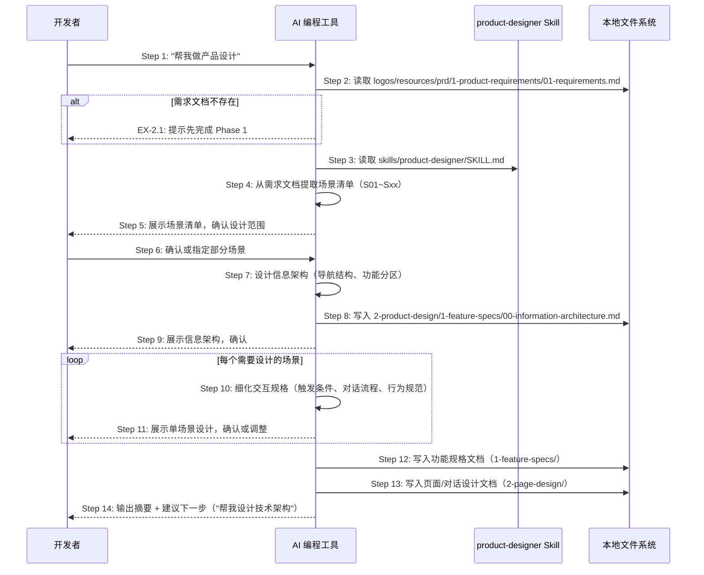

# S03: AI 辅助做产品设计 — 场景实现

> Phase 3 Step 1 · 场景建模

## 参与方

| 别名 | 组件 | 说明 |
|------|------|------|
| U | 开发者 | 在 AI 编程工具中输入自然语言 |
| AI | AI 编程工具 | Cursor / Claude Code / OpenCode |
| SK | product-designer Skill | `skills/product-designer/SKILL.md` |
| FS | 本地文件系统 | 资源目录 |

## 时序图

## 步骤说明

1. **开发者**在 AI 编程工具中输入「帮我做产品设计」。
2. **AI 编程工具**读取 `logos/resources/prd/1-product-requirements/01-requirements.md`，获取场景清单和验收条件。如果需求文档不存在 → 见 EX-2.1。
3. **AI 编程工具**读取 `skills/product-designer/SKILL.md`，获取产品设计的执行步骤和输出规范。
4. **AI 编程工具**从需求文档中提取场景清单（S01~Sxx），包括编号、名称、优先级。
5. **AI 编程工具**向开发者展示场景清单，询问本次设计范围（全部场景还是仅 P0 场景）。
6. **开发者**确认设计范围（或指定具体场景编号）。
7. **AI 编程工具**设计整体的信息架构：CLI 命令列表、AI Skills 编排顺序、场景与交付物映射表。

> 信息架构先行——先建立全局框架，再逐场景细化。这确保各场景设计在一致的框架下进行。

8. **AI 编程工具**将信息架构文档写入 `logos/resources/prd/2-product-design/1-feature-specs/00-information-architecture.md`。
9. **AI 编程工具**向开发者展示信息架构，请求确认或调整。
10. **AI 编程工具**为每个场景细化交互规格：触发条件、前置依赖、对话流程（正常 + 异常）、AI 行为规范。

> OpenLogos 项目的"页面设计"不是传统 GUI 线框图，而是 CLI 终端输出原型和 AI Skills 对话脚本。

11. **开发者**逐场景审阅交互规格，确认或要求调整。
12. **AI 编程工具**将所有功能规格文档写入 `logos/resources/prd/2-product-design/1-feature-specs/`。
13. **AI 编程工具**将页面/对话设计文档写入 `logos/resources/prd/2-product-design/2-page-design/`。
14. **AI 编程工具**输出设计摘要（涵盖的场景数、文档清单），并建议下一步操作：「帮我设计技术架构」。

## 异常用例

### EX-2.1: 缺少需求文档

- **触发条件**：Step 2 检测到 `logos/resources/prd/1-product-requirements/` 为空
- **期望响应**：AI 提示「未找到需求文档，请先完成 Phase 1」
- **副作用**：不生成任何设计文档
