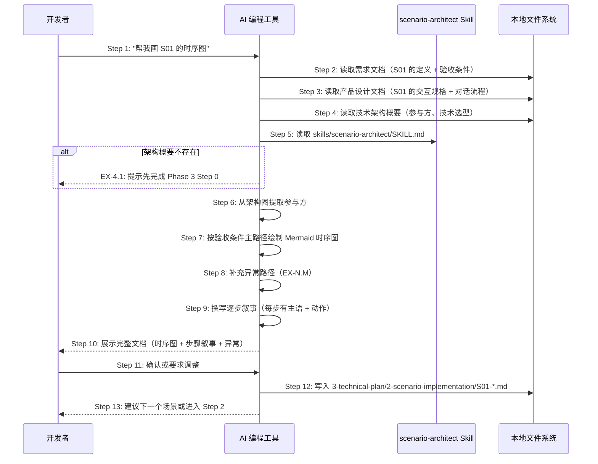

# S04: AI 辅助场景建模 — 场景实现

> Phase 3 Step 1 · 场景建模

## 参与方

| 别名 | 组件 | 说明 |
|------|------|------|
| U | 开发者 | 在 AI 编程工具中输入自然语言 |
| AI | AI 编程工具 | Cursor / Claude Code / OpenCode |
| SK | scenario-architect Skill | `skills/scenario-architect/SKILL.md` |
| FS | 本地文件系统 | 资源目录 |

## 时序图

## 步骤说明

1. **开发者**在 AI 编程工具中输入「帮我画 S01 的时序图」（或指定其他场景编号）。如果场景编号在需求文档中未定义 → 见 EX-1.1。
2. **AI 编程工具**读取 `logos/resources/prd/1-product-requirements/01-requirements.md`，从中提取 S01 的场景定义、触发条件和 GIVEN/WHEN/THEN 验收条件。
3. **AI 编程工具**读取 `logos/resources/prd/2-product-design/` 下与 S01 相关的交互规格和对话流程设计。
4. **AI 编程工具**读取 `logos/resources/prd/3-technical-plan/1-architecture/01-architecture-overview.md`，获取系统参与方和技术选型。如果架构概要不存在 → 见 EX-4.1。
5. **AI 编程工具**读取 `skills/scenario-architect/SKILL.md`，获取时序图编写规范（编号规则、参与方规范、格式模板、步骤叙事格式）。
6. **AI 编程工具**从架构图中提取该场景涉及的参与方，确定短别名和全名（如 CLI 场景：U = 用户终端、CLI = openlogos CLI、FS = 本地文件系统）。
7. **AI 编程工具**按需求文档中的 GIVEN/WHEN/THEN 主路径，绘制 Mermaid 时序图，每个箭头带 `Step N:` 编号前缀和行为描述。
8. **AI 编程工具**从需求文档的异常验收条件和产品设计的异常对话流程中提取异常用例，使用 `EX-N.M` 编号补充到时序图中。

> 编号规则：`EX-{触发步骤编号}.{该步骤下的异常序号}`。每个涉及外部调用的步骤至少补充 1 个技术异常。

9. **AI 编程工具**撰写步骤叙事：用连续编号列表将时序图的每一步翻译为人类可读的线性叙事，每步以粗体主语开头，简单步骤一行带过，复杂步骤用 blockquote 补充设计决策。异常用例在正常流程之后单独成段。
10. **AI 编程工具**向开发者展示完整的场景实现文档：参与方表 + 时序图 + 步骤叙事 + 异常用例。
11. **开发者**审阅文档，确认或要求调整（如补充异常用例、修改参与方粒度、调整步骤顺序）。
12. **AI 编程工具**将最终文档写入 `logos/resources/prd/3-technical-plan/2-scenario-implementation/S01-*.md`。
13. **AI 编程工具**根据上下文智能建议下一步：如果还有未建模的 P0 场景，建议继续（如「帮我画 S08 的时序图」）；如果所有 P0 场景已建模，建议进入 Phase 3 Step 2（「帮我设计 API」）。

## 异常用例

### EX-1.1: 场景编号不存在

- **触发条件**：Step 1 中用户指定的场景编号在需求文档中未定义
- **期望响应**：AI 提示该编号不存在，询问是否需要先在 Phase 1 补充此场景
- **副作用**：不生成时序图

### EX-4.1: 架构概要不存在

- **触发条件**：Step 4 检测到 `logos/resources/prd/3-technical-plan/1-architecture/` 为空
- **期望响应**：AI 提示「未找到技术架构概要，请先完成 Phase 3 Step 0」
- **副作用**：不生成时序图

