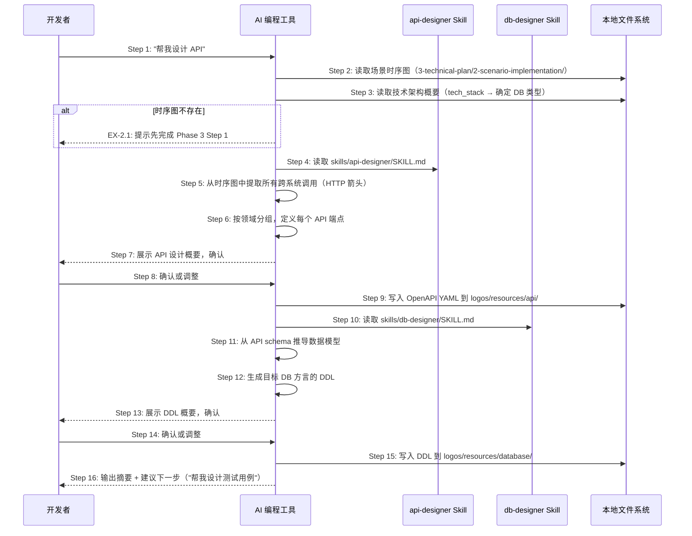

# S05: AI 辅助设计 API 和 DB — 场景实现

> Phase 3 Step 1 · 场景建模

## 参与方

| 别名 | 组件 | 说明 |
|------|------|------|
| U | 开发者 | 在 AI 编程工具中输入自然语言 |
| AI | AI 编程工具 | Cursor / Claude Code / OpenCode |
| SK-A | api-designer Skill | `skills/api-designer/SKILL.md` |
| SK-D | db-designer Skill | `skills/db-designer/SKILL.md` |
| FS | 本地文件系统 | 资源目录 |

## 时序图

## 步骤说明

1. **开发者**在 AI 编程工具中输入「帮我设计 API」。
2. **AI 编程工具**读取 `logos/resources/prd/3-technical-plan/2-scenario-implementation/` 下的所有场景时序图。如果目录为空 → 见 EX-2.1。
3. **AI 编程工具**读取技术架构概要，获取 `tech_stack` 中的数据库类型（如 PostgreSQL、MySQL、SQLite），用于后续 DDL 方言选择。如果架构概要中未声明数据库类型 → 见 EX-3.1。
4. **AI 编程工具**读取 `skills/api-designer/SKILL.md`，获取 API 设计的执行步骤和输出规范。
5. **AI 编程工具**从时序图中提取所有跨系统边界的调用箭头——这些就是需要设计的 API 端点。

> 这是 OpenLogos 的核心原则：API 不是凭空设计的，而是从场景时序图中自然浮现。每个 API 端点都能追溯到时序图的 Step 编号。

6. **AI 编程工具**将提取到的 API 端点按领域分组（如 `auth`、`user`、`order`），为每个端点定义 `path`、`method`、`request schema`、`response schema`、`status codes`。

> 按领域分文件而非一个巨大的全量文件，利于 AI 上下文管理（一次只需加载相关领域的 API）。

7. **AI 编程工具**向开发者展示 API 设计概要：端点列表、关键字段、领域分组。
8. **开发者**确认 API 设计或要求调整（如修改路径命名、调整字段类型、增减端点）。
9. **AI 编程工具**将确认的 API 设计以 OpenAPI 3.0 YAML 格式写入 `logos/resources/api/`（按领域分文件，如 `auth.yaml`、`user.yaml`）。
10. **AI 编程工具**读取 `skills/db-designer/SKILL.md`，获取 DB 设计的执行步骤和输出规范。
11. **AI 编程工具**从 API 的 request/response schema 反推数据模型：识别实体、字段、字段类型、实体间关系。

> DB 设计不是独立进行的，而是从 API schema 推导。这确保了 API 定义和 DB 结构的一致性。

12. **AI 编程工具**基于推导出的数据模型，生成目标数据库方言的 DDL（含表定义、索引、约束、外键、注释）。
13. **AI 编程工具**向开发者展示 DDL 概要：表名列表、关键约束（UNIQUE、CHECK、FK）。
14. **开发者**确认 DDL 或要求调整。
15. **AI 编程工具**将确认的 DDL 写入 `logos/resources/database/`。
16. **AI 编程工具**输出设计摘要（API 端点数 + DB 表数），并建议下一步操作：「帮我设计测试用例」。

> 对于不涉及 HTTP API 的项目（如纯 CLI 工具），Step 1~9 会被跳过。OpenLogos 项目自身没有 HTTP API 也没有数据库，因此 S05 不适用，本文档仅作为方法论参考。

## 异常用例

### EX-2.1: 时序图不存在

- **触发条件**：Step 2 检测到 `logos/resources/prd/3-technical-plan/2-scenario-implementation/` 为空
- **期望响应**：AI 提示「未找到时序图，请先完成 Phase 3 Step 1 场景建模」
- **副作用**：不生成 API 或 DB 文件

### EX-3.1: 技术选型未确定

- **触发条件**：Step 3 检测到 `logos-project.yaml` 中 `tech_stack` 未声明数据库类型
- **期望响应**：AI 先询问用户确认数据库选择，再生成对应方言的 DDL
- **副作用**：无，确认后正常继续
