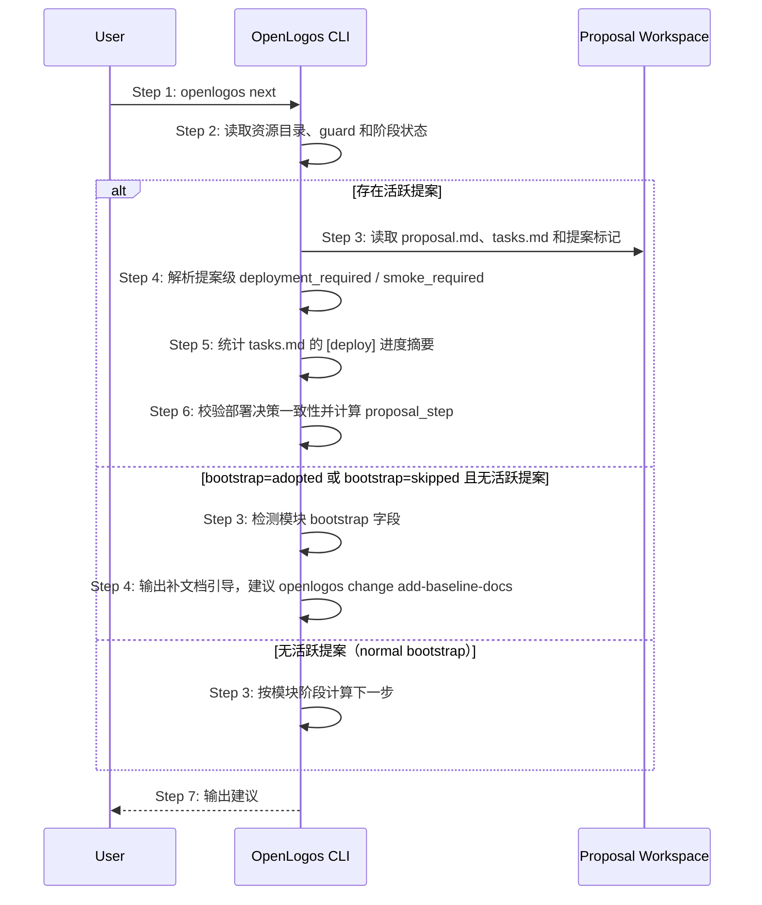

# S05: 查看下一步建议 — 时序图



## 步骤说明
1. **用户**执行 `openlogos next`。
2. **CLI** 读取当前阶段和活跃变更信息。
3. **CLI** 在存在活跃提案时读取提案工作区；无活跃提案时检查模块 `bootstrap` 字段。**对 initial 模块（无活跃提案路径），下一步建议自 M1 切片 B1 起消费 `cli/src/lib/flow-derive.ts` 基于 builtin initial flow 派生的 `current_phase`，取代原硬编码 `PHASE_KEYS` 推断；launched 路径（活跃提案）的 `proposal_step` 自 M1 切片 B2 起改由 `flow-derive` 的 `detectProposalStepViaFlow` 基于 builtin launched flow 派生（取代旧 `detectProposalStep` 调用点），输出与旧逻辑逐态一致、next 的 `action`/`detail` 1:1 不变；marker 非对称优先级、提案级部署决策与冲突阻塞作为引擎规则保留。**
4. **CLI** 若 `bootstrap: adopted` 或历史 `bootstrap: skipped` 且无活跃提案，直接输出补文档引导；否则解析提案级部署决策，并与 `[deploy]` section 交叉校验。
5. **CLI** 只从 `tasks.md` 的 `[deploy]` section 统计部署进度摘要；该摘要可用于提示任务完成情况，但不能替代部署决策。
6. **CLI** 先校验 `proposal.md` 与 `[deploy]` section 是否一致，再选择唯一建议：冲突时建议修正 proposal / tasks；无需部署且 verify PASS 时建议 archive；需要部署时建议人类授权部署；需要 smoke 时建议 `openlogos smoke`。
7. **CLI** 输出建议文本或 JSON。

## next 的 initial 路径派生来源（flow-derive）

- next 的 initial 路径（无活跃提案、`lifecycle: initial` 模块）的「下一步建议」由
  `flow-derive` 派生的 `current_phase` 决定：`current_phase` = flow 中第一个未 done 且未
  skipped 的 node 对应的 phase-key，再经既有 `SUGGEST_KEYS` 映射到建议文案，
  `next --format json` 的 `action` / `detail` 保持与旧逻辑一致。
- **来源 = builtin initial flow，不应用 overlay**；`when` / `done_when` / fan-out 覆盖
  与场景文件 `includes()` 子串匹配语义与 S11 完全一致（见 `core-S11-status-progress`）。
- **launched 路径派生来源（自 M1 切片 B2 更新）**：活跃提案下 next 仍消费 `collectStatusData`
  得到的 `proposal_step`，再经既有映射输出 `action` / `detail`；其中 `proposal_step` 的判定
  来源自 B2 起改由 `flow-derive` 的 `detectProposalStepViaFlow` 基于内置 launched flow 派生
  （取代旧 `detectProposalStep` 调用点）。`detectProposalStepViaFlow` 输出与旧 `detectProposalStep`
  **逐态等价**，故 next 的 `action` / `detail` **1:1 不变**——marker 非对称优先级、提案级部署
  决策、冲突阻塞、deploy/smoke marker 推进均作为引擎规则保留、不下沉 flow。
- 等价性由 golden 基线 + 测试期并跑断言锁定：fresh / adopted / 各 `skip_phases` 组合 /
  无 `skip_phases` 老项目（fallback-skip）下 `next --format json` 的 `action` / `detail`
  与旧逻辑逐字节一致；launched 路径各 `proposal_step` 态下 next 输出零漂移由 launched 提案
  next fixture 的 golden 与 S09 并跑等价矩阵共同覆盖（**本切片不新增 S05 用例**）。

## 异常用例
### EX-2.1: 项目未初始化
- **触发条件**：缺少 `logos/logos.config.json`。
- **期望响应**：输出错误并退出。

### EX-3.1: bootstrap=adopted 或历史 skipped 且无活跃提案
- **触发条件**：模块 `bootstrap: adopted`（或历史 `bootstrap: skipped`），且 `logos/.openlogos-guard` 不存在。
- **期望响应**：输出补文档引导，建议执行 `openlogos change add-baseline-docs`，不建议直接开始业务迭代。
- **副作用**：无状态修改。

### EX-4.1: 部署决策冲突
- **触发条件**：`proposal.md` 声明无需部署但 `tasks.md` 存在 `[deploy]` section，或声明需要部署但缺少 `[deploy]` section。
- **期望响应**：输出冲突警告，并提示用户修正 proposal / tasks；不得自动进入部署执行。

### EX-4.2: 部署进度不可用
- **触发条件**：活跃提案需要部署，但 `tasks.md` 缺失或无法读取。
- **期望响应**：输出可诊断提示；不得把部署进度伪装成已完成。

## deploy-done 对 next 的影响

当活跃提案处于 `ready-to-deploy` 时，`openlogos next` 的下一步仍然是部署授权，但详情必须说明部署完成后通过 CLI 写入 marker：

```text
部署是人类确认点。部署完成并写入 deployment-report.md 后，执行 openlogos deploy-done 标记部署完成。
```

当 `DEPLOY_DONE` 存在且 `[deploy]` section 已全部勾选：
- 若 `smoke_required=true`，`next` 返回 `ready-to-smoke`，提示明确授权执行 `openlogos smoke`。
- 若 `smoke_required=false`，`next` 返回 `deploy-done`，提示明确授权执行 `openlogos archive <slug>`。

`next` 不得建议用户或 AI 手写 `DEPLOY_DONE`。
