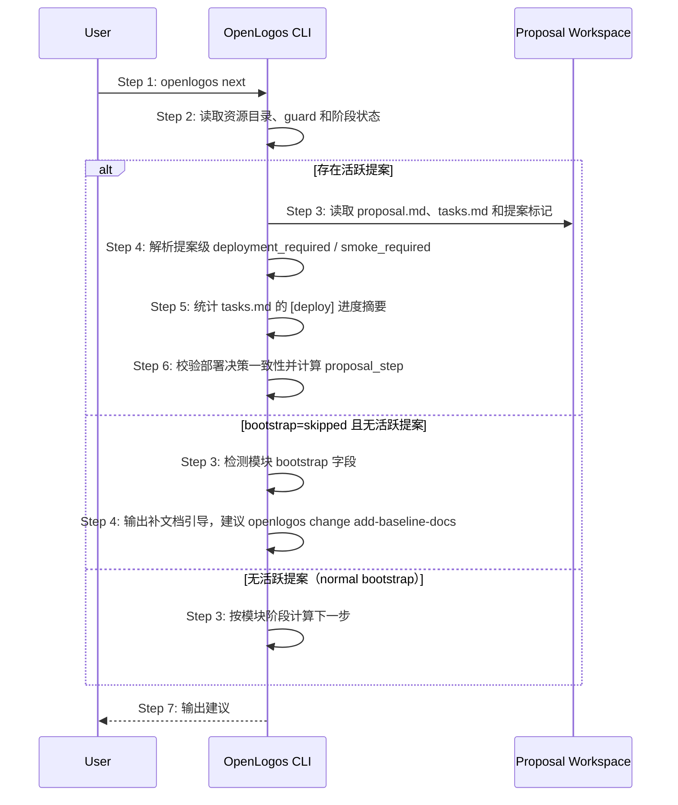

# S05: 查看下一步建议 — 时序图

## 步骤说明
1. **用户**执行 `openlogos next`。
2. **CLI** 读取当前阶段和活跃变更信息。
3. **CLI** 在存在活跃提案时读取提案工作区；无活跃提案时检查模块 `bootstrap` 字段。
4. **CLI** 若 `bootstrap: skipped` 且无活跃提案，直接输出补文档引导；否则解析提案级部署决策，并与 `[deploy]` section 交叉校验。
5. **CLI** 只从 `tasks.md` 的 `[deploy]` section 统计部署进度摘要；该摘要可用于提示任务完成情况，但不能替代部署决策。
6. **CLI** 先校验 `proposal.md` 与 `[deploy]` section 是否一致，再选择唯一建议：冲突时建议修正 proposal / tasks；无需部署且 verify PASS 时建议 archive；需要部署时建议人类授权部署；需要 smoke 时建议 `openlogos smoke`。
7. **CLI** 输出建议文本或 JSON。

## 异常用例
### EX-2.1: 项目未初始化
- **触发条件**：缺少 `logos/logos.config.json`。
- **期望响应**：输出错误并退出。

### EX-3.1: bootstrap=skipped 且无活跃提案
- **触发条件**：模块 `bootstrap: skipped`，且 `logos/.openlogos-guard` 不存在。
- **期望响应**：输出补文档引导，建议执行 `openlogos change add-baseline-docs`，不建议直接开始业务迭代。
- **副作用**：无状态修改。

### EX-4.1: 部署决策冲突
- **触发条件**：`proposal.md` 声明无需部署但 `tasks.md` 存在 `[deploy]` section，或声明需要部署但缺少 `[deploy]` section。
- **期望响应**：输出冲突警告，并提示用户修正 proposal / tasks；不得自动进入部署执行。

### EX-4.2: 部署进度不可用
- **触发条件**：活跃提案需要部署，但 `tasks.md` 缺失或无法读取。
- **期望响应**：输出可诊断提示；不得把部署进度伪装成已完成。
