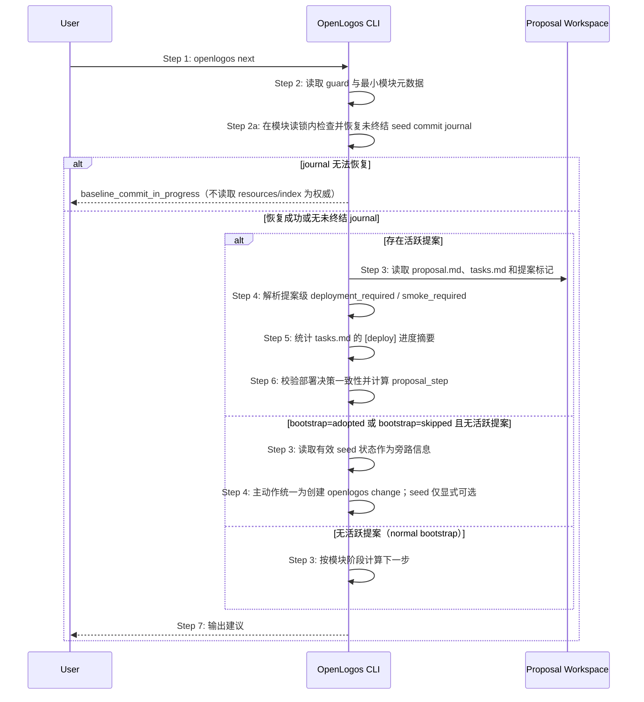
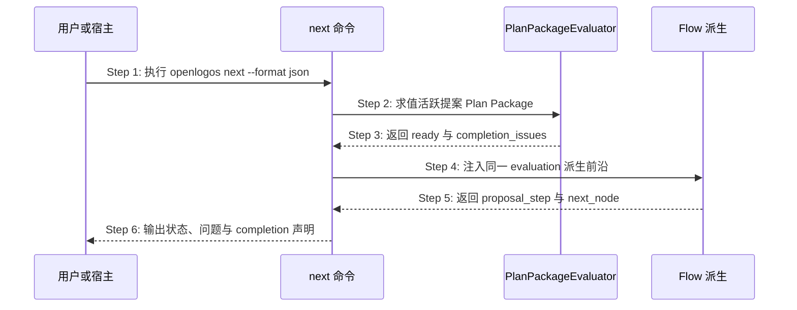
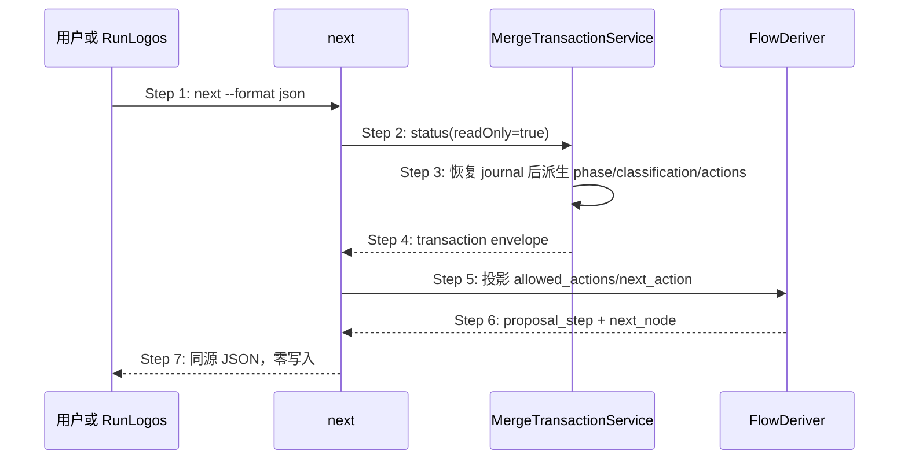
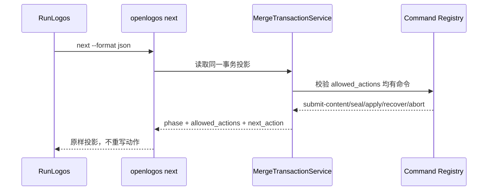
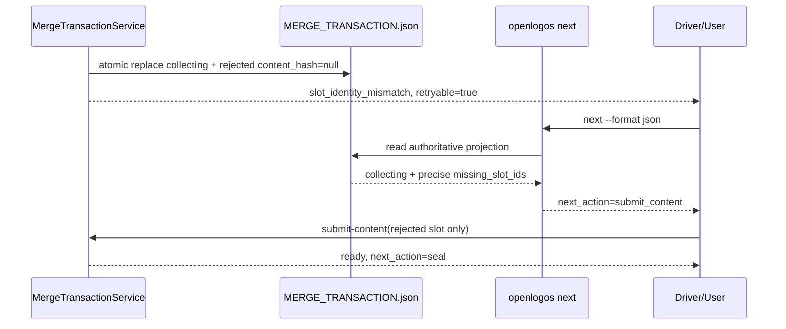
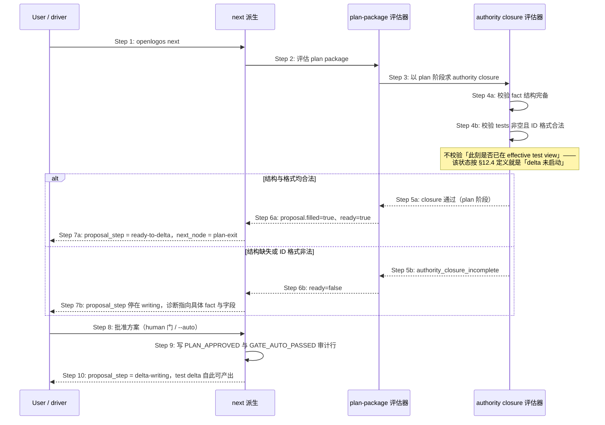

# S05: 查看下一步建议 — 时序图


```mermaid
sequenceDiagram
    participant U as User
    participant C as OpenLogos CLI
    participant P as Proposal Workspace

    U->>C: Step 1: openlogos next
    C->>C: Step 2: 读取 guard 与最小模块元数据
    C->>C: Step 2a: 在模块读锁内检查并恢复未终结 seed commit journal
    alt journal 无法恢复
        C-->>U: baseline_commit_in_progress（不读取 resources/index 为权威）
    else 恢复成功或无未终结 journal
        alt 存在活跃提案
            C->>P: Step 3: 读取 proposal.md、tasks.md 和提案标记
            C->>C: Step 4: 解析提案级 deployment_required / smoke_required
            C->>C: Step 5: 统计 tasks.md 的 [deploy] 进度摘要
            C->>C: Step 6: 校验部署决策一致性并计算 proposal_step
        else bootstrap=adopted 或 bootstrap=skipped 且无活跃提案
            C->>C: Step 3: 读取有效 seed 状态作为旁路信息
            C->>C: Step 4: 主动作统一为创建 openlogos change；seed 仅显式可选
        else 无活跃提案（normal bootstrap）
            C->>C: Step 3: 按模块阶段计算下一步
        end
        C-->>U: Step 7: 输出建议
    end
```

## 步骤说明
1. **用户**执行 `openlogos next`。
2. **CLI** 先读取 guard 与恢复所需的最小模块元数据；任何 `logos/resources/**`、`baseline_index` 或覆盖率读取之前，必须在同一模块读锁区间内检查并恢复未终结 seed commit journal。无法前滚或回滚时返回 `baseline_commit_in_progress`，不得继续派生建议。安全的 open run / 未提交 staging 不属于未终结 commit journal，可排除后继续。
3. **CLI** 在存在活跃提案时读取提案工作区；无活跃提案时检查模块 `bootstrap` 字段。**对 initial 模块（无活跃提案路径），下一步建议自 M1 切片 B1 起消费 `cli/src/lib/flow-derive.ts` 基于 builtin initial flow 派生的 `current_phase`，取代原硬编码 `PHASE_KEYS` 推断；launched 路径（活跃提案）的 `proposal_step` 自 M1 切片 B2 起改由 `flow-derive` 的 `detectProposalStepViaFlow` 基于 builtin launched flow 派生（取代旧 `detectProposalStep` 调用点）；marker 非对称优先级、提案级部署决策与冲突阻塞作为引擎规则保留。**
4. **CLI** 若 `bootstrap: adopted` 或历史 `bootstrap: skipped` 且无活跃提案，`required`、安全 `partial`、`seeded` 三态的主 `action` / `next_node` 均指向创建 `openlogos change <slug>`；seed 状态只作为机器字段与显式可选扫描提示。否则解析提案级部署决策，并与 `[deploy]` section 交叉校验。
5. **CLI** 只从 `tasks.md` 的 `[deploy]` section 统计部署进度摘要；该摘要可用于提示任务完成情况，但不能替代部署决策。
6. **CLI** 先校验 `proposal.md` 与 `[deploy]` section 是否一致，再选择唯一建议：冲突时建议修正 proposal / tasks；无需部署且 verify PASS 时建议 archive；需要部署时建议人类授权部署；需要 smoke 时建议 `openlogos smoke`。
7. **CLI** 输出建议文本或 JSON。JSON 模式下 `data` 顶层携带 `contract: {"version": "1.0.0"}`，且每个 `next_node` 恒带完整 `dispatch` 对象（详见「next 的契约自描述输出（contract / next_node.dispatch）」）。

## next 的 initial 路径派生来源（flow-derive）

- next 的 initial 路径（无活跃提案、`lifecycle: initial` 模块）的「下一步建议」由
  `flow-derive` 派生的 `current_phase` 决定：`current_phase` = flow 中第一个未 done 且未
  skipped 的 node 对应的 phase-key，再经既有 `SUGGEST_KEYS` 映射到建议文案。
- **来源 = builtin initial flow，不应用 overlay**；`when` / `done_when` / fan-out 覆盖
  与场景文件 `includes()` 子串匹配语义与 S11 完全一致（见 `core-S11-status-progress`）。
- **launched 路径派生来源（自 M1 切片 B2 更新）**：活跃提案下 next 仍消费 `collectStatusData`
  得到的 `proposal_step`，再经既有映射输出 `action` / `detail`；其中 `proposal_step` 的判定
  来源自 B2 起改由 `flow-derive` 的 `detectProposalStepViaFlow` 基于内置 launched flow 派生
  （取代旧 `detectProposalStep` 调用点）。`detectProposalStepViaFlow` 输出与旧 `detectProposalStep`
  **逐态等价**，故活跃提案路径的 `action` / `detail` **1:1 不变**——marker 非对称优先级、提案级部署
  决策、冲突阻塞、deploy/smoke marker 推进均作为引擎规则保留、不下沉 flow。
- 等价性由 golden 基线 + 测试期并跑断言锁定：fresh / 各 `skip_phases` 组合 / 无 `skip_phases`
  老项目（fallback-skip）与 launched 各 `proposal_step` 态保持零漂移；**adopted/skipped 且无活跃提案**是本案主动行为变更，`required`/安全 `partial`/`seeded` 均重拍为 change 主动作，不能继续套用旧 golden。

## next 的契约自描述输出（contract / next_node.dispatch）

本节按提案 contract-self-description（C4/C5）定义 `next --format json` 的契约自描述能力：消费方（AI driver）不再依赖本地缓存的世界模型猜测契约形态与派发安全性。

### contract 版本握手

- status/next 的 `data` 顶层新增 `"contract": {"version": "1.0.0"}`（语义化契约版本，独立于 CLI 版本）。
- SemVer 规则：**major** = 必填字段删除/改义、闭合枚举语义变化（含移除值）、既有字段挂出判据变更；**minor** = 向后兼容扩展（新增可选字段、闭合枚举新增值）；**patch** = 不改形态与语义的澄清。
- 版本-schema 一一映射：`spec/schema/status.schema.json`、`spec/schema/next.schema.json`（内嵌契约版本号，随 npm prepack 打包）；响应 `contract.version` 与打包 schema 版本一致，CI 校验。
- 初始 `contract.version = "1.0.0"`；此前无 `contract` 字段的历史输出视为「0.x 前契约时代」，消费方按缺字段保守分支处理。envelope / contract / schema 的完整定义场景见 `core-S16-machine-json-output`。

### next_node.dispatch 与 requires_reviewed

- 每个 `next_node` 恒带完整 `dispatch: {"idempotent": bool, "timeout_seconds": int, "artifacts_hint": string[]}`；节点可另声明 `requires_reviewed: string[]`。
- 权威数据源 = flow 节点定义（内置模板逐节点人工声明，**不从 produces/done_when 推导**）；resolved flow 派生把节点元数据透传进 `next_node`——`next_node.dispatch` 恒为完整对象，无二义分支。flow 文件 schema 与加载层扩展见 S22，overlay 派生见 S25。
- overlay-add 未声明 → 保守默认 `{idempotent:false, timeout_seconds: defaults.dispatch.timeout_seconds, artifacts_hint: []}`；`artifacts_hint: []` ＝「产物未知」契约语义：消费方不得据此判死，只能升级观察。
- flow 文件顶层新增 `defaults: {dispatch: {timeout_seconds: 900}}`（唯一默认值源（fallback）；overlay 可覆盖；resolved 物化进每节点）。flow 文件 schema `version: 1` 保持不变（字段为向后兼容扩展）。
- 内置节点声明基准：内容产出/评审节点（write-proposal、write-tasks、write-delta、plan-slices、review 类、code）idempotent:true；一次性落盘/执行节点（apply-merge、deploy、archive 类）idempotent:false；verify/smoke 命令节点 idempotent:true。timeout_seconds：默认 900，code/implement 类 3600，deploy 类 1800。artifacts_hint 写该节点的具体产物提示（如 `["proposal.md"]`、`["logos/resources/**","SPEC_MERGED"]`）。apply-merge 声明 `requires_reviewed: ["proposal","delta"]`。
- driver 的 `priorReviewNode` 本地映射表退化为消费 `requires_reviewed` 声明（no-delta 幻影评审类漂移从根上消掉）。

### 未知值的消费方保守语义（规范性引用）

- 消费方约定（规范性引用，验收归 runlogos R5）：未知 major / 缺 `contract` 字段 → 保守模式（仅 next 驱动普通推进 + 看门狗，启发式判定降级为仅观察）；契约内任何枚举遇未知值 → 保守分支。
- 消费方不得以 `artifacts_hint` 为空/不达作为判死依据，只能升级观察。
- 验收边界：openlogos 本提案只验**生产者契约**（dispatch 字段来源正确、contract 版本字段在场、schema 校验通过）；消费方保守模式 / 零误杀验收归 runlogos R5 提案。
- 拍板原则：宁慢勿错杀——多等 5 分钟看门狗远好于误杀健康 run。一切措辞与设计冲突以此裁决。

### 主动破例声明（golden / 不变量）

- **主动破例**：破 next_node R8「8 字段逐字节不变」锚（`spec/cli-json-output.md`）——新增 `dispatch` / `requires_reviewed` 子字段，next golden（用例 2/6）重拍，S28 场景与 R8 验收措辞同步修改。
- **主动破例**：破「data 顶层逐字节不变（golden 零漂移）」——`data` 顶层新增 `contract` → 全部 9 个 golden 基线快照重拍（本提案唯一的全量 golden 重拍点，随大版本发布；见 `core-S16-machine-json-output`）。
- **本案主动破例**：adopted/skipped 无活跃提案 fixture 的 seed 三态主动作统一改为 `openlogos change <slug>`；仅该 fixture 族按新期望重拍，fresh/活跃提案等其余 fixture 仍零漂移。

### EX-7.1: overlay-add 节点未声明 dispatch
- **触发条件**：项目 overlay 通过 overlay-add 新增节点，且未声明 `dispatch`。
- **期望响应**：`next` 对该节点输出完整保守默认对象 `{idempotent:false, timeout_seconds: defaults.dispatch.timeout_seconds, artifacts_hint: []}`，并通过 schema 校验；不存在「dispatch 缺失 / 部分对象」的二义分支。
- **副作用**：无。

## 异常用例
### EX-2.1: 项目未初始化
- **触发条件**：缺少 `logos/logos.config.json`。
- **期望响应**：输出错误并退出。

### EX-3.1: bootstrap=adopted 或历史 skipped 且无活跃提案
- **触发条件**：模块 `bootstrap: adopted`（或历史 `bootstrap: skipped`），且 `logos/.openlogos-guard` 不存在；恢复门已确认无未终结 journal，或已成功恢复。
- **期望响应**：按**有效** `baseline_seed_state` 输出旁路信息，但主动作统一。有效状态**一律经共享 helper `effectiveBaselineSeedState` 取得**（explicit 显式值优先；yaml 缺省时按统一派生规则：有候选+open run→`partial`、有候选无 open run→`seeded`、无候选→`required`；**无 `unknown` 第三态**，见 core-06 §4.1）——`next` 不得本地 `?? 'required'` 私自推断：
  - `required`：主 `action` / `next_node` 指向创建 `openlogos change <slug>`；detail 说明可直接描述首个增量，由提案规划补齐触达场景规格。可附“显式执行全库 seed 可加速后续扫描”的次要提示，但不得要求先 seed。
  - `partial`：若仅为安全的 open run / 未提交 staging，主 `action` / `next_node` 同样指向 change；JSON `baseline_coverage.incomplete=true`，可附重试 `baseline-seed` 的非阻断诊断，staging 不进入规格有效视图。
  - `seeded`：主 `action` / `next_node` 指向 change；detail 可说明已提交 seed 只用于加速证据定位，仍需按触达场景闭包；覆盖率只保留在 JSON 机器字段。
  - 覆盖率无法可信重算（派生索引缺失/过期/解析失败）时 JSON `freshness=unknown`/`stale`，不改变 change 主动作。
  - **legacy 派生态（`legacy: true`，yaml 未落盘）**：上述分档仍生效，同时附「运行 `openlogos sync` 把派生状态落盘为显式枚举」提示；该迁移提示不是 change 前置。
- **副作用**：无状态修改；`status`/`next`/`baseline-seed status` 对同一模块的有效状态逐字节一致；不得创建 `add-baseline-docs` 提案。

### EX-3.6: 未终结 commit journal 无法恢复
- **触发条件**：模块 seed journal 为 `prepared`/`committing` 等未终结状态，读取门无法安全前滚或回滚。
- **期望响应**：`next` 返回硬操作错误 `baseline_commit_in_progress`；错误包含 module、journal/run 标识与恢复建议。不得读取或使用可能半新的 `logos/resources/**`、`baseline_index`、coverage 或 seed 状态派生业务建议，也不得输出可执行 change 主动作。
- **副作用**：零写入（恢复尝试本身的受控 journal 操作除外）；修复 journal 并重试后才进入 EX-3.1。

### EX-4.1: 部署决策冲突
- **触发条件**：`proposal.md` 声明无需部署但 `tasks.md` 存在 `[deploy]` section，或声明需要部署但缺少 `[deploy]` section。
- **期望响应**：输出冲突警告，并提示用户修正 proposal / tasks；不得自动进入部署执行。

### EX-4.2: 部署进度不可用
- **触发条件**：活跃提案需要部署，但 `tasks.md` 缺失或无法读取。
- **期望响应**：输出可诊断提示；不得把部署进度伪装成已完成。

## adopted 模块覆盖率引导（brownfield-adopter）

`bootstrap: adopted` 且无活跃提案时，`next`（与 `status` 同源）在恢复门成功后读取 seed 状态与覆盖率作为旁路机器信息：

- **数据来源**：覆盖率只读已合并主文档中各产物 `## 逆向基线来源` 章节，经派生索引（携 `source_hash` + 生成时间）聚合；索引失效时降级 `unknown`/`stale` 或按文档权威章节实时重算。
- **计数口径（JSON 机器字段）**：tombstone 分母法——`denominator` = 存活候选 ∪ tombstone 候选数；删除候选转 tombstone 仍计入、不缩小计数（纯逆向候选计数，无分子、无 `coverage` 比值）。
- **不进主动作**：`required`、安全 `partial`、`seeded` 均不决定主 `action` / `next_node`；主动作是创建 change。`denominator`/`tombstones` 等只作为 `baseline_coverage` JSON 字段，不向用户暴露内部记账概念。
- **事务硬门**：未终结 journal 必须在同一读锁区间恢复；无法恢复时整个读取失败，不能用“忽略 seed”绕过半新 resources。
- **JSON**：`next --format json` 输出 `baseline_coverage`（见 cli-experience §2.22），与 `status` 字段一致。

### EX-3.2: seeded 后引导迭代（不展示覆盖率人读行）
- **触发条件**：`bootstrap: adopted`、状态位 `seeded`、无活跃提案。
- **期望响应**：`next` 输出可直接创建 `openlogos change <slug>`；已提交 seed 仅作可选扫描加速，不展示覆盖率人读行。`baseline_coverage` JSON 字段照常输出。
- **副作用**：无。

### EX-3.3: 覆盖率不可信时降级
- **触发条件**：派生索引缺失/过期（`source_hash` 与文档不符）/解析失败，且不存在未终结 journal。
- **期望响应**：`next`/`status` 输出 `unknown`/`stale`，不输出貌似精确的百分比；主动作仍是 change。
- **副作用**：无。

### EX-3.4: partial 恢复态（**无活跃提案**，guard 不存在）
- **触发条件**：`bootstrap: adopted`、`baseline_seed_state: partial`、`logos/.openlogos-guard` 不存在，且仅存在安全的 open run / 未提交 staging；未终结 journal 不适用本分支。
- **期望响应**：`status`/`next` 一致显示 `baseline_coverage.state=partial`、`incomplete=true`；主 `action`/`next_node` 指向 `openlogos change <slug>`；可附 `baseline-seed commit`/重新 `begin` 的非阻断恢复提示；staging 不参与 target 存在性或 effective view。
- **副作用**：seed 重试成功回 `seeded`、再失败保持 `partial`；change 生命周期不被 seed 状态改写。

### EX-3.5: partial 恢复态（**有活跃提案**，guard 存在）
- **触发条件**：`bootstrap: adopted`、`baseline_seed_state: partial`、`logos/.openlogos-guard` 存在，且恢复门已确认无未终结 journal，或已成功恢复。
- **期望响应**：`next` 主 `action`/`next_node`/`proposal_step` 保持该提案真实前沿；安全的 open run / staging 恢复以结构化旁路诊断呈现，`baseline_coverage.state=partial`、`incomplete=true` 如实输出。若 journal 无法恢复则改走 EX-3.6 硬错误，不能降级 advisory。
- **副作用**：不改提案生命周期、不改 guard；状态仅由 `openlogos baseline-seed` 写。

## deploy-done 对 next 的影响

当活跃提案处于 `ready-to-deploy` 时，`openlogos next` 的下一步仍然是部署授权，但详情必须说明部署完成后通过 CLI 写入 marker：

```text
部署是人类确认点。部署完成并写入 deployment-report.md 后，执行 openlogos deploy-done 标记部署完成。
```

当 `DEPLOY_DONE` 存在且 `[deploy]` section 已全部勾选：
- 若 `smoke_required=true`，`next` 返回 `ready-to-smoke`，提示明确授权执行 `openlogos smoke`。
- 若 `smoke_required=false`，`next` 返回 `deploy-done`，提示明确授权执行 `openlogos archive <slug>`。

`next` 不得建议用户或 AI 手写 `DEPLOY_DONE`。

## spec-complete-required / test-id-required 的 next 建议

当活跃提案处于 launched 生命周期且需要代码实现时，`openlogos next` 必须在派发 `plan-slices` 之前检查两个前置：

1. spec-complete 是否已完成；
2. 真实测试 ID 是否已稳定。

### spec-complete-required

- **触发条件**：`code_required==true`，提案无待写 delta 或 delta 已处理，但提案目录缺少 `SPEC_MERGED` / `MERGED`。
- **期望响应**：`proposal_step=="spec-complete-required"`，`next_node` 省略或指向 no-delta merge 命令提示，不得指向 `plan-slices`。
- **建议文案**：提示执行 `openlogos merge <slug>`。若无 delta，merge 将执行 no-op merge 并写入 `SPEC_MERGED`。
- **JSON 诊断**：`reason=="no_delta_spec_marker_missing"`，`remediation=="run openlogos merge <slug>"`。

### test-id-required

- **触发条件**：spec-complete 已完成，`code_required==true`，但无法解析本提案将由 `[code]` 切片覆盖的真实 `UT-*` / `ST-*` / `SMOKE-*` ID。
- **期望响应**：`proposal_step=="test-id-required"`，不得输出 `next_node.id=="plan-slices"`。
- **建议文案**：提示补充测试资源或显式声明复用已有真实测试 ID。
- **JSON 诊断**：`reason=="code_change_requires_real_test_ids"`，`remediation=="add or reference real test IDs before plan-slices"`。

### 不变量

- 纯文档提案不进入上述阻塞；`code_required==false` 时仍按现有纯文档路径推进。
- `next --auto` 不能跳过这两个阻塞；它们不是 skippable human gate。
- `status` 与 `next` 对上述状态的 `proposal_step` 与诊断必须一致。

### 主时序


```mermaid
sequenceDiagram
    participant U as 用户或宿主
    participant N as next 命令
    participant E as PlanPackageEvaluator
    participant F as Flow 派生

    U->>N: Step 1: 执行 openlogos next --format json
    N->>E: Step 2: 求值活跃提案 Plan Package
    E-->>N: Step 3: 返回 ready 与 completion_issues
    N->>F: Step 4: 注入同一 evaluation 派生前沿
    F-->>N: Step 5: 返回 proposal_step 与 next_node
    N-->>U: Step 6: 输出状态、问题与 completion 声明
```

### 步骤说明

1. **用户或宿主**请求 next 的机器输出。
2. **next**只调用共享 evaluator，不读取 canonical 标题表或模板占位。
3. **evaluator**返回稳定 evaluation；失败问题不被 next 改写。
4. **next**将 evaluation 作为 flow predicate 上下文。
5. **Flow 派生**仅在 ready 时进入 `ready-to-delta`；否则停在 `writing`。
6. **next**输出 completion command、expected JSON Pointer 与 expected proposal step。

### 完成声明

producer dispatch 的 `completion` 至少声明执行 `openlogos change-lint --slug <slug> --format json`，期望 `/data/pass=true`、`/data/plan_package/ready=true` 与 `proposal_step=ready-to-delta`。OpenLogos 不执行宿主重试。

### 异常与边界

#### EX-3.1：Plan Package 未完成
- **触发条件**：evaluation.ready=false。
- **期望响应**：`proposal_step=writing`，原样输出问题，不展示“可写 Delta”。
- **副作用**：无 marker 或内容写入。

#### EX-3.2：旧 CLI 无 completion contract
- **触发条件**：宿主连接的 CLI 未提供声明。
- **期望响应**：宿主保守提示升级/sync；不得自行解析 Markdown。
- **副作用**：无。

### 追溯

- 需求：Plan Package 正常、异常与宿主独立验证验收。
- 测试：UT-S05-30～UT-S05-34、ST-S05-14～ST-S05-15。

## 合并事务动作权威的 next 时序

### 场景目标

让用户或 RunLogos 只根据 OpenLogos transaction 的 `allowed_actions/next_action` 获得下一步，避免根据文件存在、deadline 或私有状态机猜测 seal/apply/重试动作。

### 参与者与前置条件

- 用户或 RunLogos：请求 `openlogos next --format json`；
- next 命令：只读入口；
- MergeTransactionService：transaction 唯一状态与动作权威；
- Flow 派生：把公共动作投影成 `proposal_step/next_node`。

前置条件为活跃提案已通过 plan 门，且 OpenLogos 已创建或可确定性恢复同一 `plan_hash` 的 transaction。

### 成功后置条件

next 输出的 transaction identity、phase、classification、allowed actions 和 next node 同源；调用前后 transaction、content、resources 与 marker 字节不变。

### 主时序


```mermaid
sequenceDiagram
    participant H as 用户或 RunLogos
    participant N as next
    participant T as MergeTransactionService
    participant F as FlowDeriver
    H->>N: Step 1: next --format json
    N->>T: Step 2: status(readOnly=true)
    T->>T: Step 3: 恢复 journal 后派生 phase/classification/actions
    T-->>N: Step 4: transaction envelope
    N->>F: Step 5: 投影 allowed_actions/next_action
    F-->>N: Step 6: proposal_step + next_node
    N-->>H: Step 7: 同源 JSON，零写入
```

### 步骤说明

1. 调用方请求 next 机器输出，不传入宿主自定义动作。
2. next 调用 transaction 的只读 status，不扫描 slot 推测完成。
3. service 先收敛可恢复 journal，再由权威状态机计算动作。
4. envelope 返回稳定 transaction/plan identity 与错误分类。
5. flow 只接受 envelope 声明的动作。
6. collecting/waiting 返回内容准备动作；retryable 返回替换指定 slot 后 seal；sealed 返回 apply；completed 返回进入切片/后续前沿；failed 返回诊断，不伪造可重试动作。
7. next 输出通过 schema 校验，且不写任何 marker。

### 异常与边界

#### EX-MT-05-1：内容缺失
- **触发条件**：必需 content slot 不存在。
- **期望响应**：`phase=collecting`、`classification=waiting`，动作只包含 status/受控内容准备，不进入 apply。
- **副作用**：无。

#### EX-MT-05-2：内容 validator 失败
- **触发条件**：slot 字节存在但语义 validator 失败。
- **期望响应**：保持 collecting/retryable，next 指向原子替换明确 slot 后重新 seal，不创建新 transaction。
- **副作用**：无正式写入。

#### EX-MT-05-3：fatal 或未知主版本
- **触发条件**：identity/plan/path 不变量失败，或消费者不认识 transaction 主版本。
- **期望响应**：failed/fatal 或保守升级诊断；不得由 deadline 覆盖，不得返回 apply。
- **副作用**：无。

#### EX-MT-05-4：Plan completion 命名空间串线
- **触发条件**：宿主尝试把 `next_node.dispatch.completion` 当成 merge transaction 动作。
- **期望响应**：拒绝或忽略该输入，只使用独立 transaction envelope。
- **副作用**：Plan Package 与 transaction 状态均不改变。

### 追溯

- 需求：合并事务单一权威验收条件 2、6、7。
- 功能规格：§2.44.2、§2.44.4、§2.44.6。
- 测试：UT-S05-35～UT-S05-42、ST-S05-16～ST-S05-19。

## S05 消费者动作与命令对称补充


### 目标

next 只投影 OpenLogos 已注册且可执行的 merge transaction 动作，不允许宿主从 phase 猜测命令。

### 主路径


```mermaid
sequenceDiagram
    participant R as RunLogos
    participant N as openlogos next
    participant T as MergeTransactionService
    participant C as Command Registry
    R->>N: next --format json
    N->>T: 读取同一事务投影
    T->>C: 校验 allowed_actions 均有命令
    C-->>T: submit-content/seal/apply/recover/abort
    T-->>N: phase + allowed_actions + next_action
    N-->>R: 原样投影，不重写动作
```

### 规则与异常

- collecting 可为 submit_content/abort，ready 和 sealed 可为 seal|apply/abort。
- failed/aborted、completed 均无下一动作；普通 fatal failed 也无动作。
- recovery_required failed 只允许 recover。
- action 无注册命令、next_action 不属于 allowed_actions 或出现未知 action 时返回 contract-invalid，Agent、quota、正式写入均为零。
- Plan completion 的 dispatch/completion 不能映射为 merge transaction action。

## S05 Preflight Reopen 后的 Next 权威动作


### 场景目标

当 seal 或 legacy sealed apply 因可归因内容错误把事务原子退回 collecting 后，`openlogos next` 必须立即指向缺失 slot 的受控重提，不建议 abort、新事务或 apply。

### 主时序


```mermaid
sequenceDiagram
    participant M as MergeTransactionService
    participant T as MERGE_TRANSACTION.json
    participant N as openlogos next
    participant D as Driver/User

    M->>T: atomic replace collecting + rejected content_hash=null
    M-->>D: slot_identity_mismatch, retryable=true
    D->>N: next --format json
    N->>T: read authoritative projection
    T-->>N: collecting + precise missing_slot_ids
    N-->>D: next_action=submit_content
    D->>M: submit-content(rejected slot only)
    M-->>D: ready, next_action=seal
```

### 投影规则

- collecting 的动作固定为 `submit_content, abort`，`next_action=submit_content`。
- `missing_slot_ids` 只由 transaction 中 `content_sha256=null` 的 required Agent slots 派生；不得扫描残留 merge-content/merge-staging。
- error envelope 不新增字段；消费者收到 retryable 错误后通过 status/next 读取完整 content slot projection。
- 重新 submit 后，只有全部 required slot 非空才进入 ready/指向 seal。
- fatal、mixed attribution、OpenLogos producer error 或 applying/recovery 状态不得返回 submit_content。

### 异常与幂等

- reopen 状态落盘前 response lost：next 仍看到 sealed/apply，重复 apply 重新运行纯 preflight。
- reopen 状态落盘后 response lost：next 看到 collecting，不会因旧私有字节误判 ready。
- 重复 next/status 零写；重复 submit 必须遵守声明 staging path 和原子覆盖协议。

### 追溯

既有 UT-S05-36、ST-S05-20 继续锚定 validator retry 与动作对称；UT-S05-46、ST-S05-21 专门验证 legacy sealed reopen、残留私有字节与 next 动作同源。

## S05 新建 authority fact 提案的 proposal_step 派生

### 场景目标

补齐「提案新建 authority fact」时 `proposal_step` 的派生时序。此前该类提案会永久停在 `writing`：plan-package 因 authority closure 未通过而 `ready:false`，而使其通过所需的 test delta 又只有越过 plan 门之后才被允许产出。本节明确该状态可达 `ready-to-delta`，并由 `plan-exit` 正常消费。

### 参与者与前置条件

| 别名 | 组件 | 说明 |
|------|------|------|
| U | User / driver | 执行 `openlogos next`（含 `--auto`） |
| N | next 派生 | 读 plan-package 结果派生 `proposal_step` |
| PP | plan-package 评估器 | 汇总 proposal 结构、clarification、authority closure |
| AC | authority closure 评估器 | 按阶段判定 fact 闭合 |

前置：模块 `lifecycle: launched`；活跃提案 `authority_impact.applicability: required`，且至少一个 fact 为 `change: create`；`logos/resources/test/` 中尚无该 fact 的闭包测试（新建 fact 的常态）。

### 主时序


```mermaid
sequenceDiagram
    participant U as User / driver
    participant N as next 派生
    participant PP as plan-package 评估器
    participant AC as authority closure 评估器

    U->>N: Step 1: openlogos next
    N->>PP: Step 2: 评估 plan package
    PP->>AC: Step 3: 以 plan 阶段求 authority closure
    AC->>AC: Step 4a: 校验 fact 结构完备
    AC->>AC: Step 4b: 校验 tests 非空且 ID 格式合法
    Note over AC: 不校验「此刻是否已在 effective test view」——<br/>该状态按 §12.4 定义就是「delta 未启动」
    alt 结构与格式均合法
        AC-->>PP: Step 5a: closure 通过（plan 阶段）
        PP-->>N: Step 6a: proposal.filled=true、ready=true
        N-->>U: Step 7a: proposal_step = ready-to-delta，next_node = plan-exit
    else 结构缺失或 ID 格式非法
        AC-->>PP: Step 5b: authority_closure_incomplete
        PP-->>N: Step 6b: ready=false
        N-->>U: Step 7b: proposal_step 停在 writing，诊断指向具体 fact 与字段
    end
    U->>N: Step 8: 批准方案（human 门 / --auto）
    N->>N: Step 9: 写 PLAN_APPROVED 与 GATE_AUTO_PASSED 审计行
    N-->>U: Step 10: proposal_step = delta-writing，test delta 自此可产出
```

### 步骤说明

1. **next** 读 plan-package 结果派生 `proposal_step`；本节不改变该派生逻辑本身。
2. **plan-package** 以 **plan 阶段**求 authority closure——阶段是显式传入的判定输入，不由评估器猜测。
3. plan 阶段的 `tests` 校验只覆盖「非空」与「ID 格式合法」两条。`tests` 为空或含非法 ID 时照常判 `authority_closure_incomplete`——**这不是无条件放行**。
4. 存在性校验推迟到 spec 阶段（见 S35）。因此新建 fact 的提案可达 `ready-to-delta`，`plan-exit` 随之可正常消费。
5. `PLAN_APPROVED` 与 `GATE_AUTO_PASSED` 由既有的 gate 消费路径写入，不需要人手工创建 marker；provenance body 的写入规则不变。

### 不变量

- **可达性**：含 `change: create` 的 required fact 提案，在未产出任何 test delta 时可达 `ready-to-delta`。
- **非放行**：`tests` 为空或 ID 格式非法时，plan 阶段仍判失败并给出指向具体 fact 与字段的诊断。
- **阶段对称**：同一提案下 `tests` 与 `authority_ref` 在 plan 阶段的判定宽严一致。
- **审计完整**：经正常 gate 消费写入 `PLAN_APPROVED` 与 `GATE_AUTO_PASSED`，不得以手工 marker 替代。
- **零回归**：不含 required fact 的提案、以及 fact 全为 `change: modify` 的提案，其 `proposal_step` 派生逐字不变。

### 异常与边界

| 编号 | 触发条件 | 处理 |
|---|---|---|
| EX-S05-AC-1 | fact 的 `tests` 为空 | plan 阶段即判 `authority_closure_incomplete`，停在 `writing` |
| EX-S05-AC-2 | `tests` 含不符合 `TEST_ID_RE` 的项 | 同上；诊断点名该 fact 与非法项 |
| EX-S05-AC-3 | `tests` 引用格式合法但并不存在的 ID | plan 阶段放行；spec 阶段由 `change-lint` 拦下（见 S35） |

### 同批收编：spec-complete 判据与 proposal_step 投影

**plan-package 改用共享 spec-complete 判据。** `proposal_step` 派生链上，「该提案是否已完成规格阶段」此前由 `plan-package` 自己内联判定。改为调用 `hasSpecCompleteMarker(proposalDir)`，与 `proposal-lifecycle`、`test-slice-manifest`、`change-lint` 同源。本场景的派生结果不变（两份判定当前等价），改的是**让它们从此不可能不等价**。

**`proposal_step` 的投影与锚。** 取值集合的唯一权威是 `STEP_REGISTRY`：

```
STEP_REGISTRY（唯一铸造点）
   ├─ REGISTERED_STEPS ──→ status.schema.json#proposalStep   ← 已有一致性锚
   └─ REGISTERED_STEPS ──→ next.schema.json#proposalStep     ← 本次补锚
```

`next.schema.json` 此前只受 sha256 冻结与 ajv 校验。二者都不比对注册表：冻结只说明文件没被动过，ajv 只按该文件自身的枚举校验输出——两者都会在注册表新增步骤后继续全绿，而 `next` 输出一个不在其枚举内的 `proposal_step`。补锚后，**每一份**发布 schema 的 `proposalStep` 都与 `REGISTERED_STEPS` 键集逐项比对。

新增 `proposal_step` 时的失败信号，补锚前后对比：

| 检查 | 补锚前 | 补锚后 |
|---|---|---|
| tsc 穷举 `Record<ProposalStep, StepMeta>` | 红 | 红 |
| status.schema 锚 | 红 | 红 |
| next.schema 冻结 sha256 | 绿（未改文件） | 绿（未改文件） |
| next.schema 一致性锚 | **不存在** | **红** |

### 追溯

- 需求：AC-PLANGATE-01～03、AC-PLANGATE-06、AC-PLANGATE-09～10。
- 功能规格：§2.50.2、§2.50.4。
- 架构：§四十一.1、§四十一.2。
- 测试：UT-S05-47～UT-S05-50、ST-S05-22；安装态 SMOKE-core-172。
