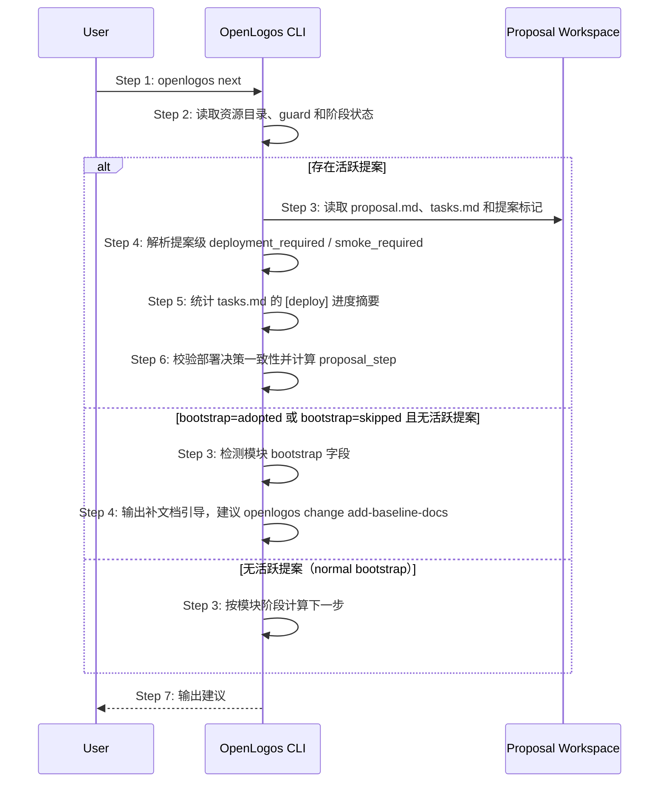

# S05: 查看下一步建议 — 时序图


```mermaid
sequenceDiagram
    participant U as User
    participant C as OpenLogos CLI
    participant P as Proposal Workspace

    U->>C: Step 1: openlogos next
    C->>C: Step 2: 读取资源目录、guard 和阶段状态
    alt 存在活跃提案
        C->>P: Step 3: 读取 proposal.md、tasks.md 和提案标记
        C->>C: Step 4: 解析提案级 deployment_required / smoke_required
        C->>C: Step 5: 统计 tasks.md 的 [deploy] 进度摘要
        C->>C: Step 6: 校验部署决策一致性并计算 proposal_step
    else bootstrap=adopted 或 bootstrap=skipped 且无活跃提案
        C->>C: Step 3: 检测模块 bootstrap 字段
        C->>C: Step 4: 输出补文档引导，建议 openlogos change add-baseline-docs
    else 无活跃提案（normal bootstrap）
        C->>C: Step 3: 按模块阶段计算下一步
    end
    C-->>U: Step 7: 输出建议
```

## 步骤说明
1. **用户**执行 `openlogos next`。
2. **CLI** 读取当前阶段和活跃变更信息。
3. **CLI** 在存在活跃提案时读取提案工作区；无活跃提案时检查模块 `bootstrap` 字段。**对 initial 模块（无活跃提案路径），下一步建议自 M1 切片 B1 起消费 `cli/src/lib/flow-derive.ts` 基于 builtin initial flow 派生的 `current_phase`，取代原硬编码 `PHASE_KEYS` 推断；launched 路径（活跃提案）的 `proposal_step` 自 M1 切片 B2 起改由 `flow-derive` 的 `detectProposalStepViaFlow` 基于 builtin launched flow 派生（取代旧 `detectProposalStep` 调用点），输出与旧逻辑逐态一致、next 的 `action`/`detail` 1:1 不变；marker 非对称优先级、提案级部署决策与冲突阻塞作为引擎规则保留。**
4. **CLI** 若 `bootstrap: adopted` 或历史 `bootstrap: skipped` 且无活跃提案，直接输出补文档引导；否则解析提案级部署决策，并与 `[deploy]` section 交叉校验。
5. **CLI** 只从 `tasks.md` 的 `[deploy]` section 统计部署进度摘要；该摘要可用于提示任务完成情况，但不能替代部署决策。
6. **CLI** 先校验 `proposal.md` 与 `[deploy]` section 是否一致，再选择唯一建议：冲突时建议修正 proposal / tasks；无需部署且 verify PASS 时建议 archive；需要部署时建议人类授权部署；需要 smoke 时建议 `openlogos smoke`。
7. **CLI** 输出建议文本或 JSON。JSON 模式下 `data` 顶层携带 `contract: {"version": "1.0.0"}`，且每个 `next_node` 恒带完整 `dispatch` 对象（详见「next 的契约自描述输出（contract / next_node.dispatch）」）。

## next 的 initial 路径派生来源（flow-derive）

- next 的 initial 路径（无活跃提案、`lifecycle: initial` 模块）的「下一步建议」由
  `flow-derive` 派生的 `current_phase` 决定：`current_phase` = flow 中第一个未 done 且未
  skipped 的 node 对应的 phase-key，再经既有 `SUGGEST_KEYS` 映射到建议文案，
  `next --format json` 的 `action` / `detail` 保持与旧逻辑一致。
- **来源 = builtin initial flow，不应用 overlay**；`when` / `done_when` / fan-out 覆盖
  与场景文件 `includes()` 子串匹配语义与 S11 完全一致（见 `core-S11-status-progress`）。
- **launched 路径派生来源（自 M1 切片 B2 更新）**：活跃提案下 next 仍消费 `collectStatusData`
  得到的 `proposal_step`，再经既有映射输出 `action` / `detail`；其中 `proposal_step` 的判定
  来源自 B2 起改由 `flow-derive` 的 `detectProposalStepViaFlow` 基于内置 launched flow 派生
  （取代旧 `detectProposalStep` 调用点）。`detectProposalStepViaFlow` 输出与旧 `detectProposalStep`
  **逐态等价**，故 next 的 `action` / `detail` **1:1 不变**——marker 非对称优先级、提案级部署
  决策、冲突阻塞、deploy/smoke marker 推进均作为引擎规则保留、不下沉 flow。
- 等价性由 golden 基线 + 测试期并跑断言锁定：fresh / adopted / 各 `skip_phases` 组合 /
  无 `skip_phases` 老项目（fallback-skip）下 `next --format json` 的 `action` / `detail`
  与旧逻辑逐字节一致；launched 路径各 `proposal_step` 态下 next 输出零漂移由 launched 提案
  next fixture 的 golden 与 S09 并跑等价矩阵共同覆盖（**本切片不新增 S05 用例**）。

## next 的契约自描述输出（contract / next_node.dispatch）

本节按提案 contract-self-description（C4/C5）定义 `next --format json` 的契约自描述能力：消费方（AI driver）不再依赖本地缓存的世界模型猜测契约形态与派发安全性。

### contract 版本握手

- status/next 的 `data` 顶层新增 `"contract": {"version": "1.0.0"}`（语义化契约版本，独立于 CLI 版本）。
- SemVer 规则：**major** = 必填字段删除/改义、闭合枚举语义变化（含移除值）、既有字段挂出判据变更；**minor** = 向后兼容扩展（新增可选字段、闭合枚举新增值）；**patch** = 不改形态与语义的澄清。
- 版本-schema 一一映射：`spec/schema/status.schema.json`、`spec/schema/next.schema.json`（内嵌契约版本号，随 npm prepack 打包）；响应 `contract.version` 与打包 schema 版本一致，CI 校验。
- 初始 `contract.version = "1.0.0"`；此前无 `contract` 字段的历史输出视为「0.x 前契约时代」，消费方按缺字段保守分支处理。envelope / contract / schema 的完整定义场景见 `core-S16-machine-json-output`。

### next_node.dispatch 与 requires_reviewed

- 每个 `next_node` 恒带完整 `dispatch: {"idempotent": bool, "timeout_seconds": int, "artifacts_hint": string[]}`；节点可另声明 `requires_reviewed: string[]`。
- 权威数据源 = flow 节点定义（内置模板逐节点人工声明，**不从 produces/done_when 推导**）；resolved flow 派生把节点元数据透传进 `next_node`——`next_node.dispatch` 恒为完整对象，无二义分支。flow 文件 schema 与加载层扩展见 S22，overlay 派生见 S25。
- overlay-add 未声明 → 保守默认 `{idempotent:false, timeout_seconds: defaults.dispatch.timeout_seconds, artifacts_hint: []}`；`artifacts_hint: []` ＝「产物未知」契约语义：消费方不得据此判死，只能升级观察。
- flow 文件顶层新增 `defaults: {dispatch: {timeout_seconds: 900}}`（唯一默认值源（fallback）；overlay 可覆盖；resolved 物化进每节点）。flow 文件 schema `version: 1` 保持不变（字段为向后兼容扩展）。
- 内置节点声明基准：内容产出/评审节点（write-proposal、write-tasks、write-delta、plan-slices、review 类、code）idempotent:true；一次性落盘/执行节点（apply-merge、deploy、archive 类）idempotent:false；verify/smoke 命令节点 idempotent:true。timeout_seconds：默认 900，code/implement 类 3600，deploy 类 1800。artifacts_hint 写该节点的具体产物提示（如 `["proposal.md"]`、`["logos/resources/**","SPEC_MERGED"]`）。apply-merge 声明 `requires_reviewed: ["proposal","delta"]`。
- driver 的 `priorReviewNode` 本地映射表退化为消费 `requires_reviewed` 声明（no-delta 幻影评审类漂移从根上消掉）。

### 未知值的消费方保守语义（规范性引用）

- 消费方约定（规范性引用，验收归 runlogos R5）：未知 major / 缺 `contract` 字段 → 保守模式（仅 next 驱动普通推进 + 看门狗，启发式判定降级为仅观察）；契约内任何枚举遇未知值 → 保守分支。
- 消费方不得以 `artifacts_hint` 为空/不达作为判死依据，只能升级观察。
- 验收边界：openlogos 本提案只验**生产者契约**（dispatch 字段来源正确、contract 版本字段在场、schema 校验通过）；消费方保守模式 / 零误杀验收归 runlogos R5 提案。
- 拍板原则：宁慢勿错杀——多等 5 分钟看门狗远好于误杀健康 run。一切措辞与设计冲突以此裁决。

### 主动破例声明（golden / 不变量）

- **主动破例**：破 next_node R8「8 字段逐字节不变」锚（`spec/cli-json-output.md`）——新增 `dispatch` / `requires_reviewed` 子字段，next golden（用例 2/6）重拍，S28 场景与 R8 验收措辞同步修改。
- **主动破例**：破「data 顶层逐字节不变（golden 零漂移）」——`data` 顶层新增 `contract` → 全部 9 个 golden 基线快照重拍（本提案唯一的全量 golden 重拍点，随大版本发布；见 `core-S16-machine-json-output`）。

### EX-7.1: overlay-add 节点未声明 dispatch
- **触发条件**：项目 overlay 通过 overlay-add 新增节点，且未声明 `dispatch`。
- **期望响应**：`next` 对该节点输出完整保守默认对象 `{idempotent:false, timeout_seconds: defaults.dispatch.timeout_seconds, artifacts_hint: []}`，并通过 schema 校验；不存在「dispatch 缺失 / 部分对象」的二义分支。
- **副作用**：无。

## 异常用例
### EX-2.1: 项目未初始化
- **触发条件**：缺少 `logos/logos.config.json`。
- **期望响应**：输出错误并退出。

### EX-3.1: bootstrap=adopted 或历史 skipped 且无活跃提案
- **触发条件**：模块 `bootstrap: adopted`（或历史 `bootstrap: skipped`），且 `logos/.openlogos-guard` 不存在。
- **期望响应**：按**有效** `baseline_seed_state` 分档引导。有效状态**一律经共享 helper `effectiveBaselineSeedState` 取得**（explicit 显式值优先；yaml 缺省时按统一派生规则：有候选+open run→`partial`、有候选无 open run→`seeded`、无候选→`required`；**无 `unknown` 第三态**，见 core-06 §4.1）——`next` 不得本地 `?? 'required'` 私自推断：
  - `required`：输出「逆向建立现状基线」引导（由 AI 会话/driver 经 `openlogos baseline-seed begin` + 派发 `brownfield-adopter` 逆向扫描），不建议直接开始与未验证区域相关的业务迭代。
  - `partial`（扫描未完成、持久化恢复态）：显示「现状基线部分建立 / 扫描未完成」；**因本 EX 前提为 guard 不存在（无活跃提案）**，主 `action`/`next_node` 指向恢复入口（`openlogos baseline-seed commit --run-id <id>` 续提交或重新 `begin` 补齐），说明「可先继续完成基线，也可发起业务 change（不强制）」；覆盖率标 `incomplete`、不算精确百分比。**有活跃提案的 partial 优先级见 EX-3.5**。
  - `seeded`：展示现状基线覆盖率（`human-verified <分子> / 候选 <存活>（含 tombstone <n>）`）并引导正常发起 `openlogos change`。
  - 覆盖率无法可信重算（派生索引缺失/过期/解析失败）时显示 `unknown`/`stale`，不输出貌似精确的百分比。
  - **legacy 派生态（`legacy: true`，yaml 未落盘）**：上述分档引导正常给出，同时附 legacy 迁移提示「运行 `openlogos sync` 把派生状态落盘为显式枚举」（sync 迁移见 core-06 §4.1，落盘后本提示消失）。
- **副作用**：无状态修改；`status`/`next`/`baseline-seed status` 对同一模块的有效状态**逐字节一致**（三入口单一事实源）；`next` 不得把未建立/部分建立的种子基线显示为已建立。

### EX-4.1: 部署决策冲突
- **触发条件**：`proposal.md` 声明无需部署但 `tasks.md` 存在 `[deploy]` section，或声明需要部署但缺少 `[deploy]` section。
- **期望响应**：输出冲突警告，并提示用户修正 proposal / tasks；不得自动进入部署执行。

### EX-4.2: 部署进度不可用
- **触发条件**：活跃提案需要部署，但 `tasks.md` 缺失或无法读取。
- **期望响应**：输出可诊断提示；不得把部署进度伪装成已完成。

## adopted 模块覆盖率引导（brownfield-adopter）

`bootstrap: adopted` 且无活跃提案时，`next`（与 `status` 同源）读取现状基线状态位与覆盖率：

- **数据来源**：覆盖率**只读已合并主文档**中各产物 `## 逆向基线来源` 章节，经派生索引（携 `source_hash` + 生成时间）聚合；索引失效时降级 `unknown`/`stale` 或按文档权威章节实时重算。
- **分母口径**：tombstone 分母法——分母 = 存活候选 ∪ 未经人工确认的 tombstone；`human_verified_delta` 单列，禁止把分母波动解读为新增人工确认。
- **JSON**：`next --format json` 输出 `baseline_coverage`（见 cli-experience §2.22），与 `status` 字段一致。

### EX-3.2: seeded 后展示覆盖率并引导迭代
- **触发条件**：`bootstrap: adopted`、状态位 `seeded`、无活跃提案。
- **期望响应**：`next` 展示覆盖率并引导正常发起 `openlogos change`；不再强制「先补全所有文档」。
- **副作用**：无。

### EX-3.3: 覆盖率不可信时降级
- **触发条件**：派生索引缺失/过期（`source_hash` 与文档不符）/解析失败。
- **期望响应**：`next`/`status` 输出 `unknown`/`stale`，不输出貌似精确的百分比。
- **副作用**：无。

### EX-3.4: partial 恢复态（**无活跃提案**，guard 不存在）
- **触发条件**：`bootstrap: adopted`、`baseline_seed_state: partial`（扫描中断持久化）、**`logos/.openlogos-guard` 不存在**；含子情形 partial+索引 stale、partial+无产物。
- **期望响应**：`status`/`next` 一致显示 `baseline_coverage.state=partial`、`incomplete=true`；**主 `action`/`next_node` 指向** `openlogos baseline-seed`（commit 续提交 / 重新 begin）；不把已落盘候选当最终分母算精确百分比；partial+stale 同时置 `freshness=stale`；partial+无产物引导重跑但保留 run 记录、状态仍 `partial`。
- **副作用**：重试成功回 `seeded`、重试再失败保持 `partial`；重新 `begin` 不回退 `required`；状态仅由 `openlogos baseline-seed` 写。

### EX-3.5: partial 恢复态（**有活跃提案**，guard 存在）
- **触发条件**：`bootstrap: adopted`、`baseline_seed_state: partial`、**`logos/.openlogos-guard` 存在**（活跃提案处于某真实前沿）。
- **期望响应**：`next` 主 `action`/`next_node`/`proposal_step` **保持该提案真实前沿**（不被恢复建议劫持、不改写 `proposal_step`、**不阻断 change**）；partial 恢复以结构化 advisory `baseline_coverage.recovery`（`{ available:true, entry:"openlogos baseline-seed commit --run-id <id>", run_id }`）呈现；`baseline_coverage.state=partial`、`incomplete=true` 仍如实输出。**与 EX-3.4 互斥**：此处主动作**不**指向 baseline-seed。
- **副作用**：不改提案生命周期、不改 guard；状态仅由 `openlogos baseline-seed` 写。

## deploy-done 对 next 的影响

当活跃提案处于 `ready-to-deploy` 时，`openlogos next` 的下一步仍然是部署授权，但详情必须说明部署完成后通过 CLI 写入 marker：

```text
部署是人类确认点。部署完成并写入 deployment-report.md 后，执行 openlogos deploy-done 标记部署完成。
```

当 `DEPLOY_DONE` 存在且 `[deploy]` section 已全部勾选：
- 若 `smoke_required=true`，`next` 返回 `ready-to-smoke`，提示明确授权执行 `openlogos smoke`。
- 若 `smoke_required=false`，`next` 返回 `deploy-done`，提示明确授权执行 `openlogos archive <slug>`。

`next` 不得建议用户或 AI 手写 `DEPLOY_DONE`。

## spec-complete-required / test-id-required 的 next 建议

当活跃提案处于 launched 生命周期且需要代码实现时，`openlogos next` 必须在派发 `plan-slices` 之前检查两个前置：

1. spec-complete 是否已完成；
2. 真实测试 ID 是否已稳定。

### spec-complete-required

- **触发条件**：`code_required==true`，提案无待写 delta 或 delta 已处理，但提案目录缺少 `SPEC_MERGED` / `MERGED`。
- **期望响应**：`proposal_step=="spec-complete-required"`，`next_node` 省略或指向 no-delta merge 命令提示，不得指向 `plan-slices`。
- **建议文案**：提示执行 `openlogos merge <slug>`。若无 delta，merge 将执行 no-op merge 并写入 `SPEC_MERGED`。
- **JSON 诊断**：`reason=="no_delta_spec_marker_missing"`，`remediation=="run openlogos merge <slug>"`。

### test-id-required

- **触发条件**：spec-complete 已完成，`code_required==true`，但无法解析本提案将由 `[code]` 切片覆盖的真实 `UT-*` / `ST-*` / `SMOKE-*` ID。
- **期望响应**：`proposal_step=="test-id-required"`，不得输出 `next_node.id=="plan-slices"`。
- **建议文案**：提示补充测试资源或显式声明复用已有真实测试 ID。
- **JSON 诊断**：`reason=="code_change_requires_real_test_ids"`，`remediation=="add or reference real test IDs before plan-slices"`。

### 不变量

- 纯文档提案不进入上述阻塞；`code_required==false` 时仍按现有纯文档路径推进。
- `next --auto` 不能跳过这两个阻塞；它们不是 skippable human gate。
- `status` 与 `next` 对上述状态的 `proposal_step` 与诊断必须一致。
