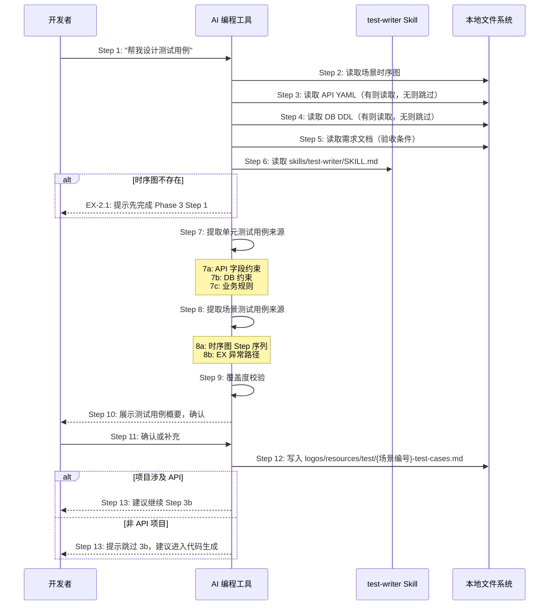
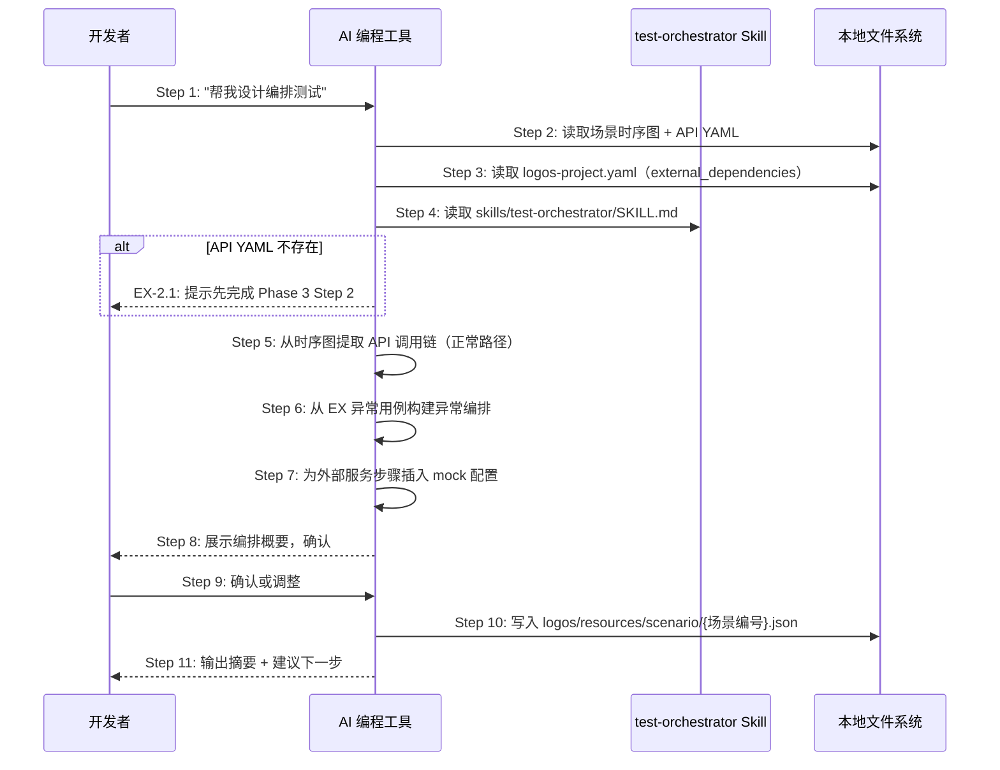
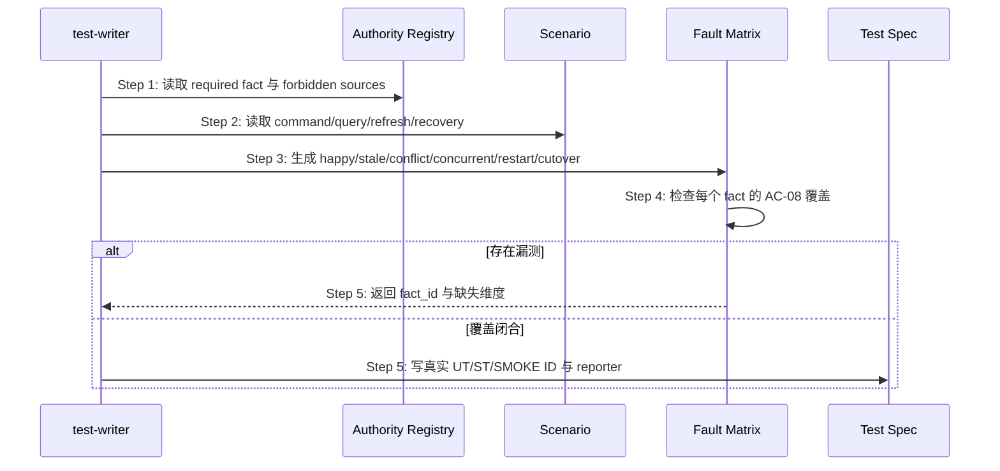

# S06: AI 辅助设计测试用例 — 场景实现

> Phase 3 Step 1 · 场景建模

S06 由两个子步骤组成：Step 3a（所有项目必须）和 Step 3b（仅 API 项目）。

## 参与方

| 别名 | 组件 | 说明 |
|------|------|------|
| U | 开发者 | 在 AI 编程工具中输入自然语言 |
| AI | AI 编程工具 | Cursor / Claude Code / OpenCode |
| SK-T | test-writer Skill | `skills/test-writer/SKILL.md`（Step 3a） |
| SK-O | test-orchestrator Skill | `skills/test-orchestrator/SKILL.md`（Step 3b） |
| FS | 本地文件系统 | 资源目录 |

---

## Step 3a: 单元测试 + 场景测试用例设计

### 时序图

### 步骤说明

1. **开发者**在 AI 编程工具中输入「帮我设计测试用例」（或指定具体场景，如「帮我设计 S01 的测试用例」）。
2. **AI 编程工具**读取 `logos/resources/prd/3-technical-plan/2-scenario-implementation/` 下对应场景的时序图。如果时序图不存在 → 见 EX-2.1。
3. **AI 编程工具**尝试读取 `logos/resources/api/` 下的 OpenAPI YAML。如果存在则加载，不存在则跳过（非 API 项目可能没有）。
4. **AI 编程工具**尝试读取 `logos/resources/database/` 下的 DDL 文件。如果存在则加载，不存在则跳过。
5. **AI 编程工具**读取需求文档，获取该场景的验收条件，用于后续覆盖度校验。
6. **AI 编程工具**读取 `skills/test-writer/SKILL.md`，获取测试用例设计的执行步骤和输出规范。
7. **AI 编程工具**从三个来源提取单元测试用例：
   - **(7a) API 字段约束**：从 OpenAPI YAML 的 schema 属性提取边界值测试（如 `maxLength: 255` → 测 255 和 256 字符）。无 API 项目跳过此来源。
   - **(7b) DB 约束**：从 DDL 的约束子句提取（如 `UNIQUE(email)` → 测重复邮箱，`NOT NULL` → 测空值）。无 DB 项目跳过此来源。
   - **(7c) 业务规则**：从需求文档验收条件和 EX 异常用例中提取单点错误处理逻辑。此来源对所有项目类型都适用。
8. **AI 编程工具**从时序图提取场景测试用例：
   - **(8a) 主路径**：按时序图 Step 1 → Step N 的顺序，构造端到端数据流验证，重点关注 Step 间的数据传递。
   - **(8b) 异常路径**：每个 EX-N.M 对应一个独立的场景测试用例，验证异常触发后的系统行为。
9. **AI 编程工具**执行覆盖度校验：反向检查需求文档中每个 GIVEN/WHEN/THEN 验收条件是否都有对应的测试用例覆盖，标记未覆盖项。
10. **AI 编程工具**向开发者展示测试用例概要：单元测试用例数量（按来源分组）、场景测试用例数量（主路径 + 异常路径）、覆盖度自检结果。
11. **开发者**确认测试用例或要求补充。
12. **AI 编程工具**将确认的测试用例规格文档写入 `logos/resources/test/{场景编号}-test-cases.md`，包含单元测试用例表（`UT-{场景}-{序号}`）和场景测试用例表（`ST-{场景}-{序号}`）。

> 测试用例是设计文档，不是代码。实际的测试代码在 Phase 3 Step 4 代码生成阶段由 AI 基于此规格实现。

13. **AI 编程工具**根据项目类型给出下一步建议：如果项目涉及 API，建议继续 Step 3b（「帮我设计编排测试」）；如果是非 API 项目，提示跳过 Step 3b，建议直接进入代码生成（「帮我实现 S01」）。

### 异常用例

#### EX-2.1: 时序图不存在

- **触发条件**：Step 2 检测到 `logos/resources/prd/3-technical-plan/2-scenario-implementation/` 为空
- **期望响应**：AI 提示「未找到时序图，请先完成 Phase 3 Step 1 场景建模」
- **副作用**：不生成测试用例文档

---

## Step 3b: API 编排测试设计

### 时序图

### 步骤说明

1. **开发者**在 AI 编程工具中输入「帮我设计编排测试」。
2. **AI 编程工具**读取场景时序图和 `logos/resources/api/` 下的 OpenAPI YAML。如果 API YAML 不存在 → 见 EX-2.1。
3. **AI 编程工具**读取 `logos/logos-project.yaml`，获取 `external_dependencies` 字段（如果存在），了解外部服务清单和测试策略。
4. **AI 编程工具**读取 `skills/test-orchestrator/SKILL.md`，获取编排测试设计的执行步骤和输出规范。
5. **AI 编程工具**从时序图中提取 API 调用链的正常路径，将每个跨系统调用映射为编排测试的一个步骤。

> 编排测试是 HTTP 请求级别的端到端测试，与 Step 3a 的代码层面测试互补——Step 3a 覆盖测试金字塔的底层（函数调用级），Step 3b 覆盖顶层（HTTP 请求级）。

6. **AI 编程工具**从 EX 异常用例中构建异常编排——每个 EX 路径对应一条独立的异常编排测试。
7. **AI 编程工具**检查 `external_dependencies`，为涉及外部服务的编排步骤自动插入 `mock` 配置（含 `dependency`、`strategy`、`config`）。如果没有外部依赖则跳过。
8. **AI 编程工具**向开发者展示编排概要：场景数 × 编排数、mock 步骤统计。
9. **开发者**确认编排设计或要求调整。
10. **AI 编程工具**将确认的编排测试写入 `logos/resources/scenario/{场景编号}.json`。
11. **AI 编程工具**输出设计摘要，并建议下一步操作：「帮我实现 S01」。

### 异常用例

#### EX-2.1: API YAML 不存在

- **触发条件**：Step 2 检测到 `logos/resources/api/` 为空，但项目架构包含 API 服务
- **期望响应**：AI 提示「未找到 API 规格，请先完成 Phase 3 Step 2 API 设计」
- **副作用**：不生成编排测试文件

## S06 Authority Closure 测试设计扩展

### 场景目标

test-writer 从 Authority Registry 与时序图派生可证伪矩阵，证明系统在副本冲突、滞后、重启、并发和切换失败时仍只认唯一 authority，而不只验证 happy path。

### 时序图

### 必测矩阵

每个 required fact 至少包含 authority 正常路径、stale projection、conflicting old copy、legacy/concurrent writer、response lost + restart、projection rebuild、cutover rollback、forbidden reverse inference。确实不可发生的项必须引用架构不变量给出证据，不能静默省略。

### 断言边界

- 断言最终决定来自 authority identity/action，不只断言两个值碰巧相等。
- stale/conflict 夹具故意让投影与权威值不同。
- restart 测试启动新进程并保留旧残留，禁止复用内存对象伪装恢复。
- concurrent writer 证明旧入口被拒绝或只由单一协调 writer 串行化。
- 所有自动化测试接入 OpenLogos reporter。

### 追溯

- 规范：AC-04、AC-06、AC-07、AC-08。
- 测试：UT-S06-01～UT-S06-06、ST-S06-01～ST-S06-02。
