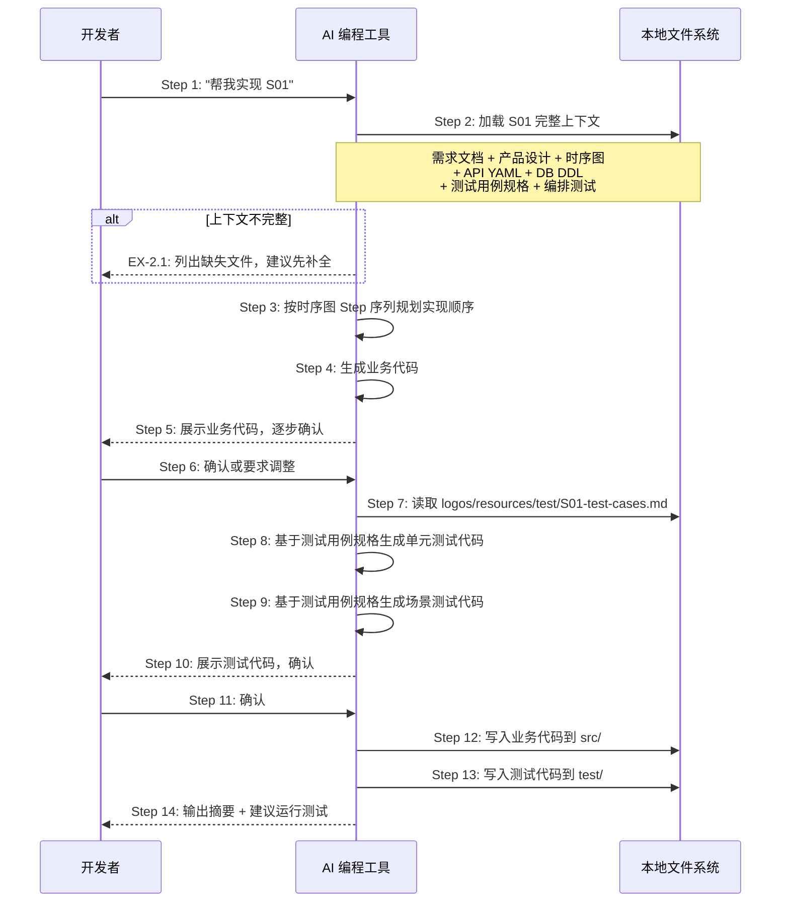
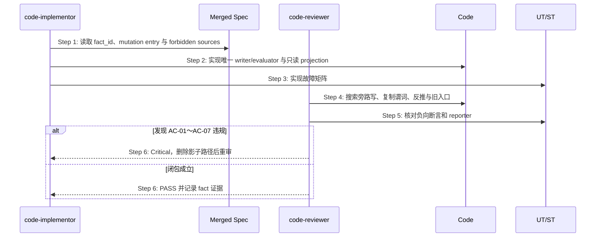

# S07: AI 辅助生成代码 + 测试代码 — 场景实现

> Phase 3 Step 1 · 场景建模

## 参与方

| 别名 | 组件 | 说明 |
|------|------|------|
| U | 开发者 | 在 AI 编程工具中输入自然语言 |
| AI | AI 编程工具 | Cursor / Claude Code / OpenCode |
| FS | 本地文件系统 | 源代码和测试代码目录 |

## 时序图

## 步骤说明

1. **开发者**在 AI 编程工具中输入「帮我实现 S01」（或指定其他场景编号）。
2. **AI 编程工具**加载该场景的完整上下文，依次读取：需求文档中的验收条件（必需）、产品设计中的交互规格（必需）、时序图（必需）、API YAML（API 项目必需）、DB DDL（有 DB 项目必需）、测试用例规格（必需）、编排测试（API 项目必需）。如果必需文件缺失 → 见 EX-2.1。
3. **AI 编程工具**按时序图的 Step 序列规划代码实现顺序——每个 Step 对应一段代码逻辑，确保实现顺序与设计一致。
4. **AI 编程工具**生成业务代码：覆盖时序图中的所有 Step，处理所有 EX 异常用例，与 API YAML 严格一致（字段名、类型、状态码），遵循 `logos-project.yaml` 中 `tech_stack` 声明的技术栈。
5. **AI 编程工具**向开发者展示生成的业务代码，按模块/文件逐步呈现。
6. **开发者**审阅业务代码，确认或要求调整。
7. **AI 编程工具**读取 `logos/resources/test/S01-test-cases.md`，获取已设计的测试用例规格（UT-xx 和 ST-xx）。
8. **AI 编程工具**基于测试用例规格中的单元测试用例（UT-xx）生成单元测试代码，每个 UT 用例对应一个测试函数。

> 测试框架由 `tech_stack` 决定（如 Node.js 项目默认 vitest / jest）。

9. **AI 编程工具**基于测试用例规格中的场景测试用例（ST-xx）生成场景测试代码，每个 ST 用例验证一条完整的数据流路径。
10. **AI 编程工具**向开发者展示生成的测试代码。
11. **开发者**审阅测试代码，确认。
12. **AI 编程工具**将业务代码写入项目的 `src/`（或对应的源代码目录）。
13. **AI 编程工具**将测试代码写入项目的 `test/` 或 `__tests__/`（或对应的测试目录）。
14. **AI 编程工具**输出实现摘要（业务代码文件数 + 单元测试数 + 场景测试数），并建议运行测试验证。

## 异常用例

### EX-2.1: 上下文不完整

- **触发条件**：Step 2 中关键文件缺失（尤其是测试用例规格 `logos/resources/test/S01-test-cases.md` 不存在）
- **期望响应**：AI 列出所有缺失文件的清单，建议先补全再生成代码
- **副作用**：不生成质量不可控的代码

## S07 Authority Closure 实现与代码审查扩展

### 场景目标

实现按已合并 Registry/场景只保留一个 mutation/decision 路径；code-reviewer 在交付前证明旧 writer、旧 parser、fallback scan 和 projection reverse inference 已删除或不可达。

### 时序图

### Critical 判据

- 绕过 mutation entry 直接写 canonical state。
- status/next/flow 等消费者复制完成谓词或状态机。
- catch/恢复分支扫描 marker、mtime、目录或 stale cache 猜权威结果。
- projection 可写或能覆盖 authority；freshness 校验缺失。
- feature flag 永久保留两个 writer，或迁移后旧入口仍可成功。
- 测试只验证值相等，未制造冲突副本或新进程恢复。

### 完成条件

Critical 清零；每个 required fact 可从入口追到唯一 writer/evaluator；旧来源删除或不可达证据明确；对应 UT/ST 通过并由 OpenLogos reporter 记录。

### 追溯

- 规范：AC-02、AC-05～AC-08。
- 测试：UT-S07-01～UT-S07-06、ST-S07-01～ST-S07-02。
