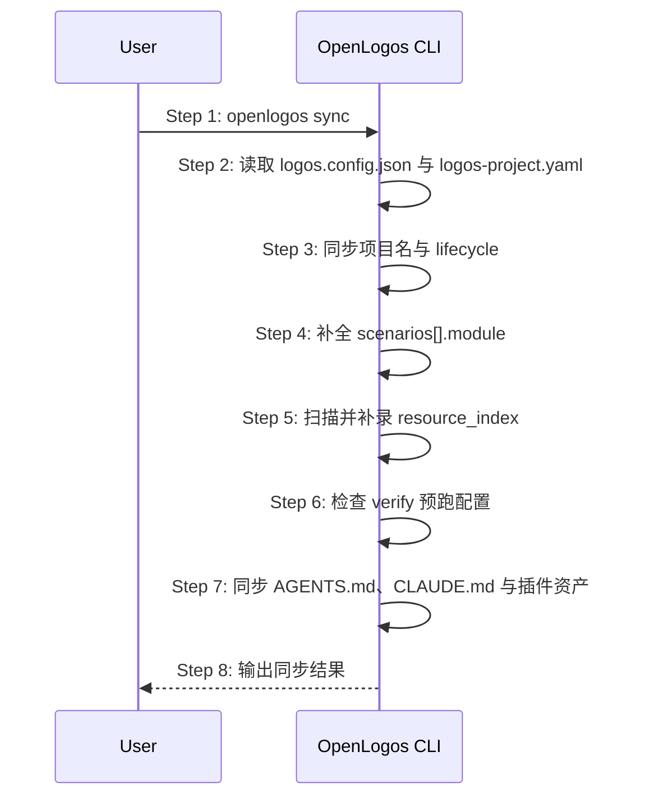

# S08: 同步 AI 工具资产与资源索引 — 时序图

## 步骤说明
1. **用户**执行 `openlogos sync`。
2. **CLI** 加载配置与索引。
3. **CLI** 修正项目元数据。
4. **CLI** 补全场景模块字段。
5. **CLI** 补录资源索引。
6. **CLI** 检查 `verify.pre_run_command`、`verify.regression_command`、`verify.incremental_command` 是否至少存在一个。若缺失，按测试栈推断并补齐；无法推断时输出 TODO。
7. **CLI** 同步 AI 工具资产。
8. **CLI** 汇总输出。

## 异常用例
### EX-2.1: 配置缺失
- **触发条件**：目录未初始化。
- **期望响应**：输出错误并退出。

### EX-6.1: 缺少 verify 预跑配置且无法推断
- **触发条件**：旧项目没有任何 verify 预跑命令，且 CLI 无法从项目清单推断测试命令。
- **期望响应**：sync 不失败，但输出明确诊断和配置建议。
- **副作用**：不写入不可执行的默认命令。
