# S08: 同步 AI 工具资产与资源索引 — 时序图

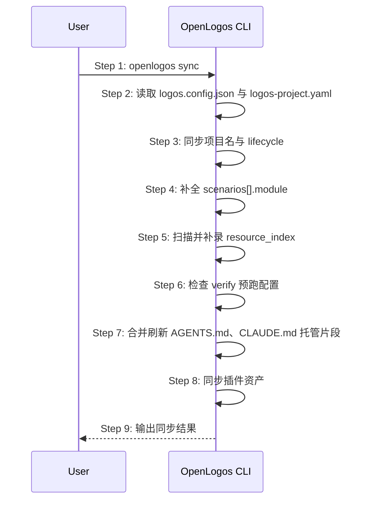
```mermaid
sequenceDiagram
    participant U as User
    participant C as OpenLogos CLI

    U->>C: Step 1: openlogos sync
    C->>C: Step 2: 读取 logos.config.json 与 logos-project.yaml
    C->>C: Step 3: 同步项目名与 lifecycle
    C->>C: Step 4: 补全 scenarios[].module
    C->>C: Step 5: 扫描并补录 resource_index
    C->>C: Step 6: 检查 verify 预跑配置
    C->>C: Step 7: 合并刷新 AGENTS.md、CLAUDE.md 托管片段
    C->>C: Step 8: 同步插件资产
    C-->>U: Step 9: 输出同步结果
```

## 步骤说明
1. **用户**执行 `openlogos sync`。
2. **CLI** 加载配置与索引。
3. **CLI** 修正项目元数据。
4. **CLI** 补全场景模块字段。
5. **CLI** 补录资源索引。
6. **CLI** 检查 `verify.pre_run_command`、`verify.regression_command`、`verify.incremental_command` 是否至少存在一个。若缺失，按测试栈推断并补齐；无法推断时输出 TODO。
7. **CLI** 刷新 `AGENTS.md` / `CLAUDE.md` 时复用统一 managed block 合并逻辑，仅替换 OpenLogos 托管片段，保留托管片段外用户自定义内容；无 marker 旧文件保留原文并追加托管片段。
8. **CLI** 扫描目标宿主的项目专属 Skill 与插件资产。Codex 包括 `.agents/skills/*`、`.agents/plugins/*` 与历史 `.codex-plugin/`；Claude Code 包括 `.claude/skills/*` 与项目独立插件。
9. **CLI** 只同步 OpenLogos 官方插件资产。Codex 中刷新 repo marketplace 的 `openlogos` 插件条目、OpenLogos skills 和 SessionStart hook；Claude Code 中刷新 OpenLogos 官方插件和 guard；项目专属 skill、项目插件条目和未知归属资产原样保留。
10. **CLI** 汇总输出，同步结果中应包含兼容迁移说明和命名空间诊断，便于用户发现项目 skill 是否仍处于项目命名空间。
11. **CLI** 全部同步步骤成功完成后，写入版本戳文件 `logos/.openlogos-sync.json`（`cliVersion` + `syncedAt`，幂等覆盖）；任何失败退出路径（配置缺失、baseline 提交进行中）都不写、不刷新该文件。详见「版本戳落盘（.openlogos-sync.json）」章节。

## 版本戳落盘（.openlogos-sync.json）

`openlogos sync` 成功完成后，在项目本地落盘最近一次成功 sync 使用的 CLI 版本，供人或 AI 与全局安装版本（`openlogos --version`）对比，判断本地是否需要再次 sync。

**文件路径**：`logos/.openlogos-sync.json`

**文件内容**：

```json
{
  "cliVersion": "<当前 CLI VERSION，即 cli/package.json 的 version>",
  "syncedAt": "<ISO 8601 时间戳>"
}
```

**行为约束**：

1. **只在成功路径写入**：写入时机位于 sync 全部同步步骤正常执行完毕之后（即 `withRecoveredReadLocks` 回调成功返回、未因 `baseline_commit_in_progress` 退出）。sync 因 `logos.config.json` 缺失或 baseline 提交进行中而失败退出时，不写、不刷新该文件——避免失败的 sync 刷新版本戳造成「看似已同步」的假象。
2. **幂等覆盖**：每次成功 sync 整体覆盖写入（非追加），文件始终反映最近一次成功 sync 的版本与时间。
3. **私有会话态定位**：与 `logos/.session-capabilities.json` 同款做法——项目本地私有文件，约定 gitignore，CLI 不强制改写用户 `.gitignore`。
4. **消费边界**：本文件只是事实源；`status` / `next` 等命令的「CLI 已升级，建议重新 sync」对比提示不属于本场景范围。

## AI 工具 Skill 命名空间同步补充时序
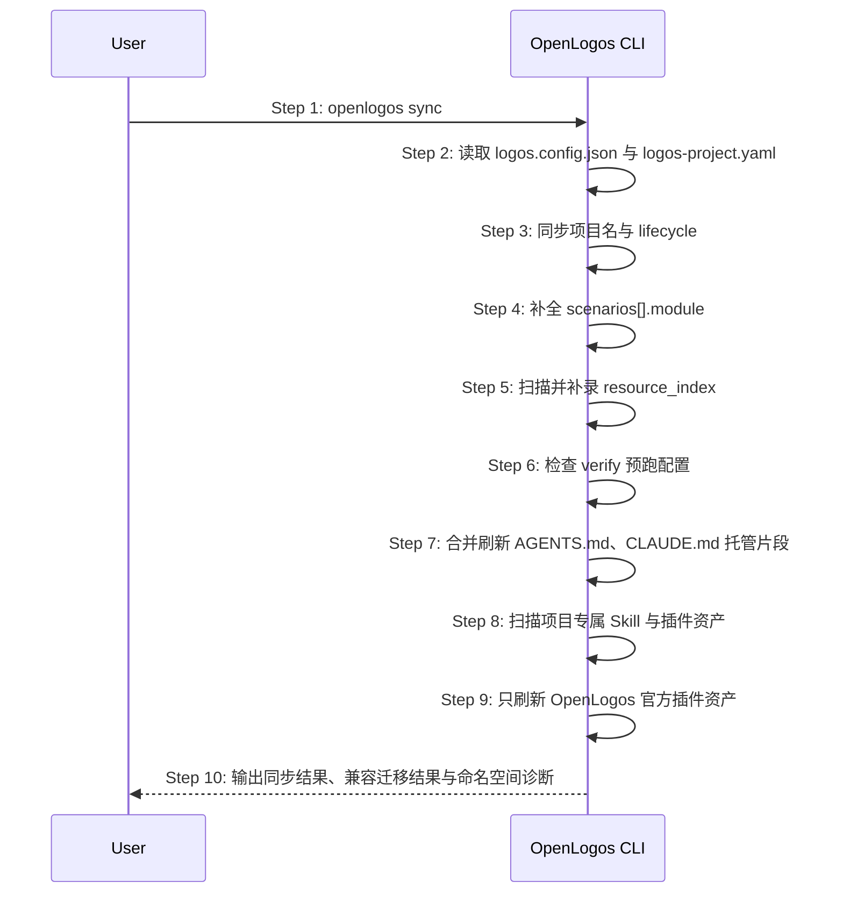
```mermaid
sequenceDiagram
    participant U as User
    participant C as OpenLogos CLI

    U->>C: Step 1: openlogos sync
    C->>C: Step 2: 读取 logos.config.json 与 logos-project.yaml
    C->>C: Step 3: 同步项目名与 lifecycle
    C->>C: Step 4: 补全 scenarios[].module
    C->>C: Step 5: 扫描并补录 resource_index
    C->>C: Step 6: 检查 verify 预跑配置
    C->>C: Step 7: 合并刷新 AGENTS.md、CLAUDE.md 托管片段
    C->>C: Step 8: 扫描项目专属 Skill 与插件资产
    C->>C: Step 9: 只刷新 OpenLogos 官方插件资产
    C-->>U: Step 10: 输出同步结果、兼容迁移结果与命名空间诊断
```

## 异常用例
### EX-2.1: 配置缺失
- **触发条件**：目录未初始化。
- **期望响应**：输出错误并退出。
- **副作用**：不写、不刷新 `logos/.openlogos-sync.json` 版本戳。

### EX-6.1: 缺少 verify 预跑配置且无法推断
- **触发条件**：旧项目没有任何 verify 预跑命令，且 CLI 无法从项目清单推断测试命令。
- **期望响应**：sync 不失败，但输出明确诊断和配置建议。
- **副作用**：不写入不可执行的默认命令。

### EX-7.1: AI 指令文件 marker 不完整
- **触发条件**：已有 `AGENTS.md` / `CLAUDE.md` 中只存在 `OPENLOGOS:BEGIN` 或只存在 `OPENLOGOS:END`。
- **期望响应**：sync 失败并提示修复指令文件托管片段边界。
- **副作用**：不得覆盖用户指令文件。

### EX-8.1: 历史 Codex `.agents/skills` 中混有项目专属 Skill
- **触发条件**：已初始化项目存在 `.agents/skills/prd-writer/SKILL.md` 和 `.agents/skills/release-guard/SKILL.md`，其中 `release-guard` 不是 OpenLogos 官方技能。
- **期望响应**：sync 可刷新或迁移 OpenLogos 官方技能；`release-guard` 被保留为项目资产，不进入 `openlogos` 插件命名空间；输出诊断提示用户可创建项目插件命名空间。
- **副作用**：不得删除、重命名或改写项目专属 Skill。

### EX-9.1: repo marketplace 中存在项目插件条目
- **触发条件**：`.agents/plugins/marketplace.json` 已包含 `openlogos` 之外的项目插件条目。
- **期望响应**：sync 只更新 `openlogos` 条目和 OpenLogos 托管文件；项目插件条目保持顺序和内容不变。
- **副作用**：不得把项目插件下的技能复制到 OpenLogos 插件。

### EX-9.2: Claude Code `.claude/skills` 中存在项目技能
- **触发条件**：已初始化项目存在 `.claude/skills/release-guard/SKILL.md`。
- **期望响应**：sync 刷新 OpenLogos 官方 Claude 插件与 `CLAUDE.md` managed block，但 `.claude/skills/release-guard/SKILL.md` 原样保留，并在说明中标记为项目专属技能。
- **副作用**：不得把 `release-guard` 复制到 OpenLogos 插件 `plugin/skills`。

### EX-11.1: 同步失败时不写版本戳
- **触发条件**：sync 因 `baseline_commit_in_progress`（模块基线提交进行中、锁被占用且无法恢复）非零退出，或因配置缺失（EX-2.1）提前退出。
- **期望响应**：正常输出既有错误信息；`logos/.openlogos-sync.json` 不被创建；已存在的版本戳文件内容保持原样（仍反映上一次成功 sync）。
- **副作用**：零写副作用——失败路径不得刷新 `cliVersion` / `syncedAt`。

## S08 ZCode 托管资产幂等同步时序

### 场景目标

在不改变用户 ZCode 配置和项目自有插件资产的前提下，`openlogos sync` 通过 Registry 幂等刷新 OpenLogos ZCode 插件、根指令和当前 lifecycle 变体，并且只在所有同步事务成功后刷新版本戳。

### 参与者

- **用户**：触发同步并查看保留/刷新结果。
- **OpenLogos CLI**：持有同步总事务和版本戳写入时机。
- **Adapter Registry**：从历史或当前配置解析 Adapter 集合。
- **ZCode Adapter**：计算当前模板与目标的差异。
- **Managed Asset Transaction**：原子写入托管资产并保护未知 owner。

### 前置条件

- 项目已有合法 `logos.config.json` 与 `logos-project.yaml`。
- baseline seed commit journal 已恢复或不存在。
- ZCode Adapter 可读取随包模板；既有项目可能含旧版 OpenLogos ZCode 资产或用户自有资产。

### 成功后置条件

- OpenLogos 拥有的 ZCode 资产与当前 CLI、locale 和 lifecycle 一致。
- 用户 `.zcode` 配置、非 OpenLogos 插件、托管 marker 外内容保持不变。
- `.openlogos-sync.json` 记录本次全部同步成功后的版本和时间。

### 时序图

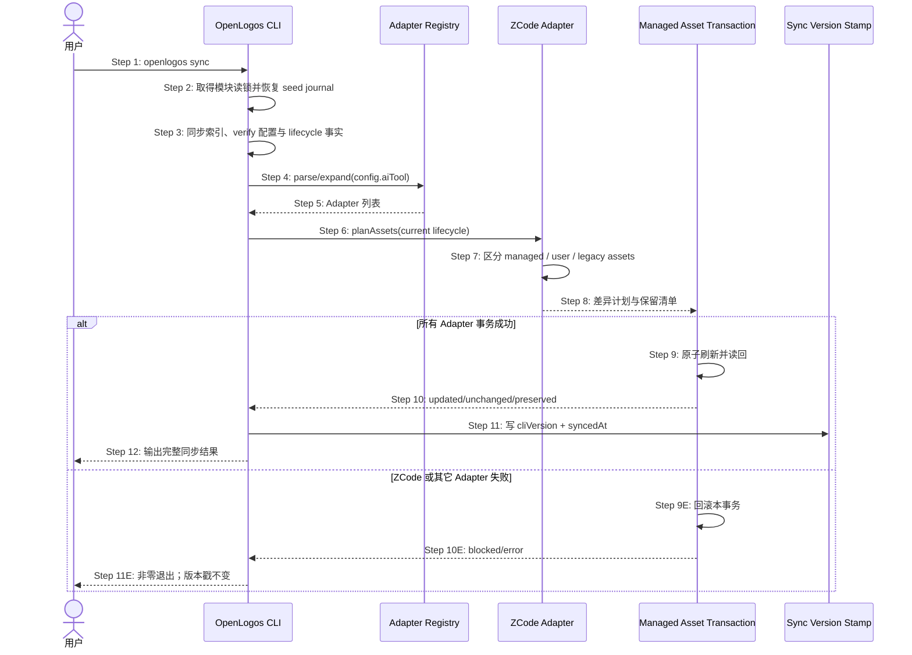
```mermaid
sequenceDiagram
    actor U as 用户
    participant C as OpenLogos CLI
    participant R as Adapter Registry
    participant Z as ZCode Adapter
    participant T as Managed Asset Transaction
    participant V as Sync Version Stamp

    U->>C: Step 1: openlogos sync
    C->>C: Step 2: 取得模块读锁并恢复 seed journal
    C->>C: Step 3: 同步索引、verify 配置与 lifecycle 事实
    C->>R: Step 4: parse/expand(config.aiTool)
    R-->>C: Step 5: Adapter 列表
    C->>Z: Step 6: planAssets(current lifecycle)
    Z->>Z: Step 7: 区分 managed / user / legacy assets
    Z-->>T: Step 8: 差异计划与保留清单
    alt 所有 Adapter 事务成功
        T->>T: Step 9: 原子刷新并读回
        T-->>C: Step 10: updated/unchanged/preserved
        C->>V: Step 11: 写 cliVersion + syncedAt
        C-->>U: Step 12: 输出完整同步结果
    else ZCode 或其它 Adapter 失败
        T->>T: Step 9E: 回滚本事务
        T-->>C: Step 10E: blocked/error
        C-->>U: Step 11E: 非零退出；版本戳不变
    end
```

### 步骤说明

1. 用户在项目根执行 sync。
2. CLI 在读取资源前完成既有 seed journal 恢复门。
3. CLI 处理宿主无关同步工作，但尚不刷新最终版本戳。
4. 配置中的标量、数组、历史值或 all 统一交给 Registry。
5. Registry 返回去重且稳定的 Adapter 列表。
6. ZCode Adapter 根据 module lifecycle 选择 initial/launched 指令和插件资产。
7. Adapter 只把 manifest identity、managed marker 或已知哈希可证明的文件视为 OpenLogos owner；其余列入 preserved 或 blocked。
8. 事务计划包含精确目标、变更状态和冲突原因。
9. 全部预检通过后原子刷新，并确认 Hooks JSON、manifest 和 Markdown frontmatter 可解析。
10. 结果明确区分更新、未变化和用户保留项。
11. 只有全部 Adapter 都成功，CLI 才覆盖写同步版本戳。
12. 输出提醒 ZCode Hook 配置仅对新 session 生效。

### 异常与边界

#### EX-ZC-1：历史配置不含 zcode

- **触发条件**：旧项目 aiTool 为既有单值或数组。
- **期望响应**：按原配置同步，不擅自加入 ZCode；只有 `all` 使用新 Registry 展开后自动包含 ZCode。
- **副作用**：既有宿主行为保持兼容。

#### EX-ZC-2：用户修改 OpenLogos 托管文件

- **触发条件**：目标有 OpenLogos identity，但托管边界外出现用户文件。
- **期望响应**：只刷新声明资产；未知文件 preserved 并逐项报告。
- **副作用**：不得用目录镜像删除用户文件。

#### EX-ZC-3：同步中途失败

- **触发条件**：暂存、rename、权限或读回校验失败。
- **期望响应**：回滚该事务并使 sync 整体失败。
- **副作用**：原版本戳不变；不得打印“Sync complete”。

### 追溯

- 需求：S08 同步验收、ZCode 资产与协议要求。
- 架构：28.3 资产规划与原子部署、28.6 状态读取与缓存边界。
- 测试：UT-S08-15～UT-S08-20、ST-S08-16～ST-S08-18。

## S08 Qoder 托管资产幂等同步时序

### 场景目标

`openlogos sync` 经 Registry 幂等刷新 OpenLogos Qoder 插件、根指令和 lifecycle 变体，保留 Qoder 用户 settings、其它插件与未知文件，并在全部 Adapter 成功后才更新同步版本戳。

### 参与者

- **用户**：触发同步并查看刷新/保留结果。
- **OpenLogos CLI**：持有同步总事务与版本戳。
- **Adapter Registry**：解析历史/当前配置。
- **Qoder Adapter**：计算托管资产差异。
- **Managed Asset Transaction**：原子刷新或回滚。

### 前置条件

- 项目配置、资源索引与 lifecycle 可解析，seed journal 已恢复或不存在。
- 随包 Qoder 模板可读；目标可能混合旧托管资产和用户资产。

### 成功后置条件

- Qoder 托管资产与 CLI 版本、locale、lifecycle 一致。
- 用户 settings、其它插件、未知文件和 marker 外内容哈希不变。
- 同步版本戳只记录完整成功结果。

### 时序图

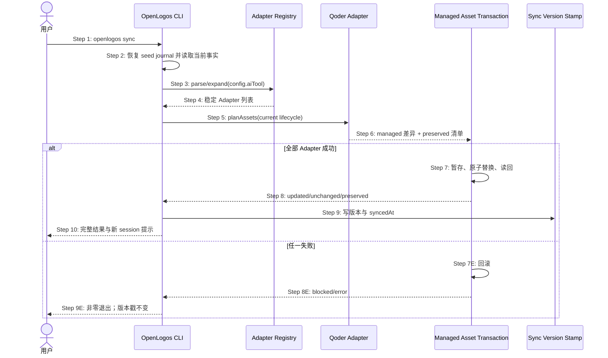
```mermaid
sequenceDiagram
    actor U as 用户
    participant C as OpenLogos CLI
    participant R as Adapter Registry
    participant Q as Qoder Adapter
    participant T as Managed Asset Transaction
    participant V as Sync Version Stamp
    U->>C: Step 1: openlogos sync
    C->>C: Step 2: 恢复 seed journal 并读取当前事实
    C->>R: Step 3: parse/expand(config.aiTool)
    R-->>C: Step 4: 稳定 Adapter 列表
    C->>Q: Step 5: planAssets(current lifecycle)
    Q-->>T: Step 6: managed 差异 + preserved 清单
    alt 全部 Adapter 成功
        T->>T: Step 7: 暂存、原子替换、读回
        T-->>C: Step 8: updated/unchanged/preserved
        C->>V: Step 9: 写版本与 syncedAt
        C-->>U: Step 10: 完整结果与新 session 提示
    else 任一失败
        T->>T: Step 7E: 回滚
        T-->>C: Step 8E: blocked/error
        C-->>U: Step 9E: 非零退出；版本戳不变
    end
```

### 步骤说明

1. 用户从项目根触发 sync。
2. CLI 在读取 effective view 前通过 seed journal 恢复门。
3. 配置标量、数组、历史值与 all 统一交给 Registry。
4. 历史配置未选 Qoder 时不擅自加入；all 新展开包含 Qoder。
5. Qoder Adapter 选择当前 initial/launched 模板。
6. 仅 manifest identity、managed marker 或已知哈希可证明的文件进入更新计划，未知目标 preserved/blocked。
7. 校验 manifest/hooks/frontmatter 后原子替换，失败恢复备份。
8. 结果明确区分托管更新、未变化和用户保留项。
9. 只有所有 Adapter 成功才写同步版本戳。
10. 成功提示创建新 Qoder CLI session 获取插件/Hook 快照。

### 异常与边界

#### EX-QD-S08-1：历史配置未选择 Qoder
- **触发条件**：aiTool 为既有单值/数组且无 qoder。
- **期望响应**：只同步原宿主；all 才按新 Registry 包含 Qoder。
- **副作用**：历史行为零漂移。

#### EX-QD-S08-2：托管目录混入用户文件
- **触发条件**：插件中存在未声明文件或不同 owner 组件。
- **期望响应**：用户文件 preserved，冲突目标 blocked，不做目录镜像删除。
- **副作用**：用户哈希不变。

#### EX-QD-S08-3：提交/读回失败
- **触发条件**：rename、权限、内容或读回校验失败。
- **期望响应**：回滚总事务并非零退出。
- **副作用**：版本戳保持旧值，不输出 Sync complete。

### 追溯

- 需求：S08 Qoder 同步验收。
- 架构：29.5 状态读取与路径安全、29.6 资产事务与提交顺序。
- 测试：UT-S08-21～UT-S08-26、ST-S08-19～ST-S08-21。

## S08 WorkBuddy 托管插件幂等同步时序

### 场景目标

`sync` 依据 Registry 刷新当前 lifecycle 的 WorkBuddy 托管资产，只在所有 Adapter 成功后更新同步版本戳。

### 前置与后置条件

- 前置：项目已初始化，配置可能为历史单值、数组或 `all`。
- 成功后置：托管资产收敛，用户 settings、插件、项目资产和原生记忆不变，版本戳最后更新。
- 失败后置：本次变更全部回滚，版本戳保持旧值。

### 主时序

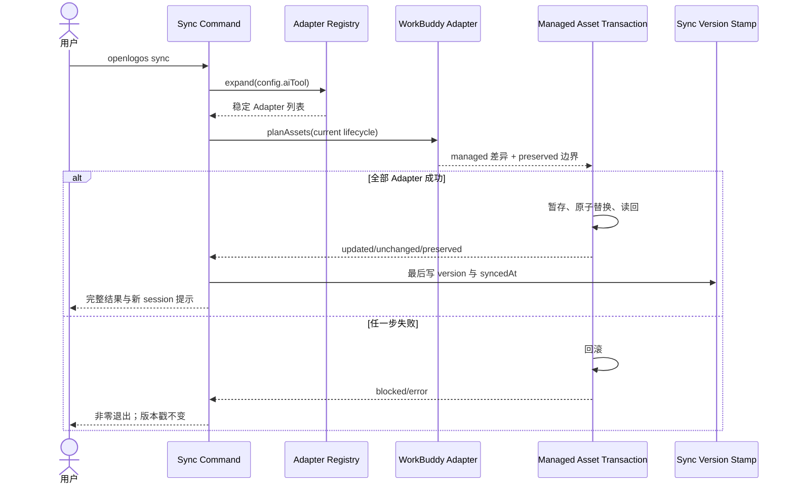
```mermaid
sequenceDiagram
    actor U as 用户
    participant C as Sync Command
    participant R as Adapter Registry
    participant W as WorkBuddy Adapter
    participant T as Managed Asset Transaction
    participant V as Sync Version Stamp
    U->>C: openlogos sync
    C->>R: expand(config.aiTool)
    R-->>C: 稳定 Adapter 列表
    C->>W: planAssets(current lifecycle)
    W-->>T: managed 差异 + preserved 边界
    alt 全部 Adapter 成功
        T->>T: 暂存、原子替换、读回
        T-->>C: updated/unchanged/preserved
        C->>V: 最后写 version 与 syncedAt
        C-->>U: 完整结果与新 session 提示
    else 任一步失败
        T->>T: 回滚
        T-->>C: blocked/error
        C-->>U: 非零退出；版本戳不变
    end
```

### 步骤与不变量

1. 历史配置未选 WorkBuddy 时不得自动加入；只有 `all` 按新 Registry 稳定包含它。
2. Adapter 仅更新 identity、managed marker 或已知清单可证明属于 OpenLogos 的资产；未知文件 preserved 或冲突 blocked。
3. 原生记忆不进入扫描内容、差异或备份，只比较不透明边界证据以确认未被触碰。
4. 任一 Adapter 暂存、替换或读回失败，恢复本次事务全部备份。
5. 全部成功后才写 `.openlogos-sync.json`；重复同步输出 `unchanged` 并保持内容哈希稳定。

### 异常

- `EX-WB-S08-1`：历史配置无 WorkBuddy 时只同步原宿主。
- `EX-WB-S08-2`：托管目录混入用户文件时禁止目录镜像删除。
- `EX-WB-S08-3`：rename、权限或读回失败时回滚且版本戳不变。

### 追溯

- 需求：S08 WorkBuddy 同步验收。
- 架构：30.2 资产模型、30.4 生命周期与事务顺序。
- 测试：UT-S08-27～UT-S08-32、ST-S08-22～ST-S08-24。

## TRAE non-deployable 同步负向时序

### 目标

S08 不因客户端发现或工作区已有 `.trae/**` 自动增加 TRAE Adapter。`all` 只同步既有七宿主；手工配置中的 `trae` 必须在总事务开始前失败，且不刷新同步版本戳。

### `all` 同步时序

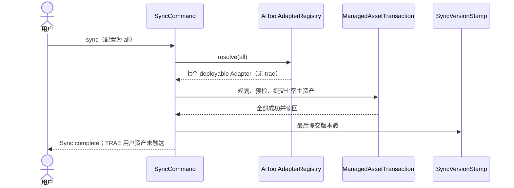
```mermaid
sequenceDiagram
    actor U as 用户
    participant C as SyncCommand
    participant R as AiToolAdapterRegistry
    participant P as ManagedAssetTransaction
    participant S as SyncVersionStamp
    U->>C: sync（配置为 all）
    C->>R: resolve(all)
    R-->>C: 七个 deployable Adapter（无 trae）
    C->>P: 规划、预检、提交七宿主资产
    P-->>C: 全部成功并读回
    C->>S: 最后提交版本戳
    C-->>U: Sync complete；TRAE 用户资产未触达
```

### 非法配置失败时序

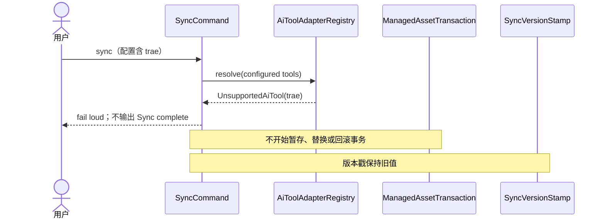
```mermaid
sequenceDiagram
    actor U as 用户
    participant C as SyncCommand
    participant R as AiToolAdapterRegistry
    participant P as ManagedAssetTransaction
    participant S as SyncVersionStamp
    U->>C: sync（配置含 trae）
    C->>R: resolve(configured tools)
    R-->>C: UnsupportedAiTool(trae)
    C-->>U: fail loud；不输出 Sync complete
    Note over C,P: 不开始暂存、替换或回滚事务
    Note over C,S: 版本戳保持旧值
```

### 不变量

- `.trae/` Rules、Skills、Agents、Hooks、MCP、settings、账号、记忆和未知文件不进入扫描、计划、暂存、备份、删除或回滚集合。
- 不因探测到 TRAE 国际版/CN 安装或登录状态而改变 Registry。
- 既有七宿主的目标顺序、内容哈希、结果分类、原子提交和版本戳语义保持不变。

## TRAE 候选 tarball 安装态同步负向时序

### 目标与前置条件

使用 `local-isolated` prefix 中真实 `0.13.29` CLI 验证 S08：`all` 同步仍只处理既有七宿主；配置显式包含 `trae` 时在总事务前失败；合成 `.trae/**` 与用户边界哈希始终不变。客户端安装/登录事实不得影响 Registry。

### `all` 同步与用户边界

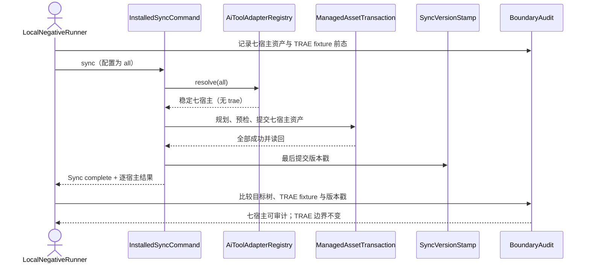
```mermaid
sequenceDiagram
    actor X as LocalNegativeRunner
    participant C as InstalledSyncCommand
    participant R as AiToolAdapterRegistry
    participant P as ManagedAssetTransaction
    participant S as SyncVersionStamp
    participant A as BoundaryAudit
    X->>A: 记录七宿主资产与 TRAE fixture 前态
    X->>C: sync（配置为 all）
    C->>R: resolve(all)
    R-->>C: 稳定七宿主（无 trae）
    C->>P: 规划、预检、提交七宿主资产
    P-->>C: 全部成功并读回
    C->>S: 最后提交版本戳
    C-->>X: Sync complete + 逐宿主结果
    X->>A: 比较目标树、TRAE fixture 与版本戳
    A-->>X: 七宿主可审计；TRAE 边界不变
```

### 严格配置失败

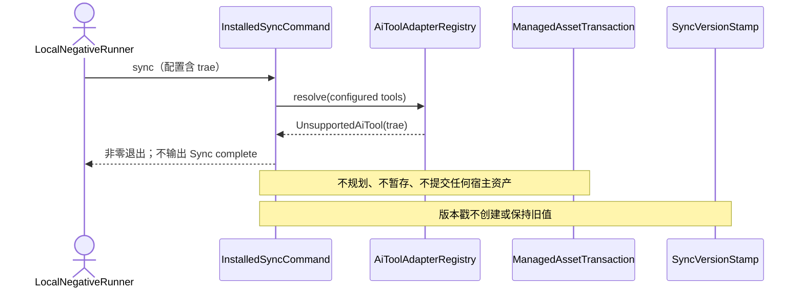
```mermaid
sequenceDiagram
    actor X as LocalNegativeRunner
    participant C as InstalledSyncCommand
    participant R as AiToolAdapterRegistry
    participant P as ManagedAssetTransaction
    participant S as SyncVersionStamp
    X->>C: sync（配置含 trae）
    C->>R: resolve(configured tools)
    R-->>C: UnsupportedAiTool(trae)
    C-->>X: 非零退出；不输出 Sync complete
    Note over C,P: 不规划、不暂存、不提交任何宿主资产
    Note over C,S: 版本戳不创建或保持旧值
```

### 边界与失败模型

- `.trae/rules`、`.trae/skills`、Agents、Hooks、MCP、settings、账号占位、`enabled_folders`、不透明记忆和未知文件不进入扫描、计划、暂存、备份、删除或回滚集合。
- runner 只使用合成 fixture 并比较路径清单、大小和 SHA-256；不读取记忆正文，不启动 TRAE，不修改信任状态。
- `all` 出现 TRAE、七宿主顺序漂移、严格配置被静默忽略、部分宿主先提交、版本戳变化或任一用户边界哈希变化时失败。
- 候选 CLI 入口不在隔离 prefix、版本不是 `0.13.29` 或命令引用仓库源码时，在调用 sync 前失败。
- reporter 记录真实命令、脱敏配置摘要、逐宿主结果、版本戳与哈希证据；失败不得写 pass。

### 追溯

- 单元测试：UT-S08-37。
- 场景测试：ST-S08-27。
- Smoke：SMOKE-core-127、SMOKE-core-128。

### 主时序

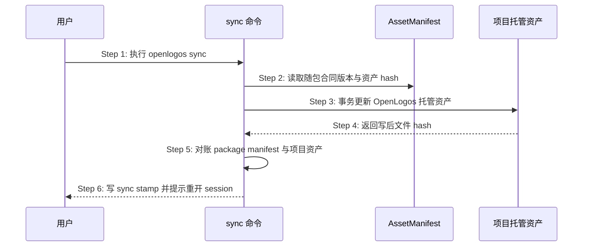
```mermaid
sequenceDiagram
    participant U as 用户
    participant S as sync 命令
    participant M as AssetManifest
    participant P as 项目托管资产

    U->>S: Step 1: 执行 openlogos sync
    S->>M: Step 2: 读取随包合同版本与资产 hash
    S->>P: Step 3: 事务更新 OpenLogos 托管资产
    P-->>S: Step 4: 返回写后文件 hash
    S->>S: Step 5: 对账 package manifest 与项目资产
    S-->>U: Step 6: 写 sync stamp 并提示重开 session
```

### 步骤说明

1. **用户**显式运行 sync；status/next 不隐式触发。
2. **sync**读取候选包内 `openlogos/asset-manifest@1`。
3. **sync**只更新 OpenLogos owner 的 Skill、模板和插件资产，用户/项目自有资产保持不变。
4. **项目托管资产层**返回真实写后 hash。
5. **sync**验证 Skill、模板、插件副本、合同版本全部一致。
6. **sync**写入 `cliVersion/syncedAt/planContractVersion/managedAssetsHash`，提示重开 Agent session。

### 异常与边界

#### EX-2.1：manifest 缺失或 hash 非法
- **触发条件**：随包 manifest 缺字段、未知 schema 或 hash 不匹配。
- **期望响应**：sync 在提交前失败，输出资产路径与期望/实际 hash。
- **副作用**：项目托管资产与 stamp 保持旧集合。

#### EX-5.1：写后对账失败
- **触发条件**：生成插件、Skill 或模板字节不等于 manifest。
- **期望响应**：事务回滚，不留下部分新资产。
- **副作用**：用户资产始终不变。

### 追溯

- 需求：托管资产可核验与过期诊断。
- 测试：UT-S08-38～UT-S08-42、ST-S08-28～ST-S08-29、SMOKE-core-138～SMOKE-core-139。

## S08 resource_index 结构化补录时序

### 场景目标

细化主时序 Step 5「扫描并补录 resource_index」的内部时序与后置判据。该步骤写的是项目正式文档 `logos-project.yaml`，此前按 `conventions:` 行做文本拼接，在 `init` 模板产出的 `resource_index: []` 上必然写出非法 YAML，且损坏后不自我暴露。本节把该步骤定死为 AST 写入，并规定「产物可解析」这一后置判据。

### 参与者与前置条件

| 别名 | 组件 | 说明 |
|------|------|------|
| C | OpenLogos CLI | `openlogos sync` 主流程 |
| IDX | 资源索引补录器 | 扫描候选文件、推断 desc、结构化写回 |
| DOC | `logos-project.yaml` | 项目正式文档，权威状态为其字节与 YAML 文档树 |

前置：`logos.config.json` 与 `logos-project.yaml` 均存在且当前可解析。`DOC` 的 `resource_index` 键处于三种既有形态之一——空 flow sequence、空 block、键缺失。

### 主时序

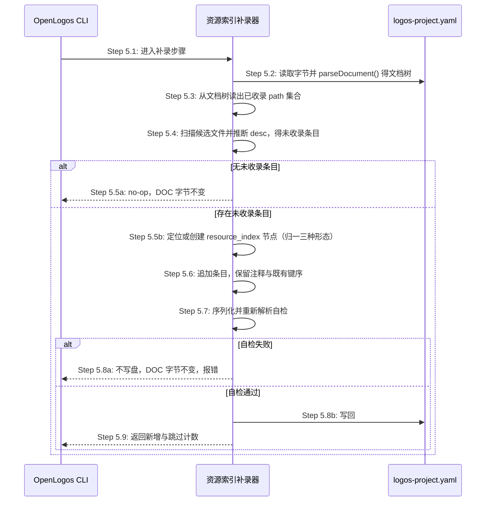
```mermaid
sequenceDiagram
    participant C as OpenLogos CLI
    participant IDX as 资源索引补录器
    participant DOC as logos-project.yaml

    C->>IDX: Step 5.1: 进入补录步骤
    IDX->>DOC: Step 5.2: 读取字节并 parseDocument() 得文档树
    IDX->>IDX: Step 5.3: 从文档树读出已收录 path 集合
    IDX->>IDX: Step 5.4: 扫描候选文件并推断 desc，得未收录条目
    alt 无未收录条目
        IDX-->>C: Step 5.5a: no-op，DOC 字节不变
    else 存在未收录条目
        IDX->>IDX: Step 5.5b: 定位或创建 resource_index 节点（归一三种形态）
        IDX->>IDX: Step 5.6: 追加条目，保留注释与既有键序
        IDX->>IDX: Step 5.7: 序列化并重新解析自检
        alt 自检失败
            IDX-->>C: Step 5.8a: 不写盘，DOC 字节不变，报错
        else 自检通过
            IDX->>DOC: Step 5.8b: 写回
            IDX-->>C: Step 5.9: 返回新增与跳过计数
        end
    end
```

### 步骤说明

1. **补录器**读取 `logos-project.yaml` 字节并解析为 YAML 文档树。禁止在本步骤之后出现任何按正则或行锚定位插入点的分支。
2. **补录器**从文档树而非正则读出已收录 `path` 集合，据此判定幂等。
3. **补录器**扫描候选目录并按既有规则推断 desc；无匹配规则的文件计入 skipped，扫描范围与推断规则本次不变。
4. **补录器**定位 `resource_index` 节点。三种既有形态归一到同一承载条目的序列：空 flow sequence 转为 block sequence，空 block 直接承载，键缺失则创建该键且不影响其它顶层键位置。
5. **补录器**追加条目后序列化，并对序列化结果重新解析做自检；自检失败不写盘，目标文件字节保持原样。

### 不变量

- **后置判据是可解析性**：写回后的 `logos-project.yaml` 必须能被 CLI 捆绑的解析器无异常解析。以字符串包含为断言不足以覆盖本步骤。
- **守恒**：既有 `resource_index` 条目、其它顶层键与注释逐项保留。
- **幂等**：已收录路径不重复追加；重复执行不产生键序或注释漂移。
- **原子**：写回失败不留半成品。
- **形态无关**：补录器不对 `resource_index` 的当前形态做假设；同一权威的其它写者（合并事务元数据写入、决策计数器写入）同样不得假定其只以空 block 出现。

### 异常

| 编号 | 触发条件 | 处理 |
|---|---|---|
| EX-S08-IDX-1 | 读取阶段 `logos-project.yaml` 已不可解析 | 不进入补录，按降级路径处理并让告警在人类可读通道可见（见 S11 降级告警出口）；不代用户改写文件 |
| EX-S08-IDX-2 | 序列化自检失败 | 不写盘，目标文件字节不变，报错退出 |
| EX-S08-IDX-3 | 候选文件无匹配 desc 规则 | 计入 skipped，不写入占位条目 |

### 追溯

- 需求：AC-YAMLW-01～03、AC-YAMLW-05。
- 功能规格：§2.47.2、§2.47.3。
- 架构：§三十八.1、§三十八.3。
- 测试：UT-S08-43～UT-S08-46、ST-S08-30～ST-S08-31；安装态 SMOKE-core-169。
