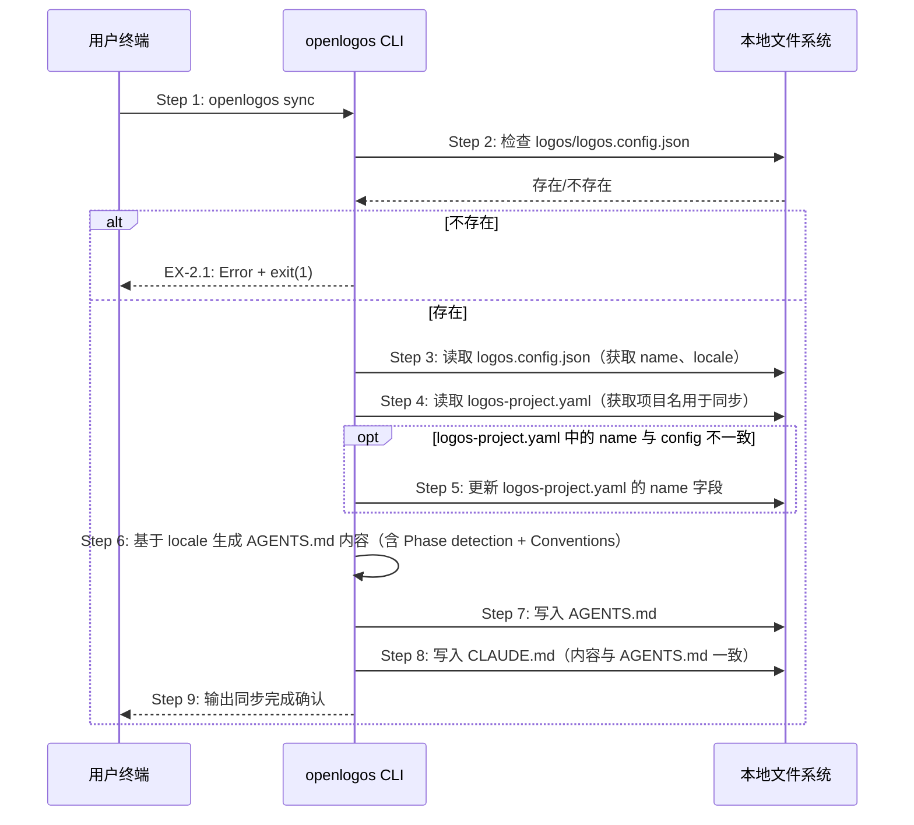

# S08: 同步 AI 指令文件 — 场景实现

> Phase 3 Step 1 · 场景建模

## 参与方

| 别名 | 组件 | 说明 |
|------|------|------|
| U | 用户终端 | 执行 CLI 命令的终端 |
| CLI | openlogos CLI | `cli/src/commands/sync.ts` |
| FS | 本地文件系统 | 配置文件和指令文件 |

## 时序图

## 步骤说明

1. **开发者**在终端输入 `openlogos sync`。
2. **CLI** 检查当前目录下 `logos/logos.config.json` 是否存在。如果不存在 → 见 EX-2.1。
3. **CLI** 读取 `logos/logos.config.json`，解析出 `name`（项目名）和 `locale`（语言设置）。
4. **CLI** 读取 `logos/logos-project.yaml`，获取其中的 `project.name` 字段。
5. **CLI** 比较两个文件中的项目名是否一致。如果不一致，**CLI** 用正则替换 `logos-project.yaml` 中的 `name` 字段为 `logos.config.json` 中的值，并输出同步确认。如果一致则跳过。

> `logos.config.json` 是项目名的单一来源。当用户修改 config 中的 `name` 后执行 `sync`，此步骤保持两个配置文件一致。

6. **CLI** 基于 `locale` 生成 `AGENTS.md` 的文本内容，包含固定的 Methodology Rules、Phase detection logic 和通过 `conventionsForAgentsMd(locale)` 生成的约定列表。

> AGENTS.md 的 conventions 来自 `i18n.ts` 硬编码模板而非动态读取 `logos-project.yaml`，因为 CLI 遵循零依赖策略（无 YAML 解析库），且两者面向不同受众（YAML 给 AI 读结构化数据，Markdown 给 AI 读自然语言指令）。

7. **CLI** 将生成的内容写入项目根目录的 `AGENTS.md`。
8. **CLI** 将相同内容写入项目根目录的 `CLAUDE.md`。
9. **CLI** 在终端输出 `✓ AGENTS.md updated`、`✓ CLAUDE.md updated` 和 `Sync complete.` 确认信息。

## 异常用例

### EX-2.1: 项目未初始化

- **触发条件**：Step 2 检测到 `logos/logos.config.json` 不存在
- **期望响应**：stderr 输出 `Error: logos/logos.config.json not found. Run 'openlogos init' first to initialize the project.`，exit(1)
- **副作用**：不修改任何文件
