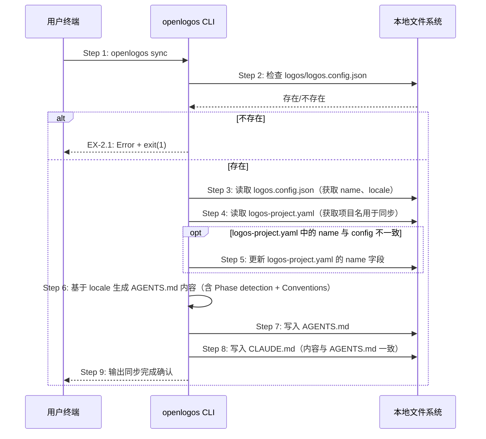
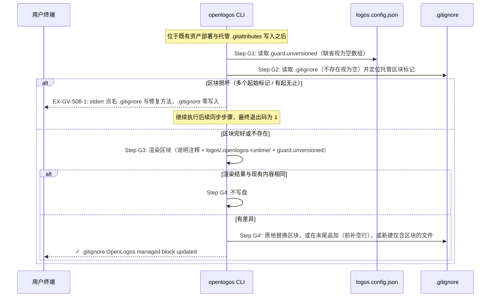
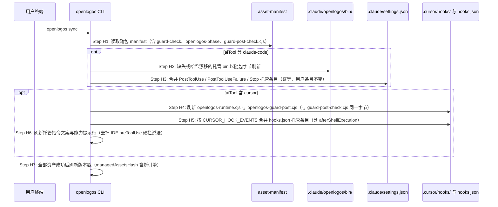

# S08: 同步 AI 指令文件 — 场景实现

> Phase 3 Step 1 · 场景建模

## 参与方

| 别名 | 组件 | 说明 |
|------|------|------|
| U | 用户终端 | 执行 CLI 命令的终端 |
| CLI | openlogos CLI | `cli/src/commands/sync.ts` |
| FS | 本地文件系统 | 配置文件和指令文件 |

## 时序图

```mermaid
sequenceDiagram
    participant U as 用户终端
    participant CLI as openlogos CLI
    participant FS as 本地文件系统

    U->>CLI: Step 1: openlogos sync
    CLI->>FS: Step 2: 检查 logos/logos.config.json
    FS-->>CLI: 存在/不存在

    alt 不存在
        CLI-->>U: EX-2.1: Error + exit(1)
    else 存在
        CLI->>FS: Step 3: 读取 logos.config.json（获取 name、locale）
        CLI->>FS: Step 4: 读取 logos-project.yaml（获取项目名用于同步）

        opt logos-project.yaml 中的 name 与 config 不一致
            CLI->>FS: Step 5: 更新 logos-project.yaml 的 name 字段
        end

        CLI->>CLI: Step 6: 基于 locale 生成 AGENTS.md 内容（含 Phase detection + Conventions）
        CLI->>FS: Step 7: 写入 AGENTS.md
        CLI->>FS: Step 8: 写入 CLAUDE.md（内容与 AGENTS.md 一致）

        CLI-->>U: Step 9: 输出同步完成确认
    end
```

## 步骤说明

1. **开发者**在终端输入 `openlogos sync`。
2. **CLI** 检查当前目录下 `logos/logos.config.json` 是否存在。如果不存在 → 见 EX-2.1。
3. **CLI** 读取 `logos/logos.config.json`，解析出 `name`（项目名）和 `locale`（语言设置）。
4. **CLI** 读取 `logos/logos-project.yaml`，获取其中的 `project.name` 字段。
5. **CLI** 比较两个文件中的项目名是否一致。如果不一致，**CLI** 用正则替换 `logos-project.yaml` 中的 `name` 字段为 `logos.config.json` 中的值，并输出同步确认。如果一致则跳过。

> `logos.config.json` 是项目名的单一来源。当用户修改 config 中的 `name` 后执行 `sync`，此步骤保持两个配置文件一致。

6. **CLI** 基于 `locale` 生成 `AGENTS.md` 的文本内容，包含固定的 Methodology Rules、Phase detection logic 和通过 `conventionsForAgentsMd(locale)` 生成的约定列表。

> AGENTS.md 的 conventions 来自 `i18n.ts` 硬编码模板而非动态读取 `logos-project.yaml`，因为 CLI 遵循零依赖策略（无 YAML 解析库），且两者面向不同受众（YAML 给 AI 读结构化数据，Markdown 给 AI 读自然语言指令）。

7. **CLI** 将生成的内容写入项目根目录的 `AGENTS.md`。
8. **CLI** 将相同内容写入项目根目录的 `CLAUDE.md`。
9. **CLI** 在终端输出 `✓ AGENTS.md updated`、`✓ CLAUDE.md updated` 和 `Sync complete.` 确认信息。

## 异常用例

### EX-2.1: 项目未初始化

- **触发条件**：Step 2 检测到 `logos/logos.config.json` 不存在
- **期望响应**：stderr 输出 `Error: logos/logos.config.json not found. Run 'openlogos init' first to initialize the project.`，exit(1)
- **副作用**：不修改任何文件

## S08 .gitignore 托管区块按配置重渲染时序

### 场景目标

`openlogos sync` 按 `logos/logos.config.json` 当前的 `guard.unversioned` 重渲染 `.gitignore` 托管区块，使存量项目在升级后也具备 OpenLogos 运行时目录条目，并让手工改过区块内部的项目回到配置所描述的状态。渲染结果与现有内容相同则不写盘；区块损坏时 fail loud，但不阻断其他资产的同步（决策 C02、C13、C14）。

### 参与方

| 别名 | 组件 | 说明 |
|------|------|------|
| CLI | openlogos CLI | `cli/src/commands/sync.ts`，区块渲染与 `ignore` 子命令共用同一渲染函数 |
| CFG | `logos/logos.config.json` | `guard.unversioned` 的单一事实源 |
| GI | 项目根 `.gitignore` | 用户文件，CLI 只改写托管区块内部 |

### 时序图

```mermaid
sequenceDiagram
    participant U as 用户终端
    participant CLI as openlogos CLI
    participant CFG as logos.config.json
    participant GI as .gitignore

    Note over CLI: 位于既有资产部署与托管 .gitattributes 写入之后
    CLI->>CFG: Step G1: 读取 guard.unversioned（缺省视为空数组）
    CLI->>GI: Step G2: 读取 .gitignore（不存在视为空）并定位托管区块标记
    alt 区块损坏（多个起始标记 / 有起无止）
        CLI-->>U: EX-GV-S08-1: stderr 点名 .gitignore 与修复方法，.gitignore 零写入
        Note over CLI: 继续执行后续同步步骤，最终退出码为 1
    else 区块完好或不存在
        CLI->>CLI: Step G3: 渲染区块（说明注释 + logos/.openlogos-runtime/ + guard.unversioned）
        alt 渲染结果与现有内容相同
            CLI->>CLI: Step G4: 不写盘
        else 有差异
            CLI->>GI: Step G4': 原地替换区块，或在末尾追加（前补空行），或新建仅含区块的文件
            CLI-->>U: ✓ .gitignore OpenLogos managed block updated
        end
    end
```

### 步骤说明

1. **Step G1**：只读取配置，sync 不新增、不删除 `guard.unversioned` 条目，也不读取或改写 `guard.exempt`（exempt 不进入 `.gitignore`）。配置中的非法条目（不符合 `unversioned` 语法）按 EX-GV-S08-2 处理。
2. **Step G2**：只看项目根 `.gitignore`；子目录 `.gitignore`、`.git/info/exclude` 不读不写。
3. **Step G3**：区块内容与 init / `openlogos ignore` 渲染结果逐字节相同（同一函数），固定运行时条目只有 `logos/.openlogos-runtime/`；行尾风格沿用文件现有风格。
4. **Step G4 幂等**：配置未变时重复 sync，`.gitignore` 字节与 mtime 均不变。区块外内容在任何分支下逐字节不变。
5. 渲染与项目是否为 git 仓库无关：非 git 仓库同样渲染，便于之后 `git init` 时立即生效。
6. **区块损坏的处理取舍**：区块损坏只影响 `.gitignore` 这一个文件，sync 其余步骤（AI 指令、托管资产、hook 注册、`.gitattributes`、resource_index、版本戳）照常执行，不回滚、不提前退出；`.gitignore` 零写入，stderr 输出错误并点名路径，sync 结束时以退出码 1 返回，`Sync complete.` 之前多一行「sync 部分完成：.gitignore 托管区块未更新」。这样做的依据是：区块未更新时，原本要放行的产物目录仍被当作受保护内容，结果只会多拦、不会漏拦（fail-closed），没有必要让一个用户文件的格式问题挡住 guard 本身的升级；退出码 1 保证 driver 与 CI 能察觉。版本戳照常按既有规则刷新，因为它只证明托管资产 manifest 已同步，`.gitignore` 不在 manifest 内。

### 异常用例

#### EX-GV-S08-1：.gitignore 托管区块损坏
- **触发条件**：根 `.gitignore` 含多个 `# >>> openlogos managed >>>`，或只有起始标记没有结束标记。
- **期望响应**：stderr 输出 `Error: .gitignore OpenLogos managed block is malformed`（附路径与「请手工修复或删除损坏的标记后重新运行 openlogos sync」）；其余同步步骤照常完成；sync 退出码 1。
- **副作用**：`.gitignore` 字节不变；其他托管资产与版本戳按正常路径更新。

#### EX-GV-S08-2：配置中的 guard.unversioned 含非法条目
- **触发条件**：`guard.unversioned` 不是字符串数组，或含空串、换行、以 `#` / `!` 开头、含 `..` 段的条目（多为手工编辑配置所致）。
- **期望响应**：与 EX-GV-S08-1 相同的处理方式：点名非法条目，`.gitignore` 零写入，其余步骤照常，退出码 1。sync 不自行删除或修正非法条目。
- **副作用**：`logos.config.json` 与 `.gitignore` 字节不变。

### 追溯

- 决策：C02（单一事实源）、C04（运行时目录直接写入）、C13（独立 sync 调用不被事后检查误报）、C14（区块只由 `openlogos ignore` 与 sync 写入）。
- 关联场景：S40「ignore / exempt 子命令与托管区块」。
- 测试：UT-S08-73、UT-S08-74、ST-S08-40。

## S08 sync 事后检查 hook 注册与 guard 引擎分发时序

### 场景目标

`openlogos sync` 把 guard 事后检查引擎 `guard-post-check.cjs` 与新版 guard-check 作为托管资产分发到存量项目，为 Claude Code 补齐 PostToolUse / PostToolUseFailure / Stop hook，为 Cursor 补齐 `afterShellExecution` hook 与引擎副本，并更正 Cursor 托管文案中的能力声明。全部合并幂等、保留用户自有条目（决策 C06、C11、C12、C14）。

### 时序图

```mermaid
sequenceDiagram
    participant U as 用户终端
    participant CLI as openlogos CLI
    participant M as asset-manifest
    participant CB as .claude/openlogos/bin/
    participant CS as .claude/settings.json
    participant CH as .cursor/hooks/ 与 hooks.json

    U->>CLI: openlogos sync
    CLI->>M: Step H1: 读取随包 manifest（含 guard-check、openlogos-phase、guard-post-check.cjs）
    opt aiTool 含 claude-code
        CLI->>CB: Step H2: 缺失或哈希漂移的托管 bin 以随包字节刷新
        CLI->>CS: Step H3: 合并 PostToolUse / PostToolUseFailure / Stop 托管条目（幂等，用户条目不变）
    end
    opt aiTool 含 cursor
        CLI->>CH: Step H4: 刷新 openlogos-runtime.cjs 与 openlogos-guard-post.cjs（与 guard-post-check.cjs 同一字节）
        CLI->>CH: Step H5: 按 CURSOR_HOOK_EVENTS 合并 hooks.json 托管条目（含 afterShellExecution）
        CLI->>CLI: Step H6: 刷新托管指令文案与能力提示行（去掉 IDE preToolUse 硬拦说法）
    end
    CLI->>CLI: Step H7: 全部资产成功后刷新版本戳（managedAssetsHash 含新引擎）
```

### 步骤说明

1. **Step H1 manifest**：`plugin/bin/guard-post-check.cjs` 作为新托管资产登记进 asset-manifest（版本化哈希），升版脚本同步重算；Cursor 副本 `.cursor/hooks/openlogos-guard-post.cjs` 登记为同一源字节的另一部署目标。
2. **Step H2 bin 刷新**：沿用「sync 托管 guard 资产」既有规则：缺失或哈希漂移即以随包字节重写，非 Claude 宿主项目不部署、不触碰 `settings.json`。
3. **Step H3 Claude hook 合并**：托管条目与 init 相同（见 S01「S01 guard 事后检查 hook 注册与引擎部署时序」的条目表）：PostToolUse matcher `Bash|PowerShell|BashOutput|TaskOutput|KillShell|TaskStop`、PostToolUseFailure matcher `Bash|PowerShell`、Stop 无 matcher，command 为 `node "$CLAUDE_PROJECT_DIR/.claude/openlogos/bin/guard-post-check.cjs" check`（Stop 附 `--stop`）。托管身份以 command 包含 `.claude/openlogos/bin/guard-post-check.cjs` 识别：缺失则追加；matcher 或 command 与当前版本不一致则就地校正（含旧版 matcher 中的多余工具名）；同一事件多条托管条目收敛为一条；用户自有条目字节与相对顺序不变。既有 PreToolUse、SessionStart 条目的迁移规则不变；SessionStart 不新增条目，由随包刷新后的 phase launcher 内部调用 `check --session-start` 接管上一会话留下的执行记录。不注册 SessionEnd。
4. **Step H4 Cursor 资产**：`openlogos-runtime.cjs`（含新增的 `shell-after` 模式与同口径规则表）与引擎副本随同一事务刷新、读回校验。
5. **Step H5 Cursor hooks 合并**：事件集合只由 `CURSOR_HOOK_EVENTS` 派生，新增 `afterShellExecution` 条目 `{ "type": "command", "command": "node .cursor/hooks/openlogos-runtime.cjs shell-after" }`；沿用既有托管身份锚 `openlogos-runtime.cjs` 与幂等合并：第二次 sync 零 diff，用户条目（含用户自己的 `afterShellExecution` 条目）与未知字段字节不变；hooks.json 不可解析时按既有规则回滚、零写入。
6. **Step H6 文案更正**：`cursor-adapter.ts` 写入的托管指令文案与 `CURSOR_GUARD_STRENGTH_NOTICE_ZH` 能力提示行改为按 C11 分层声明：保护对象与 Claude Code 一致；shell 写入为 `beforeShellExecution` 事前轻判 + `afterShellExecution` 事后检查；文件编辑（IDE 与 cursor-agent CLI）均为 `afterFileEdit` 事后报告，不承诺事前阻断。存量项目经一次 sync 即替换旧文案，托管片段外用户内容不变。
7. **Step H7 版本戳**：沿用「仅全部 Adapter 成功后刷新」规则；新引擎进入 `managedAssetsHash`，旧版本戳在升级后被 status / next 诊断为过期，提示 sync。

### sync 自身写入与事后检查（C13）

无活跃提案时，AI 在 Bash 中执行的可识别独立 openlogos 调用（`openlogos sync`、`cd <项目根> && openlogos sync`，切段规则与独立 git 调用相同）不被事后检查报告为未立案改动：sync 写入的 `.gitignore` 托管区块、`.gitattributes` 托管块、AI 指令文件与托管资产都不报告。存在未关闭执行记录时，guard 在该调用前后各取一次状态，只把 sync 改动的路径在所有未关闭记录中的基线更新为调用后的内容；后台调用随后再改这些路径，仍会被发现。`openlogos sync && node modify-source.js` 这类与其他命令组成的复合调用不享受豁免，按普通 Bash 做事后检查。sync 不是保护范围变更命令（C14 只限 `ignore` / `exempt` 的 add / remove），不经宿主审批；它只按配置当前内容渲染，不增删清单条目。

### 异常用例

#### EX-GV-S08-3：随包缺少 guard-post-check.cjs
- **触发条件**：安装包内缺少引擎文件或其哈希与 manifest 不符。
- **期望响应**：按既有 manifest 校验失败处理，fail loud 并点名资产路径；不注册指向缺失文件的 hook。
- **副作用**：托管资产与版本戳不进入半更新状态（沿用既有回滚）。

#### EX-GV-S08-4：settings.json 已有用户自有 PostToolUse / Stop 条目
- **触发条件**：用户在相同事件上注册了自己的 hook。
- **期望响应**：只追加或校正 OpenLogos 托管条目，用户条目字节与相对顺序不变。
- **副作用**：无。

### 追溯

- 决策：C06、C11、C12、C13、C14；defaults「Cursor 适配层按 C11 分层同步」「不注册 SessionEnd」。
- 关联场景：S01「S01 guard 事后检查 hook 注册与引擎部署时序」「S01 Cursor 三件套原子初始化时序」；S09 launched 无提案时 guard 按版本控制内容判定的时序（检查逻辑本身）。
- 测试：UT-S08-75～UT-S08-78、ST-S08-41。
