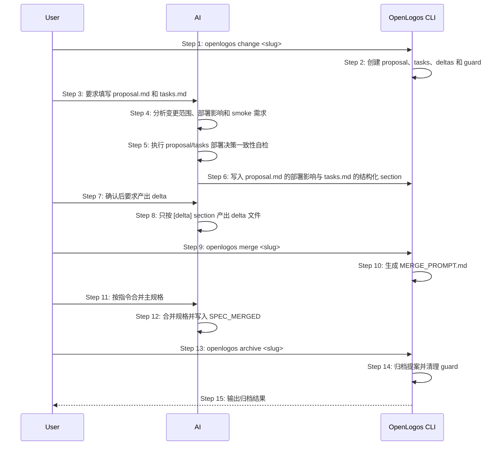

# S09: 创建、合并、归档变更提案 — 时序图

## 步骤说明
1. **用户**创建变更提案。
2. **CLI** 建立提案工作区。
3. **用户**要求 AI 填写提案。
4. **AI** 判断本次提案是否需要部署、是否需要 smoke、是否涉及回滚。
5. **AI** 执行 proposal/tasks 部署决策一致性自检。
6. **AI** 写入 `proposal.md` 的 `## 部署影响`，并让 `tasks.md` 的 `[deploy]` section 与部署决策一致。
7. **用户**确认提案后才进入 delta-writing。
8. **AI** 只产出 `[delta]` section 对应的 delta 文件。
9. **用户**明确授权执行 merge。
10. **CLI** 生成 MERGE_PROMPT。
11. **用户**要求 AI 执行合并流程。
12. **AI** 合并主规格并写入 SPEC_MERGED。
13. **用户**在 verify / deploy / smoke 门禁完成后请求归档。
14. **CLI** 归档并释放 guard。
15. **CLI** 输出结果。

## proposal_step 判定来源（flow-derive）

S09 变更生命周期各步骤展示的 `proposal_step`（`status` / `next` 共享）自 M1 切片 B2 起，
由 `cli/src/lib/flow-derive.ts` 新增的 `detectProposalStepViaFlow(proposalDir, moduleDefaults)`
基于**内置（builtin）launched flow**（`spec/flow/launched.yaml`）派生，取代原硬编码的
`detectProposalStep` 状态机调用点。输出与旧 `detectProposalStep` **逐态一致（1:1 不改行为）**，
`cli-json-output` 的 `proposal_step` 枚举契约保持不变。

派生为「**节点序列声明化 + 规则仍在引擎**」：

- **节点序列声明化**：`launched.yaml` 提供 propose → merge → implement → deliver → close 的
  节点顺序与各节点 `done_when` / `fail_when`（`proposal_package_filled`（writing 离场）/
  `section_complete:delta`（delta-writing → ready-to-merge）/
  `any_present:[MERGE_PROMPT_GENERATED, MERGE_PROMPT.md]`（merge-generated）/
  `any_present:[SPEC_MERGED, MERGED]`（coding 离场）/ `section_complete:code`（coding → ready-to-verify）/
  `marker:VERIFY_PASS`、`fail_when: marker:VERIFY_FAIL` / `marker:DEPLOY_DONE` /
  `marker:SMOKE_PASS`、`fail_when: marker:SMOKE_FAIL` / `archived`）。
- **marker 非对称优先级（引擎规则保留，不下沉 flow）**：`VERIFY_FAIL` 全局最先判定（先于
  template / merge / deploy）；`SMOKE_FAIL` / `SMOKE_PASS` **不是全局优先**——仅在 `VERIFY_PASS`
  成立、需部署、`DEPLOY_DONE` 存在且 deploy 任务全勾后的 deploy 子块内评估，否则仍停
  `ready-to-deploy`。
- **提案级部署决策（引擎规则保留）**：deliver 子流程的 `deployment_required` / `smoke_required`
  及决策冲突阻塞继续由 `resolveProposalDeploymentDecision` 依据 `proposal.md` 的 `## 部署影响`
  与 `tasks.md` 的 `[deploy]` section 求解（提案级，不回退模块默认）；EX-5.1 部署决策冲突
  行为不变（冲突时停 `verify-passed`，不推进 deploy/smoke/archive）。
- **section 完成语义按 legacy**：`section_complete:<tag>` 实现为 `total > 0 && checked === total`，
  present-but-empty 的 `[delta]`/`[code]` 不算完成（不采用 flow-spec §184 字面"全部勾选或不存在"）。

`detectProposalStep` 仍是状态计算的单一语义来源——B2 只是把它的节点序列改为 flow 声明驱动，
不改各态判定结果。并跑等价由测试期「ViaFlow == 旧 detectProposalStep」断言锁定
（见 `core-S09-test-cases`）。

## 异常用例
### EX-5.1: 部署决策与 tasks 冲突
- **触发条件**：`proposal.md` 声明无需部署但 `tasks.md` 存在 `[deploy]` section，或声明需要部署但缺少 `[deploy]` section。
- **期望响应**：`status` / `next` 输出冲突警告，AI 在修正前不得执行部署。

## SessionStart guard 范围与变更生命周期联动

S09 的 change/merge/archive 生命周期不仅约束 CLI 文件产物，也约束 AI 宿主在会话启动时注入给模型的写入边界。已创建 guard 时，SessionStart 文案必须根据当前提案状态输出阶段化范围：

- `writing`：仅填写 `proposal.md` 与 `tasks.md`，不得写 delta 或源码。
- `ready-to-delta`：提示方案待批准；用户批准后才进入 delta 产出。
- `delta-writing`：只按 `[delta]` section 写入 `deltas/**`，并在每个 delta 完成后勾选 `tasks.md` 中对应 `[delta]` 任务；不得直接改 `logos/resources/**`。
- `ready-to-merge`：停止写 delta，提示用户明确授权 `openlogos merge <slug>`。
- `merge-generated`：按 `MERGE_PROMPT.md` 合并主规格，完成后写入 `SPEC_MERGED`。
- `coding`：按已合并规格执行 `[code]` section，允许修改源码、测试和 reporter，并同步勾选 `tasks.md`。

该约束的核心是不再把“active change proposal 的 scope”落成 `logos/changes/<slug>/proposal.md` 单文件路径。`proposal.md` 是提案描述文档，不是整个变更工作区的唯一可写文件；delta-writing 阶段的真实写入面是 `logos/changes/<slug>/deltas/**` 与 `tasks.md`。

异常用例：

### EX-7.1: SessionStart 将 active guard 误收窄到 proposal.md
- **触发条件**：项目处于 launched 生命周期，存在 active guard，提案已进入 `delta-writing`。
- **期望响应**：SessionStart 注入文案必须明确允许写入 `logos/changes/<slug>/deltas/**` 并更新 `tasks.md`，不得输出“Only modify files within the scope of logos/changes/<slug>/proposal.md”。
- **副作用**：不改变 guard 文件格式，不改变 `openlogos change` / `openlogos merge` / `openlogos archive` 的确认点。
