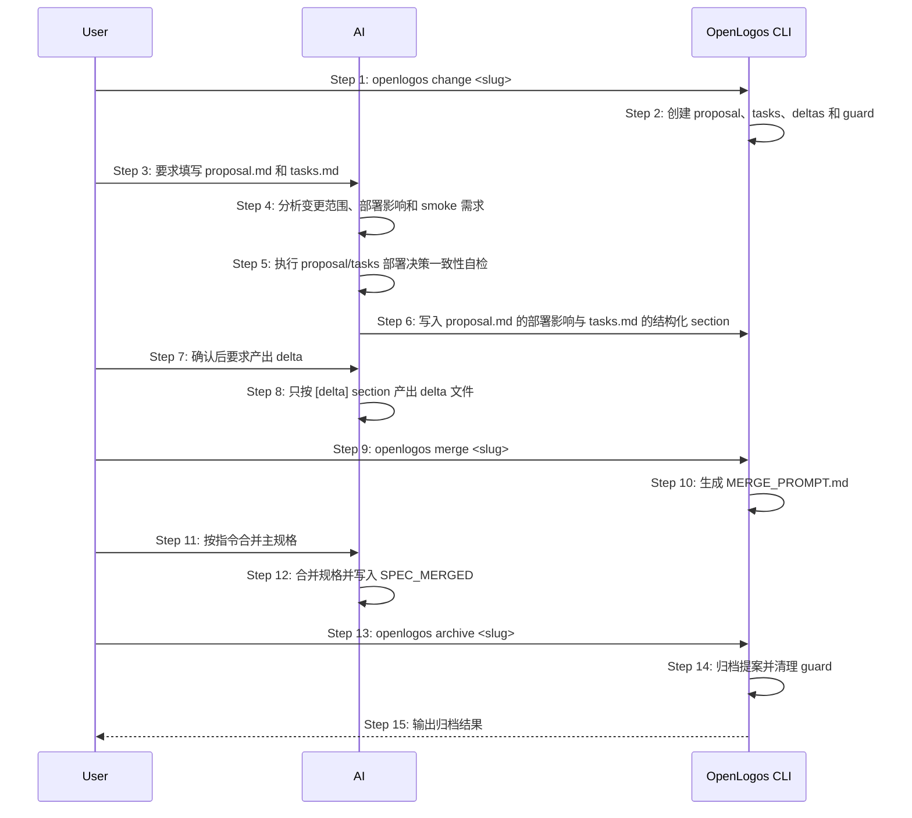
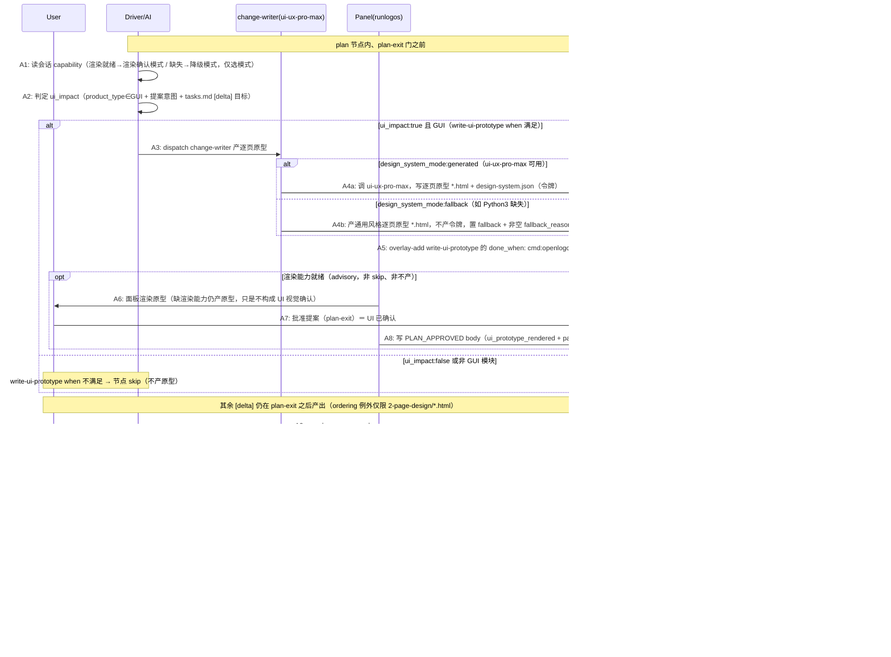

# S09: 创建、合并、归档变更提案 — 时序图

```mermaid
sequenceDiagram
    participant U as User
    participant A as AI
    participant C as OpenLogos CLI

    U->>C: Step 1: openlogos change <slug>
    C->>C: Step 2: 创建 proposal、tasks、deltas 和 guard
    U->>A: Step 3: 要求填写 proposal.md 和 tasks.md
    A->>A: Step 4: 分析变更范围、部署影响和 smoke 需求
    A->>A: Step 5: 执行 proposal/tasks 部署决策一致性自检
    A->>C: Step 6: 写入 proposal.md 的部署影响与 tasks.md 的结构化 section
    U->>A: Step 7: 确认后要求产出 delta
    A->>A: Step 8: 只按 [delta] section 产出 delta 文件
    U->>C: Step 9: openlogos merge <slug>
    C->>C: Step 10: 生成 MERGE_PROMPT.md
    U->>A: Step 11: 按指令合并主规格
    A->>A: Step 12: 合并规格并写入 SPEC_MERGED
    U->>C: Step 13: openlogos archive <slug>
    C->>C: Step 14: 归档提案并清理 guard
    C-->>U: Step 15: 输出归档结果
```

## 步骤说明
1. **用户**创建变更提案。
2. **CLI** 建立提案工作区。
3. **用户**要求 AI 填写提案。
4. **AI** 判断本次提案是否需要部署、是否需要 smoke、是否涉及回滚。
5. **AI** 执行 proposal/tasks 部署决策一致性自检。
6. **AI** 写入 `proposal.md` 的 `## 部署影响`，并让 `tasks.md` 的 `[deploy]` section 与部署决策一致。
7. **用户**确认提案后才进入 delta-writing。
8. **AI** 只产出 `[delta]` section 对应的 delta 文件。
9. **用户**明确授权执行 merge。
10. **CLI** 生成 MERGE_PROMPT。
11. **用户**要求 AI 执行合并流程。
12. **AI** 合并主规格并写入 SPEC_MERGED。
13. **用户**在 verify / deploy / smoke 门禁完成后请求归档。
14. **CLI** 归档并释放 guard。
15. **CLI** 输出结果。

## proposal_step 判定来源（flow-derive）

S09 变更生命周期各步骤展示的 `proposal_step`（`status` / `next` 共享）自 M1 切片 B2 起，
由 `cli/src/lib/flow-derive.ts` 新增的 `detectProposalStepViaFlow(proposalDir, moduleDefaults)`
基于**内置（builtin）launched flow**（`spec/flow/launched.yaml`）派生，取代原硬编码的
`detectProposalStep` 状态机调用点。输出与旧 `detectProposalStep` **逐态一致（1:1 不改行为）**，
`cli-json-output` 的 `proposal_step` 枚举契约保持不变。

派生为「**节点序列声明化 + 规则仍在引擎**」：

- **节点序列声明化**：`launched.yaml` 提供 propose → merge → implement → deliver → close 的
  节点顺序与各节点 `done_when` / `fail_when`（`proposal_package_filled`（writing 离场）/
  `section_complete:delta`（delta-writing → ready-to-merge）/
  `any_present:[MERGE_PROMPT_GENERATED, MERGE_PROMPT.md]`（merge-generated）/
  `any_present:[SPEC_MERGED, MERGED]`（coding 离场）/ `section_complete:code`（coding → ready-to-verify）/
  `marker:VERIFY_PASS`、`fail_when: marker:VERIFY_FAIL` / `marker:DEPLOY_DONE` /
  `marker:SMOKE_PASS`、`fail_when: marker:SMOKE_FAIL` / `archived`）。
- **marker 非对称优先级（引擎规则保留，不下沉 flow）**：`VERIFY_FAIL` 全局最先判定（先于
  template / merge / deploy）；`SMOKE_FAIL` / `SMOKE_PASS` **不是全局优先**——仅在 `VERIFY_PASS`
  成立、需部署、`DEPLOY_DONE` 存在且 deploy 任务全勾后的 deploy 子块内评估，否则仍停
  `ready-to-deploy`。
- **提案级部署决策（引擎规则保留）**：deliver 子流程的 `deployment_required` / `smoke_required`
  及决策冲突阻塞继续由 `resolveProposalDeploymentDecision` 依据 `proposal.md` 的 `## 部署影响`
  与 `tasks.md` 的 `[deploy]` section 求解（提案级，不回退模块默认）；EX-5.1 部署决策冲突
  行为不变（冲突时停 `verify-passed`，不推进 deploy/smoke/archive）。
- **section 完成语义按 legacy**：`section_complete:<tag>` 实现为 `total > 0 && checked === total`，
  present-but-empty 的 `[delta]`/`[code]` 不算完成（不采用 flow-spec §184 字面"全部勾选或不存在"）。

`detectProposalStep` 仍是状态计算的单一语义来源——B2 只是把它的节点序列改为 flow 声明驱动，
不改各态判定结果。并跑等价由测试期「ViaFlow == 旧 detectProposalStep」断言锁定
（见 `core-S09-test-cases`）。

## 纯代码提案（无 `[delta]`）派生：no-delta spec-complete 后进入 slice/implement

纯代码级修复提案（`tasks.md` 无 `## [delta]` section）在生命周期派生上与常规提案的差异是：不进入 `write-delta`，但仍必须完成 spec-complete 留痕。`openlogos merge <slug>` 在无 delta 时执行 no-op merge 并写入 `SPEC_MERGED`，表示 no-delta spec-complete。

**关键不变量**：

1. `delta_required==false` 时，本生命周期**绝不**产出 `proposal_step=="delta-writing"`，前沿**绝不**为 `write-delta`。
2. `delta_required==false` 不再等价于“spec/merge 已完成”。缺少 `SPEC_MERGED` / `MERGED` 时，代码提案必须停在 `spec-complete-required`。
3. 只有 no-delta `SPEC_MERGED` 在场且真实测试 ID 稳定时，才可进入 `ready-to-implement` / `plan-slices`。

派生路径：

- `writing`（proposal/tasks 未脱模板） →（plan 门批准）→ `spec-complete-required`（提示执行 `openlogos merge <slug>`；无 delta 时写 no-delta `SPEC_MERGED`）→ `test-id-required`（若缺真实测试 ID）→ `ready-to-implement`（前沿 `plan-slices`）→ `slice-exit` 门 → `coding`（前沿 `code`）→ `ready-to-verify` → …

**前置协同**：纯代码提案 `tasks.md` 仍必须保留空 `## [code]` 标题，用于表达 `code_required==true` 和后续切片承载区。该标题不代表切片已规划，切片仍由 no-delta spec-complete 后的 `slice-planner` 统一写入。

### EX-9.1: 纯代码提案（无 `[delta]`）被误派 write-delta

- **触发条件**：launched 生命周期、活跃提案 `tasks.md` 无 `## [delta]` section（纯代码级修复），经 plan 门后派生。
- **期望响应**：若无 `SPEC_MERGED` / `MERGED`，`proposal_step=="spec-complete-required"`，`next_node.id` 不为 `write-delta` 且不为 `plan-slices`；若已有 no-delta `SPEC_MERGED` 且测试 ID 稳定，则派生为 `ready-to-implement` / `plan-slices`。
- **副作用**：不改变有 `[delta]` 常规提案的派生（仍 `delta-writing → ready-to-merge → merge-generated → …`）。

### EX-9.2: no-delta merge 写入 spec-complete marker

- **触发条件**：提案无 `[delta]` section，执行 `openlogos merge <slug>`。
- **期望响应**：CLI 不生成 `MERGE_PROMPT.md`，直接写入 `SPEC_MERGED`；新写入内容包含 `type:"no_delta_spec_complete"`、`reason`、`completed_at`。
- **副作用**：重复执行 merge 幂等返回已完成，不覆盖已有 marker。

## 异常用例
### EX-5.1: 部署决策与 tasks 冲突
- **触发条件**：`proposal.md` 声明无需部署但 `tasks.md` 存在 `[deploy]` section，或声明需要部署但缺少 `[deploy]` section。
- **期望响应**：`status` / `next` 输出冲突警告，AI 在修正前不得执行部署。

## SessionStart guard 范围与变更生命周期联动

S09 的 change/merge/archive 生命周期不仅约束 CLI 文件产物，也约束 AI 宿主在会话启动时注入给模型的写入边界。已创建 guard 时，SessionStart 文案必须根据当前提案状态输出阶段化范围：

- `writing`：仅填写 `proposal.md` 与 `tasks.md`，不得写 delta 或源码。
- `ready-to-delta`：提示方案待批准；用户批准后才进入 delta 产出。
- `delta-writing`：只按 `[delta]` section 写入 `deltas/**`，并在每个 delta 完成后勾选 `tasks.md` 中对应 `[delta]` 任务；不得直接改 `logos/resources/**`。
- `ready-to-merge`：停止写 delta，提示用户明确授权 `openlogos merge <slug>`。
- `merge-generated`：按 `MERGE_PROMPT.md` 合并主规格，完成后写入 `SPEC_MERGED`。
- `coding`：按已合并规格执行 `[code]` section，允许修改源码、测试和 reporter，并同步勾选 `tasks.md`。

该约束的核心是不再把“active change proposal 的 scope”落成 `logos/changes/<slug>/proposal.md` 单文件路径。`proposal.md` 是提案描述文档，不是整个变更工作区的唯一可写文件；delta-writing 阶段的真实写入面是 `logos/changes/<slug>/deltas/**` 与 `tasks.md`。

异常用例：

### EX-7.1: SessionStart 将 active guard 误收窄到 proposal.md
- **触发条件**：项目处于 launched 生命周期，存在 active guard，提案已进入 `delta-writing`。
- **期望响应**：SessionStart 注入文案必须明确允许写入 `logos/changes/<slug>/deltas/**` 并更新 `tasks.md`，不得输出“Only modify files within the scope of logos/changes/<slug>/proposal.md”。
- **副作用**：不改变 guard 文件格式，不改变 `openlogos change` / `openlogos merge` / `openlogos archive` 的确认点。

## proposal/tasks 写完后的 final 前前沿校验

AI 或 driver 在 `writing` 阶段完成 `proposal.md` 与 `tasks.md` 后，不能只因为文件已写入就直接 final 并让外层流程自行猜测下一步。必须在结束本工作单元前确认当前前沿，避免把 plan gate 待消费态误报为 blocked。

执行约束：

1. 完成 `proposal.md` 与 `tasks.md` 后，应读取或消费 OpenLogos 机器状态，确认 `proposal_step` 已从 `writing` 推进到 `ready-to-delta` 或后续状态。
2. 半自动模式下，final 必须明确“方案已完成，等待授权执行 `openlogos merge` 前的 delta-writing / plan gate 流程”，不得把 `tasks.md` checkbox 未勾显示成规划失败。
3. 全自动模式下，driver 应继续消费 `next --auto` 对 `plan-exit` 的放行结果；当响应包含 `gate_auto_passed=true`、`PLAN_APPROVED` 已写入语义和 `next_node.id=="write-delta"` 时，必须继续派发 change-writer 写 delta。
4. 若读取到 `proposal_step=writing`，说明 proposal/tasks 仍未脱模板或结构冲突，AI 必须修正当前文件后再结束；不得输出“已完成”。
5. 若读取到 `proposal_step=ready-to-delta` 且 `tasks_execution_done=0`，应解释为“delta 任务尚未执行”，不是“任务规划失败”。

该校验只要求消费 OpenLogos 已有状态或本提案新增的结构化诊断，不要求 change-writer 自行执行 `openlogos merge`。被派发的 change-writer 仍在产出 delta 后停手，把 merge 权限交给用户或全自动 driver。

### EX-7.2: proposal/tasks 已完成但 driver 误判为任务规划失败

- **触发条件**：`proposal.md` / `tasks.md` 已脱模板，`proposal_step=ready-to-delta`，`tasks.md` 的 `[delta]` checkbox 为 `0/N`。
- **期望响应**：status / next / SessionStart / driver 诊断均表达“plan ready + plan gate pending + delta execution 0/N”，不得输出任务规划失败；全自动 driver 应继续消费 plan gate 并派发 `write-delta`。
- **副作用**：不改变 delta-writing 对 `tasks.md` checkbox 的真实勾选语义。

## GUI UI-first 前移的变更生命周期扩展

> 适用范围：仅对已 `launched` 的 **GUI 产品项目**（网站 / 桌面应用 / 移动 App）且本次变更 `ui_impact:true` 时启用。非 GUI 项目（纯 CLI / API / Skills）本扩展整体不启用，S09 主时序图与步骤说明零改动。

本扩展在**不新增门态、不新增确认标记**的前提下，把 GUI 界面确认前移到既有的「批准提案」（`plan-exit`）门。核心变化：GUI 原型成为 **plan 节点的正式产物**，由 driver 在 **plan-exit 门前** 派发 change-writer（用 `ui-ux-pro-max`）产出；用户批准提案的动作在**面板已渲染原型的前提下**即构成 UI 视觉确认；merge 前用 hash 校验防止批准后原型漂移。原型**复用现有 delta 路径映射**（`deltas/prd/2-product-design/2-page-design/*.html` → `logos/resources/prd/**`）落入原型图文件夹——**不新增 `ui/` 目录**；但原型落盘**不经由 merge 拷贝步骤**，而由专用事务落盘入口 **`commitVerifiedPrototypes()`** 完成（严格模式下先做 hash 校验、再原子提交），**merge-executor 绝不触碰原型资产**。

### 扩展时序（plan 节点内 dispatch → 产原型 → plan-exit 渲染确认 → merge 前 hash 校验）

```mermaid
sequenceDiagram
    participant U as User
    participant D as Driver/AI
    participant CW as change-writer(ui-ux-pro-max)
    participant P as Panel(runlogos)
    participant C as OpenLogos CLI

    Note over D,C: plan 节点内、plan-exit 门之前
    D->>D: A1: 读会话 capability（渲染就绪→渲染确认模式 / 缺失→降级模式，仅选模式）
    D->>D: A2: 判定 ui_impact（product_type∈GUI + 提案意图 + tasks.md [delta] 目标）
    alt ui_impact:true 且 GUI（write-ui-prototype when 满足）
        D->>CW: A3: dispatch change-writer 产逐页原型
        alt design_system_mode:generated（ui-ux-pro-max 可用）
            CW->>C: A4a: 调 ui-ux-pro-max，写逐页原型 *.html + design-system.json（令牌）
        else design_system_mode:fallback（如 Python3 缺失）
            CW->>C: A4b: 产通用风格逐页原型 *.html，不产令牌，置 fallback + 非空 fallback_reason
        end
        C->>C: A5: overlay-add write-ui-prototype 的 done_when: cmd:openlogos check-ui-prototype 富对账（两支同判：逐页非空 + 声明清单==产出 basename 集合 + 记录 hash）
        opt 渲染能力就绪（advisory，非 skip、非不产）
            P->>U: A6: 面板渲染原型（缺渲染能力仍产原型，只是不构成 UI 视觉确认）
            U->>C: A7: 批准提案（plan-exit）＝ UI 已确认
            P->>C: A8: 写 PLAN_APPROVED body（ui_prototype_rendered + pages + hashes）
        end
    else ui_impact:false 或非 GUI 模块
        Note over D,U: write-ui-prototype when 不满足 → 节点 skip（不产原型）
    end
    Note over C,U: 其余 [delta] 仍在 plan-exit 之后产出（ordering 例外仅限 2-page-design/*.html）
    U->>C: A9: openlogos merge <slug>
    C->>C: A10: overlay-add verify-ui-provenance（merge 前）done_when: cmd:openlogos check-ui-hash-match
    alt 含完整 provenance 且 hash 匹配（exit 0）
        C->>C: A11: 节点 done → 放行，进入 MERGE_PROMPT 生成/落盘
    else legacy/degraded 或旧空 marker 且无「曾渲染」证据（advisory）
        C->>C: A11b: 记 advisory → exit 0 → 节点 done → 放行（向后兼容）
    else 含 provenance 但 hash 失配 / 部分 provenance（有 rendered 无 hashes）
        C-->>U: A12: fail closed → 节点未 done → 阻断，显式重入 plan 刷新 PLAN_APPROVED.hashes（非引擎自动 rewind）
    end
```

### 扩展步骤说明

- **A1 模式选择（plan-exit 之前）**：driver 读会话 capability（`logos/.session-capabilities.json` 的 `ui_prototype_render`）——就绪则进入**渲染确认模式**（要求 provenance + hash），缺失则进入**降级模式**（不 claim UI 确认、advisory 不阻断）。此为 capability 文件的**唯一**合法用途，只用于 plan-exit 之前选模式，绝不作为批准后的完整性门降级开关。
- **A2 判定 `ui_impact`**：在 plan 阶段由 change-writer 依据 **项目 `product_type` + 提案意图 + `tasks.md` 已规划的 `[delta]` 目标**判定，**而非扫描尚不存在的 delta 内容**（避免「先 delta 还是先原型」循环依赖）。`tasks.md` `[delta]` 命中 `2-page-design/` 或含交互变更的 feature-specs，即强制判为「动了界面」。`ui_impact` 为**可派生 when-flag**（派生方式仿 `delta_required`，从 `proposal.md` 的「UI/UX 变更声明」段推导，`ui_impact:true` 且 `product_type∈GUI` 才为真）。
- **A3–A4 producer dispatch（授权同「写 proposal.md / tasks.md」，无新授权；按 `design_system_mode` 拆两支）**：driver 在 plan 节点派发 change-writer 产出逐页原型，producer 责任 = **优先调用 `ui-ux-pro-max`；不可用（如 Python3 缺失）时按 fallback 契约兜底**——绝不因渲染 / 令牌能力缺失而永久卡死：
  - **A4a `generated`（ui-ux-pro-max 可用）**：调用 `ui-ux-pro-max` 产出逐页原型 + `design-system.json`（审计令牌），声明段置 `design_system_mode: generated`。
  - **A4b `fallback`（如 Python3 缺失）**：产出**通用风格**逐页原型、**不产令牌**，声明段置 `design_system_mode: fallback` + **非空** `design_system_fallback_reason`（如「Python3 缺失」）；**禁止伪造 `design-system.json`**。
  - **两支同做**：原型作为 page-design delta 直接写入 `deltas/prd/2-product-design/2-page-design/core-NN-<slug>.html`；写入由 guard 的 **plan 阶段 allowlist（仅放行 `2-page-design/*.html`）** 授权，其余 `deltas/**` 在 plan 阶段仍禁止写入。
- **正交三事（不得混淆）**：① `ui_impact:false` / 非 GUI 模块 → `write-ui-prototype` 的 `when` 不满足 → 节点 **skip（不产原型）**；② 渲染 capability 缺失 → **仍产原型**（generated 或 fallback），只是批准不构成 **UI 视觉确认**（advisory，非 skip、非不产）；③ Python3 缺失 → 走 **A4b fallback**（仍产通用原型，只是不产令牌）。**capability 缺失绝不并入 `ui_impact:false` 分支。**
- **A5 overlay-add `write-ui-prototype` 收敛（`done_when: cmd:<check-ui-prototype>`）**：该节点为方法论给 GUI 项目注入的 **overlay `op:add` 节点**（`after: write-tasks`、落在 plan subflow 内、plan-exit 门前），故**合法使用 `cmd:` 谓词**做富对账。`<check-ui-prototype>` 在 delta 文本中仅为占位示意，**运行时 overlay 资产使用真实子命令 `openlogos check-ui-prototype`**（自解析活跃提案，`exit 0` / 非 0）。收敛判据**按 `design_system_mode` 分档、两支共通**：UI/UX 变更声明段**声明的每一页**在 `2-page-design/` 下都有**对应非空原型文件**、**声明清单 basename 集合 == 产出文件 basename 集合**、并记录内容 hash；仅 `generated` 支**额外**要求存在合法非空 `design-system.json`，`fallback` 支**不要求令牌**但要求非空 `design_system_fallback_reason`。命令 `exit 0` 才 done、plan 子流程才完成、plan-exit 门才可放行。builtin `launched.yaml` **不硬编码** UI 节点。
- **A6–A7 批准即 UI 确认（前提=面板已渲染原型）**：「批准 == UI 已确认」**仅当面板实际渲染了原型时成立**。在不渲染的旧面板上，批准只是普通方案批准、**不构成 UI 视觉确认**（方法论给 advisory、不阻断）。**不新增门态、不新增确认标记**——复用现有 `plan-exit` 门。
- **A8 provenance 写入（既有批准事件上的溯源属性）**：渲染面板 / driver 在批准时向 `PLAN_APPROVED` marker 的**可选 JSON body** 写入 `{ ui_prototype_rendered: true, pages: [...], hashes: { "<file>": "<sha256>" } }`。由**用户批准动作本身授权**（同一次点击），无独立授权。`PLAN_APPROVED` 的**存在性语义完全不变**（空 marker 仍合法、仅存在性读取者不受影响），provenance 是向后兼容的可选叠加字段。
- **A9–A12 merge 前 `verify-ui-provenance`（`done_when: cmd:<check-ui-hash-match>`）**：overlay-add 节点，置于 merge 之前（`before: generate-merge-prompt`、`when: ui_impact`），在原型落盘 resources **之前**拦截漂移。`<check-ui-hash-match>` 在 delta 文本中仅为占位示意，**运行时 overlay 资产使用真实子命令 `openlogos check-ui-hash-match`**（自解析活跃提案，`exit 0` / 非 0）。命令按 `PLAN_APPROVED` 内容**三分支**判定（不再是两果，避免旧空 marker 的 GUI 提案永久卡死）：
  - **含完整 provenance（`ui_prototype_rendered:true` + `pages` + `hashes`）**：重算 `2-page-design/` 现值 hash 与 `PLAN_APPROVED.hashes` 比对——**匹配 `exit 0` → 节点 done → 放行前进**；**失配非 0 → 节点未 done → 前向阻断（fail closed）**。
  - **legacy/degraded 或旧空 marker 且无任何「曾渲染确认」证据**（GUI `ui_impact:true` 但批准发生在旧不渲染面板上）：**记 advisory 后 `exit 0` → 节点 done → 放行**（F3 向后兼容，不因缺 provenance 永久阻断）。
  - **部分 provenance（有 `ui_prototype_rendered:true` / rendered 证据但缺 `hashes`）**：**fail closed 非 0 → 节点未 done → 阻断**（曾走渲染确认路径却无完整 hash，不得降级放行）。
  - 因 flow 引擎前向线性、无跨 subflow 自动回退边，「退回 plan-exit」**非引擎自动 rewind**，而是 driver / 人工**显式重入 plan**（重跑 producer 产原型 + plan-exit 重批、刷新 `PLAN_APPROVED.hashes`），再到该节点 hash 匹配 `exit 0` → done → 放行。

### ordering 例外与 flow-derive 判据（补充）

- **ordering 例外仅限 `2-page-design/*.html`**：GUI page-design 原型是 plan 节点产物，可在 plan-exit **之前**产出；其余所有 `deltas/**` 仍严格在 plan-exit **之后**产出。
- **flow-derive 不因原型 delta 误判进入 spec**：`flow-derive.ts` 识别 plan subflow 新增的原型节点，仅当出现**非原型的规格 delta**、或 plan-exit 已放行时才视为进入 spec；例外仅限 `2-page-design/*.html` 叶子原型，不涉及 `[code]` 切片与 spec-merge 依赖。

### EX-9.3: 批准后漂移的原型被 verify-ui-provenance / merge 拒绝

- **触发条件**：`ui_impact:true` 的 GUI 提案已在渲染面板上批准（`PLAN_APPROVED` 含 `ui_prototype_rendered:true` + `pages` + `hashes`），随后 `2-page-design/` 下某原型文件内容被改动（批准后漂移），再执行 `openlogos merge <slug>`。
- **期望响应**：merge 前 `verify-ui-provenance` 的 `done_when: cmd:<check-ui-hash-match>` 重算现值 hash 与 `PLAN_APPROVED.hashes` 比对，**失配非 0** → 节点未 done → **前向阻断**；`openlogos merge` 命令级 pre-merge hash gate 亦**拒绝 merge（非零退出、明确错误、不生成 `MERGE_PROMPT`）**。无论经 driver 流还是直接 CLI 调用都不可绕过。remediation = 显式重入 plan 重跑 producer + plan-exit 重批、刷新 `PLAN_APPROVED.hashes`。
- **副作用**：不新增门态 / 不新增确认标记（复用 `plan-exit` 门的「批准内容变更即批准失效」完整性语义）；不改变 `ui_impact:false` 或纯 CLI/API/Skills 提案的既有派生与 merge 行为。

### EX-9.4: 跨会话降级绕过被持久化 provenance 拦截

- **触发条件**：渲染就绪会话写了带 `hashes` 的 `PLAN_APPROVED` → 原型被改动 → 删除 `logos/.session-capabilities.json` 并重启进程（新 CLI-only 会话，capability 文件缺失）→ 直接 `openlogos merge <slug>`。
- **期望响应**：严格性以**持久化 `PLAN_APPROVED` provenance 为键**，而非消费时易失会话 capability。批准记录含 UI provenance ⇒ merge / 落盘 / 落盘后复核入口**永久 fail closed**：**必须拒绝**，不得生成 `MERGE_PROMPT` / 写 resources / 写 `SPEC_MERGED`；当前会话 capability 文件缺失一律不得降级。对照组「旧空 marker、无任何『曾渲染确认』证据的纯 CLI 项目」仍走 F3 向后兼容 advisory 放行。
- **副作用**：`.session-capabilities.json` 仅用于 plan-exit **之前**的模式选择；plan-exit **之后**的强制语义一律以 `PLAN_APPROVED` 为准。三处判据（提示前 / 落盘时 / 落盘后）一致，避免复用同一「capability 缺失即降级」分支而一致放行。

### EX-9.5: 旧面板空批准 marker 的 GUI 提案经 verify-ui-provenance advisory 放行

- **触发条件**：GUI 产品项目、本次 `ui_impact:true`，但批准发生在**旧不渲染面板**上——`PLAN_APPROVED` 为**空 marker**（存在即门已过，但无 `ui_prototype_rendered` / `pages` / `hashes` 任何 provenance body、无任何「曾渲染确认」证据）。随后 `openlogos merge <slug>`。
- **期望响应**：merge 前 `verify-ui-provenance`（`openlogos check-ui-hash-match`）落入**第三分支（legacy/degraded 且无「曾渲染」证据）**——**记 advisory 后 `exit 0` → 节点 done → merge 可达**，不因缺 provenance 永久卡死（F3 向后兼容，方法论仅提示「本次批准未构成 UI 视觉确认」而不阻断）。
- **对照组（fail closed，不放行）**：批准记录**含 rendered 证据但缺 `hashes`（部分 provenance）** → 曾走渲染确认路径却无完整 hash → **非零退出 → 节点未 done → 阻断**，不得降级放行；须显式重入 plan 刷新 `PLAN_APPROVED.hashes` 后方可前进。
- **副作用**：不新增门态 / 不新增确认标记；三分支判据（含完整 provenance 校 hash / legacy 空 marker advisory / 部分 provenance fail closed）与 2.26.9 的持久化键语义一致；不改变 `ui_impact:false` 或纯 CLI/API/Skills 提案的既有行为。
