# S09: 创建、合并、归档变更提案 — 时序图

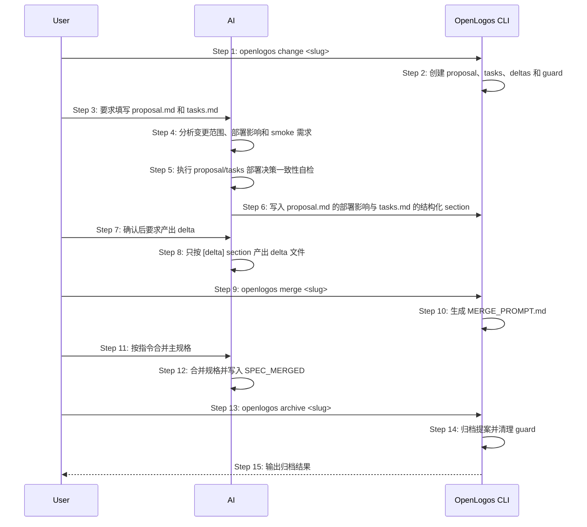
```mermaid
sequenceDiagram
    participant U as User
    participant A as AI
    participant C as OpenLogos CLI

    U->>C: Step 1: openlogos change <slug>
    C->>C: Step 2: 创建 proposal、tasks、deltas 和 guard
    U->>A: Step 3: 要求填写 proposal.md 和 tasks.md
    A->>A: Step 4: 分析变更范围、部署影响和 smoke 需求
    A->>A: Step 5: 执行 proposal/tasks 部署决策一致性自检
    A->>C: Step 6: 写入 proposal.md 的部署影响与 tasks.md 的结构化 section
    U->>A: Step 7: 确认后要求产出 delta
    A->>A: Step 8: 只按 [delta] section 产出 delta 文件
    U->>C: Step 9: openlogos merge <slug>
    C->>C: Step 10: 生成 MERGE_PROMPT.md
    U->>A: Step 11: 按指令合并主规格
    A->>A: Step 12: 合并规格并写入 SPEC_MERGED
    U->>C: Step 13: openlogos archive <slug>
    C->>C: Step 14: 归档提案并清理 guard
    C-->>U: Step 15: 输出归档结果
```

## 步骤说明
1. **用户**创建变更提案。
2. **CLI** 建立提案工作区。
3. **用户**要求 AI 填写提案。
4. **AI** 判断本次提案是否需要部署、是否需要 smoke、是否涉及回滚。
5. **AI** 执行 proposal/tasks 部署决策一致性自检。
6. **AI** 写入 `proposal.md` 的 `## 部署影响`，并让 `tasks.md` 的 `[deploy]` section 与部署决策一致。
7. **用户**确认提案后才进入 delta-writing。
8. **AI** 只产出 `[delta]` section 对应的 delta 文件。
9. **用户**明确授权执行 merge。
10. **CLI** 生成 MERGE_PROMPT。
11. **用户**要求 AI 执行合并流程。
12. **AI** 合并主规格并写入 SPEC_MERGED。
13. **用户**在 verify / deploy / smoke 门禁完成后请求归档。
14. **CLI** 归档并释放 guard。
15. **CLI** 输出结果。

## proposal_step 判定来源（flow-derive）

S09 变更生命周期各步骤展示的 `proposal_step`（`status` / `next` 共享）自 M1 切片 B2 起，
由 `cli/src/lib/flow-derive.ts` 新增的 `detectProposalStepViaFlow(proposalDir, moduleDefaults)`
基于**内置（builtin）launched flow**（`spec/flow/launched.yaml`）派生，取代原硬编码的
`detectProposalStep` 状态机调用点。输出与旧 `detectProposalStep` **逐态一致（1:1 不改行为）**，
`cli-json-output` 的 `proposal_step` 枚举契约保持不变。

派生为「**节点序列声明化 + 规则仍在引擎**」：

- **节点序列声明化**：`launched.yaml` 提供 propose → merge → implement → deliver → close 的
  节点顺序与各节点 `done_when` / `fail_when`（`proposal_package_filled`（writing 离场）/
  `section_complete:delta`（delta-writing → ready-to-merge）/
  `any_present:[MERGE_PROMPT_GENERATED, MERGE_PROMPT.md]`（merge-generated）/
  `any_present:[SPEC_MERGED, MERGED]`（coding 离场）/ `section_complete:code`（coding → ready-to-verify）/
  `marker:VERIFY_PASS`、`fail_when: marker:VERIFY_FAIL` / `marker:DEPLOY_DONE` /
  `marker:SMOKE_PASS`、`fail_when: marker:SMOKE_FAIL` / `archived`）。
- **marker 非对称优先级（引擎规则保留，不下沉 flow）**：`VERIFY_FAIL` 全局最先判定（先于
  template / merge / deploy）；`SMOKE_FAIL` / `SMOKE_PASS` **不是全局优先**——仅在 `VERIFY_PASS`
  成立、需部署、`DEPLOY_DONE` 存在且 deploy 任务全勾后的 deploy 子块内评估，否则仍停
  `ready-to-deploy`。
- **提案级部署决策（引擎规则保留）**：deliver 子流程的 `deployment_required` / `smoke_required`
  及决策冲突阻塞继续由 `resolveProposalDeploymentDecision` 依据 `proposal.md` 的 `## 部署影响`
  与 `tasks.md` 的 `[deploy]` section 求解（提案级，不回退模块默认）；EX-5.1 部署决策冲突
  行为不变（冲突时停 `verify-passed`，不推进 deploy/smoke/archive）。
- **section 完成语义按 legacy**：`section_complete:<tag>` 实现为 `total > 0 && checked === total`，
  present-but-empty 的 `[delta]`/`[code]` 不算完成（不采用 flow-spec §184 字面"全部勾选或不存在"）。

`detectProposalStep` 仍是状态计算的单一语义来源——B2 只是把它的节点序列改为 flow 声明驱动，
不改各态判定结果。并跑等价由测试期「ViaFlow == 旧 detectProposalStep」断言锁定
（见 `core-S09-test-cases`）。

## 纯代码提案（无 `[delta]`）派生：no-delta spec-complete 后进入 slice/implement

纯代码级修复提案（`tasks.md` 无 `## [delta]` section）在生命周期派生上与常规提案的差异是：不进入 `write-delta`，但仍必须完成 spec-complete 留痕。`openlogos merge <slug>` 在无 delta 时执行 no-op merge 并写入 `SPEC_MERGED`，表示 no-delta spec-complete。

**关键不变量**：

1. `delta_required==false` 时，本生命周期**绝不**产出 `proposal_step=="delta-writing"`，前沿**绝不**为 `write-delta`。
2. `delta_required==false` 不再等价于“spec/merge 已完成”。缺少 `SPEC_MERGED` / `MERGED` 时，代码提案必须停在 `spec-complete-required`。
3. 只有 no-delta `SPEC_MERGED` 在场且真实测试 ID 稳定时，才可进入 `ready-to-implement` / `plan-slices`。

派生路径：

- `writing`（proposal/tasks 未脱模板） →（plan 门批准）→ `spec-complete-required`（提示执行 `openlogos merge <slug>`；无 delta 时写 no-delta `SPEC_MERGED`）→ `test-id-required`（若缺真实测试 ID）→ `ready-to-implement`（前沿 `plan-slices`）→ `slice-exit` 门 → `coding`（前沿 `code`）→ `ready-to-verify` → …

**前置协同**：纯代码提案 `tasks.md` 仍必须保留空 `## [code]` 标题，用于表达 `code_required==true` 和后续切片承载区。该标题不代表切片已规划，切片仍由 no-delta spec-complete 后的 `slice-planner` 统一写入。

### EX-9.1: 纯代码提案（无 `[delta]`）被误派 write-delta

- **触发条件**：launched 生命周期、活跃提案 `tasks.md` 无 `## [delta]` section（纯代码级修复），经 plan 门后派生。
- **期望响应**：若无 `SPEC_MERGED` / `MERGED`，`proposal_step=="spec-complete-required"`，`next_node.id` 不为 `write-delta` 且不为 `plan-slices`；若已有 no-delta `SPEC_MERGED` 且测试 ID 稳定，则派生为 `ready-to-implement` / `plan-slices`。
- **副作用**：不改变有 `[delta]` 常规提案的派生（仍 `delta-writing → ready-to-merge → merge-generated → …`）。

### EX-9.2: no-delta merge 写入 spec-complete marker

- **触发条件**：提案无 `[delta]` section，执行 `openlogos merge <slug>`。
- **期望响应**：CLI 不生成 `MERGE_PROMPT.md`，直接写入 `SPEC_MERGED`；新写入内容包含 `type:"no_delta_spec_complete"`、`reason`、`completed_at`。
- **副作用**：重复执行 merge 幂等返回已完成，不覆盖已有 marker。

## 异常用例
### EX-5.1: 部署决策与 tasks 冲突
- **触发条件**：`proposal.md` 声明无需部署但 `tasks.md` 存在 `[deploy]` section，或声明需要部署但缺少 `[deploy]` section。
- **期望响应**：`status` / `next` 输出冲突警告，AI 在修正前不得执行部署。

## SessionStart guard 范围与变更生命周期联动

S09 的 change/merge/archive 生命周期不仅约束 CLI 文件产物，也约束 AI 宿主在会话启动时注入给模型的写入边界。已创建 guard 时，SessionStart 文案必须根据当前提案状态输出阶段化范围：

- `writing`：仅填写 `proposal.md` 与 `tasks.md`，不得写 delta 或源码。
- `ready-to-delta`：提示方案待批准；用户批准后才进入 delta 产出。
- `delta-writing`：只按 `[delta]` section 写入 `deltas/**`，并在每个 delta 完成后勾选 `tasks.md` 中对应 `[delta]` 任务；不得直接改 `logos/resources/**`。
- `ready-to-merge`：停止写 delta，提示用户明确授权 `openlogos merge <slug>`。
- `merge-generated`：按 `MERGE_PROMPT.md` 合并主规格，完成后写入 `SPEC_MERGED`。
- `coding`：按已合并规格执行 `[code]` section，允许修改源码、测试和 reporter，并同步勾选 `tasks.md`。

该约束的核心是不再把“active change proposal 的 scope”落成 `logos/changes/<slug>/proposal.md` 单文件路径。`proposal.md` 是提案描述文档，不是整个变更工作区的唯一可写文件；delta-writing 阶段的真实写入面是 `logos/changes/<slug>/deltas/**` 与 `tasks.md`。

异常用例：

### EX-7.1: SessionStart 将 active guard 误收窄到 proposal.md
- **触发条件**：项目处于 launched 生命周期，存在 active guard，提案已进入 `delta-writing`。
- **期望响应**：SessionStart 注入文案必须明确允许写入 `logos/changes/<slug>/deltas/**` 并更新 `tasks.md`，不得输出“Only modify files within the scope of logos/changes/<slug>/proposal.md”。
- **副作用**：不改变 guard 文件格式，不改变 `openlogos change` / `openlogos merge` / `openlogos archive` 的确认点。

## proposal/tasks 写完后的 final 前前沿校验

AI 或 driver 在 `writing` 阶段完成 `proposal.md` 与 `tasks.md` 后，不能只因为文件已写入就直接 final 并让外层流程自行猜测下一步。必须在结束本工作单元前确认当前前沿，避免把 plan gate 待消费态误报为 blocked。

执行约束：

1. 完成 `proposal.md` 与 `tasks.md` 后，应读取或消费 OpenLogos 机器状态，确认 `proposal_step` 已从 `writing` 推进到 `ready-to-delta` 或后续状态。
2. 半自动模式下，final 必须明确“方案已完成，等待授权执行 `openlogos merge` 前的 delta-writing / plan gate 流程”，不得把 `tasks.md` checkbox 未勾显示成规划失败。
3. 全自动模式下，driver 应继续消费 `next --auto` 对 `plan-exit` 的放行结果；当响应包含 `gate_auto_passed=true`、`PLAN_APPROVED` 已写入语义和 `next_node.id=="write-delta"` 时，必须继续派发 change-writer 写 delta。
4. 若读取到 `proposal_step=writing`，说明 proposal/tasks 仍未脱模板或结构冲突，AI 必须修正当前文件后再结束；不得输出“已完成”。
5. 若读取到 `proposal_step=ready-to-delta` 且 `tasks_execution_done=0`，应解释为“delta 任务尚未执行”，不是“任务规划失败”。

该校验只要求消费 OpenLogos 已有状态或本提案新增的结构化诊断，不要求 change-writer 自行执行 `openlogos merge`。被派发的 change-writer 仍在产出 delta 后停手，把 merge 权限交给用户或全自动 driver。

### EX-7.2: proposal/tasks 已完成但 driver 误判为任务规划失败

- **触发条件**：`proposal.md` / `tasks.md` 已脱模板，`proposal_step=ready-to-delta`，`tasks.md` 的 `[delta]` checkbox 为 `0/N`。
- **期望响应**：status / next / SessionStart / driver 诊断均表达“plan ready + plan gate pending + delta execution 0/N”，不得输出任务规划失败；全自动 driver 应继续消费 plan gate 并派发 `write-delta`。
- **副作用**：不改变 delta-writing 对 `tasks.md` checkbox 的真实勾选语义。

## GUI UI-first 前移的变更生命周期扩展

> 适用范围：仅对已 `launched` 的 **GUI 产品项目**（网站 / 桌面应用 / 移动 App）且本次变更 `ui_impact:true` 时启用。非 GUI 项目（纯 CLI / API / Skills）本扩展整体不启用，S09 主时序图与步骤说明零改动。

本扩展在**不新增门态、不新增确认标记**的前提下，把 GUI 界面确认前移到既有的「批准提案」（`plan-exit`）门。核心变化：GUI 原型成为 **plan 节点的正式产物**，由 driver 在 **plan-exit 门前** 派发 change-writer（用 `ui-ux-pro-max`）产出；用户批准提案的动作在**面板已渲染原型的前提下**即构成 UI 视觉确认；merge 前用 hash 校验防止批准后原型漂移。原型**复用现有 delta 路径映射**（`deltas/prd/2-product-design/2-page-design/*.html` → `logos/resources/prd/**`）落入原型图文件夹——**不新增 `ui/` 目录**；但原型落盘**不经由 merge 拷贝步骤**，而由专用事务落盘入口 **`commitVerifiedPrototypes()`** 完成（严格模式下先做 hash 校验、再原子提交），**merge-executor 绝不触碰原型资产**。

### 扩展时序（plan 节点内 dispatch → 产原型 → plan-exit 渲染确认 → merge 前 hash 校验）

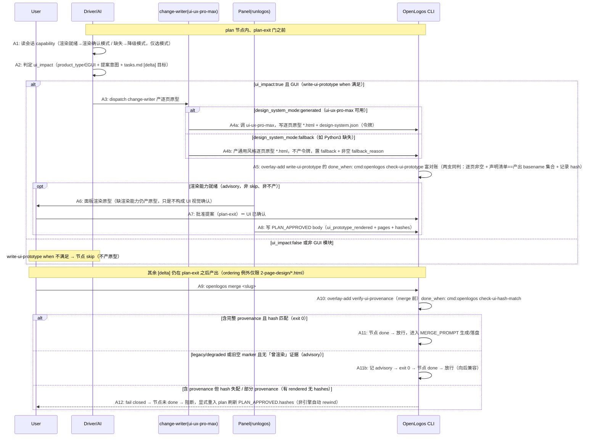
```mermaid
sequenceDiagram
    participant U as User
    participant D as Driver/AI
    participant CW as change-writer(ui-ux-pro-max)
    participant P as Panel(runlogos)
    participant C as OpenLogos CLI

    Note over D,C: plan 节点内、plan-exit 门之前
    D->>D: A1: 读会话 capability（渲染就绪→渲染确认模式 / 缺失→降级模式，仅选模式）
    D->>D: A2: 判定 ui_impact（product_type∈GUI + 提案意图 + tasks.md [delta] 目标）
    alt ui_impact:true 且 GUI（write-ui-prototype when 满足）
        D->>CW: A3: dispatch change-writer 产逐页原型
        alt design_system_mode:generated（ui-ux-pro-max 可用）
            CW->>C: A4a: 调 ui-ux-pro-max，写逐页原型 *.html + design-system.json（令牌）
        else design_system_mode:fallback（如 Python3 缺失）
            CW->>C: A4b: 产通用风格逐页原型 *.html，不产令牌，置 fallback + 非空 fallback_reason
        end
        C->>C: A5: overlay-add write-ui-prototype 的 done_when: cmd:openlogos check-ui-prototype 富对账（两支同判：逐页非空 + 声明清单==产出 basename 集合 + 记录 hash）
        opt 渲染能力就绪（advisory，非 skip、非不产）
            P->>U: A6: 面板渲染原型（缺渲染能力仍产原型，只是不构成 UI 视觉确认）
            U->>C: A7: 批准提案（plan-exit）＝ UI 已确认
            P->>C: A8: 写 PLAN_APPROVED body（ui_prototype_rendered + pages + hashes）
        end
    else ui_impact:false 或非 GUI 模块
        Note over D,U: write-ui-prototype when 不满足 → 节点 skip（不产原型）
    end
    Note over C,U: 其余 [delta] 仍在 plan-exit 之后产出（ordering 例外仅限 2-page-design/*.html）
    U->>C: A9: openlogos merge <slug>
    C->>C: A10: overlay-add verify-ui-provenance（merge 前）done_when: cmd:openlogos check-ui-hash-match
    alt 含完整 provenance 且 hash 匹配（exit 0）
        C->>C: A11: 节点 done → 放行，进入 MERGE_PROMPT 生成/落盘
    else legacy/degraded 或旧空 marker 且无「曾渲染」证据（advisory）
        C->>C: A11b: 记 advisory → exit 0 → 节点 done → 放行（向后兼容）
    else 含 provenance 但 hash 失配 / 部分 provenance（有 rendered 无 hashes）
        C-->>U: A12: fail closed → 节点未 done → 阻断，显式重入 plan 刷新 PLAN_APPROVED.hashes（非引擎自动 rewind）
    end
```

### 扩展步骤说明

- **A1 模式选择（plan-exit 之前）**：driver 读会话 capability（`logos/.session-capabilities.json` 的 `ui_prototype_render`）——就绪则进入**渲染确认模式**（要求 provenance + hash），缺失则进入**降级模式**（不 claim UI 确认、advisory 不阻断）。此为 capability 文件的**唯一**合法用途，只用于 plan-exit 之前选模式，绝不作为批准后的完整性门降级开关。
- **A2 判定 `ui_impact`**：在 plan 阶段由 change-writer 依据 **项目 `product_type` + 提案意图 + `tasks.md` 已规划的 `[delta]` 目标**判定，**而非扫描尚不存在的 delta 内容**（避免「先 delta 还是先原型」循环依赖）。`tasks.md` `[delta]` 命中 `2-page-design/` 或含交互变更的 feature-specs，即强制判为「动了界面」。`ui_impact` 为**可派生 when-flag**（派生方式仿 `delta_required`，从 `proposal.md` 的「UI/UX 变更声明」段推导，`ui_impact:true` 且 `product_type∈GUI` 才为真）。
- **A3–A4 producer dispatch（授权同「写 proposal.md / tasks.md」，无新授权；按 `design_system_mode` 拆两支）**：driver 在 plan 节点派发 change-writer 产出逐页原型，producer 责任 = **优先调用 `ui-ux-pro-max`；不可用（如 Python3 缺失）时按 fallback 契约兜底**——绝不因渲染 / 令牌能力缺失而永久卡死：
  - **A4a `generated`（ui-ux-pro-max 可用）**：调用 `ui-ux-pro-max` 产出逐页原型 + `design-system.json`（审计令牌），声明段置 `design_system_mode: generated`。
  - **A4b `fallback`（如 Python3 缺失）**：产出**通用风格**逐页原型、**不产令牌**，声明段置 `design_system_mode: fallback` + **非空** `design_system_fallback_reason`（如「Python3 缺失」）；**禁止伪造 `design-system.json`**。
  - **两支同做**：原型作为 page-design delta 直接写入 `deltas/prd/2-product-design/2-page-design/core-NN-<slug>.html`；写入由 guard 的 **plan 阶段 allowlist（仅放行 `2-page-design/*.html`）** 授权，其余 `deltas/**` 在 plan 阶段仍禁止写入。
- **正交三事（不得混淆）**：① `ui_impact:false` / 非 GUI 模块 → `write-ui-prototype` 的 `when` 不满足 → 节点 **skip（不产原型）**；② 渲染 capability 缺失 → **仍产原型**（generated 或 fallback），只是批准不构成 **UI 视觉确认**（advisory，非 skip、非不产）；③ Python3 缺失 → 走 **A4b fallback**（仍产通用原型，只是不产令牌）。**capability 缺失绝不并入 `ui_impact:false` 分支。**
- **A5 overlay-add `write-ui-prototype` 收敛（`done_when: cmd:<check-ui-prototype>`）**：该节点为方法论给 GUI 项目注入的 **overlay `op:add` 节点**（`after: write-tasks`、落在 plan subflow 内、plan-exit 门前），故**合法使用 `cmd:` 谓词**做富对账。`<check-ui-prototype>` 在 delta 文本中仅为占位示意，**运行时 overlay 资产使用真实子命令 `openlogos check-ui-prototype`**（自解析活跃提案，`exit 0` / 非 0）。收敛判据**按 `design_system_mode` 分档、两支共通**：UI/UX 变更声明段**声明的每一页**在 `2-page-design/` 下都有**对应非空原型文件**、**声明清单 basename 集合 == 产出文件 basename 集合**、并记录内容 hash；仅 `generated` 支**额外**要求存在合法非空 `design-system.json`，`fallback` 支**不要求令牌**但要求非空 `design_system_fallback_reason`。命令 `exit 0` 才 done、plan 子流程才完成、plan-exit 门才可放行。builtin `launched.yaml` **不硬编码** UI 节点。
- **A6–A7 批准即 UI 确认（前提=面板已渲染原型）**：「批准 == UI 已确认」**仅当面板实际渲染了原型时成立**。在不渲染的旧面板上，批准只是普通方案批准、**不构成 UI 视觉确认**（方法论给 advisory、不阻断）。**不新增门态、不新增确认标记**——复用现有 `plan-exit` 门。
- **A8 provenance 写入（既有批准事件上的溯源属性）**：渲染面板 / driver 在批准时向 `PLAN_APPROVED` marker 的**可选 JSON body** 写入 `{ ui_prototype_rendered: true, pages: [...], hashes: { "<file>": "<sha256>" } }`。由**用户批准动作本身授权**（同一次点击），无独立授权。`PLAN_APPROVED` 的**存在性语义完全不变**（空 marker 仍合法、仅存在性读取者不受影响），provenance 是向后兼容的可选叠加字段。
- **A9–A12 merge 前 `verify-ui-provenance`（`done_when: cmd:<check-ui-hash-match>`）**：overlay-add 节点，置于 merge 之前（`before: generate-merge-prompt`、`when: ui_impact`），在原型落盘 resources **之前**拦截漂移。`<check-ui-hash-match>` 在 delta 文本中仅为占位示意，**运行时 overlay 资产使用真实子命令 `openlogos check-ui-hash-match`**（自解析活跃提案，`exit 0` / 非 0）。命令按 `PLAN_APPROVED` 内容**三分支**判定（不再是两果，避免旧空 marker 的 GUI 提案永久卡死）：
  - **含完整 provenance（`ui_prototype_rendered:true` + `pages` + `hashes`）**：重算 `2-page-design/` 现值 hash 与 `PLAN_APPROVED.hashes` 比对——**匹配 `exit 0` → 节点 done → 放行前进**；**失配非 0 → 节点未 done → 前向阻断（fail closed）**。
  - **legacy/degraded 或旧空 marker 且无任何「曾渲染确认」证据**（GUI `ui_impact:true` 但批准发生在旧不渲染面板上）：**记 advisory 后 `exit 0` → 节点 done → 放行**（F3 向后兼容，不因缺 provenance 永久阻断）。
  - **部分 provenance（有 `ui_prototype_rendered:true` / rendered 证据但缺 `hashes`）**：**fail closed 非 0 → 节点未 done → 阻断**（曾走渲染确认路径却无完整 hash，不得降级放行）。
  - 因 flow 引擎前向线性、无跨 subflow 自动回退边，「退回 plan-exit」**非引擎自动 rewind**，而是 driver / 人工**显式重入 plan**（重跑 producer 产原型 + plan-exit 重批、刷新 `PLAN_APPROVED.hashes`），再到该节点 hash 匹配 `exit 0` → done → 放行。

### ordering 例外与 flow-derive 判据（补充）

- **ordering 例外仅限 `2-page-design/*.html`**：GUI page-design 原型是 plan 节点产物，可在 plan-exit **之前**产出；其余所有 `deltas/**` 仍严格在 plan-exit **之后**产出。
- **flow-derive 不因原型 delta 误判进入 spec**：`flow-derive.ts` 识别 plan subflow 新增的原型节点，仅当出现**非原型的规格 delta**、或 plan-exit 已放行时才视为进入 spec；例外仅限 `2-page-design/*.html` 叶子原型，不涉及 `[code]` 切片与 spec-merge 依赖。

### EX-9.3: 批准后漂移的原型被 verify-ui-provenance / merge 拒绝

- **触发条件**：`ui_impact:true` 的 GUI 提案已在渲染面板上批准（`PLAN_APPROVED` 含 `ui_prototype_rendered:true` + `pages` + `hashes`），随后 `2-page-design/` 下某原型文件内容被改动（批准后漂移），再执行 `openlogos merge <slug>`。
- **期望响应**：merge 前 `verify-ui-provenance` 的 `done_when: cmd:<check-ui-hash-match>` 重算现值 hash 与 `PLAN_APPROVED.hashes` 比对，**失配非 0** → 节点未 done → **前向阻断**；`openlogos merge` 命令级 pre-merge hash gate 亦**拒绝 merge（非零退出、明确错误、不生成 `MERGE_PROMPT`）**。无论经 driver 流还是直接 CLI 调用都不可绕过。remediation = 显式重入 plan 重跑 producer + plan-exit 重批、刷新 `PLAN_APPROVED.hashes`。
- **副作用**：不新增门态 / 不新增确认标记（复用 `plan-exit` 门的「批准内容变更即批准失效」完整性语义）；不改变 `ui_impact:false` 或纯 CLI/API/Skills 提案的既有派生与 merge 行为。

### EX-9.4: 跨会话降级绕过被持久化 provenance 拦截

- **触发条件**：渲染就绪会话写了带 `hashes` 的 `PLAN_APPROVED` → 原型被改动 → 删除 `logos/.session-capabilities.json` 并重启进程（新 CLI-only 会话，capability 文件缺失）→ 直接 `openlogos merge <slug>`。
- **期望响应**：严格性以**持久化 `PLAN_APPROVED` provenance 为键**，而非消费时易失会话 capability。批准记录含 UI provenance ⇒ merge / 落盘 / 落盘后复核入口**永久 fail closed**：**必须拒绝**，不得生成 `MERGE_PROMPT` / 写 resources / 写 `SPEC_MERGED`；当前会话 capability 文件缺失一律不得降级。对照组「旧空 marker、无任何『曾渲染确认』证据的纯 CLI 项目」仍走 F3 向后兼容 advisory 放行。
- **副作用**：`.session-capabilities.json` 仅用于 plan-exit **之前**的模式选择；plan-exit **之后**的强制语义一律以 `PLAN_APPROVED` 为准。三处判据（提示前 / 落盘时 / 落盘后）一致，避免复用同一「capability 缺失即降级」分支而一致放行。

### EX-9.5: 旧面板空批准 marker 的 GUI 提案经 verify-ui-provenance advisory 放行

- **触发条件**：GUI 产品项目、本次 `ui_impact:true`，但批准发生在**旧不渲染面板**上——`PLAN_APPROVED` 为**空 marker**（存在即门已过，但无 `ui_prototype_rendered` / `pages` / `hashes` 任何 provenance body、无任何「曾渲染确认」证据）。随后 `openlogos merge <slug>`。
- **期望响应**：merge 前 `verify-ui-provenance`（`openlogos check-ui-hash-match`）落入**第三分支（legacy/degraded 且无「曾渲染」证据）**——**记 advisory 后 `exit 0` → 节点 done → merge 可达**，不因缺 provenance 永久卡死（F3 向后兼容，方法论仅提示「本次批准未构成 UI 视觉确认」而不阻断）。
- **对照组（fail closed，不放行）**：批准记录**含 rendered 证据但缺 `hashes`（部分 provenance）** → 曾走渲染确认路径却无完整 hash → **非零退出 → 节点未 done → 阻断**，不得降级放行；须显式重入 plan 刷新 `PLAN_APPROVED.hashes` 后方可前进。
- **副作用**：不新增门态 / 不新增确认标记；三分支判据（含完整 provenance 校 hash / legacy 空 marker advisory / 部分 provenance fail closed）与 2.26.9 的持久化键语义一致；不改变 `ui_impact:false` 或纯 CLI/API/Skills 提案的既有行为。

### EX-9.6: 多模块无 core 未传 --module 的 change 静默挂靠 modules[0]（issue #17）

- **触发条件**：多模块项目、`modules[]` 无 `id: core`，用户执行 `openlogos change <slug>` 未传 `--module`。
- **旧缺陷**：`resolveModule()` 回退 `modules[0]`（`change.ts:30-32`），并以 `change.moduleDefault` 文案声称「默认挂靠 core」，实际挂到首模块；错误 `module` 写入 `.openlogos-guard` 与 `proposal.md` 头 `> module:`，到 `change-lint` / `status` / `next` / 模块级门禁才暴露。
- **期望响应**：`resolveModule()` 对该分支 **fail-closed**——打印错误（原因 + **每个合法 module id 各一条完整可执行的重试命令**：以实际 slug + 该 id 组成 `openlogos change <实际slug> --module <该id>`，按 `modules[]` 顺序、**不含字面 `<id>` 占位符**）、`en`/`zh` 两套文案、**非零退出**，**不回退 `modules[0]`**。
- **原子性**：解析在**创建 change 目录 / 写 proposal / tasks / deltas / guard 之前**执行（与既有「提案已存在」「guard 冲突」前置校验同位置），失败不残留任何半成品。
- **不变量**：解析结果（`.openlogos-guard.module` 与 `proposal.md` `> module:`）与用户显式选择或唯一确定的模块一致；YAML `modules[]` 顺序不承载归属语义。
- **零回归**：显式 `--module` / 单模块自动挂靠 / 多模块含 core 默认挂靠三条路径行为不变；`change.moduleDefault` 文案修正后，`归属模块：{module}` 与括号说明指同一模块。
- **决策依据**：见 `logos/resources/decisions/core-D01-change-module-fail-closed.md`（fail-closed 不变量、否决 modules[0]、暂不引入 default_module）。

## Windows 外部归档 watcher 握手时序（win32-archive-watcher-handshake）

仅当 `process.platform === 'win32'` 且用户从外部终端执行 `openlogos archive <slug>` 时，Step 13→14 之间插入以下有界握手；非 Windows 平台此段完全不执行，直接走既有 rename 归档。

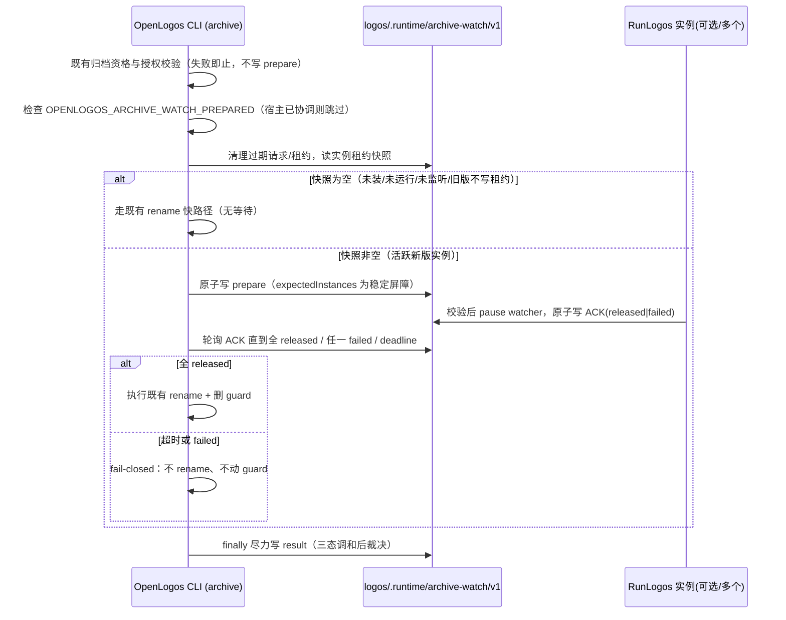
```mermaid
sequenceDiagram
    participant CLI as OpenLogos CLI (archive)
    participant RT as logos/.runtime/archive-watch/v1
    participant RL as RunLogos 实例(可选/多个)
    CLI->>CLI: 既有归档资格与授权校验（失败即止，不写 prepare）
    CLI->>CLI: 检查 OPENLOGOS_ARCHIVE_WATCH_PREPARED（宿主已协调则跳过）
    CLI->>RT: 清理过期请求/租约，读实例租约快照
    alt 快照为空（未装/未运行/未监听/旧版不写租约）
        CLI->>CLI: 走既有 rename 快路径（无等待）
    else 快照非空（活跃新版实例）
        CLI->>RT: 原子写 prepare（expectedInstances 为稳定屏障）
        RL->>RT: 校验后 pause watcher，原子写 ACK(released|failed)
        CLI->>RT: 轮询 ACK 直到全 released / 任一 failed / deadline
        alt 全 released
            CLI->>CLI: 执行既有 rename + 删 guard
        else 超时或 failed
            CLI->>CLI: fail-closed：不 rename、不动 guard
        end
    end
    CLI->>RT: finally 尽力写 result（三态调和后裁决）
```

### EX-10.1: Windows 外部归档无活跃监听走快路径
- **触发条件**：Windows 平台，runtime 目录不存在或快照无「未过期+projectId 匹配+capabilities 含 prepare」的活跃实例（未装/未运行/未监听/旧版不写租约）。
- **期望响应**：不写 prepare、不等待，直接 rename 归档；runtime 缺失视为空快照的正常路径，不作为错误。

### EX-10.2: Windows 归档握手成功后才 rename
- **触发条件**：Windows 平台，快照存在一或多个活跃实例，全部在 deadline 前 ACK released。
- **期望响应**：released 前 rename 次数=0；全 released 后才 rename 与删 guard；随后写 archived result。多实例须全部 released 才放行。

### EX-10.3: Windows 归档握手超时或实例失败 fail-closed
- **触发条件**：Windows 平台，已写 prepare，但 deadline 前未收齐 released 或任一 ACK failed。
- **期望响应**：不 rename、不删 guard、不改状态；返回 `ARCHIVE_WATCH_ACK_TIMEOUT`/`ARCHIVE_WATCH_INSTANCE_FAILED` 与脱敏诊断；尽力写 cancelled/not-archived result。

### EX-10.4: Windows 归档遇不可协调监听者
- **触发条件**：Windows 平台，(a) 旧版 RunLogos 持句柄但不写租约，走快路径时 rename 抛 EPERM/EACCES/EBUSY；或 (b) 租约可见但 capabilities 不含 prepare、或协议主版本高于本 CLI 认知。
- **期望响应**：均 fail-closed（不 rename、不动 guard、不自动重试）：(a) 提示「可能有旧版 RunLogos 或其他程序正在监听，请升级或关闭后重试」；(b) 提示「检测到能力不足或更高版本的 RunLogos，请升级 openlogos CLI 或关闭该实例」。

### EX-10.5: 宿主已协调时去递归跳过握手
- **触发条件**：Windows 平台，RunLogos spawn CLI 时注入 `OPENLOGOS_ARCHIVE_WATCH_PREPARED=<token>`。
- **期望响应**：仅当 token 结构有效、cwd/projectId 与绑定项目一致、slug 一致、未过期时跳过握手直接 rename；任一不满足则不跳过；无长期全局逃生开关。

### EX-10.6: CLI 崩溃 result 缺失的三态调和
- **触发条件**：Windows 平台，CLI 在 rename 前后崩溃致 result 缺失，或命令报错但磁盘已完成 rename。
- **期望响应**：CLI 重跑与 RunLogos 均以 live/archive/guard 三态裁决——live 仍在则可恢复，已归档则调和为成功并标记 `reconciledFromDisk`，矛盾则 fail-closed 保留诊断；不凭 exitCode/status 反转磁盘真相。

### EX-10.7: 非 Windows 平台不启用握手协议
- **触发条件**：平台为 macOS 或 Linux。
- **期望响应**：archive 不创建/读取/监听协议文件、不校验 token、不增加等待，逐字节沿用原 archive 路径；无论 CLI/RunLogos 版本新旧。

## S09 ZCode SessionStart 与 PreToolUse 收敛时序

### 场景目标

ZCode 新会话通过插件级 `SessionStart` 获得与当前 `proposal_step` 一致的 OpenLogos 上下文，并由 `PreToolUse` 在工具真正执行前复用同一决策服务约束写入范围；协议解析、运行时或路径判定异常均 fail-closed。

### 参与者

- **用户**：启动 ZCode 会话并发起文件操作。
- **ZCode Host**：发现插件 Hooks、传递事件 JSON 并消费 Hook 输出。
- **ZCode Hook Adapter**：归一化 ZCode/Claude 兼容字段与退出语义。
- **OpenLogos Hook Runtime**：读取 guard、提案事实与 `proposal_step`。
- **Guard Decision Service**：对规范化工具调用作 allow/deny 决策。

### 前置条件

- ZCode 已启用 OpenLogos 插件，`hooks/hooks.json` 指向随包 Node.js runtime。
- 项目存在 OpenLogos 配置；若存在 guard，则能唯一解析活跃提案。
- 本场景只信任磁盘事实，不信任上一个会话缓存的 lifecycle 或 `proposal_step`。

### 成功后置条件

- `SessionStart` 输出当前阶段、允许范围和下一人类确认点。
- 每次写工具调用均在执行前得到显式 allow 或 deny；deny 含原因并以阻断语义返回。
- ZCode 与既有宿主共享同一 guard 决策，不形成宿主特例绕过。

### 时序图

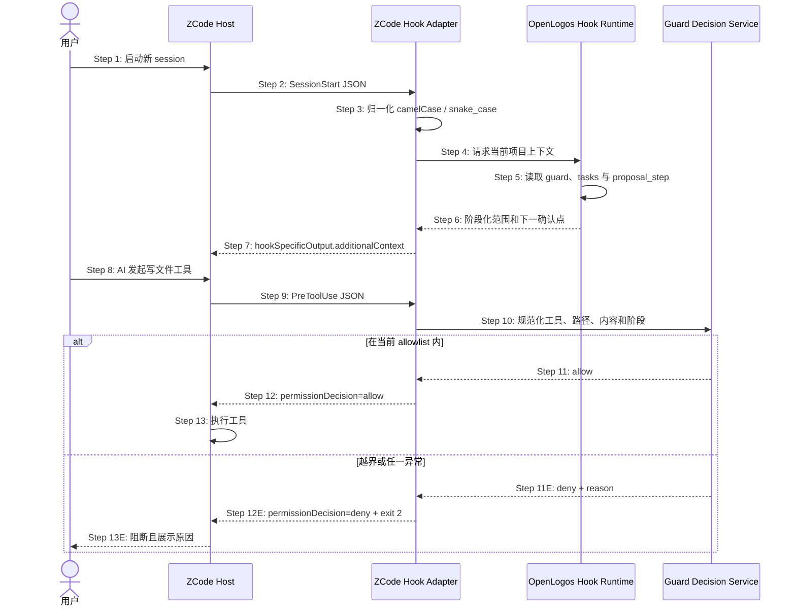
```mermaid
sequenceDiagram
    actor U as 用户
    participant Z as ZCode Host
    participant A as ZCode Hook Adapter
    participant R as OpenLogos Hook Runtime
    participant G as Guard Decision Service

    U->>Z: Step 1: 启动新 session
    Z->>A: Step 2: SessionStart JSON
    A->>A: Step 3: 归一化 camelCase / snake_case
    A->>R: Step 4: 请求当前项目上下文
    R->>R: Step 5: 读取 guard、tasks 与 proposal_step
    R-->>A: Step 6: 阶段化范围和下一确认点
    A-->>Z: Step 7: hookSpecificOutput.additionalContext
    U->>Z: Step 8: AI 发起写文件工具
    Z->>A: Step 9: PreToolUse JSON
    A->>G: Step 10: 规范化工具、路径、内容和阶段
    alt 在当前 allowlist 内
        G-->>A: Step 11: allow
        A-->>Z: Step 12: permissionDecision=allow
        Z->>Z: Step 13: 执行工具
    else 越界或任一异常
        G-->>A: Step 11E: deny + reason
        A-->>Z: Step 12E: permissionDecision=deny + exit 2
        Z-->>U: Step 13E: 阻断且展示原因
    end
```

### 步骤说明

1. 每个新 session 都重新装载插件 Hook 配置；配置变更不得声称热更新到既有 session。
2. Adapter 从标准输入只读取一条 JSON 事件。
3. `sessionId/session_id`、`hookEventName/hook_event_name` 等别名先归一化；同义字段冲突视为不可信输入。
4. Runtime 定位项目根，不接受事件提供的路径直接扩张信任边界。
5. Runtime 从磁盘重新推导当前状态：`delta-writing` 仅允许本提案 `deltas/**` 与对应 `tasks.md`，`ready-to-merge` 停止写 delta，`coding` 才允许既定源码和测试切片。
6. SessionStart 上下文必须明确当前 slug、阶段、可写范围、禁止动作及人类确认点。
7. Adapter 通过 ZCode `hookSpecificOutput` 注入上下文，不向标准输出混入日志。
8. 模型提出写、改名、删除或可间接写盘的工具调用。
9. PreToolUse 在工具执行前收到完整输入。
10. Adapter 将工具名、绝对规范路径、symlink 解析结果与内容意图交给共享决策服务。
11. 服务只按当前磁盘事实和阶段 allowlist 决策。
12. allow 显式返回；deny 同时返回 `permissionDecision: "deny"`、可读 reason，并采用 exit 2 阻断快捷语义。
13. ZCode 仅在 allow 后执行工具。

### 异常与边界

#### EX-ZC-1：兼容字段互相冲突

- **触发条件**：camelCase 与 snake_case 同义字段同时存在但值不同。
- **期望响应**：拒绝事件并返回可诊断原因。
- **副作用**：不得任选其一继续执行。

#### EX-ZC-2：路径或符号链接逃逸

- **触发条件**：表面路径在 allowlist 内，但规范化后落到提案外、源码或工作区外。
- **期望响应**：PreToolUse deny 并以 exit 2 阻断。
- **副作用**：目标文件不得发生变化。

#### EX-ZC-3：协议或运行时失败

- **触发条件**：JSON 损坏、未知写工具、项目根解析失败、guard 状态矛盾或决策服务抛错。
- **期望响应**：显式 deny；错误详情写 stderr，stdout 保持合法 Hook 响应。
- **副作用**：非零但非阻断的可恢复退出不得被用作安全失败路径。

#### EX-ZC-4：会话内阶段变化

- **触发条件**：会话启动后 `proposal_step` 从 delta-writing 变为 ready-to-merge。
- **期望响应**：每次 PreToolUse 重新读取状态并立即收紧；SessionStart 文案只作为上下文，不是授权缓存。
- **副作用**：建议新建 session 获取最新指导，但旧 session 也不得绕过新门禁。

### 追溯

- 需求：S09 guard 验收、ZCode Hook 协议与 fail-closed 要求。
- 架构：28.4 共享 Hook runtime、28.6 状态读取与缓存边界。
- 测试：UT-S09-188～UT-S09-197、ST-S09-73～ST-S09-76。

## S09 Qoder SessionStart 与 PreToolUse hard guard 时序

### 场景目标

Qoder CLI 新会话通过 SessionStart 获得当前 OpenLogos 阶段上下文；每次 PreToolUse 在工具执行前重新读取磁盘状态并复用共享 guard 决策。协议、路径、状态或运行时异常一律 fail-closed。

### 参与者

- **用户**：启动 Qoder CLI session 并发起工具操作。
- **Qoder CLI**：发现插件 Hook、发送事件并消费输出/退出码。
- **Qoder Hook Adapter**：校验 snake_case 输入与映射宿主协议。
- **SessionContextService**：派生阶段上下文。
- **GuardDecisionService**：对规范化工具调用 allow/deny。

### 前置条件

- OpenLogos Qoder 插件已启用，`hooks/hooks.json` 指向随包 runtime。
- 项目配置可定位；若有 guard，可唯一解析 active change。
- 权限只信任当前磁盘事实，不信任会话启动缓存。

### 成功后置条件

- SessionStart 上下文包含 module、slug、`proposal_step`、允许范围和下一确认点。
- 每次写入在执行前得到显式 allow/deny；deny 带非空原因并以 exit 2 阻断。
- Qoder 与既有宿主得到同一共享 guard 结论。

### 时序图

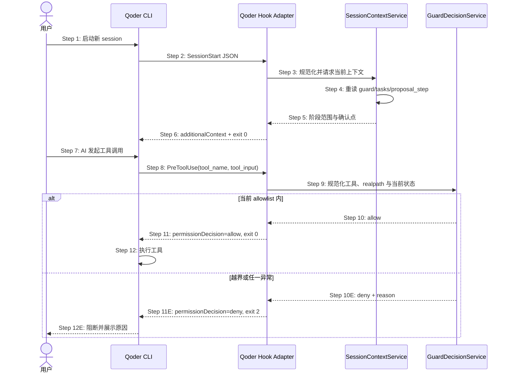
```mermaid
sequenceDiagram
    actor U as 用户
    participant Q as Qoder CLI
    participant A as Qoder Hook Adapter
    participant S as SessionContextService
    participant G as GuardDecisionService
    U->>Q: Step 1: 启动新 session
    Q->>A: Step 2: SessionStart JSON
    A->>S: Step 3: 规范化并请求当前上下文
    S->>S: Step 4: 重读 guard/tasks/proposal_step
    S-->>A: Step 5: 阶段范围与确认点
    A-->>Q: Step 6: additionalContext + exit 0
    U->>Q: Step 7: AI 发起工具调用
    Q->>A: Step 8: PreToolUse(tool_name, tool_input)
    A->>G: Step 9: 规范化工具、realpath 与当前状态
    alt 当前 allowlist 内
        G-->>A: Step 10: allow
        A-->>Q: Step 11: permissionDecision=allow, exit 0
        Q->>Q: Step 12: 执行工具
    else 越界或任一异常
        G-->>A: Step 10E: deny + reason
        A-->>Q: Step 11E: permissionDecision=deny, exit 2
        Q-->>U: Step 12E: 阻断并展示原因
    end
```

### 步骤说明

1. 新 session 装载当前插件/Hook 快照；刷新后不宣称旧 session 热更新。
2. Hook 从 stdin 限长读取单个 JSON 对象。
3. Adapter 校验 `session_id`、`cwd`、`hook_event_name` 和 `source`，再调用共享上下文服务。
4. 服务从磁盘派生 lifecycle、active slug、tasks 与 `proposal_step`。
5. 上下文明确允许/禁止范围与 merge/verify 等人类确认点。
6. Adapter 输出 `hookSpecificOutput.hookEventName="SessionStart"` 与 `additionalContext`；stdout 无日志。
7. 模型提出读、写、改名、删除或间接写盘操作。
8. PreToolUse 提供 `tool_name` 与 `tool_input`；matcher 不替代共享决策。
9. Adapter 规范化路径、symlink、命令意图并把最新磁盘状态交给 guard 服务。
10. 服务按当前 proposal-step allowlist 决策；SessionStart 不作为授权缓存。
11. allow/deny 显式映射；deny 同时输出 reason 与 exit 2。
12. Qoder 仅在 allow 后执行工具。

### 异常与边界

#### EX-QD-S09-1：损坏或缺字段事件
- **触发条件**：空输入、非法 JSON、类型错误或缺失 tool_name/tool_input。
- **期望响应**：输出合法 deny、非空原因并 exit 2；详情写 stderr。
- **副作用**：工具不执行。

#### EX-QD-S09-2：路径逃逸
- **触发条件**：`..`、绝对路径或 symlink 解析后落到 allowlist 外。
- **期望响应**：deny + exit 2。
- **副作用**：所有候选目标哈希不变。

#### EX-QD-S09-3：一般非零不是安全阻断
- **触发条件**：runtime 抛错或误用 exit 1。
- **期望响应**：包装器捕获并转换为协议 deny + exit 2；测试拒绝把 exit 1 计为通过。
- **副作用**：不能因 Qoder 将一般错误视为非阻断而绕过 guard。

#### EX-QD-S09-4：同会话阶段变化
- **触发条件**：tasks 从 delta-writing 收敛到 ready-to-merge。
- **期望响应**：下一次 PreToolUse 立即重读并拒绝后续 delta 写入。
- **副作用**：旧 SessionStart 文案不扩大权限。

### 追溯

- 需求：S09 Qoder Hook 与 hard guard 验收。
- 架构：29.4 事件归一化与映射、29.5 状态读取与路径安全。
- 测试：UT-S09-198～UT-S09-207、ST-S09-77～ST-S09-80。

## S09 WorkBuddy SessionStart 与 PreToolUse 硬门禁时序

### 场景目标

新 WorkBuddy session 获得磁盘派生的阶段上下文；每次潜在写操作由 PreToolUse 重新读取状态并执行与既有宿主一致的 hard guard。

### 主时序

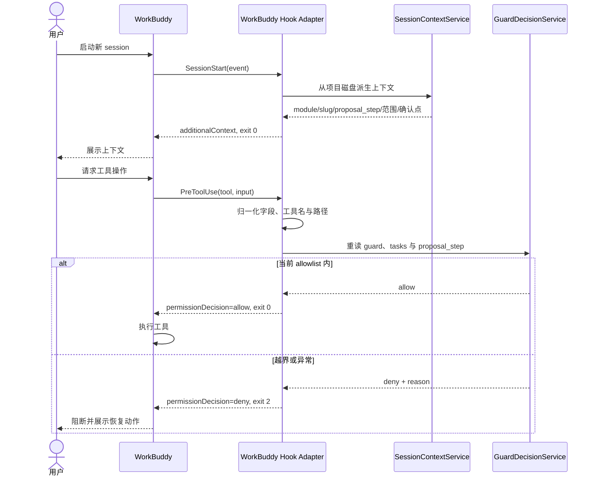
```mermaid
sequenceDiagram
    actor U as 用户
    participant W as WorkBuddy
    participant A as WorkBuddy Hook Adapter
    participant S as SessionContextService
    participant G as GuardDecisionService
    U->>W: 启动新 session
    W->>A: SessionStart(event)
    A->>S: 从项目磁盘派生上下文
    S-->>A: module/slug/proposal_step/范围/确认点
    A-->>W: additionalContext, exit 0
    W-->>U: 展示上下文
    U->>W: 请求工具操作
    W->>A: PreToolUse(tool, input)
    A->>A: 归一化字段、工具名与路径
    A->>G: 重读 guard、tasks 与 proposal_step
    alt 当前 allowlist 内
        G-->>A: allow
        A-->>W: permissionDecision=allow, exit 0
        W->>W: 执行工具
    else 越界或异常
        G-->>A: deny + reason
        A-->>W: permissionDecision=deny, exit 2
        W-->>U: 阻断并展示恢复动作
    end
```

### 归一化合同

1. CLI 工具 `Write`、`Edit`、`Bash` 与桌面工具 `write_to_file`、`replace_in_file`、`execute_command` 映射为共享动作；snake_case/camelCase 字段归一化后再判定。
2. Hook 从 stdin 限长读取单个 JSON，stdout 只输出协议 JSON，诊断写 stderr。
3. SessionStart 不读取 WorkBuddy 原生记忆，不作为授权缓存；旧会话提示不能扩大下一次 PreToolUse 权限。
4. PreToolUse 每次重新解析 realpath/symlink、active slug、`proposal_step` 和 allowlist。
5. allow 为 `permissionDecision="allow"` + exit 0；deny 为 `permissionDecision="deny"` + 非空 reason + exit 2。

### 异常

- `EX-WB-S09-1`：空输入、非法 JSON、缺字段或类型错误转换为协议 deny + exit 2。
- `EX-WB-S09-2`：`..`、绝对路径或 symlink 落到 allowlist 外时 deny，目标哈希不变。
- `EX-WB-S09-3`：未知潜在写工具和 runtime/状态异常 fail-closed；exit 1 不计作安全阻断。
- `EX-WB-S09-4`：同会话从 delta-writing 进入 ready-to-merge 后，下一次调用立即收紧。

### 追溯

- 需求：S09 WorkBuddy Hook 与 hard guard 验收。
- 架构：30.3 Hook 流水线、30.6 失败模型。
- 测试：UT-S09-208～UT-S09-218、ST-S09-81～ST-S09-84。

## TRAE hard guard 不成立的生命周期负向时序

### 目标

S09 不为 TRAE 注册 SessionStart/PreToolUse normalizer，不把 Rules、Skills、Agent prompt、MCP、人工确认、工作区信任或原生记忆作为 OpenLogos 授权状态。当前双客户端真实基础 deny 已失败，故生命周期中不存在 TRAE hard guard 调用链。

### Registry 排除时序

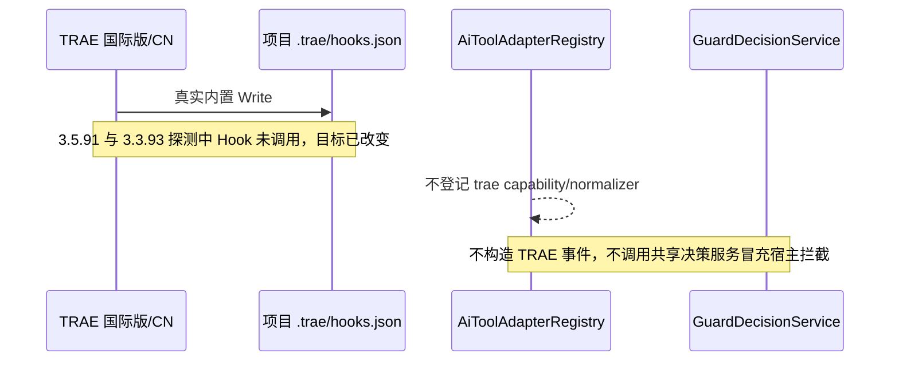
```mermaid
sequenceDiagram
    participant T as TRAE 国际版/CN
    participant H as 项目 .trae/hooks.json
    participant R as AiToolAdapterRegistry
    participant G as GuardDecisionService
    T->>H: 真实内置 Write
    Note over T,H: 3.5.91 与 3.3.93 探测中 Hook 未调用，目标已改变
    R-->>R: 不登记 trae capability/normalizer
    Note over R,G: 不构造 TRAE 事件，不调用共享决策服务冒充宿主拦截
```

### 生命周期状态变化

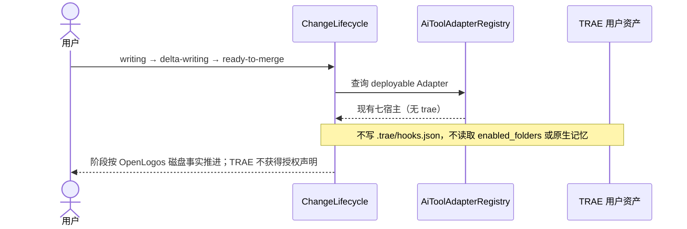
```mermaid
sequenceDiagram
    actor U as 用户
    participant L as ChangeLifecycle
    participant R as AiToolAdapterRegistry
    participant F as TRAE 用户资产
    U->>L: writing → delta-writing → ready-to-merge
    L->>R: 查询 deployable Adapter
    R-->>L: 现有七宿主（无 trae）
    Note over L,F: 不写 .trae/hooks.json，不读取 enabled_folders 或原生记忆
    L-->>U: 阶段按 OpenLogos 磁盘事实推进；TRAE 不获得授权声明
```

### 不变量与重新开启门

- wrapper 直调返回 deny、Hooks UI 存在或项目配置文件可解析，均不得产生 TRAE capability PASS。
- 已支持宿主仍按既有合同每次重读 guard、slug、tasks 与 `proposal_step`；deny 必须有非空 reason、正确退出语义且目标哈希不变。
- 未来独立提案只有在国际版与 CN 的真实内置工具共同通过 allow/deny、路径边界、symlink、未知工具及全部异常 fail-closed 矩阵后，才能新增 TRAE normalizer 与正向时序。

### 主时序

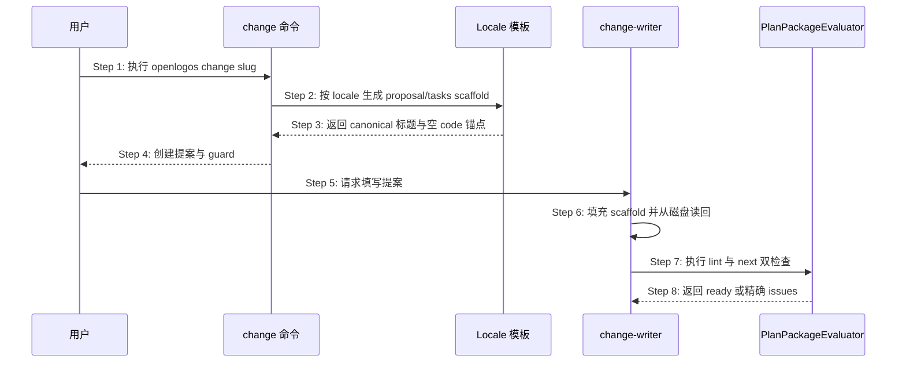
```mermaid
sequenceDiagram
    participant U as 用户
    participant C as change 命令
    participant T as Locale 模板
    participant W as change-writer
    participant E as PlanPackageEvaluator

    U->>C: Step 1: 执行 openlogos change slug
    C->>T: Step 2: 按 locale 生成 proposal/tasks scaffold
    T-->>C: Step 3: 返回 canonical 标题与空 code 锚点
    C-->>U: Step 4: 创建提案与 guard
    U->>W: Step 5: 请求填写提案
    W->>W: Step 6: 填充 scaffold 并从磁盘读回
    W->>E: Step 7: 执行 lint 与 next 双检查
    E-->>W: Step 8: 返回 ready 或精确 issues
```

### 步骤说明

1. **用户**创建新的 launched change。
2. **change 命令**读取 locale section registry，而非手写另一份标题集合。
3. **Locale 模板**生成完整 proposal scaffold；需要代码的 tasks 只含空 `[code]` 标题。
4. **change 命令**原子创建目录与 guard。
5. **用户**授权 change-writer 填写。
6. **change-writer**保留 scaffold 结构、替换占位并读回实际文件。
7. **change-writer**运行 change-lint 与 next。
8. **evaluator**只有在四方合同可收敛时返回 ready。

### 异常与边界

#### EX-3.1：模板继续生成代码占位 checkbox
- **触发条件**：launched tasks 含精确模板行 `实现代码变更`。
- **期望响应**：模板合同测试失败；L0 同时返回模板残留问题。
- **副作用**：候选制品不得生成。

#### EX-6.1：Agent 改写 canonical summary
- **触发条件**：保留详细设计但删除/改名 canonical summary。
- **期望响应**：返回 `proposal_required_section_missing` 与 locale 期望标题。
- **副作用**：不得进入 plan gate。

### 追溯

- 需求：S09 scaffold 与 plan gate 验收。
- 测试：UT-S09-224～UT-S09-230、ST-S09-88～ST-S09-89。

## S09 GUI overlay extends 版本取值与存量有条件迁移

### 场景目标

GUI 项目在 `init` / `sync` 时会把方法论 overlay 唯一源的两个 `op:add` 并入项目实例 `logos/flow/launched.yaml`。此前写入端把 `extends` 的内容版本硬编码为字面量，与 loader 维护的版本映射失同步，导致 CLI 刚写完文件、下一条命令就对该文件报版本不匹配告警。本节定死写入端取值来源，并规定存量 overlay 的有条件迁移判据。

### 参与者与前置条件

| 别名 | 组件 | 说明 |
|------|------|------|
| C | OpenLogos CLI | `init` / `sync` 主流程 |
| INJ | GUI overlay 注入器 | 读唯一源、按 node id 去重并入项目实例 |
| VER | flow loader 版本映射 | 内置模板内容版本的唯一权威 |
| OVL | `logos/flow/launched.yaml` | 项目实例 overlay 文件 |

前置：项目含 ≥1 GUI 模块（`product_type` ∈ {`web`,`desktop`,`mobile`}）。缺字段按非 GUI 处理，不注入。

### 主时序

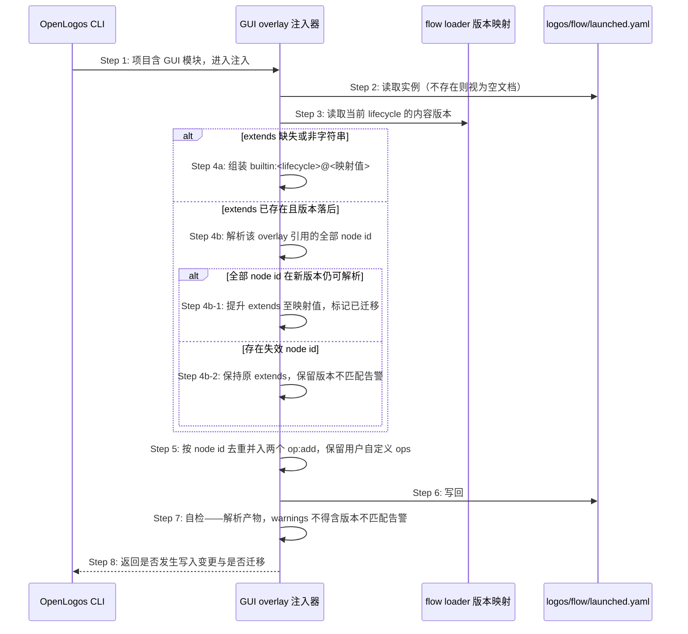
```mermaid
sequenceDiagram
    participant C as OpenLogos CLI
    participant INJ as GUI overlay 注入器
    participant VER as flow loader 版本映射
    participant OVL as logos/flow/launched.yaml

    C->>INJ: Step 1: 项目含 GUI 模块，进入注入
    INJ->>OVL: Step 2: 读取实例（不存在则视为空文档）
    INJ->>VER: Step 3: 读取当前 lifecycle 的内容版本
    alt extends 缺失或非字符串
        INJ->>INJ: Step 4a: 组装 builtin:<lifecycle>@<映射值>
    else extends 已存在且版本落后
        INJ->>INJ: Step 4b: 解析该 overlay 引用的全部 node id
        alt 全部 node id 在新版本仍可解析
            INJ->>INJ: Step 4b-1: 提升 extends 至映射值，标记已迁移
        else 存在失效 node id
            INJ->>INJ: Step 4b-2: 保持原 extends，保留版本不匹配告警
        end
    end
    INJ->>INJ: Step 5: 按 node id 去重并入两个 op:add，保留用户自定义 ops
    INJ->>OVL: Step 6: 写回
    INJ->>INJ: Step 7: 自检——解析产物，warnings 不得含版本不匹配告警
    INJ-->>C: Step 8: 返回是否发生写入变更与是否迁移
```

### 步骤说明

1. **注入器**仅在项目含 ≥1 GUI 模块时进入；`product_type` 唯一源是 `logos-project.yaml` 的 `modules[].product_type`，缺字段按非 GUI 安全默认。
2. **注入器**读取 `logos/flow/launched.yaml` 实例；文件不存在时按空文档处理。
3. **注入器**从 loader 版本映射读取当前 lifecycle 的内容版本。写入端不得持有任何字面量版本号。
4. `extends` 缺失或非字符串时按映射值组装；已存在且版本落后时进入迁移判据（见下节）。
5. **注入器**按 node id 去重并入 overlay 唯一源的两个 `op:add`，用户自定义的 overlay 操作原样保留。反向场景（唯一 GUI 模块改为非 GUI）按既有语义移除这两个 node id，同样不触碰用户自定义操作。
6. 写回后**注入器**对产物自检：解析结果的 `warnings` 不得包含版本不匹配告警。自检不通过即视为不变量被破坏。

### 迁移规则

存量 overlay 的 `extends` 版本落后于映射值时按引用可解析性分流：

| 条件 | 处理 | 输出 |
|---|---|---|
| 该 overlay 引用的**全部** node id 在新版本内置模板中仍可解析 | 提升 `extends` 至当前映射值 | 提示已迁移 |
| 存在任一失效 node id | 保持原 `extends` 不变 | 继续产生版本不匹配告警，指向需人工复核的对象 |

该判据等价于告警文案本身所问的问题，因此迁移之后残留的告警一律是真告警。迁移幂等：对已是当前版本的 overlay 为 no-op，重复同步不产生额外写入。

### 不变量

- 写入端产物中不得出现字面量内置版本号；写入端与告警判定端读同一映射。
- 非 GUI 项目与缺 `product_type` 的项目零注入、零迁移、流程零改动。
- overlay 四操作语义、版本告警判定条件与公共 JSON 字段结构零变化。
- 迁移只改 `extends` 一个字段，不重排、不删改任何 overlay 操作。

### 异常与边界

| 编号 | 触发条件 | 处理 |
|---|---|---|
| EX-S09-OVL-1 | 实例 overlay 文件不可解析 | 不迁移、不写回，报错并保留原字节 |
| EX-S09-OVL-2 | 落后版本且存在失效 node id | 保持原 `extends`，保留告警，不阻断当前命令 |
| EX-S09-OVL-3 | 写回后自检出现版本不匹配告警 | 视为不变量被破坏，报错；不得通过放宽判定条件消音 |

### 追溯

- 需求：AC-YAMLW-06～07。
- 功能规格：§2.47.4、§2.47.5。
- 架构：§三十八.2、§三十八.4。
- 测试：UT-S09-275～UT-S09-278、ST-S09-108；安装态 SMOKE-core-169。

## S09 merge 准入判定与 change-lint 同源

### 场景目标

让 `openlogos merge` 对「这个提案能不能进主规格」的判定，等于 `change-lint` 的完整结论；并让拒绝时的诊断足以定位到具体文件与字段。

### 参与者与前置条件

| 别名 | 组件 | 说明 |
|---|---|---|
| U | 用户 / AI | 发起 merge |
| M | `openlogos merge` | 准入点 |
| L | `change-lint` evaluator | 合规性的唯一判定 |
| A | `merge-apply` 路径 | 另一条准入点，判据须与 M 同源 |

前置：活跃 guard 指向该提案；提案目录可读。**不要求**提案带 `baseline_closure` 声明——此前正是该条件使一批提案完全绕过预检。

### 主时序

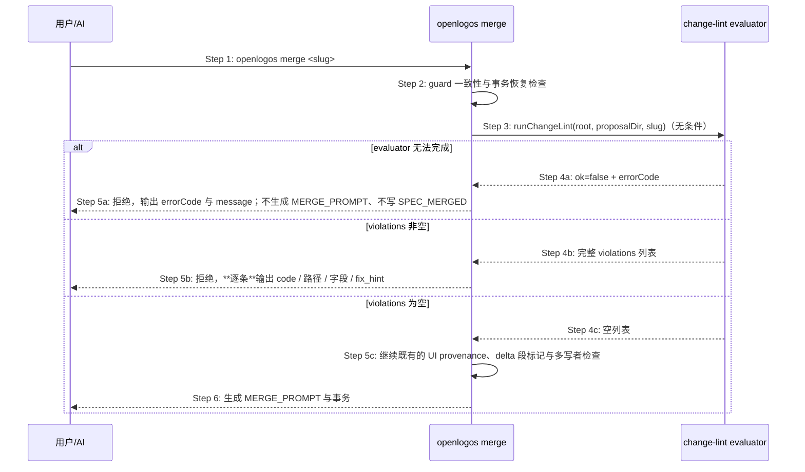
```mermaid
sequenceDiagram
    participant U as 用户/AI
    participant M as openlogos merge
    participant L as change-lint evaluator

    U->>M: Step 1: openlogos merge <slug>
    M->>M: Step 2: guard 一致性与事务恢复检查
    M->>L: Step 3: runChangeLint(root, proposalDir, slug)（无条件）
    alt evaluator 无法完成
        L-->>M: Step 4a: ok=false + errorCode
        M-->>U: Step 5a: 拒绝，输出 errorCode 与 message；不生成 MERGE_PROMPT、不写 SPEC_MERGED
    else violations 非空
        L-->>M: Step 4b: 完整 violations 列表
        M-->>U: Step 5b: 拒绝，**逐条**输出 code / 路径 / 字段 / fix_hint
    else violations 为空
        L-->>M: Step 4c: 空列表
        M->>M: Step 5c: 继续既有的 UI provenance、delta 段标记与多写者检查
        M-->>U: Step 6: 生成 MERGE_PROMPT 与事务
    end
```

### 步骤说明

- **Step 3 无条件**：删除 `closureActive` 条件门。该门此前要求提案带 `baseline_closure` 声明或 `[MODIFY]`/`[CREATE]` 任务标记，没有这些的提案整道预检不做。
- **Step 4b 不过滤**：删除以 `BASELINE_CLOSURE_VIOLATION_CODES` 过滤违规的缩水判据。任一违规即拒绝，与 `merge-apply.ts` 的既有写法一致。
- **Step 5b 逐条**：每条违规单独一行，含 `code`、路径、具体字段与 `fix_hint`。禁止「L1-L9 未全过」这类只给聚合结论的输出。
- **Step 5c 顺序**：合规判定在前，既有的结构检查在后。合规不通过时不进入任何写操作。

### test-change-set 的捕获集变化

`merge` 成功时写入 `SPEC_MERGED.test_change_set`。该集合此前用 `test-change-set` 自列的严格语法提取，遗漏 11 个 JSON 系 ID。改用权威测试 ID 语法后，这些 ID 进入捕获集，其变更不再绕过下游的切片归属与 verify 可选集计算。

变化方向只增不减：不存在此前被捕获、此后遗漏的 ID。

### 不变量

1. **准入判据唯一**：M 与 A 对同一提案目录得到同一准入结论；任一路径都不得自建违规码白名单。
2. **完整采信**：M 必须采信 L 的全部违规，不得只挑其中一部分（架构 §四十一.6.1）。
3. **可预测**：用户 merge 前跑 `change-lint`，即可完全预知 M 的结论。
4. **失败不写**：任何拒绝路径都不得生成 MERGE_PROMPT、写 `SPEC_MERGED`、推进 counter 或 index。

### 异常与边界

- evaluator 自身无法完成（如 `module_unresolved`、`artifact_unreadable`）：按 `ok=false` 分支拒绝，输出 errorCode，不降级为「视为通过」。
- 历史提案（带 `SPEC_MERGED`/`MERGED`/`VERIFY_PASS` 等 marker）：沿用 `change-lint` 既有的历史旁路，本节不改变其判定。
- 收紧后被拒绝的提案：其 `change-lint` 必然同样失败，用户可用同一命令自查复现。

### 追溯

- 需求：AC-MERGEGATE-01、AC-MERGEGATE-02、AC-MERGEGATE-05、AC-MERGEGATE-09。
- 功能规格：§2.51.2、§2.51.5；架构：§四十一.6.1。
- 测试：UT-S09-283～UT-S09-286、ST-S09-110；安装态 SMOKE-core-173。

## S09 Cursor sessionStart 上下文注入与部分强度门禁链路

### 场景目标

在 Cursor 宿主（cursor-agent CLI 与 IDE 共享 `.cursor/hooks.json`）上，随变更生命周期（`proposal_step`）收敛写入范围：sessionStart 注入当前阶段上下文，`beforeShellExecution` 硬拦越界 shell 写入，`afterFileEdit` 对越界编辑产出事后检测报告；CLI 侧无 `preToolUse`，强度差异如实呈现。

### 前置与后置条件

- 前置：项目已初始化且部署了 Cursor hooks 托管条目；存在或不存在活跃 guard 均为合法输入。
- 成功后置：新 session 获得与磁盘一致的阶段上下文；越界 shell 写入被 deny（非空原因）；越界编辑产出检测报告；合法写入不受干扰。
- 失败后置（fail-closed）：状态不可读时 shell 路径 deny、编辑路径产出「无法安全判断」报告；不伪装成无 guard。

### 主时序

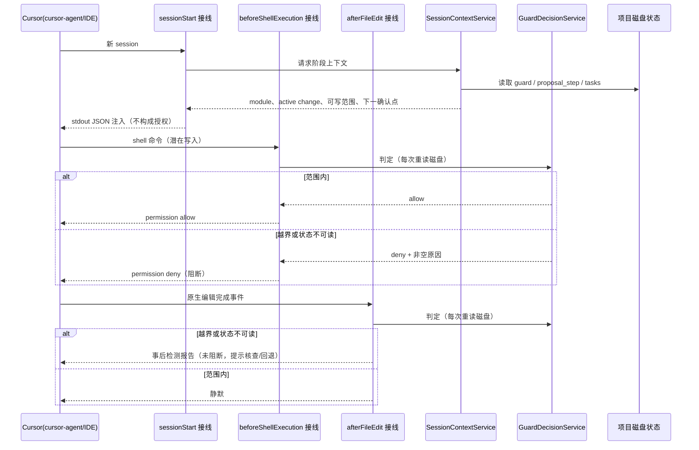
```mermaid
sequenceDiagram
    participant CU as Cursor(cursor-agent/IDE)
    participant SS as sessionStart 接线
    participant BS as beforeShellExecution 接线
    participant FE as afterFileEdit 接线
    participant SC as SessionContextService
    participant GD as GuardDecisionService
    participant FS as 项目磁盘状态
    CU->>SS: 新 session
    SS->>SC: 请求阶段上下文
    SC->>FS: 读取 guard / proposal_step / tasks
    SC-->>SS: module、active change、可写范围、下一确认点
    SS-->>CU: stdout JSON 注入（不构成授权）
    CU->>BS: shell 命令（潜在写入）
    BS->>GD: 判定（每次重读磁盘）
    alt 范围内
        GD-->>BS: allow
        BS-->>CU: permission allow
    else 越界或状态不可读
        GD-->>BS: deny + 非空原因
        BS-->>CU: permission deny（阻断）
    end
    CU->>FE: 原生编辑完成事件
    FE->>GD: 判定（每次重读磁盘）
    alt 越界或状态不可读
        FE-->>CU: 事后检测报告（未阻断，提示核查/回退）
    else 范围内
        FE-->>CU: 静默
    end
```

### 步骤与不变量

1. 三条接线共用共享服务的同一决策逻辑，Adapter 只做 Cursor 协议字段转换；决策无缓存，每次调用重读磁盘。
2. `proposal_step` 收敛语义与其他宿主一致（如 delta-writing 只放行 `logos/changes/<slug>/deltas/**` 与 tasks.md，安全白名单含 `git push` 等既有规则）。
3. shell deny 输出必含：事实（active change、proposal_step、允许范围、目标路径）+ 恢复动作。
4. `afterFileEdit` 报告必须如实声明「本次编辑未被阻断（CLI 无 preToolUse）」；不得把报告表述成阻断。
5. IDE 侧 `preToolUse` 由 Cursor 按同一 hooks.json 自然硬拦；OpenLogos 不探测宿主形态、不分叉配置。
6. sessionStart 输出仅供解释状态，不构成写入授权凭据。

### 异常

- `EX-CU-S09-1`：guard 文件缺失且提案目录存在 → shell deny、编辑报告；提示先运行 `openlogos change`。
- `EX-CU-S09-2`：hook stdin 不可解析 → shell 路径 deny（fail-closed），编辑路径产出「无法安全判断」报告。
- `EX-CU-S09-3`：决策服务抛异常 → 同 EX-CU-S09-2，且退出码语义不伪装成功。

### 追溯

- 需求：S09 Cursor 变更生命周期验收（Cursor 资产、迁移与 Hook 要求 5/6/7）。
- 架构：46.4 Hook 归一化与部分强度决策流水线、46.7 失败模型。
- 测试：UT-S09-293～UT-S09-302、ST-S09-112～ST-S09-115。

## S09 reopen 重合并的 test change set 前滚时序

### 场景目标

completed 合并事务经受控 `reopen` 后重合并时，apply 写出的 `SPEC_MERGED.test_change_set` 前滚合并归档 receipt 的测试变化事实，保证提案级 changed/removed 完整；祖先 receipt 身份失配 fail-closed。

### 参与者

- **用户 / driver**：发起 reopen 与重合并命令链。
- **MergeTransactionService**：submit/seal/apply 状态机与唯一 writer。
- **前滚合并器（buildMergePreflight 内）**：读取 reopen lineage 与归档 receipt，前滚合并 change set。
- **提案目录产物**：`MERGE_REOPENS.jsonl`、`merge-transactions/<id>.receipt.json`、`SPEC_MERGED`。

### 前置条件

提案曾 completed 且已 `reopen --reason ... [--confirm-spec-merged]`（留痕 + 归档 + 作废按序完成）；修正 delta 就位，其余 delta 幂等（与已合并状态一致）。

### 成功后置条件

`SPEC_MERGED.test_change_set.changed_test_ids` 包含首轮引入且未被本轮删除的全部测试 ID；removed 后写胜出；sha256 与 sealed preflight 摘要同源一致。

### 时序图

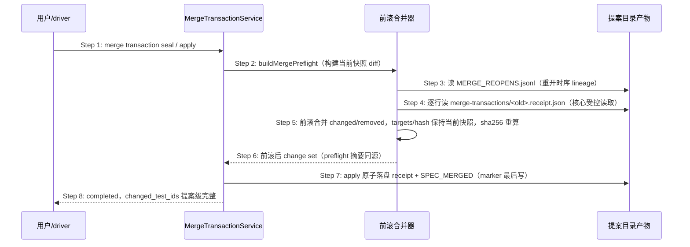
```mermaid
sequenceDiagram
    participant U as 用户/driver
    participant M as MergeTransactionService
    participant F as 前滚合并器
    participant P as 提案目录产物
    U->>M: Step 1: merge transaction seal / apply
    M->>F: Step 2: buildMergePreflight（构建当前快照 diff）
    F->>P: Step 3: 读 MERGE_REOPENS.jsonl（重开时序 lineage）
    F->>P: Step 4: 逐行读 merge-transactions/<old>.receipt.json（核心受控读取）
    F->>F: Step 5: 前滚合并 changed/removed，targets/hash 保持当前快照，sha256 重算
    F-->>M: Step 6: 前滚后 change set（preflight 摘要同源）
    M->>P: Step 7: apply 原子落盘 receipt + SPEC_MERGED（marker 最后写）
    M-->>U: Step 8: completed，changed_test_ids 提案级完整
```

### 步骤说明

1. **用户/driver** 在 reopen 重建的事务上照常执行 submit → seal → apply。
2. **MergeTransactionService** 在 seal 与 apply 共用的 `buildMergePreflight` 构建当前事务快照 diff。
3. **前滚合并器** 读取 `MERGE_REOPENS.jsonl` 获得重开时序 lineage（行序即时序）。
4. **前滚合并器** 对每行 `old_transaction_id` 读取对应归档 receipt；行无 receipt（abort 祖先）跳过，receipt `test_change_set` 为 null 记空集。
5. **前滚合并器** 按 `changed=(prev∖cur_removed)∪cur_changed、removed=(prev∖cur_changed)∪cur_removed` 从最早祖先前滚到当前快照 diff；targets 与 hash 保持当前快照，sha256 重算，落盘前执行既有 overlap/排序校验。
6. **MergeTransactionService** 以前滚后 change set 计算 preflight `test_change_set_sha256`（seal 摘要与 apply 落盘同源）。
7. **MergeTransactionService** 经 `applyBaselineClosureBatch` 原子落盘 receipt 与 `SPEC_MERGED`。
8. 下游切片校验按提案级 changed 正常放行 owned 归属。

### 异常与边界

#### EX-48.1：祖先 receipt 身份失配
- **触发条件**：归档 receipt 的 change/module/source 与当前提案身份不一致。
- **期望响应**：seal/apply fail-closed，稳定错误信息含失配 receipt 路径与双方身份；不静默跳过、不降级为快照 diff。
- **副作用**：无写副作用；事务留在原相位可 abort 处置。

#### EX-48.2：留痕或 receipt 损坏
- **触发条件**：`MERGE_REOPENS.jsonl` 行或 receipt JSON 不可解析。
- **期望响应**：fail-closed 拒绝并点名损坏路径。
- **副作用**：无。

#### EX-48.3：无留痕提案
- **触发条件**：提案从未 reopen。
- **期望响应**：不读任何归档，行为与 0.14.19 逐字节一致。
- **副作用**：无。

#### EX-48.4：多次 reopen 链式前滚
- **触发条件**：提案 reopen ≥2 次，`merge-transactions/` 有多个 receipt。
- **期望响应**：按留痕行序依次前滚，结果与单次等价语义一致（结合律成立）。
- **副作用**：无。

### 追溯

- 需求：reopen 后 test change set 提案级前滚需求。
- 测试：UT-S09-309～312、ST-S09-118～119、SMOKE-core-191。

## S09 guard-check 工作目录收敛与 fail-closed 时序

### 场景目标

`guard-check` 在任意会话 cwd 下都以**项目根**为判定基准：`CLAUDE_PROJECT_DIR` 在场即收敛到该目录；缺失且 cwd 非项目根时 fail-closed（exit 2 + 可读诊断），绝不静默放行。收敛后既有判定语义（lifecycle/guard 文件/白名单/realpath 归一化/exit 2 阻断合同）逐项不变。

### 参与者

- **Claude Code**：以会话 cwd + `CLAUDE_PROJECT_DIR` 环境变量执行 PreToolUse hook。
- **guard-check 脚本**：工作目录收敛 + 既有 guard 判定。
- **项目磁盘事实**：`logos/logos.config.json`、`logos/logos-project.yaml`、`logos/.openlogos-guard`。

### 前置条件

hook 已按 `$CLAUDE_PROJECT_DIR` 形态注册（S01/S08）。

### 成功后置条件

子目录 cwd 会话：无提案改码被阻断（exit 2 + reason），有提案在范围内放行——与项目根 cwd 判定逐项一致。

### 时序图

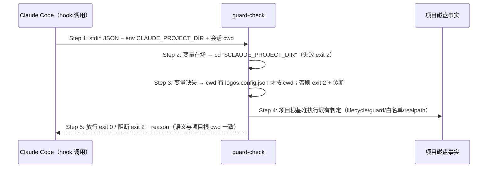
```mermaid
sequenceDiagram
    participant H as Claude Code（hook 调用）
    participant G as guard-check
    participant D as 项目磁盘事实
    H->>G: Step 1: stdin JSON + env CLAUDE_PROJECT_DIR + 会话 cwd
    G->>G: Step 2: 变量在场 → cd "$CLAUDE_PROJECT_DIR"（失败 exit 2）
    G->>G: Step 3: 变量缺失 → cwd 有 logos.config.json 才按 cwd；否则 exit 2 + 诊断
    G->>D: Step 4: 项目根基准执行既有判定（lifecycle/guard/白名单/realpath）
    G-->>H: Step 5: 放行 exit 0 / 阻断 exit 2 + reason（语义与项目根 cwd 一致）
```

### 步骤说明

1. **Claude Code** 从任意 cwd 触发 Edit/Write/Bash 前置 hook。
2. **guard-check** 读取 stdin 后立即收敛工作目录：`cd "$CLAUDE_PROJECT_DIR"`，`cd` 失败输出 reason 并 exit 2。
3. 变量缺失（旧版 Claude Code 兼容窗口）：仅当 cwd 存在 `logos/logos.config.json` 按 cwd 判定；否则 fail-closed——「不知道项目根在哪」不得落入「非 OpenLogos 项目放行」分支。
4. 收敛后既有判定零改动：Edit/Write 的绝对 `file_path` realpath 归一化在项目根基准下语义自洽。
5. 阻断输出既有四要素 reason 结构不变。

### 异常与边界

#### EX-52.1：CLAUDE_PROJECT_DIR 指向不可进入目录
- **触发条件**：变量在场但目录不存在/无权限。
- **期望响应**：exit 2 + 可读诊断（fail-closed）。
- **副作用**：无。

#### EX-52.2：变量缺失且 cwd 为项目根
- **触发条件**：旧版 Claude Code、根目录会话。
- **期望响应**：按 cwd 判定，行为与 0.14.20 一致（兼容不回归）。
- **副作用**：无。

#### EX-52.3：变量缺失且 cwd 为项目子目录
- **触发条件**：旧版 Claude Code、`cd src/` 后会话。
- **期望响应**：exit 2 + 诊断（0.14.20 在此静默 exit 0——本案消除该 fail-open）。
- **副作用**：无提案改码不再被放行。

#### EX-52.4：真非 OpenLogos 项目
- **触发条件**：变量指向的项目根（或 cwd 根）确无 `logos/logos.config.json`。
- **期望响应**：`exit 0` 放行（既有语义保持——该分支要求「已确认项目根」这一前提）。
- **副作用**：无。

### 追溯

- 需求：Claude guard hook 项目根定位与 sync 补齐需求「guard-check 工作目录收敛要求」。
- 测试：UT-S09-313～314、ST-S09-120。

## S09 guard-check 管辖边界与阻断输出双通道时序

### 场景目标

guard-check 在 launched 无提案的拦截判定中，先按管辖边界放行项目根之外的目标（交宿主权限系统），再对项目根之内的越界写入以双通道（stdout JSON + stderr 可读文本）输出阻断原因，确保用户与 AI 宿主都能看到「先创建变更提案」的可操作指引。

### 参与者

- **AI 宿主（Claude Code）**：发起 Edit/Write/Bash 工具调用，exit 2 时从 stderr 读取拦截原因。
- **guard-check 脚本**：PreToolUse 决策器，管辖边界与白名单判定、双通道阻断输出。
- **宿主权限系统**：项目根之外写入的实际裁决者（guard 放行后接管）。

### 前置条件

项目 launched、无活跃提案（`logos/.openlogos-guard` 不存在）；hook 以 `$CLAUDE_PROJECT_DIR` 形态注册，Step 0 工作目录已收敛到项目根。

### 成功后置条件

项目根之外的写入未被 guard 拦截（由宿主权限系统继续判定）；项目根之内的越界写入被拦截且 stderr 含变更管理指引、stdout JSON 结构不变。

### 时序图

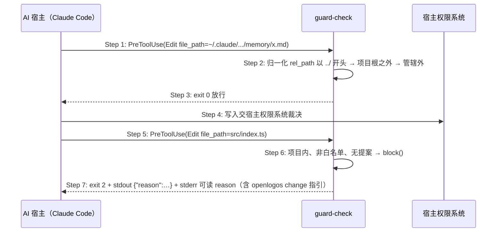
```mermaid
sequenceDiagram
    participant A as AI 宿主（Claude Code）
    participant G as guard-check
    participant H as 宿主权限系统
    A->>G: Step 1: PreToolUse(Edit file_path=~/.claude/.../memory/x.md)
    G->>G: Step 2: 归一化 rel_path 以 ../ 开头 → 项目根之外 → 管辖外
    G-->>A: Step 3: exit 0 放行
    A->>H: Step 4: 写入交宿主权限系统裁决
    A->>G: Step 5: PreToolUse(Edit file_path=src/index.ts)
    G->>G: Step 6: 项目内、非白名单、无提案 → block()
    G-->>A: Step 7: exit 2 + stdout {"reason":…} + stderr 可读 reason（含 openlogos change 指引）
```

### 步骤说明

1. **AI 宿主** 对项目根之外的目标（如用户级 `~/.claude` 记忆文件）发起写入，PreToolUse 触发 guard-check。
2. **guard-check** 在白名单前缀匹配之前先判管辖：python3/node 归一化后 `rel_path` 为 `..` 或以 `../` 开头（bash 兜底分支：绝对路径不在 `$(pwd)/` 之下）→ 项目根之外。
3. **guard-check** 直接 exit 0 放行——guard 只保护本项目源码的变更可追溯性。
4. **宿主权限系统** 对该写入继续其自身权限判定（guard 不越权代管）。
5. **AI 宿主** 对项目根之内源码发起写入，PreToolUse 再次触发 guard-check。
6. **guard-check** 判定目标在项目内、不在白名单且无活跃提案，进入 `block()`。
7. **guard-check** 双通道输出后 exit 2：stdout 保留 `{"reason":"..."}` JSON（旧协议兼容），stderr 输出同一 reason 的可读文本（Claude Code 实际展示通道），指引先运行 `openlogos change <slug>`。

### 异常与边界

#### EX-56.1：Step 0 fail-closed 的 stderr 可见性
- **触发条件**：`CLAUDE_PROJECT_DIR` 指向不可进入目录，或变量缺失且 cwd 非项目根。
- **期望响应**：exit 2，stdout JSON 与 stderr 诊断**同时**输出；不得出现 stderr 为空的阻断。
- **副作用**：无。

#### EX-56.2：python3/node 均不可用的 bash 兜底
- **触发条件**：宿主环境缺 python3 与 node，归一化走 bash 前缀剥离。
- **期望响应**：绝对路径不在 `$(pwd)/` 之下 → 放行；在项目内则按剥离后的相对路径继续白名单判定，行为与归一化路径一致。
- **副作用**：无。

#### EX-56.3：项目外目标出现在 Bash 重定向
- **触发条件**：Bash 命令命中写入模式且重定向目标位于项目根之外。
- **期望响应**：`is_whitelisted_path` 对该目标按管辖边界放行（exit 0），与 Edit/Write 判定一致。
- **副作用**：无。

### 追溯

- 需求：Claude guard hook 管辖边界与阻断可见性需求。
- 测试：UT-S09-315、UT-S09-316、ST-S09-121。

## S09 guard-check Bash 写命令路径提取与逐路径管辖判定时序

### 场景目标

guard-check 在 launched 无提案的 Bash 写命令判定中，对命中 `BASH_WRITE_PATTERNS` 的 `rm`/`cp`/`mv`/`mkdir`/`touch`/`chmod`/`chown` 类命令先提取全部路径实参，再逐路径走既有 `is_whitelisted_path` 管辖判定：全部路径在项目根之外或白名单内则放行（交宿主权限系统），任一路径在项目内且非白名单维持拦截；解析不出的复杂形态维持现行无条件拦截（fail-closed 保守臂）。

### 参与者

- **AI 宿主（Claude Code）**：发起 Bash 工具调用（如写 session scratchpad 的 `rm`/`cp`）。
- **guard-check 脚本**：PreToolUse 决策器——安全白名单 → 写模式匹配 → 路径提取 → 逐路径管辖判定。
- **宿主权限系统**：项目根之外写入的实际裁决者（guard 放行后接管）。

### 前置条件

项目 launched、无活跃提案（`logos/.openlogos-guard` 不存在）；hook 以 `$CLAUDE_PROJECT_DIR` 形态注册，Step 0 工作目录已收敛到项目根。

### 成功后置条件

全部路径实参在项目根之外（或白名单内）的 Bash 写命令未被 guard 拦截；任一路径在项目内非白名单的命令被拦截且 stderr 含变更管理指引；解析不出的命令维持现行拦截。

### 时序图

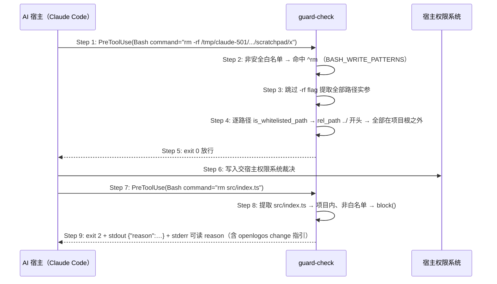
```mermaid
sequenceDiagram
    participant A as AI 宿主（Claude Code）
    participant G as guard-check
    participant H as 宿主权限系统
    A->>G: Step 1: PreToolUse(Bash command="rm -rf /tmp/claude-501/.../scratchpad/x")
    G->>G: Step 2: 非安全白名单 → 命中 ^rm （BASH_WRITE_PATTERNS）
    G->>G: Step 3: 跳过 -rf flag 提取全部路径实参
    G->>G: Step 4: 逐路径 is_whitelisted_path → rel_path ../ 开头 → 全部在项目根之外
    G-->>A: Step 5: exit 0 放行
    A->>H: Step 6: 写入交宿主权限系统裁决
    A->>G: Step 7: PreToolUse(Bash command="rm src/index.ts")
    G->>G: Step 8: 提取 src/index.ts → 项目内、非白名单 → block()
    G-->>A: Step 9: exit 2 + stdout {"reason":…} + stderr 可读 reason（含 openlogos change 指引）
```

### 步骤说明

1. **AI 宿主** 对项目根之外的目标（如 session scratchpad）发起 `rm -rf` 命令，PreToolUse 触发 guard-check。
2. **guard-check** 先过 `BASH_SAFE_PATTERNS`（不命中），再匹配 `BASH_WRITE_PATTERNS` 命中 `^rm `。
3. **guard-check** 跳过以 `-` 开头的选项 flag，提取命令的全部路径实参（`rm`/`mkdir`/`touch`/`chmod`/`chown` 全量实参；`cp`/`mv` 全量实参含源与目标）；既有 `>`/`>>` 重定向目标提取保持不变。
4. **guard-check** 对每个路径逐一走既有 `is_whitelisted_path`（含 0.14.22 管辖边界与白名单判定）——本例全部路径归一化后在项目根之外。
5. **guard-check** exit 0 放行——guard 只保护本项目源码的变更可追溯性。
6. **宿主权限系统** 对该写入继续其自身权限判定。
7. **AI 宿主** 对项目根之内源码发起 `rm`，PreToolUse 再次触发 guard-check。
8. **guard-check** 提取出的路径落在项目内且非白名单，进入 `block()`——任一路径命中即拦截，不因其余路径在外而放行。
9. **guard-check** 双通道输出后 exit 2（stdout JSON + stderr 可读指引，合同与 0.14.22 一致）。

### 异常与边界

#### EX-61.1：解析不出的复杂形态维持拦截（保守臂）
- **触发条件**：命中写模式的命令含变量展开（`$VAR`）、命令替换（`$(…)`/反引号）、管道或复合形态（`|`、`&&`、`;`），无法确定全部路径实参。
- **期望响应**：维持现行无条件拦截（exit 2），fail-closed 不放宽；不尝试部分提取后放行。
- **副作用**：无。

#### EX-61.2：混合路径命令任一在内即拦截
- **触发条件**：`cp <项目外源> <项目内非白名单目标>` 或 `mv <项目内源> <项目外目标>` 等混合形态。
- **期望响应**：逐路径判定中任一路径在项目根之内且非白名单 → exit 2 拦截（携 stderr 指引）；不得因存在项目外路径而放行。
- **副作用**：无。

#### EX-61.3：安全白名单优先级不变
- **触发条件**：命令同时可匹配 `BASH_SAFE_PATTERNS`（如 `git push`）。
- **期望响应**：安全白名单先判、直接放行，不进入写模式与路径提取分支——与现行顺序一致。
- **副作用**：无。

#### EX-61.4：三运行时同判
- **触发条件**：宿主环境分别为 python3 可用、仅 node 可用、python3/node 均不可用（bash 兜底）。
- **期望响应**：同一命令在三条判定路径下放行/拦截结论一致；bash 兜底分支对绝对路径按 `$(pwd)/` 前缀判管辖，与归一化路径结论一致。
- **副作用**：无。

### 追溯

- 需求：guard-check Bash 写命令路径级管辖判定需求。
- 测试：UT-S09-317、UT-S09-318、ST-S09-122。

## archive 链条 fail-closed 校验

### 问题：归档端不设防让缺口被固化

20260907 事故中，`fix-guard-check-bash-write-target-jurisdiction` 提案在 `DEPLOY_DONE` 缺失（执行 Agent 漏跑 `openlogos deploy-done`）的状态下被成功归档：`cli/src/commands/archive.ts` 不检查 `VERIFY_PASS` / `DEPLOY_DONE` / `SMOKE_PASS` 中的任何一个。归档是 audit-only 终态，缺口一旦被归档就永久固化——链条断点在归档记录里再也看不出来。archive 是生命周期链条的**末端兜底**，必须 fail-closed。

### 校验规则

`openlogos archive <slug>` 在移动提案目录**之前**校验完成链条，顺序固定 ①→②→③，命中即停：

| # | 条件 | 适用范围 | 错误码 | 补救命令 |
|---|---|---|---|---|
| ① | `VERIFY_PASS` 存在且 `VERIFY_FAIL` 不存在 | 全部提案 | `ARCHIVE_VERIFY_NOT_PASSED` | `openlogos verify` |
| ② | `DEPLOY_DONE` 存在 | 仅 `deployment_required=true` | `ARCHIVE_DEPLOY_NOT_DONE` | `openlogos deploy-done` |
| ③ | `SMOKE_PASS` 存在且 `SMOKE_FAIL` 不存在 | 仅 `deployment_required=true` 且 `smoke_required=true` | `ARCHIVE_SMOKE_NOT_PASSED` | `openlogos smoke` |

`deployment_required` / `smoke_required` 按 `spec/change-management.md`「提案级部署决策优先级」解析：活跃提案的 `proposal.md` 优先，`tasks.md` 的 `[deploy]` section 为结构化证据，模块级默认值不得覆盖提案的明确决策。

### fail-closed 语义（强制）

拒绝时**不移动提案目录、不删除 `logos/.openlogos-guard`、不产生任何部分状态更新**。`openlogos archive` 保持纯文本命令（不新增 stdout JSON envelope，与既有 `ARCHIVE_WATCH_*` 一致），以稳定错误码文本写 stderr 并非零退出，message 携带上表的补救命令。

**与 Windows 归档握手的顺序**：链条校验在最前——「链条校验 → 握手（`ARCHIVE_WATCH_*`）→ rename」。链条不满足时根本不建立握手请求，不占用协议目录、不惊动监听实例。

### 两档模式语义

校验只关命令自身的上游事实，不新增人类确认点。半自动下 archive 仍需人类明确授权；`--auto` 下 standing 授权照常放行执行，但**放行的是"运行 archive 这个动作"，不是"跳过链条门"**——链条不满足时 `--auto` 同样 fail-closed 拒绝。这与硬红线语义一致：全自动放行只发生在「已绿/已盖章」之后，绝不跨越未完成的链条。

### 零回归边界

- 无需部署的提案链条只到 ①，`VERIFY_PASS` 后照常归档。
- `deployment_decision_conflict=true` 时 archive 本就不得作为主动作（`spec/change-management.md`「提案级部署决策优先级」第 6 条），语义不变。
- 归档 audit-only 定位（S37）、commit 粒度规则、guard 释放行为在校验通过后逐项不变。
- Windows 归档握手协议（`ARCHIVE_WATCH_PREPARE_FAILED` / `ACK_TIMEOUT` / `INSTANCE_FAILED` / `STATE_INCONSISTENT`）行为不变。

### EX-9.13: 缺 VERIFY_PASS 的归档请求
- **触发条件**：活跃提案 `VERIFY_PASS` 缺失，或 `VERIFY_FAIL` 在场。
- **期望响应**：`ARCHIVE_VERIFY_NOT_PASSED` 写 stderr 并非零退出，提示 `openlogos verify`。
- **副作用**：零——目录未移动、guard 未删除、未建立握手请求。

### EX-9.14: 需部署提案缺 DEPLOY_DONE 的归档请求
- **触发条件**：提案 `deployment_required=true` 但 `DEPLOY_DONE` 缺失（漏跑 `openlogos deploy-done`）。
- **期望响应**：`ARCHIVE_DEPLOY_NOT_DONE` 拒绝，提示 `openlogos deploy-done`。即使 `SMOKE_PASS` 在场（本次事故的孤儿状态）也照常拒绝——smoke 结论不能反推部署完成。
- **副作用**：零。

### EX-9.15: 需 smoke 提案缺 SMOKE_PASS 的归档请求
- **触发条件**：提案需部署且需 smoke，`DEPLOY_DONE` 在场但 `SMOKE_PASS` 缺失，或 `SMOKE_FAIL` 在场。
- **期望响应**：`ARCHIVE_SMOKE_NOT_PASSED` 拒绝，提示 `openlogos smoke`。
- **副作用**：零。

### 与 smoke 门的纵深防御关系

S19 的 smoke 前置门是链条中段，本节的 archive 链条门是末端兜底。本次事故中两道门同时缺席，单点漏标才得以一路走到归档并被固化。两门叠加后：漏标 → smoke 拒绝（缺口在最早处暴露）；即使 smoke 因历史版本或旁路被绕过 → archive 仍拒绝（缺口不被固化）；两门都被绕过的历史提案 → 由 `status` / `next` 的 `state_inconsistency` 对账投影点名（S11 / S05）。

## S09 merge 直接合并时序

### 场景目标

把规格合并从「N×3+3 次 CLI 往返的事务链」收敛为**一次调用**：读 delta → 逐目标合成最终字节（含物质结果复验）→ 一次性原子落盘 → 写含 `test_change_set` 的 `SPEC_MERGED`。失败即整批回滚，git 工作区是回滚点。

### 参与者

- **change-writer（AI）**：产出 `deltas/` 下的 delta 文件。
- **openlogos merge（CLI）**：合并的唯一执行者与写入者。
- **合并引擎 `composeOpenLogosMarkdown`**：章节锚定位、标题 rebase、物质结果复验。
- **原子落盘原语 `applyBaselineClosureBatch`**：全部目标一次提交，失败整批回滚。

### 前置条件

`[delta]` 全部产出、change-lint 通过、`logos/resources/` 工作区干净（便于回滚）。

### 成功后置条件

全部 canonical target 落盘为最终态；`SPEC_MERGED` 在场且含结构化 `test_change_set`；无任何事务中间态文件残留。

### 时序图

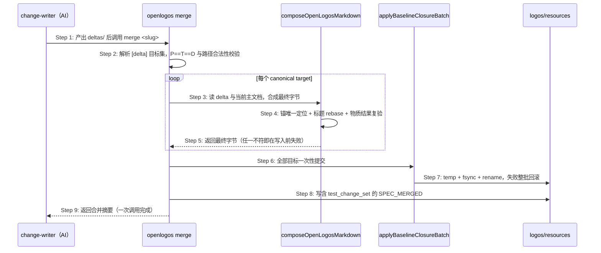
```mermaid
sequenceDiagram
    participant W as change-writer（AI）
    participant M as openlogos merge
    participant E as composeOpenLogosMarkdown
    participant A as applyBaselineClosureBatch
    participant F as logos/resources
    W->>M: Step 1: 产出 deltas/ 后调用 merge <slug>
    M->>M: Step 2: 解析 [delta] 目标集，P==T==D 与路径合法性校验
    loop 每个 canonical target
        M->>E: Step 3: 读 delta 与当前主文档，合成最终字节
        E->>E: Step 4: 锚唯一定位 + 标题 rebase + 物质结果复验
        E-->>M: Step 5: 返回最终字节（任一不符即在写入前失败）
    end
    M->>A: Step 6: 全部目标一次性提交
    A->>F: Step 7: temp + fsync + rename，失败整批回滚
    M->>F: Step 8: 写含 test_change_set 的 SPEC_MERGED
    M-->>W: Step 9: 返回合并摘要（一次调用完成）
```

### 步骤说明

1. **change-writer** 产出全部 delta 后调用 `openlogos merge <slug>`。
2. **merge** 解析目标集并做既有 P==T==D 与路径合法性校验——校验全部前置于写入。
3-5. **合并引擎**逐目标合成最终字节；`verifyAgentMaterialOutcome` 在此复验「delta 是否真被正确应用」，任一目标不符即在写入任何文件前整体失败。
6-7. **原子落盘原语**一次性提交全部目标，失败整批回滚，主文档保持合并前字节。
8. **merge** 末步写 `SPEC_MERGED`，含由 `buildTestChangeSet` 构建的结构化 `test_change_set`。
9. 至此一次 CLI 往返完成合并（此前 11 目标需 36 次）。

### 异常与边界

#### EX-9.20：某目标合成失败
- **触发条件**：章节锚解析到 0 或多处、delta 段标记缺失、物质结果复验不通过。
- **期望响应**：在写入任何文件前整体失败并点名该目标与原因；`logos/resources/` 零改动。
- **副作用**：无。

#### EX-9.21：落盘中途失败
- **触发条件**：rename 失败、磁盘异常。
- **期望响应**：整批回滚到合并前字节，不写 `SPEC_MERGED`；错误信息附 `git checkout logos/resources/` 作为兜底回滚点。
- **副作用**：无半新半旧的主文档。

#### EX-9.22：重新合并
- **触发条件**：已合并后发现 delta 有误。
- **期望响应**：`git checkout logos/resources/` 回到合并前，修正 delta 后重跑 `openlogos merge`——不存在 reopen 通道，也不需要（无中间态可恢复）。
- **副作用**：无。

### 追溯

- 需求：merge 直接合并与规格结构检查要求。
- 功能规格：§2.69。
- 测试：UT-S09-340、UT-S09-341、ST-S09-140。

## S09 merge 内部错误的稳定失败语义

### 场景目标

让 `openlogos merge` 的失败出口**默认兜底**而非默认放行：任何逃出 `mergeDirect` 的内部错误（含 `test-change-set` 族及任何未来新增的错误类）一律映射为稳定失败形态——稳定前缀与错误码、**按已确认阶段分档的状态声明**、对应的后续动作指引、非零退出——**绝不裸抛 Node 未捕获异常堆栈**，也**绝不把未知或已提交的状态包装成已确认零残留**（功能规格 §2.84.3，补齐 §2.69.1 明文失败语义）。

### 用户价值

CLI 的 stderr 是无人值守下游唯一可得的病灶来源。裸堆栈 + 无错误码 = 下游零诊断：2026-09-14 全自动 run 的账本只剩 `reason:merge-failed, exitCode:1`，人与 agent 都无法从中定位「少写一个管道符」这个真病灶。稳定失败形态让每一次 merge 失败都自带可归因信息与如实的状态指引——**与事实相符是前提**：对已提交后才失败的情形谎报「什么都没发生，改完重跑即可」，比裸堆栈更有害（按该指引重跑会撞上「`SPEC_MERGED` 已存在」的前置拒绝）。

### 参与者与前置条件

| 别名 | 组件 | 说明 |
|---|---|---|
| D | `runDirectMerge` | 命令层失败出口的唯一映射点 |
| G | `mergeDirect` | 合并主流程（含准备阶段与落盘） |
| B | `buildTestChangeSet` | 准备阶段抛 `TestChangeSetBuildError` 的典型内部错误源 |
| A | `applyBaselineClosureBatch` | 原子落盘原语；其结构化返回（`ok` / `rolled_back`）是状态档的事实源之一 |
| F | `logos/resources/` | 合并目标；失败后的实际字节状态由状态档如实描述 |

前置条件：`change-lint` 准入已通过（或本次失败发生在准入之后的任一内部阶段）；`logos/resources/` 工作区在合并前干净。

### 失败出口时序

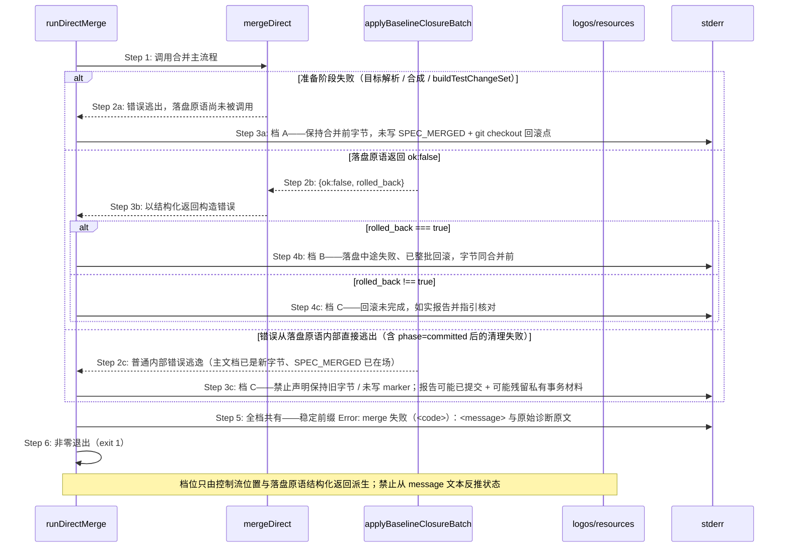
```mermaid
sequenceDiagram
    participant D as runDirectMerge
    participant G as mergeDirect
    participant A as applyBaselineClosureBatch
    participant F as logos/resources
    participant E as stderr

    D->>G: Step 1: 调用合并主流程
    alt 准备阶段失败（目标解析 / 合成 / buildTestChangeSet）
        G-->>D: Step 2a: 错误逃出，落盘原语尚未被调用
        D->>E: Step 3a: 档 A——保持合并前字节，未写 SPEC_MERGED + git checkout 回滚点
    else 落盘原语返回 ok:false
        A-->>G: Step 2b: {ok:false, rolled_back}
        G-->>D: Step 3b: 以结构化返回构造错误
        alt rolled_back === true
            D->>E: Step 4b: 档 B——落盘中途失败、已整批回滚，字节同合并前
        else rolled_back !== true
            D->>E: Step 4c: 档 C——回滚未完成，如实报告并指引核对
        end
    else 错误从落盘原语内部直接逃出（含 phase=committed 后的清理失败）
        A-->>D: Step 2c: 普通内部错误逃逸（主文档已是新字节、SPEC_MERGED 已在场）
        D->>E: Step 3c: 档 C——禁止声明保持旧字节 / 未写 marker；报告可能已提交 + 可能残留私有事务材料
    end
    D->>E: Step 5: 全档共有——稳定前缀 Error: merge 失败（<code>）：<message> 与原始诊断原文
    D->>D: Step 6: 非零退出（exit 1）
    Note over D,F: 档位只由控制流位置与落盘原语结构化返回派生；禁止从 message 文本反推状态
```

### 稳定失败形态（四要素，缺一不可）

| 要素 | 内容 |
|---|---|
| 稳定前缀与错误码 | `Error: merge 失败（<code>）：<message>` |
| 状态声明 | 按已确认阶段分档（见下表），**不是一句固定文案** |
| 后续动作指引 | 与状态档对应的核对 / 回滚指引 |
| 退出码 | 非零（`process.exit(1)`） |

### 状态档（唯一事实源 = 结构化数据）

| 档 | 结构化判据 | 声明与指引 |
|---|---|---|
| A · 未提交 | 失败发生在调用落盘原语**之前** | `logos/resources/ 保持合并前字节，未写 SPEC_MERGED。` + `回滚点：git checkout logos/resources/；修正 delta 后重跑 openlogos merge <slug>。` |
| B · 已回滚 | 落盘原语返回 `ok:false` 且 `rolled_back === true` | 同 A 的字节声明，并注明落盘中途失败、已整批回滚 |
| C · 已提交或不可确认 | 落盘原语返回 `ok:false` 且 `rolled_back !== true`；**或**错误从原语内部直接逃出（含 `phase = 'committed'` 之后的私有材料清理失败） | **禁止**声明保持旧字节 / 未写 marker；如实报告主文档可能已是合并后字节、`SPEC_MERGED` 可能已写入、提案目录可能残留私有事务材料，指引 `git status` / `git diff logos/resources/` 与 marker 在场性核对，并保留原始诊断原文 |

**档 C 存在的事实依据**：`applyBaselineClosureBatch` 在 `journal.phase = 'committed'` 落盘后才清理私有材料；该清理先删 journal 再删私有目录，后一步失败时其 catch 内的恢复函数走**无 journal** 分支再次尝试同一清理并二次抛出，成为逃出 `mergeDirect` 的普通内部错误。此时全部目标与 `SPEC_MERGED`（它就在同一原子批内以 CREATE 落盘）均已是新字节。「所有抛点都在写入前或既有回滚路径上」不是事实，故状态声明不能无条件断言（delta-r1 F2）。

### 不变量

1. **默认兜底**：失败出口不存在「未登记的错误类 ⇒ 裸堆栈」通道；新增任何内部错误类无需改动出口即自动获得稳定形态。
2. **诊断不降级**：错误类自带的 `code` 原样进入错误码位（如 `test-change-set-ambiguous-table`），`message` 与结构化归因信息（如 `targetPaths`）不被兜底吞掉。
3. **落盘原语行为逐字不变**：本场景只改失败**信息形态**，不改失败的**时机与副作用**——`applyBaselineClosureBatch` 的准备 / 提交 / 回滚 / 清理时序逐行保留，EX-9.20 / EX-9.21 / EX-9.22 语义逐字保留。**但信息不得超出已确认事实**：状态声明只描述由结构化数据确定的档位，不对未确认状态作断言。
4. **可归因优先级**：有 delta 侧归属时以「delta 文件 + delta 内行号」为主诊断，后态行号（已标注「合并后态」口径）并列输出作为佐证；归属无法确定时**不得伪造**，显式说明未能归因（功能规格 §2.84.4）。
5. **默认档为 C（fail-safe）**：阶段无法从结构化事实确定时默认报告「不可确认」，而非默认报告干净；判据禁止从错误 message 文本反向推断（对齐 §2.69.2「流程判断使用结构化数据」）。
6. **不留第二处硬编码结论**：`mergeDirect` 既有 `MERGE_APPLY_FAILED` 无条件拼接的「主文档已回滚至合并前字节」同批订正为按状态档派生——`rolled_back === false` 时该句同样为假。
7. **成功路径零漂移**：merge 成功时的输出、`SPEC_MERGED` 内容与 `--format json` 契约逐字节不变。

### 异常与边界

#### EX-9.23：准备阶段内部错误（含 `test-change-set` 族）必须以稳定失败形态收束（档 A）
- **触发条件**：`mergeDirect` 内部抛出非 `MergeDirectError` 的错误——典型为准备阶段 `buildTestChangeSet` 因 delta 形态问题抛 `TestChangeSetBuildError`（如 `test-change-set-ambiguous-table`：某 ID 表数据行列数 ≠ 表头列数）。
- **期望响应**：以上述四要素稳定形态收束，状态档为 **A**——stderr 含 `Error: merge 失败（test-change-set-ambiguous-table）：…`、档 A 状态声明与 `git checkout logos/resources/` 回滚点，非零退出；**不得出现 Node 未捕获异常堆栈**（`TestChangeSetBuildError: … at scanTestDefinitionCandidates … Node.js vXX` 形态即判失败）。诊断同时点名产生该行的 delta 文件与 delta 内行号（无法归因时显式声明）。
- **副作用**：零残留——`logos/resources/` 逐字节保持合并前状态，未写 `SPEC_MERGED`，无半新半旧的主文档，无任何中间态文件。
- **事故对照**：修复前该错误逃到进程顶层裸抛，账本只剩 `reason:merge-failed, exitCode:1`（audit run `drv-mu1d875x-7ooq`），下游零诊断、需人工用 `tableRowCells` 重扫 delta 才定位到病灶行。

#### EX-9.24：提交完成后的清理失败必须如实报告，不得谎报零残留（档 C）
- **触发条件**：全部目标与 `SPEC_MERGED` 已原子落盘、`journal.phase` 已置 `committed`，随后 `removePrivateArtifacts` 因 IO 错误失败；其 catch 内的恢复函数在无 journal 分支再次尝试清理并二次抛出，错误逃出 `mergeDirect`。
- **期望响应**：稳定前缀、错误码、原始诊断与非零退出照常；状态声明取 **档 C**——**不得**出现「保持合并前字节」或「未写 SPEC_MERGED」，须报告主文档可能已是合并后字节、`SPEC_MERGED` 可能已写入、提案目录可能残留私有事务材料，并指引 `git status` / `git diff logos/resources/` 与 marker 在场性核对。
- **副作用**：主文档为**新字节**、`SPEC_MERGED` **在场**、私有事务材料可能残留——这正是档 A 文案会谎报的状态。
- **为何不在本提案重做原语**：清理时序与原子落盘机制逐行不变；本提案的范围是失败**语义的准确性**，不是重做提交协议。

### 追溯

- 来源变更：fix-merge-preflight-parity-and-bare-throw（RunLogos 全自动 driver 实测事故，2026-09-14；audit run `drv-mu1d875x-7ooq`）。
- 功能规格：§2.84.3（默认兜底映射与状态三档）、§2.84.4（诊断可归因）、§2.69.1（失败语义合同，同批补齐）、§2.69.2（`SPEC_MERGED` 结构零回归）。
- 场景关联：本文档「S09 merge 直接合并时序」（EX-9.20～EX-9.22 逐字保留）、S35「行级形态判据前移与预检-门一致性锁」（同族的前移侧）。
- 测试：UT-S09-351～UT-S09-354、ST-S09-145。
