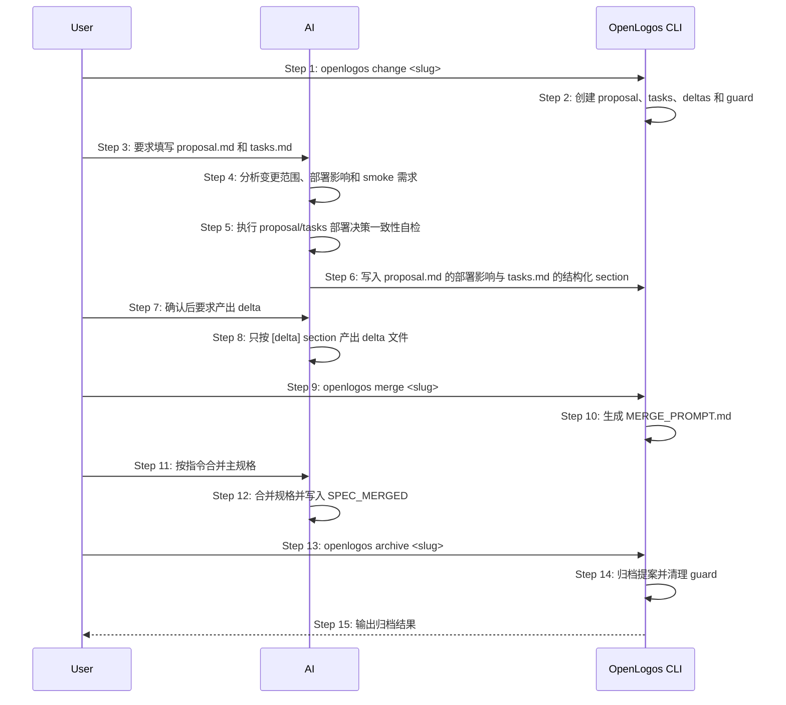

# S09: 创建、合并、归档变更提案 — 时序图

```mermaid
sequenceDiagram
    participant U as User
    participant A as AI
    participant C as OpenLogos CLI

    U->>C: Step 1: openlogos change <slug>
    C->>C: Step 2: 创建 proposal、tasks、deltas 和 guard
    U->>A: Step 3: 要求填写 proposal.md 和 tasks.md
    A->>A: Step 4: 分析变更范围、部署影响和 smoke 需求
    A->>A: Step 5: 执行 proposal/tasks 部署决策一致性自检
    A->>C: Step 6: 写入 proposal.md 的部署影响与 tasks.md 的结构化 section
    U->>A: Step 7: 确认后要求产出 delta
    A->>A: Step 8: 只按 [delta] section 产出 delta 文件
    U->>C: Step 9: openlogos merge <slug>
    C->>C: Step 10: 生成 MERGE_PROMPT.md
    U->>A: Step 11: 按指令合并主规格
    A->>A: Step 12: 合并规格并写入 SPEC_MERGED
    U->>C: Step 13: openlogos archive <slug>
    C->>C: Step 14: 归档提案并清理 guard
    C-->>U: Step 15: 输出归档结果
```

## 步骤说明
1. **用户**创建变更提案。
2. **CLI** 建立提案工作区。
3. **用户**要求 AI 填写提案。
4. **AI** 判断本次提案是否需要部署、是否需要 smoke、是否涉及回滚。
5. **AI** 执行 proposal/tasks 部署决策一致性自检。
6. **AI** 写入 `proposal.md` 的 `## 部署影响`，并让 `tasks.md` 的 `[deploy]` section 与部署决策一致。
7. **用户**确认提案后才进入 delta-writing。
8. **AI** 只产出 `[delta]` section 对应的 delta 文件。
9. **用户**明确授权执行 merge。
10. **CLI** 生成 MERGE_PROMPT。
11. **用户**要求 AI 执行合并流程。
12. **AI** 合并主规格并写入 SPEC_MERGED。
13. **用户**在 verify / deploy / smoke 门禁完成后请求归档。
14. **CLI** 归档并释放 guard。
15. **CLI** 输出结果。

## proposal_step 判定来源（flow-derive）

S09 变更生命周期各步骤展示的 `proposal_step`（`status` / `next` 共享）自 M1 切片 B2 起，
由 `cli/src/lib/flow-derive.ts` 新增的 `detectProposalStepViaFlow(proposalDir, moduleDefaults)`
基于**内置（builtin）launched flow**（`spec/flow/launched.yaml`）派生，取代原硬编码的
`detectProposalStep` 状态机调用点。输出与旧 `detectProposalStep` **逐态一致（1:1 不改行为）**，
`cli-json-output` 的 `proposal_step` 枚举契约保持不变。

派生为「**节点序列声明化 + 规则仍在引擎**」：

- **节点序列声明化**：`launched.yaml` 提供 propose → merge → implement → deliver → close 的
  节点顺序与各节点 `done_when` / `fail_when`（`proposal_package_filled`（writing 离场）/
  `section_complete:delta`（delta-writing → ready-to-merge）/
  `any_present:[MERGE_PROMPT_GENERATED, MERGE_PROMPT.md]`（merge-generated）/
  `any_present:[SPEC_MERGED, MERGED]`（coding 离场）/ `section_complete:code`（coding → ready-to-verify）/
  `marker:VERIFY_PASS`、`fail_when: marker:VERIFY_FAIL` / `marker:DEPLOY_DONE` /
  `marker:SMOKE_PASS`、`fail_when: marker:SMOKE_FAIL` / `archived`）。
- **marker 非对称优先级（引擎规则保留，不下沉 flow）**：`VERIFY_FAIL` 全局最先判定（先于
  template / merge / deploy）；`SMOKE_FAIL` / `SMOKE_PASS` **不是全局优先**——仅在 `VERIFY_PASS`
  成立、需部署、`DEPLOY_DONE` 存在且 deploy 任务全勾后的 deploy 子块内评估，否则仍停
  `ready-to-deploy`。
- **提案级部署决策（引擎规则保留）**：deliver 子流程的 `deployment_required` / `smoke_required`
  及决策冲突阻塞继续由 `resolveProposalDeploymentDecision` 依据 `proposal.md` 的 `## 部署影响`
  与 `tasks.md` 的 `[deploy]` section 求解（提案级，不回退模块默认）；EX-5.1 部署决策冲突
  行为不变（冲突时停 `verify-passed`，不推进 deploy/smoke/archive）。
- **section 完成语义按 legacy**：`section_complete:<tag>` 实现为 `total > 0 && checked === total`，
  present-but-empty 的 `[delta]`/`[code]` 不算完成（不采用 flow-spec §184 字面"全部勾选或不存在"）。

`detectProposalStep` 仍是状态计算的单一语义来源——B2 只是把它的节点序列改为 flow 声明驱动，
不改各态判定结果。并跑等价由测试期「ViaFlow == 旧 detectProposalStep」断言锁定
（见 `core-S09-test-cases`）。

## 纯代码提案（无 `[delta]`）派生：spec/merge 空过直连 slice/implement（fix-nodelta-proposal-routing）

纯代码级修复提案（`tasks.md` 无 `## [delta]` section）在生命周期派生上与常规（有 `[delta]`）提案的差异：`spec`（write-delta）+ `merge` 子流程带 `when: delta_required`，`delta_required==false` 时**整段空过**——无 delta 待产出、无 delta 待合并、不等 `SPEC_MERGED`。派生据此把无 `[delta]` 提案的 `spec`/`merge` 视为 vacuously done，跳过 `delta-writing`/`ready-to-merge`/`merge-generated` 三态，直接进入 `slice`/`implement` 维度。

**关键不变量**：`delta_required==false` 时，本生命周期**绝不**产出 `proposal_step == delta-writing`、前沿**绝不**为 `write-delta`。这修复了「纯代码提案被派到 `write-delta`、change-writer 正确零产出却被判假完成、无人值守下 `blocked(no-progress)` 死锁」的假阴性。

派生路径（`delta_required==false`，`## [code]` 标题在场）：

- `writing`（proposal/tasks 未脱模板） →（plan 门批准）→ `ready-to-implement`（前沿 `plan-slices`，唤起 slice-planner 对现有/已合并规格 + 真实测试 ID 划 `[code]` 切片）→ `slice-exit` 门 → `coding`（前沿 `code`）→ `ready-to-verify` → …
- 与常规提案唯一差别 = 中间不经 `delta-writing`/`ready-to-merge`/`merge-generated`（`spec`/`merge` 空过）。规则细节与派生矩阵见 `spec/flow-spec.md` §12.6、`spec/tasks-spec.md`「状态判断规则」。

**前置协同**：以上以纯代码提案 `tasks.md` **保留空 `## [code]` 标题**为前提（`change-writer` 纯代码修复模板已保证）——它令 `parseTaskSections` 非 `null`、`code_required` 为真，从而被识别为纯代码提案而非降级到旧格式兜底。

### EX-9.1: 纯代码提案（无 `[delta]`）被误派 write-delta

- **触发条件**：launched 生命周期、活跃提案 `tasks.md` 无 `## [delta]` section（纯代码级修复），经 plan 门后派生。
- **期望响应**：`proposal_step` 派生为 `ready-to-implement`（前沿 `plan-slices`）/ `coding` / `ready-to-verify` 之一，**绝不为 `delta-writing`**、`next_node.id` **绝不为 `write-delta`**；无人值守 `--auto` 下不出现 `blocked(no-progress)` 死锁。
- **副作用**：不改变有 `[delta]` 常规提案的派生（仍 `delta-writing → ready-to-merge → merge-generated → …`）。

## 异常用例
### EX-5.1: 部署决策与 tasks 冲突
- **触发条件**：`proposal.md` 声明无需部署但 `tasks.md` 存在 `[deploy]` section，或声明需要部署但缺少 `[deploy]` section。
- **期望响应**：`status` / `next` 输出冲突警告，AI 在修正前不得执行部署。

## SessionStart guard 范围与变更生命周期联动

S09 的 change/merge/archive 生命周期不仅约束 CLI 文件产物，也约束 AI 宿主在会话启动时注入给模型的写入边界。已创建 guard 时，SessionStart 文案必须根据当前提案状态输出阶段化范围：

- `writing`：仅填写 `proposal.md` 与 `tasks.md`，不得写 delta 或源码。
- `ready-to-delta`：提示方案待批准；用户批准后才进入 delta 产出。
- `delta-writing`：只按 `[delta]` section 写入 `deltas/**`，并在每个 delta 完成后勾选 `tasks.md` 中对应 `[delta]` 任务；不得直接改 `logos/resources/**`。
- `ready-to-merge`：停止写 delta，提示用户明确授权 `openlogos merge <slug>`。
- `merge-generated`：按 `MERGE_PROMPT.md` 合并主规格，完成后写入 `SPEC_MERGED`。
- `coding`：按已合并规格执行 `[code]` section，允许修改源码、测试和 reporter，并同步勾选 `tasks.md`。

该约束的核心是不再把“active change proposal 的 scope”落成 `logos/changes/<slug>/proposal.md` 单文件路径。`proposal.md` 是提案描述文档，不是整个变更工作区的唯一可写文件；delta-writing 阶段的真实写入面是 `logos/changes/<slug>/deltas/**` 与 `tasks.md`。

异常用例：

### EX-7.1: SessionStart 将 active guard 误收窄到 proposal.md
- **触发条件**：项目处于 launched 生命周期，存在 active guard，提案已进入 `delta-writing`。
- **期望响应**：SessionStart 注入文案必须明确允许写入 `logos/changes/<slug>/deltas/**` 并更新 `tasks.md`，不得输出“Only modify files within the scope of logos/changes/<slug>/proposal.md”。
- **副作用**：不改变 guard 文件格式，不改变 `openlogos change` / `openlogos merge` / `openlogos archive` 的确认点。

## proposal/tasks 写完后的 final 前前沿校验

AI 或 driver 在 `writing` 阶段完成 `proposal.md` 与 `tasks.md` 后，不能只因为文件已写入就直接 final 并让外层流程自行猜测下一步。必须在结束本工作单元前确认当前前沿，避免把 plan gate 待消费态误报为 blocked。

执行约束：

1. 完成 `proposal.md` 与 `tasks.md` 后，应读取或消费 OpenLogos 机器状态，确认 `proposal_step` 已从 `writing` 推进到 `ready-to-delta` 或后续状态。
2. 半自动模式下，final 必须明确“方案已完成，等待授权执行 `openlogos merge` 前的 delta-writing / plan gate 流程”，不得把 `tasks.md` checkbox 未勾显示成规划失败。
3. 全自动模式下，driver 应继续消费 `next --auto` 对 `plan-exit` 的放行结果；当响应包含 `gate_auto_passed=true`、`PLAN_APPROVED` 已写入语义和 `next_node.id=="write-delta"` 时，必须继续派发 change-writer 写 delta。
4. 若读取到 `proposal_step=writing`，说明 proposal/tasks 仍未脱模板或结构冲突，AI 必须修正当前文件后再结束；不得输出“已完成”。
5. 若读取到 `proposal_step=ready-to-delta` 且 `tasks_execution_done=0`，应解释为“delta 任务尚未执行”，不是“任务规划失败”。

该校验只要求消费 OpenLogos 已有状态或本提案新增的结构化诊断，不要求 change-writer 自行执行 `openlogos merge`。被派发的 change-writer 仍在产出 delta 后停手，把 merge 权限交给用户或全自动 driver。

### EX-7.2: proposal/tasks 已完成但 driver 误判为任务规划失败

- **触发条件**：`proposal.md` / `tasks.md` 已脱模板，`proposal_step=ready-to-delta`，`tasks.md` 的 `[delta]` checkbox 为 `0/N`。
- **期望响应**：status / next / SessionStart / driver 诊断均表达“plan ready + plan gate pending + delta execution 0/N”，不得输出任务规划失败；全自动 driver 应继续消费 plan gate 并派发 `write-delta`。
- **副作用**：不改变 delta-writing 对 `tasks.md` checkbox 的真实勾选语义。
