# S09: 创建、合并、归档变更提案 — 时序图

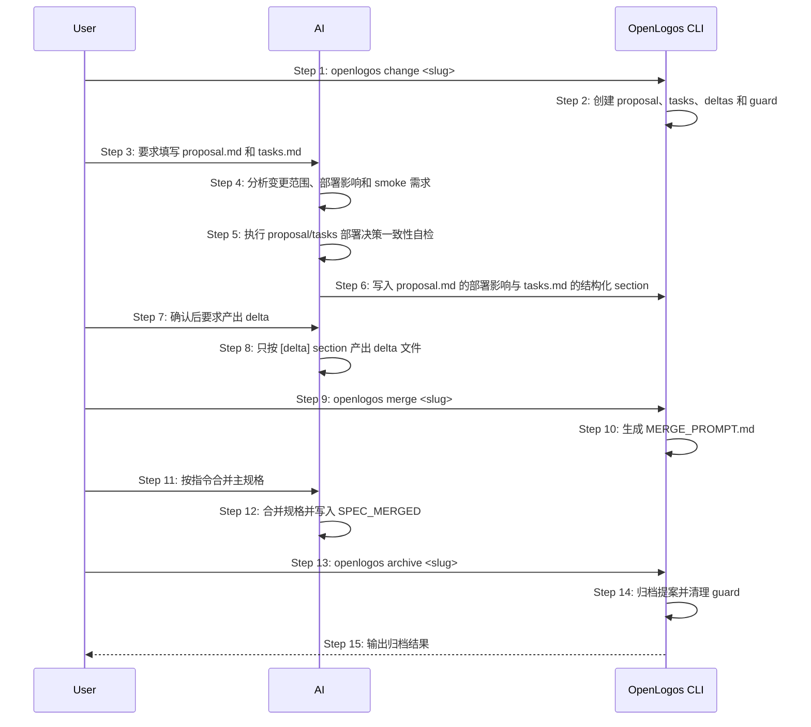
```mermaid
sequenceDiagram
    participant U as User
    participant A as AI
    participant C as OpenLogos CLI

    U->>C: Step 1: openlogos change <slug>
    C->>C: Step 2: 创建 proposal、tasks、deltas 和 guard
    U->>A: Step 3: 要求填写 proposal.md 和 tasks.md
    A->>A: Step 4: 分析变更范围、部署影响和 smoke 需求
    A->>A: Step 5: 执行 proposal/tasks 部署决策一致性自检
    A->>C: Step 6: 写入 proposal.md 的部署影响与 tasks.md 的结构化 section
    U->>A: Step 7: 确认后要求产出 delta
    A->>A: Step 8: 只按 [delta] section 产出 delta 文件
    U->>C: Step 9: openlogos merge <slug>
    C->>C: Step 10: 生成 MERGE_PROMPT.md
    U->>A: Step 11: 按指令合并主规格
    A->>A: Step 12: 合并规格并写入 SPEC_MERGED
    U->>C: Step 13: openlogos archive <slug>
    C->>C: Step 14: 归档提案并清理 guard
    C-->>U: Step 15: 输出归档结果
```

## 步骤说明
1. **用户**创建变更提案。
2. **CLI** 建立提案工作区。
3. **用户**要求 AI 填写提案。
4. **AI** 判断本次提案是否需要部署、是否需要 smoke、是否涉及回滚。
5. **AI** 执行 proposal/tasks 部署决策一致性自检。
6. **AI** 写入 `proposal.md` 的 `## 部署影响`，并让 `tasks.md` 的 `[deploy]` section 与部署决策一致。
7. **用户**确认提案后才进入 delta-writing。
8. **AI** 只产出 `[delta]` section 对应的 delta 文件。
9. **用户**明确授权执行 merge。
10. **CLI** 生成 MERGE_PROMPT。
11. **用户**要求 AI 执行合并流程。
12. **AI** 合并主规格并写入 SPEC_MERGED。
13. **用户**在 verify / deploy / smoke 门禁完成后请求归档。
14. **CLI** 归档并释放 guard。
15. **CLI** 输出结果。

## proposal_step 判定来源（flow-derive）

S09 变更生命周期各步骤展示的 `proposal_step`（`status` / `next` 共享）自 M1 切片 B2 起，
由 `cli/src/lib/flow-derive.ts` 新增的 `detectProposalStepViaFlow(proposalDir, moduleDefaults)`
基于**内置（builtin）launched flow**（`spec/flow/launched.yaml`）派生，取代原硬编码的
`detectProposalStep` 状态机调用点。输出与旧 `detectProposalStep` **逐态一致（1:1 不改行为）**，
`cli-json-output` 的 `proposal_step` 枚举契约保持不变。

派生为「**节点序列声明化 + 规则仍在引擎**」：

- **节点序列声明化**：`launched.yaml` 提供 propose → merge → implement → deliver → close 的
  节点顺序与各节点 `done_when` / `fail_when`（`proposal_package_filled`（writing 离场）/
  `section_complete:delta`（delta-writing → ready-to-merge）/
  `any_present:[MERGE_PROMPT_GENERATED, MERGE_PROMPT.md]`（merge-generated）/
  `any_present:[SPEC_MERGED, MERGED]`（coding 离场）/ `section_complete:code`（coding → ready-to-verify）/
  `marker:VERIFY_PASS`、`fail_when: marker:VERIFY_FAIL` / `marker:DEPLOY_DONE` /
  `marker:SMOKE_PASS`、`fail_when: marker:SMOKE_FAIL` / `archived`）。
- **marker 非对称优先级（引擎规则保留，不下沉 flow）**：`VERIFY_FAIL` 全局最先判定（先于
  template / merge / deploy）；`SMOKE_FAIL` / `SMOKE_PASS` **不是全局优先**——仅在 `VERIFY_PASS`
  成立、需部署、`DEPLOY_DONE` 存在且 deploy 任务全勾后的 deploy 子块内评估，否则仍停
  `ready-to-deploy`。
- **提案级部署决策（引擎规则保留）**：deliver 子流程的 `deployment_required` / `smoke_required`
  及决策冲突阻塞继续由 `resolveProposalDeploymentDecision` 依据 `proposal.md` 的 `## 部署影响`
  与 `tasks.md` 的 `[deploy]` section 求解（提案级，不回退模块默认）；EX-5.1 部署决策冲突
  行为不变（冲突时停 `verify-passed`，不推进 deploy/smoke/archive）。
- **section 完成语义按 legacy**：`section_complete:<tag>` 实现为 `total > 0 && checked === total`，
  present-but-empty 的 `[delta]`/`[code]` 不算完成（不采用 flow-spec §184 字面"全部勾选或不存在"）。

`detectProposalStep` 仍是状态计算的单一语义来源——B2 只是把它的节点序列改为 flow 声明驱动，
不改各态判定结果。并跑等价由测试期「ViaFlow == 旧 detectProposalStep」断言锁定
（见 `core-S09-test-cases`）。

## 纯代码提案（无 `[delta]`）派生：no-delta spec-complete 后进入 slice/implement

纯代码级修复提案（`tasks.md` 无 `## [delta]` section）在生命周期派生上与常规提案的差异是：不进入 `write-delta`，但仍必须完成 spec-complete 留痕。`openlogos merge <slug>` 在无 delta 时执行 no-op merge 并写入 `SPEC_MERGED`，表示 no-delta spec-complete。

**关键不变量**：

1. `delta_required==false` 时，本生命周期**绝不**产出 `proposal_step=="delta-writing"`，前沿**绝不**为 `write-delta`。
2. `delta_required==false` 不再等价于“spec/merge 已完成”。缺少 `SPEC_MERGED` / `MERGED` 时，代码提案必须停在 `spec-complete-required`。
3. 只有 no-delta `SPEC_MERGED` 在场且真实测试 ID 稳定时，才可进入 `ready-to-implement` / `plan-slices`。

派生路径：

- `writing`（proposal/tasks 未脱模板） →（plan 门批准）→ `spec-complete-required`（提示执行 `openlogos merge <slug>`；无 delta 时写 no-delta `SPEC_MERGED`）→ `test-id-required`（若缺真实测试 ID）→ `ready-to-implement`（前沿 `plan-slices`）→ `slice-exit` 门 → `coding`（前沿 `code`）→ `ready-to-verify` → …

**前置协同**：纯代码提案 `tasks.md` 仍必须保留空 `## [code]` 标题，用于表达 `code_required==true` 和后续切片承载区。该标题不代表切片已规划，切片仍由 no-delta spec-complete 后的 `slice-planner` 统一写入。

### EX-9.1: 纯代码提案（无 `[delta]`）被误派 write-delta

- **触发条件**：launched 生命周期、活跃提案 `tasks.md` 无 `## [delta]` section（纯代码级修复），经 plan 门后派生。
- **期望响应**：若无 `SPEC_MERGED` / `MERGED`，`proposal_step=="spec-complete-required"`，`next_node.id` 不为 `write-delta` 且不为 `plan-slices`；若已有 no-delta `SPEC_MERGED` 且测试 ID 稳定，则派生为 `ready-to-implement` / `plan-slices`。
- **副作用**：不改变有 `[delta]` 常规提案的派生（仍 `delta-writing → ready-to-merge → merge-generated → …`）。

### EX-9.2: no-delta merge 写入 spec-complete marker

- **触发条件**：提案无 `[delta]` section，执行 `openlogos merge <slug>`。
- **期望响应**：CLI 不生成 `MERGE_PROMPT.md`，直接写入 `SPEC_MERGED`；新写入内容包含 `type:"no_delta_spec_complete"`、`reason`、`completed_at`。
- **副作用**：重复执行 merge 幂等返回已完成，不覆盖已有 marker。

## 异常用例
### EX-5.1: 部署决策与 tasks 冲突
- **触发条件**：`proposal.md` 声明无需部署但 `tasks.md` 存在 `[deploy]` section，或声明需要部署但缺少 `[deploy]` section。
- **期望响应**：`status` / `next` 输出冲突警告，AI 在修正前不得执行部署。

## SessionStart guard 范围与变更生命周期联动

S09 的 change/merge/archive 生命周期不仅约束 CLI 文件产物，也约束 AI 宿主在会话启动时注入给模型的写入边界。已创建 guard 时，SessionStart 文案必须根据当前提案状态输出阶段化范围：

- `writing`：仅填写 `proposal.md` 与 `tasks.md`，不得写 delta 或源码。
- `ready-to-delta`：提示方案待批准；用户批准后才进入 delta 产出。
- `delta-writing`：只按 `[delta]` section 写入 `deltas/**`，并在每个 delta 完成后勾选 `tasks.md` 中对应 `[delta]` 任务；不得直接改 `logos/resources/**`。
- `ready-to-merge`：停止写 delta，提示用户明确授权 `openlogos merge <slug>`。
- `merge-generated`：按 `MERGE_PROMPT.md` 合并主规格，完成后写入 `SPEC_MERGED`。
- `coding`：按已合并规格执行 `[code]` section，允许修改源码、测试和 reporter，并同步勾选 `tasks.md`。

该约束的核心是不再把“active change proposal 的 scope”落成 `logos/changes/<slug>/proposal.md` 单文件路径。`proposal.md` 是提案描述文档，不是整个变更工作区的唯一可写文件；delta-writing 阶段的真实写入面是 `logos/changes/<slug>/deltas/**` 与 `tasks.md`。

异常用例：

### EX-7.1: SessionStart 将 active guard 误收窄到 proposal.md
- **触发条件**：项目处于 launched 生命周期，存在 active guard，提案已进入 `delta-writing`。
- **期望响应**：SessionStart 注入文案必须明确允许写入 `logos/changes/<slug>/deltas/**` 并更新 `tasks.md`，不得输出“Only modify files within the scope of logos/changes/<slug>/proposal.md”。
- **副作用**：不改变 guard 文件格式，不改变 `openlogos change` / `openlogos merge` / `openlogos archive` 的确认点。

## proposal/tasks 写完后的 final 前前沿校验

AI 或 driver 在 `writing` 阶段完成 `proposal.md` 与 `tasks.md` 后，不能只因为文件已写入就直接 final 并让外层流程自行猜测下一步。必须在结束本工作单元前确认当前前沿，避免把 plan gate 待消费态误报为 blocked。

执行约束：

1. 完成 `proposal.md` 与 `tasks.md` 后，应读取或消费 OpenLogos 机器状态，确认 `proposal_step` 已从 `writing` 推进到 `ready-to-delta` 或后续状态。
2. 半自动模式下，final 必须明确“方案已完成，等待授权执行 `openlogos merge` 前的 delta-writing / plan gate 流程”，不得把 `tasks.md` checkbox 未勾显示成规划失败。
3. 全自动模式下，driver 应继续消费 `next --auto` 对 `plan-exit` 的放行结果；当响应包含 `gate_auto_passed=true`、`PLAN_APPROVED` 已写入语义和 `next_node.id=="write-delta"` 时，必须继续派发 change-writer 写 delta。
4. 若读取到 `proposal_step=writing`，说明 proposal/tasks 仍未脱模板或结构冲突，AI 必须修正当前文件后再结束；不得输出“已完成”。
5. 若读取到 `proposal_step=ready-to-delta` 且 `tasks_execution_done=0`，应解释为“delta 任务尚未执行”，不是“任务规划失败”。

该校验只要求消费 OpenLogos 已有状态或本提案新增的结构化诊断，不要求 change-writer 自行执行 `openlogos merge`。被派发的 change-writer 仍在产出 delta 后停手，把 merge 权限交给用户或全自动 driver。

### EX-7.2: proposal/tasks 已完成但 driver 误判为任务规划失败

- **触发条件**：`proposal.md` / `tasks.md` 已脱模板，`proposal_step=ready-to-delta`，`tasks.md` 的 `[delta]` checkbox 为 `0/N`。
- **期望响应**：status / next / SessionStart / driver 诊断均表达“plan ready + plan gate pending + delta execution 0/N”，不得输出任务规划失败；全自动 driver 应继续消费 plan gate 并派发 `write-delta`。
- **副作用**：不改变 delta-writing 对 `tasks.md` checkbox 的真实勾选语义。

## GUI UI-first 前移的变更生命周期扩展

> 适用范围：仅对已 `launched` 的 **GUI 产品项目**（网站 / 桌面应用 / 移动 App）且本次变更 `ui_impact:true` 时启用。非 GUI 项目（纯 CLI / API / Skills）本扩展整体不启用，S09 主时序图与步骤说明零改动。

本扩展在**不新增门态、不新增确认标记**的前提下，把 GUI 界面确认前移到既有的「批准提案」（`plan-exit`）门。核心变化：GUI 原型成为 **plan 节点的正式产物**，由 driver 在 **plan-exit 门前** 派发 change-writer（用 `ui-ux-pro-max`）产出；用户批准提案的动作在**面板已渲染原型的前提下**即构成 UI 视觉确认；merge 前用 hash 校验防止批准后原型漂移。原型**复用现有 delta 路径映射**（`deltas/prd/2-product-design/2-page-design/*.html` → `logos/resources/prd/**`）落入原型图文件夹——**不新增 `ui/` 目录**；但原型落盘**不经由 merge 拷贝步骤**，而由专用事务落盘入口 **`commitVerifiedPrototypes()`** 完成（严格模式下先做 hash 校验、再原子提交），**merge-executor 绝不触碰原型资产**。

### 扩展时序（plan 节点内 dispatch → 产原型 → plan-exit 渲染确认 → merge 前 hash 校验）

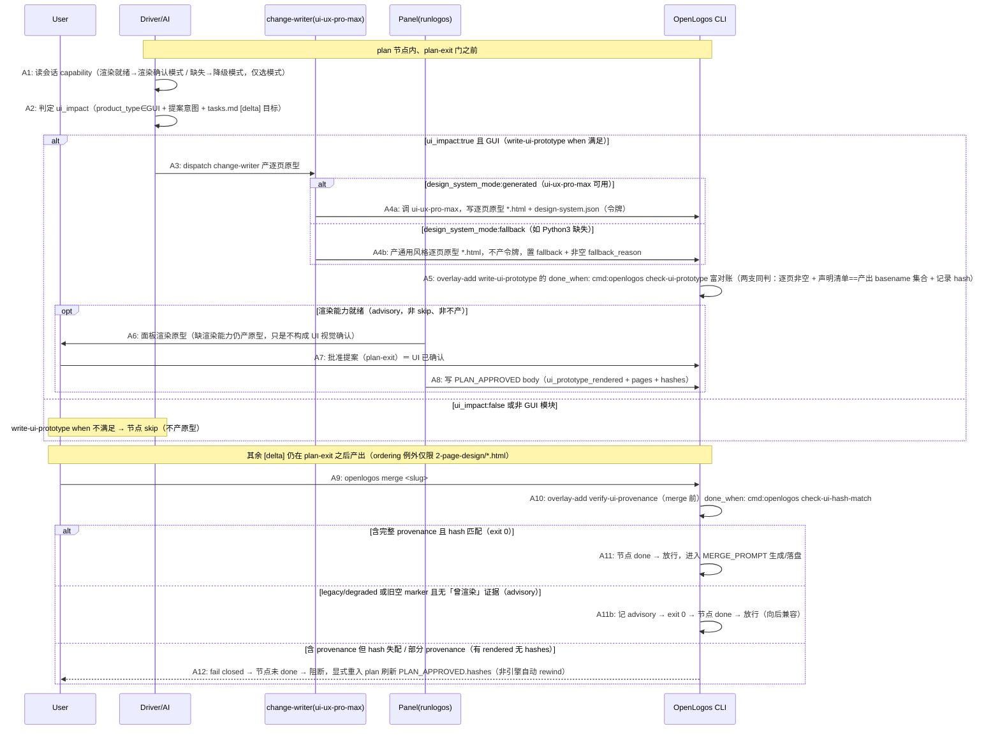
```mermaid
sequenceDiagram
    participant U as User
    participant D as Driver/AI
    participant CW as change-writer(ui-ux-pro-max)
    participant P as Panel(runlogos)
    participant C as OpenLogos CLI

    Note over D,C: plan 节点内、plan-exit 门之前
    D->>D: A1: 读会话 capability（渲染就绪→渲染确认模式 / 缺失→降级模式，仅选模式）
    D->>D: A2: 判定 ui_impact（product_type∈GUI + 提案意图 + tasks.md [delta] 目标）
    alt ui_impact:true 且 GUI（write-ui-prototype when 满足）
        D->>CW: A3: dispatch change-writer 产逐页原型
        alt design_system_mode:generated（ui-ux-pro-max 可用）
            CW->>C: A4a: 调 ui-ux-pro-max，写逐页原型 *.html + design-system.json（令牌）
        else design_system_mode:fallback（如 Python3 缺失）
            CW->>C: A4b: 产通用风格逐页原型 *.html，不产令牌，置 fallback + 非空 fallback_reason
        end
        C->>C: A5: overlay-add write-ui-prototype 的 done_when: cmd:openlogos check-ui-prototype 富对账（两支同判：逐页非空 + 声明清单==产出 basename 集合 + 记录 hash）
        opt 渲染能力就绪（advisory，非 skip、非不产）
            P->>U: A6: 面板渲染原型（缺渲染能力仍产原型，只是不构成 UI 视觉确认）
            U->>C: A7: 批准提案（plan-exit）＝ UI 已确认
            P->>C: A8: 写 PLAN_APPROVED body（ui_prototype_rendered + pages + hashes）
        end
    else ui_impact:false 或非 GUI 模块
        Note over D,U: write-ui-prototype when 不满足 → 节点 skip（不产原型）
    end
    Note over C,U: 其余 [delta] 仍在 plan-exit 之后产出（ordering 例外仅限 2-page-design/*.html）
    U->>C: A9: openlogos merge <slug>
    C->>C: A10: overlay-add verify-ui-provenance（merge 前）done_when: cmd:openlogos check-ui-hash-match
    alt 含完整 provenance 且 hash 匹配（exit 0）
        C->>C: A11: 节点 done → 放行，进入 MERGE_PROMPT 生成/落盘
    else legacy/degraded 或旧空 marker 且无「曾渲染」证据（advisory）
        C->>C: A11b: 记 advisory → exit 0 → 节点 done → 放行（向后兼容）
    else 含 provenance 但 hash 失配 / 部分 provenance（有 rendered 无 hashes）
        C-->>U: A12: fail closed → 节点未 done → 阻断，显式重入 plan 刷新 PLAN_APPROVED.hashes（非引擎自动 rewind）
    end
```

### 扩展步骤说明

- **A1 模式选择（plan-exit 之前）**：driver 读会话 capability（`logos/.session-capabilities.json` 的 `ui_prototype_render`）——就绪则进入**渲染确认模式**（要求 provenance + hash），缺失则进入**降级模式**（不 claim UI 确认、advisory 不阻断）。此为 capability 文件的**唯一**合法用途，只用于 plan-exit 之前选模式，绝不作为批准后的完整性门降级开关。
- **A2 判定 `ui_impact`**：在 plan 阶段由 change-writer 依据 **项目 `product_type` + 提案意图 + `tasks.md` 已规划的 `[delta]` 目标**判定，**而非扫描尚不存在的 delta 内容**（避免「先 delta 还是先原型」循环依赖）。`tasks.md` `[delta]` 命中 `2-page-design/` 或含交互变更的 feature-specs，即强制判为「动了界面」。`ui_impact` 为**可派生 when-flag**（派生方式仿 `delta_required`，从 `proposal.md` 的「UI/UX 变更声明」段推导，`ui_impact:true` 且 `product_type∈GUI` 才为真）。
- **A3–A4 producer dispatch（授权同「写 proposal.md / tasks.md」，无新授权；按 `design_system_mode` 拆两支）**：driver 在 plan 节点派发 change-writer 产出逐页原型，producer 责任 = **优先调用 `ui-ux-pro-max`；不可用（如 Python3 缺失）时按 fallback 契约兜底**——绝不因渲染 / 令牌能力缺失而永久卡死：
  - **A4a `generated`（ui-ux-pro-max 可用）**：调用 `ui-ux-pro-max` 产出逐页原型 + `design-system.json`（审计令牌），声明段置 `design_system_mode: generated`。
  - **A4b `fallback`（如 Python3 缺失）**：产出**通用风格**逐页原型、**不产令牌**，声明段置 `design_system_mode: fallback` + **非空** `design_system_fallback_reason`（如「Python3 缺失」）；**禁止伪造 `design-system.json`**。
  - **两支同做**：原型作为 page-design delta 直接写入 `deltas/prd/2-product-design/2-page-design/core-NN-<slug>.html`；写入由 guard 的 **plan 阶段 allowlist（仅放行 `2-page-design/*.html`）** 授权，其余 `deltas/**` 在 plan 阶段仍禁止写入。
- **正交三事（不得混淆）**：① `ui_impact:false` / 非 GUI 模块 → `write-ui-prototype` 的 `when` 不满足 → 节点 **skip（不产原型）**；② 渲染 capability 缺失 → **仍产原型**（generated 或 fallback），只是批准不构成 **UI 视觉确认**（advisory，非 skip、非不产）；③ Python3 缺失 → 走 **A4b fallback**（仍产通用原型，只是不产令牌）。**capability 缺失绝不并入 `ui_impact:false` 分支。**
- **A5 overlay-add `write-ui-prototype` 收敛（`done_when: cmd:<check-ui-prototype>`）**：该节点为方法论给 GUI 项目注入的 **overlay `op:add` 节点**（`after: write-tasks`、落在 plan subflow 内、plan-exit 门前），故**合法使用 `cmd:` 谓词**做富对账。`<check-ui-prototype>` 在 delta 文本中仅为占位示意，**运行时 overlay 资产使用真实子命令 `openlogos check-ui-prototype`**（自解析活跃提案，`exit 0` / 非 0）。收敛判据**按 `design_system_mode` 分档、两支共通**：UI/UX 变更声明段**声明的每一页**在 `2-page-design/` 下都有**对应非空原型文件**、**声明清单 basename 集合 == 产出文件 basename 集合**、并记录内容 hash；仅 `generated` 支**额外**要求存在合法非空 `design-system.json`，`fallback` 支**不要求令牌**但要求非空 `design_system_fallback_reason`。命令 `exit 0` 才 done、plan 子流程才完成、plan-exit 门才可放行。builtin `launched.yaml` **不硬编码** UI 节点。
- **A6–A7 批准即 UI 确认（前提=面板已渲染原型）**：「批准 == UI 已确认」**仅当面板实际渲染了原型时成立**。在不渲染的旧面板上，批准只是普通方案批准、**不构成 UI 视觉确认**（方法论给 advisory、不阻断）。**不新增门态、不新增确认标记**——复用现有 `plan-exit` 门。
- **A8 provenance 写入（既有批准事件上的溯源属性）**：渲染面板 / driver 在批准时向 `PLAN_APPROVED` marker 的**可选 JSON body** 写入 `{ ui_prototype_rendered: true, pages: [...], hashes: { "<file>": "<sha256>" } }`。由**用户批准动作本身授权**（同一次点击），无独立授权。`PLAN_APPROVED` 的**存在性语义完全不变**（空 marker 仍合法、仅存在性读取者不受影响），provenance 是向后兼容的可选叠加字段。
- **A9–A12 merge 前 `verify-ui-provenance`（`done_when: cmd:<check-ui-hash-match>`）**：overlay-add 节点，置于 merge 之前（`before: generate-merge-prompt`、`when: ui_impact`），在原型落盘 resources **之前**拦截漂移。`<check-ui-hash-match>` 在 delta 文本中仅为占位示意，**运行时 overlay 资产使用真实子命令 `openlogos check-ui-hash-match`**（自解析活跃提案，`exit 0` / 非 0）。命令按 `PLAN_APPROVED` 内容**三分支**判定（不再是两果，避免旧空 marker 的 GUI 提案永久卡死）：
  - **含完整 provenance（`ui_prototype_rendered:true` + `pages` + `hashes`）**：重算 `2-page-design/` 现值 hash 与 `PLAN_APPROVED.hashes` 比对——**匹配 `exit 0` → 节点 done → 放行前进**；**失配非 0 → 节点未 done → 前向阻断（fail closed）**。
  - **legacy/degraded 或旧空 marker 且无任何「曾渲染确认」证据**（GUI `ui_impact:true` 但批准发生在旧不渲染面板上）：**记 advisory 后 `exit 0` → 节点 done → 放行**（F3 向后兼容，不因缺 provenance 永久阻断）。
  - **部分 provenance（有 `ui_prototype_rendered:true` / rendered 证据但缺 `hashes`）**：**fail closed 非 0 → 节点未 done → 阻断**（曾走渲染确认路径却无完整 hash，不得降级放行）。
  - 因 flow 引擎前向线性、无跨 subflow 自动回退边，「退回 plan-exit」**非引擎自动 rewind**，而是 driver / 人工**显式重入 plan**（重跑 producer 产原型 + plan-exit 重批、刷新 `PLAN_APPROVED.hashes`），再到该节点 hash 匹配 `exit 0` → done → 放行。

### ordering 例外与 flow-derive 判据（补充）

- **ordering 例外仅限 `2-page-design/*.html`**：GUI page-design 原型是 plan 节点产物，可在 plan-exit **之前**产出；其余所有 `deltas/**` 仍严格在 plan-exit **之后**产出。
- **flow-derive 不因原型 delta 误判进入 spec**：`flow-derive.ts` 识别 plan subflow 新增的原型节点，仅当出现**非原型的规格 delta**、或 plan-exit 已放行时才视为进入 spec；例外仅限 `2-page-design/*.html` 叶子原型，不涉及 `[code]` 切片与 spec-merge 依赖。

### EX-9.3: 批准后漂移的原型被 verify-ui-provenance / merge 拒绝

- **触发条件**：`ui_impact:true` 的 GUI 提案已在渲染面板上批准（`PLAN_APPROVED` 含 `ui_prototype_rendered:true` + `pages` + `hashes`），随后 `2-page-design/` 下某原型文件内容被改动（批准后漂移），再执行 `openlogos merge <slug>`。
- **期望响应**：merge 前 `verify-ui-provenance` 的 `done_when: cmd:<check-ui-hash-match>` 重算现值 hash 与 `PLAN_APPROVED.hashes` 比对，**失配非 0** → 节点未 done → **前向阻断**；`openlogos merge` 命令级 pre-merge hash gate 亦**拒绝 merge（非零退出、明确错误、不生成 `MERGE_PROMPT`）**。无论经 driver 流还是直接 CLI 调用都不可绕过。remediation = 显式重入 plan 重跑 producer + plan-exit 重批、刷新 `PLAN_APPROVED.hashes`。
- **副作用**：不新增门态 / 不新增确认标记（复用 `plan-exit` 门的「批准内容变更即批准失效」完整性语义）；不改变 `ui_impact:false` 或纯 CLI/API/Skills 提案的既有派生与 merge 行为。

### EX-9.4: 跨会话降级绕过被持久化 provenance 拦截

- **触发条件**：渲染就绪会话写了带 `hashes` 的 `PLAN_APPROVED` → 原型被改动 → 删除 `logos/.session-capabilities.json` 并重启进程（新 CLI-only 会话，capability 文件缺失）→ 直接 `openlogos merge <slug>`。
- **期望响应**：严格性以**持久化 `PLAN_APPROVED` provenance 为键**，而非消费时易失会话 capability。批准记录含 UI provenance ⇒ merge / 落盘 / 落盘后复核入口**永久 fail closed**：**必须拒绝**，不得生成 `MERGE_PROMPT` / 写 resources / 写 `SPEC_MERGED`；当前会话 capability 文件缺失一律不得降级。对照组「旧空 marker、无任何『曾渲染确认』证据的纯 CLI 项目」仍走 F3 向后兼容 advisory 放行。
- **副作用**：`.session-capabilities.json` 仅用于 plan-exit **之前**的模式选择；plan-exit **之后**的强制语义一律以 `PLAN_APPROVED` 为准。三处判据（提示前 / 落盘时 / 落盘后）一致，避免复用同一「capability 缺失即降级」分支而一致放行。

### EX-9.5: 旧面板空批准 marker 的 GUI 提案经 verify-ui-provenance advisory 放行

- **触发条件**：GUI 产品项目、本次 `ui_impact:true`，但批准发生在**旧不渲染面板**上——`PLAN_APPROVED` 为**空 marker**（存在即门已过，但无 `ui_prototype_rendered` / `pages` / `hashes` 任何 provenance body、无任何「曾渲染确认」证据）。随后 `openlogos merge <slug>`。
- **期望响应**：merge 前 `verify-ui-provenance`（`openlogos check-ui-hash-match`）落入**第三分支（legacy/degraded 且无「曾渲染」证据）**——**记 advisory 后 `exit 0` → 节点 done → merge 可达**，不因缺 provenance 永久卡死（F3 向后兼容，方法论仅提示「本次批准未构成 UI 视觉确认」而不阻断）。
- **对照组（fail closed，不放行）**：批准记录**含 rendered 证据但缺 `hashes`（部分 provenance）** → 曾走渲染确认路径却无完整 hash → **非零退出 → 节点未 done → 阻断**，不得降级放行；须显式重入 plan 刷新 `PLAN_APPROVED.hashes` 后方可前进。
- **副作用**：不新增门态 / 不新增确认标记；三分支判据（含完整 provenance 校 hash / legacy 空 marker advisory / 部分 provenance fail closed）与 2.26.9 的持久化键语义一致；不改变 `ui_impact:false` 或纯 CLI/API/Skills 提案的既有行为。

### EX-9.6: 多模块无 core 未传 --module 的 change 静默挂靠 modules[0]（issue #17）

- **触发条件**：多模块项目、`modules[]` 无 `id: core`，用户执行 `openlogos change <slug>` 未传 `--module`。
- **旧缺陷**：`resolveModule()` 回退 `modules[0]`（`change.ts:30-32`），并以 `change.moduleDefault` 文案声称「默认挂靠 core」，实际挂到首模块；错误 `module` 写入 `.openlogos-guard` 与 `proposal.md` 头 `> module:`，到 `change-lint` / `status` / `next` / 模块级门禁才暴露。
- **期望响应**：`resolveModule()` 对该分支 **fail-closed**——打印错误（原因 + **每个合法 module id 各一条完整可执行的重试命令**：以实际 slug + 该 id 组成 `openlogos change <实际slug> --module <该id>`，按 `modules[]` 顺序、**不含字面 `<id>` 占位符**）、`en`/`zh` 两套文案、**非零退出**，**不回退 `modules[0]`**。
- **原子性**：解析在**创建 change 目录 / 写 proposal / tasks / deltas / guard 之前**执行（与既有「提案已存在」「guard 冲突」前置校验同位置），失败不残留任何半成品。
- **不变量**：解析结果（`.openlogos-guard.module` 与 `proposal.md` `> module:`）与用户显式选择或唯一确定的模块一致；YAML `modules[]` 顺序不承载归属语义。
- **零回归**：显式 `--module` / 单模块自动挂靠 / 多模块含 core 默认挂靠三条路径行为不变；`change.moduleDefault` 文案修正后，`归属模块：{module}` 与括号说明指同一模块。
- **决策依据**：见 `logos/resources/decisions/core-D01-change-module-fail-closed.md`（fail-closed 不变量、否决 modules[0]、暂不引入 default_module）。

## Windows 外部归档 watcher 握手时序（win32-archive-watcher-handshake）

仅当 `process.platform === 'win32'` 且用户从外部终端执行 `openlogos archive <slug>` 时，Step 13→14 之间插入以下有界握手；非 Windows 平台此段完全不执行，直接走既有 rename 归档。

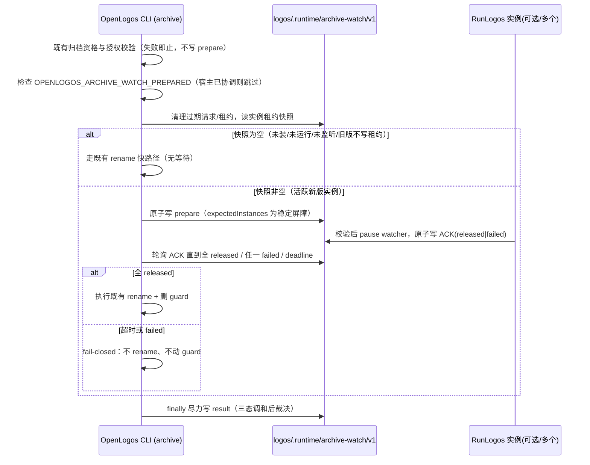
```mermaid
sequenceDiagram
    participant CLI as OpenLogos CLI (archive)
    participant RT as logos/.runtime/archive-watch/v1
    participant RL as RunLogos 实例(可选/多个)
    CLI->>CLI: 既有归档资格与授权校验（失败即止，不写 prepare）
    CLI->>CLI: 检查 OPENLOGOS_ARCHIVE_WATCH_PREPARED（宿主已协调则跳过）
    CLI->>RT: 清理过期请求/租约，读实例租约快照
    alt 快照为空（未装/未运行/未监听/旧版不写租约）
        CLI->>CLI: 走既有 rename 快路径（无等待）
    else 快照非空（活跃新版实例）
        CLI->>RT: 原子写 prepare（expectedInstances 为稳定屏障）
        RL->>RT: 校验后 pause watcher，原子写 ACK(released|failed)
        CLI->>RT: 轮询 ACK 直到全 released / 任一 failed / deadline
        alt 全 released
            CLI->>CLI: 执行既有 rename + 删 guard
        else 超时或 failed
            CLI->>CLI: fail-closed：不 rename、不动 guard
        end
    end
    CLI->>RT: finally 尽力写 result（三态调和后裁决）
```

### EX-10.1: Windows 外部归档无活跃监听走快路径
- **触发条件**：Windows 平台，runtime 目录不存在或快照无「未过期+projectId 匹配+capabilities 含 prepare」的活跃实例（未装/未运行/未监听/旧版不写租约）。
- **期望响应**：不写 prepare、不等待，直接 rename 归档；runtime 缺失视为空快照的正常路径，不作为错误。

### EX-10.2: Windows 归档握手成功后才 rename
- **触发条件**：Windows 平台，快照存在一或多个活跃实例，全部在 deadline 前 ACK released。
- **期望响应**：released 前 rename 次数=0；全 released 后才 rename 与删 guard；随后写 archived result。多实例须全部 released 才放行。

### EX-10.3: Windows 归档握手超时或实例失败 fail-closed
- **触发条件**：Windows 平台，已写 prepare，但 deadline 前未收齐 released 或任一 ACK failed。
- **期望响应**：不 rename、不删 guard、不改状态；返回 `ARCHIVE_WATCH_ACK_TIMEOUT`/`ARCHIVE_WATCH_INSTANCE_FAILED` 与脱敏诊断；尽力写 cancelled/not-archived result。

### EX-10.4: Windows 归档遇不可协调监听者
- **触发条件**：Windows 平台，(a) 旧版 RunLogos 持句柄但不写租约，走快路径时 rename 抛 EPERM/EACCES/EBUSY；或 (b) 租约可见但 capabilities 不含 prepare、或协议主版本高于本 CLI 认知。
- **期望响应**：均 fail-closed（不 rename、不动 guard、不自动重试）：(a) 提示「可能有旧版 RunLogos 或其他程序正在监听，请升级或关闭后重试」；(b) 提示「检测到能力不足或更高版本的 RunLogos，请升级 openlogos CLI 或关闭该实例」。

### EX-10.5: 宿主已协调时去递归跳过握手
- **触发条件**：Windows 平台，RunLogos spawn CLI 时注入 `OPENLOGOS_ARCHIVE_WATCH_PREPARED=<token>`。
- **期望响应**：仅当 token 结构有效、cwd/projectId 与绑定项目一致、slug 一致、未过期时跳过握手直接 rename；任一不满足则不跳过；无长期全局逃生开关。

### EX-10.6: CLI 崩溃 result 缺失的三态调和
- **触发条件**：Windows 平台，CLI 在 rename 前后崩溃致 result 缺失，或命令报错但磁盘已完成 rename。
- **期望响应**：CLI 重跑与 RunLogos 均以 live/archive/guard 三态裁决——live 仍在则可恢复，已归档则调和为成功并标记 `reconciledFromDisk`，矛盾则 fail-closed 保留诊断；不凭 exitCode/status 反转磁盘真相。

### EX-10.7: 非 Windows 平台不启用握手协议
- **触发条件**：平台为 macOS 或 Linux。
- **期望响应**：archive 不创建/读取/监听协议文件、不校验 token、不增加等待，逐字节沿用原 archive 路径；无论 CLI/RunLogos 版本新旧。

## S39 按触达闭包接入 S09 change 生命周期

### 扩展时序

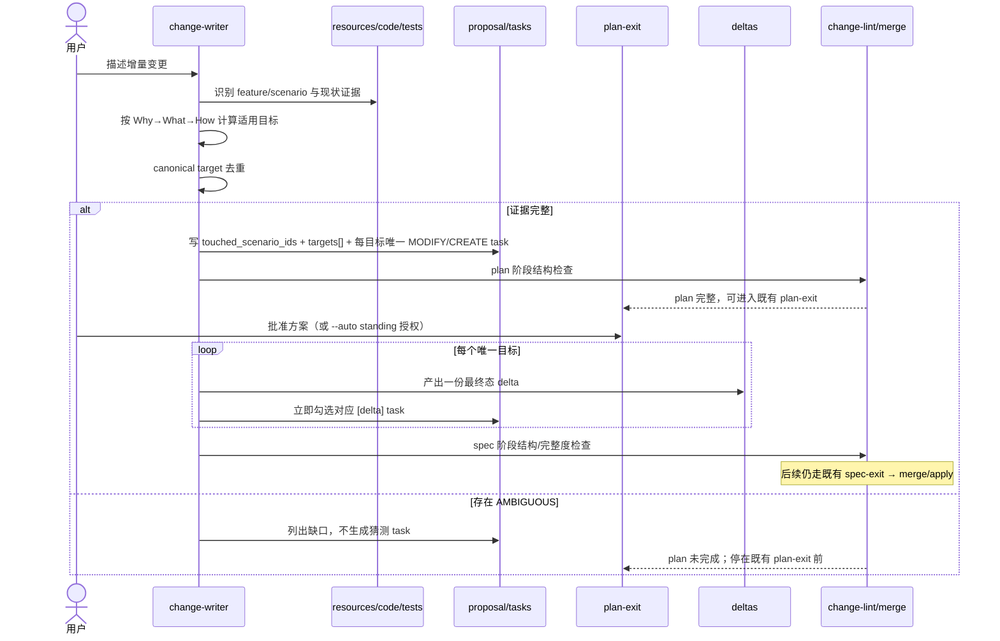
```mermaid
sequenceDiagram
    actor U as 用户
    participant CW as change-writer
    participant R as resources/code/tests
    participant T as proposal/tasks
    participant G as plan-exit
    participant D as deltas
    participant L as change-lint/merge

    U->>CW: 描述增量变更
    CW->>R: 识别 feature/scenario 与现状证据
    CW->>CW: 按 Why→What→How 计算适用目标
    CW->>CW: canonical target 去重
    alt 证据完整
        CW->>T: 写 touched_scenario_ids + targets[] + 每目标唯一 MODIFY/CREATE task
        CW->>L: plan 阶段结构检查
        L-->>G: plan 完整，可进入既有 plan-exit
        U->>G: 批准方案（或 --auto standing 授权）
        loop 每个唯一目标
            CW->>D: 产出一份最终态 delta
            CW->>T: 立即勾选对应 [delta] task
        end
        CW->>L: spec 阶段结构/完整度检查
        Note over L: 后续仍走既有 spec-exit → merge/apply
    else 存在 AMBIGUOUS
        CW->>T: 列出缺口，不生成猜测 task
        L-->>G: plan 未完成；停在既有 plan-exit 前
    end
```

### 生命周期不变量

1. S39 是 S09 `write-tasks`/`write-delta` 节点内部职责，不新增 baseline 子流程、flow node、proposal_step、gate 或 marker。
2. 用户确认点仍只有既有 plan-exit；不会针对每个缺失目标弹出 JIT 确认。
3. plan-exit 前只规划 delta；批准后才写 Markdown delta，GUI 原型的既有 plan allowlist 例外不变。
4. 一目标一 task；每产出一文件立即勾选；全部 `[delta]` 勾满才进入 ready-to-merge。
5. `[code]` 在 plan/spec 阶段继续留空，merge 后由 slice-planner 根据真实测试 ID 规划。
6. `CREATE` 只表示目标起初缺失，实际 delta 仍使用 `ADDED`；merge 时目标存在性漂移即 fail-closed。
7. proposal `P` 与 tasks `T` 在 plan 必须集合相等；spec/merge 再要求 deltas `D` 与二者相等。touched scenario 维度完备独立校验，不能用已有 task 自证无遗漏。

### baseline-seed 与活跃 change 的优先级

- 恢复门确认无未终结 journal或已成功恢复后，无活跃提案时 required/安全 partial/seeded 均以 change 为主动作。
- 有活跃提案时，S09 proposal_step/next_node 优先；仅安全 open run/未提交 staging 的重试信息可作为非阻断诊断。
- seed 私有 staging 不进入 S09 当前规格事实；已提交 fresh seed 只作 S39 扫描线索。未终结 journal 无法恢复时硬报 `baseline_commit_in_progress`，禁止读取半新 resources/index 后继续 S09。

### 异常分支

#### EX-39.1 同一目标被规划两次

两个场景同时命中 `deltas/test/core-S12-test-cases.md` 时，按 canonical target 聚合为一条 task；未聚合则 L9 `delta_target_duplicate` 阻断 plan。

#### EX-39.2 模式与磁盘事实漂移

plan 时为 CREATE、spec/merge 时目标已存在，或 plan 时为 MODIFY、目标被删除：不得静默换模式或覆盖；报告 `delta_target_mode_mismatch`，返回 plan/spec 修正。

#### EX-39.3 证据不足

无法判断是否存在持久化/公开接口时标记 AMBIGUOUS，一次性列出缺少的产品选择；这属于现有方案完整性，不创建 JIT baseline 状态。

#### EX-39.4 旧确认机制反向回归

整个路径不得写 `verified:true`、`confirmed_*`，不得输出 baseline advisory/warning，也不得要求“先确认现状再继续”。发现规格错误后走普通新 change。

## Plan 阶段决策澄清时序（clarification@1）

### 主路径：事实扫描、条件触发与逐个澄清

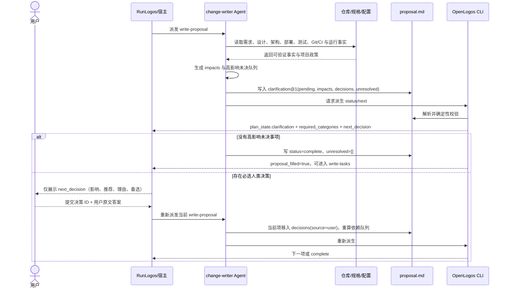
```mermaid
sequenceDiagram
    actor U as 用户
    participant R as RunLogos/宿主
    participant A as change-writer Agent
    participant FS as 仓库/规格/配置
    participant P as proposal.md
    participant C as OpenLogos CLI

    R->>A: 派发 write-proposal
    A->>FS: 读取需求、设计、架构、部署、测试、Git/CI 与运行事实
    FS-->>A: 返回可验证事实与项目政策
    A->>A: 生成 impacts 与高影响未决队列
    A->>P: 写入 clarification@1(pending, impacts, decisions, unresolved)
    A->>C: 请求派生 status/next
    C->>P: 解析并确定性校验
    C-->>R: plan_state.clarification + required_categories + next_decision
    alt 没有高影响未决事项
        A->>P: 写 status=complete、unresolved=[]
        C-->>R: proposal_filled=true，可进入 write-tasks
    else 存在必选人类决策
        R-->>U: 仅展示 next_decision（影响、推荐、理由、备选）
        U-->>R: 提交决策 ID + 用户原文答案
        R->>A: 重新派发当前 write-proposal
        A->>P: 当前项移入 decisions(source=user)，重算依赖队列
        A->>C: 重新派生
        C-->>R: 下一项或 complete
    end
```

### 步骤说明

1. Agent 必须先查事实，只有仓库事实和项目政策无法唯一决定、且会改变风险边界的事项才进入 `unresolved`。
2. Agent 固定填写五类 `impacts`；`none` 需要非空依据，`required` 必须匹配用户决定或产生恰好一个同类别完整 unresolved。缺决定又缺/重复 unresolved 时契约 invalid。
3. 部署是否必选从 proposal 既有部署字段派生，不在 `impacts` 复制；需要部署时必须产生 `deployment` 类决定。
4. CXX 按提案局部递增；Agent 按依赖拓扑、固定类别顺序、CXX 数字顺序稳定排序后持久化。CLI 只展示 `unresolved[0]`，不跳过依赖未满足项；若队首依赖未在 decisions，契约 invalid。
5. CLI 只验证结构、匹配和流程谓词，不调用模型识别自然语言高影响事项。
6. RunLogos 只展示 CLI 输出的完整 `next_decision`，不自行解析 Markdown 或维护第二状态源。
7. 队列清零后 Agent 才能写 `status=complete`；CLI 再结合原有 proposal、部署/UI 结构与必选类别判定 `proposal_filled`。

### 简单直通路径

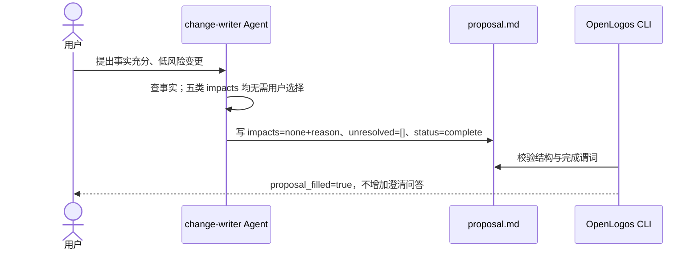
```mermaid
sequenceDiagram
    actor U as 用户
    participant A as change-writer Agent
    participant P as proposal.md
    participant C as OpenLogos CLI

    U->>A: 提出事实充分、低风险变更
    A->>A: 查事实；五类 impacts 均无需用户选择
    A->>P: 写 impacts=none+reason、unresolved=[]、status=complete
    C->>P: 校验结构与完成谓词
    C-->>U: proposal_filled=true，不增加澄清问答
```

### `next --auto` fail-closed 路径

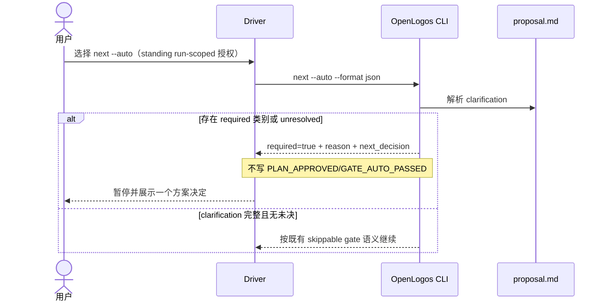
```mermaid
sequenceDiagram
    actor U as 用户
    participant D as Driver
    participant C as OpenLogos CLI
    participant P as proposal.md

    U->>D: 选择 next --auto（standing run-scoped 授权）
    D->>C: next --auto --format json
    C->>P: 解析 clarification
    alt 存在 required 类别或 unresolved
        C-->>D: required=true + reason + next_decision
        Note over C,D: 不写 PLAN_APPROVED/GATE_AUTO_PASSED
        D-->>U: 暂停并展示一个方案决定
    else clarification 完整且无未决
        C-->>D: 按既有 skippable gate 语义继续
    end
```

`--auto` 只能消费仓库事实、项目政策、已记录用户决定和低风险默认值；不得自动选择 recommendation。

### 跨会话恢复

新进程重读 `proposal.md` 后必须得到相同的 status、`required_categories`、未决数量和队首 CXX。宿主易失会话状态缺失不能改变完成判据；若 proposal 区块被破坏，CLI 返回 `clarification-contract-invalid` 并保持 `write-proposal`。

### 异常用例

#### EX-9.7：required 类别没有用户决定

`impacts.compatibility.status=required`，`decisions` 没有 `category=compatibility, source=user`，但存在一个内容完整、依赖已满足的 compatibility unresolved。CLI 返回 `compatibility-clarification-required` 和完整 next_decision，`proposal_filled=false`，人工和 auto 均不能前进。若对应 unresolved 缺失或重复，则改为 `clarification-contract-invalid`，不形成不可恢复 pending。

#### EX-9.8：部署与公开发布错误互认

proposal 需要本地部署且 `public_release=required`，但只有一个 `deployment` 决定。CLI 仍要求 `release` 决定；本地安装授权不能推出 npm/tag/GitHub Release 授权。

#### EX-9.9：Agent 推荐答案冒充用户决定

未决项包含 recommendation，但 Agent 将其以 `source=repository_fact` 移入必选类别 decisions。CLI 判类别未满足并 fail-closed，不写 plan 批准 marker。

#### EX-9.10：结构非法或依赖成环

缺 impacts 字段、空 reason、未知 status、重复 CXX、引用不存在或循环 depends_on、`complete + unresolved 非空` 均返回 `clarification-contract-invalid`，不得回退 legacy 逻辑。

#### EX-9.11：历史 writing proposal 缺区块

历史提案尚未越过 plan 且没有 clarification 区块时，第一版展示 legacy 补齐提示并保持可恢复；change-writer 补入区块后立即启用严格校验。已经越过 plan 的历史提案不得倒退。

#### EX-9.12：未知 clarification 主版本

proposal 含 `openlogos/clarification@2` 时，CLI 原样输出检测到的 schema，归一化为 `status=invalid`、`required=true`、空 required_categories、零未决计数、null next_decision 和 `clarification-upgrade-required`。status/next 响应通过 1.2 输出 Schema，保持 write-proposal；`next --auto` 不写 marker。

### 方案决策与执行授权边界

- `write-proposal` 澄清回答“方案怎么定”。
- `plan-exit` 回答“是否批准完整方案”。
- merge、verify、部署执行、smoke、archive、push 回答“现在是否执行对应动作”。
- 人工模式逐门确认；`next --auto` 可提供既有运行域授权，但永远不能代答未决高影响方案。
- 未收敛代码达到迭代上限仍是不可绕过的硬红线。

## S09 ZCode SessionStart 与 PreToolUse 收敛时序

### 场景目标

ZCode 新会话通过插件级 `SessionStart` 获得与当前 `proposal_step` 一致的 OpenLogos 上下文，并由 `PreToolUse` 在工具真正执行前复用同一决策服务约束写入范围；协议解析、运行时或路径判定异常均 fail-closed。

### 参与者

- **用户**：启动 ZCode 会话并发起文件操作。
- **ZCode Host**：发现插件 Hooks、传递事件 JSON 并消费 Hook 输出。
- **ZCode Hook Adapter**：归一化 ZCode/Claude 兼容字段与退出语义。
- **OpenLogos Hook Runtime**：读取 guard、提案事实与 `proposal_step`。
- **Guard Decision Service**：对规范化工具调用作 allow/deny 决策。

### 前置条件

- ZCode 已启用 OpenLogos 插件，`hooks/hooks.json` 指向随包 Node.js runtime。
- 项目存在 OpenLogos 配置；若存在 guard，则能唯一解析活跃提案。
- 本场景只信任磁盘事实，不信任上一个会话缓存的 lifecycle 或 `proposal_step`。

### 成功后置条件

- `SessionStart` 输出当前阶段、允许范围和下一人类确认点。
- 每次写工具调用均在执行前得到显式 allow 或 deny；deny 含原因并以阻断语义返回。
- ZCode 与既有宿主共享同一 guard 决策，不形成宿主特例绕过。

### 时序图

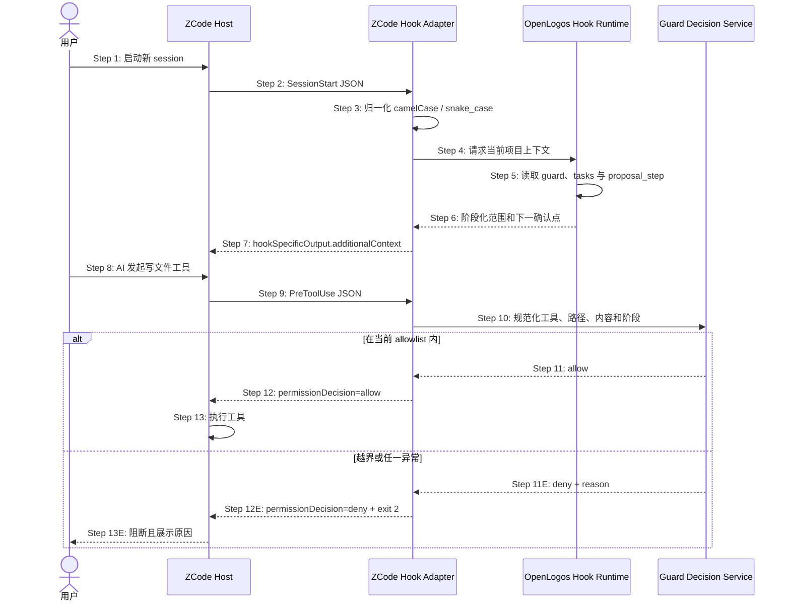
```mermaid
sequenceDiagram
    actor U as 用户
    participant Z as ZCode Host
    participant A as ZCode Hook Adapter
    participant R as OpenLogos Hook Runtime
    participant G as Guard Decision Service

    U->>Z: Step 1: 启动新 session
    Z->>A: Step 2: SessionStart JSON
    A->>A: Step 3: 归一化 camelCase / snake_case
    A->>R: Step 4: 请求当前项目上下文
    R->>R: Step 5: 读取 guard、tasks 与 proposal_step
    R-->>A: Step 6: 阶段化范围和下一确认点
    A-->>Z: Step 7: hookSpecificOutput.additionalContext
    U->>Z: Step 8: AI 发起写文件工具
    Z->>A: Step 9: PreToolUse JSON
    A->>G: Step 10: 规范化工具、路径、内容和阶段
    alt 在当前 allowlist 内
        G-->>A: Step 11: allow
        A-->>Z: Step 12: permissionDecision=allow
        Z->>Z: Step 13: 执行工具
    else 越界或任一异常
        G-->>A: Step 11E: deny + reason
        A-->>Z: Step 12E: permissionDecision=deny + exit 2
        Z-->>U: Step 13E: 阻断且展示原因
    end
```

### 步骤说明

1. 每个新 session 都重新装载插件 Hook 配置；配置变更不得声称热更新到既有 session。
2. Adapter 从标准输入只读取一条 JSON 事件。
3. `sessionId/session_id`、`hookEventName/hook_event_name` 等别名先归一化；同义字段冲突视为不可信输入。
4. Runtime 定位项目根，不接受事件提供的路径直接扩张信任边界。
5. Runtime 从磁盘重新推导当前状态：`delta-writing` 仅允许本提案 `deltas/**` 与对应 `tasks.md`，`ready-to-merge` 停止写 delta，`coding` 才允许既定源码和测试切片。
6. SessionStart 上下文必须明确当前 slug、阶段、可写范围、禁止动作及人类确认点。
7. Adapter 通过 ZCode `hookSpecificOutput` 注入上下文，不向标准输出混入日志。
8. 模型提出写、改名、删除或可间接写盘的工具调用。
9. PreToolUse 在工具执行前收到完整输入。
10. Adapter 将工具名、绝对规范路径、symlink 解析结果与内容意图交给共享决策服务。
11. 服务只按当前磁盘事实和阶段 allowlist 决策。
12. allow 显式返回；deny 同时返回 `permissionDecision: "deny"`、可读 reason，并采用 exit 2 阻断快捷语义。
13. ZCode 仅在 allow 后执行工具。

### 异常与边界

#### EX-ZC-1：兼容字段互相冲突

- **触发条件**：camelCase 与 snake_case 同义字段同时存在但值不同。
- **期望响应**：拒绝事件并返回可诊断原因。
- **副作用**：不得任选其一继续执行。

#### EX-ZC-2：路径或符号链接逃逸

- **触发条件**：表面路径在 allowlist 内，但规范化后落到提案外、源码或工作区外。
- **期望响应**：PreToolUse deny 并以 exit 2 阻断。
- **副作用**：目标文件不得发生变化。

#### EX-ZC-3：协议或运行时失败

- **触发条件**：JSON 损坏、未知写工具、项目根解析失败、guard 状态矛盾或决策服务抛错。
- **期望响应**：显式 deny；错误详情写 stderr，stdout 保持合法 Hook 响应。
- **副作用**：非零但非阻断的可恢复退出不得被用作安全失败路径。

#### EX-ZC-4：会话内阶段变化

- **触发条件**：会话启动后 `proposal_step` 从 delta-writing 变为 ready-to-merge。
- **期望响应**：每次 PreToolUse 重新读取状态并立即收紧；SessionStart 文案只作为上下文，不是授权缓存。
- **副作用**：建议新建 session 获取最新指导，但旧 session 也不得绕过新门禁。

### 追溯

- 需求：S09 guard 验收、ZCode Hook 协议与 fail-closed 要求。
- 架构：28.4 共享 Hook runtime、28.6 状态读取与缓存边界。
- 测试：UT-S09-188～UT-S09-197、ST-S09-73～ST-S09-76。

## S09 Qoder SessionStart 与 PreToolUse hard guard 时序

### 场景目标

Qoder CLI 新会话通过 SessionStart 获得当前 OpenLogos 阶段上下文；每次 PreToolUse 在工具执行前重新读取磁盘状态并复用共享 guard 决策。协议、路径、状态或运行时异常一律 fail-closed。

### 参与者

- **用户**：启动 Qoder CLI session 并发起工具操作。
- **Qoder CLI**：发现插件 Hook、发送事件并消费输出/退出码。
- **Qoder Hook Adapter**：校验 snake_case 输入与映射宿主协议。
- **SessionContextService**：派生阶段上下文。
- **GuardDecisionService**：对规范化工具调用 allow/deny。

### 前置条件

- OpenLogos Qoder 插件已启用，`hooks/hooks.json` 指向随包 runtime。
- 项目配置可定位；若有 guard，可唯一解析 active change。
- 权限只信任当前磁盘事实，不信任会话启动缓存。

### 成功后置条件

- SessionStart 上下文包含 module、slug、`proposal_step`、允许范围和下一确认点。
- 每次写入在执行前得到显式 allow/deny；deny 带非空原因并以 exit 2 阻断。
- Qoder 与既有宿主得到同一共享 guard 结论。

### 时序图

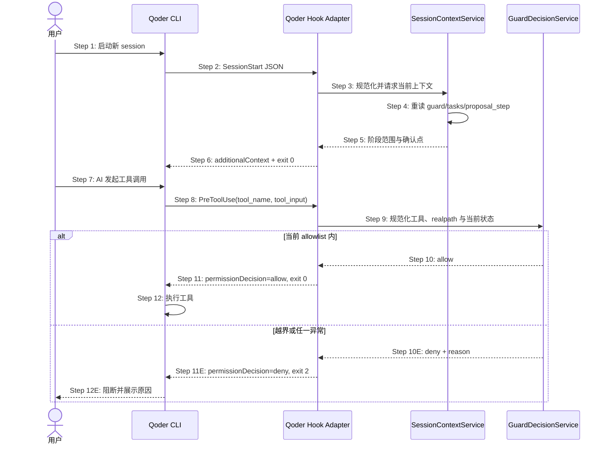
```mermaid
sequenceDiagram
    actor U as 用户
    participant Q as Qoder CLI
    participant A as Qoder Hook Adapter
    participant S as SessionContextService
    participant G as GuardDecisionService
    U->>Q: Step 1: 启动新 session
    Q->>A: Step 2: SessionStart JSON
    A->>S: Step 3: 规范化并请求当前上下文
    S->>S: Step 4: 重读 guard/tasks/proposal_step
    S-->>A: Step 5: 阶段范围与确认点
    A-->>Q: Step 6: additionalContext + exit 0
    U->>Q: Step 7: AI 发起工具调用
    Q->>A: Step 8: PreToolUse(tool_name, tool_input)
    A->>G: Step 9: 规范化工具、realpath 与当前状态
    alt 当前 allowlist 内
        G-->>A: Step 10: allow
        A-->>Q: Step 11: permissionDecision=allow, exit 0
        Q->>Q: Step 12: 执行工具
    else 越界或任一异常
        G-->>A: Step 10E: deny + reason
        A-->>Q: Step 11E: permissionDecision=deny, exit 2
        Q-->>U: Step 12E: 阻断并展示原因
    end
```

### 步骤说明

1. 新 session 装载当前插件/Hook 快照；刷新后不宣称旧 session 热更新。
2. Hook 从 stdin 限长读取单个 JSON 对象。
3. Adapter 校验 `session_id`、`cwd`、`hook_event_name` 和 `source`，再调用共享上下文服务。
4. 服务从磁盘派生 lifecycle、active slug、tasks 与 `proposal_step`。
5. 上下文明确允许/禁止范围与 merge/verify 等人类确认点。
6. Adapter 输出 `hookSpecificOutput.hookEventName="SessionStart"` 与 `additionalContext`；stdout 无日志。
7. 模型提出读、写、改名、删除或间接写盘操作。
8. PreToolUse 提供 `tool_name` 与 `tool_input`；matcher 不替代共享决策。
9. Adapter 规范化路径、symlink、命令意图并把最新磁盘状态交给 guard 服务。
10. 服务按当前 proposal-step allowlist 决策；SessionStart 不作为授权缓存。
11. allow/deny 显式映射；deny 同时输出 reason 与 exit 2。
12. Qoder 仅在 allow 后执行工具。

### 异常与边界

#### EX-QD-S09-1：损坏或缺字段事件
- **触发条件**：空输入、非法 JSON、类型错误或缺失 tool_name/tool_input。
- **期望响应**：输出合法 deny、非空原因并 exit 2；详情写 stderr。
- **副作用**：工具不执行。

#### EX-QD-S09-2：路径逃逸
- **触发条件**：`..`、绝对路径或 symlink 解析后落到 allowlist 外。
- **期望响应**：deny + exit 2。
- **副作用**：所有候选目标哈希不变。

#### EX-QD-S09-3：一般非零不是安全阻断
- **触发条件**：runtime 抛错或误用 exit 1。
- **期望响应**：包装器捕获并转换为协议 deny + exit 2；测试拒绝把 exit 1 计为通过。
- **副作用**：不能因 Qoder 将一般错误视为非阻断而绕过 guard。

#### EX-QD-S09-4：同会话阶段变化
- **触发条件**：tasks 从 delta-writing 收敛到 ready-to-merge。
- **期望响应**：下一次 PreToolUse 立即重读并拒绝后续 delta 写入。
- **副作用**：旧 SessionStart 文案不扩大权限。

### 追溯

- 需求：S09 Qoder Hook 与 hard guard 验收。
- 架构：29.4 事件归一化与映射、29.5 状态读取与路径安全。
- 测试：UT-S09-198～UT-S09-207、ST-S09-77～ST-S09-80。

## S09 WorkBuddy SessionStart 与 PreToolUse 硬门禁时序

### 场景目标

新 WorkBuddy session 获得磁盘派生的阶段上下文；每次潜在写操作由 PreToolUse 重新读取状态并执行与既有宿主一致的 hard guard。

### 主时序

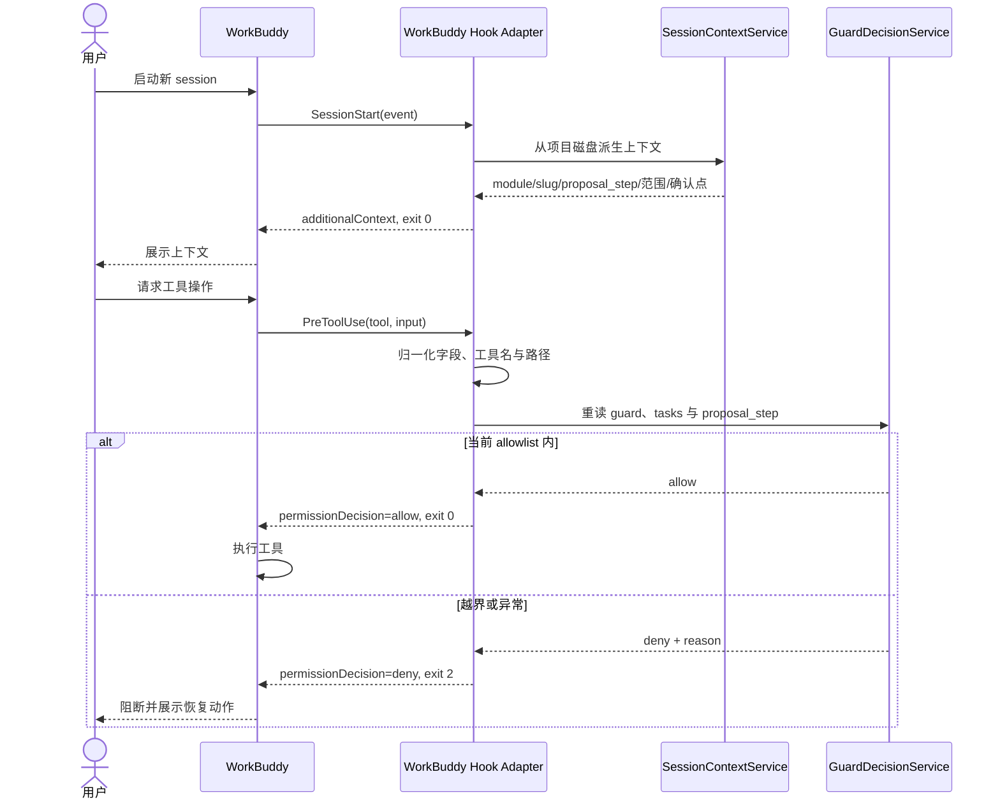
```mermaid
sequenceDiagram
    actor U as 用户
    participant W as WorkBuddy
    participant A as WorkBuddy Hook Adapter
    participant S as SessionContextService
    participant G as GuardDecisionService
    U->>W: 启动新 session
    W->>A: SessionStart(event)
    A->>S: 从项目磁盘派生上下文
    S-->>A: module/slug/proposal_step/范围/确认点
    A-->>W: additionalContext, exit 0
    W-->>U: 展示上下文
    U->>W: 请求工具操作
    W->>A: PreToolUse(tool, input)
    A->>A: 归一化字段、工具名与路径
    A->>G: 重读 guard、tasks 与 proposal_step
    alt 当前 allowlist 内
        G-->>A: allow
        A-->>W: permissionDecision=allow, exit 0
        W->>W: 执行工具
    else 越界或异常
        G-->>A: deny + reason
        A-->>W: permissionDecision=deny, exit 2
        W-->>U: 阻断并展示恢复动作
    end
```

### 归一化合同

1. CLI 工具 `Write`、`Edit`、`Bash` 与桌面工具 `write_to_file`、`replace_in_file`、`execute_command` 映射为共享动作；snake_case/camelCase 字段归一化后再判定。
2. Hook 从 stdin 限长读取单个 JSON，stdout 只输出协议 JSON，诊断写 stderr。
3. SessionStart 不读取 WorkBuddy 原生记忆，不作为授权缓存；旧会话提示不能扩大下一次 PreToolUse 权限。
4. PreToolUse 每次重新解析 realpath/symlink、active slug、`proposal_step` 和 allowlist。
5. allow 为 `permissionDecision="allow"` + exit 0；deny 为 `permissionDecision="deny"` + 非空 reason + exit 2。

### 异常

- `EX-WB-S09-1`：空输入、非法 JSON、缺字段或类型错误转换为协议 deny + exit 2。
- `EX-WB-S09-2`：`..`、绝对路径或 symlink 落到 allowlist 外时 deny，目标哈希不变。
- `EX-WB-S09-3`：未知潜在写工具和 runtime/状态异常 fail-closed；exit 1 不计作安全阻断。
- `EX-WB-S09-4`：同会话从 delta-writing 进入 ready-to-merge 后，下一次调用立即收紧。

### 追溯

- 需求：S09 WorkBuddy Hook 与 hard guard 验收。
- 架构：30.3 Hook 流水线、30.6 失败模型。
- 测试：UT-S09-208～UT-S09-218、ST-S09-81～ST-S09-84。

## TRAE hard guard 不成立的生命周期负向时序

### 目标

S09 不为 TRAE 注册 SessionStart/PreToolUse normalizer，不把 Rules、Skills、Agent prompt、MCP、人工确认、工作区信任或原生记忆作为 OpenLogos 授权状态。当前双客户端真实基础 deny 已失败，故生命周期中不存在 TRAE hard guard 调用链。

### Registry 排除时序

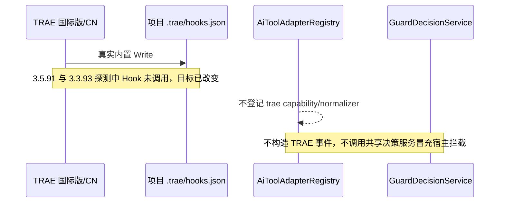
```mermaid
sequenceDiagram
    participant T as TRAE 国际版/CN
    participant H as 项目 .trae/hooks.json
    participant R as AiToolAdapterRegistry
    participant G as GuardDecisionService
    T->>H: 真实内置 Write
    Note over T,H: 3.5.91 与 3.3.93 探测中 Hook 未调用，目标已改变
    R-->>R: 不登记 trae capability/normalizer
    Note over R,G: 不构造 TRAE 事件，不调用共享决策服务冒充宿主拦截
```

### 生命周期状态变化

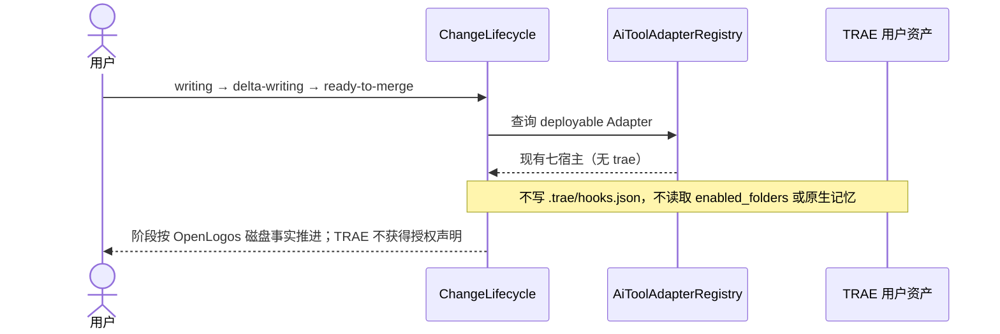
```mermaid
sequenceDiagram
    actor U as 用户
    participant L as ChangeLifecycle
    participant R as AiToolAdapterRegistry
    participant F as TRAE 用户资产
    U->>L: writing → delta-writing → ready-to-merge
    L->>R: 查询 deployable Adapter
    R-->>L: 现有七宿主（无 trae）
    Note over L,F: 不写 .trae/hooks.json，不读取 enabled_folders 或原生记忆
    L-->>U: 阶段按 OpenLogos 磁盘事实推进；TRAE 不获得授权声明
```

### 不变量与重新开启门

- wrapper 直调返回 deny、Hooks UI 存在或项目配置文件可解析，均不得产生 TRAE capability PASS。
- 已支持宿主仍按既有合同每次重读 guard、slug、tasks 与 `proposal_step`；deny 必须有非空 reason、正确退出语义且目标哈希不变。
- 未来独立提案只有在国际版与 CN 的真实内置工具共同通过 allow/deny、路径边界、symlink、未知工具及全部异常 fail-closed 矩阵后，才能新增 TRAE normalizer 与正向时序。

### 主时序

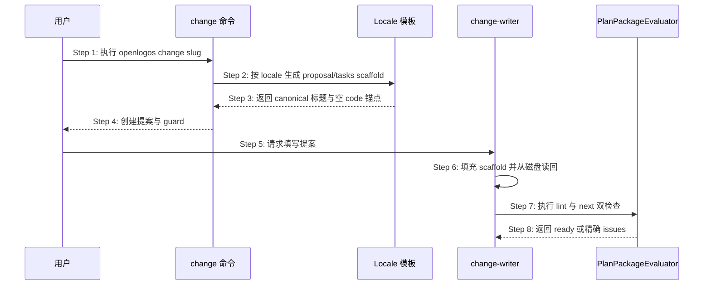
```mermaid
sequenceDiagram
    participant U as 用户
    participant C as change 命令
    participant T as Locale 模板
    participant W as change-writer
    participant E as PlanPackageEvaluator

    U->>C: Step 1: 执行 openlogos change slug
    C->>T: Step 2: 按 locale 生成 proposal/tasks scaffold
    T-->>C: Step 3: 返回 canonical 标题与空 code 锚点
    C-->>U: Step 4: 创建提案与 guard
    U->>W: Step 5: 请求填写提案
    W->>W: Step 6: 填充 scaffold 并从磁盘读回
    W->>E: Step 7: 执行 lint 与 next 双检查
    E-->>W: Step 8: 返回 ready 或精确 issues
```

### 步骤说明

1. **用户**创建新的 launched change。
2. **change 命令**读取 locale section registry，而非手写另一份标题集合。
3. **Locale 模板**生成完整 proposal scaffold；需要代码的 tasks 只含空 `[code]` 标题。
4. **change 命令**原子创建目录与 guard。
5. **用户**授权 change-writer 填写。
6. **change-writer**保留 scaffold 结构、替换占位并读回实际文件。
7. **change-writer**运行 change-lint 与 next。
8. **evaluator**只有在四方合同可收敛时返回 ready。

### 异常与边界

#### EX-3.1：模板继续生成代码占位 checkbox
- **触发条件**：launched tasks 含精确模板行 `实现代码变更`。
- **期望响应**：模板合同测试失败；L0 同时返回模板残留问题。
- **副作用**：候选制品不得生成。

#### EX-6.1：Agent 改写 canonical summary
- **触发条件**：保留详细设计但删除/改名 canonical summary。
- **期望响应**：返回 `proposal_required_section_missing` 与 locale 期望标题。
- **副作用**：不得进入 plan gate。

### 追溯

- 需求：S09 scaffold 与 plan gate 验收。
- 测试：UT-S09-224～UT-S09-230、ST-S09-88～ST-S09-89。

## S09 合并事务单一权威生命周期

### 场景目标

把有 Delta、no-delta 与 UI prototype 提案的规格完成统一到一个 OpenLogos transaction，确保 Agent/RunLogos 不再生产外部 manifest 或直接写正式目标。

### 参与者

- 用户：批准 plan 与后续 merge 人类门；
- OpenLogos merge：创建或恢复 canonical transaction；
- merge-executor Agent：只写声明 content slots；
- OpenLogos seal/apply：校验、冻结并原子提交；
- RunLogos：消费公共动作并等待 WorkUnit quiescent。

### 前置条件

- plan 已批准，proposal/tasks/deltas 与 baseline closure 对账完成；
- guard、slug、module 匹配；
- 不存在同 change 的冲突 transaction 或不可恢复 journal。

### 成功后置条件

- transaction 为 completed，receipt、正式 targets、metadata 与 `SPEC_MERGED` 相互校验；
- `SPEC_MERGED` 绑定 transaction/plan/receipt hash；
- 后续 slice-planner 只读取已合并真实 UT/ST ID 与 completed receipt。

### 主时序

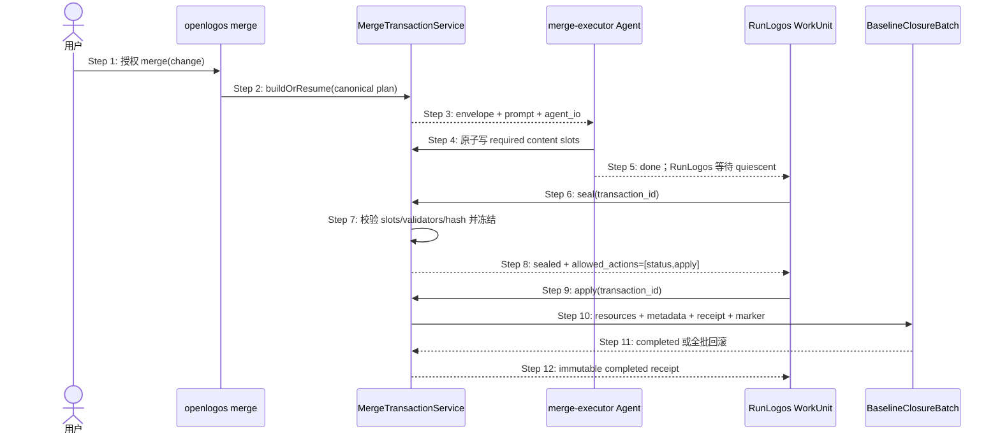
```mermaid
sequenceDiagram
    actor U as 用户
    participant M as openlogos merge
    participant T as MergeTransactionService
    participant A as merge-executor Agent
    participant W as RunLogos WorkUnit
    participant B as BaselineClosureBatch
    U->>M: Step 1: 授权 merge(change)
    M->>T: Step 2: buildOrResume(canonical plan)
    T-->>A: Step 3: envelope + prompt + agent_io
    A->>T: Step 4: 原子写 required content slots
    A-->>W: Step 5: done；RunLogos 等待 quiescent
    W->>T: Step 6: seal(transaction_id)
    T->>T: Step 7: 校验 slots/validators/hash 并冻结
    T-->>W: Step 8: sealed + allowed_actions=[status,apply]
    W->>T: Step 9: apply(transaction_id)
    T->>B: Step 10: resources + metadata + receipt + marker
    B-->>T: Step 11: completed 或全批回滚
    T-->>W: Step 12: immutable completed receipt
```

### 步骤说明

1. 用户授权 merge，不等于授权代码、部署或公开发布。
2. OpenLogos 用 proposal closure、tasks、deltas 和正式 before 字节计算唯一 plan；相同输入恢复同一 transaction。
3. Agent 只获得只读指令与明确 slot allowlist，不获得 canonical target/marker 写权限。
4. Agent 对 Markdown/普通规格生成最终原始字节并按原子替换协议写 slot；OpenLogos-produced targets 不分配 slot。
5. RunLogos 只把 WorkUnit 完成当作“内容生产停止”，不把它当作 merge 成功。
6. 仅在所有相关 WorkUnit quiescent 后调用 seal。
7. seal 先校验 slot 完整性，再执行类别 validator 与 sealed hash；失败不写正式目标。
8. sealed 后只允许 status/apply，slot 不可再替换。
9. RunLogos 按 `next_action=apply` 调用，不自建超时成功判断。
10. OpenLogos 通过 journal 执行全批原子提交，marker 最后写。
11. 任一失败恢复全部 before 或由同一 journal 前滚到全新。
12. completed receipt 是唯一成功证据；重复 apply 返回相同 receipt。

### no-delta 与 UI 分支

- no-delta：transaction 没有 Agent slot，OpenLogos 直接 seal/apply并生成同形 receipt；禁止旁路 touch `SPEC_MERGED`。
- UI prototype：原型作为 OpenLogos-produced target，或引用绑定同一 `plan_hash` 的不可变 UI receipt；hash 漂移在 apply 前拒绝。

### 异常与边界

#### EX-MT-09-1：Agent response lost
- **触发条件**：Agent 已原子写完 slot，但 done 响应丢失或 RunLogos 重启。
- **期望响应**：恢复同一 transaction，status 显示 collecting/sealable；不得清空已校验 slot或重建 target set。
- **副作用**：无正式写入。

#### EX-MT-09-2：seal validator 失败
- **触发条件**：某个 Markdown、schema、API/DB 或内容约束失败。
- **期望响应**：collecting/retryable，精确指向 slot/field；Agent 替换后可重试 seal。
- **副作用**：无正式写入、无 failed marker。

#### EX-MT-09-3：apply 崩溃
- **触发条件**：journal 落盘后、marker 前任一点中断。
- **期望响应**：下次 status/apply 先恢复为全旧或全新；永不暴露半新 completed。
- **副作用**：由 journal 可证明。

#### EX-MT-09-4：旧外部 manifest 调用
- **触发条件**：调用 `merge-apply --manifest` 或提供 `MERGE_APPLY_MANIFEST.json`。
- **期望响应**：固定非零升级提示，不执行任何正式写入，也不 fallback。
- **副作用**：无。

### 追溯

- 需求：合并事务单一权威验收条件 1～8。
- 功能规格：§2.44 全节。
- 测试：UT-S09-233～UT-S09-250、ST-S09-91～ST-S09-98。

## S09 公共 staging、abort 与 completed receipt 时序补充

### 主路径：声明 staging 到 completed

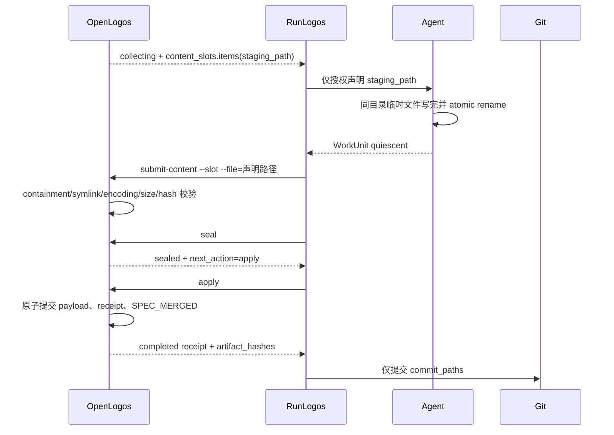
```mermaid
sequenceDiagram
    participant O as OpenLogos
    participant R as RunLogos
    participant A as Agent
    participant G as Git
    O-->>R: collecting + content_slots.items(staging_path)
    R->>A: 仅授权声明 staging_path
    A->>A: 同目录临时文件写完并 atomic rename
    A-->>R: WorkUnit quiescent
    R->>O: submit-content --slot --file=声明路径
    O->>O: containment/symlink/encoding/size/hash 校验
    R->>O: seal
    O-->>R: sealed + next_action=apply
    R->>O: apply
    O->>O: 原子提交 payload、receipt、SPEC_MERGED
    O-->>R: completed receipt + artifact_hashes
    R->>G: 仅提交 commit_paths
```

### Abort 分支

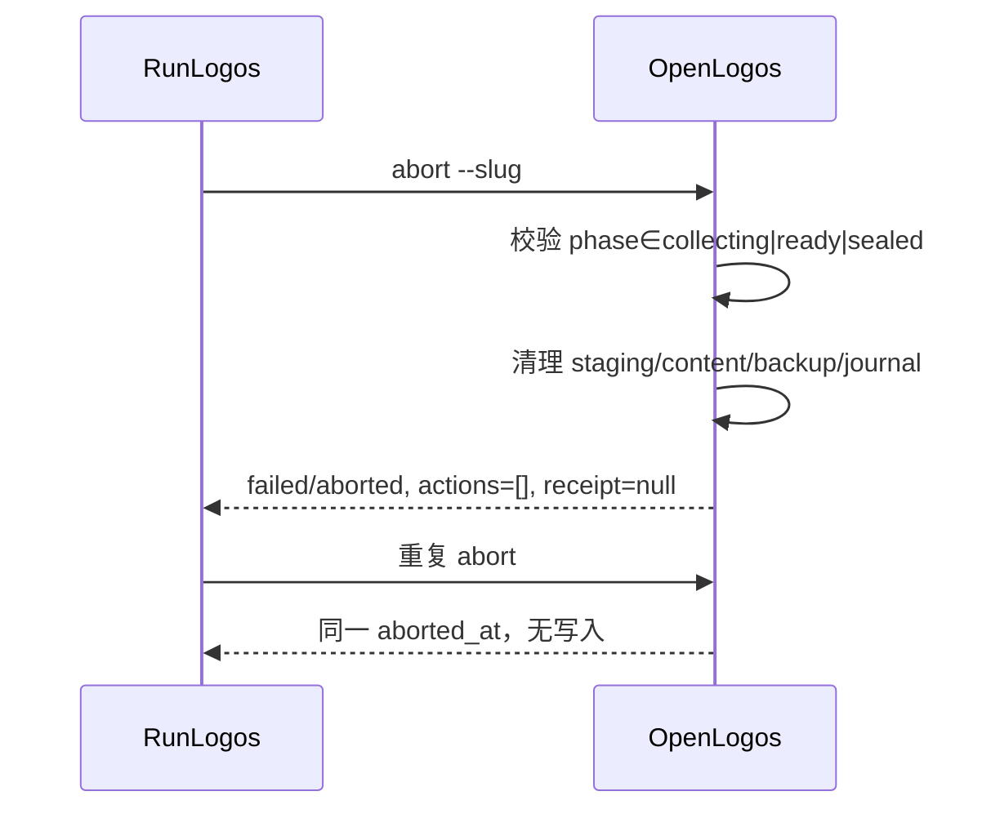
```mermaid
sequenceDiagram
    participant R as RunLogos
    participant O as OpenLogos
    R->>O: abort --slug
    O->>O: 校验 phase∈collecting|ready|sealed
    O->>O: 清理 staging/content/backup/journal
    O-->>R: failed/aborted, actions=[], receipt=null
    R->>O: 重复 abort
    O-->>R: 同一 aborted_at，无写入
```

### Response-lost 与异常

apply 响应丢失后先 status/recover；completed 必须返回同一 receipt payload identity，并从持久化 receipt/marker 字节重建相同 artifact_hashes。file 参数不是声明 staging path、staging 漂移或 union(commit hash paths) 不等于 commit_paths 时，事务不进入 completed。

## S09 Seal Preflight 与 Legacy Sealed Reopen 时序

### 场景目标

确保新事务只在全部确定性派生校验通过后 seal；确保尚未首写的 0.14.1 sealed 事务可以在同一 identity 下只退回错误 Agent slot。

### 新事务 Seal 主路径

```mermaid
sequenceDiagram
    participant C as Consumer
    participant M as MergeTransactionService
    participant P as PreflightBuilder
    participant S as TransactionStore

    C->>M: seal(transaction)
    M->>M: validate source/before/content identity
    M->>P: build(before + candidate finals)
    P->>P: derive metadata/test-change-set/final paths
    P-->>M: canonical PreflightView
    alt preflight pass
      M->>S: atomic sealed + preflight record + new seal
      M-->>C: phase=sealed, next_action=apply
    else attributable content failure
      M->>S: atomic collecting; rejected slots missing
      M-->>C: slot_identity_mismatch, retryable=true
    else fatal/unattributable
      M-->>C: stable fatal; slots unchanged
    end
```

### Legacy Sealed Apply 兼容路径

```mermaid
sequenceDiagram
    participant C as Consumer
    participant M as MergeTransactionService 0.14.2
    participant P as PreflightBuilder
    participant S as TransactionStore
    participant A as AtomicApplyWriter

    C->>M: apply(0.14.1 sealed transaction)
    M->>M: assert no journal/receipt/marker/official write
    M->>P: build ephemeral preflight
    alt pass
      M->>S: phase=applying (legacy seal unchanged)
      M->>A: atomic batch
      A-->>M: committed receipt/marker
      M-->>C: completed
    else uniquely attributable Agent error
      M->>S: atomic collecting snapshot first
      M->>M: best-effort rejected private cleanup
      M-->>C: retryable; same transaction
    else fatal or apply artifacts exist
      M-->>C: fail closed / recover only
    end
```

### 状态与身份规则

- reopen 清除外层 `seal_sha256` 和全部 target `sealed_sha256`；仅 rejected slot `content_sha256` 置 null。
- 无关 slot submitted hash、transaction ID、plan hash、target set 保持。
- 修正并重新 submit 后，新 seal生成 preflight record和新 seal；不得恢复旧 seal。
- legacy pass 不伪造新 seal或修改 transaction identity。
- applying/journal 后任何失败走 existing recover/rollback；不得调用 reopen helper。

### 追溯

UT-S09-261～265、ST-S09-102～103覆盖 seal拒绝、legacy reopen、多 slot归因、崩溃顺序、不可逆边界和同 transaction完成。

## S09 authority_impact Plan 生命周期

### 场景目标

change-writer 在 plan-exit 前完成 Authority Closure 适用性与变化计划；用户批准的是已闭合的 authority 方案，批准后才能生成对应 Delta。

### 时序图

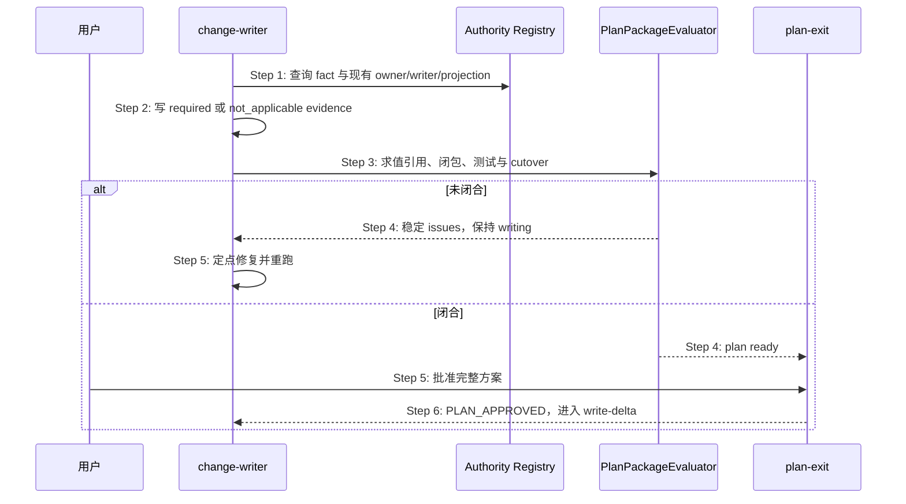
```mermaid
sequenceDiagram
    participant U as 用户
    participant CW as change-writer
    participant AR as Authority Registry
    participant PE as PlanPackageEvaluator
    participant G as plan-exit
    CW->>AR: Step 1: 查询 fact 与现有 owner/writer/projection
    CW->>CW: Step 2: 写 required 或 not_applicable evidence
    CW->>PE: Step 3: 求值引用、闭包、测试与 cutover
    alt 未闭合
        PE-->>CW: Step 4: 稳定 issues，保持 writing
        CW->>CW: Step 5: 定点修复并重跑
    else 闭合
        PE-->>G: Step 4: plan ready
        U->>G: Step 5: 批准完整方案
        G-->>CW: Step 6: PLAN_APPROVED，进入 write-delta
    end
```

### 生命周期规则

- 新 scaffold 与仍 writing 的提案必须有唯一 authority impact；缺失不得默认为 not applicable。
- proposal 只引用 Registry 或当前 CREATE authority target，不复制 owner 表。
- `unresolved` 非空、测试 ID 不真实、旧 writer 无 stop 或 cutover 无 exit 时 plan 不 ready。
- `PLAN_APPROVED` 只表示方案门已消费，不授权 merge/verify/deploy/smoke/archive/push。
- 已越过 plan 的历史提案不因新合同回退。

### 异常与恢复

- malformed YAML：exit 2 可修复 issue；duplicate key fail closed。
- Registry 引用不存在：回到架构/Delta 计划，不按散文猜 owner。
- plan 批准后 authority impact 漂移：按既有完整性语义重新批准，不静默沿用旧 marker。

### 追溯

- 规范：`openlogos/authority-impact@1`、AC-01～AC-08。
- 测试：UT-S09-266～UT-S09-270、ST-S09-104～ST-S09-105。

## S09 嵌套章节锚 Slot 的 Seal Preflight 与同事务恢复时序

### 场景目标

让合法 `MODIFIED — 父标题 > 叶标题` Agent content 在原始 slot submit 后通过共享 section-anchor authority 完成 seal/apply；若内容确实不满足嵌套锚合同，只局部 reopen 可归因 slot并保持 transaction 其它身份。

### 参与者

- **消费者/Driver**：只写声明 staging path，调用 transaction 公共 action。
- **MergeTransactionService**：拥有 submit、seal、reopen、apply 状态转换。
- **MarkdownSectionAuthority**：共享解析 Delta block、heading tree、路径锚和物质结果。
- **TransactionStore**：原子持久化 slot hash、phase、seal 与 preflight identity。
- **AtomicApplyWriter**：在 sealed identity 复核后批量提交正式目标与 receipt。

### 前置条件

- transaction 处于 `collecting`，Delta source、before target、plan 与 target set hash 未漂移。
- Agent target 的 staging path 已声明，最终内容是合法 UTF-8 普通文件且不含围栏外 Delta 控制 marker。
- Delta 使用标题路径锚，父标题与叶标题在 before/final heading tree 中形成唯一层级链。

### 成功后置条件

- 同一 transaction 依次达到 ready、sealed、applying、completed，正式目标不含字面量路径标题。
- preflight/seal/receipt 绑定同一 parser/resolver result 与 source/before/content/final hash。
- 其它 submitted slot hash、plan hash 与 target set 全程不变；OpenLogos reporter 记录真实 UT/ST 证据。

### 主时序

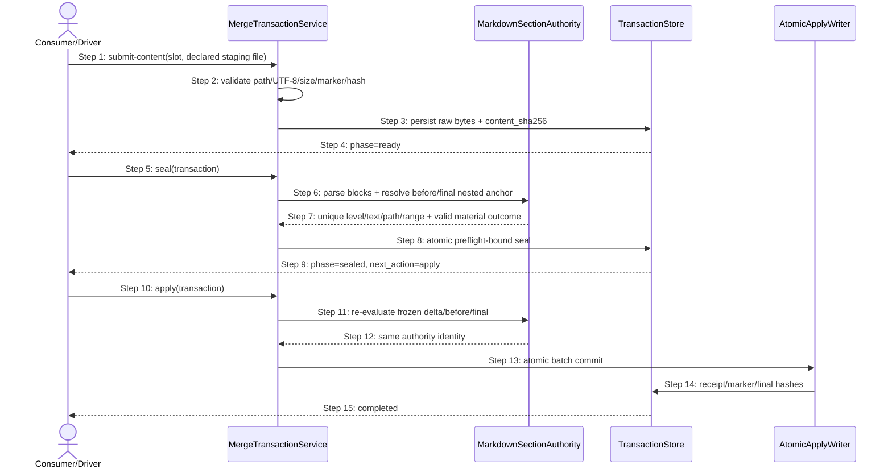
```mermaid
sequenceDiagram
    actor D as Consumer/Driver
    participant M as MergeTransactionService
    participant R as MarkdownSectionAuthority
    participant S as TransactionStore
    participant A as AtomicApplyWriter

    D->>M: Step 1: submit-content(slot, declared staging file)
    M->>M: Step 2: validate path/UTF-8/size/marker/hash
    M->>S: Step 3: persist raw bytes + content_sha256
    S-->>D: Step 4: phase=ready
    D->>M: Step 5: seal(transaction)
    M->>R: Step 6: parse blocks + resolve before/final nested anchor
    R-->>M: Step 7: unique level/text/path/range + valid material outcome
    M->>S: Step 8: atomic preflight-bound seal
    S-->>D: Step 9: phase=sealed, next_action=apply
    D->>M: Step 10: apply(transaction)
    M->>R: Step 11: re-evaluate frozen delta/before/final
    R-->>M: Step 12: same authority identity
    M->>A: Step 13: atomic batch commit
    A->>S: Step 14: receipt/marker/final hashes
    S-->>D: Step 15: completed
```

### 步骤说明

1. 消费者将完整最终目标写到 transaction 声明的 staging path，再调用 `submit-content`；该动作不解析章节锚。
2. MergeTransactionService 完成原始字节安全检查并写入 slot hash；最后一个必需 slot 到达时只把 phase 推到 ready。
3. seal preflight 将冻结 Delta、before 与 final 交给 MarkdownSectionAuthority，一次获得 fence-aware block 与唯一真实 heading hit。
4. 对 MODIFIED 路径，authority 验证 before/final 的父子链、叶标题 level/text 与完整正文结果，不要求字面量路径 heading。
5. 验证通过后 transaction 原子写 sealed/preflight identity；apply 首写前对完全相同的冻结输入重验。
6. 只有 identity 相同才进入 AtomicApplyWriter；完成 receipt 与正式目标 hash 成为恢复来源。

### 可修复局部 Reopen 时序

```mermaid
sequenceDiagram
    actor D as Consumer/Driver
    participant M as MergeTransactionService
    participant R as MarkdownSectionAuthority
    participant S as TransactionStore

    D->>M: Step 1: seal(ready transaction)
    M->>R: Step 2: verify nested anchor material outcome
    R-->>M: Step 3: retryable error + unique target_path
    M->>M: Step 4: map target_path to one Agent slot
    M->>S: Step 5: atomic collecting snapshot first
    M->>M: Step 6: best-effort rejected private cleanup
    M-->>D: Step 7: slot_identity_mismatch + missing_slot_ids
    D->>M: Step 8: rewrite staging + submit same slot
    M->>S: Step 9: preserve transaction/plan/target-set/other hashes
    D->>M: Step 10: seal + apply same transaction
```

### 异常与边界

#### EX-MT-ANCHOR-1：字面量路径标题伪修复

- **触发条件**：final 新增 `## 父标题 > 叶标题`，但真实父/叶层级未按 Delta 修改。
- **期望响应**：seal preflight 拒绝并只退回该 Agent slot；禁止将伪标题视为唯一 hit。
- **副作用**：正式目标、receipt、marker、journal 与其它 slot hash 不变。

#### EX-MT-ANCHOR-2：叶标题重复或父链错误

- **触发条件**：只按叶标题可命中多个候选，或 final 将叶标题移到错误父章节。
- **期望响应**：authority 返回 ambiguous/not-found 或路径身份漂移；不得首命中、合并候选或按正文猜测。
- **副作用**：若无法唯一归因到 Agent target，则一个 slot 也不清。

#### EX-MT-ANCHOR-3：Apply 重验漂移

- **触发条件**：seal 后 source、before、slot bytes 或 parser result identity 漂移。
- **期望响应**：首写前以 source/before/seal mismatch fail-closed，不 reopen sealed 新事务，不静默重建 seal。
- **副作用**：正式树及 apply journal 保持未写。

#### EX-MT-ANCHOR-4：Response lost

- **触发条件**：reopen 或 apply 已原子提交但命令响应丢失。
- **期望响应**：新进程先读 status/recover，从 transaction/receipt 得到 collecting 或 completed 唯一状态。
- **副作用**：不扫描残留 slot/staging/marker反推，不 abort、不新建 transaction。

### 追溯

- 需求：AC-MT-ANCHOR-01、03～05、07。
- 功能规格：§2.46.1～§2.46.5。
- 架构：§37.2～§37.6。
- 测试：UT-S09-271～274、ST-S09-106～107；安装态 SMOKE-core-168。

## S09 GUI overlay extends 版本取值与存量有条件迁移

### 场景目标

GUI 项目在 `init` / `sync` 时会把方法论 overlay 唯一源的两个 `op:add` 并入项目实例 `logos/flow/launched.yaml`。此前写入端把 `extends` 的内容版本硬编码为字面量，与 loader 维护的版本映射失同步，导致 CLI 刚写完文件、下一条命令就对该文件报版本不匹配告警。本节定死写入端取值来源，并规定存量 overlay 的有条件迁移判据。

### 参与者与前置条件

| 别名 | 组件 | 说明 |
|------|------|------|
| C | OpenLogos CLI | `init` / `sync` 主流程 |
| INJ | GUI overlay 注入器 | 读唯一源、按 node id 去重并入项目实例 |
| VER | flow loader 版本映射 | 内置模板内容版本的唯一权威 |
| OVL | `logos/flow/launched.yaml` | 项目实例 overlay 文件 |

前置：项目含 ≥1 GUI 模块（`product_type` ∈ {`web`,`desktop`,`mobile`}）。缺字段按非 GUI 处理，不注入。

### 主时序

```mermaid
sequenceDiagram
    participant C as OpenLogos CLI
    participant INJ as GUI overlay 注入器
    participant VER as flow loader 版本映射
    participant OVL as logos/flow/launched.yaml

    C->>INJ: Step 1: 项目含 GUI 模块，进入注入
    INJ->>OVL: Step 2: 读取实例（不存在则视为空文档）
    INJ->>VER: Step 3: 读取当前 lifecycle 的内容版本
    alt extends 缺失或非字符串
        INJ->>INJ: Step 4a: 组装 builtin:<lifecycle>@<映射值>
    else extends 已存在且版本落后
        INJ->>INJ: Step 4b: 解析该 overlay 引用的全部 node id
        alt 全部 node id 在新版本仍可解析
            INJ->>INJ: Step 4b-1: 提升 extends 至映射值，标记已迁移
        else 存在失效 node id
            INJ->>INJ: Step 4b-2: 保持原 extends，保留版本不匹配告警
        end
    end
    INJ->>INJ: Step 5: 按 node id 去重并入两个 op:add，保留用户自定义 ops
    INJ->>OVL: Step 6: 写回
    INJ->>INJ: Step 7: 自检——解析产物，warnings 不得含版本不匹配告警
    INJ-->>C: Step 8: 返回是否发生写入变更与是否迁移
```

### 步骤说明

1. **注入器**仅在项目含 ≥1 GUI 模块时进入；`product_type` 唯一源是 `logos-project.yaml` 的 `modules[].product_type`，缺字段按非 GUI 安全默认。
2. **注入器**读取 `logos/flow/launched.yaml` 实例；文件不存在时按空文档处理。
3. **注入器**从 loader 版本映射读取当前 lifecycle 的内容版本。写入端不得持有任何字面量版本号。
4. `extends` 缺失或非字符串时按映射值组装；已存在且版本落后时进入迁移判据（见下节）。
5. **注入器**按 node id 去重并入 overlay 唯一源的两个 `op:add`，用户自定义的 overlay 操作原样保留。反向场景（唯一 GUI 模块改为非 GUI）按既有语义移除这两个 node id，同样不触碰用户自定义操作。
6. 写回后**注入器**对产物自检：解析结果的 `warnings` 不得包含版本不匹配告警。自检不通过即视为不变量被破坏。

### 迁移规则

存量 overlay 的 `extends` 版本落后于映射值时按引用可解析性分流：

| 条件 | 处理 | 输出 |
|---|---|---|
| 该 overlay 引用的**全部** node id 在新版本内置模板中仍可解析 | 提升 `extends` 至当前映射值 | 提示已迁移 |
| 存在任一失效 node id | 保持原 `extends` 不变 | 继续产生版本不匹配告警，指向需人工复核的对象 |

该判据等价于告警文案本身所问的问题，因此迁移之后残留的告警一律是真告警。迁移幂等：对已是当前版本的 overlay 为 no-op，重复同步不产生额外写入。

### 不变量

- 写入端产物中不得出现字面量内置版本号；写入端与告警判定端读同一映射。
- 非 GUI 项目与缺 `product_type` 的项目零注入、零迁移、流程零改动。
- overlay 四操作语义、版本告警判定条件与公共 JSON 字段结构零变化。
- 迁移只改 `extends` 一个字段，不重排、不删改任何 overlay 操作。

### 异常与边界

| 编号 | 触发条件 | 处理 |
|---|---|---|
| EX-S09-OVL-1 | 实例 overlay 文件不可解析 | 不迁移、不写回，报错并保留原字节 |
| EX-S09-OVL-2 | 落后版本且存在失效 node id | 保持原 `extends`，保留告警，不阻断当前命令 |
| EX-S09-OVL-3 | 写回后自检出现版本不匹配告警 | 视为不变量被破坏，报错；不得通过放宽判定条件消音 |

### 追溯

- 需求：AC-YAMLW-06～07。
- 功能规格：§2.47.4、§2.47.5。
- 架构：§三十八.2、§三十八.4。
- 测试：UT-S09-275～UT-S09-278、ST-S09-108；安装态 SMOKE-core-169。

## S09 归档提案的事务只读寻址与写动作 fail-closed

### 场景目标

`openlogos archive` 把提案目录从 `logos/changes/<slug>` 移动到 `logos/changes/archive/<时间戳>-<slug>`，而事务身份解析只查前者。本节补齐归档后的只读寻址时序，并定死「可读不可写」的边界。

### 参与者与前置条件

| 别名 | 组件 | 说明 |
|------|------|------|
| U | User / 消费方 | 执行 `openlogos merge transaction <action>` |
| ID | 事务身份解析器 | slug → 提案目录 → 事务文件，**单点实现** |
| G | `logos/.openlogos-guard` | 活跃提案标记（可能不存在或指向别的提案） |
| A | `logos/changes/archive/` | 归档提案目录 |

前置：目标提案可能处于活跃态或已归档态；已归档提案的 `MERGE_TRANSACTION.json` / `MERGE_RECEIPT.json` 完整留存。

### 主时序

```mermaid
sequenceDiagram
    participant U as User / 消费方
    participant ID as 事务身份解析器
    participant G as .openlogos-guard
    participant A as changes/archive/

    U->>ID: Step 1: merge transaction <action> [--slug <slug>]
    alt 显式 --slug
        ID->>ID: Step 2a: 采用显式 slug
    else 未指定
        ID->>G: Step 2b: 读 activeChange
    end
    ID->>ID: Step 3: 查 logos/changes/<slug>
    alt 活跃目录命中
        ID-->>U: Step 4a: 返回 {slug, proposalDir, archived:false}（读写皆可，既有行为）
    else 未命中
        ID->>A: Step 5: 按 <时间戳>-<slug> 后缀查归档目录
        alt 恰好一个命中
            ID->>ID: Step 6: 标记 archived:true
            alt 只读动作（status）
                ID-->>U: Step 7a: 正常返回事务只读投影
            else 写动作
                ID-->>U: Step 7b: fail-closed，稳定 classification，零副作用
            end
        else 零命中
            ID-->>U: Step 8a: 提案不存在
        else 多命中
            ID-->>U: Step 8b: fail-closed，要求显式消歧，不取第一个
        end
    end
```

### 步骤说明

1. slug 来源不变：显式 `--slug` 优先，否则读活跃 guard 的 `activeChange`。本节不改变该顺序。
2. **解析器**先查 `logos/changes/<slug>`；命中即按既有行为返回，读写皆可——未归档路径逐字节零回归。
3. 未命中时才启用归档查找，按 `<时间戳>-<slug>` 后缀匹配 `logos/changes/archive/` 下的目录。
4. 命中归档提案时解析结果携带 `archived` 标记：只读动作正常执行；写动作（`submit-content` / `seal` / `apply` / `recover` / `abort`）一律拒绝，给出稳定 classification，且不触碰事务文件、receipt 与任何 marker。
5. 同一 slug 命中多个归档目录属歧义，fail-closed 要求显式消歧，不得取第一个。

### 不变量

- **查找单点**：本解析器是提案目录查找的唯一实现；runner、跨仓工具与其它消费方一律调用它，不得复制第二套目录拼接规则。
- **可读不可写**：归档提案只放行只读动作。恢复可读性是为审计与重放判据，不是让已终结变更重新可改写。
- **禁止绕行**：不得为读取归档事务而把 guard 指回已归档提案——那会挤掉当前正在进行的变更。
- **零回归**：活跃提案的两条既有解析路径（guard / 显式 slug）行为与输出逐字节不变。
- **只读即无副作用**：归档态下的只读动作不写入任何文件。

### 异常与边界

| 编号 | 触发条件 | 处理 |
|---|---|---|
| EX-S09-ARCH-1 | 归档提案上发起写动作 | fail-closed，稳定 classification，事务文件与 receipt 字节不变 |
| EX-S09-ARCH-2 | 同一 slug 命中多个归档目录 | fail-closed，报歧义并要求显式消歧 |
| EX-S09-ARCH-3 | 活跃与归档均未命中 | 维持既有「提案不存在」错误语义 |

### 追溯

- 需求：AC-TXADDR-01～04。
- 功能规格：§2.48.2。
- 架构：§三十九.1。
- 测试：UT-S09-279～UT-S09-282、ST-S09-109；安装态 SMOKE-core-170。

## S09 merge 准入判定与 change-lint 同源

### 场景目标

让 `openlogos merge` 对「这个提案能不能进主规格」的判定，等于 `change-lint` 的完整结论；并让拒绝时的诊断足以定位到具体文件与字段。

### 参与者与前置条件

| 别名 | 组件 | 说明 |
|---|---|---|
| U | 用户 / AI | 发起 merge |
| M | `openlogos merge` | 准入点 |
| L | `change-lint` evaluator | 合规性的唯一判定 |
| A | `merge-apply` 路径 | 另一条准入点，判据须与 M 同源 |

前置：活跃 guard 指向该提案；提案目录可读。**不要求**提案带 `baseline_closure` 声明——此前正是该条件使一批提案完全绕过预检。

### 主时序

```mermaid
sequenceDiagram
    participant U as 用户/AI
    participant M as openlogos merge
    participant L as change-lint evaluator

    U->>M: Step 1: openlogos merge <slug>
    M->>M: Step 2: guard 一致性与事务恢复检查
    M->>L: Step 3: runChangeLint(root, proposalDir, slug)（无条件）
    alt evaluator 无法完成
        L-->>M: Step 4a: ok=false + errorCode
        M-->>U: Step 5a: 拒绝，输出 errorCode 与 message；不生成 MERGE_PROMPT、不写 SPEC_MERGED
    else violations 非空
        L-->>M: Step 4b: 完整 violations 列表
        M-->>U: Step 5b: 拒绝，**逐条**输出 code / 路径 / 字段 / fix_hint
    else violations 为空
        L-->>M: Step 4c: 空列表
        M->>M: Step 5c: 继续既有的 UI provenance、delta 段标记与多写者检查
        M-->>U: Step 6: 生成 MERGE_PROMPT 与事务
    end
```

### 步骤说明

- **Step 3 无条件**：删除 `closureActive` 条件门。该门此前要求提案带 `baseline_closure` 声明或 `[MODIFY]`/`[CREATE]` 任务标记，没有这些的提案整道预检不做。
- **Step 4b 不过滤**：删除以 `BASELINE_CLOSURE_VIOLATION_CODES` 过滤违规的缩水判据。任一违规即拒绝，与 `merge-apply.ts` 的既有写法一致。
- **Step 5b 逐条**：每条违规单独一行，含 `code`、路径、具体字段与 `fix_hint`。禁止「L1-L9 未全过」这类只给聚合结论的输出。
- **Step 5c 顺序**：合规判定在前，既有的结构检查在后。合规不通过时不进入任何写操作。

### test-change-set 的捕获集变化

`merge` 成功时写入 `SPEC_MERGED.test_change_set`。该集合此前用 `test-change-set` 自列的严格语法提取，遗漏 11 个 JSON 系 ID。改用权威测试 ID 语法后，这些 ID 进入捕获集，其变更不再绕过下游的切片归属与 verify 可选集计算。

变化方向只增不减：不存在此前被捕获、此后遗漏的 ID。

### 不变量

1. **准入判据唯一**：M 与 A 对同一提案目录得到同一准入结论；任一路径都不得自建违规码白名单。
2. **完整采信**：M 必须采信 L 的全部违规，不得只挑其中一部分（架构 §四十一.6.1）。
3. **可预测**：用户 merge 前跑 `change-lint`，即可完全预知 M 的结论。
4. **失败不写**：任何拒绝路径都不得生成 MERGE_PROMPT、写 `SPEC_MERGED`、推进 counter 或 index。

### 异常与边界

- evaluator 自身无法完成（如 `module_unresolved`、`artifact_unreadable`）：按 `ok=false` 分支拒绝，输出 errorCode，不降级为「视为通过」。
- 历史提案（带 `SPEC_MERGED`/`MERGED`/`VERIFY_PASS` 等 marker）：沿用 `change-lint` 既有的历史旁路，本节不改变其判定。
- 收紧后被拒绝的提案：其 `change-lint` 必然同样失败，用户可用同一命令自查复现。

### 追溯

- 需求：AC-MERGEGATE-01、AC-MERGEGATE-02、AC-MERGEGATE-05、AC-MERGEGATE-09。
- 功能规格：§2.51.2、§2.51.5；架构：§四十一.6.1。
- 测试：UT-S09-283～UT-S09-286、ST-S09-110；安装态 SMOKE-core-173。

## S09 切片事务命令面与归档只读

### 场景目标

为切片事务提供与 merge 事务同构的命令面，并复用其目录解析与归档只读判据——不新建第二套。

### 参与者与前置条件

| 别名 | 组件 | 说明 |
|---|---|---|
| U | 用户 / Agent | 发起事务动作 |
| C | `openlogos slice transaction` | 命令面与 JSON envelope |
| R | `resolveIdentity()` | 提案目录解析（活跃 / 归档） |
| T | 切片事务状态机 | phase 与 allowed_actions |

### 命令面

| 命令 | 性质 | 归档提案 |
|---|---|---|
| `status` | 只读 | **放行** |
| `submit-content --slot <id> --file <path>` | 写 | 拒绝 |
| `seal` | 写 | 拒绝 |
| `apply` | 写 | 拒绝 |
| `recover` | 写 | 拒绝 |
| `abort` | 写 | 拒绝 |

### 主时序

```mermaid
sequenceDiagram
    participant U as 用户/Agent
    participant C as slice transaction 命令
    participant R as resolveIdentity
    participant T as 事务状态机

    U->>C: Step 1: 发起动作
    C->>R: Step 2: 解析提案目录（活跃或归档）
    alt 目录不可解析 / 歧义
        R-->>C: Step 3a: 失败
        C-->>U: Step 4a: 结构化错误码，无副作用
    else 归档提案且动作非 status
        C-->>U: Step 3b: action_not_allowed，无副作用
    else 可执行
        C->>T: Step 3c: 校验动作在 allowed_actions 内
        alt 不在白名单
            T-->>C: Step 4c: 拒绝并列出当前 allowed_actions
        else 在白名单
            T->>T: Step 5c: 执行并推进 phase
            T-->>C: Step 6c: 新投影
        end
        C-->>U: Step 7: envelope 含 schema_sha256 与 contract_sha256
    end
```

### 与 merge 事务的复用边界

**共用而非复制**：

| 复用项 | 说明 |
|---|---|
| `resolveIdentity()` | 活跃与归档目录的统一解析，含归档目录名后缀匹配与歧义拒绝 |
| 归档只读判据 | 只读动作白名单（切片事务同样只有 `status` 在内） |
| phase 集合与语义 | `collecting / ready / sealed / applying / completed / failed` |
| envelope 形状 | 成功时公开 `schema_sha256` 与 `contract_sha256` |

**不共用**：事务文件、slot 定义、apply 的产物写入——两类事务的产物完全不同，状态机形状相同不等于实现合并。

### 不变量

1. 归档提案仅放行 `status`；写动作被拒且不产生任何副作用（不写文件、不推进 phase、不留暂存）。
2. 动作白名单由事务当前 phase 决定；不在白名单的动作被拒并回传当前 `allowed_actions`。
3. 成功 envelope 必须公开 `schema_sha256` 与 `contract_sha256`，供跨仓消费方精确匹配。
4. 目录解析歧义时 fail closed，不猜测目标提案。

### 异常与边界

- 同一 slug 同时匹配活跃与归档目录：拒绝并要求消歧，不静默择一。
- 事务文件损坏或无法严格解析：返回结构化错误，不尝试修复或重建。
- `status` 对不存在事务的提案：返回「无活跃事务」的正常投影，不是错误。

### 追溯

- 需求：AC-SLICETX-01、AC-SLICETX-02、AC-SLICETX-09。
- 功能规格：§2.53.3、§2.53.7、§2.53.9；架构：§四十三.1。
- 测试：UT-S09-287～UT-S09-288；安装态 SMOKE-core-175。

## S09 Cursor sessionStart 上下文注入与部分强度门禁链路

### 场景目标

在 Cursor 宿主（cursor-agent CLI 与 IDE 共享 `.cursor/hooks.json`）上，随变更生命周期（`proposal_step`）收敛写入范围：sessionStart 注入当前阶段上下文，`beforeShellExecution` 硬拦越界 shell 写入，`afterFileEdit` 对越界编辑产出事后检测报告；CLI 侧无 `preToolUse`，强度差异如实呈现。

### 前置与后置条件

- 前置：项目已初始化且部署了 Cursor hooks 托管条目；存在或不存在活跃 guard 均为合法输入。
- 成功后置：新 session 获得与磁盘一致的阶段上下文；越界 shell 写入被 deny（非空原因）；越界编辑产出检测报告；合法写入不受干扰。
- 失败后置（fail-closed）：状态不可读时 shell 路径 deny、编辑路径产出「无法安全判断」报告；不伪装成无 guard。

### 主时序

```mermaid
sequenceDiagram
    participant CU as Cursor(cursor-agent/IDE)
    participant SS as sessionStart 接线
    participant BS as beforeShellExecution 接线
    participant FE as afterFileEdit 接线
    participant SC as SessionContextService
    participant GD as GuardDecisionService
    participant FS as 项目磁盘状态
    CU->>SS: 新 session
    SS->>SC: 请求阶段上下文
    SC->>FS: 读取 guard / proposal_step / tasks
    SC-->>SS: module、active change、可写范围、下一确认点
    SS-->>CU: stdout JSON 注入（不构成授权）
    CU->>BS: shell 命令（潜在写入）
    BS->>GD: 判定（每次重读磁盘）
    alt 范围内
        GD-->>BS: allow
        BS-->>CU: permission allow
    else 越界或状态不可读
        GD-->>BS: deny + 非空原因
        BS-->>CU: permission deny（阻断）
    end
    CU->>FE: 原生编辑完成事件
    FE->>GD: 判定（每次重读磁盘）
    alt 越界或状态不可读
        FE-->>CU: 事后检测报告（未阻断，提示核查/回退）
    else 范围内
        FE-->>CU: 静默
    end
```

### 步骤与不变量

1. 三条接线共用共享服务的同一决策逻辑，Adapter 只做 Cursor 协议字段转换；决策无缓存，每次调用重读磁盘。
2. `proposal_step` 收敛语义与其他宿主一致（如 delta-writing 只放行 `logos/changes/<slug>/deltas/**` 与 tasks.md，安全白名单含 `git push` 等既有规则）。
3. shell deny 输出必含：事实（active change、proposal_step、允许范围、目标路径）+ 恢复动作。
4. `afterFileEdit` 报告必须如实声明「本次编辑未被阻断（CLI 无 preToolUse）」；不得把报告表述成阻断。
5. IDE 侧 `preToolUse` 由 Cursor 按同一 hooks.json 自然硬拦；OpenLogos 不探测宿主形态、不分叉配置。
6. sessionStart 输出仅供解释状态，不构成写入授权凭据。

### 异常

- `EX-CU-S09-1`：guard 文件缺失且提案目录存在 → shell deny、编辑报告；提示先运行 `openlogos change`。
- `EX-CU-S09-2`：hook stdin 不可解析 → shell 路径 deny（fail-closed），编辑路径产出「无法安全判断」报告。
- `EX-CU-S09-3`：决策服务抛异常 → 同 EX-CU-S09-2，且退出码语义不伪装成功。

### 追溯

- 需求：S09 Cursor 变更生命周期验收（Cursor 资产、迁移与 Hook 要求 5/6/7）。
- 架构：46.4 Hook 归一化与部分强度决策流水线、46.7 失败模型。
- 测试：UT-S09-293～UT-S09-302、ST-S09-112～ST-S09-115。

## S09 merge 事务前沿推进生产链路时序（flow 契约自洽）

### 场景目标

launched 变更在 0.14.x 事务语义下，merge 段的 flow 前沿与生产事实全链自洽：「开事务 → step 推进 merge-generated → apply-merge 派活 → 事务 apply 写 SPEC_MERGED → coding」，无死区；legacy 测试模式（marker 路径）行为保持不变。

### 前置与后置条件

- 前置：提案 `ready-to-merge`，merge 获授权。
- 成功后置：每一步的 `proposal_step` / `next_node` 与磁盘事实一致；`SPEC_MERGED` 后进入 slice/implement 既有链路。
- 失败后置：事务失败相位不冻结前沿（terminal 走 0.14.17 终态出路：abort 重建 / reopen）；status/next 失败输出结构化 `error.code`。

### 主时序

```mermaid
sequenceDiagram
    participant M as openlogos merge
    participant T as 合并事务
    participant F as flow-derive/step
    participant E as merge-executor
    participant S as SPEC_MERGED
    M->>T: 创建事务（collecting）
    T-->>F: 事务在盘 → proposal_step: merge-generated
    F-->>E: next_node: apply-merge（派活）
    E->>T: submit-content ×N → seal → apply
    T->>S: apply 原子落盘并写 SPEC_MERGED
    S-->>F: 前沿越过 merge 段 → slice/implement 既有链路
```

### 步骤与不变量

1. `done_when: any_present:[MERGE_TRANSACTION.json, MERGE_PROMPT_GENERATED, MERGE_PROMPT.md]`——事务在盘即 done；legacy 测试 marker 兼容或项，0.13.x 合同回归不破。
2. merge 幂等：非终态事务在场时重跑 merge 幂等返回、前沿不回退；终态按 §2.58.1 归档让位重建（新事务同样使前沿为 merge-generated）。
3. `proposal_step` 闭合枚举、step 注册表（merge-generated: pre-implement/command-required）、禁止抢占前沿规则一字不改。
4. 后置条件二分为跨仓合同：宿主以「exit 0 + 事务在盘且 phase 合法」判本跳成功；「apply 前沿停顿」是合法中间态。

### 异常

- `EX-MF-S09-1`：事务 failed（fatal / aborted）→ 前沿仍 merge-generated（事务在盘），引导按 classification 给 abort/recover；重跑 merge 归档让位重建，不死锁。
- `EX-MF-S09-2`：手工删除事务文件（越权）→ 前沿回退 ready-to-merge（事实消失），guard/review 层处置，flow 不猜测。
- `EX-MF-S09-3`：存量事务合同失配 → fail-closed 稳定码 + remediation（abort 后重开），不迁移。

### 追溯

- 需求：merge 流程契约自洽需求「S09 变更生命周期」。
- 架构：四十七（authority cutover）；功能规格 §2.60.2/§2.60.3。
- 测试：UT-S09-303～UT-S09-308、ST-S09-116～ST-S09-117、SMOKE-core-190。
