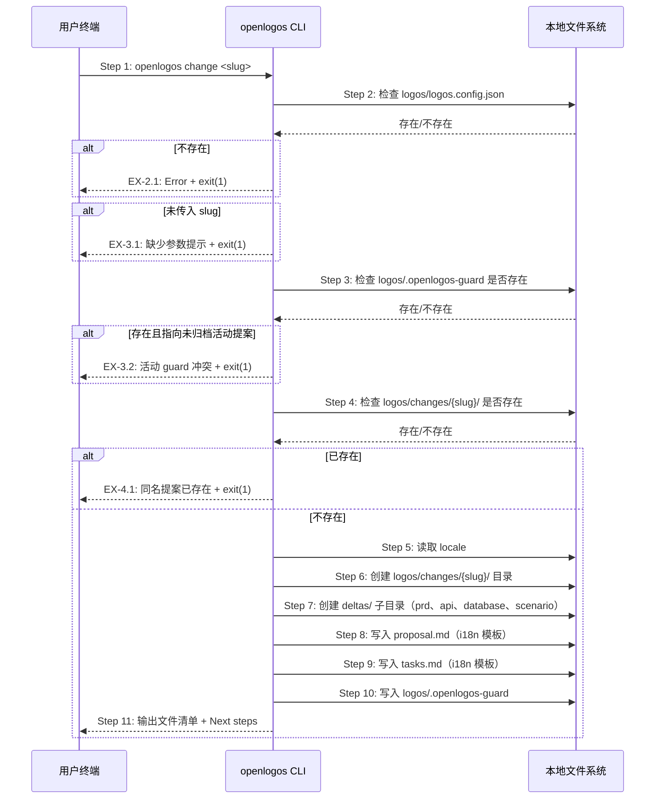
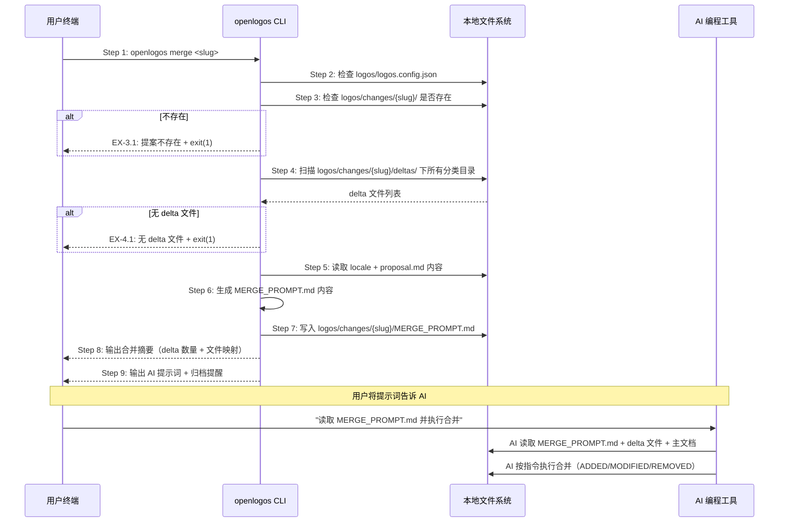
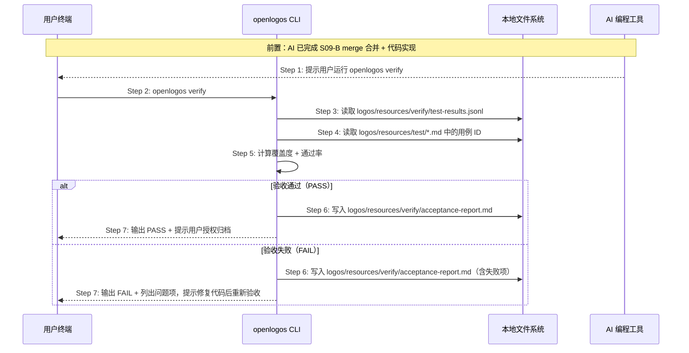
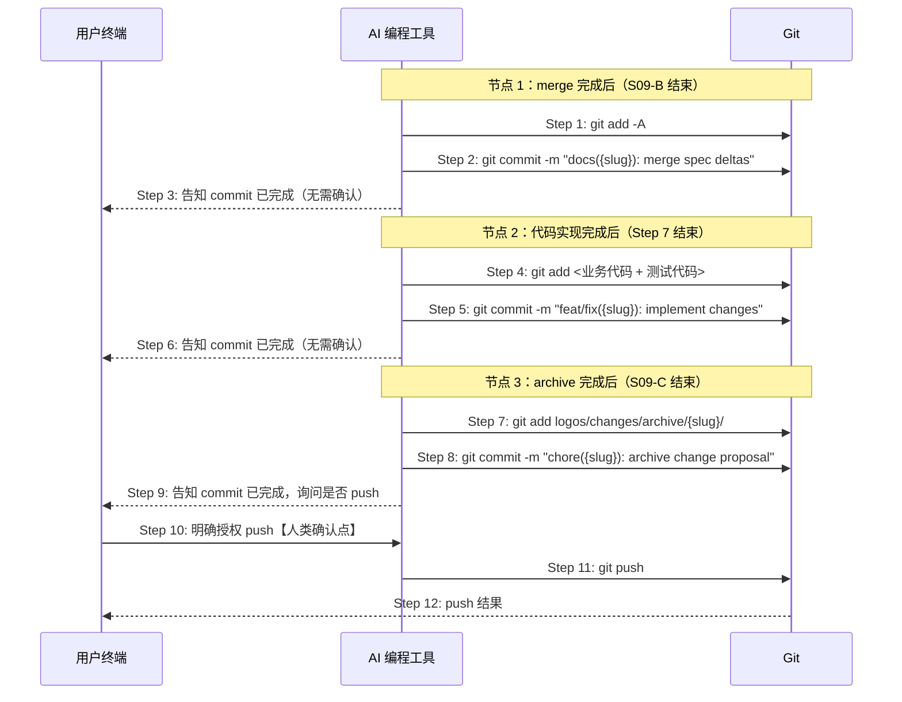
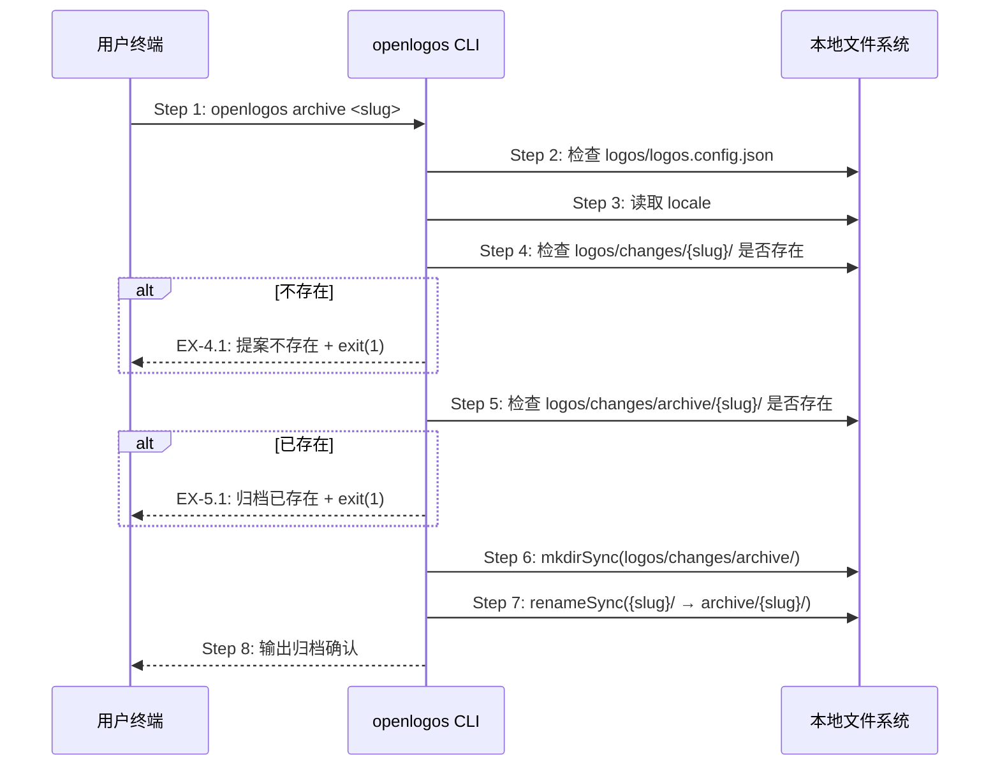
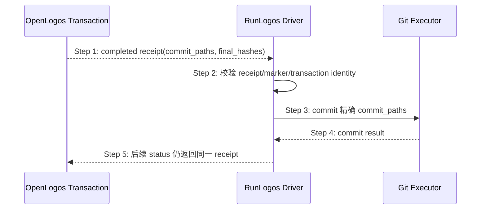
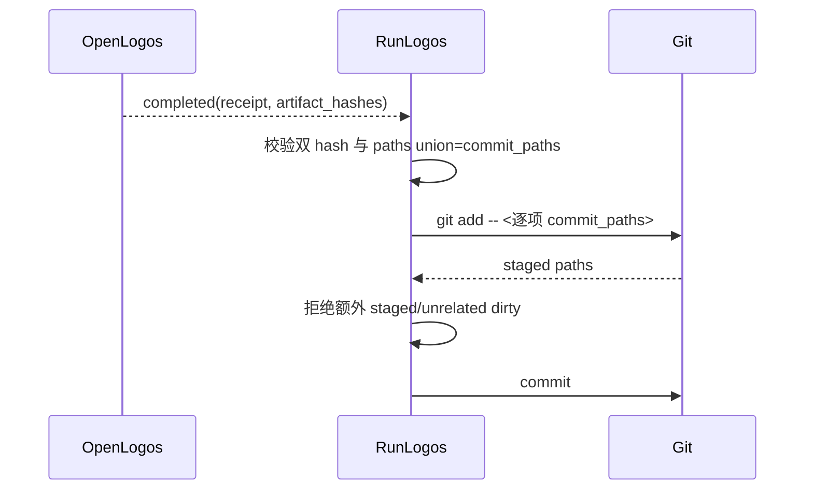

# S09: 变更管理（change / merge / archive）— 场景实现

> Phase 3 Step 1 · 场景建模

S09 由三个 CLI 子命令组成，覆盖变更提案的完整生命周期：创建 → 合并 → 归档。

## 参与方

| 别名 | 组件 | 说明 |
|------|------|------|
| U | 用户终端 | 执行 CLI 命令的终端 |
| CLI | openlogos CLI | `cli/src/commands/{change,merge,archive}.ts` |
| FS | 本地文件系统 | 变更提案目录 |
| AI | AI 编程工具 | Cursor / Claude Code（执行 merge-executor Skill） |

---

## S09-A: openlogos change

### 时序图

### 步骤说明

1. **开发者**在终端输入 `openlogos change <slug>`，其中 `slug` 是变更提案的名称标识（如 `add-remember-me`）。
2. **CLI** 检查 `logos/logos.config.json` 是否存在。如果不存在 → 见 EX-2.1。如果用户未传入 `slug` 参数 → 见 EX-3.1。
3. **CLI** 检查 `logos/.openlogos-guard` 是否存在。如果存在，则读取其中的 `activeChange`，并检查该提案是否仍位于 `logos/changes/` 下且未归档。如果是，则说明当前已有活动提案 → 见 EX-3.2。
4. **CLI** 检查 `logos/changes/{slug}/` 目录是否已存在。如果已存在 → 见 EX-4.1。
5. **CLI** 从 `logos/logos.config.json` 中读取 `locale`。
6. **CLI** 创建 `logos/changes/{slug}/` 根目录。
7. **CLI** 在提案目录下创建 4 个 `deltas/` 子目录：`deltas/prd`、`deltas/api`、`deltas/database`、`deltas/scenario`。

> 这 4 个分类与 `merge` 命令的 `DELTA_TO_RESOURCE` 映射一致。用户和 AI 将 delta 文件放入对应分类后，`merge` 命令根据分类自动映射到目标资源目录。

8. **CLI** 生成并写入 `proposal.md`，内容由 `proposalTemplate(locale, slug)` 根据 locale 生成中/英文模板。
9. **CLI** 生成并写入 `tasks.md`，内容由 `tasksTemplate(locale)` 根据 locale 生成中/英文模板。
10. **CLI** 写入 `logos/.openlogos-guard`，将当前 `slug` 记录为唯一活动提案。
11. **CLI** 在终端输出已创建的文件清单和下一步操作指引（对 AI 说「帮我填写变更提案」→ 编辑 delta 文件 → 运行 `openlogos merge`）。

### 异常用例

#### EX-2.1: 项目未初始化

- **触发条件**：Step 2 检测到 `logos/logos.config.json` 不存在
- **期望响应**：stderr 输出错误信息，exit(1)
- **副作用**：不创建任何文件

#### EX-3.1: 缺少 slug 参数

- **触发条件**：用户未传入 `slug` 参数
- **期望响应**：stderr 输出 Usage 示例（`Usage: openlogos change <slug>`），exit(1)
- **副作用**：不创建任何文件

#### EX-3.2: 活动 guard 冲突

- **触发条件**：Step 3 检测到 `logos/.openlogos-guard` 存在，且其 `activeChange` 仍对应 `logos/changes/` 下一个未归档提案
- **期望响应**：stderr 输出当前活动提案冲突信息，提示先完成并归档该提案，exit(1)
- **副作用**：不创建新提案目录，不覆盖已有 guard

#### EX-4.1: 同名提案已存在

- **触发条件**：Step 4 检测到 `logos/changes/{slug}/` 已存在
- **期望响应**：stderr 输出 `Error: Change proposal '{slug}' already exists.`，exit(1)
- **副作用**：不覆盖已有提案

---

## S09-B: openlogos merge

### 时序图

### 步骤说明

1. **开发者**在终端输入 `openlogos merge <slug>`。
2. **CLI** 检查 `logos/logos.config.json` 是否存在。如果不存在则报错 exit(1)。
3. **CLI** 检查 `logos/changes/{slug}/` 目录是否存在。如果不存在 → 见 EX-3.1。
4. **CLI** 遍历 `logos/changes/{slug}/deltas/` 下的每个子目录（`prd`、`api`、`database`、`scenario`），收集所有非隐藏文件作为 delta 文件列表，同时通过 `DELTA_TO_RESOURCE` 映射表将分类名转换为目标资源路径。如果所有分类目录均为空 → 见 EX-4.1。

> 例如 `deltas/prd/requirements-update.md` 映射到 `logos/resources/prd`，`deltas/api/auth-v2.yaml` 映射到 `logos/resources/api`。未在映射表中的子目录被忽略。

5. **CLI** 从 `logos/logos.config.json` 读取 `locale`，并读取 `proposal.md` 的完整内容。
6. **CLI** 调用 `mergePromptTemplate()` 生成 `MERGE_PROMPT.md` 的文本内容，包含提案元信息、`proposal.md` 原文（让 AI 理解变更意图）、以及每个 delta 文件的路径和目标目录的操作指令。

> 这是 CLI 与 AI 的桥梁——CLI 不执行实际合并，只生成指令文件，由 AI 读取后按 `merge-executor` Skill 的规范执行。

7. **CLI** 将生成的内容写入 `logos/changes/{slug}/MERGE_PROMPT.md`。
8. **CLI** 在终端输出合并摘要：提案名称、delta 文件数量、每个 delta 文件到目标目录的映射关系。
9. **CLI** 输出可直接使用的 AI 提示词（如 `对 AI 说：「读取 MERGE_PROMPT.md 并执行合并」`）和后续步骤提醒：执行合并后提交规格文档、按更新后的规格实现代码、运行 `openlogos verify` 验收，PASS 后再明确授权 `openlogos archive {slug}`。

### 异常用例

#### EX-3.1: 提案不存在

- **触发条件**：Step 3 检测到 `logos/changes/{slug}/` 不存在
- **期望响应**：stderr 输出 `Error: Change proposal '{slug}' not found.`，exit(1)
- **副作用**：不生成任何文件

#### EX-4.1: 无 delta 文件

- **触发条件**：Step 4 扫描后 `deltas/` 下所有分类目录均为空
- **期望响应**：stderr 输出 `Error: No delta files found in logos/changes/{slug}/deltas/.`，exit(1)
- **副作用**：不生成 MERGE_PROMPT.md

---

## S09-D: openlogos verify（变更验收）

### 时序图

### 步骤说明

1. **AI** 完成代码实现并提交后，在终端输出提示：`请运行 openlogos verify 完成验收，通过后再归档`。AI 不得自动执行此命令。
2. **用户**在终端输入 `openlogos verify`。
3. **CLI** 读取 `logos/resources/verify/test-results.jsonl`（由测试代码中的 OpenLogos reporter 写入）。
4. **CLI** 读取 `logos/resources/test/*.md`，提取所有用例 ID。
5. **CLI** 计算两项指标：
   - **覆盖度**：JSONL 中出现的用例 ID / test-cases.md 中定义的全部用例 ID
   - **通过率**：status=pass 的用例数 / JSONL 中的总用例数
6. **CLI** 将验收结果写入 `logos/resources/verify/acceptance-report.md`。
7. **CLI** 在终端输出判定结果：
   - PASS：提示用户可以授权归档（`openlogos archive {slug}`）
   - FAIL：列出失败用例和未覆盖用例，提示用户修复代码后重新验收（无需重走 merge 流程）

### 行为约束

- **AI 不得自动执行 `openlogos verify`**：verify 是人类确认点，AI 只负责提示
- **verify 在代码实现之后**：verify 验收的是代码，必须在 merge 规格落地 + 代码实现完成后才能运行
- **验收失败只修代码**：FAIL 时只需修复代码并重新运行 verify，不需要重走 merge 流程
- **验收失败不得跳过**：FAIL 状态下不得提示用户归档，必须先修复

---

## S09-E: git commit / push（版本提交）

### 时序图

### 步骤说明

三个自动 commit 节点（AI 执行，告知用户，无需确认）：

| 节点 | 触发时机 | commit message |
|------|---------|---------------|
| 规格 commit | merge-executor 完成合并后 | `docs({slug}): merge spec deltas` |
| 代码 commit | code-implementor 完成实现后 | `feat/fix({slug}): implement changes` |
| 归档 commit | archive 完成后 | `chore({slug}): archive change proposal` |

push 是独立的人类确认点：三个 commit 完成后，AI 提示用户确认是否推送，用户明确授权后才执行 `git push`。

### 行为约束

- **commit 无需用户确认**：三个节点的 commit 由 AI 自动执行，但必须在终端告知用户
- **push 必须用户确认**：AI 不得在未获明确授权的情况下执行 `git push`
- **commit 粒度规则**：
  - 需求级 / 设计级变更：3 个独立 commit（规格 + 代码 + 归档）
  - 接口级变更：规格和代码可合并为 1 个 commit，归档单独 1 个
  - 代码级修复：代码 1 个 commit + 归档 1 个 commit

---

## S09-C: openlogos archive

### 时序图

### 步骤说明

1. **开发者**在终端输入 `openlogos archive <slug>`。
2. **CLI** 检查 `logos/logos.config.json` 是否存在。如果不存在则报错 exit(1)。
3. **CLI** 从 `logos/logos.config.json` 中读取 `locale`。
4. **CLI** 检查 `logos/changes/{slug}/` 目录是否存在。如果不存在 → 见 EX-4.1。
5. **CLI** 检查 `logos/changes/archive/{slug}/` 是否已存在。如果已存在 → 见 EX-5.1。
6. **CLI** 调用 `mkdirSync` 确保 `logos/changes/archive/` 目录存在（幂等操作）。
7. **CLI** 调用 `renameSync` 将 `logos/changes/{slug}/` 整体移动到 `logos/changes/archive/{slug}/`。

> 选择 `renameSync` 而非复制+删除：(1) 原子操作，不会出现"复制了一半失败"的中间状态；(2) 同文件系统内 rename 是 O(1) 操作；(3) 归档后原位置不留残留。

8. **CLI** 在终端输出归档确认信息和归档路径。

### 异常用例

#### EX-4.1: 提案不存在

- **触发条件**：Step 4 检测到 `logos/changes/{slug}/` 不存在
- **期望响应**：stderr 输出 `Error: Change proposal '{slug}' not found.`，exit(1)
- **副作用**：不移动任何文件

#### EX-5.1: 归档已存在

- **触发条件**：Step 5 检测到 `logos/changes/archive/{slug}/` 已存在
- **期望响应**：stderr 输出 `Error: Archive '{slug}' already exists in logos/changes/archive/.`，exit(1)
- **副作用**：不覆盖已有归档，不移动原提案

## S09-B 合并事务责任、提交与授权边界

### 目标

把“内容准备”“正式规格提交”“Git commit”和“后续发布”拆成可审计的不同责任，消除旧流程中 Agent 同时生成 manifest、写正式目标、touch marker 和提交 Git 的越权链。

### 责任矩阵

| 责任 | 唯一所有者 | Agent / RunLogos 边界 |
|---|---|---|
| canonical target、mode、hash、producer/validator | OpenLogos | 只读，不得补全或重排 |
| transaction control、phase、journal、receipt | OpenLogos | 只通过 CLI 公共动作消费 |
| 声明的最终内容 slot | merge-executor Agent | 只写 `agent_io.write_paths`，原子替换 |
| metadata、counter/index、dogfood、marker | OpenLogos | Agent 与 RunLogos 零写入 |
| WorkUnit 完成与 quiescent | RunLogos | 只控制何时尝试 seal，不定义 merge 成功 |
| 规格 Git commit 路径 | completed receipt | RunLogos/AI 只能提交 receipt 的 `commit_paths` |

### 提交时序

### 步骤说明

1. 只有 OpenLogos completed receipt 能触发规格 commit；Agent done、WorkUnit done、`MERGE_PROMPT_GENERATED` 或 slot 齐全都不是成功证据。
2. RunLogos 校验 receipt schema/contract hash、transaction/plan identity、`SPEC_MERGED` hash 与每个 final hash。
3. Git 执行器只提交 receipt 精确列出的正式资源、metadata、dogfood 和 marker；transaction 私有 slot、临时文件、journal、staging、backup 不得进入 commit。
4. commit 失败不改变 transaction completed 状态；重试 Git 仍消费同一 receipt，不得重新 apply。
5. push、npm publish、tag、GitHub Release、官网发布仍是独立授权域；本机全局 candidate 安装不隐含这些授权。

### 异常与边界

#### EX-MT-09B-1：receipt 缺失或路径超集
- **触发条件**：transaction 非 completed，或 receipt `commit_paths` 包含 slot/journal/仓库外路径。
- **期望响应**：拒绝 commit，报告合同错误；不得扫描工作区猜路径。
- **副作用**：无 Git 写入。

#### EX-MT-09B-2：正式文件在 completed 后漂移
- **触发条件**：commit 前重算 final hash 与 receipt 不一致。
- **期望响应**：拒绝 commit并保留诊断；不得修改 receipt 或重跑 apply 覆盖用户字节。
- **副作用**：无 Git 写入。

#### EX-MT-09B-3：RunLogos deadline 到期
- **触发条件**：宿主 watchdog 到期但 OpenLogos 仍为 collecting/waiting 或 applying/recovering。
- **期望响应**：宿主继续按 allowed actions/status 处理或报告超时，不得自行标记 completed/failed。
- **副作用**：transaction 权威不变。

### 追溯

- 场景：S09 合并事务单一权威生命周期。
- 测试：UT-S09-245～UT-S09-250、ST-S09-96～ST-S09-98。

## S09 精确 Git 提交与 stacked change 交接

### 精确提交主路径

RunLogos 不读取内部 receipt、slot、journal 或目录扫描来扩充提交集合。任何 commit path 缺 hash、额外 hash、重复路径、绝对路径或逃逸都 fail closed。

### Stacked change/guard 交接

1. 旧 `refresh-merge-transaction-cross-repo-plan` 只占用主 worktree 与 SMOKE-core-150。
2. 新 follow-up 只占用独立 branch/worktree 与 SMOKE-core-151+。
3. 新 candidate 部署后完成 RunLogos E2E；先让旧 smoke PASS 并归档旧 slug。
4. 再让 follow-up smoke PASS 并归档新 slug。
5. 两个 archive commit 完成且主 worktree 干净后合入 follow-up branch，冲突按 completed receipts 和有效规格解决并复验。
6. 禁止复制、删除、手改 guard，禁止跨 slug 共享 verify/smoke/archive marker。
