# S09: 变更管理（change / merge / archive）— 场景实现

> Phase 3 Step 1 · 场景建模

S09 由三个 CLI 子命令组成，覆盖变更提案的完整生命周期：创建 → 合并 → 归档。

## 参与方

| 别名 | 组件 | 说明 |
|------|------|------|
| U | 用户终端 | 执行 CLI 命令的终端 |
| CLI | openlogos CLI | `cli/src/commands/{change,merge,archive}.ts` |
| FS | 本地文件系统 | 变更提案目录 |
| AI | AI 编程工具 | Cursor / Claude Code（执行 merge-executor Skill） |

---

## S09-A: openlogos change

### 时序图

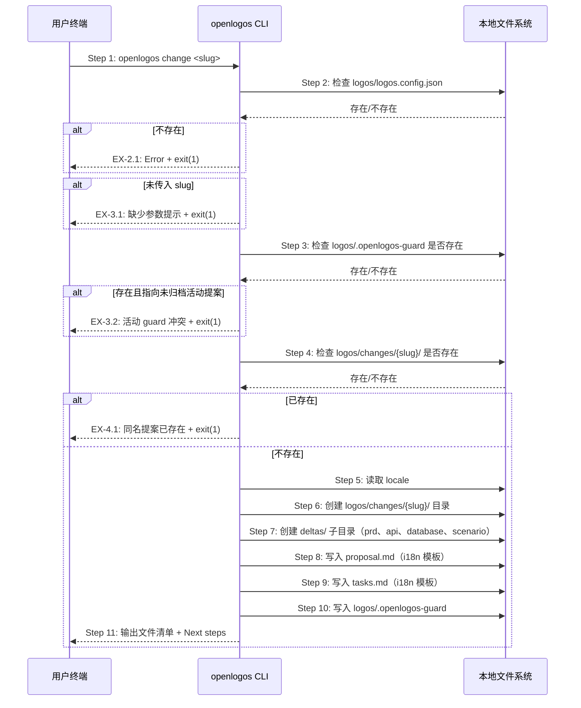
```mermaid
sequenceDiagram
    participant U as 用户终端
    participant CLI as openlogos CLI
    participant FS as 本地文件系统

    U->>CLI: Step 1: openlogos change <slug>
    CLI->>FS: Step 2: 检查 logos/logos.config.json
    FS-->>CLI: 存在/不存在

    alt 不存在
        CLI-->>U: EX-2.1: Error + exit(1)
    end

    alt 未传入 slug
        CLI-->>U: EX-3.1: 缺少参数提示 + exit(1)
    end

    CLI->>FS: Step 3: 检查 logos/.openlogos-guard 是否存在
    FS-->>CLI: 存在/不存在

    alt 存在且指向未归档活动提案
        CLI-->>U: EX-3.2: 活动 guard 冲突 + exit(1)
    end

    CLI->>FS: Step 4: 检查 logos/changes/{slug}/ 是否存在
    FS-->>CLI: 存在/不存在

    alt 已存在
        CLI-->>U: EX-4.1: 同名提案已存在 + exit(1)
    else 不存在
        CLI->>FS: Step 5: 读取 locale
        CLI->>FS: Step 6: 创建 logos/changes/{slug}/ 目录
        CLI->>FS: Step 7: 创建 deltas/ 子目录（prd、api、database、scenario）
        CLI->>FS: Step 8: 写入 proposal.md（i18n 模板）
        CLI->>FS: Step 9: 写入 tasks.md（i18n 模板）
        CLI->>FS: Step 10: 写入 logos/.openlogos-guard
        CLI-->>U: Step 11: 输出文件清单 + Next steps
    end
```

### 步骤说明

1. **开发者**在终端输入 `openlogos change <slug>`，其中 `slug` 是变更提案的名称标识（如 `add-remember-me`）。
2. **CLI** 检查 `logos/logos.config.json` 是否存在。如果不存在 → 见 EX-2.1。如果用户未传入 `slug` 参数 → 见 EX-3.1。
3. **CLI** 检查 `logos/.openlogos-guard` 是否存在。如果存在，则读取其中的 `activeChange`，并检查该提案是否仍位于 `logos/changes/` 下且未归档。如果是，则说明当前已有活动提案 → 见 EX-3.2。
4. **CLI** 检查 `logos/changes/{slug}/` 目录是否已存在。如果已存在 → 见 EX-4.1。
5. **CLI** 从 `logos/logos.config.json` 中读取 `locale`。
6. **CLI** 创建 `logos/changes/{slug}/` 根目录。
7. **CLI** 在提案目录下创建 4 个 `deltas/` 子目录：`deltas/prd`、`deltas/api`、`deltas/database`、`deltas/scenario`。

> 这 4 个分类与 `merge` 命令的 `DELTA_TO_RESOURCE` 映射一致。用户和 AI 将 delta 文件放入对应分类后，`merge` 命令根据分类自动映射到目标资源目录。

8. **CLI** 生成并写入 `proposal.md`，内容由 `proposalTemplate(locale, slug)` 根据 locale 生成中/英文模板。
9. **CLI** 生成并写入 `tasks.md`，内容由 `tasksTemplate(locale)` 根据 locale 生成中/英文模板。
10. **CLI** 写入 `logos/.openlogos-guard`，将当前 `slug` 记录为唯一活动提案。
11. **CLI** 在终端输出已创建的文件清单和下一步操作指引（对 AI 说「帮我填写变更提案」→ 编辑 delta 文件 → 运行 `openlogos merge`）。

### 异常用例

#### EX-2.1: 项目未初始化

- **触发条件**：Step 2 检测到 `logos/logos.config.json` 不存在
- **期望响应**：stderr 输出错误信息，exit(1)
- **副作用**：不创建任何文件

#### EX-3.1: 缺少 slug 参数

- **触发条件**：用户未传入 `slug` 参数
- **期望响应**：stderr 输出 Usage 示例（`Usage: openlogos change <slug>`），exit(1)
- **副作用**：不创建任何文件

#### EX-3.2: 活动 guard 冲突

- **触发条件**：Step 3 检测到 `logos/.openlogos-guard` 存在，且其 `activeChange` 仍对应 `logos/changes/` 下一个未归档提案
- **期望响应**：stderr 输出当前活动提案冲突信息，提示先完成并归档该提案，exit(1)
- **副作用**：不创建新提案目录，不覆盖已有 guard

#### EX-4.1: 同名提案已存在

- **触发条件**：Step 4 检测到 `logos/changes/{slug}/` 已存在
- **期望响应**：stderr 输出 `Error: Change proposal '{slug}' already exists.`，exit(1)
- **副作用**：不覆盖已有提案

---

## S09-B: openlogos merge

### 时序图

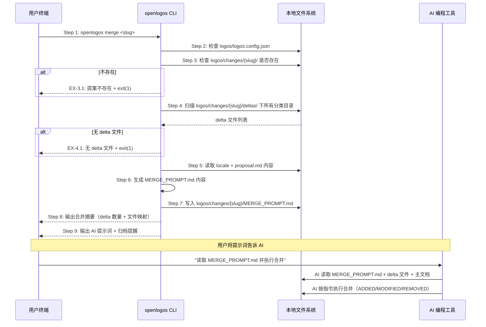
```mermaid
sequenceDiagram
    participant U as 用户终端
    participant CLI as openlogos CLI
    participant FS as 本地文件系统
    participant AI as AI 编程工具

    U->>CLI: Step 1: openlogos merge <slug>
    CLI->>FS: Step 2: 检查 logos/logos.config.json
    CLI->>FS: Step 3: 检查 logos/changes/{slug}/ 是否存在

    alt 不存在
        CLI-->>U: EX-3.1: 提案不存在 + exit(1)
    end

    CLI->>FS: Step 4: 扫描 logos/changes/{slug}/deltas/ 下所有分类目录
    FS-->>CLI: delta 文件列表

    alt 无 delta 文件
        CLI-->>U: EX-4.1: 无 delta 文件 + exit(1)
    end

    CLI->>FS: Step 5: 读取 locale + proposal.md 内容
    CLI->>CLI: Step 6: 生成 MERGE_PROMPT.md 内容
    CLI->>FS: Step 7: 写入 logos/changes/{slug}/MERGE_PROMPT.md

    CLI-->>U: Step 8: 输出合并摘要（delta 数量 + 文件映射）
    CLI-->>U: Step 9: 输出 AI 提示词 + 归档提醒

    Note over U,AI: 用户将提示词告诉 AI
    U->>AI: "读取 MERGE_PROMPT.md 并执行合并"
    AI->>FS: AI 读取 MERGE_PROMPT.md + delta 文件 + 主文档
    AI->>FS: AI 按指令执行合并（ADDED/MODIFIED/REMOVED）
```

### 步骤说明

1. **开发者**在终端输入 `openlogos merge <slug>`。
2. **CLI** 检查 `logos/logos.config.json` 是否存在。如果不存在则报错 exit(1)。
3. **CLI** 检查 `logos/changes/{slug}/` 目录是否存在。如果不存在 → 见 EX-3.1。
4. **CLI** 遍历 `logos/changes/{slug}/deltas/` 下的每个子目录（`prd`、`api`、`database`、`scenario`），收集所有非隐藏文件作为 delta 文件列表，同时通过 `DELTA_TO_RESOURCE` 映射表将分类名转换为目标资源路径。如果所有分类目录均为空 → 见 EX-4.1。

> 例如 `deltas/prd/requirements-update.md` 映射到 `logos/resources/prd`，`deltas/api/auth-v2.yaml` 映射到 `logos/resources/api`。未在映射表中的子目录被忽略。

5. **CLI** 从 `logos/logos.config.json` 读取 `locale`，并读取 `proposal.md` 的完整内容。
6. **CLI** 调用 `mergePromptTemplate()` 生成 `MERGE_PROMPT.md` 的文本内容，包含提案元信息、`proposal.md` 原文（让 AI 理解变更意图）、以及每个 delta 文件的路径和目标目录的操作指令。

> 这是 CLI 与 AI 的桥梁——CLI 不执行实际合并，只生成指令文件，由 AI 读取后按 `merge-executor` Skill 的规范执行。

7. **CLI** 将生成的内容写入 `logos/changes/{slug}/MERGE_PROMPT.md`。
8. **CLI** 在终端输出合并摘要：提案名称、delta 文件数量、每个 delta 文件到目标目录的映射关系。
9. **CLI** 输出可直接使用的 AI 提示词（如 `对 AI 说：「读取 MERGE_PROMPT.md 并执行合并」`）和后续步骤提醒：执行合并后提交规格文档、按更新后的规格实现代码、运行 `openlogos verify` 验收，PASS 后再明确授权 `openlogos archive {slug}`。

### 异常用例

#### EX-3.1: 提案不存在

- **触发条件**：Step 3 检测到 `logos/changes/{slug}/` 不存在
- **期望响应**：stderr 输出 `Error: Change proposal '{slug}' not found.`，exit(1)
- **副作用**：不生成任何文件

#### EX-4.1: 无 delta 文件

- **触发条件**：Step 4 扫描后 `deltas/` 下所有分类目录均为空
- **期望响应**：stderr 输出 `Error: No delta files found in logos/changes/{slug}/deltas/.`，exit(1)
- **副作用**：不生成 MERGE_PROMPT.md

---

## S09-D: openlogos verify（变更验收）

### 时序图

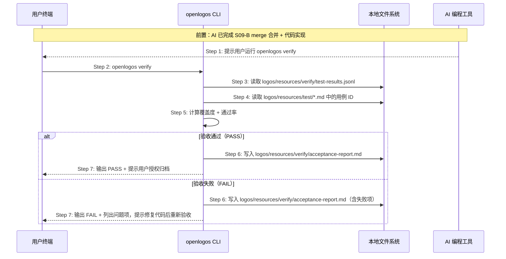
```mermaid
sequenceDiagram
    participant U as 用户终端
    participant CLI as openlogos CLI
    participant FS as 本地文件系统
    participant AI as AI 编程工具

    Note over U,AI: 前置：AI 已完成 S09-B merge 合并 + 代码实现

    AI-->>U: Step 1: 提示用户运行 openlogos verify
    U->>CLI: Step 2: openlogos verify
    CLI->>FS: Step 3: 读取 logos/resources/verify/test-results.jsonl
    CLI->>FS: Step 4: 读取 logos/resources/test/*.md 中的用例 ID
    CLI->>CLI: Step 5: 计算覆盖度 + 通过率

    alt 验收通过（PASS）
        CLI->>FS: Step 6: 写入 logos/resources/verify/acceptance-report.md
        CLI-->>U: Step 7: 输出 PASS + 提示用户授权归档
    else 验收失败（FAIL）
        CLI->>FS: Step 6: 写入 logos/resources/verify/acceptance-report.md（含失败项）
        CLI-->>U: Step 7: 输出 FAIL + 列出问题项，提示修复代码后重新验收
    end
```

### 步骤说明

1. **AI** 完成代码实现并提交后，在终端输出提示：`请运行 openlogos verify 完成验收，通过后再归档`。AI 不得自动执行此命令。
2. **用户**在终端输入 `openlogos verify`。
3. **CLI** 读取 `logos/resources/verify/test-results.jsonl`（由测试代码中的 OpenLogos reporter 写入）。
4. **CLI** 读取 `logos/resources/test/*.md`，提取所有用例 ID。
5. **CLI** 计算两项指标：
   - **覆盖度**：JSONL 中出现的用例 ID / test-cases.md 中定义的全部用例 ID
   - **通过率**：status=pass 的用例数 / JSONL 中的总用例数
6. **CLI** 将验收结果写入 `logos/resources/verify/acceptance-report.md`。
7. **CLI** 在终端输出判定结果：
   - PASS：提示用户可以授权归档（`openlogos archive {slug}`）
   - FAIL：列出失败用例和未覆盖用例，提示用户修复代码后重新验收（无需重走 merge 流程）

### 行为约束

- **AI 不得自动执行 `openlogos verify`**：verify 是人类确认点，AI 只负责提示
- **verify 在代码实现之后**：verify 验收的是代码，必须在 merge 规格落地 + 代码实现完成后才能运行
- **验收失败只修代码**：FAIL 时只需修复代码并重新运行 verify，不需要重走 merge 流程
- **验收失败不得跳过**：FAIL 状态下不得提示用户归档，必须先修复

---

## S09-E: git commit / push（版本提交）

### 时序图

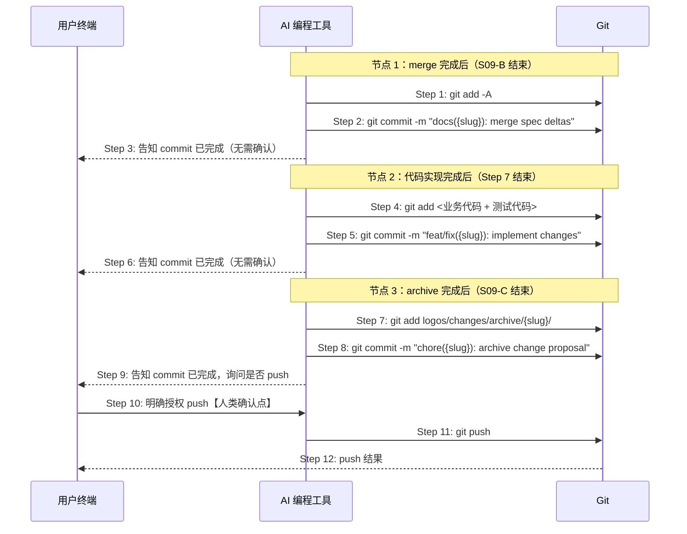
```mermaid
sequenceDiagram
    participant U as 用户终端
    participant AI as AI 编程工具
    participant GIT as Git

    Note over AI,GIT: 节点 1：merge 完成后（S09-B 结束）
    AI->>GIT: Step 1: git add -A
    AI->>GIT: Step 2: git commit -m "docs({slug}): merge spec deltas"
    AI-->>U: Step 3: 告知 commit 已完成（无需确认）

    Note over AI,GIT: 节点 2：代码实现完成后（Step 7 结束）
    AI->>GIT: Step 4: git add <业务代码 + 测试代码>
    AI->>GIT: Step 5: git commit -m "feat/fix({slug}): implement changes"
    AI-->>U: Step 6: 告知 commit 已完成（无需确认）

    Note over AI,GIT: 节点 3：archive 完成后（S09-C 结束）
    AI->>GIT: Step 7: git add logos/changes/archive/{slug}/
    AI->>GIT: Step 8: git commit -m "chore({slug}): archive change proposal"
    AI-->>U: Step 9: 告知 commit 已完成，询问是否 push

    U->>AI: Step 10: 明确授权 push【人类确认点】
    AI->>GIT: Step 11: git push
    GIT-->>U: Step 12: push 结果
```

### 步骤说明

三个自动 commit 节点（AI 执行，告知用户，无需确认）：

| 节点 | 触发时机 | commit message |
|------|---------|---------------|
| 规格 commit | merge-executor 完成合并后 | `docs({slug}): merge spec deltas` |
| 代码 commit | code-implementor 完成实现后 | `feat/fix({slug}): implement changes` |
| 归档 commit | archive 完成后 | `chore({slug}): archive change proposal` |

push 是独立的人类确认点：三个 commit 完成后，AI 提示用户确认是否推送，用户明确授权后才执行 `git push`。

### 行为约束

- **commit 无需用户确认**：三个节点的 commit 由 AI 自动执行，但必须在终端告知用户
- **push 必须用户确认**：AI 不得在未获明确授权的情况下执行 `git push`
- **commit 粒度规则**：
  - 需求级 / 设计级变更：3 个独立 commit（规格 + 代码 + 归档）
  - 接口级变更：规格和代码可合并为 1 个 commit，归档单独 1 个
  - 代码级修复：代码 1 个 commit + 归档 1 个 commit

---

## S09-C: openlogos archive

### 时序图

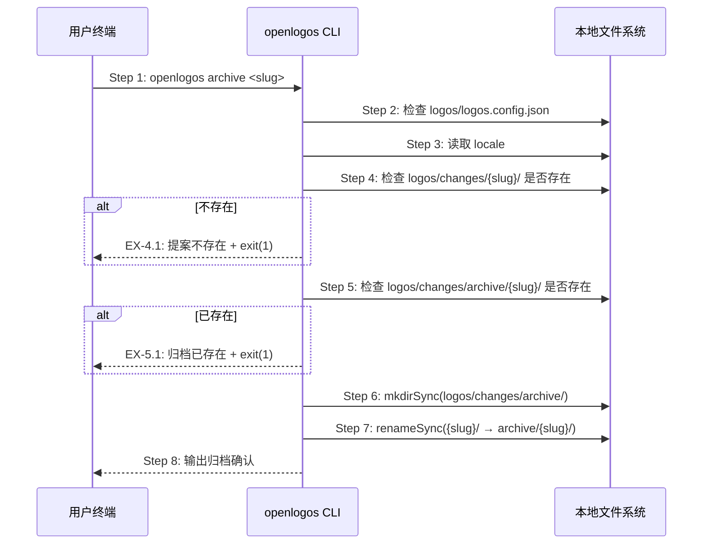
```mermaid
sequenceDiagram
    participant U as 用户终端
    participant CLI as openlogos CLI
    participant FS as 本地文件系统

    U->>CLI: Step 1: openlogos archive <slug>
    CLI->>FS: Step 2: 检查 logos/logos.config.json
    CLI->>FS: Step 3: 读取 locale
    CLI->>FS: Step 4: 检查 logos/changes/{slug}/ 是否存在

    alt 不存在
        CLI-->>U: EX-4.1: 提案不存在 + exit(1)
    end

    CLI->>FS: Step 5: 检查 logos/changes/archive/{slug}/ 是否存在

    alt 已存在
        CLI-->>U: EX-5.1: 归档已存在 + exit(1)
    end

    CLI->>FS: Step 6: mkdirSync(logos/changes/archive/)
    CLI->>FS: Step 7: renameSync({slug}/ → archive/{slug}/)

    CLI-->>U: Step 8: 输出归档确认
```

### 步骤说明

1. **开发者**在终端输入 `openlogos archive <slug>`。
2. **CLI** 检查 `logos/logos.config.json` 是否存在。如果不存在则报错 exit(1)。
3. **CLI** 从 `logos/logos.config.json` 中读取 `locale`。
4. **CLI** 检查 `logos/changes/{slug}/` 目录是否存在。如果不存在 → 见 EX-4.1。
5. **CLI** 检查 `logos/changes/archive/{slug}/` 是否已存在。如果已存在 → 见 EX-5.1。
6. **CLI** 调用 `mkdirSync` 确保 `logos/changes/archive/` 目录存在（幂等操作）。
7. **CLI** 调用 `renameSync` 将 `logos/changes/{slug}/` 整体移动到 `logos/changes/archive/{slug}/`。

> 选择 `renameSync` 而非复制+删除：(1) 原子操作，不会出现"复制了一半失败"的中间状态；(2) 同文件系统内 rename 是 O(1) 操作；(3) 归档后原位置不留残留。

8. **CLI** 在终端输出归档确认信息和归档路径。

### 异常用例

#### EX-4.1: 提案不存在

- **触发条件**：Step 4 检测到 `logos/changes/{slug}/` 不存在
- **期望响应**：stderr 输出 `Error: Change proposal '{slug}' not found.`，exit(1)
- **副作用**：不移动任何文件

#### EX-5.1: 归档已存在

- **触发条件**：Step 5 检测到 `logos/changes/archive/{slug}/` 已存在
- **期望响应**：stderr 输出 `Error: Archive '{slug}' already exists in logos/changes/archive/.`，exit(1)
- **副作用**：不覆盖已有归档，不移动原提案

## S09-B 合并事务责任、提交与授权边界

### 目标

把“内容准备”“正式规格提交”“Git commit”和“后续发布”拆成可审计的不同责任，消除旧流程中 Agent 同时生成 manifest、写正式目标、touch marker 和提交 Git 的越权链。

### 责任矩阵

| 责任 | 唯一所有者 | Agent / RunLogos 边界 |
|---|---|---|
| canonical target、mode、hash、producer/validator | OpenLogos | 只读，不得补全或重排 |
| transaction control、phase、journal、receipt | OpenLogos | 只通过 CLI 公共动作消费 |
| 声明的最终内容 slot | merge-executor Agent | 只写 `agent_io.write_paths`，原子替换 |
| metadata、counter/index、dogfood、marker | OpenLogos | Agent 与 RunLogos 零写入 |
| WorkUnit 完成与 quiescent | RunLogos | 只控制何时尝试 seal，不定义 merge 成功 |
| 规格 Git commit 路径 | completed receipt | RunLogos/AI 只能提交 receipt 的 `commit_paths` |

### 提交时序

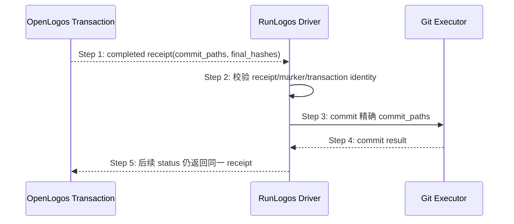
```mermaid
sequenceDiagram
    participant O as OpenLogos Transaction
    participant R as RunLogos Driver
    participant G as Git Executor
    O-->>R: Step 1: completed receipt(commit_paths, final_hashes)
    R->>R: Step 2: 校验 receipt/marker/transaction identity
    R->>G: Step 3: commit 精确 commit_paths
    G-->>R: Step 4: commit result
    R-->>O: Step 5: 后续 status 仍返回同一 receipt
```

### 步骤说明

1. 只有 OpenLogos completed receipt 能触发规格 commit；Agent done、WorkUnit done、`MERGE_PROMPT_GENERATED` 或 slot 齐全都不是成功证据。
2. RunLogos 校验 receipt schema/contract hash、transaction/plan identity、`SPEC_MERGED` hash 与每个 final hash。
3. Git 执行器只提交 receipt 精确列出的正式资源、metadata、dogfood 和 marker；transaction 私有 slot、临时文件、journal、staging、backup 不得进入 commit。
4. commit 失败不改变 transaction completed 状态；重试 Git 仍消费同一 receipt，不得重新 apply。
5. push、npm publish、tag、GitHub Release、官网发布仍是独立授权域；本机全局 candidate 安装不隐含这些授权。

### 异常与边界

#### EX-MT-09B-1：receipt 缺失或路径超集
- **触发条件**：transaction 非 completed，或 receipt `commit_paths` 包含 slot/journal/仓库外路径。
- **期望响应**：拒绝 commit，报告合同错误；不得扫描工作区猜路径。
- **副作用**：无 Git 写入。

#### EX-MT-09B-2：正式文件在 completed 后漂移
- **触发条件**：commit 前重算 final hash 与 receipt 不一致。
- **期望响应**：拒绝 commit并保留诊断；不得修改 receipt 或重跑 apply 覆盖用户字节。
- **副作用**：无 Git 写入。

#### EX-MT-09B-3：RunLogos deadline 到期
- **触发条件**：宿主 watchdog 到期但 OpenLogos 仍为 collecting/waiting 或 applying/recovering。
- **期望响应**：宿主继续按 allowed actions/status 处理或报告超时，不得自行标记 completed/failed。
- **副作用**：transaction 权威不变。

### 追溯

- 场景：S09 合并事务单一权威生命周期。
- 测试：UT-S09-245～UT-S09-250、ST-S09-96～ST-S09-98。

## S09 精确 Git 提交与 stacked change 交接

### 精确提交主路径

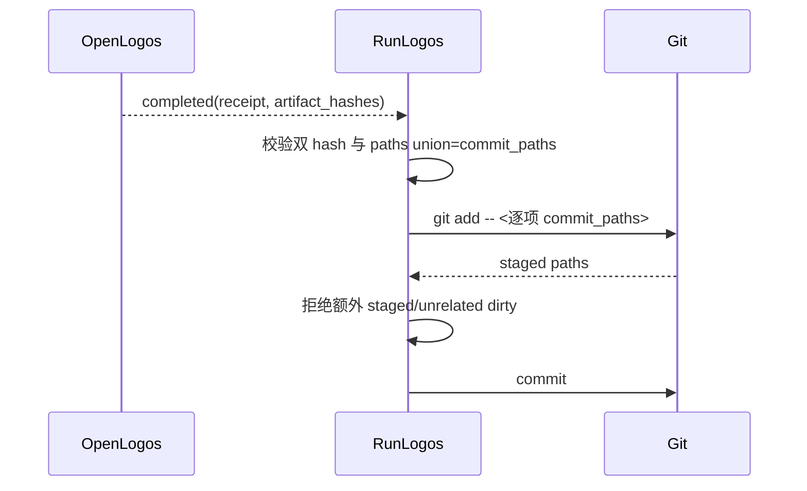
```mermaid
sequenceDiagram
    participant O as OpenLogos
    participant R as RunLogos
    participant G as Git
    O-->>R: completed(receipt, artifact_hashes)
    R->>R: 校验双 hash 与 paths union=commit_paths
    R->>G: git add -- <逐项 commit_paths>
    G-->>R: staged paths
    R->>R: 拒绝额外 staged/unrelated dirty
    R->>G: commit
```

RunLogos 不读取内部 receipt、slot、journal 或目录扫描来扩充提交集合。任何 commit path 缺 hash、额外 hash、重复路径、绝对路径或逃逸都 fail closed。

### Stacked change/guard 交接

1. 旧 `refresh-merge-transaction-cross-repo-plan` 只占用主 worktree 与 SMOKE-core-150。
2. 新 follow-up 只占用独立 branch/worktree 与 SMOKE-core-151+。
3. 新 candidate 部署后完成 RunLogos E2E；先让旧 smoke PASS 并归档旧 slug。
4. 再让 follow-up smoke PASS 并归档新 slug。
5. 两个 archive commit 完成且主 worktree 干净后合入 follow-up branch，冲突按 completed receipts 和有效规格解决并复验。
6. 禁止复制、删除、手改 guard，禁止跨 slug 共享 verify/smoke/archive marker。

## S09 Missing-slot 修复、授权与提交边界

### 责任矩阵

| 责任方 | 允许 | 禁止 |
|---|---|---|
| OpenLogos core | preflight、结构化归因、原子 reopen、seal/apply/recover | 猜测错误消息、首写后 reopen |
| Merge consumer/Agent | 读取 status/next、重建 rejected target final bytes、写声明 staging、submit | 写正式 resources、transaction 私有状态、receipt/marker |
| 用户 | 在独立门批准 merge/verify/deploy/smoke/archive/push | 以 proposal/tasks 文案代替确认点 |

### Missing-slot 修复时序

```mermaid
sequenceDiagram
    participant O as OpenLogos Core
    participant C as Consumer
    participant G as Declared Staging
    participant T as Transaction

    O-->>C: retryable + phase=collecting
    C->>T: status
    T-->>C: one/more missing_slot_ids; others submitted
    C->>C: regenerate final bytes from approved Delta/effective baseline
    C->>G: temp write + fsync + atomic rename
    C->>O: submit-content --slot --file declared-path
    O->>T: verify bytes/hash; update submitted
    O-->>C: ready when all required slots present
    C->>O: seal
```

消费者不得把 retryable 解释成“修改现有 sealed slot”：只有 core 已持久化 collecting 且该 slot 出现在 missing 集合时才可重提。无关 slot 不重新生成、不重新 submit。

### Git 与制品边界

- reopen、slot 私有清理和 staging 都不是可提交规格产物。
- 只有 completed receipt 的 `commit_paths` 可以进入精确规格提交。
- legacy transaction 完成后仍按 receipt 校验 final/artifact hashes；不能因 transaction ID 沿用而跳过。
- RunLogos 的 `UT-S44-24` 修复发生在其当前提案声明 staging 中；不得直接修改正式 `logos/resources/test/core-S44-test-cases.md`。

### 授权边界

本次 plan approval 只允许 Delta。Delta 完成后的 `openlogos merge`、代码完成后的 verify、0.14.2 部署、smoke、RunLogos transaction继续、archive与push分别遵守确认点。只有明确的当前用户消息或 `--auto` standing授权可以消费对应门；proposal/decision/tasks自身不是执行授权。

### 异常

- status显示fatal/unattributable：停止，不清 slot、不abort掩盖原因。
- plan/source/before drift：停止并按稳定分类处理，不生成新 transaction规避。
- journal/recovery错误：只执行 recover/rollback路径。
- 修正后仍有内容错误：core可再次按同规则只退回新 rejected slots。

## S09-B 合并事务终态出路（abort 重建 / fatal 修复 / completed 受控重开）

> 来源变更：fix-merge-transaction-abort-recover-reopen。承接「S09-B: openlogos merge」与「S09-B 合并事务责任、提交与授权边界」：终态不再是死局，出路受控、留痕、单一权威（功能规格 §2.58；架构 §四十五）。

### 场景目标

提案的合并事务进入任一终态（aborted / fatal failed / completed）后，用户修正 delta 或发现已合并规格有误时，能经公开命令在提案内受控重来，不再依赖人工删除事务文件。

### 主时序（completed 受控重开）

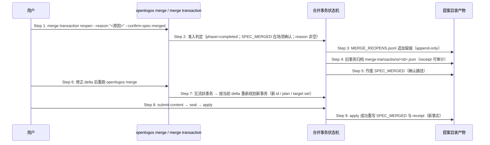
```mermaid
sequenceDiagram
    participant U as 用户
    participant M as openlogos merge / merge transaction
    participant T as 合并事务状态机
    participant W as 提案目录产物

    U->>M: Step 1: merge transaction reopen --reason "<原因>" --confirm-spec-merged
    M->>T: Step 2: 准入判定（phase=completed；SPEC_MERGED 在场须确认；reason 非空）
    T->>W: Step 3: MERGE_REOPENS.jsonl 追加留痕（append-only）
    T->>W: Step 4: 旧事务归档 merge-transactions/<id>.json（receipt 可审计）
    T->>W: Step 5: 作废 SPEC_MERGED（确认路径）
    U->>M: Step 6: 修正 delta 后重跑 openlogos merge
    M->>T: Step 7: 无活跃事务 → 按当前 delta 重新规划新事务（新 id / plan / target set）
    U->>T: Step 8: submit-content → seal → apply
    T->>W: Step 9: apply 成功重写 SPEC_MERGED 与 receipt（新事实）
```

### 步骤说明

1. **用户**对 completed 事务执行 `reopen`，附非空 `--reason`；`SPEC_MERGED` 在场时另附 `--confirm-spec-merged`。
2. **合并事务状态机**按准入矩阵判定（功能规格 §2.58.3）；任一前置不满足即拒绝且零副作用。
3. **状态机**在单一动作内按序完成留痕、归档、作废——任一步失败整体不生效。
4. **用户**修正 delta 后重跑 `openlogos merge`；创建入口发现无活跃事务，按当前 delta 重新规划（aborted / fatal failed 终态走同一让位路径：归档后直接重建，无需 reopen）。
5. **用户**重走 submit-content → seal → apply；成功后 `SPEC_MERGED` 与 receipt 重写为新事实，下游按指纹自然传导收敛（C01）。

### 异常与边界

- **abort 后重跑 merge**：aborted 事务被归档让位、按当前 delta 重建新事务——即使 plan/target set 已变化也正确重规划（旧缺陷：无条件幂等返回 aborted 投影）。
- **fatal failed（非 recovery_required）**：`allowed_actions` 含 `abort`；abort 后走上一条重建。既有 `recovery_required → recover` 逐字不变。
- **completed + SPEC_MERGED 在场未附确认**：拒绝并给出可执行指引；零副作用（无留痕/归档/作废）。
- **`--reason` 缺失或空白**：拒绝——留痕必须有非空原因。
- **非 completed phase 执行 reopen**：`action_not_allowed`，既有出路不变。
- **事务文件不可读 / marker 不可判定**：fail-closed 拒绝，无任何写副作用。
- **completed + SPEC_MERGED 完好时直接重跑 merge**：拒绝静默重建，文案指向 reopen 入口——已合并事实不得被无痕覆盖。
- **重开后未重新 apply 前**：`SPEC_MERGED` 已作废，flow 派生自然退回 merge 前沿；下游既有产物保持旧值（无半新半旧），其失效由重合并后的指纹失配自然传导。

### 追溯

- 需求：AC-MTXOUT-01～07。
- 功能规格：§2.58；架构：§三十四、§四十五；根规范：`spec/change-management.md`、`spec/cli-json-output.md` 终态出路修订。
- 测试：UT-S09-289～292、ST-S09-111；安装态 SMOKE-core-181。

## S09-A 提案脚手架章节清单与「最小实现论证」段

### 场景目标

让 `openlogos change <slug>` 产出的提案模板在「变更类型」之前带一段 `## 最小实现论证`，在提案**落笔时**就要求论证「为什么不能更小」——作用在设计发生**之前**，与 change-lint 的事后观测（S35「变更类型 ↔ delta 层面观测 warning」）分管两端。

### 用户价值

「proposal 必须论证为什么不能更小」这条规矩此前只存在于少数几份 proposal 的正文里——模板没有这一段，没有任何机制提示下一个提案写它，换一个会话、换一个 agent 即丢失。进入模板后，它在每个新建提案开头出现，覆盖面高于任何 Skill 文本。

### 章节清单与插入位置

`proposalTemplate(locale, slug, module?)` 产出的章节顺序中，`## 最小实现论证` 固定插入在 `## 变更类型` **之前**、`## 变更原因` 之后。段内含三个占位提示：

1. 先检索既有机制——列出查了什么、为什么不够用；
2. 为什么不能更小；
3. 本提案主动砍掉了什么。

**zh / en 两套模板须同批改动**：两套是同一契约的两种语言载体，任何一套漏改都会使该语言的项目拿不到该段。该成对约定由 UT 断言（zh / en 各一条产物检查）。

### 该段不受任何既有检查约束

**缺段不告警、未填不告警、占位残留不告警**——三者均不影响 change-lint 结果与 exit code。两重独立原因，任一条单独成立即足够：

1. 既有占位符检查**不是泛化的 `[...]` 匹配**，而是**枚举特定占位文本**的正则。新段写什么占位文本都不在这张枚举表里——本能力**不**把它加进枚举。
2. 即便加进枚举也无用：该检查只在 canonical 章节白名单（`SECTION_ORDER`）的循环体内被调用，新段不进白名单，根本走不到那行。

实测确认：新段保留全部占位文本时，提案结构评估返回零 issue。

**因此该段是自律提示，不是受检约束。** 不得在规格、Skill 或实现中声称它「有检查兜底」。

### 不变量

1. `## 最小实现论证` **不进** canonical 必填章节集合——缺段不使 L0 完成合同失败。
2. 既有占位符检查的枚举表零改动；既有 canonical 章节的检查行为逐字节零回归。
3. 新增段不得使既有脚手架产物结构判定失败：填妥既有 canonical 章节后，该段占位全留的产物仍通过 L0。
4. 模板改动只影响此后**新建**的提案，不回溯改写任何既有提案。
5. zh / en 两套模板的章节集合与顺序保持一致。

### 异常与边界

- **产出方删除该段**：与从未写过等价，全流程零影响。此为有意的边界——本段的强制力为零，硬信号由 S35 的 warning 单独承担。
- **产出方空填该段**：同上，不告警。若观测期显示该段被普遍空填或删除，再议是否升格为 canonical 必填；升格是新增硬阻断点，须另行征得用户同意，不在本次范围。
- **既有 canonical 章节未填**：与本段无关——未填写的原始模板本就报既有的占位残留与部署字段违规，那是既有行为，**不得**为让新段的用例通过而放宽任何既有检查。

### 追溯

- 来源变更：anti-overdesign-scale-signals（刀二；刀一见 S35「变更类型 ↔ delta 层面观测 warning」）。
- 需求：`core-01-requirements.md`「S35/S09: 防过度设计的规模信号」验收条件 7–8。
- 测试：UT-S09-360、UT-S09-361。

## S09-A proposal.md 形态的单一来源约定

`proposal.md` 的形态与必填判据各有且只有一个来源，Skill 与方法论规范均不得再持有第二份。

### 约定

1. **形态唯一来源 = 脚手架**：`openlogos change <slug>` 由 `proposalTemplate`（`cli/src/i18n.ts`）
   写出的磁盘产物，是 `proposal.md` 章节集合与顺序的唯一事实源，随 CLI 版本演进。
2. **必填判据唯一来源 = change-lint**：canonical 必填章节由 `PLAN_SECTION_REGISTRY`
   （`cli/src/lib/plan-package-contract.ts`）经 L0 执行，UI/UX 声明段由 L7 执行。
   「某段是否必填」不由任何文档决定。**两者强度不同**：L0 违规挡 merge；L7 自 §2.83.1 起
   缺段仅告警、不挡 merge，只有段在场而结构损坏才 fail-closed。
3. **禁止第二份来源**：`skills/change-writer/SKILL.md`、`SKILL.en.md` 与 `spec/change-management.md`
   **不得内嵌可整块复制的 proposal 模板，也不得自列必填章节清单**。需要知道当前章节集合或必填项时，
   读脚手架产物或跑 `openlogos change-lint`。
4. **填写方式**：在脚手架产物上**原地逐段填写，禁止整篇重写**。该规则连同脚手架全部段的保真要求，
   统一写在 `skills/change-writer/SKILL.md` §canonical scaffold 保真（英文版 §Preserve the CLI
   scaffold），Step 4 指向它而不复述。
5. **保真范围限定在 `proposal.md`**：§canonical scaffold 保真的「全部段不得删除」只约束 `proposal.md`；
   `tasks.md` 按本次变更的实际范围增删 `[delta]` / `[code]` / `[deploy]`，规则以 `spec/tasks-spec.md`
   为准（纯规格 change 删除 `[code]`，纯代码 change 保留空 `[code]`）。

### 要防的失效模式

**脚手架新增一个不设门的段 → 下游按 Skill 的内嵌模板整篇重写 `proposal.md` → 该段被静默覆盖。**

三个环节缺一不可，而第三环没有任何检查会报错：

- canonical 段之所以历次幸存，只因 **L0** 硬卡着，产出方被逼着补回来——lint 掩盖了漂移，
  而不是消除了漂移。
- 本次实例：`anti-overdesign-scale-signals` 给脚手架加入的 `## 最小实现论证` 段**刻意不设门**
  （该提案决策 C03），因此它是当前唯一会静默丢失的段。
- 同型事故已发生过一次：20260914，产出方删掉「UI/UX 变更声明」段导致全自动 run 的 `openlogos merge`
  被 `ui_declaration_missing` 在 spec-exit 后挡停。当时的修法是为该段追加一条专属保留指令——
  **那是「默许整篇重写 + 逐段打补丁」路线，成本随脚手架段数线性增长，且每次都依赖有人记得加**。
  本约定取消「整篇重写」这个前提，新增段不再需要追加补丁。
- **该拦截其后已降级，使填写规则成为唯一保障**：按 §2.83.1，`ui_declaration_missing` 现为**警告**
  （进 `warnings`、不计入 violations、不影响退出码、不挡 merge），仅「段在场但结构损坏」
  （`ui_declaration_unparsable` / `ui_impact_not_boolean`）仍 fail-closed。也就是说，UI 声明段如今
  与「最小实现论证」同处一类：**门不再拦缺段，段的存续只靠「不整篇重写」这条填写规则**。
  当前真正被门守住的只有 L0 的 6 个 canonical 段——这正是本约定把保真范围覆盖到全部段的理由。

### 异常与边界

- **本约定不改变任何 lint 判据**：不动 `PLAN_SECTION_REGISTRY`、不动占位符枚举、不动 L0 / L7 行为，
  脚手架产物逐字节零回归。
- **「最小实现论证」维持不设门**：是否升格为 canonical 必填段属新增硬阻断点，须另行征得用户同意，
  不在本约定范围；其是否被真正填写，由后续提案的 `proposal.md` 观察。
- **本约定约束的是产出方行为**，无法由机器直接验证「产出方是否照做」。可机器判定的是文本事实：
  Skill 与 spec 中不存在可整块复制的模板与自列清单、保真条款覆盖非 canonical 段、脚手架产物零回归。

### 追溯

- 来源变更：single-source-proposal-scaffold。
- 前序变更：anti-overdesign-scale-signals（引入「最小实现论证」段，见 §S09-A 提案脚手架章节清单与「最小实现论证」段）。
- 测试：UT-S09-362、UT-S09-363、UT-S09-364；脚手架零回归复用 UT-S09-360。

## S09 无活跃提案时资料目录与基线 staging 的 guard 放行时序

### 场景目标

launched 项目在**没有活跃提案**时，AI 仍需完成两类不改动规格与源码的正常工作：维护 `logos/resources/reference/` 下的参考资料，以及在用户显式执行基线建立（S33 `openlogos baseline-seed`）时把逆向产物写入 run 私有 staging。guard 对这两类写入默认放行，正式规格、源码与基线事务状态仍受原规则保护。判定契约见根规范 `spec/pretooluse-guard.md` §资料目录与基线 staging 默认路径豁免。

### 参与者与前置条件

- 参与者：用户、AI（宿主会话）、PreToolUse guard（`guard-check`）、OpenLogos CLI（`baseline-seed begin/commit`）、文件系统。
- 前置：项目至少一个模块 `lifecycle: launched`；`logos/.openlogos-guard` 不存在；guard 由既有 init / sync 部署（S08），分发源为 `plugin/bin/guard-check`。

### 时序图

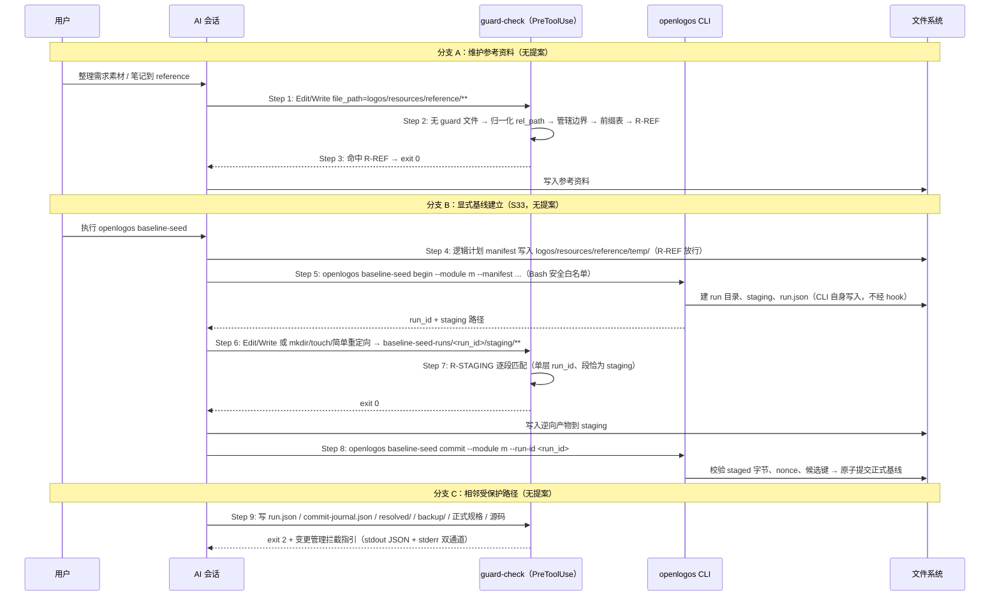
```mermaid
sequenceDiagram
    participant U as 用户
    participant AI as AI 会话
    participant G as guard-check（PreToolUse）
    participant CLI as openlogos CLI
    participant FS as 文件系统

    Note over U,FS: 分支 A：维护参考资料（无提案）
    U->>AI: 整理需求素材 / 笔记到 reference
    AI->>G: Step 1: Edit/Write file_path=logos/resources/reference/**
    G->>G: Step 2: 无 guard 文件 → 归一化 rel_path → 管辖边界 → 前缀表 → R-REF
    G-->>AI: Step 3: 命中 R-REF → exit 0
    AI->>FS: 写入参考资料

    Note over U,FS: 分支 B：显式基线建立（S33，无提案）
    U->>AI: 执行 openlogos baseline-seed
    AI->>FS: Step 4: 逻辑计划 manifest 写入 logos/resources/reference/temp/（R-REF 放行）
    AI->>CLI: Step 5: openlogos baseline-seed begin --module m --manifest ...（Bash 安全白名单）
    CLI->>FS: 建 run 目录、staging、run.json（CLI 自身写入，不经 hook）
    CLI-->>AI: run_id + staging 路径
    AI->>G: Step 6: Edit/Write 或 mkdir/touch/简单重定向 → baseline-seed-runs/<run_id>/staging/**
    G->>G: Step 7: R-STAGING 逐段匹配（单层 run_id、段恰为 staging）
    G-->>AI: exit 0
    AI->>FS: 写入逆向产物到 staging
    AI->>CLI: Step 8: openlogos baseline-seed commit --module m --run-id <run_id>
    CLI->>FS: 校验 staged 字节、nonce、候选键 → 原子提交正式基线

    Note over U,FS: 分支 C：相邻受保护路径（无提案）
    AI->>G: Step 9: 写 run.json / commit-journal.json / resolved/ / backup/ / 正式规格 / 源码
    G-->>AI: exit 2 + 变更管理拦截指引（stdout JSON + stderr 双通道）
```

### 步骤说明

1. AI 以 Edit/Write 写 `logos/resources/reference/` 下任意层级文件。
2. guard 在无 guard 文件分支，用既有归一化求 `rel_path`，先判管辖边界、再判既有前缀表，再判新增规则 R-REF / R-STAGING。
3. 命中 R-REF 放行；不要求创建提案或修改白名单配置。
4. 基线建立前，begin 所需逻辑计划 manifest 写在 `logos/resources/reference/temp/` 等已豁免位置，不额外开放 run 根目录。
5. `openlogos baseline-seed begin` 属 Bash 安全白名单（`^openlogos `）；CLI 自身签发 run_id、创建 staging 并写 run 记录，返回 staging 路径（S33 既有协议不变）。
6. AI 按返回路径写入产物：Edit/Write，或 guard 可提取目标的 Bash 形态（`mkdir`/`touch`/简单重定向等）。
7. guard 对 `rel_path` 逐段匹配 R-STAGING：前 4 段固定、第 5 段为单个合法 run_id、第 6 段恰为 `staging`，后代任意；命中即放行。
8. `baseline-seed commit` 仍是正式基线的唯一写入入口，begin/commit 校验、nonce、锁与事务恢复全部不变。
9. 对 run 根状态文件、resolved、backup、`logos/resources/verify/` 其它文件、reference 之外的正式规格与源码，guard 维持原判定：无提案 exit 2。

### 异常用例

#### EX-9.31: 近似名称路径
- **触发条件**：目标为 `logos/resources/reference-evil/x.md`、`logos/resources/references/x.md`、`.../baseline-seed-runs/<run_id>/staging-backup/x`。
- **期望响应**：不命中新规则（完整段匹配），按原规则 exit 2。

#### EX-9.32: 缺 run_id 或多层伪 run 路径
- **触发条件**：`baseline-seed-runs/staging/x.md`（缺 run_id）、`baseline-seed-runs/a/b/staging/x.md`（多层）、run_id 段不满足 `^[A-Za-z0-9][A-Za-z0-9._-]*$` 或含 `..`。
- **期望响应**：不命中 R-STAGING，exit 2。

#### EX-9.33: run 根状态与恢复材料
- **触发条件**：写 `baseline-seed-runs/<run_id>/run.json`、`commit-journal.json`、`resolved/**`、`backup/**` 或 `baseline-seed-runs/<module>.commit.lock`。
- **期望响应**：exit 2；这些文件只由 CLI 写入，豁免不覆盖。

#### EX-9.34: 点段逃逸与符号链接
- **触发条件**：`logos/resources/reference/../../../src/a.ts` 等含 `..` 的路径；或 reference / staging 下存在指向 `src/` 的符号链接并以其为写入入口。
- **期望响应**：python3/node 归一化后按真实目标判定 → exit 2；`is_whitelisted_path` 的 bash 兜底分支对含点段的路径不命中新规则（只可更保守）。完整 hook 的读入与 lifecycle 解析依赖 python3 或 node（既有行为不变），兜底一致性在函数层成立，不承诺无运行时环境下完整 hook 可工作。

#### EX-9.35: Bash 混合目标
- **触发条件**：`cp logos/resources/reference/a.md src/a.md`、`mv logos/resources/verify/baseline-seed-runs/<run_id>/staging/x logos/resources/prd/x` 等任一路径为项目内非白名单。
- **期望响应**：exit 2（逐路径判定，全部允许才放行）；对未先命中 Bash 安全白名单、进入写模式检查的命令，变量展开、命令替换、管道、复合命令、`tee`/`sed -i` 等解析不出目标的形态维持无条件阻断（如 `tee logos/resources/reference/a.md`）。先命中安全白名单的命令（如 `echo x | tee ...`）按既有优先级放行，本案不改变。

#### EX-9.36: 旧版托管 guard 未更新
- **触发条件**：项目仍运行未含新规则的旧版托管 `guard-check`（未升级全局 CLI 或未执行 sync）。
- **期望响应**：两类写入仍被拦截——修复经新版本随包 guard、`openlogos init`（新建项目）与 `openlogos sync`（存量项目，S08「sync 托管 guard 资产补齐时序」）分发，不以手改项目内副本替代。

### 不变量

- 有活跃提案时的放行语义、plan 阶段原型 allowlist、管辖边界、既有前缀表、Bash 安全 / 写入模式与路径提取能力均不变。
- 不放开整个 `logos/resources/`、`verify/` 或 `baseline-seed-runs/`；不新增配置开关、审批标记或 run 状态解析。

### 追溯

- 根规范：`spec/pretooluse-guard.md` §文件路径白名单（Edit/Write 工具）、§资料目录与基线 staging 默认路径豁免、§Bash 写命令路径提取与逐路径管辖判定。
- 相关场景：S33 逆向建基线 begin → 写 run staging → commit（`core-01-requirements.md` S33）；S08「sync 托管 guard 资产补齐时序」；S09「guard-check 管辖边界与阻断输出双通道时序」「guard-check Bash 写命令路径提取与逐路径管辖判定时序」（`core-S09-change-lifecycle.md`）。
- 信息架构：`core-00-information-architecture.md` reference 目录用途。
- 测试：`core-S09-test-cases.md`「S09 guard 资料目录与基线 staging 默认豁免测试」UT-S09-365～UT-S09-372、ST-S09-147～ST-S09-148；安装态 smoke：SMOKE-core-209、SMOKE-core-210。
- 来源变更：fix-guard-reference-baseline-staging-whitelist。

## S09-F launched 无提案时 guard 按版本控制内容判定时序

> 来源变更：guard-versioned-content-scope（决策 C01、C05、C06、C07、C09、C10、C11、C12、C13、C14）。承接「S09-A: openlogos change」「S09-C: openlogos archive」与「S09 无活跃提案时资料目录与基线 staging 的 guard 放行时序」：launched 且无活跃提案时，guard 不再按命令文字猜测写入目标，而以「是否改动了会进入版本控制的内容」为判据。判定合同见根规范 `spec/pretooluse-guard.md`，Cursor 接线见根规范 `spec/cursor-plugin.md`。

### 场景目标

launched 项目在没有活跃提案时：

- 依赖安装、构建产物、日志、缓存等**不入库**的写入不再被拦截，用户不必为打包、`npm ci` 等操作立案。
- 对**受保护内容**（已跟踪文件、未被忽略的新文件、`logos/resources/` 下非 exempt 文件、忽略规则来源与保护范围配置 `logos/logos.config.json`）的任何写法——Edit / Write、重定向、复合命令、`node -e`、脚本、`find -delete`——都被事前阻断或事后发现，并给出可执行的回滚或立案指引。
- 后台调用、迟到结束事件、跨会话、提案起止边界下，延迟写入既不漏报，合法改动（独立 git 调用、CLI 自身写入、提案期间改动）也不误报。
- AI 无法在用户不知情时扩大保护范围（`openlogos exempt|ignore add|remove`）：只有宿主对这一次调用弹出原生审批并由用户批准时才执行。

### 参与者与前置条件

| 别名 | 组件 | 说明 |
|---|---|---|
| U | 用户 | 在宿主原生审批界面批准或拒绝；可能在 AI 之外手动修改文件 |
| AI | AI 会话 | Claude Code / Cursor 内的 agent，发起 Edit / Write / Bash |
| H | 宿主 hook 调度 | Claude Code 的 PreToolUse / PostToolUse / PostToolUseFailure / Stop / SessionStart；Cursor 的 beforeShellExecution / afterShellExecution / afterFileEdit |
| G | guard-check | `.claude/openlogos/bin/guard-check`（PreToolUse）：事前判定、补查、拍快照、按 `permission_mode` 处理受限命令 |
| P | 事后检查引擎 | `guard-post-check.cjs`（Claude 侧 `.claude/openlogos/bin/guard-post-check.cjs`，Cursor 侧 `.cursor/hooks/openlogos-guard-post.cjs`，同一份字节）：`snapshot` / `check` / `boundary-start` / `boundary-end` |
| RT | 运行时目录 | `logos/.openlogos-runtime/`：`guard-records/<record_id>.json`（含 `generation`）与关闭墓碑 `guard-records/<record_id>.closed`、`pending-reports.jsonl`、`pending-spill/`、`reported.jsonl`（事件级去重表）、`raw-baseline.json`（已跟踪文件原始字节基线缓存）、`state.lock`（项目级锁） |
| GIT | git 工作树 | `HEAD`、索引、`git check-ignore`、`git ls-files`、`git hash-object -w --no-filters` 对象库 |
| CLI | openlogos CLI | `openlogos change` / `archive`（固定提案边界）、`openlogos exempt` / `ignore`（保护范围变更）、`openlogos sync` |

前置条件：

- 至少一个模块 `lifecycle: launched`；`logos/.openlogos-guard` 不存在（有活跃提案时的 proposal_step 收窄与 plan 阶段原型 allowlist 不变）。
- 项目根位于 git 工作树内且 git 可用；否则走 EX-9F.1 回落。
- guard、事后检查引擎与 hook 注册已由 init / sync 部署（S08）：PreToolUse 既有条目；PostToolUse matcher `Bash|PowerShell|BashOutput|TaskOutput|KillShell|TaskStop`；PostToolUseFailure matcher `Bash|PowerShell`；Stop；SessionStart 的 phase launcher 调用 `check --session-start`。不注册 SessionEnd。
- `logos/.openlogos-runtime/` 已写入 `.gitignore` 托管区块（S40）；它是 guard 自有状态，AI 不得直接写入（序 2）。

### 受保护判定 `is_protected(rel_path)`

按顺序判定，先命中先返回（与功能规格「guard 以版本控制内容为保护对象」一致）。不可豁免项（序 2～4）先于白名单与 exempt：白名单目录或 exempt 目录（如 `.claude/`、`docs/`、`logos/`）内的 `.gitignore` 与 `logos/logos.config.json` 仍受保护。

| 序 | 条件 | 结论 |
|---|---|---|
| 1 | 项目根之外 | 不保护（既有管辖边界） |
| 2 | guard 自有状态 `logos/.openlogos-runtime/` | 保护（Edit / Write 恒阻断，Bash 可确定目标恒阻断；运行时文件由引擎与 CLI 写入，不进快照） |
| 3 | 保护范围来源：任意层级 `.gitignore`、git 目录 `info/exclude`、项目根内的 `core.excludesFile`、`logos/logos.config.json`（即使被 git 忽略） | 保护（C14） |
| 4 | git 元数据：git 目录（`.git/` 等）下路径 | 保护 |
| 5 | 硬编码白名单 `WHITELIST_PREFIXES`（`.gitignore` 已移出） | 不保护 |
| 6 | `guard.exempt`（字段缺省时为内置默认 `logos/resources/reference/`、`logos/resources/verify/baseline-seed-runs/*/staging/`；配置损坏时视为 `[]`） | 不保护 |
| 7 | `logos/resources/` 下 | 保护，无论是否被 git 忽略（C07） |
| 8 | 已被 git 跟踪 | 保护（含被忽略目录下强制入库的文件） |
| 9 | 被 git 忽略且未跟踪 | 不保护 |
| 10 | 其余（未跟踪、未被忽略的新文件 / 目录） | 保护 |

### 时序图一：Edit / Write 事前判定与普通 Bash 事后检查

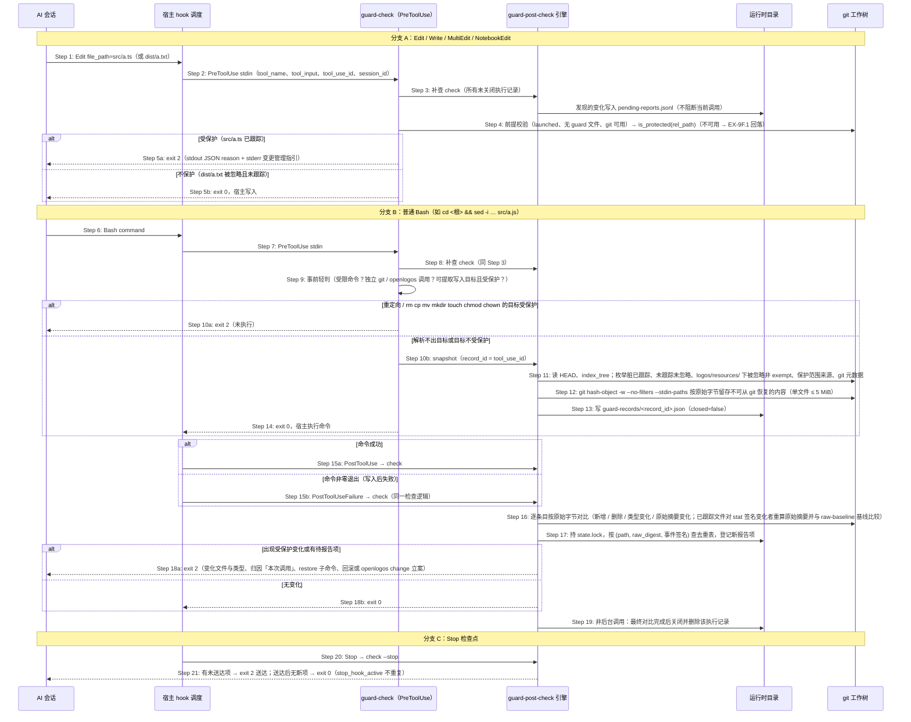
```mermaid
sequenceDiagram
    participant AI as AI 会话
    participant H as 宿主 hook 调度
    participant G as guard-check（PreToolUse）
    participant P as guard-post-check 引擎
    participant RT as 运行时目录
    participant GIT as git 工作树

    Note over AI,GIT: 分支 A：Edit / Write / MultiEdit / NotebookEdit
    AI->>H: Step 1: Edit file_path=src/a.ts（或 dist/a.txt）
    H->>G: Step 2: PreToolUse stdin（tool_name、tool_input、tool_use_id、session_id）
    G->>P: Step 3: 补查 check（所有未关闭执行记录）
    P->>RT: 发现的变化写入 pending-reports.jsonl（不阻断当前调用）
    G->>GIT: Step 4: 前提校验（launched、无 guard 文件、git 可用）→ is_protected(rel_path)（不可用 → EX-9F.1 回落）
    alt 受保护（src/a.ts 已跟踪）
        G-->>AI: Step 5a: exit 2（stdout JSON reason + stderr 变更管理指引）
    else 不保护（dist/a.txt 被忽略且未跟踪）
        G-->>AI: Step 5b: exit 0，宿主写入
    end

    Note over AI,GIT: 分支 B：普通 Bash（如 cd <根> && sed -i … src/a.js）
    AI->>H: Step 6: Bash command
    H->>G: Step 7: PreToolUse stdin
    G->>P: Step 8: 补查 check（同 Step 3）
    G->>G: Step 9: 事前轻判（受限命令？独立 git / openlogos 调用？可提取写入目标且受保护？）
    alt 重定向 / rm cp mv mkdir touch chmod chown 的目标受保护
        G-->>AI: Step 10a: exit 2（未执行）
    else 解析不出目标或目标不受保护
        G->>P: Step 10b: snapshot（record_id = tool_use_id）
        P->>GIT: Step 11: 读 HEAD、index_tree；枚举脏已跟踪、未跟踪未忽略、logos/resources/ 下被忽略非 exempt、保护范围来源、git 元数据
        P->>GIT: Step 12: git hash-object -w --no-filters --stdin-paths 按原始字节留存不可从 git 恢复的内容（单文件 ≤ 5 MiB）
        P->>RT: Step 13: 写 guard-records/<record_id>.json（closed=false）
        G-->>H: Step 14: exit 0，宿主执行命令
    end
    alt 命令成功
        H->>P: Step 15a: PostToolUse → check
    else 命令非零退出（写入后失败）
        H->>P: Step 15b: PostToolUseFailure → check（同一检查逻辑）
    end
    P->>GIT: Step 16: 逐条目按原始字节对比（新增 / 删除 / 类型变化 / 原始摘要变化；已跟踪文件对 stat 签名变化者重算原始摘要并与 raw-baseline 基线比较）
    P->>RT: Step 17: 持 state.lock，按 (path, raw_digest, 事件签名) 查去重表，登记新报告项
    alt 出现受保护变化或有待报告项
        P-->>AI: Step 18a: exit 2（变化文件与类型、归因「本次调用」、restore 子命令、回滚或 openlogos change 立案）
    else 无变化
        P-->>H: Step 18b: exit 0
    end
    P->>RT: Step 19: 非后台调用：最终对比完成后关闭并删除该执行记录

    Note over AI,GIT: 分支 C：Stop 检查点
    H->>P: Step 20: Stop → check --stop
    P-->>AI: Step 21: 有未送达项 → exit 2 送达；送达后无新项 → exit 0（stop_hook_active 不重复）
```

### 时序图一步骤说明

1. **AI** 发起 Edit / Write / MultiEdit / NotebookEdit，目标为 `file_path`（NotebookEdit 为 `notebook_path`）。
2. **宿主**以 PreToolUse 把 stdin JSON 交给 guard-check。
3. **guard-check** 先对所有未关闭执行记录做补查：发现的变化写入待报告项，**不阻断当前调用**；当前调用是否放行仍由事前判定决定。
4. **guard-check** 校验前提（launched、无 guard 文件、项目根在 git 工作树内且 git 可用；不满足走 EX-9F.1 回落），用既有归一化求 `rel_path`（含符号链接防逃逸），按上表 `is_protected` 判定。exempt 读取 `logos.config.json`：字段缺省用内置默认；配置无法解析或类型不符时视为 `[]` 并在 stderr 警告；单个非法条目跳过并警告。
5. **guard-check** 受保护 → exit 2，stdout `{"reason": ...}` 与 stderr 双通道给出变更管理指引；不保护 → exit 0。
6. **AI** 发起 Bash（PowerShell 同理）。
7. **宿主**以 PreToolUse 交给 guard-check。
8. **guard-check** 补查（同 Step 3）。
9. **guard-check** 事前轻判，按顺序：C14 受限命令走时序图三；可确定目标落在 guard 自有状态 → exit 2；可识别的独立 git / openlogos 调用走 Step 25 起的豁免路径；能从命令中确定写入目标的形态（既有重定向目标提取、`rm/cp/mv/mkdir/touch/chmod/chown` 路径实参提取）逐路径判定 `is_protected`。「解析不出即阻断」与「安全白名单先判放行」不再作为判定依据；`BASH_SAFE_PATTERNS` 只用于「命中只读命令且无重定向 / 复合形态时跳过拍快照」，不改变判定结果。
10. **guard-check** 可提取目标中任一受保护 → exit 2，命令不执行；否则（含 `node -e`、`python3 x.py`、`find src -delete`、`sed -i`、`npm ci`）调用引擎 `snapshot`。`record_id` 取 `tool_use_id`；缺失时为 `anon-<时间戳>-<随机>` 并标 `anonymous: true`（EX-9F.4）。
11. **引擎**持项目级锁 `state.lock` 记录 `head`、`index_tree`，并枚举快照覆盖范围（C09）：脏的已跟踪文件、未跟踪且未被忽略的文件、`logos/resources/` 下被忽略且非 exempt 的文件、保护范围来源（每次都纳入 `logos/logos.config.json`），以及 git 元数据（`git rev-parse --absolute-git-dir` 与位于项目根内的 `--git-common-dir` 下的 `config`、`info/` 与 `hooks/` 全部文件；`core.hooksPath` 指向项目根内且未跟踪的目录同样纳入；不采集 `objects/`、`refs/`、`logs/`、`index`、`HEAD`、`ORIG_HEAD`、`FETCH_HEAD`、`MERGE_*`、`packed-refs`、`*.lock`、`modules/` 下的对象库）。每个已跟踪文件（含干净文件）引用项目级原始字节基线缓存 `raw-baseline.json` 中的 `raw_oid` 作为执行前基线：缓存为每个已跟踪文件记录 `{stat 签名 (size, mtime_ns, ino, ctime_ns), raw_oid}`，首次全量建立，之后只对 stat 签名变化的文件重算，mtime 不早于缓存记录时刻的条目一律重算（racy 规避）；没有内容转换的文件其 raw_oid 与索引 blob 相同，不额外占用对象库。拿不到锁（等待超过 5 秒）时，本次调用按「整体状态采集失败」处理，走 EX-9F.1 回落判定。
12. **引擎**对快照条目与缓存重算的文件批量执行 `git hash-object -w --no-filters --stdin-paths`，按原始字节写入对象库得到 `raw_oid`（只写 `objects/`，不会被自身快照报告）；超过 5 MiB 或不可读的条目只记摘要并标 `recoverable: false`。
13. **引擎**在锁内把记录（`closed: false`，`generation` 初值）以「同目录临时文件 `*.tmp-<pid>-<rand>` + `rename`」原子写入 `logos/.openlogos-runtime/guard-records/<record_id>.json`。
14. **guard-check** exit 0，宿主执行命令。
15. **宿主**在命令结束后触发结束事件：成功为 PostToolUse，非零退出为 PostToolUseFailure；两者调用同一 `check`，命令先写后报错同样被发现。
16. **引擎**以原始字节为准逐条目对比：新增、删除、类型变化（普通文件 / 符号链接 / 目录占位）、原始字节摘要（`--no-filters`）变化都计为变化；已跟踪文件对执行后 stat 签名变化者重算原始摘要，与执行前基线比较，不再依赖过滤后的 `git diff` / `git status` 决定是否检查（过滤后的比较只作为「是否脏」的辅助信息）。因此 clean filter 下干净文件 `hello` 被改为 `HELLO`（过滤后 diff 为空）同样被发现。执行前已存在的改动以快照内容为基线，不因本次命令被计入；同一脏文件被再次修改时摘要变化即被发现（`git status` 不变也不漏）。
17. **引擎**在锁内按事件级去重键 `(path, raw_digest, 事件签名)` 查 `reported.jsonl`：事件签名取变化被观测时文件的 `(ino, ctime_ns)`，文件已删除时取 `"absent"` 加观测序号。同一事件只报一次，反复检查同一未变化状态不重复报告；检查点观测到该路径回到基线（已恢复）、该路径基线被合法更新（C10 / C13 rebase、提案边界）、或该路径出现新的事件签名（再次被写入，即使内容相同）时，清除该路径的去重条目，同一内容再次出现时重新报告。
18. **引擎**有受保护变化或待报告项 → exit 2，stderr 与 stdout JSON 给出：变化文件与类型；归因（本次调用 / 未结束的后台调用及其命令 / 无法归因）；可恢复条目的恢复命令，统一为 `node "$CLAUDE_PROJECT_DIR/.claude/openlogos/bin/guard-post-check.cjs" restore <record_id> -- <path>`（Cursor 下引擎路径为 `.cursor/hooks/openlogos-guard-post.cjs`），已跟踪干净文件同样用 raw_oid 恢复，不给出 shell 重定向或 `git checkout`；下一步（回滚或 `openlogos change <slug>` 立案）。guard 不自动执行恢复。拿不到锁时待报告项以 `O_EXCL` 写入 `pending-spill/<pid>-<时间戳>.json`，下次持锁时合并进 `pending-reports.jsonl` 后删除。
19. **引擎**对非后台调用在最终对比完成后关闭执行记录：删除记录文件并写入墓碑 `guard-records/<record_id>.closed`（保留到下一次会话开始后清理），之后对该 id 的迟到写入看到墓碑即丢弃。
20. **宿主**在 AI 结束本轮时触发 Stop，引擎执行 `check --stop`。
21. **引擎**有未送达项 → exit 2 送达；送达后若无新的未送达项则 exit 0，`stop_hook_active` 不导致重复送达。

### 时序图二：后台调用、独立 git 调用、跨会话与提案边界

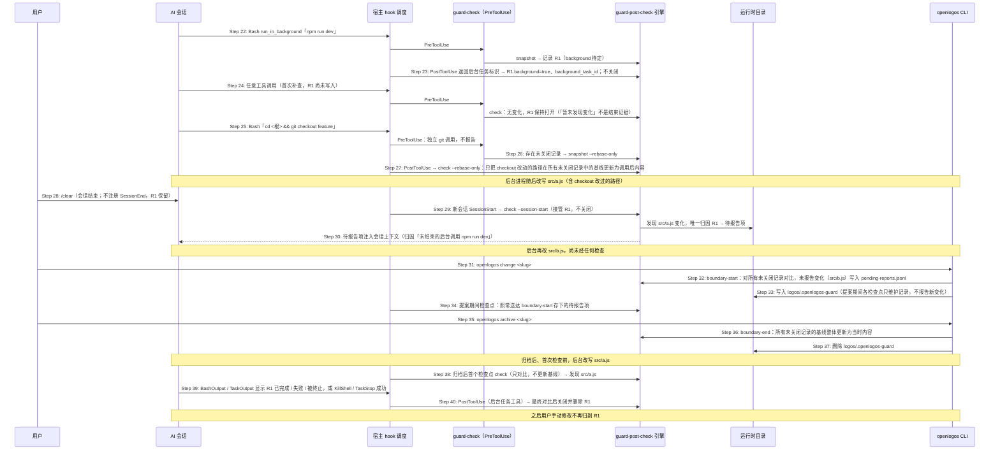
```mermaid
sequenceDiagram
    participant U as 用户
    participant AI as AI 会话
    participant H as 宿主 hook 调度
    participant G as guard-check（PreToolUse）
    participant P as guard-post-check 引擎
    participant RT as 运行时目录
    participant CLI as openlogos CLI

    AI->>H: Step 22: Bash run_in_background「npm run dev」
    H->>G: PreToolUse
    G->>P: snapshot → 记录 R1（background 待定）
    H->>P: Step 23: PostToolUse 返回后台任务标识 → R1.background=true、background_task_id；不关闭
    AI->>H: Step 24: 任意工具调用（首次补查，R1 尚未写入）
    H->>G: PreToolUse
    G->>P: check：无变化，R1 保持打开（「暂未发现变化」不是结束证据）
    AI->>H: Step 25: Bash「cd <根> && git checkout feature」
    H->>G: PreToolUse：独立 git 调用，不报告
    G->>P: Step 26: 存在未关闭记录 → snapshot --rebase-only
    H->>P: Step 27: PostToolUse → check --rebase-only：只把 checkout 改动的路径在所有未关闭记录中的基线更新为调用后内容
    Note over AI,CLI: 后台进程随后改写 src/a.js（含 checkout 改过的路径）
    U->>AI: Step 28: /clear（会话结束；不注册 SessionEnd，R1 保留）
    H->>P: Step 29: 新会话 SessionStart → check --session-start（接管 R1，不关闭）
    P->>RT: 发现 src/a.js 变化，唯一归因 R1 → 待报告项
    P-->>AI: Step 30: 待报告项注入会话上下文（归因「未结束的后台调用 npm run dev」）
    Note over AI,CLI: 后台再改 src/b.js，尚未经任何检查
    U->>CLI: Step 31: openlogos change <slug>
    CLI->>P: Step 32: boundary-start：对所有未关闭记录对比，未报告变化（src/b.js）写入 pending-reports.jsonl
    CLI->>RT: Step 33: 写入 logos/.openlogos-guard（提案期间各检查点只维护记录，不报告新变化）
    H->>P: Step 34: 提案期间检查点：照常送达 boundary-start 存下的待报告项
    U->>CLI: Step 35: openlogos archive <slug>
    CLI->>P: Step 36: boundary-end：所有未关闭记录的基线整体更新为当时内容
    CLI->>RT: Step 37: 删除 logos/.openlogos-guard
    Note over AI,CLI: 归档后、首次检查前，后台改写 src/a.js
    H->>P: Step 38: 归档后首个检查点 check（只对比，不更新基线）→ 发现 src/a.js
    AI->>H: Step 39: BashOutput / TaskOutput 显示 R1 已完成 / 失败 / 被终止，或 KillShell / TaskStop 成功
    H->>P: Step 40: PostToolUse（后台任务工具）→ 最终对比后关闭并删除 R1
    Note over AI,CLI: 之后用户手动修改不再归到 R1
```

### 时序图二步骤说明

22. **AI** 以后台方式启动 `npm run dev`；guard-check 照常拍快照得到执行记录 R1。
23. **宿主**的 PostToolUse 返回后台任务标识；引擎把 R1 标为 `background: true` 并记录 `background_task_id`，此时**不关闭** R1。后台任务工具名与 tool_response 中的标识、结束状态字段以 Claude Code 真实 hook 输入为准。
24. **任意后续工具调用**的 PreToolUse 都触发补查；R1 暂未写入时补查无变化，R1 仍保持打开——补查时暂未发现变化、Stop、会话结束都不算执行结束证据。只要存在未关闭记录，判断某处改动是否「执行前已有」以**最早一个未关闭记录**为基线，之后出现的受保护变化不会被新快照吸收为既有改动。
25. **AI** 执行可识别的独立 git 调用：在引号外按 `&&` `||` `;` 切段，每段首词只能是 `git`、`openlogos` 或 `cd`，且 `cd` 之外至少一段为 git / openlogos；任一处出现引号外的 `|`、`>`、`<`、`$(`、反引号、`(`、`)`、单独 `&`、`<<` 即不是独立调用。独立 git 调用（含 `checkout`、`merge`、`rebase`、`stash pop`、`reset --hard`、`pull`）一律放行，不报告变化（C05、C10）。
26. **guard-check** 无未关闭记录时不拍快照；存在未关闭记录时调用 `snapshot --rebase-only`，在 git 调用前取一次状态。
27. **引擎**在调用后 `check --rebase-only`：求出本次 git 调用改动的路径，只把这些路径在**所有**未关闭记录中的基线更新为调用后内容，其余路径基线不动。后台随后再改这些路径时，内容与新基线不同，照样被发现。
28. **用户** `/clear` 或切换会话；会话结束不清理执行记录，R1 留在运行时目录。
29. **新会话**的 SessionStart 由 phase launcher 调用 `check --session-start`，接管已有记录并继续对比，**不关闭**任何记录。
30. **引擎**发现 `src/a.js` 变化：能唯一归因到 R1 时标明「未结束的后台调用」及其命令；待报告项并入 SessionStart 注入上下文，并在下一次 Bash 结束事件或 Stop 时以 exit 2 送达。
31. **用户**执行 `openlogos change <slug>`（S09-A）。
32. **CLI** 在写入 guard 文件**之前**调用引擎 `boundary-start`：对所有未关闭记录做一次对比，把尚未报告的变化存为待报告项，提案期间也不丢弃——提案开始前的后台写入不会混进提案期。引擎不存在（非 Claude / Cursor 项目或未部署）时跳过，不阻断 change。
33. **CLI** 写入 `logos/.openlogos-guard`。提案期间各检查点只维护记录（关闭、去重），不报告新变化。
34. **提案期间的检查点**照常送达 Step 32 存下的待报告项。
35. **用户**执行 `openlogos archive <slug>`（S09-C）。
36. **CLI** 在删除 guard 文件**之前**调用 `boundary-end`：所有未关闭记录的基线整体更新为当时内容，提案期间的写入不报告，归档后也不被误报。引擎不存在时跳过，不阻断 archive。
37. **CLI** 删除 guard 文件。
38. **归档后首个检查点**只对比、不更新基线；归档后、首次检查前发生的后台写入照样被发现。
39. **AI** 查询或终止后台任务；宿主工具结果确认任务已结束（完成、失败、被终止，或终止工具成功）。
40. **引擎**在该工具的 PostToolUse 中做最终对比，送达新变化后关闭并删除 R1；之后的手动修改不再被归到 R1。结束事件迟到（晚于补查）时照常最终对比后关闭，同一变化事件已报过的不再重复。

### 时序图三：保护范围变更的宿主原生审批（C14）

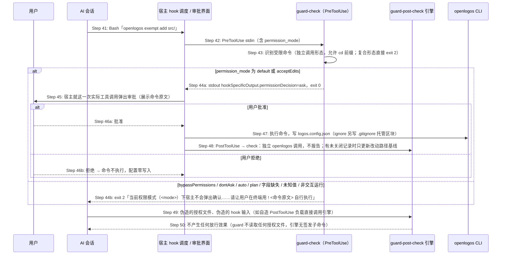
```mermaid
sequenceDiagram
    participant U as 用户
    participant AI as AI 会话
    participant H as 宿主 hook 调度 / 审批界面
    participant G as guard-check（PreToolUse）
    participant P as guard-post-check 引擎
    participant CLI as openlogos CLI

    AI->>H: Step 41: Bash「openlogos exempt add src/」
    H->>G: Step 42: PreToolUse stdin（含 permission_mode）
    G->>G: Step 43: 识别受限命令（独立调用形态，允许 cd 前缀；复合形态直接 exit 2）
    alt permission_mode 为 default 或 acceptEdits
        G-->>H: Step 44a: stdout hookSpecificOutput.permissionDecision=ask，exit 0
        H->>U: Step 45: 宿主就这一次实际工具调用弹出审批（展示命令原文）
        alt 用户批准
            U-->>H: Step 46a: 批准
            H->>CLI: Step 47: 执行命令，写 logos.config.json（ignore 另写 .gitignore 托管区块）
            H->>P: Step 48: PostToolUse → check：独立 openlogos 调用，不报告；有未关闭记录时只更新改动路径基线
        else 用户拒绝
            U-->>H: Step 46b: 拒绝 → 命令不执行，配置零写入
        end
    else bypassPermissions / dontAsk / auto / plan / 字段缺失 / 未知值 / 非交互运行
        G-->>AI: Step 44b: exit 2「当前权限模式（<mode>）下宿主不会弹出确认……请让用户在终端用 ! <命令原文> 自行执行」
    end
    AI->>P: Step 49: 伪造的授权文件、伪造的 hook 输入（如自造 PostToolUse 负载直接调用引擎）
    P-->>AI: Step 50: 不产生任何放行效果（guard 不读取任何授权文件，引擎无签发子命令）
```

### 时序图三步骤说明

41. **AI** 发起受限命令：`openlogos exempt add|remove`、`openlogos ignore add|remove`（`list` 不受限）。受限范围不随提案状态变化——有活跃提案时同样适用。
42. **宿主**以 PreToolUse 交给 guard-check，hook 输入含 `permission_mode`。
43. **guard-check** 识别受限命令：必须是独立调用形态（切段规则同 C10，只允许 `cd` 前缀）；复合形态（如 `openlogos exempt add src/ && node x.js`）一律 exit 2。
44. **guard-check** 按 `permission_mode` 处理：
    - `default` 或 `acceptEdits` → stdout 输出 `{"hookSpecificOutput":{"hookEventName":"PreToolUse","permissionDecision":"ask","permissionDecisionReason":"该命令会改变 guard 的保护范围（<命令原文>），需要您确认后执行"}}`，exit 0。
    - 其他值（`bypassPermissions`、`dontAsk`、`auto`、`plan`）、字段缺失、未知值或非交互运行 → exit 2，reason：「当前权限模式（<mode>）下宿主不会弹出确认，无法证明由用户批准。请让用户在终端用 `! <命令原文>` 自行执行，或切换到默认权限模式后重试；不要用对话中的口头同意替代。」依据是宿主官方 hooks 文档：`ask` 在 `bypassPermissions` / `dontAsk` 下静默放行，在非交互模式下按 `defer` 处理；实施时以真实宿主再核实。
45. **宿主**就这一次实际工具调用弹出审批，展示命令原文。
46. **用户**批准则执行；拒绝则命令不执行，`logos.config.json` 与 `.gitignore` 零写入。
47. **CLI** 按 S40 写入配置（`ignore` 另写托管区块）。
48. **引擎**在结束事件中识别独立 openlogos 调用（C13），不报告变化；存在未关闭记录时，只把它改动的路径在所有未关闭记录中的基线更新为调用后内容。`openlogos sync` 重渲染托管区块与 `.gitattributes` 走同一路径，不受限、不需要审批；`openlogos sync && node modify-source.js` 等复合调用不享受豁免。
49. **伪造尝试**：AI 在运行时目录写入任何「授权」文件，或自造 hook 负载直接调用引擎。
50. **结果**：不产生放行效果。审批只来自宿主对本次调用的原生审批；guard 不读取授权文件，引擎没有签发子命令。`--auto` / 无人值守通常运行在 `bypassPermissions` / `auto` / 非交互模式下，受限命令因此被阻断，不另设机制；宿主 driver 不得替用户批准。

### Cursor afterShellExecution 路径

51. **Cursor** 的 `beforeShellExecution` 由 `node .cursor/hooks/openlogos-runtime.cjs` 处理：受限命令返回 `{"permission":"ask",...}`；宿主在自动运行模式下是否仍弹出审批以真实宿主实测为准，实测不能保证弹出时改为 deny，并写入 `spec/cursor-plugin.md`。其余命令按 Step 9 同口径事前轻判，并调用引擎 `snapshot`。
52. **Cursor** 的 `afterShellExecution` 由 `node .cursor/hooks/openlogos-runtime.cjs shell-after` 处理，调用引擎 `check` 对比。快照用宿主输入中的调用标识关联（以实测为准，候选为 `generation_id` + 命令文本哈希）；拿不到可靠标识时建立匿名记录，不按「最近一次」猜测关联。
53. **反馈渠道**（能否注入 agent、能否以退出码阻断后续）以真实宿主实测为准；测不出来时降级为事后报告，并在 `spec/cursor-plugin.md` 中声明。
54. **文件编辑**（Cursor IDE 与 CLI）均为 `afterFileEdit` 事后报告，不承诺事前阻断；托管文案与 `cli/src/lib/cursor-adapter.ts` 不再宣称「Cursor IDE 经同一 hooks.json 获得完整 preToolUse 硬拦」。
55. **保护对象一致**：Cursor runtime 与 Claude 侧 guard 对同一组测试向量（路径 + git 状态）给出相同的「是否受保护」结论。`CURSOR_HOOK_EVENTS` 新增 `afterShellExecution`，它决定实际部署的事件；模板 `plugin-cursor/hooks/hooks.json` 同步新增该事件。引擎在包内唯一源为 `plugin/bin/guard-post-check.cjs`，部署时以同一份字节复制为 `.cursor/hooks/openlogos-guard-post.cjs`。

### 恢复与共享状态

56. **AI 或用户**执行反馈中的 `node "$CLAUDE_PROJECT_DIR/.claude/openlogos/bin/guard-post-check.cjs" restore <record_id> -- <path>`。
57. **引擎**持锁做前置校验：当前状态（是否存在、文件类型、原始摘要）必须与该报告记录的「执行后状态」完全一致；不一致则拒绝恢复、只报告，退出码 1。
58. **引擎**按执行前状态恢复：执行前是普通文件 → 在同一目录写临时文件 `.<name>.openlogos-restore-<pid>`，写入 raw 内容、设置原权限位并 fsync，再 `rename` 替换目录项（当前是符号链接时替换的是链接本身，不沿链接写入）；执行前是符号链接 → 临时链接加 `rename` 重建；执行前不存在 → 当前是普通文件或符号链接则删除目录项，当前是目录则拒绝自动恢复；执行前是普通文件、当前是目录 → 拒绝自动恢复。
59. **引擎**恢复后状态等于基线，按 Step 17 清除该路径去重条目；恢复本身不产生新报告。`restore` 只能以独立调用形态执行：允许 `cd` 前缀，`node "<引擎路径>" restore <record_id> -- <path>` 必须是唯一一段，且引擎路径等于已部署的托管路径；满足时按 C13 同等对待——该调用的 PreToolUse / PostToolUse 不报告变化，只把被恢复路径在未关闭记录中的基线改回被恢复记录中的执行前状态并清除其去重条目，其他路径不受影响。与其他命令组成复合调用（如 `restore … && echo x > other`）时不享受此豁免，按普通 Bash 处理。
60. **并发**：所有状态变更（执行记录、待报告项、去重表、原始字节基线缓存、基线更新）都在 `state.lock`（`O_CREAT|O_EXCL`，内容 `{pid, host, acquired_at}`）内进行；等锁最多 5 秒；持锁超过 30 秒且持有进程已不存在视为过期锁，可以打破。
61. **代际**：每个执行记录带 `generation`，更新时在锁内比对，代际落后的写入丢弃；已关闭记录有墓碑，迟到写入不会复活记录。
62. **中断**：状态文件一律「临时文件 + `rename`」原子落盘，读取时忽略 `*.tmp-*`，过期临时文件在下次持锁时清理；多文件更新（如对多个记录 rebase）中途中断，只留下部分记录仍为旧基线，结果是多报而不是漏报。

### 异常与边界

| 编号 | 触发条件 | 期望响应 | 副作用 / 说明 |
|---|---|---|---|
| EX-9F.1 | 项目根不在 git 工作树内，或 git 不可用（非 git 回落） | 沿用修改前的判定要素（安全白名单、写入模式、路径提取与逐路径管辖判定、解析不出即阻断）与 Edit / Write 白名单判定，但 Bash 改为**逐段判定**（verify-smoke-guard-fixes-0-15-20，决策 C04）：先剥离单 / 双引号字面量，再按顶层 `&&` `||` `;` `|` `&` 与换行拆段；只有每一段都命中安全白名单才凭白名单放行；任一段命中写入模式即对该段做路径提取与逐路径管辖判定，任一段不放行则整条阻断；命令含 `$( )`、反引号、`<( )`、heredoc 且任意位置出现写入模式时按解析不出阻断。写入段的相对目标按**有效工作目录**解析（初值为 guard cwd；字面量参数的 `cd` / `pushd` 推进有效目录，但只在从该段起以 `&&` 连续相连的条件链内有效；非字面量目录切换，或该条件链被 `;`、换行、`||`、`|`、`&` 结束后，有效目录不确定，此后写入段一律阻断）。单条命令的判定结果逐字不变。另有四处保守修改：① `.gitignore` 不在白名单内；② 不可豁免项（guard 自有状态、保护范围来源、git 元数据）受保护；③ exempt 读配置（字段缺省用内置默认，配置损坏视为 `[]`）；④ C14 受限命令按 Step 43～44 处理 | 不拍快照、不做事后检查；逐段规则见根规范 `spec/pretooluse-guard.md`「Bash 非 git 回落的复合命令逐段判定（规范性）」 |
| EX-9F.2 | 复合 git / openlogos 调用：`git status && node modify-source.js`、`openlogos sync && node modify-source.js`、`git diff > "$T"` | 不享受豁免，按普通 Bash 拍快照并事后对比；发现变化时 exit 2，反馈提示把 git / openlogos 操作拆成单独调用后重试 | git 段造成的变化与其他段无法分开，一并报告 |
| EX-9F.3 | 重定向目标可提取的复合 git 调用：`git diff > src/a.ts` | 事前轻判提取到受保护目标 → PreToolUse exit 2，命令不执行 | 不享受豁免；目标经变量给出时走 EX-9F.2 |
| EX-9F.4 | 输入缺少调用标识（`tool_use_id` 或 Cursor 可靠标识） | 建立 `anon-<时间戳>-<随机>` 匿名记录；没有标识的结束事件只触发对比，不关闭任何记录 | 匿名记录无法被任何结束事件关闭，长期保留；期间变化以「需向用户确认」各报一次 |
| EX-9F.5 | 中断：PreToolUse 后没有结束事件 | 下一次 PreToolUse 补查或 Stop 时发现变化；PreToolUse 补查写入待报告项，不阻断当前调用 | 记录保持打开 |
| EX-9F.6 | 结束事件迟到（晚于补查到达） | 照常做最终对比后关闭；同一变化事件已报过的不重复 | 同一路径出现新的事件签名（再次被写入）时再次报告；墓碑使关闭后的迟到写入被丢弃 |
| EX-9F.7 | guard 文件不经 CLI 被删除或创建（如手动删除） | 不补做基线更新，按原基线对比；提案期间的改动以「需向用户确认」各报告一次 | 宁可多报，不静默吸收 |
| EX-9F.8 | 无法唯一归因的变化（未关闭记录期间的用户手动修改、多个未结束后台调用） | 反馈标明「可能来自未结束的后台调用或用户手动修改，需向用户确认，请勿自行回滚」，并列出这些调用 | AI 不得自行回滚；只报一次 |
| EX-9F.9 | 恢复前当前状态（是否存在、文件类型、原始摘要）与该报告记录的「执行后状态」不完全一致 | `restore` 拒绝恢复，只报告，退出码 1 | 避免冲掉之后的用户修改 |
| EX-9F.10 | 条目超过 5 MiB 或不可读 | 只记摘要，`recoverable: false`；反馈标明不可自动恢复 | 变化仍被发现 |
| EX-9F.11 | 被忽略的规格：`logos/resources/` 被 `.gitignore` 忽略（openlogos 本仓 `/logos/*` 形态） | 写入其中非 exempt 文件：Edit / Write 事前 exit 2；Bash 写入事后发现（含删除、换成符号链接） | exempt 内路径（默认 reference、基线 staging）放行 |
| EX-9F.12 | 被忽略目录下已被跟踪的文件（如 `dist/` 下强制入库的安装包） | 按已跟踪判定，写入阻断 / 事后发现 | `ignore add` 不改变其受保护状态，移出须用户自行执行 CLI 提示的命令 |
| EX-9F.13 | 修改保护范围来源：Edit 任意层级 `.gitignore`（含白名单 `.claude/` 或 exempt 目录内的）、Bash 经管道 `tee -a .git/info/exclude`、改写项目根内 `core.excludesFile` 指向的文件、Edit / Write 或 `node -e` 直接改写 `logos/logos.config.json` | Edit / Write 事前 exit 2；Bash 可确定目标时事前 exit 2，否则事后发现 | 白名单与 exempt 不能豁免；`.gitignore` 托管区块只由经审批的 `openlogos ignore` 与 sync 写入；sync 只按配置当前内容渲染、不改配置 |
| EX-9F.14 | 修改 git 元数据：`node -e` 追加 `.git/config`、写 `.git/hooks/pre-commit`、追加 `.git/info/exclude`；`core.hooksPath` 指向项目根内未跟踪目录下的钩子 | 事后发现并报告 | 独立 git 调用（如 `git config user.name x`）造成的元数据变化只更新基线（C10）；`objects/`、`refs/`、`logs/`、`index`、`HEAD`、`*.lock` 等不采集 |
| EX-9F.15 | 写 guard 自有状态 `logos/.openlogos-runtime/`（Edit / Write，或 `rm` / 重定向等可确定目标的 Bash） | 恒 exit 2 | 运行时文件只由引擎与 CLI 写入 |
| EX-9F.16 | `logos.config.json` 无法解析，或 `guard` / `guard.exempt` 类型不符 | exempt 视为 `[]`，不豁免任何路径，stderr 警告；单个非法条目跳过并警告 | 字段缺省（不存在）才用内置默认；显式 `[]` 后配置损坏，reference 仍受保护 |
| EX-9F.17 | 宿主始终不报告结束的后台任务（脱离会话的守护进程等） | 记录长期保留，期间受保护变化以「需向用户确认」形式各报告一次 | 已知覆盖限制，不静默放过 |
| EX-9F.18 | git 自身触发的钩子改写文件；独立 git 调用执行期间后台对同一路径并发写入 | 钩子写入归属该 git 调用；并发写入随基线更新一起被吸收 | 已知残余风险，写入根规范 |
| EX-9F.19 | change / archive 时事后检查引擎不存在 | 跳过 `boundary-start` / `boundary-end`，不阻断 change / archive | 非 Claude / Cursor 项目或未部署 |
| EX-9F.20 | `--auto` 无人值守下执行受限命令 | 通常处于 `bypassPermissions` / `auto` / 非交互模式 → exit 2 | 宿主 driver 不得替用户批准 |
| EX-9F.21 | Cursor 自动运行模式下不能保证弹出审批 | 受限命令改为 deny | 以实测为准，写入 `spec/cursor-plugin.md` |
| EX-9F.22 | qoder / workbuddy / zcode 宿主 | 沿用各自按 proposal_step 收窄的保守模型，本案不改；不能保证人机审批的，受限命令视为阻断对象，未实现处在根规范「已知限制」中写明 | 行为不变 |
| EX-9F.24 | 恢复时执行前是普通文件、当前是符号链接 | 用临时文件 + `rename` 替换链接目录项，链接目标不被改写 | 不沿链接写入 |
| EX-9F.25 | 恢复时执行前不存在或为普通文件、当前是目录 | 拒绝自动恢复，只报告 | 由用户决定处理方式 |
| EX-9F.26 | 多个 PostToolUse / Stop 并发写共享状态 | 锁内串行，全部送达，无丢失、无重复 | 等锁最多 5 秒 |
| EX-9F.27 | 结束事件拿不到锁（超时） | 待报告项以 `O_EXCL` 写入 `pending-spill/`，下次持锁时合并送达 | 报告不丢失 |
| EX-9F.28 | PreToolUse 拍快照拿不到锁 | 本次调用按非 git 回落判定（EX-9F.1） | 更保守 |
| EX-9F.29 | 持锁进程被 kill，或写入中途被 kill | 持锁超过 30 秒且进程不存在 → 打破过期锁；残留 `*.tmp-*` 被忽略并在下次持锁时清理，状态仍可读 | 多文件更新中断只会多报 |
| EX-9F.30 | 记录关闭后到达的旧写入（代际落后或命中墓碑） | 丢弃，记录不复活 | 墓碑保留到下一次会话开始后清理 |
| EX-9F.31 | `restore` 与其他命令组成复合调用，或引擎路径不是已部署的托管路径 | 不享受 C13 豁免，按普通 Bash 拍快照并事后对比 | 独立调用形态的 `restore` 不报告、只回置被恢复路径基线 |
| EX-9F.23 | 有意对抗的 agent（例如修改白名单内 `.claude/` 的 hook 注册） | 不在防护范围 | 威胁模型：guard 防的是 AI 无意或惯性越界；C14 保证在宿主会弹出审批的模式下，保护范围变更须经用户在宿主界面批准 |
| EX-9F.32 | 非 git 回落下以安全命令开头的复合写入：`ls && rm -rf src`、`true; rm src/x`、`cd <项目根> && sed -i … src/x` | 逐段判定：写入段目标在项目根内且受保护 → exit 2 | 修改前整条命令先匹配安全白名单前缀而放行；本修复后被阻断 |
| EX-9F.33 | 非 git 回落下命令替换 / 反引号 / 进程替换 / heredoc 中出现写入：`echo $(rm src/x)`、`` echo `rm src/x` ``、`cat <<EOF > src/x` | 按解析不出处理，exit 2 | 不解析子 shell 内部命令（fail-closed） |
| EX-9F.34 | 非 git 回落下只读复合命令与引号内分隔符：`ls && cat x`、`git status \| head`、`echo "a && rm b"` | 每段命中安全白名单或未命中写入模式 → 放行；引号字面量先剥离，不按其中的分隔符拆段 | 只读命令不受收紧影响 |
| EX-9F.35 | 非 git 回落下 `cd` 后的相对写入：`cd src && rm ../src/a.ts` | `cd src` 参数为字面量且 `rm` 位于其后的连续 `&&` 条件链内 → 有效目录推进为 `<项目根>/src`；`../src/a.ts` 按其解析为 `<项目根>/src/a.ts`，受保护 → exit 2 | 若按 guard 原 cwd 解析会得到项目外路径而误放行（proposal r1 F1） |
| EX-9F.36 | 非 git 回落下目录切换不可确定后的写入：`cd src; rm ../src/a.ts`、`cd "$D" && rm a.ts`、`cd - && rm a.ts`、`cd a \|\| cd b && rm x`、`popd && rm x` | 有效目录不确定，其后任一写入段按解析不出处理 → exit 2 | 绝不以 guard 原 cwd 的解析结果作为项目外放行依据 |
| EX-9F.37 | 非 git 回落下 `cd` 后的只读段与绝对目标写入：`cd src && cat a.ts`；`cd src && rm /项目外/x` | 只读段放行；绝对目标按其本身判定（项目外交宿主权限系统，放行） | 有效目录只影响相对目标的解析 |
| EX-9F.38 | 非 git 回落下字面量 `cd` 的条件链被结束后的写入：`cd /dev/null && true; rm src/a.ts`、同一命令以换行代替 `;`、`cd src && true \|\| rm ../src/a.ts` | 条件链结束后有效目录不确定，`rm` 段按解析不出处理 → exit 2 | `cd` 失败时链内段被跳过、链外段仍在原目录执行；按假定新目录解析会把 `<项目根>/src/a.ts` 误算为项目外而放行（delta r1 F2） |

### 不变量

- 有活跃提案时：proposal_step 收窄、plan 阶段原型 allowlist、既有放行语义不变；各检查点只维护执行记录（关闭、去重），不报告新变化，boundary-start 存下的待报告项照常送达。不可豁免项与 C14 在有提案时同样生效。
- 执行记录只凭宿主给出的执行结束证据关闭：非后台调用同一标识的 PostToolUse / PostToolUseFailure；后台调用的任务结束确认；Stop 时关闭全部非后台记录（Stop 表明本回合前台调用已全部结束，含被拒绝或被其他 hook 拦下的调用）。SessionEnd、补查无变化都不关闭记录，Stop 不关闭后台记录。
- 基线只在两种情况下更新：独立 git / openlogos 调用（只更新其改动的路径）、`openlogos archive` 删除 guard 文件之前（boundary-end）。归档后的检查只对比、不更新基线。
- 每个变化事件按 `(path, raw_digest, 事件签名)` 只报一次；恢复、合法基线更新或再次写入会清除该路径的去重条目。guard 不自动执行恢复。
- 所有状态变更在 `state.lock` 内进行并原子落盘；多文件更新中途中断只会让部分记录仍是旧基线，方向是多报而不是漏报。
- guard 不新增「本次跳过 guard」等白名单以外的放行开关，不读取任何授权文件；不做完整 Shell 解析器。

### 与既有章节的关系

| 既有章节 | 被取代的表述 | 取代后的口径 | 适用模式 |
|---|---|---|---|
| 「S09 无活跃提案时资料目录与基线 staging 的 guard 放行时序」Step 2、Step 7 | R-REF / R-STAGING 为 guard 内新增的硬编码规则 | 两条规则迁入 `guard.exempt` 内置默认值，路径语义不变；用户可经 `openlogos exempt`（宿主审批）增删；配置损坏时不豁免 | 两种模式均取代 |
| 同章节 Step 5 | `openlogos baseline-seed begin` 因 `^openlogos ` 安全白名单放行 | 作为可识别的独立 openlogos 调用放行（C13），不再依赖安全白名单 | git 判据下取代；回落时沿用安全白名单 |
| 同章节 EX-9.35 | 未命中安全白名单、解析不出目标的形态（`tee`、`sed -i`、变量、复合命令）维持无条件阻断；安全白名单先判放行 | 解析不出目标的命令事前放行，由事后检查兜底；安全白名单只用于跳过拍快照，不决定放行 | git 判据下取代；回落时原表述继续生效 |
| 同章节「不变量」 | 既有前缀表、Bash 安全 / 写入模式不变 | `.gitignore` 移出白名单、不可豁免项先于白名单判定；git 判据下安全 / 写入模式不再决定最终结论 | 前半两种模式均取代；后半仅 git 判据 |

### 追溯

- 需求：`core-01-requirements.md`「guard 以版本控制内容为保护对象需求」AC-GUARD-VCS-01～19；「版本管理范围配置（ignore / exempt 与 init 建议忽略）需求」AC-GUARD-SCOPE-08、AC-GUARD-SCOPE-09。
- 功能规格：`core-01-feature-specs.md`「guard 以版本控制内容为保护对象」。
- 根规范：`spec/pretooluse-guard.md`（受保护内容判据、Bash 事前轻判与事后检查合同、执行记录生命周期、保护范围变更的宿主原生审批、已知覆盖限制与威胁模型）；`spec/cursor-plugin.md`（`afterShellExecution` 接线与分层能力声明）。
- 决策：C01、C05、C06、C07、C09、C10、C11、C12、C13、C14；defaults（非 git 回落、`guard.exempt` 内置默认、执行记录运行时目录、已知覆盖限制）。
- 相关场景：S09-A（change 写入 guard 前 boundary-start）、S09-C（archive 删除 guard 前 boundary-end）、S40（ignore / exempt 子命令与托管区块）、S08（hook 注册与引擎分发）。
- 测试：`core-S09-test-cases.md`「S09 guard 按版本控制内容判定测试」UT-S09-385～UT-S09-420、ST-S09-152～ST-S09-192；「S09 guard 资料目录与基线 staging 默认豁免测试」UT-S09-372（MODIFIED）。

## S09-G GUI 原型任务勾选与 plan-exit 批准门派生时序

> 来源变更：fix-prototype-plan-approval-state（决策 C03、C04；proposal r1 评审 F1）。承接「S09-A: openlogos change」的 plan 阶段与功能规格 §2.26「GUI 项目提案阶段前置 UI/UX 原型确认」。事故：token-agent 提案 `price-version-duplicate-fix`、run `drv-muzl3glb-jo25`，原型任务勾选 1/7 后被派生为 `delta-writing`，write-delta 三次被 guard 以缺少 `PLAN_APPROVED` 拦截后 `retry-exhausted`。

### 场景目标

GUI 模块（`product_type ∈ {web, desktop, mobile}`）中 `ui_impact:true` 的提案，在 plan-exit 门前产出并勾选原型任务之后：

- 阶段仍停在 plan 出口门 `ready-to-delta`，**不会**因为原型任务被勾选而进入 `delta-writing` 或 spec 出口 `ready-to-merge`；
- `status` / `next` / guard 三方对「是否已批准」的判断一致：只有 `PLAN_APPROVED` 落盘之后，才派发非原型 delta 写入；
- 半自动下默认 `next` 等待人工批准；全自动下 `next --auto` 经既有通道写入批准后再离开 plan，不再出现「派 write-delta → guard 拦截 → 重试耗尽」的死锁。

### 参与者与前置条件

| 别名 | 组件 | 说明 |
|---|---|---|
| D | AI driver / 宿主 | 读取 `next` 前沿并派发节点；全自动时以 `next --auto` 消费可跳门 |
| W | change-writer（producer） | plan 阶段产出原型并勾选对应 `[delta]` 任务；spec 阶段产出非原型 delta |
| CLI | `openlogos status` / `next` | 经 `flow-derive` 主检测器派生 `proposal_step`，经 `derivePlanState` 投影 `plan_state` |
| G | guard-check（PreToolUse） | `PLAN_APPROVED` 不存在时只放行 `deltas/prd/2-product-design/2-page-design/*.html` |
| FS | 提案目录 | `tasks.md`、`deltas/`、`PLAN_APPROVED`、`GATE_AUTO_PASSED` |

前置条件：模块 launched；活跃提案的 proposal / tasks 已脱模板（plan 就绪）；UI/UX 变更声明 `ui_impact:true`；`tasks.md` 含 `## [delta]`，其中至少一条为原型任务；`deltas/` 下仅有 `2-page-design/*.html` 原型；`PLAN_APPROVED` 不存在。

### 时序图

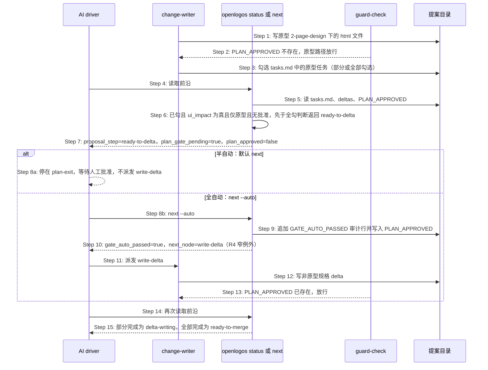
```mermaid
sequenceDiagram
    participant D as AI driver
    participant W as change-writer
    participant CLI as openlogos status 或 next
    participant G as guard-check
    participant FS as 提案目录

    W->>FS: Step 1: 写原型 2-page-design 下的 html 文件
    G-->>W: Step 2: PLAN_APPROVED 不存在，原型路径放行
    W->>FS: Step 3: 勾选 tasks.md 中的原型任务（部分或全部勾选）
    D->>CLI: Step 4: 读取前沿
    CLI->>FS: Step 5: 读 tasks.md、deltas、PLAN_APPROVED
    CLI->>CLI: Step 6: 已勾且 ui_impact 为真且仅原型且无批准，先于全勾判断返回 ready-to-delta
    CLI-->>D: Step 7: proposal_step=ready-to-delta，plan_gate_pending=true，plan_approved=false
    alt 半自动：默认 next
        D-->>D: Step 8a: 停在 plan-exit，等待人工批准，不派发 write-delta
    else 全自动：next --auto
        D->>CLI: Step 8b: next --auto
        CLI->>FS: Step 9: 追加 GATE_AUTO_PASSED 审计行并写入 PLAN_APPROVED
        CLI-->>D: Step 10: gate_auto_passed=true，next_node=write-delta（R4 窄例外）
        D->>W: Step 11: 派发 write-delta
        W->>FS: Step 12: 写非原型规格 delta
        G-->>W: Step 13: PLAN_APPROVED 已存在，放行
    end
    D->>CLI: Step 14: 再次读取前沿
    CLI-->>D: Step 15: 部分完成为 delta-writing，全部完成为 ready-to-merge
```

### 步骤说明

1. **Step 1～2**：plan 阶段 guard 的原型 allowlist 不变，原型 html 可以在 plan-exit 门前写入。
2. **Step 3**：producer 按「每完成一个 delta 文件立即勾选」的约定勾选原型任务。checkbox 只是执行进度，不是批准记录。
3. **Step 5～6**：主检测器在 `[delta]` 分支内、**先于**「`[delta]` 全部完成 → `ready-to-merge`」判断，对「`checked > 0`、`ui_impact` 为真、`isPrototypeOnlyDelta` 为真、`PLAN_APPROVED` 不存在」返回 `ready-to-delta`；零勾选仍走既有 `shouldEnterSpec` 分支。部分勾选（事故形态 1/7）与全部勾选（`[delta]` 只规划原型且已全勾）两条出口由这一处同时堵住。
4. **Step 7**：`plan_state` 按 `spec/cli-json-output.md` 既有派生规则输出，投影口径不变；阶段正确后 `plan_approved` 自然为 false。
5. **Step 8a**：半自动下 plan-exit 是人类确认点，driver 不得在批准前派发 write-delta。
6. **Step 8b～10**：`next --auto` 只在 `ready-to-delta` 消费 plan-exit，**先**落盘审计行与 `PLAN_APPROVED`，再按 `spec/flow-spec.md` §12.3 R4 窄例外返回 `next_node.id == "write-delta"`。重复 `--auto` 不在同一固定点追加审计；`PLAN_APPROVED` 已有合法 provenance body 时不被空写覆盖。
7. **Step 11～13**：批准落盘后，guard 放行非原型 delta，与派生阶段一致。
8. **Step 14～15**：批准后沿用既有完成语义。全部勾选形态在 Step 10 那一次响应仍为 write-delta；由于 `write-delta` 的 `done_when: section_complete:delta` 已满足，重新派生即为 `ready-to-merge`。

### 异常与边界

#### EX-9G.1：非 GUI 或 `ui_impact:false`

判据逐字节不变：「`[delta]` 已勾但零 delta 文件」仍为 `delta-writing`，零勾选零文件且无批准仍为 `ready-to-delta`。

#### EX-9G.2：出现非原型规格 delta

既有 ordering 例外照常生效：含任何非原型 delta 即视为进入 spec，本场景的门前判定不适用。

#### EX-9G.3：已有 `PLAN_APPROVED`

批准文件为空或带合法 body，均视为已批准：未全部完成为 `delta-writing`，全部完成为 `ready-to-merge`，`plan_approved=true`。

#### EX-9G.4：更高优先级阶段

已合并、已验收、已部署等位于 `[delta]` 判定之前的出口不变，存量提案不被拉回 plan；不依据历史 `GATE_AUTO_PASSED` 推断批准。

### 不变量

- 离开 plan 只有两条途径：`PLAN_APPROVED` 落盘，或出现非原型规格 delta。`[delta]` checkbox 不构成其中任何一条。
- `status` 只读：重复执行不改提案目录字节。
- 不新增 gate、marker、状态源或批准补账；guard 判据、`plan_state` 投影口径、`next --auto` 消费通道均不变。

### 追溯

- 功能规格：`core-01-feature-specs.md` §2.26.4。
- 根规范：`spec/flow-spec.md` §12.4（plan 门派生）、「ordering 例外与 flow-derive 判据」、§12.3 R4；`spec/cli-json-output.md` plan_state 派生规则（不改）。
- 决策：C03（不改 `plan_approved` 投影口径）、C04（窄判断置于全勾判断之前、不删除零勾选条件）。
- 测试：`core-S09-test-cases.md`「S09 原型任务勾选不越过 plan 批准门测试」。
