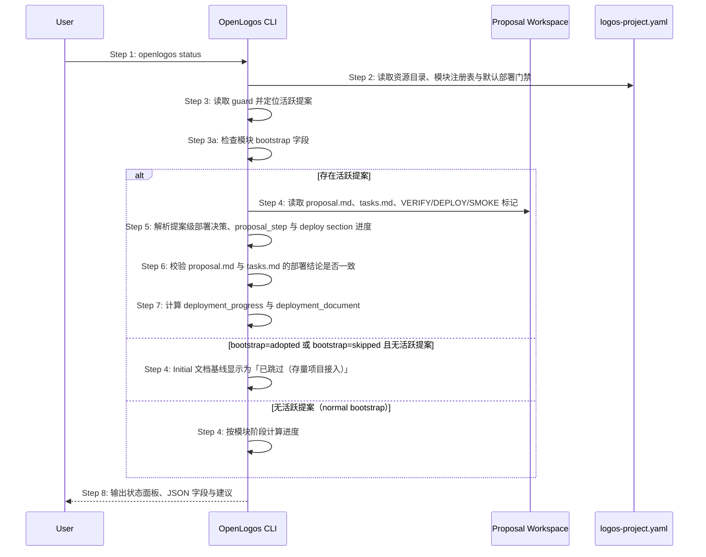

# S11: 查看阶段进度与活跃变更 — 时序图

## 步骤说明
1. **用户**执行 `openlogos status`。
2. **CLI** 读取资源目录、模块和模块级部署门禁。
3. **CLI** 读取 guard 判断是否存在活跃提案；同时检查模块 `bootstrap` 字段。
4. **CLI** 在存在活跃提案时读取提案工作区；`bootstrap: adopted` 或历史 `bootstrap: skipped` 且无活跃提案时，Initial 文档基线显示为「已跳过（存量项目接入）」。
5. **CLI** 优先使用提案级部署决策计算提案步骤；判断 `proposal.md` 是否仍为模板状态时，只能检查必需章节是否存在、通用模板字段是否仍未填写，以及 `## 部署影响` section 内结构化字段的字段值，不得因为正文其他章节合法出现 ``是 / 否`` 字面量而将 `proposal_step` 回退为 `writing`。部署影响布尔字段必须以字段值精确等于 `是` 或 `否` 作为有效决策；字段值为 `是 / 否` 时必须视为模板占位符，不得解析为 `true` 或 `false`。
6. **CLI** 校验 `proposal.md` 与 `tasks.md` 是否冲突。
7. **CLI** 生成 `deployment_progress` 与 `deployment_document`，其中任务文档入口必须指向 `tasks.md`。
8. **CLI** 输出状态面板；JSON 模式下输出部署决策字段与部署进度摘要，供 RunLogos 判断按钮。

## 异常用例
### EX-2.1: 模块过滤不存在
- **触发条件**：用户传入不存在的 `--module`。
- **期望响应**：输出模块不存在错误。

### EX-3.2: bootstrap=adopted 或历史 skipped 时 Initial 文档基线显示为已跳过
- **触发条件**：模块 `bootstrap: adopted` 或历史 `bootstrap: skipped`，Initial 文档目录为空。
- **期望响应**：Initial 文档基线显示为「文档基线已跳过（存量项目接入）」，不显示为未完成或错误；整体状态不受缺失影响。
- **副作用**：无。

### EX-5.1: proposal 正文引用部署模板占位符
- **触发条件**：`proposal.md` 的 `## 部署影响` 字段已明确填写，但变更原因、变更概述或其他正文段落中引用 ``是 / 否`` 等模板占位符字面量。
- **期望响应**：CLI 不应将该提案视为未填写模板；当 `[delta]` 任务已全部完成且存在可合并 delta 文件时，`proposal_step` 应返回 `ready-to-merge`。
- **副作用**：无。

### EX-5.2: 部署影响字段值仍为模板占位符
- **触发条件**：`proposal.md` 的 `## 部署影响` section 中，`是否需要部署`、`是否涉及数据迁移`、`是否需要回滚预案` 或 `是否需要 smoke` 的字段值仍为 `是 / 否`。
- **期望响应**：CLI 应继续将 `proposal_step` 返回为 `writing`，提示用户完善 proposal。
- **副作用**：无。

### EX-5.3: 空提案模板部署占位符
- **触发条件**：新建提案尚未填写，`proposal.md` 的 `## 部署影响` section 仍包含 `是否需要部署：是 / 否` 和 `是否需要 smoke：是 / 否`。
- **期望响应**：CLI 应返回 `proposal_step=writing`，且不得设置 `deployment_decision_conflict=true`；不得因为模板占位符被解析为“需要部署”而提示 `[deploy]` section 缺失。
- **副作用**：无。

### EX-6.1: 提案级部署决策缺失
- **触发条件**：历史提案没有结构化 `## 部署影响`。
- **期望响应**：CLI 回退到 `[deploy]` section 和模块默认门禁，并在 JSON 中标注 `deployment_decision_source` 为兼容来源。

### EX-6.2: 部署决策冲突
- **触发条件**：`proposal.md` 声明无需部署但 `tasks.md` 存在 `[deploy]` section，或声明需要部署但缺少 `[deploy]` section。
- **期望响应**：CLI 输出冲突警告，JSON 中设置 `deployment_decision_conflict=true`，并阻止 deploy、smoke 或 archive 成为主动作。

### EX-6.3: 部署进度不可用
- **触发条件**：活跃提案需要部署，但 `tasks.md` 缺失或无法读取。
- **期望响应**：JSON 中 `deployment_progress.status` 返回 `unavailable`，并保留 `deployment_document.path` 以便诊断。
