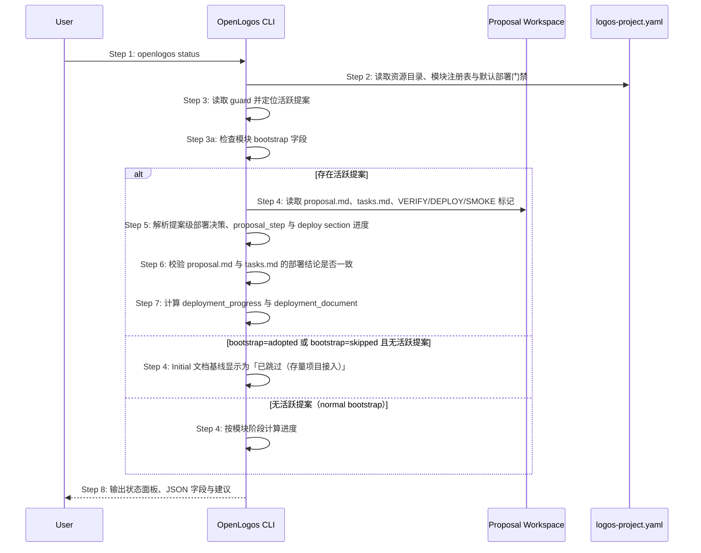

# S11: 查看阶段进度与活跃变更 — 时序图

## 步骤说明
1. **用户**执行 `openlogos status`。
2. **CLI** 读取资源目录、模块和模块级部署门禁。
3. **CLI** 读取 guard 判断是否存在活跃提案；同时检查模块 `bootstrap` 字段。
4. **CLI** 在存在活跃提案时读取提案工作区；`bootstrap: adopted` 或历史 `bootstrap: skipped` 且无活跃提案时，Initial 文档基线显示为「已跳过（存量项目接入）」。**initial 模块的 phase 派生（per-module `phase_progress` 与顶层 `phases[]`）自 M1 切片 B1 起由 `cli/src/lib/flow-derive.ts` 基于内置（builtin）initial flow 派生**，取代原硬编码的 `PHASE_KEYS` / `PHASE_SUBPATHS` 数组；**本切片不应用项目 overlay**，输出与旧 `deriveModulePhaseProgress` / 顶层 `phases[]` 逐字节等价（1:1 不改行为）。**launched 模块活跃提案的 `proposal_step` 自 M1 切片 B2 起由 `flow-derive` 的 `detectProposalStepViaFlow` 基于内置 launched flow 派生（取代旧 `detectProposalStep` 调用点，输出逐态等价、1:1 不改行为）。**
5. **CLI** 优先使用提案级部署决策计算提案步骤；判断 `proposal.md` 是否仍为模板状态时，只能检查必需章节是否存在、通用模板字段是否仍未填写，以及 `## 部署影响` section 内结构化字段的字段值，不得因为正文其他章节合法出现 ``是 / 否`` 字面量而将 `proposal_step` 回退为 `writing`。部署影响布尔字段必须以字段值精确等于 `是` 或 `否` 作为有效决策；字段值为 `是 / 否` 时必须视为模板占位符，不得解析为 `true` 或 `false`。
6. **CLI** 校验 `proposal.md` 与 `tasks.md` 是否冲突。
7. **CLI** 生成 `deployment_progress` 与 `deployment_document`，其中任务文档入口必须指向 `tasks.md`。
8. **CLI** 输出状态面板；JSON 模式下输出部署决策字段与部署进度摘要，供 RunLogos 判断按钮。

## initial phase 派生（flow-derive）与两套 legacy done 语义

initial 模块的 phase 进度由 `cli/src/lib/flow-derive.ts` 从 **builtin** initial flow 派生：

- **来源**：内置 initial flow 模型（`spec/flow/initial.yaml` 经 loader 加载），**不应用项目 overlay**。
  overlay 驱动 status 留作后续切片，本切片保持 1:1。
- **node-id → phase-key 映射**维护在 code 侧（`flow-derive.ts`），13 个节点 1:1 对应原 `PHASE_KEYS`，
  使 `spec/flow/*.yaml` 保持纯净。
- **`when` 求值**：`bootstrap != adopted` 跳过 prd/product-design/architecture（标
  `skip_reason: bootstrap-adopted`）；`api_enabled = !skip_phases.includes('api')`；
  `db_enabled = !skip_phases.includes('database')`；`scenario_enabled = !skip_phases.includes('scenario')`；
  `deployment_required = module.deployment_required !== false && !skip_phases.includes('deployment')`；
  `smoke_required = deployment_required && module.smoke_required !== false`（**未声明 smoke_required 视为 true**）。
- **fallback-skip 兼容**：对未声明 `skip_phases` 的老项目，派生结果与旧「已完成 phase 之前的空
  phase 自动标 skipped」兜底逻辑一致（`phase.3-3-deployment` / `phase.3-7-deploy` /
  `phase.3-8-smoke` 仍免于兜底跳过），current phase 不漂移。

引擎只产数据（node done/skipped 状态 + fan-out 覆盖数据 `{ total, covered, missing }`），
**done 判定规则由 status 消费端分别套用，二者均与现状 1:1，不可混淆**：

| 阶段类别 | 顶层 `phases[]` 的 done | per-module `phase_progress` 的 done |
|---|---|---|
| **场景阶段**（`phase.3-1` 场景时序 / `phase.3-4a` 测试用例） | 目录有任意文件即 done（**any-present**） | 当前模块场景**全覆盖**才 done（**all-present**），并产 `scenario_coverage: { total, covered, missing }` |
| **非场景阶段**（其余 11 个 phase） | 扫**整个目录**有任意文件即 done | 多模块时仅按 `{module}-` 前缀过滤后有任意文件即 done；单模块时目录任意文件即 done |

补充约束（均为 legacy 1:1 保留）：

- **场景文件匹配保留 legacy `includes()` 子串匹配**：对每个场景 `${module}-${scenario}` 作子串
  包含判定（`phase.3-4a` 还需含 `-test-cases` 子串），**不改用 flow-spec §141 的 glob 精确匹配**。
  glob 是未来的有意修正；本切片保留旧子串行为，并由用例锁定预期。子串匹配的潜在误命中风险随之保留
  （如非零填充或跨位数 ID `S1` 会子串命中 `S11` 的文件名；当前两位零填充方案 `S01`/`S11` 一般不触发，
  但旧语义如实保留，用例以"相邻 ID 不串台 + includes 行为不变"两个方向锁定）。
- **多模块全局 skip 交集**：顶层 `phases[]` 仅当所有 initial 模块都显式 skip 某 phase 时才将其标
  skipped（交集语义），与现状一致。
- **并跑断言仅测试期**：在测试套件对同一 fixture 同时跑新引擎与旧 `deriveModulePhaseProgress` /
  顶层 `phases[]` 并断言相等，**不进入生产 CLI 路径**，绝不让运行时断言导致 status 崩溃。

## launched proposal_step 派生来源（flow-derive）

launched 模块在存在活跃提案时，`active_change.proposal_step` 的判定来源自 M1 切片 B2 起改为
`cli/src/lib/flow-derive.ts` 的 `detectProposalStepViaFlow(proposalDir, moduleDefaults)`，
基于**内置（builtin）launched flow**（`spec/flow/launched.yaml`）派生：

- **来源**：内置 launched flow 模型（`spec/flow/launched.yaml` 经 loader 加载），**不应用项目
  overlay**；与 B1 的 initial 路径保持同一 1:1 方法论。
- **节点序列声明化**：propose → merge → implement → deliver → close 的节点顺序与
  `done_when` / `fail_when` 由 `launched.yaml` 提供；`detectProposalStepViaFlow` 据此判定
  `ProposalStep`，与旧 `detectProposalStep` 逐态等价。
- **marker 非对称优先级（引擎规则保留）**：`VERIFY_FAIL` 全局最先；`SMOKE_FAIL` / `SMOKE_PASS`
  仅在 `VERIFY_PASS` 成立、需部署、`DEPLOY_DONE` 存在且 deploy 任务全勾后的 deploy 子块内评估，
  否则仍停 `ready-to-deploy`。
- **提案级部署决策（引擎规则保留）**：deliver 的 `deployment_required` / `smoke_required` 与
  决策冲突阻塞继续由 `resolveProposalDeploymentDecision` 求解（提案级，不回退模块默认）；本节
  下方「deploy-done 对 status 的影响」与 EX-6.x 行为均不变。
- **section 完成语义按 legacy**：`section_complete:<tag>` = `total > 0 && checked === total`，
  present-but-empty 的 `[delta]`/`[code]` 不算完成。

为复用上述判定且不与 `status.ts` 形成运行时循环依赖，proposal-lifecycle 纯函数
（`resolveProposalDeploymentDecision` / `parseTaskSections` / `getDeploySectionSummary` /
`hasSmokeCasesForProposal` / `isProposalTemplateFilled` / `isTasksTemplateFilled` /
`countMergeableDeltaFiles` / `allTasksChecked` / `getDeployTasks` 及 `detectProposalStep` 本身）
下沉到 `cli/src/lib/proposal-lifecycle.ts`，`status.ts` 改为 import 并 re-export（对外接口不变）。
状态计算仍以 `detectProposalStep` 的语义为单一事实源；并跑等价由测试期「ViaFlow == 旧
`detectProposalStep`」断言锁定（见 `core-S09-test-cases`），**不进入生产 CLI 路径**。

## 异常用例
### EX-2.1: 模块过滤不存在
- **触发条件**：用户传入不存在的 `--module`。
- **期望响应**：输出模块不存在错误。

### EX-3.2: bootstrap=adopted 或历史 skipped 时 Initial 文档基线显示为已跳过
- **触发条件**：模块 `bootstrap: adopted` 或历史 `bootstrap: skipped`，Initial 文档目录为空。
- **期望响应**：Initial 文档基线显示为「文档基线已跳过（存量项目接入）」，不显示为未完成或错误；整体状态不受缺失影响。
- **副作用**：无。

### EX-5.1: proposal 正文引用部署模板占位符
- **触发条件**：`proposal.md` 的 `## 部署影响` 字段已明确填写，但变更原因、变更概述或其他正文段落中引用 ``是 / 否`` 等模板占位符字面量。
- **期望响应**：CLI 不应将该提案视为未填写模板；当 `[delta]` 任务已全部完成且存在可合并 delta 文件时，`proposal_step` 应返回 `ready-to-merge`。
- **副作用**：无。

### EX-5.2: 部署影响字段值仍为模板占位符
- **触发条件**：`proposal.md` 的 `## 部署影响` section 中，`是否需要部署`、`是否涉及数据迁移`、`是否需要回滚预案` 或 `是否需要 smoke` 的字段值仍为 `是 / 否`。
- **期望响应**：CLI 应继续将 `proposal_step` 返回为 `writing`，提示用户完善 proposal。
- **副作用**：无。

### EX-5.3: 空提案模板部署占位符
- **触发条件**：新建提案尚未填写，`proposal.md` 的 `## 部署影响` section 仍包含 `是否需要部署：是 / 否` 和 `是否需要 smoke：是 / 否`。
- **期望响应**：CLI 应返回 `proposal_step=writing`，且不得设置 `deployment_decision_conflict=true`；不得因为模板占位符被解析为“需要部署”而提示 `[deploy]` section 缺失。
- **副作用**：无。

### EX-6.1: 提案级部署决策缺失
- **触发条件**：历史提案没有结构化 `## 部署影响`。
- **期望响应**：CLI 回退到 `[deploy]` section 和模块默认门禁，并在 JSON 中标注 `deployment_decision_source` 为兼容来源。

### EX-6.2: 部署决策冲突
- **触发条件**：`proposal.md` 声明无需部署但 `tasks.md` 存在 `[deploy]` section，或声明需要部署但缺少 `[deploy]` section。
- **期望响应**：CLI 输出冲突警告，JSON 中设置 `deployment_decision_conflict=true`，并阻止 deploy、smoke 或 archive 成为主动作。

### EX-6.3: 部署进度不可用
- **触发条件**：活跃提案需要部署，但 `tasks.md` 缺失或无法读取。
- **期望响应**：JSON 中 `deployment_progress.status` 返回 `unavailable`，并保留 `deployment_document.path` 以便诊断。

## deploy-done 对 status 的影响

`openlogos status` 在活跃提案中展示部署状态时必须遵守：

- `ready-to-deploy`：显示 `[deploy]` 进度，提示部署完成后执行 `openlogos deploy-done`。
- `deploy-done`：表示 `DEPLOY_DONE` 存在且 `[deploy]` 任务全勾，但提案无需 smoke。
- `ready-to-smoke`：表示 `DEPLOY_DONE` 存在且 `[deploy]` 任务全勾，且提案需要 smoke。
- `smoke-passed` / `smoke-failed`：只能由 `openlogos smoke` 写入的 marker 推进。

状态计算仍以 `detectProposalStep()` 为单一事实源。`deploy-done` 命令只是写入状态事实，不在 status 中临时推断部署完成。

JSON 输出中 `deployment_progress.status=done` 不等价于部署完成；只有同时存在 `DEPLOY_DONE` 才能离开 `ready-to-deploy`。
