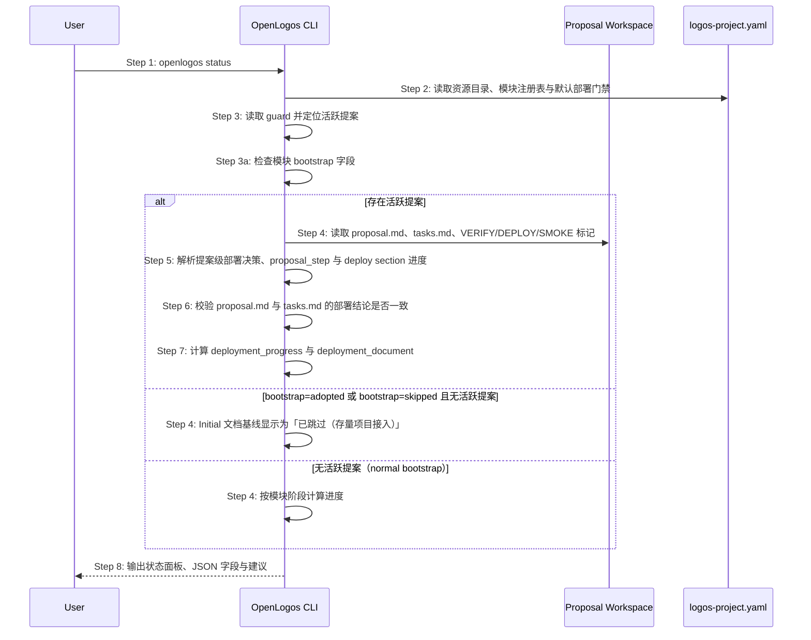
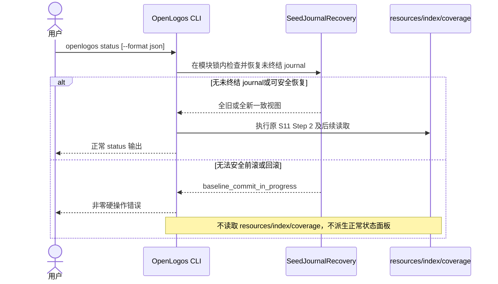
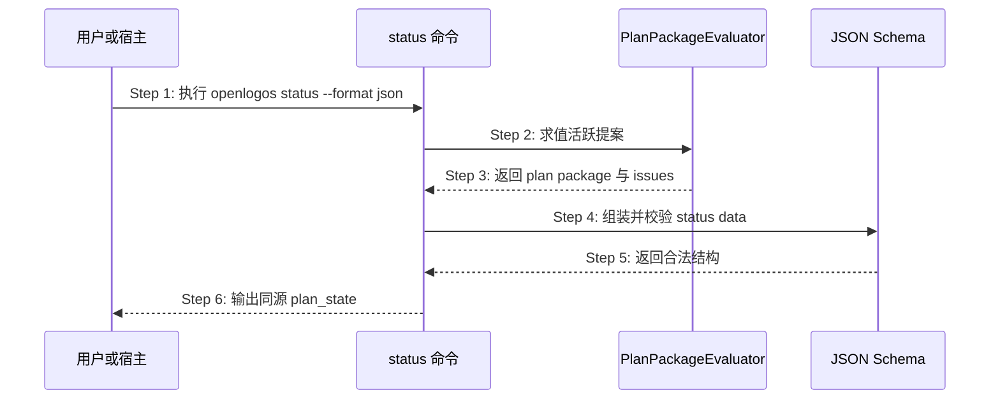
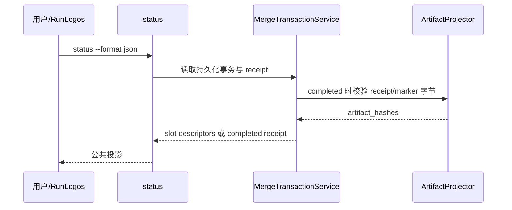
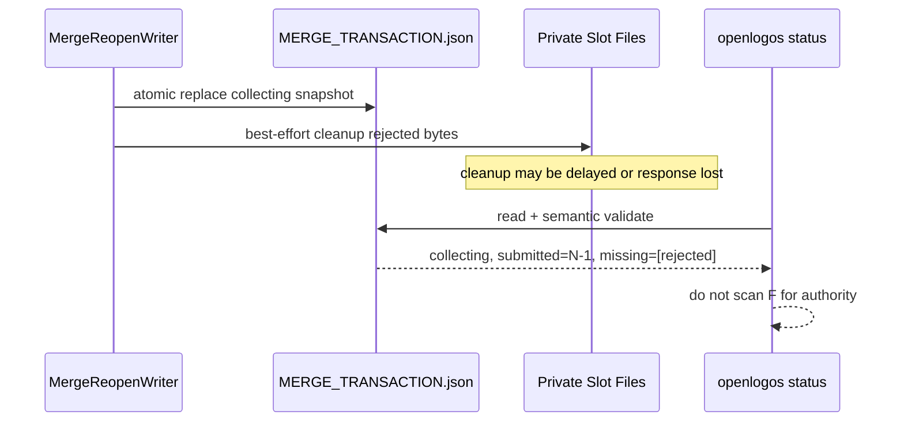
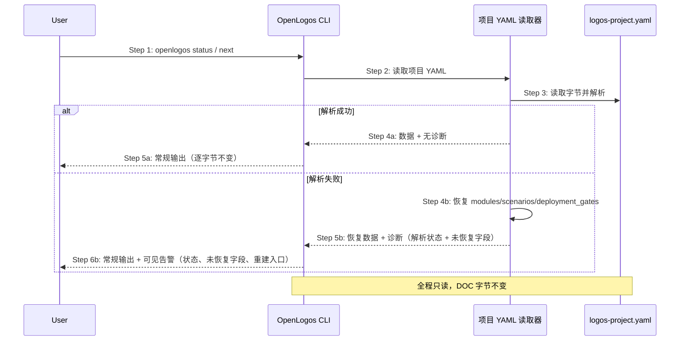
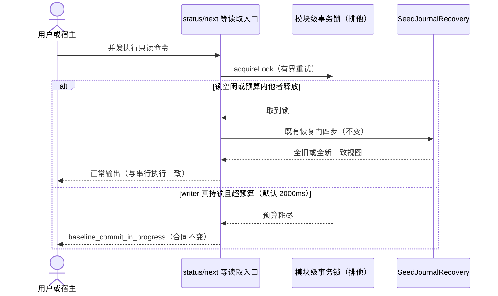

# S11: 查看阶段进度与活跃变更 — 时序图


```mermaid
sequenceDiagram
    participant U as User
    participant C as OpenLogos CLI
    participant P as Proposal Workspace
    participant Y as logos-project.yaml

    U->>C: Step 1: openlogos status
    C->>Y: Step 2: 读取资源目录、模块注册表与默认部署门禁
    C->>C: Step 3: 读取 guard 并定位活跃提案
    C->>C: Step 3a: 检查模块 bootstrap 字段
    alt 存在活跃提案
        C->>P: Step 4: 读取 proposal.md、tasks.md、VERIFY/DEPLOY/SMOKE 标记
        C->>C: Step 5: 解析提案级部署决策、proposal_step 与 deploy section 进度
        C->>C: Step 6: 校验 proposal.md 与 tasks.md 的部署结论是否一致
        C->>C: Step 7: 计算 deployment_progress 与 deployment_document
    else bootstrap=adopted 或 bootstrap=skipped 且无活跃提案
        C->>C: Step 4: Initial 文档基线显示为「已跳过（存量项目接入）」
    else 无活跃提案（normal bootstrap）
        C->>C: Step 4: 按模块阶段计算进度
    end
    C-->>U: Step 8: 输出状态面板、JSON 字段与建议
```

## 步骤说明
1. **用户**执行 `openlogos status`。
2. **CLI** 读取资源目录、模块和模块级部署门禁。
3. **CLI** 读取 guard 判断是否存在活跃提案；同时检查模块 `bootstrap` 字段。
4. **CLI** 在存在活跃提案时读取提案工作区；`bootstrap: adopted` 或历史 `bootstrap: skipped` 且无活跃提案时，Initial 文档基线显示为「已跳过（存量项目接入）」。**initial 模块的 phase 派生（per-module `phase_progress` 与顶层 `phases[]`）自 M1 切片 B1 起由 `cli/src/lib/flow-derive.ts` 基于内置（builtin）initial flow 派生**，取代原硬编码的 `PHASE_KEYS` / `PHASE_SUBPATHS` 数组；**本切片不应用项目 overlay**，输出与旧 `deriveModulePhaseProgress` / 顶层 `phases[]` 逐字节等价（1:1 不改行为）。**launched 模块活跃提案的 `proposal_step` 自 M1 切片 B2 起由 `flow-derive` 的 `detectProposalStepViaFlow` 基于内置 launched flow 派生（取代旧 `detectProposalStep` 调用点，输出逐态等价、1:1 不改行为）。**
5. **CLI** 优先使用提案级部署决策计算提案步骤；判断 `proposal.md` 是否仍为模板状态时，只能检查必需章节是否存在、通用模板字段是否仍未填写，以及 `## 部署影响` section 内结构化字段的字段值，不得因为正文其他章节合法出现 ``是 / 否`` 字面量而将 `proposal_step` 回退为 `writing`。部署影响布尔字段必须以字段值精确等于 `是` 或 `否` 作为有效决策；字段值为 `是 / 否` 时必须视为模板占位符，不得解析为 `true` 或 `false`。
6. **CLI** 校验 `proposal.md` 与 `tasks.md` 是否冲突。
7. **CLI** 生成 `deployment_progress` 与 `deployment_document`，其中任务文档入口必须指向 `tasks.md`。
8. **CLI** 输出状态面板；JSON 模式下输出部署决策字段与部署进度摘要，供 RunLogos 判断按钮。JSON 模式下 `data` 顶层携带 `contract: {"version": "1.0.0"}`，`modules[].active_change` 随步骤携带 `step_meta` 与 `facts`（详见「status 的契约自描述输出（contract / step_meta / facts）」）。

## initial phase 派生（flow-derive）与两套 legacy done 语义

initial 模块的 phase 进度由 `cli/src/lib/flow-derive.ts` 从 **builtin** initial flow 派生：

- **来源**：内置 initial flow 模型（`spec/flow/initial.yaml` 经 loader 加载），**不应用项目 overlay**。
  overlay 驱动 status 留作后续切片，本切片保持 1:1。
- **node-id → phase-key 映射**维护在 code 侧（`flow-derive.ts`），13 个节点 1:1 对应原 `PHASE_KEYS`，
  使 `spec/flow/*.yaml` 保持纯净。
- **`when` 求值**：`bootstrap != adopted` 跳过 prd/product-design/architecture（标
  `skip_reason: bootstrap-adopted`）；`api_enabled = !skip_phases.includes('api')`；
  `db_enabled = !skip_phases.includes('database')`；`scenario_enabled = !skip_phases.includes('scenario')`；
  `deployment_required = module.deployment_required !== false && !skip_phases.includes('deployment')`；
  `smoke_required = deployment_required && module.smoke_required !== false`（**未声明 smoke_required 视为 true**）。
- **fallback-skip 兼容**：对未声明 `skip_phases` 的老项目，派生结果与旧「已完成 phase 之前的空
  phase 自动标 skipped」兜底逻辑一致（`phase.3-3-deployment` / `phase.3-7-deploy` /
  `phase.3-8-smoke` 仍免于兜底跳过），current phase 不漂移。

引擎只产数据（node done/skipped 状态 + fan-out 覆盖数据 `{ total, covered, missing }`），
**done 判定规则由 status 消费端分别套用，二者均与现状 1:1，不可混淆**：

| 阶段类别 | 顶层 `phases[]` 的 done | per-module `phase_progress` 的 done |
|---|---|---|
| **场景阶段**（`phase.3-1` 场景时序 / `phase.3-4a` 测试用例） | 目录有任意文件即 done（**any-present**） | 当前模块场景**全覆盖**才 done（**all-present**），并产 `scenario_coverage: { total, covered, missing }` |
| **非场景阶段**（其余 11 个 phase） | 扫**整个目录**有任意文件即 done | 多模块时仅按 `{module}-` 前缀过滤后有任意文件即 done；单模块时目录任意文件即 done |

补充约束（均为 legacy 1:1 保留）：

- **场景文件匹配保留 legacy `includes()` 子串匹配**：对每个场景 `${module}-${scenario}` 作子串
  包含判定（`phase.3-4a` 还需含 `-test-cases` 子串），**不改用 flow-spec §141 的 glob 精确匹配**。
  glob 是未来的有意修正；本切片保留旧子串行为，并由用例锁定预期。子串匹配的潜在误命中风险随之保留
  （如非零填充或跨位数 ID `S1` 会子串命中 `S11` 的文件名；当前两位零填充方案 `S01`/`S11` 一般不触发，
  但旧语义如实保留，用例以"相邻 ID 不串台 + includes 行为不变"两个方向锁定）。
- **多模块全局 skip 交集**：顶层 `phases[]` 仅当所有 initial 模块都显式 skip 某 phase 时才将其标
  skipped（交集语义），与现状一致。
- **并跑断言仅测试期**：在测试套件对同一 fixture 同时跑新引擎与旧 `deriveModulePhaseProgress` /
  顶层 `phases[]` 并断言相等，**不进入生产 CLI 路径**，绝不让运行时断言导致 status 崩溃。

## launched proposal_step 派生来源（flow-derive）

launched 模块在存在活跃提案时，`active_change.proposal_step` 的判定来源自 M1 切片 B2 起改为
`cli/src/lib/flow-derive.ts` 的 `detectProposalStepViaFlow(proposalDir, moduleDefaults)`，
基于**内置（builtin）launched flow**（`spec/flow/launched.yaml`）派生：

- **来源**：内置 launched flow 模型（`spec/flow/launched.yaml` 经 loader 加载），**不应用项目
  overlay**；与 B1 的 initial 路径保持同一 1:1 方法论。
- **节点序列声明化**：propose → merge → implement → deliver → close 的节点顺序与
  `done_when` / `fail_when` 由 `launched.yaml` 提供；`detectProposalStepViaFlow` 据此判定
  `ProposalStep`，与旧 `detectProposalStep` 逐态等价。
- **marker 非对称优先级（引擎规则保留）**：`VERIFY_FAIL` 全局最先；`SMOKE_FAIL` / `SMOKE_PASS`
  仅在 `VERIFY_PASS` 成立、需部署、`DEPLOY_DONE` 存在且 deploy 任务全勾后的 deploy 子块内评估，
  否则仍停 `ready-to-deploy`。
- **提案级部署决策（引擎规则保留）**：deliver 的 `deployment_required` / `smoke_required` 与
  决策冲突阻塞继续由 `resolveProposalDeploymentDecision` 求解（提案级，不回退模块默认）；本节
  下方「deploy-done 对 status 的影响」与 EX-6.x 行为均不变。
- **section 完成语义按 legacy**：`section_complete:<tag>` = `total > 0 && checked === total`，
  present-but-empty 的 `[delta]`/`[code]` 不算完成。

为复用上述判定且不与 `status.ts` 形成运行时循环依赖，proposal-lifecycle 纯函数
（`resolveProposalDeploymentDecision` / `parseTaskSections` / `getDeploySectionSummary` /
`hasSmokeCasesForProposal` / `isProposalTemplateFilled` / `isTasksTemplateFilled` /
`countMergeableDeltaFiles` / `allTasksChecked` / `getDeployTasks` 及 `detectProposalStep` 本身）
下沉到 `cli/src/lib/proposal-lifecycle.ts`，`status.ts` 改为 import 并 re-export（对外接口不变）。
状态计算仍以 `detectProposalStep` 的语义为单一事实源；并跑等价由测试期「ViaFlow == 旧
`detectProposalStep`」断言锁定（见 `core-S09-test-cases`），**不进入生产 CLI 路径**。

## status 的契约自描述输出（contract / step_meta / facts）

本节按提案 contract-self-description（C1/C3/C5）定义 `status --format json` 的契约自描述能力：步骤语义与确定性事实由 CLI 权威输出，消费方（AI driver）的自读/私有解析降级为低版本 fallback。

### contract 版本握手

- status/next 的 `data` 顶层新增 `"contract": {"version": "1.0.0"}`（语义化契约版本，独立于 CLI 版本）。
- SemVer 规则：**major** = 必填字段删除/改义、闭合枚举语义变化（含移除值）、既有字段挂出判据变更；**minor** = 向后兼容扩展（新增可选字段、闭合枚举新增值）；**patch** = 不改形态与语义的澄清。
- 版本-schema 一一映射：`spec/schema/status.schema.json`、`spec/schema/next.schema.json`（内嵌契约版本号，随 npm prepack 打包）；响应 `contract.version` 与打包 schema 版本一致，CI 校验。
- 消费方约定（规范性引用，验收归 runlogos R5）：未知 major / 缺 `contract` 字段 → 保守模式（仅 next 驱动普通推进 + 看门狗，启发式判定降级为仅观察）；契约内任何枚举遇未知值 → 保守分支。
- envelope / contract / schema 的完整定义场景见 `core-S16-machine-json-output`。

### step_meta 与步骤注册表

- `modules[].active_change.step_meta = {"phase", "kind"}`；`phase ∈ pre-implement|implement|post-implement`；`kind ∈ produce|gate|command-required|residency`。
- 唯一铸造点 = `cli/src/lib/step-registry.ts`（收敛 `detectProposalStep` 与 `detectProposalStepViaFlow` 双镜像及 status/next 直接产字面量/覆盖点）；CI lint：字面量赋 proposal_step 不经注册表 → 测试失败。
- 「状态计算以 `detectProposalStep` 的语义为单一事实源」口径不变：注册表收敛的是 `proposal_step` 字面量的铸造点并统一附着 `step_meta`，不改变各步骤的判定语义。
- **不新增 proposal_step 枚举值**；`step_meta` 不构成第二枚举——phase/kind 为小闭合枚举，消费方遇未知值必须按保守分支处理。
- 全量注册表：

| proposal_step | phase | kind |
|---|---|---|
| writing | pre-implement | produce |
| ready-to-delta | pre-implement | gate |
| delta-writing | pre-implement | produce |
| ready-to-merge | pre-implement | gate |
| merge-generated | pre-implement | command-required |
| spec-complete-required | pre-implement | command-required |
| test-id-required | pre-implement | residency |
| ready-to-implement | pre-implement | residency |
| coding | implement | produce |
| ready-to-verify | implement | command-required |
| verify-failed | implement | residency |
| verify-passed | post-implement | residency |
| ready-to-deploy | post-implement | gate |
| deploy-done | post-implement | residency |
| ready-to-smoke | post-implement | command-required |
| smoke-passed | post-implement | residency |
| smoke-failed | post-implement | residency |
| implementing（旧兼容） | implement | produce |
| in-progress（旧兼容） | implement | produce |

### facts 权威事实块

- `modules[].active_change.facts = {"spec_complete", "slices_planned", "slices_approved", "code_required", "has_delta_tasks", "verify_pass"}`（全布尔，仅活跃提案时输出）。
- CLI 权威计算：spec_complete = SPEC_MERGED/MERGED 在场；slices_planned = tasks.md `[code]` 含真实脱占位条目；slices_approved = SLICES_APPROVED marker 在场；code_required / has_delta_tasks 沿现行判定；verify_pass = VERIFY_PASS marker。单一事实源在 CLI，driver 的自读/私有解析降级为低版本 fallback。
- `loop_state` 激活判据与 facts 同源（同一份计算，不允许两处实现），driver 可直接从 facts 读出「implement 是否已进入」；`loop_state` 挂出时机的定义见 `core-S27-loop-iterate`（本提案 C2）。

### active_change 扩展口径与主动破例声明

- `active_change` 新增 `step_meta` / `facts` 走 `spec/cli-json-output.md`「有活跃提案 golden 同步更新」既有可控扩展口径：仅有活跃提案的 golden 重拍，无活跃提案项目零漂移；不属硬红线，但按规范要求显式声明。
- **主动破例**：破「data 顶层逐字节不变（golden 零漂移）」——`data` 顶层新增 `contract` → 全部 9 个 golden 基线快照重拍（本提案唯一的全量 golden 重拍点，随大版本发布；见 `core-S16-machine-json-output`）。
- 验收边界：openlogos 本提案只验**生产者契约**（注册表/step_meta/schema 三方同步、facts 字段来源正确、contract 版本字段在场）；消费方保守模式 / 零误杀验收归 runlogos R5 提案。

### EX-8.1: 无活跃提案时 step_meta / facts 零漂移
- **触发条件**：模块无活跃提案（`active_change` 不出现 / 为 null）。
- **期望响应**：`step_meta` 与 `facts` 随整个 `active_change` 对象不出现（零漂移边界，与 `code_required` 同口径）；`data` 顶层 `contract` 仍然输出（contract 是 envelope 级契约，不依赖活跃提案存在）。
- **副作用**：无。

## 异常用例
### EX-2.1: 模块过滤不存在
- **触发条件**：用户传入不存在的 `--module`。
- **期望响应**：输出模块不存在错误。

### EX-3.2: bootstrap=adopted 或历史 skipped 时 Initial 文档基线显示为已跳过
- **触发条件**：模块 `bootstrap: adopted` 或历史 `bootstrap: skipped`，Initial 文档目录为空。
- **期望响应**：Initial 文档基线显示为「文档基线已跳过（存量项目接入）」，不显示为未完成或错误；整体状态不受缺失影响。
- **副作用**：无。

### EX-3.3: adopted 模块 status JSON 恒输出 baseline_seed_state（baseline-seed-legacy-default-unify）

- **触发条件**：`bootstrap: adopted` 模块执行 `openlogos status --format json`，且 seed journal 恢复门已确认无未终结 journal或已成功恢复；explicit 显式值与 legacy 缺省均适用。
- **期望响应**：`modules[].baseline_seed_state` 恒为合法枚举 `required｜partial｜seeded`：explicit 优先；yaml 缺省时经共享 `effectiveBaselineSeedState` 派生（有 committed candidate 且仅有安全 open run/未提交 staging→`partial`，有 candidate 且无 open run→`seeded`，无 candidate→`required`）。安全 staging 不进入 resources/index/coverage，`status`、`next`、`baseline-seed status` 对同一一致视图的有效状态逐字节一致。legacy 派生态 suggestion 可提示运行 `openlogos sync` 迁移元数据。
- **副作用**：无状态修改；不新增 `baseline_seed_state_source`。本成功契约不覆盖无法恢复的 `prepared|committing` journal；该情形必须走下方事务硬门，不得用派生枚举兜底成成功 envelope。

### EX-5.1: proposal 正文引用部署模板占位符
- **触发条件**：`proposal.md` 的 `## 部署影响` 字段已明确填写，但变更原因、变更概述或其他正文段落中引用 ``是 / 否`` 等模板占位符字面量。
- **期望响应**：CLI 不应将该提案视为未填写模板；当 `[delta]` 任务已全部完成且存在可合并 delta 文件时，`proposal_step` 应返回 `ready-to-merge`。
- **副作用**：无。

### EX-5.2: 部署影响字段值仍为模板占位符
- **触发条件**：`proposal.md` 的 `## 部署影响` section 中，`是否需要部署`、`是否涉及数据迁移`、`是否需要回滚预案` 或 `是否需要 smoke` 的字段值仍为 `是 / 否`。
- **期望响应**：CLI 应继续将 `proposal_step` 返回为 `writing`，提示用户完善 proposal。
- **副作用**：无。

### EX-5.3: 空提案模板部署占位符
- **触发条件**：新建提案尚未填写，`proposal.md` 的 `## 部署影响` section 仍包含 `是否需要部署：是 / 否` 和 `是否需要 smoke：是 / 否`。
- **期望响应**：CLI 应返回 `proposal_step=writing`，且不得设置 `deployment_decision_conflict=true`；不得因为模板占位符被解析为“需要部署”而提示 `[deploy]` section 缺失。
- **副作用**：无。

### EX-6.1: 提案级部署决策缺失
- **触发条件**：历史提案没有结构化 `## 部署影响`。
- **期望响应**：CLI 回退到 `[deploy]` section 和模块默认门禁，并在 JSON 中标注 `deployment_decision_source` 为兼容来源。

### EX-6.2: 部署决策冲突
- **触发条件**：`proposal.md` 声明无需部署但 `tasks.md` 存在 `[deploy]` section，或声明需要部署但缺少 `[deploy]` section。
- **期望响应**：CLI 输出冲突警告，JSON 中设置 `deployment_decision_conflict=true`，并阻止 deploy、smoke 或 archive 成为主动作。

### EX-6.3: 部署进度不可用
- **触发条件**：活跃提案需要部署，但 `tasks.md` 缺失或无法读取。
- **期望响应**：JSON 中 `deployment_progress.status` 返回 `unavailable`，并保留 `deployment_document.path` 以便诊断。

## deploy-done 对 status 的影响

`openlogos status` 在活跃提案中展示部署状态时必须遵守：

- `ready-to-deploy`：显示 `[deploy]` 进度，提示部署完成后执行 `openlogos deploy-done`。
- `deploy-done`：表示 `DEPLOY_DONE` 存在且 `[deploy]` 任务全勾，但提案无需 smoke。
- `ready-to-smoke`：表示 `DEPLOY_DONE` 存在且 `[deploy]` 任务全勾，且提案需要 smoke。
- `smoke-passed` / `smoke-failed`：只能由 `openlogos smoke` 写入的 marker 推进。

状态计算仍以 `detectProposalStep()` 为单一事实源。`deploy-done` 命令只是写入状态事实，不在 status 中临时推断部署完成。

JSON 输出中 `deployment_progress.status=done` 不等价于部署完成；只有同时存在 `DEPLOY_DONE` 才能离开 `ready-to-deploy`。

### state_inconsistency 只读对账投影

上述派生在 `DEPLOY_DONE` 缺失时永远停在 `ready-to-deploy`，下游强证据（`SMOKE_PASS` 等）永不被评估。20260907 事故中，这让「部署与 smoke 都已完成、只是漏跑 `openlogos deploy-done`」的矛盾状态**沉默停滞**：宿主面板长期显示「请执行部署任务」，无任何对账线索。本节新增只读投影，让矛盾**可见**——但不改派生、不自动修复。

**触发条件（全部成立）**：活跃提案存在、`proposal_step` 派生为 `ready-to-deploy`（`DEPLOY_DONE` 缺失）、且至少一项矛盾下游证据在场：

| 证据枚举值 | 含义 |
|---|---|
| `smoke_pass_marker_present` | `SMOKE_PASS` 在场——smoke 已过却无部署完成事实 |
| `smoke_fail_marker_present` | `SMOKE_FAIL` 在场——smoke 已跑过却无部署完成事实 |
| `deploy_tasks_all_checked` | `tasks.md` 的 `[deploy]` section 已全勾却无 marker |

**挂载位置与形态**：`modules[].active_change.state_inconsistency`（legacy 单模块输出可回退顶层 `state_inconsistency`）：

```jsonc
{
  "kind": "deploy_done_missing_with_downstream_evidence",
  "evidence": ["smoke_pass_marker_present", "deploy_tasks_all_checked"],
  "remediation": "openlogos deploy-done"
}
```

`evidence` 按固定顺序（`smoke_pass_marker_present` → `smoke_fail_marker_present` → `deploy_tasks_all_checked`）去重输出，保证同一磁盘事实下输出稳定可 golden。字段契约见 `spec/cli-json-output.md`。

**只读不变量（强制）**：

1. **不落盘、不缓存**——每次 `status` 调用即时派生，无新鲜度问题、无 shadow source、无 cutover。
2. **不改 `proposal_step` 派生**——`detectProposalStep()` 仍是单一事实源，投影是旁挂说明而非状态跃迁；`ready-to-deploy` 仍是 `ready-to-deploy`。
3. **不写任何 marker**——尤其不写 `DEPLOY_DONE`；status 是纯只读命令，本投影不破坏该性质。
4. **零漂移**——一致状态下字段**不出现**（不是输出 `null`），既有 status golden 逐字不受影响。
5. **`watch` 自动继承**——`watch` 复用 `collectStatusData`，无需单独实现；其只读性质同样保持。
6. **与既有诊断对象并列**——与 `plan_state`、`automation_diagnostic`、`merge_transaction` 等只读投影同构挂载，互不覆盖。

### EX-11.5: 孤儿 SMOKE_PASS 的 status 对账投影
- **触发条件**：`SMOKE_PASS` 在场、`DEPLOY_DONE` 缺失。
- **期望响应**：`status --format json` 的 `modules[].active_change.state_inconsistency` 在场且三字段齐备；`proposal_step` 仍为 `ready-to-deploy`；人类可读输出同步呈现对账提示。
- **副作用**：零——无写盘、无 marker 变化。

### EX-11.6: 一致状态零漂移
- **触发条件**：`DEPLOY_DONE` 已在场；或 `DEPLOY_DONE` 缺失但无任何矛盾下游证据。
- **期望响应**：输出**不含** `state_inconsistency` 字段，其余字段与修复前逐字一致。
- **副作用**：零。

## plan gate 诊断状态与 tasks 执行进度分层

`openlogos status --format json` 在 launched 活跃提案下应提供面向 driver/UI 的 plan gate 诊断对象，用于消除 `ready-to-delta` 与任务执行进度之间的歧义。该对象可以挂载在 `modules[].active_change.plan_state`，legacy 单模块输出可回退到顶层 `plan_state`。

建议结构：

```json
{
  "plan_ready": true,
  "plan_gate_pending": true,
  "plan_approved": false,
  "tasks_template_filled": true,
  "tasks_execution_done": 0,
  "tasks_execution_total": 8,
  "tasks_execution_scope": "delta",
  "diagnostic": "proposal/tasks 已完成，等待 plan-exit 批准；checkbox 表示 delta 执行进度"
}
```

字段语义：

| 字段 | 类型 | 说明 |
|---|---|---|
| `plan_ready` | boolean | `proposal.md` 与 `tasks.md` 已脱模板，且 proposal/tasks 一致性检查未阻断 plan |
| `plan_gate_pending` | boolean | `proposal_step=ready-to-delta` 且 `PLAN_APPROVED` 不存在，当前停在 plan 出口门 |
| `plan_approved` | boolean | `PLAN_APPROVED` 存在，或已通过实际 delta 产出离开 plan gate |
| `tasks_template_filled` | boolean | `tasks.md` 已被结构化填写，不是 CLI 初始模板 |
| `tasks_execution_done` | number | 当前可执行 section 的已勾 checkbox 数 |
| `tasks_execution_total` | number | 当前可执行 section 的 checkbox 总数 |
| `tasks_execution_scope` | string | 当前统计口径，优先为 `"delta"`；无 `[delta]` 且有 `[deploy]` 时为 `"deploy"`；不可用时为 `"none"` |
| `diagnostic` | string | 可直接展示给 RunLogos / AI driver 的短诊断 |

派生规则：

- `proposal_step=writing` 时，`plan_ready=false`，`plan_gate_pending=false`；若 `tasks_template_filled=false`，可提示继续填写 tasks。
- `proposal_step=ready-to-delta` 时，若 proposal/tasks 已脱模板，必须输出 `plan_ready=true`、`plan_gate_pending=true`、`plan_approved=false`；`tasks_execution_done` 可以为 0，但不得影响 `plan_ready`。
- `PLAN_APPROVED` 存在或 `proposal_step=delta-writing` 时，`plan_gate_pending=false`、`plan_approved=true`。
- `deployment_decision_conflict=true` 时，`plan_ready=false`，诊断应优先说明 proposal/tasks 冲突。
- 文本输出可继续简洁展示，但 JSON 契约必须足以让 UI/driver 区分“待批准”“待执行”和“未规划”。

SessionStart hook 与 RunLogos 面板应优先消费结构化字段，不得通过中文 `suggestion` 或 checkbox 比例反推 plan 是否失败。

## SessionStart 消费 status 结构化状态

S11 的 `openlogos status --format json` 是 AI 宿主 SessionStart 阶段化范围注入的主要事实源。SessionStart hook 应读取以下字段：

- `data.lifecycle`：判断是否进入 launched / active 变更管理。
- `data.active_change`：定位当前活跃提案 slug。
- `data.proposal_step`：判断当前提案阶段。
- `data.modules[].active_change.slug` 与 `data.modules[].active_change.proposal_step`：多模块或顶层字段缺失时的模块级回退。
- `data.suggestion`：作为下一步人类可读提示的补充，不作为唯一状态源。

读取顺序：

1. 优先使用 `status --format json` 顶层字段。
2. 顶层字段缺失时，从 `modules[]` 中寻找 active_change 对象。
3. 结构化状态不可用时，才读取 `logos/.openlogos-guard` 的 `activeChange`。
4. guard 回退只用于识别活跃提案，不得推断当前 `proposal_step`；文案必须提示运行 `openlogos status` / `openlogos next` 确认阶段。

输出约束：

- `proposal_step=delta-writing` 时，SessionStart 文案必须与 `status` / `next` 的建议一致：写入 `deltas/**` 并更新 `tasks.md`。
- `proposal_step=ready-to-delta` 时，文案必须表达“方案待批准”，而不是要求继续填写 `proposal.md`。
- `proposal_step=ready-to-merge` 时，文案必须表达 merge 是人类确认点。
- 无 guard 时，仍维持 launched 项目修改源码前必须创建提案的阻断提示。

该能力不新增 `status` JSON 字段，只消费现有契约。

## automation_diagnostic 在 status 中的前沿边界

`openlogos status --format json` 负责展示当前活跃提案的真实前沿。对于 launched 活跃提案，status 不得把历史 verify 失败诊断挂载成会改变下一步动作的 repair/code 建议，除非当前提案已经进入实现/验证闭环。

### 状态派生要求

- `ready-to-delta`：展示 plan gate / `plan_state`，不得输出 `suggested_next_node:"code"` 的 `automation_diagnostic`。
- `delta-writing`：展示 delta 执行进度，允许宿主继续写 delta，不得被全量失败诊断改写为 repair。
- `ready-to-merge`：展示 merge 是确认点 / 可跳 spec gate，不得被 stale diagnostic 改写为 verify repair。
- `merge-generated`：展示 merge 已完成后的下一阶段，不消费历史 verify 失败。
- `ready-to-implement` 且 `[code]` 未规划：展示 `plan-slices` 前沿，不输出可驱动 repair/code 的诊断。
- `coding`、`ready-to-verify`、`verify-failed`：可输出实现/验证相关 `automation_diagnostic`，用于 driver 派发 repair/code。

### 消费方约束

SessionStart、RunLogos 面板和其它 status 消费方必须以结构化 `proposal_step` / `next_node` / gate 字段为准，不得仅因存在历史 `automation_diagnostic.reason=="global-verify-failed"` 就扩大当前写入范围或跳过当前 flow 前沿。

## status 的 seed journal 前置恢复门（baseline-on-touch）

### 时序优先级

本节是 S11 Step 2“读取资源目录、模块注册表与默认部署门禁”及所有后续读取的硬前置条件，优先于正常状态面板/JSON 成功契约：


```mermaid
sequenceDiagram
    actor U as 用户
    participant C as OpenLogos CLI
    participant J as SeedJournalRecovery
    participant R as resources/index/coverage

    U->>C: openlogos status [--format json]
    C->>J: 在模块锁内检查并恢复未终结 journal
    alt 无未终结 journal或可安全恢复
        J-->>C: 全旧或全新一致视图
        C->>R: 执行原 S11 Step 2 及后续读取
        C-->>U: 正常 status 输出
    else 无法安全前滚或回滚
        J-->>C: baseline_commit_in_progress
        C-->>U: 非零硬操作错误
        Note over C,R: 不读取 resources/index/coverage，不派生正常状态面板
    end
```

### 步骤约束

1. CLI 只读取定位模块锁/journal 所需的最小元数据，不得先扫描标准 resources、resource_index 或 coverage。
2. `prepared|committing` 等未终结 journal 必须在锁内前滚到全新集合或回滚到全旧集合；恢复成功后才进入原 S11 Step 2。
3. 无法恢复时返回 `baseline_commit_in_progress` 操作错误；JSON 使用统一 error envelope，可携 module/run/journal 与修复提示，但不得伪装成 `success:true`，也不得输出从半新集合派生的 `modules[].phase_progress`、coverage、active_change 或建议。
4. 仅 open run/未提交 staging 且无未终结 commit journal 属安全 partial：排除 staging 后继续正常 status，兼容 `baseline_seed_state: partial`。
5. **读锁获取有界重试（fix-baseline-readlock-reader-contention）**：进入本门取模块锁时，锁被占不再立即失败，而是按架构 §四.B 有界指数退避重试（默认总预算 2000ms、25ms 起步、单次封顶 400ms）；预算内取到锁 → 走上述 1～4 不变；预算耗尽仍被占用 → 按第 3 条返回 `baseline_commit_in_progress`。status 单次执行的每个读锁区间独立适用同一语义。

### 不变量

- `baseline_commit_in_progress` 不是 seed 证据降级提示，而是标准资源一致性硬门。
- status、next、index、sync、coverage 与 S39 EvidenceScanner 复用同一恢复入口和锁顺序；不得由各消费者复制不同的降级分支。
- 失败路径读取哨兵必须证明 resources/index/coverage 调用数为 0；恢复重试成功后输出只能对应全旧或全新集合。

### 主时序


```mermaid
sequenceDiagram
    participant U as 用户或宿主
    participant S as status 命令
    participant E as PlanPackageEvaluator
    participant J as JSON Schema

    U->>S: Step 1: 执行 openlogos status --format json
    S->>E: Step 2: 求值活跃提案
    E-->>S: Step 3: 返回 plan package 与 issues
    S->>J: Step 4: 组装并校验 status data
    J-->>S: Step 5: 返回合法结构
    S-->>U: Step 6: 输出同源 plan_state
```

### 步骤说明

1. **用户或宿主**请求状态快照。
2. **status**调用共享 evaluator，不复制 proposal/tasks 判据。
3. **evaluator**返回 proposal/tasks 三态、ready 与稳定问题。
4. **status**只做字段投影与模块挂载。
5. **JSON Schema**验证新增字段且保持旧字段兼容。
6. **status**输出与 change-lint/next/flow 同源的 plan_state。

### 异常与边界

#### EX-3.1：evaluation 非法
- **触发条件**：文件不可读或共享 evaluator 抛出操作错误。
- **期望响应**：status 输出 error envelope，不把错误吞成 `plan_ready=false` 成功态。
- **副作用**：无写入。

#### EX-6.1：历史提案已越过 plan
- **触发条件**：存在批准/合并/验收 marker 但旧模板不符合新规则。
- **期望响应**：保持真实前沿，可选 warning 不改变 plan_state。
- **副作用**：不回退、不改文件。

### 追溯

- 需求：四方一致、历史兼容与只读要求。
- 测试：UT-S11-58～UT-S11-62、ST-S11-36～ST-S11-37。

## S11 完整消费者投影与真只读保证


### 主路径


```mermaid
sequenceDiagram
    participant U as 用户/RunLogos
    participant S as status
    participant T as MergeTransactionService
    participant P as ArtifactProjector
    U->>S: status --format json
    S->>T: 读取持久化事务与 receipt
    T->>P: completed 时校验 receipt/marker 字节
    P-->>T: artifact_hashes
    T-->>S: slot descriptors 或 completed receipt
    S-->>U: 公共投影
```

### 投影规则

- collecting/ready/sealed：content_slots.items 公开 descriptor，不公开内容；receipt=null、artifact_hashes=[]。
- completed：receipt 含 payload closure/commit_paths；外层 artifact_hashes 覆盖 receipt/marker。
- failed/aborted：classification=aborted、actions=[]、receipt=null、aborted_at 稳定。
- recovery_required：只公开 recover，不伪装 aborted/completed。
- status 前后 transaction、staging、journal、marker、时间戳和项目树字节不变；外层 hash 只读重算必须等于首次 completed 投影。

## S11 Reopen 与残留私有字节的只读状态投影


### 场景目标

保证 reopen 的提交点是持久化 transaction snapshot；status 不从 merge-content、merge-staging、文件mtime或宿主 ledger 推导 slot状态。

### 主时序


```mermaid
sequenceDiagram
    participant R as MergeReopenWriter
    participant T as MERGE_TRANSACTION.json
    participant F as Private Slot Files
    participant S as openlogos status

    R->>T: atomic replace collecting snapshot
    R->>F: best-effort cleanup rejected bytes
    Note over F: cleanup may be delayed or response lost
    S->>T: read + semantic validate
    T-->>S: collecting, submitted=N-1, missing=[rejected]
    S-->>S: do not scan F for authority
```

### 投影不变量

- `submitted` 精确等于 Agent items 中 `submitted_sha256 != null` 的数量。
- `missing_slot_ids` 精确等于 required items 中 hash 为 null 的稳定排序 ID。
- collecting/ready 时外层 `seal_sha256=null`；receipt=null、artifact_hashes=[]。
- reopen 后所有 target sealed hash 已清除，避免旧 snapshot 与新 submitted集合混用。
- classification可为本次 `slot_identity_mismatch`，actions仍严格由phase派生。

### 崩溃窗口

| 故障点 | status 权威结果 |
|---|---|
| transaction atomic rename前 | 完整 sealed；下一次 apply重跑preflight |
| rename后、私有清理前 | collecting；残留rejected字节不算submitted |
| 私有清理部分失败 | collecting；未受影响slot与missing集合不变 |
| apply journal存在 | applying/recovery投影；禁止collecting |

### 追溯

UT-S11-74、ST-S11-43以真实磁盘fixture覆盖上述窗口，并继续满足UT-S11-63的collecting projection合同及真只读树hash断言。

## S11 YAML 降级在人类可读通道的告警出口

### 场景目标

`logos-project.yaml` 解析失败后 CLI 走恢复分支，恢复器只抢救 `modules` / `scenarios` / `deployment_gates`，`resource_index` 等字段被丢弃。此前该降级只在机器通道有字段表达，人类可读的 `status` / `next` 输出与健康项目无法区分——最坏的失败模式是「能跑但数据已丢」。本节为降级状态补齐人类可读通道的告警出口，并明确处置权归属。

### 参与者与前置条件

| 别名 | 组件 | 说明 |
|------|------|------|
| U | User | 执行 `status` / `next` |
| C | OpenLogos CLI | 状态与建议派生 |
| RD | 项目 YAML 读取器 | 解析、失败时恢复并产出诊断 |
| DOC | `logos-project.yaml` | 正式文档，可能处于降级态 |

前置：`logos.config.json` 存在。`DOC` 处于三态之一——可解析、可恢复（`recovered`）、不可恢复（`error`）。

### 主时序


```mermaid
sequenceDiagram
    participant U as User
    participant C as OpenLogos CLI
    participant RD as 项目 YAML 读取器
    participant DOC as logos-project.yaml

    U->>C: Step 1: openlogos status / next
    C->>RD: Step 2: 读取项目 YAML
    RD->>DOC: Step 3: 读取字节并解析
    alt 解析成功
        RD-->>C: Step 4a: 数据 + 无诊断
        C-->>U: Step 5a: 常规输出（逐字节不变）
    else 解析失败
        RD->>RD: Step 4b: 恢复 modules/scenarios/deployment_gates
        RD-->>C: Step 5b: 恢复数据 + 诊断（解析状态 + 未恢复字段）
        C-->>U: Step 6b: 常规输出 + 可见告警（状态、未恢复字段、重建入口）
    end
    Note over C,DOC: 全程只读，DOC 字节不变
```

### 步骤说明

1. **用户**执行 `openlogos status` 或 `openlogos next`。
2. **读取器**解析 `logos-project.yaml`；成功则返回数据且不带诊断。
3. 解析失败时**读取器**进入恢复分支，抢救可恢复字段并产出诊断：解析状态（`recovered` / `error`）与未被恢复的字段清单。
4. **CLI** 在人类可读输出中打印可见告警，内容至少包含解析状态、未被恢复的字段名（至少含 `resource_index`）与重建入口 `openlogos index`。
5. 机器通道的诊断字段语义与结构不变；两通道对同一状态的判断必须一致。

### 投影规则

- **健康项目零新增输出**：解析成功时 `status` / `next` 输出逐字节不变，golden 零漂移。
- **两条命令同源**：`status` 与 `next` 消费同一诊断，不得只有其一可见。
- **恢复不等于修复**：告警说明索引已丢失、需人工处置，但 CLI 不代用户改写文件。
- **只读**：降级态下执行只读命令后 `logos-project.yaml` 字节不变。

### 异常与边界

| 编号 | 触发条件 | 处理 |
|---|---|---|
| EX-S11-YD-1 | `recovered`——modules 可恢复但 `resource_index` 丢失 | 常规输出照常渲染，附可见告警并点名 `resource_index` |
| EX-S11-YD-2 | `error`——无任何字段可恢复 | 输出明确的降级告警，不得呈现为「看起来正常」 |
| EX-S11-YD-3 | 用户要求 CLI 自动修复 | 不提供自动改写；指向 `openlogos index` 重建入口，由人决定 |

### 追溯

- 需求：AC-YAMLW-04～05。
- 功能规格：§2.47.3。
- 架构：§三十八.3。
- 测试：UT-S11-75～UT-S11-77、ST-S11-44；安装态 SMOKE-core-169。

## S11 并发只读读取门有界重试（fix-baseline-readlock-reader-contention）

### 时序分支

本节补充「读取门」在锁被占时的重试分支，是「status 的 seed journal 前置恢复门」的获取时序细化：


```mermaid
sequenceDiagram
    actor U as 用户或宿主
    participant C as status/next 等读取入口
    participant L as 模块级事务锁（排他）
    participant J as SeedJournalRecovery

    U->>C: 并发执行只读命令
    C->>L: acquireLock（有界重试）
    alt 锁空闲或预算内他者释放
        L-->>C: 取到锁
        C->>J: 既有恢复门四步（不变）
        J-->>C: 全旧或全新一致视图
        C-->>U: 正常输出（与串行执行一致）
    else writer 真持锁且超预算（默认 2000ms）
        L-->>C: 预算耗尽
        C-->>U: baseline_commit_in_progress（合同不变）
    end
```

### 异常与边界

#### EX-RL-1：并发只读互撞
- **触发条件**：无 writer、无未终结 journal，N 个只读命令并发进入读取门（含同一 status 进程内的多个读锁区间与他进程碰撞）。
- **期望响应**：读者靠排他锁串行化 + 有界重试全部成功；各输出与串行执行逐字段一致；不出现 `baseline_commit_in_progress`。
- **副作用**：无写入；锁文件在各读临界区结束后不残留。

#### EX-RL-2：writer 真持锁超预算
- **触发条件**：seed commit 全程持锁且超过读者重试预算。
- **期望响应**：读者如实返回 `baseline_commit_in_progress`，error envelope 与既有合同逐字一致；不读半新集合。
- **副作用**：无写入；不干扰 writer 的提交或死锁回收。

### 不变量

- 重试只改变「锁获取」时序；恢复门四步、不可恢复硬门、安全 partial 分流全部零回退。
- status、next、index、sync、coverage 与 S39 EvidenceScanner 复用同一 `acquireLock` 重试入口，不得各自复制重试分支。

### 追溯

- 需求：AC-READLOCK-01～06；功能规格：§2.54；架构：§四.B。
- 测试：UT-S11-78～UT-S11-79、ST-S11-45；安装态：SMOKE-core-177。

## S11 per-scenario 覆盖判定的权威口径与 SessionStart 同口径约束

### 场景目标

修好 SessionStart phase 探测的 missing 误报，并把「某场景是否已有对应文件」这一判定的**权威口径**
写死在规格里。误报由**两个叠加缺陷**造成，缺一不可修：

1. **扩展名模式被提前展开**：`plugin/bin/openlogos-phase` 的 `check_scenarios_complete()` 以
   `for pat in $ext_pattern` 分词，**未加引用的展开同时触发文件名展开**。脚本在项目根执行，根目录
   通常有 `README.md` / `AGENTS.md` / `CLAUDE.md`，故 `*.md` 在进入循环前就变成了这些**根目录文件名**，
   实际拼出的是 `find <目标目录> -maxdepth 1 -name S03-README.md -o -name S03-AGENTS.md …`，
   与场景文件毫无关系。API 调用点的 `*.yaml *.yml` 同理。
2. **拼出的 glob 漏模块前缀**：即便模式以字面量到达 `find`，`${sid}-${pat}` 也只是 `S03-*.md`，
   而 `spec/module-naming-convention.md` 规定场景实现与测试用例文件名为 `<module>-SXX-*`
   （实际叫 `core-S03-….md`），仍然零命中。

对照 `cli/src/commands/status.ts:394-402` 与 `cli/src/lib/flow-derive.ts:229-234`：CLI 侧判据为
`pattern = ${mod.id}-${s.id}` 的 `includes()` 子串匹配，**带模块前缀、是对的**，故
`openlogos status --format json` 报无缺失，而 SessionStart 每次启动都报 `missing …`——同一事实、
两个相反结论。

### 用户价值

SessionStart 注入的 phase 文本是 agent 每次会话的**第一份事实**。误报 missing 会把 agent 直接推向
「去补早已存在的文件」，是 agent 驱动流程中最前置的误导源，且每次会话重复发生。

### 权威口径（authoritative）

**per-scenario 覆盖判定以 `cli/src/commands/status.ts` 的实现为权威口径**：对每个场景，
判据键为 `<module>-<scenarioId>`（如 `core-S03`），按本文「initial phase 派生（flow-derive）与两套
legacy done 语义」一节既定的 legacy `includes()` 子串语义在目标目录内匹配；`phase.3-4a`
（测试用例）另需含 `-test-cases` 子串。该口径产出的 `scenario_coverage: { total, covered, missing }`
是 missing 集合的**唯一事实源**。

**权威口径的适用面**：CLI 侧 per-scenario 覆盖判定只覆盖 `SCENARIO_PHASES = { phase.3-1, phase.3-4a }`
（场景时序、测试用例）——**API 阶段在 CLI 侧没有 per-scenario 覆盖判定**，故不存在可对账的权威集合。

### 同口径约束（SessionStart 探测）

`plugin/bin/openlogos-phase` 的 `check_scenarios_complete()` 必须满足：

- **约束 1（模式字面量到达 `find`）**：扩展名模式**必须以字面量传入 `find` 的 `-name`**，
  分词过程**不得**对其做文件名展开。实现上须在分词循环前后关闭 / 恢复 pathname expansion
  （`set -f` … `set +f` 或等价手段），使 `find` 实际收到的参数恒为 `*.md` / `*.yaml` / `*.yml`
  形态，**与脚本当前工作目录下有哪些文件无关**。这是本次修复的**必要条件**：不做此项，
  再正确的前缀 glob 也不会被执行到。
- **约束 2（命中带模块前缀的规范命名）**：必须命中 `<module>-SXX-*`
  （`spec/module-naming-convention.md`）。仅匹配 `${sid}-${pat}`（无前缀形态）即违反本约束。
  实现取两形态之并：`-name "${sid}-${pat}" -o -name "*-${sid}-${pat}"`。
- **约束 3（向后兼容无前缀历史命名）**：既有的 `${sid}-${pat}` 形态必须继续命中，
  不得因收紧而把历史项目判成 missing。
- **约束 4（不漏报）**：放宽匹配不得把「真缺失」判成已覆盖——某场景在目标目录下确无任何对应
  文件时，仍必须如实出现在 missing 集合中。
- **约束 5（覆盖三个调用点）**：`check_scenarios_complete()` 同时服务场景时序（`*.md`）、
  API（`*.yaml *.yml`）、测试用例（`*.md`）三处判定，修正在函数内一处完成、三处同时生效。
- **约束 6（不引入 CLI 依赖）**：`openlogos-phase` 是纯 shell、零依赖的 SessionStart 探测脚本，
  **不得**改为调用 `openlogos status` 取判据（D1 决策）——反向依赖 CLI 可用性与版本、需在无 `jq`
  假设下解析 JSON、每次启动多一次 Node 冷启动，且 CLI 不可用时仍需 shell 回退，回退本身又是第二条实现。
- **约束 7（源模板唯一）**：只改源模板 `plugin/bin/openlogos-phase`；`.claude/openlogos/bin/openlogos-phase`
  是 `openlogos sync` 的部署副本，不直接改（`spec/proposal-ui-ux-first.md` §13.5）。

### 跨实现一致性的适用域（恒等域与已知差异清单）

D1 选定「同口径的独立实现」而非「调用唯一实现」，因此两条实现**只在双方共享的输入域上恒等**。
规格必须写明边界，否则会留下不可同时满足的验收要求：

**恒等域（必须逐项相等）**：目标目录内的文件**全部**采用 `<module>-SXX-*` 规范命名、且模块单一
（目录内不含其它模块的 `SXX` 同号文件）时，`phase.3-1`（场景时序）与 `phase.3-4a`（测试用例）
两个调用点上，shell 探测的 missing 集合必须与 `status` 的 `scenario_coverage.missing` **逐项相等**。
这是方法论命名规范下的**常态输入域**，也是本次误报发生的域。

**已知差异清单（明示为口径差异，不纳入恒等断言）**：

| 差异 | shell 探测 | 权威口径（CLI） | 定性 |
|---|---|---|---|
| 无前缀历史命名 `SXX-*` | 判为已覆盖（约束 3） | 判为 missing（`core-SXX` 子串不命中） | 有意保留的向后兼容；只作 shell 自身断言 |
| 其它模块同号文件 `web-SXX-*` | `*-${sid}-${pat}` 会接受 | 不命中 `core-SXX` | 放宽匹配的已知代价；shell 不解析模块归属（约束 6） |
| 测试用例目录的 `-test-cases` 后缀 | 不作要求（模式为 `*.md`） | `phase.3-4a` 要求含 `-test-cases` | shell 侧更宽；仅在恒等域（规范命名）下两者结论一致 |
| API 调用点 | 有 per-scenario 判定 | **无**对应判定（`SCENARIO_PHASES` 不含 API） | 无可对账权威集合；只作 shell 自身断言 |

**收紧这些差异需另立提案**——那要求改 CLI 判据或让 shell 解析模块归属，超出本次改动范围与 D1。

### 漂移防护（锚点）

- **INV-SC1（口径唯一 + 适用域显式）**：per-scenario 覆盖判定只有一个权威口径（`status.ts`）；
  第二实现（`openlogos-phase`）必须声明自己是该口径的从属实现，并由用例在**恒等域**上锁定两者
  missing 集合相等；域外差异必须在上表中逐条具名，不得隐式存在。
- **INV-SC2（命名规范一致）**：判定键与 `spec/module-naming-convention.md` 的 `<module>-SXX-*`
  规范保持一致；命名规范变更时，两处实现必须同批更新。
- **INV-SC3（不漏报）**：任何为兼容而放宽的匹配，都必须配套「真缺失仍报 missing」的反向用例。
- **INV-SC4（模式不受 cwd 影响）**：探测结果**不得**随脚本当前工作目录下的文件集合变化；
  同一项目在任意 cwd 下（根目录有无 `README.md` / `*.yaml`）的 missing 集合必须一致。

### 异常与边界

#### EX-11.7：模块前缀命名项目被 SessionStart 误报 missing（本次缺陷的回归锁）
- **触发条件**：项目按 `<module>-SXX-*` 规范命名（如 `core-S03-….md`），项目根存在
  `README.md` / `AGENTS.md`，启动新会话。
- **期望响应**：SessionStart phase 文本与 `openlogos status --format json` 一致——场景 / API /
  测试用例三个调用点均零 missing。修复前 shell 侧报 missing、JSON 侧报无缺失，用例必红。
- **副作用**：修复前 agent 被诱导去重复创建已存在的场景文件。

#### EX-11.8：扩展名模式被 cwd 文件名展开（约束 1 的回归锁）
- **触发条件**：目标目录下有 `core-S03-demo.md`；仅在项目根新增一个 `README.md`。
- **期望响应**：missing 集合**不变**（仍为空）。修复前该场景下 `find` 实际执行
  `-name S03-README.md -o -name '*-S03-README.md'`，返回 `S03`——**仅补前缀 glob 无法修复**。
- **副作用**：无。

#### EX-11.9：无前缀历史命名项目仍须命中
- **触发条件**：历史项目文件名为 `S03-….md`（无模块前缀）。
- **期望响应**：shell 侧仍判为已覆盖，missing 集合不因本次放宽而增大。**该输入不在恒等域内**，
  不与 CLI 结果对账（CLI 按权威口径判 missing，属已知差异）。
- **副作用**：无。

#### EX-11.10：真实缺失仍如实报 missing
- **触发条件**：`logos-project.yaml` 声明了某场景，但目标目录下既无 `<module>-SXX-*` 也无 `SXX-*` 文件。
- **期望响应**：该场景仍出现在 missing 集合中；在恒等域 fixture 上与 `status` 的
  `scenario_coverage.missing` 逐项相等。
- **副作用**：无。

### 追溯

- 方法论规范：`spec/module-naming-convention.md`（`<module>-SXX-*` 命名）；本文「initial phase
  派生（flow-derive）与两套 legacy done 语义」（子串匹配语义来源）。
- 场景：本节；消费方约束见本文「SessionStart 消费 status 结构化状态」。
- 测试：UT-S11-82、UT-S11-83、UT-S11-84、UT-S11-85、ST-S11-47。
- 来源变更：fix-merge-prototype-commit-and-phase-module-prefix（决策 D1：兼容 glob，不改调 CLI）。

## SessionStart 阶段横幅的措辞约束（情境信息而非写入授权）

### 场景目标

`plugin/bin/openlogos-phase` 在 SessionStart 按 `proposal_step` 渲染的 `Change Management:` 横幅，定位为**情境信息**：告诉 agent「当前是哪个提案、处于哪一步、这一步的典型工作重心是什么、哪些动作是人类确认点」。它**不是写入授权**，不得声明「只能写这些」。

写入约束的唯一承担者是 PreToolUse 层 `guard-check`：有明确判据、可测试、不依赖 agent 的理解力。横幅在约束上只是它的冗余重复，且是无强制力的那一份。

### 为什么横幅不得使用排他措辞

横幅同时具备以下三个性质，使得排他措辞在它身上**不成立**：

1. **无技术强制力。** 活跃提案已过 plan 阶段（`PLAN_APPROVED` 在场）时，`guard-check` 对写操作直接放行（白名单首条即 `logos/changes/`）；横幅用 `only` / `Allowed files:` 声称的限制，没有任何一层在执行。名实不符的排他措辞只会劝退合法写入。
2. **只在会话启动那一刻正确。** SessionStart 只注入一次；此后提案归档、slug 更换、`proposal_step` 推进，横幅一概不知。宿主复用长生命周期会话时，横幅必然过时。
3. **不带角色信息。** 横幅只按 `proposal_step` 渲染 producer 视角的工作重心；宿主（如 RunLogos）会把同一会话在 producer / reviewer / triage 等角色间复用，这是横幅无从得知的事实。

三者叠加的实证后果：会话启动于提案 X 的 `coding` 阶段，横幅写 `Implement only the [code] section scope …`；随后宿主派它评审提案 Y 的 delta 并写 `logos/changes/Y/reviews/…`。守规矩的 agent 面对「只能写 X」与「请写 Y」两条自然语言指令无法判定优先级，选择拒写；该提案连续 blocked 58 次，全自动流程停机。

### 措辞约束

适用范围：`change_management_message` 在 **plan-exit 之后**的全部分支——`delta-writing` / `implementing` / `in-progress`、`ready-to-merge`、`merge-generated`、`coding` / `ready-to-verify` / `verify-failed`、`verify-passed` / `deploy-done` / `smoke-passed`、`ready-to-deploy`、`ready-to-smoke` / `smoke-failed`，以及未知 step 兜底分支（`*`）。

1. **必须如实给出的信息项（一项不减）**：当前活跃提案 slug、当前 `proposal_step`、该阶段的**典型工作重心**（如「本阶段通常产出 `logos/changes/<slug>/deltas/**` 并勾选 `[delta]`」「本阶段通常按 `tasks.md` 的 `[code]` 切片实现源码、测试、reporter 与所需快照」「delta 已齐，下一步是 merge」）、以及人类确认点清单（merge / verify / smoke / archive / 部署 / git push）。
2. **不得使用排他措辞声明可写范围**。以下四类措辞在上述分支中**零出现**：
   - `only`（如 `Implement only the [code] section scope`）；
   - `Allowed files:`；
   - `Stop`（如 `Stop writing deltas`）；
   - `do not modify`（大小写不敏感，含 `Do not modify`）。
   同义的中文排他表述（「只能 / 仅允许 / 禁止写入」用于声明可写范围时）同样不得出现。
3. **工作重心的表述必须是描述性的**：说「本阶段通常做什么」，不说「本阶段只能做什么」。需要提示 merge 前不宜直写主文档时，应表述为「规格变更经 delta + `openlogos merge` 进入 `logos/resources/**`」这类流程事实，而不是 `do not modify` 禁令。
4. **可写范围以宿主派活与 PreToolUse 层为准**：横幅可附一句非排他的指引——实际写入范围以宿主本次派活说明为准，越界写入由 PreToolUse 守卫拦截——但不得反过来声称横幅本身限定范围。
5. **人类确认点表述不变**：`… are human confirmation points: AI must not execute them without explicit user authorization.` 是对**动作**的约束（且与 CLAUDE.md 同口径），不是对可写路径的声明，保持原文。

### 射程之外（本节明确不约束）

- **`guard-check` 的任何判据**：白名单、plan 阶段 page-design allowlist、无 guard 时的拦截——全部不变。
- **`openlogos status --format json` 的结构化输出**：不新增、不修改任何字段；宿主要做精确范围控制，按「SessionStart 消费 status 结构化状态」一节读 `proposal_step` / `next_node` / gate 自行渲染。
- **无 guard 分支**的阻断提示（`NO guard file found … FORBIDDEN`）：该提示与 `guard-check` 的实际拦截名实一致，不在本节射程内。
- **plan 阶段分支**（`writing`、`ready-to-delta`）：本变更不改其文案；两分支所处阶段由 `guard-check` 的 plan 阶段 allowlist 部分承担约束，是否同样去排他由后续变更单独裁定。
- **状态行 `GUARD_STATUS`**（`🔓 Active change: <slug> — modify files within the scope of this proposal only.`）：本变更不改；列为已知残留，由后续变更单独裁定。
- **角色字段**：不给横幅增加 `role` 一类字段——SessionStart 无从得知宿主后续如何复用会话，加了也只是另一份会过时的快照。

### 异常与边界

#### EX-11.11：三处排他分支须同批去排他
- **触发条件**：`coding` / `ready-to-verify` / `verify-failed`（`only`）、`delta-writing` / `implementing` / `in-progress`（`Allowed files:` + `do not modify`）、`ready-to-merge`（`Stop`）任一分支仍保留排他措辞。
- **期望响应**：视为未完成；三处须在同一变更中同批改完。只改被事故命中的那一处，等于为同一事故留下另两颗种子（delta 评审会被 `delta-writing` 分支以完全相同的机理挡住）。
- **副作用**：无。

#### EX-11.12：人工会话上下文完整性不得因去排他而下降
- **触发条件**：人工会话（无宿主派活）下启动 SessionStart，活跃提案处于上述任一分支。
- **期望响应**：横幅仍含当前提案 slug、`proposal_step`、该阶段典型工作重心、人类确认点清单；`delta-writing` 仍提示产出 `deltas/**` 并勾选 `[delta]`，`ready-to-merge` 仍提示 merge 需用户明确授权，`coding` 系仍提示按 `[code]` 实现并在完成后更新 `tasks.md`。去掉的只是排他语气，不是信息。
- **副作用**：无。

#### EX-11.13：宿主精确范围控制以结构化字段为准
- **触发条件**：宿主（如 RunLogos）复用一个在提案 X `coding` 阶段启动的会话，派它评审提案 Y 并写 `logos/changes/Y/reviews/…`。
- **期望响应**：横幅不再声称「只能写 X 的 `[code]` 范围」，与宿主派活说明不构成冲突；实际写入由 `guard-check` 判定（该路径在白名单内，放行）。宿主若需精确范围，读 `status --format json` 的结构化字段自行渲染，不依赖横幅文案。
- **副作用**：无。

#### EX-11.14：未知 step 兜底分支同样不得排他
- **触发条件**：`proposal_step` 为空或不在已知枚举内，进入 `*` 兜底分支。
- **期望响应**：文案如实说明 step 未知，建议运行 `openlogos status` / `openlogos next` 确认；不得出现四类排他措辞，也不得以「keep changes within … scope」之类措辞把横幅当作范围限定。
- **副作用**：无。

#### EX-11.15：既有信息项与命令契约零回归
- **触发条件**：本变更落地后，对照改动前运行 `guard-check`（同一组 Edit / Write / Bash 输入）与 `openlogos status --format json`（同一夹具）。
- **期望响应**：`guard-check` 的放行 / 拦截判定与退出码逐项不变；`status --format json` 输出逐字不变；横幅中人类确认点语句逐字不变；plan 阶段分支与无 guard 分支的文案逐字不变。
- **副作用**：无。

### 追溯

- 来源变更：make-phase-banner-informational（决策 D-KEEP-INFO-DROP-EXCLUSIVITY、D-FIX-ALL-THREE、D-NO-ROLE-FIELD、D-CONSTRAINT-STAYS-IN-GUARD-CHECK）。
- 关联章节：本文「SessionStart 消费 status 结构化状态」（读取来源与顺序）、「automation_diagnostic 在 status 中的前沿边界 > 消费方约束」（宿主以结构化字段为准）。
- 实现位置：`plugin/bin/openlogos-phase` 的 `change_management_message`。
- 测试：UT-S11-86、UT-S11-87、UT-S11-88、UT-S11-89、UT-S11-90、ST-S11-48、ST-S11-49；既有 ST-S11-31 预期结果同步改为非排他口径。
