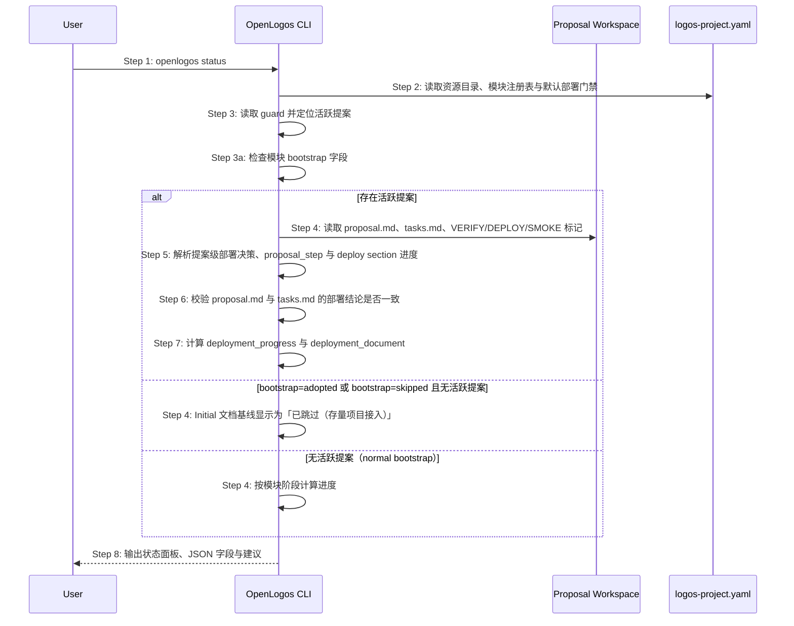

# S11: 查看阶段进度与活跃变更 — 时序图


```mermaid
sequenceDiagram
    participant U as User
    participant C as OpenLogos CLI
    participant P as Proposal Workspace
    participant Y as logos-project.yaml

    U->>C: Step 1: openlogos status
    C->>Y: Step 2: 读取资源目录、模块注册表与默认部署门禁
    C->>C: Step 3: 读取 guard 并定位活跃提案
    C->>C: Step 3a: 检查模块 bootstrap 字段
    alt 存在活跃提案
        C->>P: Step 4: 读取 proposal.md、tasks.md、VERIFY/DEPLOY/SMOKE 标记
        C->>C: Step 5: 解析提案级部署决策、proposal_step 与 deploy section 进度
        C->>C: Step 6: 校验 proposal.md 与 tasks.md 的部署结论是否一致
        C->>C: Step 7: 计算 deployment_progress 与 deployment_document
    else bootstrap=adopted 或 bootstrap=skipped 且无活跃提案
        C->>C: Step 4: Initial 文档基线显示为「已跳过（存量项目接入）」
    else 无活跃提案（normal bootstrap）
        C->>C: Step 4: 按模块阶段计算进度
    end
    C-->>U: Step 8: 输出状态面板、JSON 字段与建议
```

## 步骤说明
1. **用户**执行 `openlogos status`。
2. **CLI** 读取资源目录、模块和模块级部署门禁。
3. **CLI** 读取 guard 判断是否存在活跃提案；同时检查模块 `bootstrap` 字段。
4. **CLI** 在存在活跃提案时读取提案工作区；`bootstrap: adopted` 或历史 `bootstrap: skipped` 且无活跃提案时，Initial 文档基线显示为「已跳过（存量项目接入）」。**initial 模块的 phase 派生（per-module `phase_progress` 与顶层 `phases[]`）自 M1 切片 B1 起由 `cli/src/lib/flow-derive.ts` 基于内置（builtin）initial flow 派生**，取代原硬编码的 `PHASE_KEYS` / `PHASE_SUBPATHS` 数组；**本切片不应用项目 overlay**，输出与旧 `deriveModulePhaseProgress` / 顶层 `phases[]` 逐字节等价（1:1 不改行为）。**launched 模块活跃提案的 `proposal_step` 自 M1 切片 B2 起由 `flow-derive` 的 `detectProposalStepViaFlow` 基于内置 launched flow 派生（取代旧 `detectProposalStep` 调用点，输出逐态等价、1:1 不改行为）。**
5. **CLI** 优先使用提案级部署决策计算提案步骤；判断 `proposal.md` 是否仍为模板状态时，只能检查必需章节是否存在、通用模板字段是否仍未填写，以及 `## 部署影响` section 内结构化字段的字段值，不得因为正文其他章节合法出现 ``是 / 否`` 字面量而将 `proposal_step` 回退为 `writing`。部署影响布尔字段必须以字段值精确等于 `是` 或 `否` 作为有效决策；字段值为 `是 / 否` 时必须视为模板占位符，不得解析为 `true` 或 `false`。
6. **CLI** 校验 `proposal.md` 与 `tasks.md` 是否冲突。
7. **CLI** 生成 `deployment_progress` 与 `deployment_document`，其中任务文档入口必须指向 `tasks.md`。
8. **CLI** 输出状态面板；JSON 模式下输出部署决策字段与部署进度摘要，供 RunLogos 判断按钮。JSON 模式下 `data` 顶层携带 `contract: {"version": "1.0.0"}`，`modules[].active_change` 随步骤携带 `step_meta` 与 `facts`（详见「status 的契约自描述输出（contract / step_meta / facts）」）。

## initial phase 派生（flow-derive）与两套 legacy done 语义

initial 模块的 phase 进度由 `cli/src/lib/flow-derive.ts` 从 **builtin** initial flow 派生：

- **来源**：内置 initial flow 模型（`spec/flow/initial.yaml` 经 loader 加载），**不应用项目 overlay**。
  overlay 驱动 status 留作后续切片，本切片保持 1:1。
- **node-id → phase-key 映射**维护在 code 侧（`flow-derive.ts`），13 个节点 1:1 对应原 `PHASE_KEYS`，
  使 `spec/flow/*.yaml` 保持纯净。
- **`when` 求值**：`bootstrap != adopted` 跳过 prd/product-design/architecture（标
  `skip_reason: bootstrap-adopted`）；`api_enabled = !skip_phases.includes('api')`；
  `db_enabled = !skip_phases.includes('database')`；`scenario_enabled = !skip_phases.includes('scenario')`；
  `deployment_required = module.deployment_required !== false && !skip_phases.includes('deployment')`；
  `smoke_required = deployment_required && module.smoke_required !== false`（**未声明 smoke_required 视为 true**）。
- **fallback-skip 兼容**：对未声明 `skip_phases` 的老项目，派生结果与旧「已完成 phase 之前的空
  phase 自动标 skipped」兜底逻辑一致（`phase.3-3-deployment` / `phase.3-7-deploy` /
  `phase.3-8-smoke` 仍免于兜底跳过），current phase 不漂移。

引擎只产数据（node done/skipped 状态 + fan-out 覆盖数据 `{ total, covered, missing }`），
**done 判定规则由 status 消费端分别套用，二者均与现状 1:1，不可混淆**：

| 阶段类别 | 顶层 `phases[]` 的 done | per-module `phase_progress` 的 done |
|---|---|---|
| **场景阶段**（`phase.3-1` 场景时序 / `phase.3-4a` 测试用例） | 目录有任意文件即 done（**any-present**） | 当前模块场景**全覆盖**才 done（**all-present**），并产 `scenario_coverage: { total, covered, missing }` |
| **非场景阶段**（其余 11 个 phase） | 扫**整个目录**有任意文件即 done | 多模块时仅按 `{module}-` 前缀过滤后有任意文件即 done；单模块时目录任意文件即 done |

补充约束（均为 legacy 1:1 保留）：

- **场景文件匹配保留 legacy `includes()` 子串匹配**：对每个场景 `${module}-${scenario}` 作子串
  包含判定（`phase.3-4a` 还需含 `-test-cases` 子串），**不改用 flow-spec §141 的 glob 精确匹配**。
  glob 是未来的有意修正；本切片保留旧子串行为，并由用例锁定预期。子串匹配的潜在误命中风险随之保留
  （如非零填充或跨位数 ID `S1` 会子串命中 `S11` 的文件名；当前两位零填充方案 `S01`/`S11` 一般不触发，
  但旧语义如实保留，用例以"相邻 ID 不串台 + includes 行为不变"两个方向锁定）。
- **多模块全局 skip 交集**：顶层 `phases[]` 仅当所有 initial 模块都显式 skip 某 phase 时才将其标
  skipped（交集语义），与现状一致。
- **并跑断言仅测试期**：在测试套件对同一 fixture 同时跑新引擎与旧 `deriveModulePhaseProgress` /
  顶层 `phases[]` 并断言相等，**不进入生产 CLI 路径**，绝不让运行时断言导致 status 崩溃。

## launched proposal_step 派生来源（flow-derive）

launched 模块在存在活跃提案时，`active_change.proposal_step` 的判定来源自 M1 切片 B2 起改为
`cli/src/lib/flow-derive.ts` 的 `detectProposalStepViaFlow(proposalDir, moduleDefaults)`，
基于**内置（builtin）launched flow**（`spec/flow/launched.yaml`）派生：

- **来源**：内置 launched flow 模型（`spec/flow/launched.yaml` 经 loader 加载），**不应用项目
  overlay**；与 B1 的 initial 路径保持同一 1:1 方法论。
- **节点序列声明化**：propose → merge → implement → deliver → close 的节点顺序与
  `done_when` / `fail_when` 由 `launched.yaml` 提供；`detectProposalStepViaFlow` 据此判定
  `ProposalStep`，与旧 `detectProposalStep` 逐态等价。
- **marker 非对称优先级（引擎规则保留）**：`VERIFY_FAIL` 全局最先；`SMOKE_FAIL` / `SMOKE_PASS`
  仅在 `VERIFY_PASS` 成立、需部署、`DEPLOY_DONE` 存在且 deploy 任务全勾后的 deploy 子块内评估，
  否则仍停 `ready-to-deploy`。
- **提案级部署决策（引擎规则保留）**：deliver 的 `deployment_required` / `smoke_required` 与
  决策冲突阻塞继续由 `resolveProposalDeploymentDecision` 求解（提案级，不回退模块默认）；本节
  下方「deploy-done 对 status 的影响」与 EX-6.x 行为均不变。
- **section 完成语义按 legacy**：`section_complete:<tag>` = `total > 0 && checked === total`，
  present-but-empty 的 `[delta]`/`[code]` 不算完成。

为复用上述判定且不与 `status.ts` 形成运行时循环依赖，proposal-lifecycle 纯函数
（`resolveProposalDeploymentDecision` / `parseTaskSections` / `getDeploySectionSummary` /
`hasSmokeCasesForProposal` / `isProposalTemplateFilled` / `isTasksTemplateFilled` /
`countMergeableDeltaFiles` / `allTasksChecked` / `getDeployTasks` 及 `detectProposalStep` 本身）
下沉到 `cli/src/lib/proposal-lifecycle.ts`，`status.ts` 改为 import 并 re-export（对外接口不变）。
状态计算仍以 `detectProposalStep` 的语义为单一事实源；并跑等价由测试期「ViaFlow == 旧
`detectProposalStep`」断言锁定（见 `core-S09-test-cases`），**不进入生产 CLI 路径**。

## status 的契约自描述输出（contract / step_meta / facts）

本节按提案 contract-self-description（C1/C3/C5）定义 `status --format json` 的契约自描述能力：步骤语义与确定性事实由 CLI 权威输出，消费方（AI driver）的自读/私有解析降级为低版本 fallback。

### contract 版本握手

- status/next 的 `data` 顶层新增 `"contract": {"version": "1.0.0"}`（语义化契约版本，独立于 CLI 版本）。
- SemVer 规则：**major** = 必填字段删除/改义、闭合枚举语义变化（含移除值）、既有字段挂出判据变更；**minor** = 向后兼容扩展（新增可选字段、闭合枚举新增值）；**patch** = 不改形态与语义的澄清。
- 版本-schema 一一映射：`spec/schema/status.schema.json`、`spec/schema/next.schema.json`（内嵌契约版本号，随 npm prepack 打包）；响应 `contract.version` 与打包 schema 版本一致，CI 校验。
- 消费方约定（规范性引用，验收归 runlogos R5）：未知 major / 缺 `contract` 字段 → 保守模式（仅 next 驱动普通推进 + 看门狗，启发式判定降级为仅观察）；契约内任何枚举遇未知值 → 保守分支。
- envelope / contract / schema 的完整定义场景见 `core-S16-machine-json-output`。

### step_meta 与步骤注册表

- `modules[].active_change.step_meta = {"phase", "kind"}`；`phase ∈ pre-implement|implement|post-implement`；`kind ∈ produce|gate|command-required|residency`。
- 唯一铸造点 = `cli/src/lib/step-registry.ts`（收敛 `detectProposalStep` 与 `detectProposalStepViaFlow` 双镜像及 status/next 直接产字面量/覆盖点）；CI lint：字面量赋 proposal_step 不经注册表 → 测试失败。
- 「状态计算以 `detectProposalStep` 的语义为单一事实源」口径不变：注册表收敛的是 `proposal_step` 字面量的铸造点并统一附着 `step_meta`，不改变各步骤的判定语义。
- **不新增 proposal_step 枚举值**；`step_meta` 不构成第二枚举——phase/kind 为小闭合枚举，消费方遇未知值必须按保守分支处理。
- 全量注册表：

| proposal_step | phase | kind |
|---|---|---|
| writing | pre-implement | produce |
| ready-to-delta | pre-implement | gate |
| delta-writing | pre-implement | produce |
| ready-to-merge | pre-implement | gate |
| merge-generated | pre-implement | command-required |
| spec-complete-required | pre-implement | command-required |
| test-id-required | pre-implement | residency |
| ready-to-implement | pre-implement | residency |
| coding | implement | produce |
| ready-to-verify | implement | command-required |
| verify-failed | implement | residency |
| verify-passed | post-implement | residency |
| ready-to-deploy | post-implement | gate |
| deploy-done | post-implement | residency |
| ready-to-smoke | post-implement | command-required |
| smoke-passed | post-implement | residency |
| smoke-failed | post-implement | residency |
| implementing（旧兼容） | implement | produce |
| in-progress（旧兼容） | implement | produce |

### facts 权威事实块

- `modules[].active_change.facts = {"spec_complete", "slices_planned", "slices_approved", "code_required", "has_delta_tasks", "verify_pass"}`（全布尔，仅活跃提案时输出）。
- CLI 权威计算：spec_complete = SPEC_MERGED/MERGED 在场；slices_planned = tasks.md `[code]` 含真实脱占位条目；slices_approved = SLICES_APPROVED marker 在场；code_required / has_delta_tasks 沿现行判定；verify_pass = VERIFY_PASS marker。单一事实源在 CLI，driver 的自读/私有解析降级为低版本 fallback。
- `loop_state` 激活判据与 facts 同源（同一份计算，不允许两处实现），driver 可直接从 facts 读出「implement 是否已进入」；`loop_state` 挂出时机的定义见 `core-S27-loop-iterate`（本提案 C2）。

### active_change 扩展口径与主动破例声明

- `active_change` 新增 `step_meta` / `facts` 走 `spec/cli-json-output.md`「有活跃提案 golden 同步更新」既有可控扩展口径：仅有活跃提案的 golden 重拍，无活跃提案项目零漂移；不属硬红线，但按规范要求显式声明。
- **主动破例**：破「data 顶层逐字节不变（golden 零漂移）」——`data` 顶层新增 `contract` → 全部 9 个 golden 基线快照重拍（本提案唯一的全量 golden 重拍点，随大版本发布；见 `core-S16-machine-json-output`）。
- 验收边界：openlogos 本提案只验**生产者契约**（注册表/step_meta/schema 三方同步、facts 字段来源正确、contract 版本字段在场）；消费方保守模式 / 零误杀验收归 runlogos R5 提案。

### EX-8.1: 无活跃提案时 step_meta / facts 零漂移
- **触发条件**：模块无活跃提案（`active_change` 不出现 / 为 null）。
- **期望响应**：`step_meta` 与 `facts` 随整个 `active_change` 对象不出现（零漂移边界，与 `code_required` 同口径）；`data` 顶层 `contract` 仍然输出（contract 是 envelope 级契约，不依赖活跃提案存在）。
- **副作用**：无。

## 异常用例
### EX-2.1: 模块过滤不存在
- **触发条件**：用户传入不存在的 `--module`。
- **期望响应**：输出模块不存在错误。

### EX-3.2: bootstrap=adopted 或历史 skipped 时 Initial 文档基线显示为已跳过
- **触发条件**：模块 `bootstrap: adopted` 或历史 `bootstrap: skipped`，Initial 文档目录为空。
- **期望响应**：Initial 文档基线显示为「文档基线已跳过（存量项目接入）」，不显示为未完成或错误；整体状态不受缺失影响。
- **副作用**：无。

### EX-3.3: adopted 模块 status JSON 恒输出 baseline_seed_state（baseline-seed-legacy-default-unify）
- **触发条件**：任意 `bootstrap: adopted` 模块（explicit 显式值或 legacy 缺省皆可；含基线提交进行中的 `baseline_commit_in_progress` 降级情形）执行 `openlogos status --format json`。
- **期望响应**：`modules[].baseline_seed_state` **无条件输出**，取值为合法枚举 `required｜partial｜seeded`——explicit 优先；yaml 缺省时经共享 helper `effectiveBaselineSeedState` 派生（有候选+open run→`partial`、有候选无 open run→`seeded`、无候选→`required`，见 core-06 §4.1），**「缺省 → 字段缺失」路径与 `unknown` 第三态一并废除**；`baseline_commit_in_progress` 降级分支同样经派生兜底恒输出，不得回落到原始字段缺失。legacy 派生态（yaml 未落盘）时 suggestion 附「运行 `openlogos sync` 迁移元数据」提示，且该 sync 迁移对无字段模块真实落盘（不空转）。`status` 与 `next`、`baseline-seed status` 对同一模块的有效状态**逐字节一致**（三入口单一事实源）。非 adopted 模块行为不变。
- **副作用**：无状态修改；对下游为纯增量契约收紧（fail-closed 消费方判 `typeof === 'string'` 自然恢复渲染），不新增 `baseline_seed_state_source` 字段。

### EX-5.1: proposal 正文引用部署模板占位符
- **触发条件**：`proposal.md` 的 `## 部署影响` 字段已明确填写，但变更原因、变更概述或其他正文段落中引用 ``是 / 否`` 等模板占位符字面量。
- **期望响应**：CLI 不应将该提案视为未填写模板；当 `[delta]` 任务已全部完成且存在可合并 delta 文件时，`proposal_step` 应返回 `ready-to-merge`。
- **副作用**：无。

### EX-5.2: 部署影响字段值仍为模板占位符
- **触发条件**：`proposal.md` 的 `## 部署影响` section 中，`是否需要部署`、`是否涉及数据迁移`、`是否需要回滚预案` 或 `是否需要 smoke` 的字段值仍为 `是 / 否`。
- **期望响应**：CLI 应继续将 `proposal_step` 返回为 `writing`，提示用户完善 proposal。
- **副作用**：无。

### EX-5.3: 空提案模板部署占位符
- **触发条件**：新建提案尚未填写，`proposal.md` 的 `## 部署影响` section 仍包含 `是否需要部署：是 / 否` 和 `是否需要 smoke：是 / 否`。
- **期望响应**：CLI 应返回 `proposal_step=writing`，且不得设置 `deployment_decision_conflict=true`；不得因为模板占位符被解析为“需要部署”而提示 `[deploy]` section 缺失。
- **副作用**：无。

### EX-6.1: 提案级部署决策缺失
- **触发条件**：历史提案没有结构化 `## 部署影响`。
- **期望响应**：CLI 回退到 `[deploy]` section 和模块默认门禁，并在 JSON 中标注 `deployment_decision_source` 为兼容来源。

### EX-6.2: 部署决策冲突
- **触发条件**：`proposal.md` 声明无需部署但 `tasks.md` 存在 `[deploy]` section，或声明需要部署但缺少 `[deploy]` section。
- **期望响应**：CLI 输出冲突警告，JSON 中设置 `deployment_decision_conflict=true`，并阻止 deploy、smoke 或 archive 成为主动作。

### EX-6.3: 部署进度不可用
- **触发条件**：活跃提案需要部署，但 `tasks.md` 缺失或无法读取。
- **期望响应**：JSON 中 `deployment_progress.status` 返回 `unavailable`，并保留 `deployment_document.path` 以便诊断。

## deploy-done 对 status 的影响

`openlogos status` 在活跃提案中展示部署状态时必须遵守：

- `ready-to-deploy`：显示 `[deploy]` 进度，提示部署完成后执行 `openlogos deploy-done`。
- `deploy-done`：表示 `DEPLOY_DONE` 存在且 `[deploy]` 任务全勾，但提案无需 smoke。
- `ready-to-smoke`：表示 `DEPLOY_DONE` 存在且 `[deploy]` 任务全勾，且提案需要 smoke。
- `smoke-passed` / `smoke-failed`：只能由 `openlogos smoke` 写入的 marker 推进。

状态计算仍以 `detectProposalStep()` 为单一事实源。`deploy-done` 命令只是写入状态事实，不在 status 中临时推断部署完成。

JSON 输出中 `deployment_progress.status=done` 不等价于部署完成；只有同时存在 `DEPLOY_DONE` 才能离开 `ready-to-deploy`。

## plan gate 诊断状态与 tasks 执行进度分层

`openlogos status --format json` 在 launched 活跃提案下应提供面向 driver/UI 的 plan gate 诊断对象，用于消除 `ready-to-delta` 与任务执行进度之间的歧义。该对象可以挂载在 `modules[].active_change.plan_state`，legacy 单模块输出可回退到顶层 `plan_state`。

建议结构：

```json
{
  "plan_ready": true,
  "plan_gate_pending": true,
  "plan_approved": false,
  "tasks_template_filled": true,
  "tasks_execution_done": 0,
  "tasks_execution_total": 8,
  "tasks_execution_scope": "delta",
  "diagnostic": "proposal/tasks 已完成，等待 plan-exit 批准；checkbox 表示 delta 执行进度"
}
```

字段语义：

| 字段 | 类型 | 说明 |
|---|---|---|
| `plan_ready` | boolean | `proposal.md` 与 `tasks.md` 已脱模板，且 proposal/tasks 一致性检查未阻断 plan |
| `plan_gate_pending` | boolean | `proposal_step=ready-to-delta` 且 `PLAN_APPROVED` 不存在，当前停在 plan 出口门 |
| `plan_approved` | boolean | `PLAN_APPROVED` 存在，或已通过实际 delta 产出离开 plan gate |
| `tasks_template_filled` | boolean | `tasks.md` 已被结构化填写，不是 CLI 初始模板 |
| `tasks_execution_done` | number | 当前可执行 section 的已勾 checkbox 数 |
| `tasks_execution_total` | number | 当前可执行 section 的 checkbox 总数 |
| `tasks_execution_scope` | string | 当前统计口径，优先为 `"delta"`；无 `[delta]` 且有 `[deploy]` 时为 `"deploy"`；不可用时为 `"none"` |
| `diagnostic` | string | 可直接展示给 RunLogos / AI driver 的短诊断 |

派生规则：

- `proposal_step=writing` 时，`plan_ready=false`，`plan_gate_pending=false`；若 `tasks_template_filled=false`，可提示继续填写 tasks。
- `proposal_step=ready-to-delta` 时，若 proposal/tasks 已脱模板，必须输出 `plan_ready=true`、`plan_gate_pending=true`、`plan_approved=false`；`tasks_execution_done` 可以为 0，但不得影响 `plan_ready`。
- `PLAN_APPROVED` 存在或 `proposal_step=delta-writing` 时，`plan_gate_pending=false`、`plan_approved=true`。
- `deployment_decision_conflict=true` 时，`plan_ready=false`，诊断应优先说明 proposal/tasks 冲突。
- 文本输出可继续简洁展示，但 JSON 契约必须足以让 UI/driver 区分“待批准”“待执行”和“未规划”。

SessionStart hook 与 RunLogos 面板应优先消费结构化字段，不得通过中文 `suggestion` 或 checkbox 比例反推 plan 是否失败。

## SessionStart 消费 status 结构化状态

S11 的 `openlogos status --format json` 是 AI 宿主 SessionStart 阶段化范围注入的主要事实源。SessionStart hook 应读取以下字段：

- `data.lifecycle`：判断是否进入 launched / active 变更管理。
- `data.active_change`：定位当前活跃提案 slug。
- `data.proposal_step`：判断当前提案阶段。
- `data.modules[].active_change.slug` 与 `data.modules[].active_change.proposal_step`：多模块或顶层字段缺失时的模块级回退。
- `data.suggestion`：作为下一步人类可读提示的补充，不作为唯一状态源。

读取顺序：

1. 优先使用 `status --format json` 顶层字段。
2. 顶层字段缺失时，从 `modules[]` 中寻找 active_change 对象。
3. 结构化状态不可用时，才读取 `logos/.openlogos-guard` 的 `activeChange`。
4. guard 回退只用于识别活跃提案，不得推断当前 `proposal_step`；文案必须提示运行 `openlogos status` / `openlogos next` 确认阶段。

输出约束：

- `proposal_step=delta-writing` 时，SessionStart 文案必须与 `status` / `next` 的建议一致：写入 `deltas/**` 并更新 `tasks.md`。
- `proposal_step=ready-to-delta` 时，文案必须表达“方案待批准”，而不是要求继续填写 `proposal.md`。
- `proposal_step=ready-to-merge` 时，文案必须表达 merge 是人类确认点。
- 无 guard 时，仍维持 launched 项目修改源码前必须创建提案的阻断提示。

该能力不新增 `status` JSON 字段，只消费现有契约。

## automation_diagnostic 在 status 中的前沿边界

`openlogos status --format json` 负责展示当前活跃提案的真实前沿。对于 launched 活跃提案，status 不得把历史 verify 失败诊断挂载成会改变下一步动作的 repair/code 建议，除非当前提案已经进入实现/验证闭环。

### 状态派生要求

- `ready-to-delta`：展示 plan gate / `plan_state`，不得输出 `suggested_next_node:"code"` 的 `automation_diagnostic`。
- `delta-writing`：展示 delta 执行进度，允许宿主继续写 delta，不得被全量失败诊断改写为 repair。
- `ready-to-merge`：展示 merge 是确认点 / 可跳 spec gate，不得被 stale diagnostic 改写为 verify repair。
- `merge-generated`：展示 merge 已完成后的下一阶段，不消费历史 verify 失败。
- `ready-to-implement` 且 `[code]` 未规划：展示 `plan-slices` 前沿，不输出可驱动 repair/code 的诊断。
- `coding`、`ready-to-verify`、`verify-failed`：可输出实现/验证相关 `automation_diagnostic`，用于 driver 派发 repair/code。

### 消费方约束

SessionStart、RunLogos 面板和其它 status 消费方必须以结构化 `proposal_step` / `next_node` / gate 字段为准，不得仅因存在历史 `automation_diagnostic.reason=="global-verify-failed"` 就扩大当前写入范围或跳过当前 flow 前沿。
