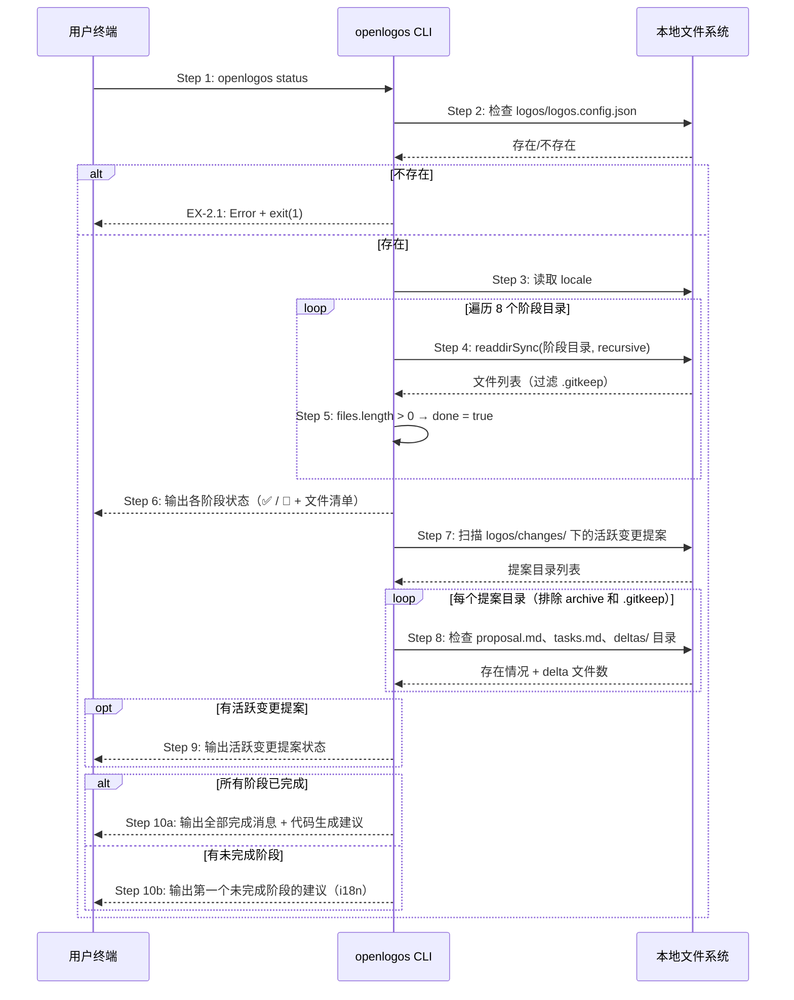

# S11: 查看项目进度 — 场景实现

> Phase 3 Step 1 · 场景建模

## 参与方

| 别名 | 组件 | 说明 |
|------|------|------|
| U | 用户终端 | 执行 CLI 命令的终端 |
| CLI | openlogos CLI | `cli/src/commands/status.ts` |
| FS | 本地文件系统 | 资源目录和变更提案目录 |

## 时序图

## 步骤说明

1. **开发者**在终端输入 `openlogos status`。
2. **CLI** 检查当前目录下 `logos/logos.config.json` 是否存在。如果不存在 → 见 EX-2.1。
3. **CLI** 从 `logos/logos.config.json` 中读取 `locale`，用于后续输出的语言切换。
4. **CLI** 依次遍历 8 个阶段目录，对每个目录调用 `readdirSync(dir, { recursive: true })` 获取文件列表：

| 序号 | 阶段键 | 扫描路径 |
|------|--------|---------|
| 0 | `phase.1` | `logos/resources/prd/1-product-requirements` |
| 1 | `phase.2` | `logos/resources/prd/2-product-design` |
| 2 | `phase.3-0` | `logos/resources/prd/3-technical-plan/1-architecture` |
| 3 | `phase.3-1` | `logos/resources/prd/3-technical-plan/2-scenario-implementation` |
| 4 | `phase.3-2-api` | `logos/resources/api` |
| 5 | `phase.3-2-db` | `logos/resources/database` |
| 6 | `phase.3-3a` | `logos/resources/test` |
| 7 | `phase.3-3b` | `logos/resources/scenario` |

5. **CLI** 对每个目录过滤掉 `.gitkeep` 文件后判断：如果剩余文件数 > 0 则该阶段标记为 `done = true`。
6. **CLI** 在终端输出所有 8 个阶段的状态列表，每行格式为 `✅ Phase X — 阶段名称`（已完成）或 `🔲 Phase X — 阶段名称`（未完成），已完成的阶段下方列出具体文件名。
7. **CLI** 扫描 `logos/changes/` 目录，获取所有子目录（排除 `archive` 和 `.gitkeep`）。
8. **CLI** 对每个活跃变更提案目录，检查 `proposal.md` 是否存在、`tasks.md` 是否存在、`deltas/` 下有多少文件。
9. 如果存在活跃变更提案，**CLI** 输出提案摘要（名称 + proposal/tasks 状态 + delta 文件数）。如果没有活跃提案则跳过。
10. **CLI** 检查是否所有 8 个阶段都已完成：如果全部完成，输出 🎉 恭喜信息和代码生成建议；如果有未完成阶段，找到第一个未完成的阶段，通过 `SUGGEST_KEYS` 映射输出对应的建议提示词（如 `→ 对 AI 说：「帮我写需求文档」`）。

> 这是一个简单的线性推进模型——始终建议"第一个未完成的阶段"，不处理跳步情况。

## 异常用例

### EX-2.1: 项目未初始化

- **触发条件**：Step 2 检测到 `logos/logos.config.json` 不存在
- **期望响应**：stderr 输出 `Error: logos/logos.config.json not found. Run 'openlogos init' first to initialize the project.`，exit(1)
- **副作用**：不输出任何状态信息
