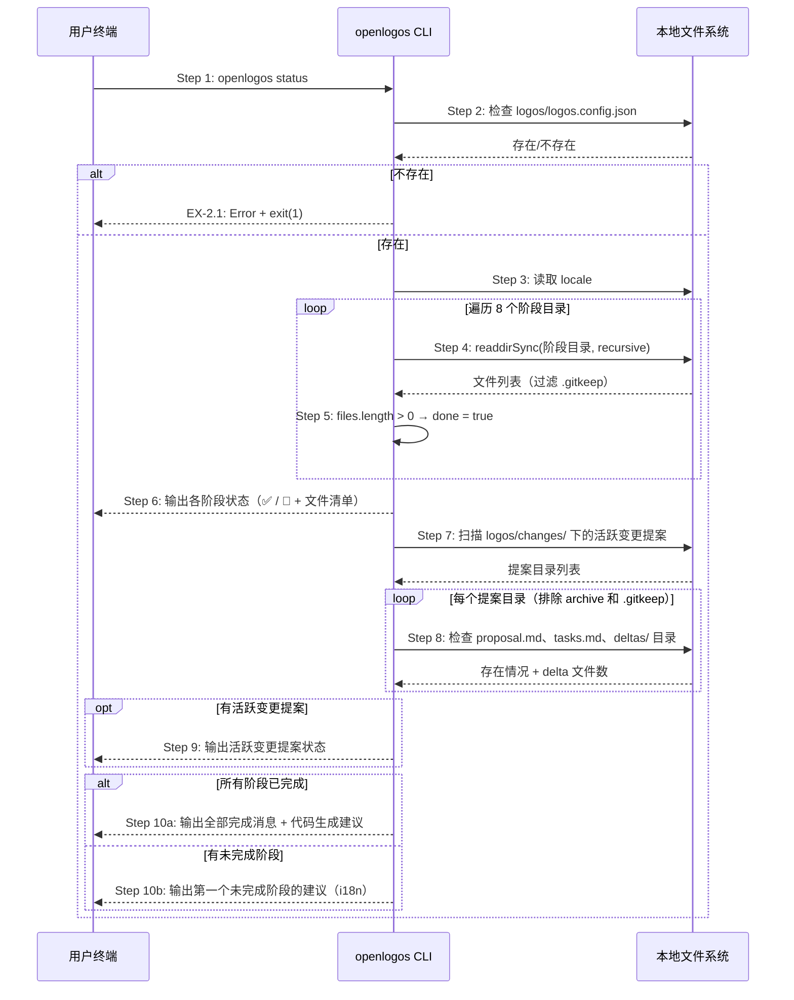
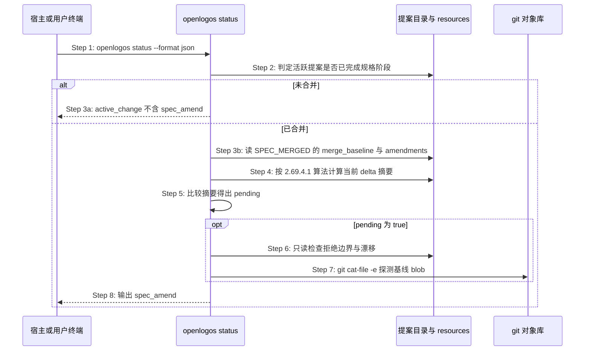

# S11: 查看项目进度 — 场景实现

> Phase 3 Step 1 · 场景建模

## 参与方

| 别名 | 组件 | 说明 |
|------|------|------|
| U | 用户终端 | 执行 CLI 命令的终端 |
| CLI | openlogos CLI | `cli/src/commands/status.ts` |
| FS | 本地文件系统 | 资源目录和变更提案目录 |

## 时序图

```mermaid
sequenceDiagram
    participant U as 用户终端
    participant CLI as openlogos CLI
    participant FS as 本地文件系统

    U->>CLI: Step 1: openlogos status
    CLI->>FS: Step 2: 检查 logos/logos.config.json
    FS-->>CLI: 存在/不存在

    alt 不存在
        CLI-->>U: EX-2.1: Error + exit(1)
    else 存在
        CLI->>FS: Step 3: 读取 locale

        loop 遍历 8 个阶段目录
            CLI->>FS: Step 4: readdirSync(阶段目录, recursive)
            FS-->>CLI: 文件列表（过滤 .gitkeep）
            CLI->>CLI: Step 5: files.length > 0 → done = true
        end

        CLI-->>U: Step 6: 输出各阶段状态（✅ / 🔲 + 文件清单）

        CLI->>FS: Step 7: 扫描 logos/changes/ 下的活跃变更提案
        FS-->>CLI: 提案目录列表

        loop 每个提案目录（排除 archive 和 .gitkeep）
            CLI->>FS: Step 8: 检查 proposal.md、tasks.md、deltas/ 目录
            FS-->>CLI: 存在情况 + delta 文件数
        end

        opt 有活跃变更提案
            CLI-->>U: Step 9: 输出活跃变更提案状态
        end

        alt 所有阶段已完成
            CLI-->>U: Step 10a: 输出全部完成消息 + 代码生成建议
        else 有未完成阶段
            CLI-->>U: Step 10b: 输出第一个未完成阶段的建议（i18n）
        end
    end
```

## 步骤说明

1. **开发者**在终端输入 `openlogos status`。
2. **CLI** 检查当前目录下 `logos/logos.config.json` 是否存在。如果不存在 → 见 EX-2.1。
3. **CLI** 从 `logos/logos.config.json` 中读取 `locale`，用于后续输出的语言切换。
4. **CLI** 依次遍历 8 个阶段目录，对每个目录调用 `readdirSync(dir, { recursive: true })` 获取文件列表：

| 序号 | 阶段键 | 扫描路径 |
|------|--------|---------|
| 0 | `phase.1` | `logos/resources/prd/1-product-requirements` |
| 1 | `phase.2` | `logos/resources/prd/2-product-design` |
| 2 | `phase.3-0` | `logos/resources/prd/3-technical-plan/1-architecture` |
| 3 | `phase.3-1` | `logos/resources/prd/3-technical-plan/2-scenario-implementation` |
| 4 | `phase.3-2-api` | `logos/resources/api` |
| 5 | `phase.3-2-db` | `logos/resources/database` |
| 6 | `phase.3-3a` | `logos/resources/test` |
| 7 | `phase.3-3b` | `logos/resources/scenario` |

5. **CLI** 对每个目录过滤掉 `.gitkeep` 文件后判断：如果剩余文件数 > 0 则该阶段标记为 `done = true`。
6. **CLI** 在终端输出所有 8 个阶段的状态列表，每行格式为 `✅ Phase X — 阶段名称`（已完成）或 `🔲 Phase X — 阶段名称`（未完成），已完成的阶段下方列出具体文件名。
7. **CLI** 扫描 `logos/changes/` 目录，获取所有子目录（排除 `archive` 和 `.gitkeep`）。
8. **CLI** 对每个活跃变更提案目录，检查 `proposal.md` 是否存在、`tasks.md` 是否存在、`deltas/` 下有多少文件。
9. 如果存在活跃变更提案，**CLI** 输出提案摘要（名称 + proposal/tasks 状态 + delta 文件数）。如果没有活跃提案则跳过。
10. **CLI** 检查是否所有 8 个阶段都已完成：如果全部完成，输出 🎉 恭喜信息和代码生成建议；如果有未完成阶段，找到第一个未完成的阶段，通过 `SUGGEST_KEYS` 映射输出对应的建议提示词（如 `→ 对 AI 说：「帮我写需求文档」`）。

> 这是一个简单的线性推进模型——始终建议"第一个未完成的阶段"，不处理跳步情况。

## 异常用例

### EX-2.1: 项目未初始化

- **触发条件**：Step 2 检测到 `logos/logos.config.json` 不存在
- **期望响应**：stderr 输出 `Error: logos/logos.config.json not found. Run 'openlogos init' first to initialize the project.`，exit(1)
- **副作用**：不输出任何状态信息

## S11 已合并提案的增量修正只读投影

> 来源变更：merge-amend-merged-change。功能规格 §2.69.4（增量修正、delta 摘要算法与拒绝边界）；JSON 契约见 `spec/cli-json-output.md`「modules[].active_change.spec_amend 增量修正只读投影」。

### 场景目标

宿主（如 runlogos driver）需要区分已合并提案的三种状态：修正入口可用、修正已完成（幂等）、修正待应用。`openlogos status --format json` 在已合并的活跃提案上投影只读对象 `spec_amend`，由 OpenLogos 计算 delta 摘要与受阻原因，宿主只消费，不再自行比较 delta 与主文档字节。

### 参与者

| 别名 | 组件 | 说明 |
|------|------|------|
| H | 宿主或用户终端 | 执行 `openlogos status --format json` 并读取 `spec_amend` |
| CLI | `openlogos status` | `cli/src/commands/status.ts`，复用 merge 的摘要算法与边界判定（只读形态） |
| FS | 提案目录与 `logos/resources/` | `SPEC_MERGED`、`deltas/`、已应用目标 |
| G | git 对象库 | 仅以 `git cat-file -e` 探测基线 blob 是否可读，不写入 |

### 前置条件

- 项目已初始化，模块 launched，存在活跃提案。
- 投影只在提案已完成规格阶段（`SPEC_MERGED` 或 legacy `MERGED` 在场）时挂载。

### 成功后置条件

- 已合并活跃提案的 `modules[].active_change.spec_amend` 正确反映摘要、待应用状态与受阻原因。
- status 执行前后，提案目录、`logos/resources/` 与 git 对象库字节零变化。

### 时序图

```mermaid
sequenceDiagram
    participant H as 宿主或用户终端
    participant CLI as openlogos status
    participant FS as 提案目录与 resources
    participant G as git 对象库

    H->>CLI: Step 1: openlogos status --format json
    CLI->>FS: Step 2: 判定活跃提案是否已完成规格阶段
    alt 未合并
        CLI-->>H: Step 3a: active_change 不含 spec_amend
    else 已合并
        CLI->>FS: Step 3b: 读 SPEC_MERGED 的 merge_baseline 与 amendments
        CLI->>FS: Step 4: 按 2.69.4.1 算法计算当前 delta 摘要
        CLI->>CLI: Step 5: 比较摘要得出 pending
        opt pending 为 true
            CLI->>FS: Step 6: 只读检查拒绝边界与漂移
            CLI->>G: Step 7: git cat-file -e 探测基线 blob
        end
        CLI-->>H: Step 8: 输出 spec_amend
    end
```

### 步骤说明

1. 宿主执行 `openlogos status --format json`。
2. CLI 以既有 `hasSpecCompleteMarker` 判定活跃提案是否已完成规格阶段。
3. 未合并时 `active_change` 不出现 `spec_amend`（Step 3a）；已合并时读取 `SPEC_MERGED` 的 `merge_baseline` 与 `amendments`（Step 3b）。
4. CLI 用与 merge 同一实现的摘要算法计算当前 delta 摘要 `current_delta_digest`。
5. 有 `merge_baseline` 时 `merged_delta_digest` 取其 `delta_digest`，`pending = (current ≠ merged)`；无基线时 `merged_delta_digest = null`、`pending = null`。
6. `pending == true` 时，按 merge 同一顺序（① → ④ → ⑤ → ③ → ②）只读检查拒绝边界：目标集分类、原型资产变化、已应用目标当前 sha256 与 `after_sha256`。
7. 对需读回基线的首次 MODIFY 目标，仅以 `git cat-file -e` 探测 blob 是否存在（不读内容、不写对象），探测不到即 `baseline-unreadable`；sha256 复核留给 merge 执行时完成。
8. 输出 `spec_amend { merged_delta_digest, current_delta_digest, pending, blocked_reason, amend_count }`；`pending != true` 时 `blocked_reason` 为 null，无基线时为 `baseline-missing`。

### 异常与边界

#### EX-11.16：未合并提案不挂投影
- **触发条件**：活跃提案 `SPEC_MERGED` 与 legacy `MERGED` 均不在场。
- **期望响应**：`active_change` 不含 `spec_amend` 键；其余字段与修改前逐字一致。
- **副作用**：无。

#### EX-11.17：旧标记或标记不可解析
- **触发条件**：`SPEC_MERGED` 无 `merge_baseline`、为 legacy `MERGED`，或内容不是合法 JSON。
- **期望响应**：`merged_delta_digest: null`、`pending: null`、`blocked_reason: "baseline-missing"`、`amend_count: 0`；`current_delta_digest` 照常计算。宿主不得把 `pending: null` 当作 false，也不得自行比较字节。status 不因此失败。
- **副作用**：无。

#### EX-11.18：修正待应用但受阻
- **触发条件**：`pending == true`，且命中首次 CREATE 目标撤回、原型资产变化、主文档漂移或基线 blob 不可探测之一。
- **期望响应**：`blocked_reason` 依次取 `create-withdraw` / `prototype-changed` / `drift` / `baseline-unreadable` 中按检查顺序首个命中者，与随后执行 merge 时的错误码一一对应。
- **副作用**：无。

#### EX-11.19：只读不变量
- **触发条件**：任意已合并提案上执行 status（含 `pending == true`）。
- **期望响应**：不写任何文件、不写 git 对象（只用 `git cat-file -e`）、不清除或生成任何标记；非 git 仓库时探测视为不可读。
- **副作用**：无。

#### EX-11.20：修正后归位
- **触发条件**：增量修正成功后再次执行 status。
- **期望响应**：`pending: false`、两摘要相等、`blocked_reason: null`、`amend_count` 等于 `amendments` 长度。
- **副作用**：无。

### 追溯

- 需求：merge 直接合并与规格结构检查要求 › 验收条件 › S09 宿主可读的增量修正事实。
- 功能规格：§2.69.4.1（摘要算法）、§2.69.4.6（拒绝边界与 `blocked_reason`）。
- 场景关联：S09「S09 已合并提案的增量修正时序」。
- 测试：UT-S11-91～UT-S11-95、ST-S11-50～ST-S11-51。
