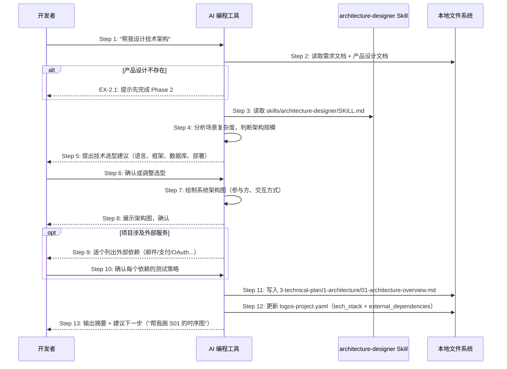
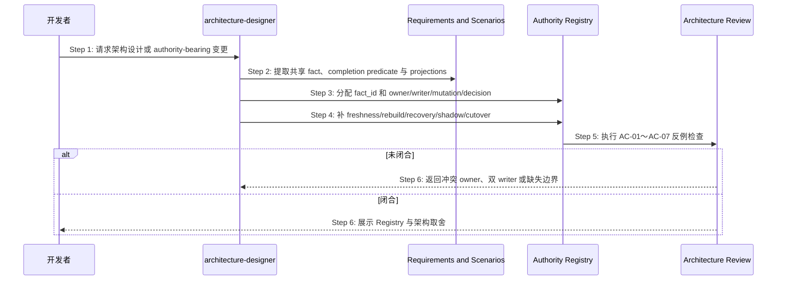

# S12: AI 辅助技术架构设计 — 场景实现

> Phase 3 Step 1 · 场景建模

## 参与方

| 别名 | 组件 | 说明 |
|------|------|------|
| U | 开发者 | 在 AI 编程工具中输入自然语言 |
| AI | AI 编程工具 | Cursor / Claude Code / OpenCode |
| SK | architecture-designer Skill | `skills/architecture-designer/SKILL.md` |
| FS | 本地文件系统 | 资源目录 + `logos-project.yaml` |

## 时序图

## 步骤说明

1. **开发者**在 AI 编程工具中输入「帮我设计技术架构」。
2. **AI 编程工具**读取需求文档（获取场景列表和技术约束）和产品设计文档（获取信息架构和交互设计）。如果产品设计不存在 → 见 EX-2.1。
3. **AI 编程工具**读取 `skills/architecture-designer/SKILL.md`，获取架构设计的执行步骤和输出规范。
4. **AI 编程工具**分析场景复杂度（场景数量、是否涉及外部服务、是否需要数据库），判断架构文档的详略程度。

> 简单项目（CLI 工具、个人 SaaS）一段文字 + 简图即可；中等项目需要完整架构图 + 组件说明；复杂项目需要架构决策记录（ADR）。

5. **AI 编程工具**向开发者提出技术选型建议：编程语言、Web 框架、数据库、部署方案。
6. **开发者**确认或调整技术选型。
7. **AI 编程工具**基于确认的选型绘制系统架构图，明确参与方（前端、后端、数据库、外部服务）和交互方式（HTTP、WebSocket、MQ...）。
8. **AI 编程工具**向开发者展示架构图，请求确认。
9. 如果项目涉及外部服务（邮件、支付、OAuth 等），**AI 编程工具**逐个列出外部依赖清单，并为每个依赖建议测试策略（`test-api` / `fixed-value` / `env-disable` / `mock-callback` / `mock-service`）。如果不涉及外部服务则跳过 Step 9~10。
10. **开发者**逐个确认或调整每个外部依赖的测试策略。
11. **AI 编程工具**将完整的架构概要写入 `logos/resources/prd/3-technical-plan/1-architecture/01-architecture-overview.md`，包含系统架构图、技术选型清单、部署拓扑、非功能性约束。
12. **AI 编程工具**更新 `logos/logos-project.yaml`：将确认的技术选型写入 `tech_stack` 字段，将外部依赖（如有）写入 `external_dependencies` 字段。

> 此步骤是架构设计的重要副作用——`logos-project.yaml` 从此成为后续所有阶段的技术参考来源。

13. **AI 编程工具**输出架构摘要（技术栈一览、外部依赖数量），并建议下一步操作：「帮我画 S01 的时序图」。

## 异常用例

### EX-2.1: 缺少产品设计

- **触发条件**：Step 2 检测到 `logos/resources/prd/2-product-design/` 为空
- **期望响应**：AI 提示「未找到产品设计文档，请先完成 Phase 2」
- **副作用**：不生成架构文档，不更新 `logos-project.yaml`

## S12 Authority Registry 架构设计扩展

### 场景目标

architecture-designer 在技术选型之前盘点共享业务事实与完成谓词，为每个适用 fact 建立唯一 Authority Registry row，作为后续场景、部署、测试和审查的实例源。

### 时序图

### 产出规则

1. `fact_id` 以业务语义命名，不绑定文件、表或类。
2. 每行恰有一个 authority owner、canonical state、sole writer 与 mutation entry。
3. 每个 projection 声明 consumer、freshness proof、rebuild rule、`writable:false`。
4. 恢复来源必须是 authority/receipt；列出明确 forbidden shadow sources。
5. ownership 变化必须有有限 cutover exit 和 rollback boundary。
6. 找不到唯一答案时记录未决并停止交付，不以“双方保持同步”代替设计。

### 异常与边界

- **EX-AR-1 共同 owner**：两个组件均可直接裁决；拆分 fact 或选择唯一 owner。
- **EX-AR-2 无 freshness**：投影只能作为 advisory 或移除，不能参与业务决定。
- **EX-AR-3 无法关闭旧 writer**：cutover 未闭合，禁止进入部署设计。

### 追溯

- 规范：`spec/authority-closure.md` §5、AC-01～AC-07。
- 测试：UT-S12-01～UT-S12-06、ST-S12-01。
