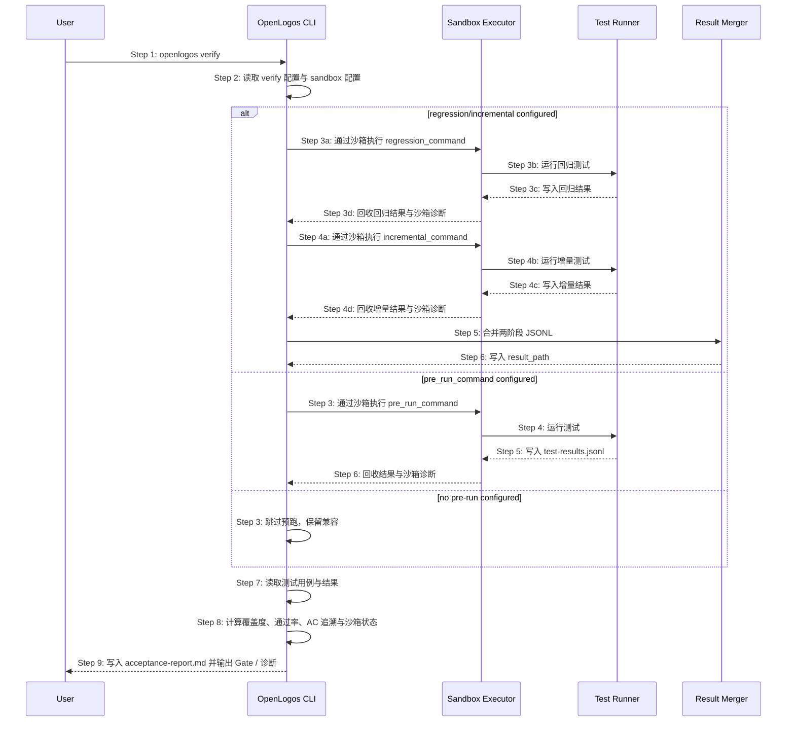

# S13: 运行测试验收并生成报告 — 时序图

## 步骤说明
1. **用户**执行 `openlogos verify`。
2. **CLI** 读取 `logos.config.json` 的 `verify` 配置，包括预跑命令、结果路径与 `sandbox_mode`。
3. **CLI** 若检测到 `regression_command` 或 `incremental_command`，进入两阶段模型；若仅检测到 `pre_run_command`，走旧兼容路径；若都不存在，直接读取现有结果。
4. **Sandbox Executor** 根据 `sandbox_mode` 决定是否隔离执行：
   - `off`：保持历史行为。
   - `auto`：优先沙箱执行，无法隔离时降级并告警。
   - `always`：无法隔离或检测到非白名单写入时失败。
5. **测试运行器**写入阶段结果。阶段结果路径可由 `regression_result_path` / `incremental_result_path` 指定。
6. **Sandbox Executor** 只回收配置声明的结果文件，并返回沙箱诊断。
7. **结果合并器**将回归与增量结果合并到 `result_path`。同一用例 ID 多次出现时，最后一次结果生效。
8. **CLI** 读取测试规格和合并后的结果。
9. **CLI** 计算验收指标，输出 PASS/FAIL，并在覆盖不足、预跑失败或沙箱失败时输出诊断。

## 异常用例
### EX-4.1: 缺少测试结果
- **触发条件**：结果文件不存在。
- **期望响应**：输出错误并退出。

### EX-2.1: 两阶段与 pre_run_command 同时配置
- **触发条件**：`verify.pre_run_command` 与 `verify.regression_command` / `verify.incremental_command` 同时存在。
- **期望响应**：优先执行两阶段模型；在文本和 JSON 输出中标记 `pre_run_command` 被兼容保留但未执行。

### EX-5.1: 第二阶段清空第一阶段结果
- **触发条件**：增量测试 reporter 清空默认 `result_path`。
- **期望响应**：CLI 通过阶段化结果路径、临时快照或等价机制保留回归阶段结果，并在合并后写入最终 `result_path`。

### EX-3.1: sandbox always 无法隔离
- **触发条件**：`verify.sandbox_mode=always`，但当前环境无法创建沙箱。
- **期望响应**：verify FAIL，输出沙箱根目录、失败原因和修复建议；不得继续读取旧结果伪装通过。

### EX-3.2: 预跑命令写入仓库非白名单路径
- **触发条件**：`verify.sandbox_deny_workspace_write=true`，预跑命令写入仓库根目录中的非白名单路径。
- **期望响应**：`always` 模式下 verify FAIL；`auto` 模式下若无法阻断写入必须输出 `sandbox.status=warn`，并给出改用 `always` 的建议。

### EX-8.1: 覆盖不足且无预跑配置
- **触发条件**：未配置任何预跑命令，且存在未覆盖用例。
- **期望响应**：verify FAIL，输出覆盖不足列表，同时提示可能只运行了局部测试，并建议配置 `verify.pre_run_command`、`verify.regression_command` 或启用 verify 沙箱以隔离完整测试执行。
