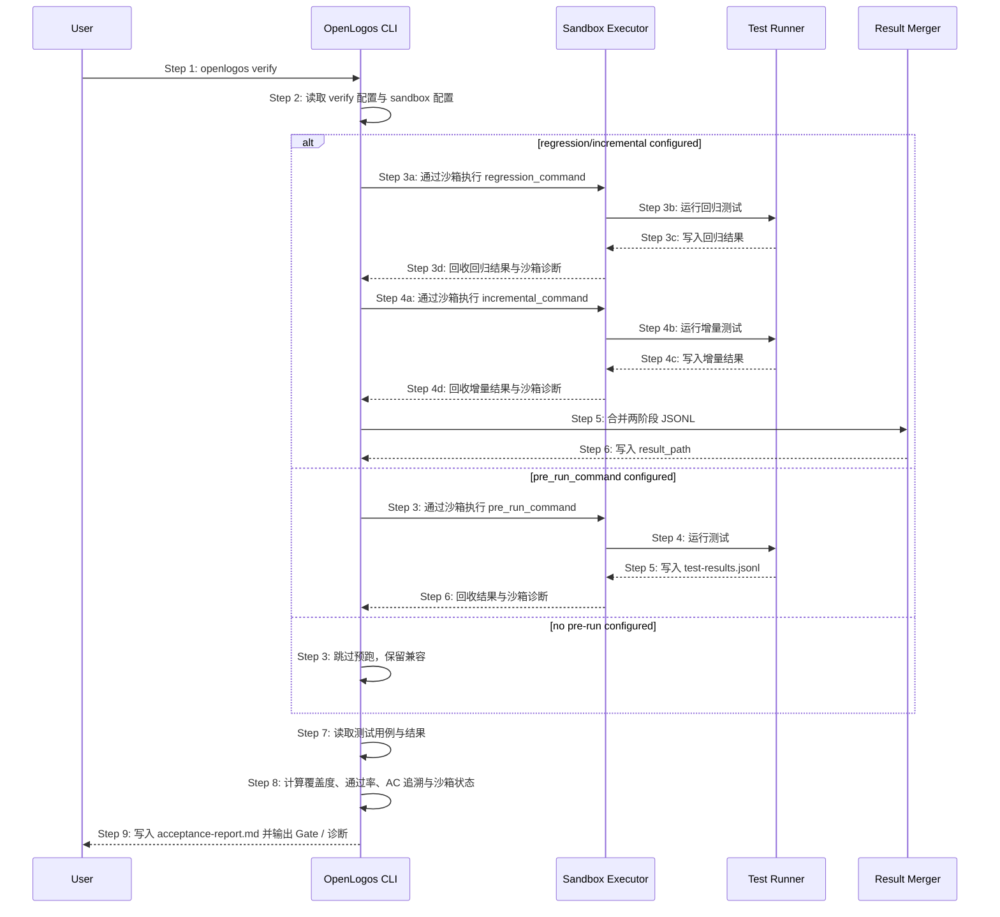
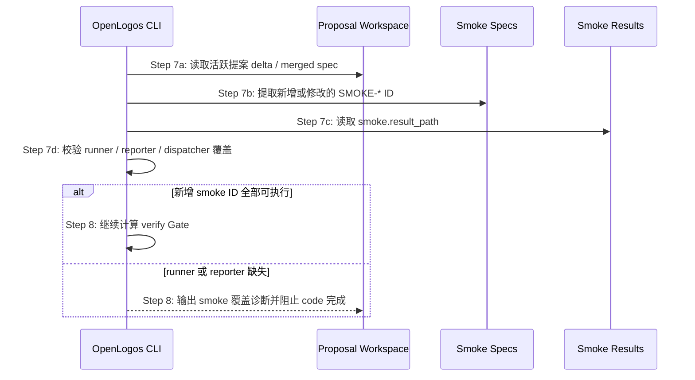
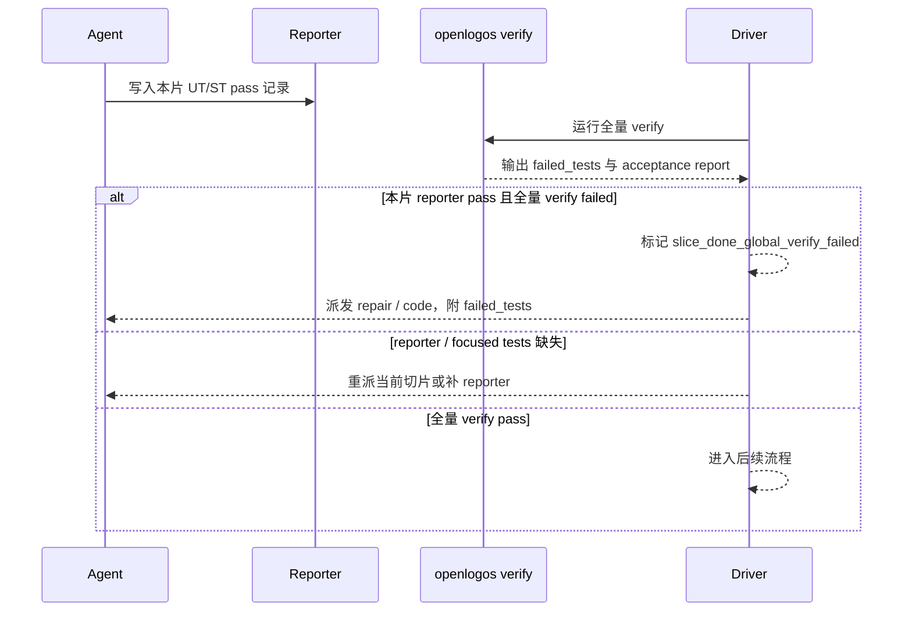

# S13: 运行测试验收并生成报告 — 时序图

```mermaid
sequenceDiagram
    participant U as User
    participant C as OpenLogos CLI
    participant X as Sandbox Executor
    participant T as Test Runner
    participant R as Result Merger

    U->>C: Step 1: openlogos verify
    C->>C: Step 2: 读取 verify 配置与 sandbox 配置
    alt regression/incremental configured
        C->>X: Step 3a: 通过沙箱执行 regression_command
        X->>T: Step 3b: 运行回归测试
        T-->>X: Step 3c: 写入回归结果
        X-->>C: Step 3d: 回收回归结果与沙箱诊断
        C->>X: Step 4a: 通过沙箱执行 incremental_command
        X->>T: Step 4b: 运行增量测试
        T-->>X: Step 4c: 写入增量结果
        X-->>C: Step 4d: 回收增量结果与沙箱诊断
        C->>R: Step 5: 合并两阶段 JSONL
        R-->>C: Step 6: 写入 result_path
    else pre_run_command configured
        C->>X: Step 3: 通过沙箱执行 pre_run_command
        X->>T: Step 4: 运行测试
        T-->>X: Step 5: 写入 test-results.jsonl
        X-->>C: Step 6: 回收结果与沙箱诊断
    else no pre-run configured
        C->>C: Step 3: 跳过预跑，保留兼容
    end
    C->>C: Step 7: 读取测试用例与结果
    C->>C: Step 8: 计算覆盖度、通过率、AC 追溯与沙箱状态
    C-->>U: Step 9: 写入 acceptance-report.md 并输出 Gate / 诊断
```

## 步骤说明
1. **用户**执行 `openlogos verify`。
2. **CLI** 读取 `logos.config.json` 的 `verify` 配置，包括预跑命令、结果路径与 `sandbox_mode`。
3. **CLI** 若检测到 `regression_command` 或 `incremental_command`，进入两阶段模型；若仅检测到 `pre_run_command`，走旧兼容路径；若都不存在，直接读取现有结果。
4. **Sandbox Executor** 根据 `sandbox_mode` 决定是否隔离执行：
   - `off`：保持历史行为。
   - `auto`：优先沙箱执行，无法隔离时降级并告警。
   - `always`：无法隔离或检测到非白名单写入时失败。
5. **测试运行器**写入阶段结果。阶段结果路径可由 `regression_result_path` / `incremental_result_path` 指定。
6. **Sandbox Executor** 只回收配置声明的结果文件，并返回沙箱诊断。
7. **结果合并器**将回归与增量结果合并到 `result_path`。同一用例 ID 多次出现时，最后一次结果生效。
8. **CLI** 读取测试规格和合并后的结果。
9. **CLI** 计算验收指标，输出 PASS/FAIL，并在覆盖不足、预跑失败或沙箱失败时输出诊断。

## 异常用例
### EX-4.1: 缺少测试结果
- **触发条件**：结果文件不存在。
- **期望响应**：输出错误并退出。

### EX-2.1: 两阶段与 pre_run_command 同时配置
- **触发条件**：`verify.pre_run_command` 与 `verify.regression_command` / `verify.incremental_command` 同时存在。
- **期望响应**：优先执行两阶段模型；在文本和 JSON 输出中标记 `pre_run_command` 被兼容保留但未执行。

### EX-5.1: 第二阶段清空第一阶段结果
- **触发条件**：增量测试 reporter 清空默认 `result_path`。
- **期望响应**：CLI 通过阶段化结果路径、临时快照或等价机制保留回归阶段结果，并在合并后写入最终 `result_path`。

### EX-3.1: sandbox always 无法隔离
- **触发条件**：`verify.sandbox_mode=always`，但当前环境无法创建沙箱。
- **期望响应**：verify FAIL，输出沙箱根目录、失败原因和修复建议；不得继续读取旧结果伪装通过。

### EX-3.2: 预跑命令写入仓库非白名单路径
- **触发条件**：`verify.sandbox_deny_workspace_write=true`，预跑命令写入仓库根目录中的非白名单路径。
- **期望响应**：`always` 模式下 verify FAIL；`auto` 模式下若无法阻断写入必须输出 `sandbox.status=warn`，并给出改用 `always` 的建议。

### EX-8.1: 覆盖不足且无预跑配置
- **触发条件**：未配置任何预跑命令，且存在未覆盖用例。
- **期望响应**：verify FAIL，输出覆盖不足列表，同时提示可能只运行了局部测试，并建议配置 `verify.pre_run_command`、`verify.regression_command` 或启用 verify 沙箱以隔离完整测试执行。

## smoke 覆盖预检步骤

在 Step 7 读取测试用例与结果之后、Step 8 计算验收指标之前，`openlogos verify` 或 code completion gate 应增加 smoke 覆盖预检：

```mermaid
sequenceDiagram
    participant C as OpenLogos CLI
    participant P as Proposal Workspace
    participant S as Smoke Specs
    participant R as Smoke Results

    C->>P: Step 7a: 读取活跃提案 delta / merged spec
    C->>S: Step 7b: 提取新增或修改的 SMOKE-* ID
    C->>R: Step 7c: 读取 smoke.result_path
    C->>C: Step 7d: 校验 runner / reporter / dispatcher 覆盖
    alt 新增 smoke ID 全部可执行
        C->>C: Step 8: 继续计算 verify Gate
    else runner 或 reporter 缺失
        C-->>P: Step 8: 输出 smoke 覆盖诊断并阻止 code 完成
    end
```

### 规则
1. 预检只针对当前提案新增或修改的 smoke 用例；历史未执行 smoke 用例仍由部署后 `openlogos smoke` 统一判定。
2. 新增 smoke 用例 ID 来自 `logos/changes/<slug>/deltas/test/smoke/*.md`，merge 后也可从 `logos/resources/test/smoke/*.md` 与变更范围推导。
3. 若新增 `SMOKE-*` ID 没有对应执行结果，且无法发现 runner/dispatcher 接入证据，预检必须返回失败诊断。
4. 预检不得伪造 `SMOKE_PASS` / `SMOKE_FAIL`，不得替代部署后 `openlogos smoke`。

### 诊断
- `smoke_runner_missing`：找不到当前提案新增 smoke 用例对应 runner 或 dispatcher 注册。
- `smoke_reporter_missing`：runner 存在但没有写入 `smoke.result_path`。
- `smoke_cases_uncovered`：结果文件存在但缺少新增 `SMOKE-*` ID。

## verify 结果与 reporter 证据分层

### 目标

`openlogos verify` 的结果必须支持自动 driver 区分局部切片证据与全量回归结论。focused tests / reporter pass 证明某个切片的指定测试已执行通过；acceptance report 的全量失败证明仍需要 repair。二者不是互斥关系。

### 时序补充

```mermaid
sequenceDiagram
    participant A as Agent
    participant R as Reporter
    participant V as openlogos verify
    participant D as Driver

    A->>R: 写入本片 UT/ST pass 记录
    D->>V: 运行全量 verify
    V-->>D: 输出 failed_tests 与 acceptance report
    alt 本片 reporter pass 且全量 verify failed
        D-->>D: 标记 slice_done_global_verify_failed
        D-->>A: 派发 repair / code，附 failed_tests
    else reporter / focused tests 缺失
        D-->>A: 重派当前切片或补 reporter
    else 全量 verify pass
        D-->>D: 进入后续流程
    end
```

### 规则

- `test-results.jsonl` 中存在本片要求的 test ID 且均 pass 时，可作为本片 focused tests 通过证据。
- acceptance report 中存在失败用例时，应输出 `global-verify-failed` 与失败用例列表。
- 本片 focused tests pass + global verify failed 时，不得输出 `claimed-done-but-unverified`。
- verify JSON / report 应为 driver 暴露足够字段，避免 driver 解析自然语言报告。

### 异常路径

- reporter 缺失对应 test ID：输出 `reporter-missing` 或 `focused-tests-missing`。
- acceptance report 失败但没有失败测试列表：输出 `global-verify-failed` 并附 `driver-cannot-validate-artifacts` 或等价诊断，提示补充结构化失败证据。

## verify 诊断与后续前沿传播边界

`openlogos verify --format json` 可以在本次验收失败时输出 `automation_diagnostic`，包括 `global-verify-failed`、失败测试列表、缺失 reporter、缺失 focused tests 等结构化原因。该诊断用于解释 verify 结果，并为实现/验证闭环中的 repair 提供输入。

verify 诊断不得无条件传播到后续 `status` / `next` 的所有前沿。传播规则如下：

1. 若当前活跃提案仍处于 plan/spec/merge/slice 未完成前沿，历史 verify 诊断只能作为只读背景信息或被省略，不得覆盖当前前沿。
2. 若当前活跃提案处于 `coding`、`ready-to-verify` 或 `verify-failed`，且存在本轮切片 artifacts、reporter 与 focused tests 证据，`global-verify-failed` 可以驱动 repair/code。
3. 若失败证据属于上一提案、上一轮已离开的 flow 阶段或过期 acceptance report，`status` / `next` 不得把它提升为当前提案的 `suggested_next_node:"code"`。

该边界不削弱 verify 本身的诊断能力；它只限制诊断在非当前前沿中的跨阶段抢占。
