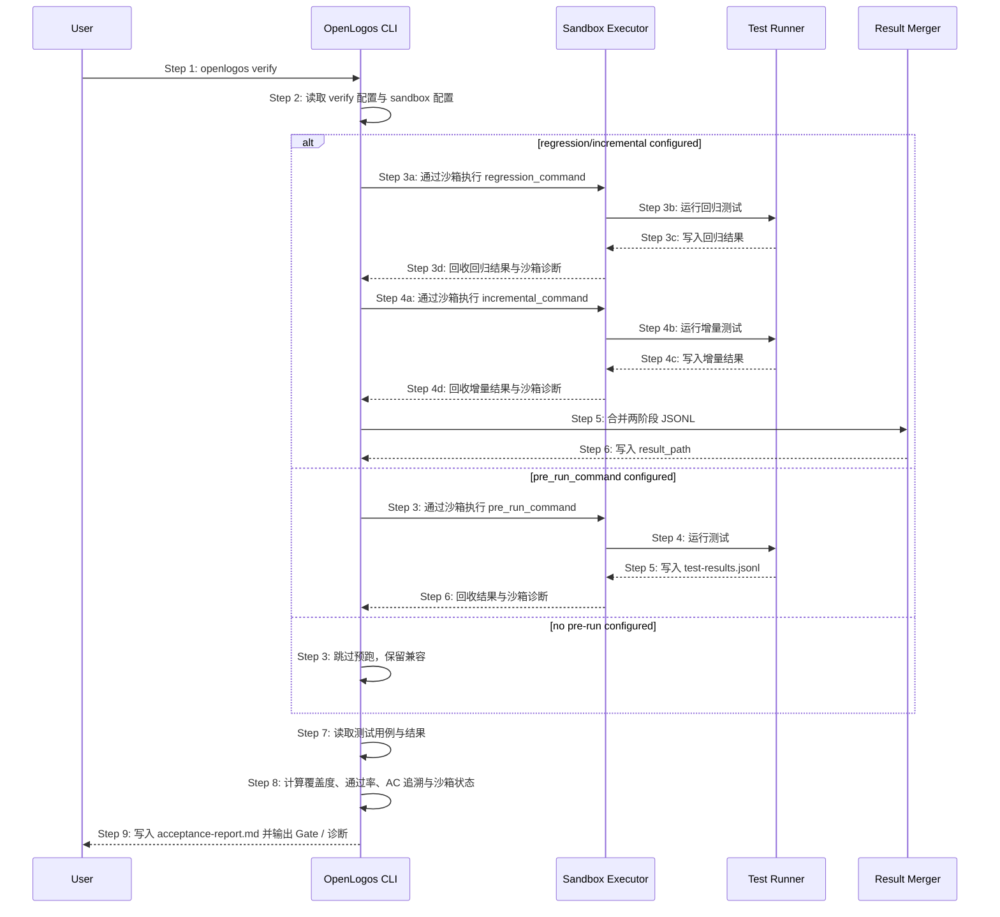
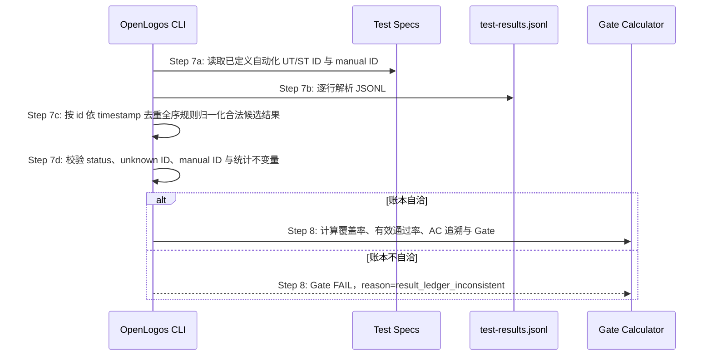
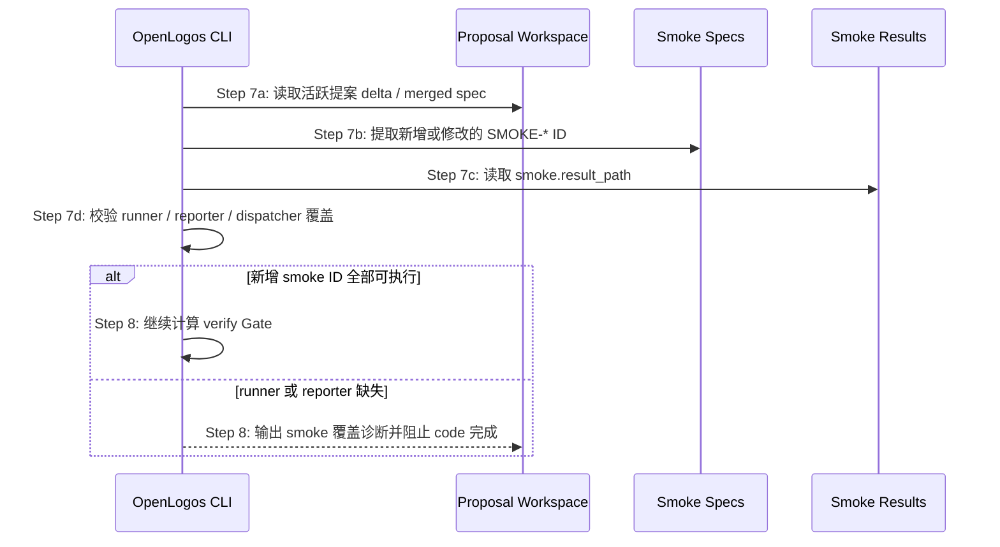
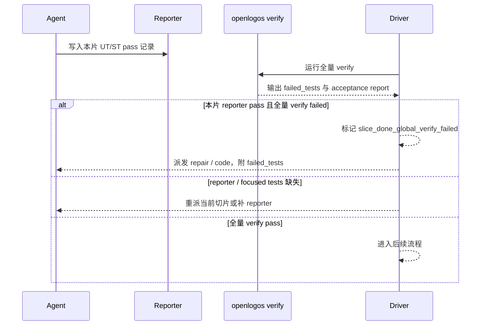
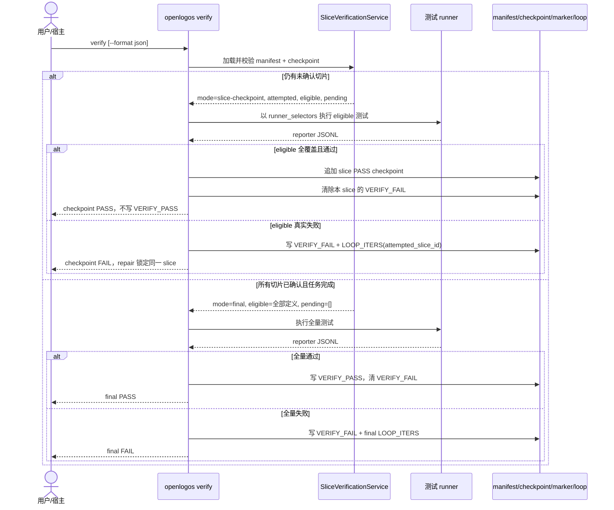
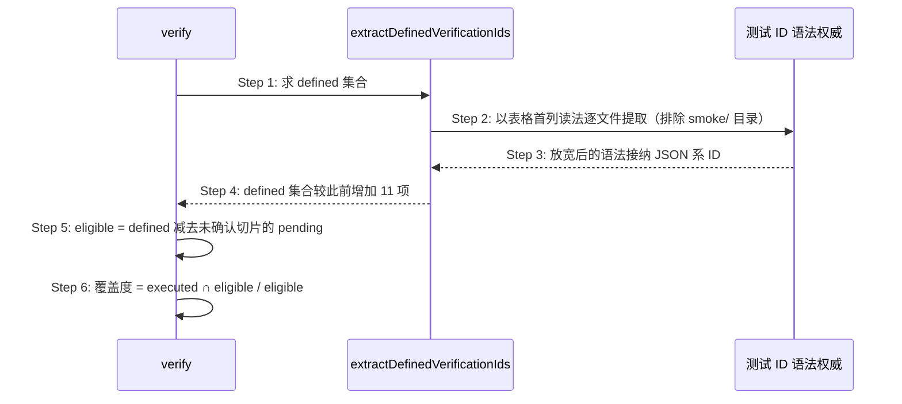

# S13: 运行测试验收并生成报告 — 时序图

```mermaid
sequenceDiagram
    participant U as User
    participant C as OpenLogos CLI
    participant X as Sandbox Executor
    participant T as Test Runner
    participant R as Result Merger

    U->>C: Step 1: openlogos verify
    C->>C: Step 2: 读取 verify 配置与 sandbox 配置
    alt regression/incremental configured
        C->>X: Step 3a: 通过沙箱执行 regression_command
        X->>T: Step 3b: 运行回归测试
        T-->>X: Step 3c: 写入回归结果
        X-->>C: Step 3d: 回收回归结果与沙箱诊断
        C->>X: Step 4a: 通过沙箱执行 incremental_command
        X->>T: Step 4b: 运行增量测试
        T-->>X: Step 4c: 写入增量结果
        X-->>C: Step 4d: 回收增量结果与沙箱诊断
        C->>R: Step 5: 合并两阶段 JSONL
        R-->>C: Step 6: 写入 result_path
    else pre_run_command configured
        C->>X: Step 3: 通过沙箱执行 pre_run_command
        X->>T: Step 4: 运行测试
        T-->>X: Step 5: 写入 test-results.jsonl
        X-->>C: Step 6: 回收结果与沙箱诊断
    else no pre-run configured
        C->>C: Step 3: 跳过预跑，保留兼容
    end
    C->>C: Step 7: 读取测试用例与结果
    C->>C: Step 8: 计算覆盖度、通过率、AC 追溯与沙箱状态
    C-->>U: Step 9: 写入 acceptance-report.md 并输出 Gate / 诊断
```

## 步骤说明
1. **用户**执行 `openlogos verify`。
2. **CLI** 读取 `logos.config.json` 的 `verify` 配置，包括预跑命令、结果路径与 `sandbox_mode`。
3. **CLI** 若检测到 `regression_command` 或 `incremental_command`，进入两阶段模型；若仅检测到 `pre_run_command`，走旧兼容路径；若都不存在，直接读取现有结果。
4. **Sandbox Executor** 根据 `sandbox_mode` 决定是否隔离执行：
   - `off`：保持历史行为。
   - `auto`：优先沙箱执行，无法隔离时降级并告警。
   - `always`：无法隔离或检测到非白名单写入时失败。
   - 复制 workspace 时保持 symlink 原始目标字面量，复制后执行 realpath containment 校验，存在逃逸链接按「无法隔离」处理；命令执行期间以 OS 级写保护（如 macOS `sandbox-exec` 拒写原 workspace 子树 / Linux mount namespace 只读绑定）保证运行期新建或改写的 symlink 也无法写入原 workspace，写保护不可用时按能力分层处理（见 EX-3.4 与功能规格 §2.9 symlink 隔离与运行期写保护不变量）。
   - 写入审计豁免沙箱内一次性依赖目录：规范化并统一分隔符后，存在**完整路径段严格等于** `node_modules` 的写入不参与非白名单判定，快照遍历直接跳过该目录（见 EX-3.3 与功能规格 §2.9）；近似名称（如 `node_modules-cache`）不豁免。
5. **测试运行器**写入阶段结果。阶段结果路径可由 `regression_result_path` / `incremental_result_path` 指定。
6. **Sandbox Executor** 只回收配置声明的结果文件，回收采用**定点采集**（对每个白名单路径在沙箱副本内存在即拷回，不依赖快照 diff），白名单路径位于豁免目录下亦照常回收；并返回沙箱诊断，依赖目录豁免生效时向 `sandbox.infos` 附一条信息级说明，不改变 `sandbox.status`、不进入 `pre_run.diagnostics`。
7. **结果合并器**将回归与增量结果合并到 `result_path`。同一用例 ID 多次出现时，按最新 `timestamp` 去重后生效（完整全序规则见「verify 结果账本一致性预检 → 规则」第 3 条；该 ID 存在任一缺失/非法时间戳时，整组退回文件行序 last-wins，等价旧行为）。
8. **CLI** 读取测试规格和合并后的结果。
9. **CLI** 计算验收指标，输出 PASS/FAIL，并在覆盖不足、预跑失败或沙箱失败时输出诊断。

## 异常用例
### EX-4.1: 缺少测试结果
- **触发条件**：结果文件不存在。
- **期望响应**：输出错误并退出。

### EX-2.1: 两阶段与 pre_run_command 同时配置
- **触发条件**：`verify.pre_run_command` 与 `verify.regression_command` / `verify.incremental_command` 同时存在。
- **期望响应**：优先执行两阶段模型；在文本和 JSON 输出中标记 `pre_run_command` 被兼容保留但未执行。

### EX-5.1: 第二阶段清空第一阶段结果
- **触发条件**：增量测试 reporter 清空默认 `result_path`。
- **期望响应**：CLI 通过阶段化结果路径、临时快照或等价机制保留回归阶段结果，并在合并后写入最终 `result_path`。

### EX-3.1: sandbox always 无法隔离
- **触发条件**：`verify.sandbox_mode=always`，但当前环境无法创建沙箱。
- **期望响应**：verify FAIL，输出沙箱根目录、失败原因和修复建议；不得继续读取旧结果伪装通过。

### EX-3.2: 预跑命令写入仓库非白名单路径
- **触发条件**：`verify.sandbox_deny_workspace_write=true`，预跑命令写入仓库根目录中的非白名单路径（规范化后存在完整路径段严格等于 `node_modules` 的写入不参与本判定，见 EX-3.3；近似名称目录如 `src/node_modules-cache/**` 仍参与本判定）。
- **期望响应**：`always` 模式下 verify FAIL；`auto` 模式下若无法阻断写入必须输出 `sandbox.status=warn`，并给出改用 `always` 的建议。

### EX-3.3: 沙箱内依赖准备写入（依赖目录豁免）
- **触发条件**：`verify.sandbox_deny_workspace_write=true`，预跑命令仅写入沙箱副本内命中豁免规则的路径——规范化并统一分隔符后存在完整路径段严格等于 `node_modules`（含 monorepo 嵌套形态如 `packages/a/node_modules/**`）。典型来源：pnpm 11 `verifyDepsBeforeRun=install` 在沙箱副本内自动 install/repair，重写 `node_modules/.bin/*`。
- **期望响应**：任一沙箱模式下均不判为非白名单写入——`always` 不因此 FAIL，`auto` 不因此 warn；`sandbox.infos` 输出一条固定信息级豁免说明（依赖目录为沙箱内一次性目录，不参与写入审计，不会回收到工作区），`sandbox.diagnostics` 与 `pre_run.diagnostics` 不含该说明，文本输出以 `ℹ️` 渲染一次；`sandbox.status` 不因此改变；白名单之外的豁免路径不回收到原 workspace，快照遍历直接跳过；白名单结果文件即使位于 `node_modules` 下仍被定点采集回收。豁免规则之外的非白名单写入判定不变（仍按 EX-3.2 处理）。

### EX-3.4: 沙箱副本内 symlink 逃逸（启动前拓扑 + 运行期动态逃逸）
- **触发条件（启动前）**：workspace 复制进沙箱后，沙箱 workspace 内存在解析目标位于沙箱之外（含原 workspace）的 symlink——例如 monorepo 的 `node_modules/pkg -> ../packages/pkg` 被复制语义改写为指向原 workspace 的绝对路径，或项目本身含绝对目标外链。
- **期望响应（启动前）**：逃逸链接按「无法隔离」处理：`always` 模式下命令失败，输出逃逸链接路径与修复建议；`auto` 模式下降级为非隔离执行并告警（`sandbox.status=warn`）。逃逸链接不进入依赖目录豁免；复制必须保持内部相对链接的相对语义，保证内部链接不构成逃逸。
- **触发条件（运行期）**：预跑命令在通过启动前校验之后，于沙箱内（含 `node_modules` 下）**新建**指向沙箱外的 symlink，或把已通过校验的内部链接 **retarget** 到原 workspace，再经该链接写入。install/repair 类命令重建依赖 symlink 属正常行为，本情形不限于恶意构造。
- **期望响应（运行期）**：由 OS 级运行期写保护在**写入发生前**阻断（文件系统层拒绝对原 workspace 子树的写入）——任一模式下原 workspace 必须保持字节不变，写入尝试失败由命令自身报错体现；不得以依赖目录豁免静默通过。运行期写保护机制不可用时按能力分层处理：`always` 模式命令失败并说明「无法启用运行期写保护」；`auto` 模式继续沙箱执行但 `sandbox.status=warn` 并披露残留风险。仅命令后复查不满足本用例——写入已发生则无法挽回。

### EX-8.1: 覆盖不足且无预跑配置
- **触发条件**：未配置任何预跑命令，且存在未覆盖用例。
- **期望响应**：verify FAIL，输出覆盖不足列表，同时提示可能只运行了局部测试，并建议配置 `verify.pre_run_command`、`verify.regression_command` 或启用 verify 沙箱以隔离完整测试执行。

## verify 结果账本一致性预检

在 Step 7 读取测试用例与结果之后、Step 8 计算验收指标之前，`openlogos verify` 必须执行结果账本一致性预检：

```mermaid
sequenceDiagram
    participant C as OpenLogos CLI
    participant S as Test Specs
    participant R as test-results.jsonl
    participant G as Gate Calculator

    C->>S: Step 7a: 读取已定义自动化 UT/ST ID 与 manual ID
    C->>R: Step 7b: 逐行解析 JSONL
    C->>C: Step 7c: 按 id 依 timestamp 去重全序规则归一化合法候选结果
    C->>C: Step 7d: 校验 status、unknown ID、manual ID 与统计不变量
    alt 账本自洽
        C->>G: Step 8: 计算覆盖率、有效通过率、AC 追溯与 Gate
    else 账本不自洽
        C-->>G: Step 8: Gate FAIL，reason=result_ledger_inconsistent
    end
```

### 规则

1. `status` 只能为 `pass`、`fail`、`skip`；其它值必须进入一致性错误，不得计入 PASS。
2. 结果 ID 必须属于已定义自动化用例；未定义 ID 和 `[manual]` ID 都必须进入一致性错误。
3. 同一用例 ID 多条记录按最新 `timestamp` 去重（取代旧「文件行序 last-wins」，属 contract-self-description 主动语义变更），全序规则（`timestamp` 是可选字段，必须消除歧义）：
   1. 逐条严格解析 `timestamp`（ISO 8601，时区归一为绝对时刻）；非法格式按「缺失」处理；
   2. 该 ID 全部合法 → 绝对时刻最新优先；同刻（含异时区同刻）→ 文件行序后者优先；
   3. 该 ID 存在任一缺失/非法 → 整组退回文件行序 last-wins（等价旧行为，不做时间猜测——不对不完整证据做时间猜测，对齐宁慢勿错杀原则，也保证旧 reporter 产物零行为变化）。
4. 去重后的统计必须满足 `passed + failed + skipped == executed` 和 `executed <= defined`。守恒不变量（executed≤defined 等，既有 `consistency` 契约不变）在去重后计算。
5. `skip` 是合法的环境性跳过结果，计入 executed / covered / skipped，并在报告中展示，但不作为失败结果。
6. 通过率必须使用有效通过数计算：`pass_rate_pct = round((passed + skipped) / executed * 100)`。
7. 当 `failed == 0` 时，`passed + skipped` 必须等于 `executed`；否则说明存在幽灵结果，Gate 必须 FAIL。
8. Gate PASS 条件为：一致性通过、无 fail、无 uncovered、checklist 完成、AC 追溯完成。合法 skip 不得单独导致 `skipped_cases` 失败。
9. 一致性错误优先级高于覆盖率 / AC 追溯的普通失败诊断，因为结果账本不可信时覆盖率和通过率都不可作为放行依据。

### 诊断

- `invalid_test_result_json`：JSONL 行不可解析或不是对象。
- `invalid_test_result_schema`：缺少 `id` / `status`，或 `fail` 缺少 `error`。
- `invalid_test_result_status`：`status` 不属于 `pass` / `fail` / `skip`。
- `unknown_test_result_id`：结果 ID 不在自动化测试规格中。
- `manual_test_result_id`：结果 ID 对应 `[manual]` 用例。
- `result_count_mismatch`：统计守恒不成立。
- `executed_exceeds_defined`：执行数大于定义数。

## EX-7.1: 结果账本统计不自洽

- **触发条件**：去重后的结果集合出现 `passed + failed + skipped != executed`、`executed > defined`，或 `failed=0 && passed + skipped != executed`。
- **期望响应**：verify FAIL，`gate.reason` 为 `result_ledger_inconsistent` 或等价具体错误码；JSON 输出包含 `consistency.ok=false` 与具体不变量失败原因；不得写入 `VERIFY_PASS`。

## EX-7.2: JSONL 含非法结果状态

- **触发条件**：某条结果记录的 `status` 不是 `pass`、`fail` 或 `skip`。
- **期望响应**：verify FAIL，诊断 `invalid_test_result_status`；该记录不得被算作通过、失败或跳过，也不得让 Gate PASS。

## EX-7.3: JSONL 含未定义或 manual 用例 ID

- **触发条件**：结果记录 ID 不存在于自动化测试规格，或对应 `[manual]` 用例。
- **期望响应**：verify FAIL，诊断 `unknown_test_result_id` 或 `manual_test_result_id`，并列出相关 ID；不得因为 defined 用例均 pass 就忽略额外污染结果。

## EX-7.4: 合法 skip 不阻塞 verify Gate

- **触发条件**：已定义自动化用例全部被覆盖，其中部分结果为 `status:"skip"`，且无 `fail`、无 unknown ID、无 manual ID、无 schema 错误。
- **期望响应**：verify PASS；`skipped_count` 与 `skipped_cases` 正常展示；`pass_rate_pct` 为 100；不得返回 `gate.reason="skipped_cases"`。

## EX-7.5: 同一用例 ID 多条记录按 timestamp 去重

- **背景**：contract-self-description（C6）将同 ID 去重从「文件行序 last-wins」改为「按最新 `timestamp` 去重」。守恒不变量在去重后计算，既有 `consistency` 契约不变。
- **触发条件与期望响应**（测试必须覆盖混合情况）：
  1. **乱序追加**：该 ID 全部记录时间戳合法、但文件行序与时间顺序不一致 → 按绝对时刻比较取最新记录生效；
  2. **异时区同刻**：不同时区表示的同一绝对时刻（如 `2026-07-17T10:00:00+08:00` 与 `2026-07-17T02:00:00Z`）→ 视为同刻，文件行序后者优先；
  3. **缺失+合法混排**：该 ID 存在任一缺失 `timestamp` 的记录 → 该 ID 整组退回文件行序 last-wins（等价旧行为，旧 reporter 产物零行为变化）；
  4. **非法格式**：`timestamp` 存在但非合法 ISO 8601 → 按「缺失」处理，同上整组退回文件行序 last-wins。
- **副作用**：去重仅决定同 ID 的生效候选；一致性校验、守恒不变量与 Gate 规则在去重后照常计算，不因去重规则变化而放宽。

## smoke 覆盖预检步骤

在 Step 7 读取测试用例与结果之后、Step 8 计算验收指标之前，`openlogos verify` 或 code completion gate 应增加 smoke 覆盖预检：

```mermaid
sequenceDiagram
    participant C as OpenLogos CLI
    participant P as Proposal Workspace
    participant S as Smoke Specs
    participant R as Smoke Results

    C->>P: Step 7a: 读取活跃提案 delta / merged spec
    C->>S: Step 7b: 提取新增或修改的 SMOKE-* ID
    C->>R: Step 7c: 读取 smoke.result_path
    C->>C: Step 7d: 校验 runner / reporter / dispatcher 覆盖
    alt 新增 smoke ID 全部可执行
        C->>C: Step 8: 继续计算 verify Gate
    else runner 或 reporter 缺失
        C-->>P: Step 8: 输出 smoke 覆盖诊断并阻止 code 完成
    end
```

### 规则
1. 预检只针对当前提案新增或修改的 smoke 用例；历史未执行 smoke 用例仍由部署后 `openlogos smoke` 统一判定。
2. 新增 smoke 用例 ID 来自 `logos/changes/<slug>/deltas/test/smoke/*.md`，merge 后也可从 `logos/resources/test/smoke/*.md` 与变更范围推导。
3. 若新增 `SMOKE-*` ID 没有对应执行结果，且无法发现 runner/dispatcher 接入证据，预检必须返回失败诊断。
4. 预检不得伪造 `SMOKE_PASS` / `SMOKE_FAIL`，不得替代部署后 `openlogos smoke`。

### 诊断
- `smoke_runner_missing`：找不到当前提案新增 smoke 用例对应 runner 或 dispatcher 注册。
- `smoke_reporter_missing`：runner 存在但没有写入 `smoke.result_path`。
- `smoke_cases_uncovered`：结果文件存在但缺少新增 `SMOKE-*` ID。

## verify 结果与 reporter 证据分层

### 目标

`openlogos verify` 的结果必须支持自动 driver 区分局部切片证据与全量回归结论。focused tests / reporter pass 证明某个切片的指定测试已执行通过；acceptance report 的全量失败证明仍需要 repair。二者不是互斥关系。

### 时序补充

```mermaid
sequenceDiagram
    participant A as Agent
    participant R as Reporter
    participant V as openlogos verify
    participant D as Driver

    A->>R: 写入本片 UT/ST pass 记录
    D->>V: 运行全量 verify
    V-->>D: 输出 failed_tests 与 acceptance report
    alt 本片 reporter pass 且全量 verify failed
        D-->>D: 标记 slice_done_global_verify_failed
        D-->>A: 派发 repair / code，附 failed_tests
    else reporter / focused tests 缺失
        D-->>A: 重派当前切片或补 reporter
    else 全量 verify pass
        D-->>D: 进入后续流程
    end
```

### 规则

- `test-results.jsonl` 中存在本片要求的 test ID 且均 pass 时，可作为本片 focused tests 通过证据。
- acceptance report 中存在失败用例时，应输出 `global-verify-failed` 与失败用例列表。
- 本片 focused tests pass + global verify failed 时，不得输出 `claimed-done-but-unverified`。
- verify JSON / report 应为 driver 暴露足够字段，避免 driver 解析自然语言报告。

### 异常路径

- reporter 缺失对应 test ID：输出 `reporter-missing` 或 `focused-tests-missing`。
- acceptance report 失败但没有失败测试列表：输出 `global-verify-failed` 并附 `driver-cannot-validate-artifacts` 或等价诊断，提示补充结构化失败证据。

## verify 诊断与后续前沿传播边界

`openlogos verify --format json` 可以在本次验收失败时输出 `automation_diagnostic`，包括 `global-verify-failed`、失败测试列表、缺失 reporter、缺失 focused tests 等结构化原因。该诊断用于解释 verify 结果，并为实现/验证闭环中的 repair 提供输入。

verify 诊断不得无条件传播到后续 `status` / `next` 的所有前沿。传播规则如下：

1. 若当前活跃提案仍处于 plan/spec/merge/slice 未完成前沿，历史 verify 诊断只能作为只读背景信息或被省略，不得覆盖当前前沿。
2. 若当前活跃提案处于 `coding`、`ready-to-verify` 或 `verify-failed`，且存在本轮切片 artifacts、reporter 与 focused tests 证据，`global-verify-failed` 可以驱动 repair/code。
3. 若失败证据属于上一提案、上一轮已离开的 flow 阶段或过期 acceptance report，`status` / `next` 不得把它提升为当前提案的 `suggested_next_node:"code"`。

该边界不削弱 verify 本身的诊断能力；它只限制诊断在非当前前沿中的跨阶段抢占。

## 切片 checkpoint 与 final verify 时序

### 目标

在多切片实现期只验收当前可交付集合，并在全部切片通过后执行最终全量验收；任何模式都不得伪造未来测试结果。

### 参与者

- 用户或自动化宿主
- OpenLogos CLI
- SliceVerificationService
- 测试 runner / OpenLogos reporter
- manifest、checkpoint、marker 与 loop 账本

### 前置条件

- 活跃 launched 提案已完成 spec-complete 与切片规划。
- `TEST_SLICE_MANIFEST.json` 有效；若无效则转 S28/S32 恢复路径。
- 测试规格中的 UT/ST/SMOKE ID 已定稿。

```mermaid
sequenceDiagram
    actor Caller as 用户/宿主
    participant CLI as openlogos verify
    participant SV as SliceVerificationService
    participant Runner as 测试 runner
    participant State as manifest/checkpoint/marker/loop

    Caller->>CLI: verify [--format json]
    CLI->>SV: 加载并校验 manifest + checkpoint
    alt 仍有未确认切片
        SV-->>CLI: mode=slice-checkpoint, attempted, eligible, pending
        CLI->>Runner: 以 runner_selectors 执行 eligible 测试
        Runner-->>CLI: reporter JSONL
        alt eligible 全覆盖且通过
            CLI->>State: 追加 slice PASS checkpoint
            CLI->>State: 清除本 slice 的 VERIFY_FAIL
            CLI-->>Caller: checkpoint PASS，不写 VERIFY_PASS
        else eligible 真实失败
            CLI->>State: 写 VERIFY_FAIL + LOOP_ITERS(attempted_slice_id)
            CLI-->>Caller: checkpoint FAIL，repair 锁定同一 slice
        end
    else 所有切片已确认且任务完成
        SV-->>CLI: mode=final, eligible=全部定义, pending=[]
        CLI->>Runner: 执行全量测试
        Runner-->>CLI: reporter JSONL
        alt 全量通过
            CLI->>State: 写 VERIFY_PASS，清 VERIFY_FAIL
            CLI-->>Caller: final PASS
        else 全量失败
            CLI->>State: 写 VERIFY_FAIL + final LOOP_ITERS
            CLI-->>Caller: final FAIL
        end
    end
```

### 步骤说明

1. verify 在运行任何测试前校验 manifest 和 fingerprint。
2. 服务以有效 PASS checkpoint 恢复 attempted slice，不读取“下一未勾 checkbox”决定身份。
3. checkpoint 运行基线回归、已确认切片与 attempted slice；未来切片只进入 pending。
4. CLI 按 eligible 集合执行既有结果合法性、去重、覆盖和通过率硬门。
5. checkpoint PASS 仅追加检查点；final PASS 才写最终 marker。

### 异常与边界

- manifest 缺失/可恢复失效：测试不启动，转 `plan-slices`，不写失败事实。
- reporter 出现 pending ID：视为结果越界并失败，不把它吸收入 eligible。
- checkbox 已勾但 checkpoint 未通过：attempted identity 保持不变。
- checkpoint 重试得到相同 PASS：幂等，不追加重复有效事实。
- final 发现任何未覆盖 ID：全量失败，绝不改列 pending。

### 追溯

- 需求：S13/S16/S27/S31 多切片验收边界。
- 规格：功能规格 §2.37；`spec/test-slice-manifest.md`。
- 测试：UT-S13-56～UT-S13-64、ST-S13-15～ST-S13-17。

## S13 权威测试 ID 语法放宽后的 defined 集合与覆盖度口径

### 场景目标

明确测试 ID 语法放宽后，verify 的 `defined` / `eligible` / `pending` 集合如何变化，以及覆盖度判据为何不因分母变大而放宽。

### 参与者与前置条件

| 别名 | 组件 | 说明 |
|---|---|---|
| V | `openlogos verify` | 验收门 |
| E | `extractDefinedVerificationIds` | 从已合并测试规格提取可验收 ID |
| G | 测试 ID 语法权威 | 表格首列读法的唯一来源 |

前置：已合并测试规格中存在 11 个 `UT-JSON-*` / `ST-JSON-*` 表格首列 ID（全部在 `core-S16-test-cases.md`）。

### 集合变化时序

```mermaid
sequenceDiagram
    participant V as verify
    participant E as extractDefinedVerificationIds
    participant G as 测试 ID 语法权威

    V->>E: Step 1: 求 defined 集合
    E->>G: Step 2: 以表格首列读法逐文件提取（排除 smoke/ 目录）
    G-->>E: Step 3: 放宽后的语法接纳 JSON 系 ID
    E-->>V: Step 4: defined 集合较此前增加 11 项
    V->>V: Step 5: eligible = defined 减去未确认切片的 pending
    V->>V: Step 6: 覆盖度 = executed ∩ eligible / eligible
```

**Step 4 的变化方向只增不减**：不存在此前进入 defined、此后被排除的 ID。

**Step 6 的判据不变**：覆盖度与通过率的公式、100% 的门槛、`failed==0` 的要求全部保持。分母变大意味着**这 11 个用例此后必须真实执行并报告**——它们对应的测试代码本就存在（`cli/test/s16-json-output.test.ts` 引用 37 处），此前只是没被计入统计。

### 为何这是修复而非加严

这些用例一直在跑、也一直在通过，只是 verify 看不见它们：

| | 此前 | 此后 |
|---|---|---|
| 测试代码是否执行 | 是 | 是 |
| 是否计入 defined | **否** | 是 |
| 改动是否受切片归属约束 | **否** | 是 |
| 缺失时是否被 verify 发现 | **否** | 是 |

所以放宽语法不是把标准降低，而是**把一批一直在暗处的用例纳入统计口径**。若其中某条实际未被执行，verify 会立刻报为未覆盖——那是它本就该被发现的状态。

### 不变量

1. `defined` 集合的提取判据只有一处，即权威语法的表格首列读法。
2. 语法放宽只增不减；ID 一旦进入 defined 集合，不得因语法调整而静默移出。
3. 覆盖度与通过率的判据不因分母变化而放宽。
4. `smoke/` 目录仍被排除在 `defined` 之外——smoke 由独立的 Gate 3.8 统计。

### 异常与边界

- 放宽后某 JSON 系 ID 未被任何测试报告：verify 判其未覆盖并阻断，这是正确行为。
- 该批 ID 无场景号，不影响切片归属——归属以切片的 `owned_test_ids` 为准，不依赖 ID 中的场景编号。

### 追溯

- 需求：AC-MERGEGATE-08、AC-MERGEGATE-09。
- 功能规格：§2.51.7；架构：§四十一.6.1。
- 测试：UT-S13-65～UT-S13-66、ST-S13-18。
