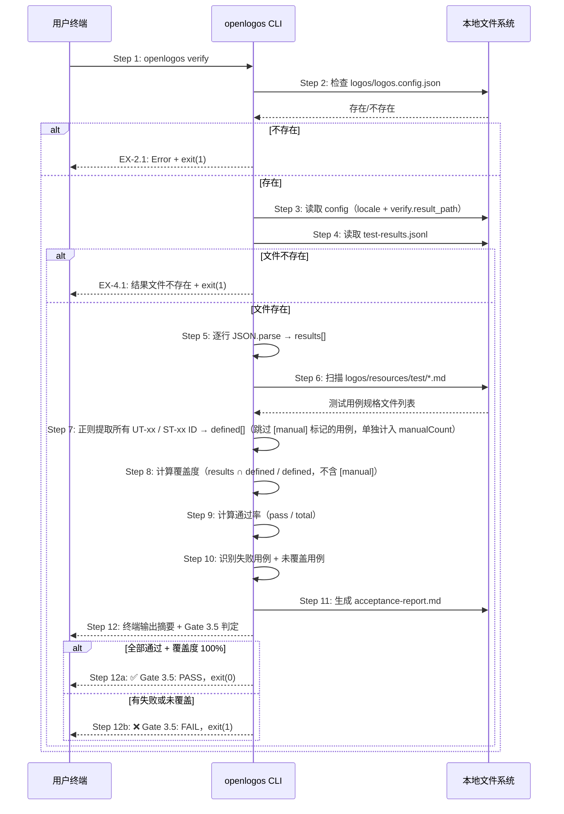

# S13: 测试验收 — 场景实现

> Phase 3 Step 1 · 场景建模

## 参与方

| 别名 | 组件 | 说明 |
|------|------|------|
| U | 用户终端 | 执行 CLI 命令的终端 |
| CLI | openlogos CLI | `cli/src/commands/verify.ts` |
| FS | 本地文件系统 | JSONL 结果文件 + 测试用例规格 + 验收报告 |

## 时序图

## 步骤说明

1. **开发者**在终端输入 `openlogos verify`。
2. **CLI** 检查当前目录下 `logos/logos.config.json` 是否存在。如果不存在 → 见 EX-2.1。
3. **CLI** 从配置文件中读取 `locale`（用于输出语言切换）和 `verify.result_path`（JSONL 文件路径）。如果 `verify.result_path` 未配置，使用默认值 `logos/resources/verify/test-results.jsonl`。
4. **CLI** 读取 JSONL 结果文件。如果文件不存在 → 见 EX-4.1。
5. **CLI** 逐行执行 `JSON.parse`，将每行解析为结果对象，收集到 `results[]` 数组中。

> 同一个 `id` 如果出现多次（如测试重试），取最后一次出现的结果。解析失败的行记录警告但不中断流程。

6. **CLI** 扫描 `logos/resources/test/` 目录，找到所有 `*-test-cases.md` 文件。
7. **CLI** 对每个文件用正则提取所有用例 ID。扫描时检查 ID 后是否紧跟 `[manual]` 标记：若是则跳过不加入 `defined[]`，单独计入 `manualCount`；否则加入 `defined[]` 并去重。
8. **CLI** 计算覆盖度：`results` 中出现的 ID 与 `defined` 的交集 / `defined` 总数。`[manual]` 用例不计入分母，也不出现在未覆盖列表中。
9. **CLI** 计算通过率：`results` 中 `status=pass` 的数量 / `results` 总数。
10. **CLI** 识别四类问题用例：
    - **失败用例**：`status=fail`，输出 ID + error 信息
    - **跳过用例**：`status=skip`
    - **未覆盖用例**：在 `defined` 中存在但在 `results` 中不存在的 ID（不含 `[manual]`）
    - **人工用例**：标记为 `[manual]` 的用例，单独计入 `manual_count`，不触发 Gate 失败
11. **CLI** 在 `logos/resources/verify/` 目录下生成 `acceptance-report.md`，包含：定义用例总数、人工用例数（已排除）、执行用例数、通过/失败/跳过/未覆盖明细、覆盖度百分比、通过率百分比、Gate 3.5 判定结果。AC trace 中全部关联 `[manual]` 用例的 AC 标记为 `🔵 MANUAL`（人工待验），不计入失败。
12. **CLI** 在终端输出摘要信息。如果所有用例通过且覆盖度 100% → 输出 `✅ Gate 3.5: PASS`，退出码 0；否则 → 输出 `❌ Gate 3.5: FAIL`，退出码 1。

> `openlogos verify` 不负责运行测试本身，只读取结果文件并判定。测试的运行由用户自行完成（`npm test`、`pytest` 等）。

## 异常用例

### EX-2.1: 项目未初始化

- **触发条件**：Step 2 检测到 `logos/logos.config.json` 不存在
- **期望响应**：stderr 输出 `Error: logos/logos.config.json not found. Run 'openlogos init' first to initialize the project.`，exit(1)
- **副作用**：不输出任何验收信息

### EX-4.1: 测试结果文件不存在

- **触发条件**：Step 4 检测到 JSONL 结果文件不存在（默认路径或 `verify.result_path` 配置的路径）
- **期望响应**：stderr 输出 `Error: No test results found at {path}. Run your tests first, then try again.`，exit(1)
- **副作用**：不生成验收报告
