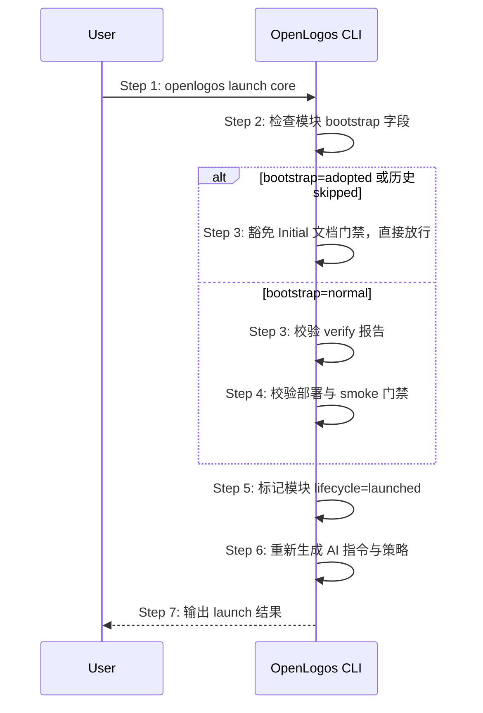

# S14: 切换到 launched 生命周期 — 时序图

## 步骤说明
1. **用户**请求 launch。
2. **CLI** 检查模块 `bootstrap` 字段。
3. **CLI** 若 `bootstrap: adopted` 或历史 `skipped`，豁免 Initial 文档门禁，直接放行（不依赖 `lifecycle` 值）；否则检查验收报告。
4. **CLI**（仅 normal bootstrap）检查部署和 smoke 要求。
5. **CLI** 更新模块生命周期。
6. **CLI** 更新 AI 资产。
7. **CLI** 输出结果。

## 异常用例
### EX-2.1: verify 未通过
- **触发条件**：缺少 PASS 验收报告（仅 normal bootstrap）。
- **期望响应**：拒绝 launch。

### EX-2.2: bootstrap=adopted 或历史 skipped 的模块跳过 Initial 文档门禁
- **触发条件**：模块 `bootstrap: adopted`，Initial 文档不存在。
- **期望响应**：不检查 Initial 文档，直接进入 launched 状态（不依赖当前 `lifecycle` 值）；输出提示说明是存量项目接入模式。
- **副作用**：`lifecycle` 更新为 `launched`。
