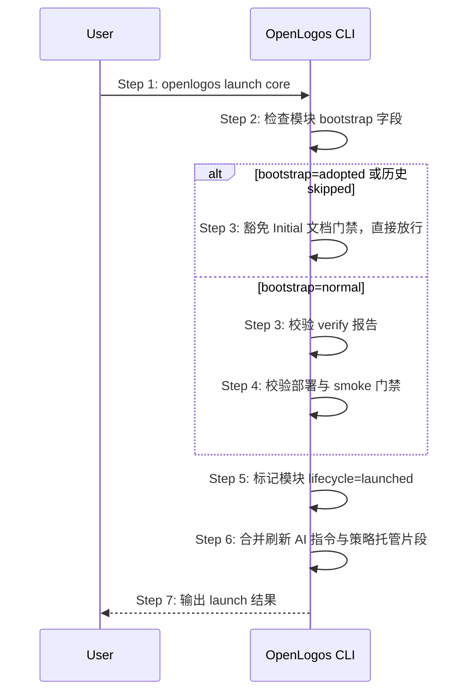
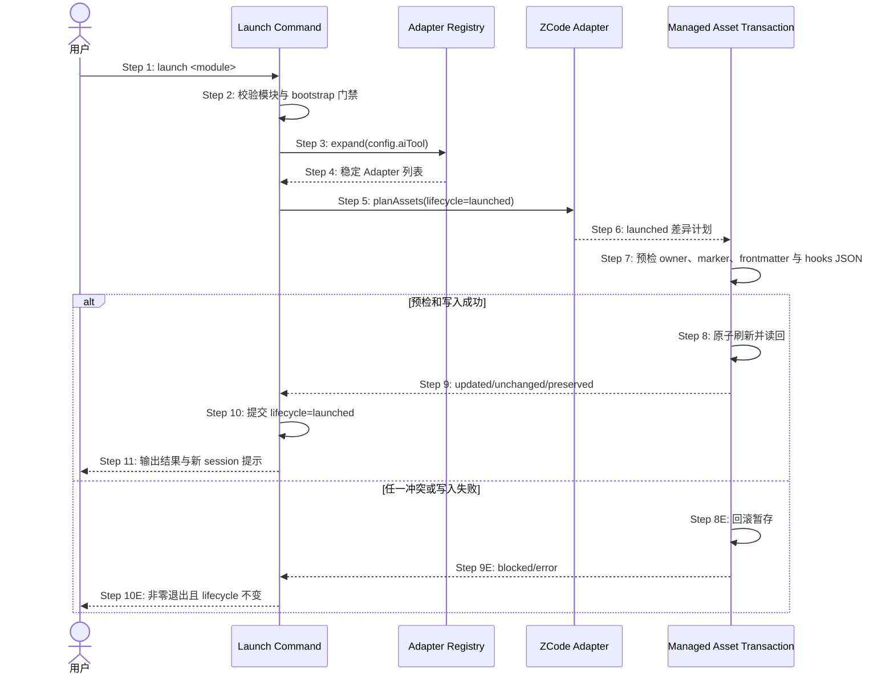
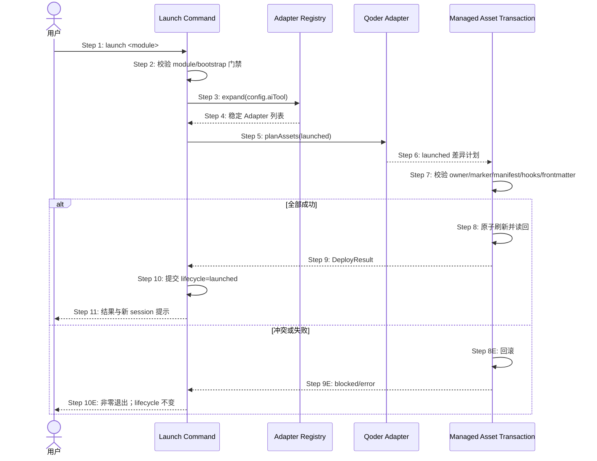

# S14: 切换到 launched 生命周期 — 时序图

```mermaid
sequenceDiagram
    participant U as User
    participant C as OpenLogos CLI

    U->>C: Step 1: openlogos launch core
    C->>C: Step 2: 检查模块 bootstrap 字段
    alt bootstrap=adopted 或历史 skipped
        C->>C: Step 3: 豁免 Initial 文档门禁，直接放行
    else bootstrap=normal
        C->>C: Step 3: 校验 verify 报告
        C->>C: Step 4: 校验部署与 smoke 门禁
    end
    C->>C: Step 5: 标记模块 lifecycle=launched
    C->>C: Step 6: 合并刷新 AI 指令与策略托管片段
    C-->>U: Step 7: 输出 launch 结果
```

## 步骤说明
1. **用户**请求 launch。
2. **CLI** 检查模块 `bootstrap` 字段。
3. **CLI** 若 `bootstrap: adopted` 或历史 `skipped`，豁免 Initial 文档门禁，直接放行（不依赖 `lifecycle` 值）；否则检查验收报告。
4. **CLI**（仅 normal bootstrap）检查部署和 smoke 要求。
5. **CLI** 更新模块生命周期。
6. **CLI** 更新 AI 资产；刷新根目录 `AGENTS.md` / `CLAUDE.md` 时必须只替换 OpenLogos 托管片段，保留用户自定义配置。
7. **CLI** 输出结果。

## 异常用例
### EX-2.1: verify 未通过
- **触发条件**：缺少 PASS 验收报告（仅 normal bootstrap）。
- **期望响应**：拒绝 launch。

### EX-2.2: bootstrap=adopted 或历史 skipped 的模块跳过 Initial 文档门禁
- **触发条件**：模块 `bootstrap: adopted`，Initial 文档不存在。
- **期望响应**：不检查 Initial 文档，直接进入 launched 状态（不依赖当前 `lifecycle` 值）；输出提示说明是存量项目接入模式。
- **副作用**：`lifecycle` 更新为 `launched`，AI 指令文件托管片段更新为 launched 规则，托管片段外用户内容保留。

### EX-6.1: AI 指令文件 marker 不完整
- **触发条件**：launch 刷新 AI 指令时发现 `AGENTS.md` / `CLAUDE.md` 存在不完整 OpenLogos marker。
- **期望响应**：拒绝刷新指令文件并提示用户修复 marker。
- **副作用**：不得覆盖用户指令文件。

### EX-1.1: 指定模块不存在
- **触发条件**：`openlogos launch <module>` 传入的模块 id 未在 `logos-project.yaml` 的 `modules` 中注册。
- **期望响应**：输出「模块不存在」错误（`launch.moduleNotFound`）并以非零码退出，不进入门禁校验与 lifecycle 变更。
- **副作用**：不修改任何文件（`logos-project.yaml`、AI 指令文件、Skill 资产均不变）。

### EX-1.2: 多模块未指定 --module
- **触发条件**：注册表存在 ≥2 个模块，用户执行 `openlogos launch` 未带模块参数（无法唯一确定目标）。
- **期望响应**：输出「请指定模块」错误（`launch.multiModuleError`，列出可选模块 id）并以非零码退出；空注册表（0 模块）则输出「无已注册模块」错误退出。
- **副作用**：无文件被修改。

### EX-5.1: 模块已 launched（幂等）
- **触发条件**：目标模块 `lifecycle` 已为 `launched`，再次执行 `openlogos launch <module>`。
- **期望响应**：不重复推进状态——normal bootstrap 模块输出「模块已 launched」提示（`launch.moduleAlreadyLaunched`）并以零码正常返回（no-op）；adopted bootstrap 模块幂等刷新 AI 指令与 Skill 资产后正常返回，不改写 `lifecycle`。
- **副作用**：`lifecycle` 值不变；normal 分支不触发任何写入，adopted 分支仅幂等刷新托管片段与资产、不产生语义漂移。

## S14 Registry 驱动的 ZCode launched 资产刷新时序

### 场景目标

模块切换到 launched 生命周期时，CLI 通过 Adapter Registry 选择已配置宿主并原子刷新 ZCode 的 launched 指令、Skills、Agents、AGENTS 托管片段与 Hooks；normal/adopted 两种 bootstrap 均保持原门禁语义，重复 launch 不产生漂移。

### 参与者

- **用户**：授权模块进入 launched。
- **Launch Command**：执行模块门禁、状态提交与结果汇总。
- **Adapter Registry**：解析配置并选择能力匹配的 Adapter。
- **ZCode Adapter**：规划 launched 资产变体。
- **Managed Asset Transaction**：预检、原子刷新和回滚。

### 前置条件

- 目标模块存在且 bootstrap/lifecycle 状态可解析。
- normal 模块满足既有 verify、部署与 smoke 门；adopted 模块按既有豁免规则执行。
- ZCode 仅在 `aiTool` 明确选择 `zcode` 或 `all` 展开包含它时参与刷新。

### 成功后置条件

- 模块 lifecycle 与 ZCode launched 资产一致，不出现一方成功、一方失败。
- 根 `AGENTS.md` 只更新 OpenLogos 托管片段；用户内容和非 OpenLogos ZCode 资产保留。
- 输出提示新建 ZCode session 以装载新的 Hook/指令快照。

### 时序图

```mermaid
sequenceDiagram
    actor U as 用户
    participant L as Launch Command
    participant R as Adapter Registry
    participant Z as ZCode Adapter
    participant T as Managed Asset Transaction

    U->>L: Step 1: launch <module>
    L->>L: Step 2: 校验模块与 bootstrap 门禁
    L->>R: Step 3: expand(config.aiTool)
    R-->>L: Step 4: 稳定 Adapter 列表
    L->>Z: Step 5: planAssets(lifecycle=launched)
    Z-->>T: Step 6: launched 差异计划
    T->>T: Step 7: 预检 owner、marker、frontmatter 与 hooks JSON
    alt 预检和写入成功
        T->>T: Step 8: 原子刷新并读回
        T-->>L: Step 9: updated/unchanged/preserved
        L->>L: Step 10: 提交 lifecycle=launched
        L-->>U: Step 11: 输出结果与新 session 提示
    else 任一冲突或写入失败
        T->>T: Step 8E: 回滚暂存
        T-->>L: Step 9E: blocked/error
        L-->>U: Step 10E: 非零退出且 lifecycle 不变
    end
```

### 步骤说明

1. 用户指定唯一模块；多模块缺参、未知模块仍按既有规则拒绝。
2. normal 分支验证验收链；adopted/历史 skipped 分支仅应用既有 Initial 豁免，不豁免资产安全预检。
3. Launch Command 不再写死宿主分支，而向 Registry 请求配置集合。
4. Registry 去重并保持确定顺序，既有四宿主行为不变。
5. ZCode Adapter 根据 capability manifest 选择 launched 模板。
6. 计划覆盖插件 manifest、Skills、Commands、Agents、Hooks/runtime 与根 AGENTS 托管片段。
7. 不完整 marker、未知 owner、非法 frontmatter 或 Hook 配置立即阻断。
8. 仅预检全通过后替换托管资产；不得镜像删除用户文件。
9. 结果区分 updated、unchanged、preserved 和 blocked。
10. lifecycle 提交必须晚于全部已选 Adapter 成功；失败保持旧值。
11. 成功输出 ZCode 资产位置与新 session 生效提示。

### 异常与边界

#### EX-ZC-1：已 launched 的 normal 模块

- **触发条件**：normal 模块已为 launched，再次执行 launch。
- **期望响应**：保持既有零码 no-op 行为，不刷新任何宿主。
- **副作用**：Registry 不得让 ZCode 改变该兼容语义。

#### EX-ZC-2：已 launched 的 adopted 模块

- **触发条件**：adopted 模块重复 launch，托管 ZCode 资产可能落后。
- **期望响应**：经 Registry 幂等刷新 launched 资产，lifecycle 值不改写。
- **副作用**：用户配置和托管片段外内容保持原样。

#### EX-ZC-3：ZCode 资产冲突

- **触发条件**：目标路径已存在不同 owner 文件，或 AGENTS marker 不完整。
- **期望响应**：阻断整个 launch 事务，列出精确路径和修复建议。
- **副作用**：lifecycle、既有资产及其它宿主资产保持提交前状态。

### 追溯

- 需求：S14 launched 刷新与兼容性验收。
- 架构：28.2 Adapter Registry、28.3 资产规划与原子部署。
- 测试：UT-S14-06～UT-S14-09、ST-S14-19～ST-S14-20。

## S14 Registry 驱动的 Qoder launched 资产刷新时序

### 场景目标

模块进入 launched 时，经 Registry 原子刷新 Qoder launched 指令、Skills、Commands、Agents 与 Hooks；所有已选 Adapter 成功后才提交 lifecycle，重复执行幂等。

### 参与者

- **用户**：授权 launch。
- **Launch Command**：校验门禁并持有 lifecycle 提交。
- **Adapter Registry**：选择已配置 Adapter。
- **Qoder Adapter**：规划 launched 资产。
- **Managed Asset Transaction**：预检、刷新或回滚。

### 前置条件

- module/bootstrap/lifecycle 可解析；normal/adopted 分支满足既有门禁。
- 仅 `aiTool=qoder` 或 `all` 展开包含 Qoder 时参与。

### 成功后置条件

- lifecycle 与 Qoder launched 资产一致。
- 用户 settings、其它插件和 AGENTS marker 外内容不变。
- 结果提示以新 Qoder CLI session 装载刷新快照。

### 时序图

```mermaid
sequenceDiagram
    actor U as 用户
    participant L as Launch Command
    participant R as Adapter Registry
    participant Q as Qoder Adapter
    participant T as Managed Asset Transaction
    U->>L: Step 1: launch <module>
    L->>L: Step 2: 校验 module/bootstrap 门禁
    L->>R: Step 3: expand(config.aiTool)
    R-->>L: Step 4: 稳定 Adapter 列表
    L->>Q: Step 5: planAssets(launched)
    Q-->>T: Step 6: launched 差异计划
    T->>T: Step 7: 校验 owner/marker/manifest/hooks/frontmatter
    alt 全部成功
        T->>T: Step 8: 原子刷新并读回
        T-->>L: Step 9: DeployResult
        L->>L: Step 10: 提交 lifecycle=launched
        L-->>U: Step 11: 结果与新 session 提示
    else 冲突或失败
        T->>T: Step 8E: 回滚
        T-->>L: Step 9E: blocked/error
        L-->>U: Step 10E: 非零退出；lifecycle 不变
    end
```

### 步骤说明

1. 用户指定唯一 module。
2. normal 与 adopted/历史 skipped 只沿用既有门禁，不因 Qoder 改义。
3. Launch Command 只调用 Registry，不手写宿主判断。
4. Registry 稳定去重，历史未选择 Qoder 时不加入。
5. Qoder Adapter 根据 capability 选择 launched 模板。
6. 计划覆盖插件、Skills、Commands、Agents、Hooks/runtime 与 AGENTS managed block。
7. 任一非法或 owner 冲突在首个提交前阻断。
8. 事务只替换托管目标，不镜像删除用户文件。
9. 结果区分 updated/unchanged/preserved/blocked。
10. lifecycle 提交晚于所有 Adapter 成功。
11. 成功提示重开 Qoder CLI session。

### 异常与边界

#### EX-QD-S14-1：normal 已 launched
- **触发条件**：normal module 已 launched，再次执行。
- **期望响应**：保持既有零码 no-op，不因 Qoder 强制刷新。
- **副作用**：所有资产不变。

#### EX-QD-S14-2：adopted 已 launched
- **触发条件**：托管 Qoder 资产落后，重复 launch。
- **期望响应**：幂等刷新差异，lifecycle 值不重复改写。
- **副作用**：用户资产 preserved。

#### EX-QD-S14-3：Qoder 资产失败
- **触发条件**：模板缺失、owner 冲突或读回失败。
- **期望响应**：回滚整个已选 Adapter 事务。
- **副作用**：lifecycle 与其它宿主资产保持提交前状态。

### 追溯

- 需求：S14 Qoder launched 刷新验收。
- 架构：29.6 资产事务与提交顺序。
- 测试：UT-S14-10～UT-S14-13、ST-S14-21～ST-S14-22。
