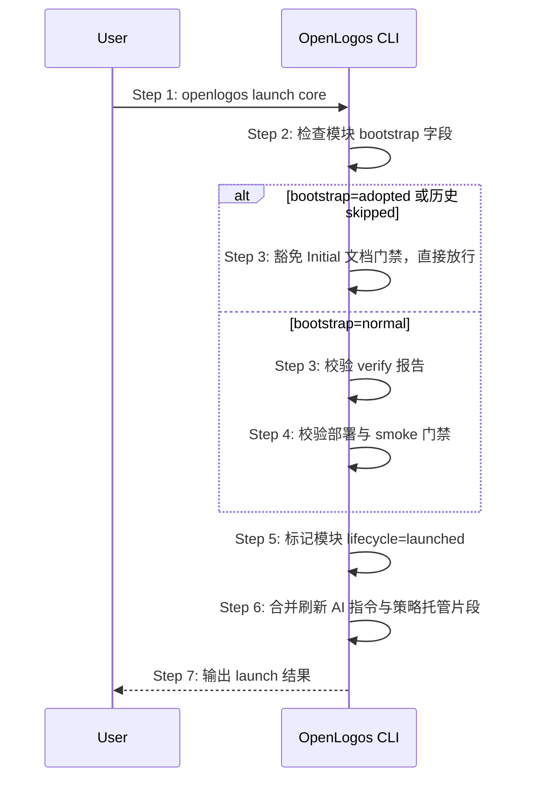

# S14: 切换到 launched 生命周期 — 时序图

```mermaid
sequenceDiagram
    participant U as User
    participant C as OpenLogos CLI

    U->>C: Step 1: openlogos launch core
    C->>C: Step 2: 检查模块 bootstrap 字段
    alt bootstrap=adopted 或历史 skipped
        C->>C: Step 3: 豁免 Initial 文档门禁，直接放行
    else bootstrap=normal
        C->>C: Step 3: 校验 verify 报告
        C->>C: Step 4: 校验部署与 smoke 门禁
    end
    C->>C: Step 5: 标记模块 lifecycle=launched
    C->>C: Step 6: 合并刷新 AI 指令与策略托管片段
    C-->>U: Step 7: 输出 launch 结果
```

## 步骤说明
1. **用户**请求 launch。
2. **CLI** 检查模块 `bootstrap` 字段。
3. **CLI** 若 `bootstrap: adopted` 或历史 `skipped`，豁免 Initial 文档门禁，直接放行（不依赖 `lifecycle` 值）；否则检查验收报告。
4. **CLI**（仅 normal bootstrap）检查部署和 smoke 要求。
5. **CLI** 更新模块生命周期。
6. **CLI** 更新 AI 资产；刷新根目录 `AGENTS.md` / `CLAUDE.md` 时必须只替换 OpenLogos 托管片段，保留用户自定义配置。
7. **CLI** 输出结果。

## 异常用例
### EX-2.1: verify 未通过
- **触发条件**：缺少 PASS 验收报告（仅 normal bootstrap）。
- **期望响应**：拒绝 launch。

### EX-2.2: bootstrap=adopted 或历史 skipped 的模块跳过 Initial 文档门禁
- **触发条件**：模块 `bootstrap: adopted`，Initial 文档不存在。
- **期望响应**：不检查 Initial 文档，直接进入 launched 状态（不依赖当前 `lifecycle` 值）；输出提示说明是存量项目接入模式。
- **副作用**：`lifecycle` 更新为 `launched`，AI 指令文件托管片段更新为 launched 规则，托管片段外用户内容保留。

### EX-6.1: AI 指令文件 marker 不完整
- **触发条件**：launch 刷新 AI 指令时发现 `AGENTS.md` / `CLAUDE.md` 存在不完整 OpenLogos marker。
- **期望响应**：拒绝刷新指令文件并提示用户修复 marker。
- **副作用**：不得覆盖用户指令文件。

### EX-1.1: 指定模块不存在
- **触发条件**：`openlogos launch <module>` 传入的模块 id 未在 `logos-project.yaml` 的 `modules` 中注册。
- **期望响应**：输出「模块不存在」错误（`launch.moduleNotFound`）并以非零码退出，不进入门禁校验与 lifecycle 变更。
- **副作用**：不修改任何文件（`logos-project.yaml`、AI 指令文件、Skill 资产均不变）。

### EX-1.2: 多模块未指定 --module
- **触发条件**：注册表存在 ≥2 个模块，用户执行 `openlogos launch` 未带模块参数（无法唯一确定目标）。
- **期望响应**：输出「请指定模块」错误（`launch.multiModuleError`，列出可选模块 id）并以非零码退出；空注册表（0 模块）则输出「无已注册模块」错误退出。
- **副作用**：无文件被修改。

### EX-5.1: 模块已 launched（幂等）
- **触发条件**：目标模块 `lifecycle` 已为 `launched`，再次执行 `openlogos launch <module>`。
- **期望响应**：不重复推进状态——normal bootstrap 模块输出「模块已 launched」提示（`launch.moduleAlreadyLaunched`）并以零码正常返回（no-op）；adopted bootstrap 模块幂等刷新 AI 指令与 Skill 资产后正常返回，不改写 `lifecycle`。
- **副作用**：`lifecycle` 值不变；normal 分支不触发任何写入，adopted 分支仅幂等刷新托管片段与资产、不产生语义漂移。

