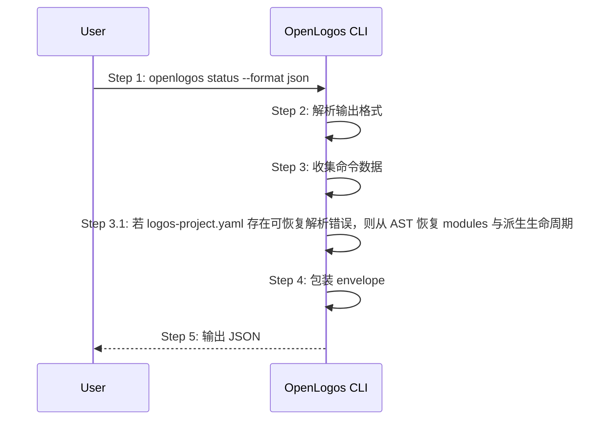

# S16: 输出机器可读 JSON 结果 — 时序图



## 步骤说明
1. **用户或脚本**请求 JSON 输出。
2. **CLI** 解析 `--format json`。
3. **CLI** 收集真实数据；若 `logos-project.yaml` 局部损坏但 `modules` 可恢复，仍需继续输出 `modules` 与派生生命周期。
4. **CLI** 生成统一 envelope。
5. **CLI** 输出 JSON。

## verify JSON 预跑状态
`openlogos verify --format json` 的 `data` 必须包含 `pre_run` 对象，用于表达预跑命令、阶段状态和诊断。RunLogos 只消费该对象，不复刻测试编排逻辑。

示例：

```jsonc
{
  "pre_run": {
    "mode": "two_phase",
    "commands": [
      { "stage": "regression", "command": "npm test", "status": "pass", "exit_code": 0 },
      { "stage": "incremental", "command": "npm run test:changed", "status": "pass", "exit_code": 0 }
    ],
    "result_paths": {
      "final": "logos/resources/verify/test-results.jsonl",
      "regression": "logos/resources/verify/test-results.regression.jsonl",
      "incremental": "logos/resources/verify/test-results.incremental.jsonl"
    },
    "merge_strategy": "last-write-wins",
    "diagnostics": [],
    "suggestions": []
  }
}
```

## 异常用例
### EX-2.1: 非 JSON 格式
- **触发条件**：未传入或传入非 json。
- **期望响应**：回退文本输出。

### EX-2.2: `logos-project.yaml` 局部损坏但 `modules` 可恢复
- **触发条件**：YAML 后半段存在语法错误，但 `modules` 节点仍可从 AST 恢复。
- **期望响应**：`detect/status --format json` 仍输出 `modules`、`lifecycle=launched`，并附带 `yaml_diagnostics.parse_status=recovered`。

### EX-2.3: `logos-project.yaml` 无法恢复
- **触发条件**：YAML 整体损坏，无法恢复任何模块信息。
- **期望响应**：返回明确的 `yaml_diagnostics.parse_status=error` 与错误摘要，不得静默回退为看起来正常的 `initial`。

### EX-2.4: verify 覆盖不足诊断
- **触发条件**：`verify --format json` 的 Gate 失败原因为 `incomplete_coverage`，且没有任何预跑命令。
- **期望响应**：JSON 输出中 `pre_run.mode="none"`，`pre_run.diagnostics[]` 包含局部测试可能性说明，`pre_run.suggestions[]` 包含配置 `verify.pre_run_command` 或 `verify.regression_command` 的建议。

### EX-2.5: 预跑命令失败
- **触发条件**：某个预跑命令返回非零退出码。
- **期望响应**：JSON 输出保留命令的 `stage`、`status="fail"`、`exit_code` 和错误摘要；verify 可继续读取已有结果，但 Gate 最终依据测试结果和覆盖度判定。
