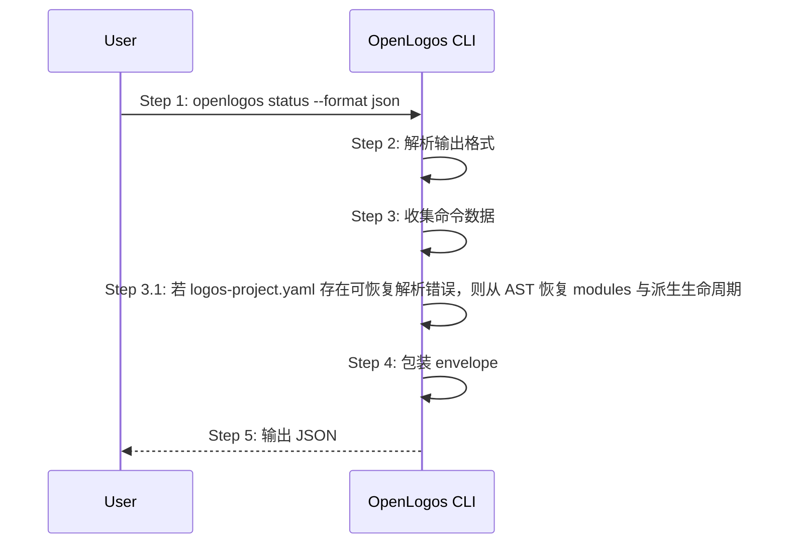

# S16: 输出机器可读 JSON 结果 — 时序图

## 步骤说明
1. **用户或脚本**请求 JSON 输出。
2. **CLI** 解析 `--format json`。
3. **CLI** 收集真实数据；若 `logos-project.yaml` 局部损坏但 `modules` 可恢复，仍需继续输出 `modules` 与派生生命周期。
4. **CLI** 生成统一 envelope。
5. **CLI** 输出 JSON。

## 异常用例
### EX-2.1: 非 JSON 格式
- **触发条件**：未传入或传入非 json。
- **期望响应**：回退文本输出。

### EX-2.2: `logos-project.yaml` 局部损坏但 `modules` 可恢复
- **触发条件**：YAML 后半段存在语法错误，但 `modules` 节点仍可从 AST 恢复。
- **期望响应**：`detect/status --format json` 仍输出 `modules`、`lifecycle=launched`，并附带 `yaml_diagnostics.parse_status=recovered`。

### EX-2.3: `logos-project.yaml` 无法恢复
- **触发条件**：YAML 整体损坏，无法恢复任何模块信息。
- **期望响应**：返回明确的 `yaml_diagnostics.parse_status=error` 与错误摘要，不得静默回退为看起来正常的 `initial`。
