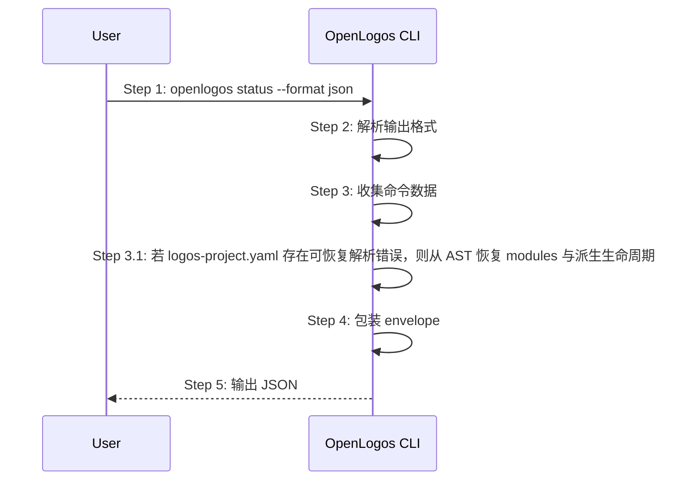
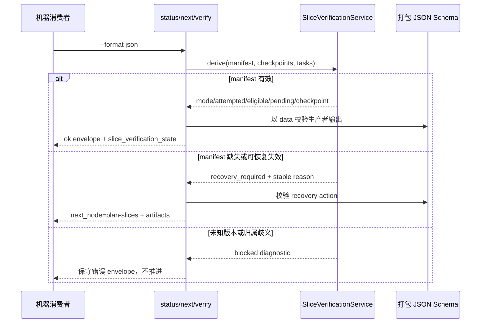
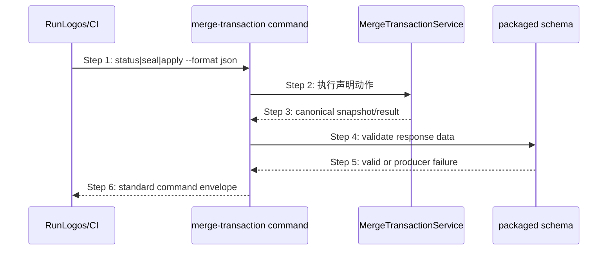

# S16: 输出机器可读 JSON 结果 — 时序图


```mermaid
sequenceDiagram
    participant U as User
    participant C as OpenLogos CLI

    U->>C: Step 1: openlogos status --format json
    C->>C: Step 2: 解析输出格式
    C->>C: Step 3: 收集命令数据
    C->>C: Step 3.1: 若 logos-project.yaml 存在可恢复解析错误，则从 AST 恢复 modules 与派生生命周期
    C->>C: Step 4: 包装 envelope
    C-->>U: Step 5: 输出 JSON
```

## 步骤说明
1. **用户或脚本**请求 JSON 输出。
2. **CLI** 解析 `--format json`。
3. **CLI** 收集真实数据；若 `logos-project.yaml` 局部损坏但 `modules` 可恢复，仍需继续输出 `modules` 与派生生命周期。
4. **CLI** 生成统一 envelope；`status` / `next` 的 `data` 顶层注入 `contract: {"version": "1.0.0"}`（语义化契约版本，独立于 CLI 版本；详见「envelope 契约版本握手（data.contract）」）。
5. **CLI** 输出 JSON。

## envelope 契约版本握手（data.contract）

本节按提案 contract-self-description（C5）定义机器契约的版本握手，S16 是 envelope / contract / schema 的定义场景（S05/S11 引用本节口径）。

- status/next 的 `data` 顶层新增 `"contract": {"version": "1.0.0"}`（语义化契约版本，独立于 CLI 版本）。envelope 既有顶层 `version`（= CLI 版本串）保持不变；二者语义不同、互不替代，flow 文件的整数 schema `version` 亦不受影响。
- **初始 `contract.version = "1.0.0"`**（本提案交付的契约形态即 1.0.0；此前无 `contract` 字段的历史输出视为「0.x 前契约时代」，消费方按缺字段保守分支处理）。
- SemVer 规则：**major** = 必填字段删除/改义、闭合枚举语义变化（含移除值）、既有字段挂出判据变更；**minor** = 向后兼容扩展（新增可选字段、闭合枚举新增值）；**patch** = 不改形态与语义的澄清。
- 版本-schema 一一映射：`spec/schema/status.schema.json`、`spec/schema/next.schema.json`（内嵌契约版本号，随 npm prepack 打包）；响应 `contract.version` 与打包 schema 版本一致，CI 校验。
- **主动破例**：破「data 顶层逐字节不变（golden 零漂移）」——`data` 顶层新增 `contract` → 全部 9 个 golden 基线快照重拍（`cli/test/golden-baseline.test.ts`）。这是本提案唯一的全量 golden 重拍点，破坏性集中在此，随大版本发布。

## JSON Schema 发布与生产者一致性校验（spec/schema/）

按提案 contract-self-description（C7）：

- CLI 仓发布 status/next 的 JSON Schema：`spec/schema/status.schema.json`、`spec/schema/next.schema.json`，版本化（内嵌契约版本号，随 `contract.version` 演进），落 `spec/schema/`，随 npm `prepack` 打包，附包内容验证测试（发布产物内 schema 完整）。
- CI 校验：
  1. 每个注册步骤/节点必须通过 schema 校验（含 step_meta/dispatch 必填，overlay-add 未声明 dispatch 走保守默认后同样过校验）；
  2. 响应 `contract.version` 与打包 schema 版本一一对应的校验（版本-schema 映射规则的 CI 落点）；
  3. **生产者一致性漂移注入测试**：在 CLI 注册全新步骤（如 `x-future-step`, `phase=pre-implement`）→ 断言 (a) 注册表/step_meta/schema 三方同步、schema 校验通过；(b) 该 pre-implement 步骤下 `loop_state` 不输出（激活判据的反面锚——`pre-implement + loop_state` 是非法组合，生产者测试断言其不存在，而非将其固化为合法夹具）。

## 未知字段与未知枚举的消费方保守语义（规范性引用）

- 消费方约定（规范性引用，验收归 runlogos R5）：driver 声明支持的 major 区间；未知 major / 缺 `contract` 字段 → 保守模式（仅 next 驱动普通推进 + 看门狗，启发式判定降级为仅观察）；契约内任何枚举遇未知值 → 保守分支。CLI 新增可选字段或闭合枚举新增值（minor）不再构成对旧消费方的破坏。
- `artifacts_hint: []` ＝「产物未知」契约语义：消费方不得据此判死，只能升级观察。
- **验收边界**：openlogos 本提案只验**生产者契约**——contract 版本字段在场、注册表/step_meta/schema 三方同步、dispatch/facts 字段来源正确、包内 schema 完整；消费方保守模式 / 零误杀 / suspect 可逆态验收归 runlogos R5 提案（用本提案发布的新生产者夹具喂旧/现役消费者做韧性测试）；双向契约测试是跨仓总方案完成定义，不是本仓单仓完成判据。
- 拍板原则：宁慢勿错杀——多等 5 分钟看门狗远好于误杀健康 run。一切措辞与设计冲突以此裁决。

## verify JSON 预跑状态
`openlogos verify --format json` 的 `data` 必须包含 `pre_run` 对象，用于表达预跑命令、阶段状态和诊断。RunLogos 只消费该对象，不复刻测试编排逻辑。

示例：

```jsonc
{
  "pre_run": {
    "mode": "two_phase",
    "commands": [
      { "stage": "regression", "command": "npm test", "status": "pass", "exit_code": 0 },
      { "stage": "incremental", "command": "npm run test:changed", "status": "pass", "exit_code": 0 }
    ],
    "result_paths": {
      "final": "logos/resources/verify/test-results.jsonl",
      "regression": "logos/resources/verify/test-results.regression.jsonl",
      "incremental": "logos/resources/verify/test-results.incremental.jsonl"
    },
    "merge_strategy": "last-write-wins",
    "diagnostics": [],
    "suggestions": []
  }
}
```

## next/status `code_required` 字段

`openlogos next` / `openlogos status --format json` 在存在活跃提案时，`modules[].active_change` 下输出布尔字段 `code_required`，表示当前提案是否需要代码实现。

- 取值等于内部谓词 `isCodeRequiredForProposal`（单一事实源），不复刻第二套判断。
- 仅当 `active_change` 非 null 时出现；无活跃提案时随整个对象不出现（零漂移边界）。
- 一致性：`code_required==false` 时 `next_node.id` 不为 `code`/`plan-slices`（slice 子流程 `when: code_required` 整段跳过）；`code_required==true` 且 `[code]` 未脱模板时维持 `ready-to-implement` / `plan-slices`。

外部消费方（如 RunLogos 驱动）应直接读取该字段判定「是否需要代码」，替代自行用关键词正则重判，避免与 CLI 派生结论分歧（见 reference `openlogos-runlogos-code-required-divergence-bug-report.md`）。契约字段定义见 `spec/cli-json-output.md` §3.11。

## 异常用例
### EX-2.1: 非 JSON 格式
- **触发条件**：未传入或传入非 json。
- **期望响应**：回退文本输出。

### EX-2.2: `logos-project.yaml` 局部损坏但 `modules` 可恢复
- **触发条件**：YAML 后半段存在语法错误，但 `modules` 节点仍可从 AST 恢复。
- **期望响应**：`detect/status --format json` 仍输出 `modules`、`lifecycle=launched`，并附带 `yaml_diagnostics.parse_status=recovered`。

### EX-2.3: `logos-project.yaml` 无法恢复
- **触发条件**：YAML 整体损坏，无法恢复任何模块信息。
- **期望响应**：返回明确的 `yaml_diagnostics.parse_status=error` 与错误摘要，不得静默回退为看起来正常的 `initial`。

### EX-2.4: verify 覆盖不足诊断
- **触发条件**：`verify --format json` 的 Gate 失败原因为 `incomplete_coverage`，且没有任何预跑命令。
- **期望响应**：JSON 输出中 `pre_run.mode="none"`，`pre_run.diagnostics[]` 包含局部测试可能性说明，`pre_run.suggestions[]` 包含配置 `verify.pre_run_command` 或 `verify.regression_command` 的建议。

### EX-2.5: 预跑命令失败
- **触发条件**：某个预跑命令返回非零退出码。
- **期望响应**：JSON 输出保留命令的 `stage`、`status="fail"`、`exit_code` 和错误摘要；verify 可继续读取已有结果，但 Gate 最终依据测试结果和覆盖度判定。

### EX-4.1: 历史输出缺 `contract` 字段（0.x 前契约时代）
- **触发条件**：消费方读取不含 `data.contract` 的旧版本 CLI 输出。
- **期望响应**（规范性引用，验收归 runlogos R5）：消费方按缺字段保守分支处理——进保守模式（仅 next 驱动普通推进 + 看门狗，启发式判定降级为仅观察），不得据此判死。
- **副作用**：无（生产者侧新版本的 status/next 恒输出 `contract`）。

### EX-4.2: `contract.version` 与打包 schema 版本不一致
- **触发条件**：响应 `contract.version` 与 `spec/schema/` 打包 schema 的内嵌契约版本号不一致。
- **期望响应**：CI 校验失败（生产者侧红线），阻止发布；不存在运行时自动降级分支。
- **副作用**：无。

## 切片验收与恢复动作机器输出时序

### 目标

让 CI 与 RunLogos 无需解析 Markdown，即可区分 checkpoint、final、pending 与 manifest 恢复，并在跨进程重启后继续同一 attempted slice。

### 参与者与前置条件

- 调用方：CI、RunLogos 或其他机器消费者。
- 生产者：`status`、`next`、`verify --format json`。
- 权威服务：SliceVerificationService。
- 前置：活跃提案已进入切片规划或实现阶段。


```mermaid
sequenceDiagram
    participant Host as 机器消费者
    participant Cmd as status/next/verify
    participant SV as SliceVerificationService
    participant Schema as 打包 JSON Schema

    Host->>Cmd: --format json
    Cmd->>SV: derive(manifest, checkpoints, tasks)
    alt manifest 有效
        SV-->>Cmd: mode/attempted/eligible/pending/checkpoint
        Cmd->>Schema: 以 data 校验生产者输出
        Cmd-->>Host: ok envelope + slice_verification_state
    else manifest 缺失或可恢复失效
        SV-->>Cmd: recovery_required + stable reason
        Cmd->>Schema: 校验 recovery action
        Cmd-->>Host: next_node=plan-slices + artifacts
    else 未知版本或归属歧义
        SV-->>Cmd: blocked diagnostic
        Cmd-->>Host: 保守错误 envelope，不推进
    end
```

### 输出规则

1. verify data 必须输出 `verify_mode: slice-checkpoint|final`；恢复态不伪造 verify mode。
2. checkpoint 输出非空 `attempted_slice_id`，final 明确输出 `null`。
3. `eligible_test_ids` 与 `pending_test_ids` 去重、稳定排序、互斥；final 的 pending 恒为空。
4. `manifest.status` 枚举为 `valid|missing|invalid|stale|unsupported`，并携 path/schema/fingerprint（不可得字段为 null）。
5. status/next 的 `slice_verification_state` 与 verify 使用同一派生值；next 在恢复态给出 `plan-slices` 的完整 dispatch。
6. 所有新增字段进入版本化 JSON Schema；1.x 消费方忽略未知字段，但未知 enum 或 manifest 主版本必须保守处理。

### 异常与边界

- 恢复态不是测试 FAIL：不得同时输出 `gate.result=FAIL` 或写失败 marker。
- checkpoint 的 pending 不得混入 `uncovered_test_ids`。
- 进程重启后，attempted identity 由 manifest/checkpoint 重算，输出保持稳定。
- 单切片 legacy 提案沿用旧 final 输出；新增字段可省略以保持兼容。
- RunLogos 只消费 JSON 动作；不得以本地文件扫描覆盖 `reason` 或 `next_node`。

### 追溯

- 需求：S16、S28。
- 规格：功能规格 §2.37.5～§2.37.7；`spec/cli-json-output.md`。
- 测试：UT-S16-10～UT-S16-17、ST-S16-03～ST-S16-04。

## merge-transaction@1 机器输出时序

### 场景目标

让 CLI、RunLogos 和其它消费者通过同一版本化 JSON 合同读取 transaction 状态、可执行动作、错误与完成 receipt，不解析 Markdown、私有文件或 stderr 猜测流程。

### 公共 envelope

```json
{
  "schema": "openlogos/merge-transaction@1",
  "contract_version": "1",
  "contract_hash": "sha256:<frozen>",
  "transaction_id": "<opaque>",
  "plan_hash": "sha256:<canonical-plan>",
  "slug": "change-slug",
  "module": "core",
  "phase": "collecting",
  "classification": "waiting",
  "code": "merge-content-pending",
  "allowed_actions": ["status", "seal"],
  "next_action": "seal",
  "agent_io": {
    "read_paths": ["logos/changes/<slug>/MERGE_PROMPT.md"],
    "write_paths": ["logos/changes/<slug>/merge-content/<transaction-id>/<target-id>.content"],
    "slots": []
  },
  "receipt": null,
  "error": null
}
```

字段存在性随 phase 受 schema 约束：collecting 可有 `agent_io`；completed 必须有 receipt 且 classification/code/error 为空；failed 必须有 fatal error 且 next_action 不得声称同 transaction 可恢复内容。

### 主时序


```mermaid
sequenceDiagram
    participant H as RunLogos/CI
    participant C as merge-transaction command
    participant T as MergeTransactionService
    participant S as packaged schema
    H->>C: Step 1: status|seal|apply --format json
    C->>T: Step 2: 执行声明动作
    T-->>C: Step 3: canonical snapshot/result
    C->>S: Step 4: validate response data
    S-->>C: Step 5: valid or producer failure
    C-->>H: Step 6: standard command envelope
```

### 步骤说明

1. 消费方只提交 command action、slug/module/transaction identity，不提交 phase 或 target list。
2. CLI 先检查 action 是否属于当前 `allowed_actions`，再调用 service。
3. service 返回唯一数据模型；text 输出也只能由该模型投影。
4. CLI 使用 tarball 内同版本 schema 校验生产者自身输出。
5. schema/hash 不匹配阻止 candidate 发布，不运行时静默降级。
6. RunLogos 只消费 data 字段，原样保留稳定 error code/stage/field_path。

### 错误结构

错误对象精确表达 `classification=waiting|retryable|fatal`、稳定 `code`、`stage=plan|collect|seal|apply|recover`、可空 `field_path`、脱敏 `detail`、`next_safe_action`、`retryable` 与 transaction identity。JSON 与 text 投影不得改写分类或丢失原始 code。

### Receipt 摘要

completed receipt 至少包含：transaction/plan/change/module identity、contract hash、phase、created/modified/changed paths、final hashes、metadata/test-change-set/marker identity、精确 `commit_paths` 和完成时间。数组稳定排序，hash 使用小写十六进制 SHA-256；相同 completed transaction 重复读取字节稳定，时间戳不重新生成。

### 异常与边界

#### EX-MT-16-1：未知 transaction 主版本
- **触发条件**：消费者不认识 schema 主版本。
- **期望响应**：消费者保守阻塞并提示升级，不得按字段猜测 seal/apply。
- **副作用**：无。

#### EX-MT-16-2：生产者输出不符合随包 schema
- **触发条件**：CLI 生成了非法 enum、缺 required 字段或 contract hash 与随包 schema 不符。
- **期望响应**：命令非零、候选构建/测试失败；不得输出 `success:true`。
- **副作用**：seal 前零正式写入；apply 中按 journal 恢复。

#### EX-MT-16-3：text/JSON 分类漂移
- **触发条件**：同一底层错误在 text 与 JSON 映射成不同 classification/code。
- **期望响应**：golden 合同测试失败；RunLogos 只信 JSON，不用 stderr 修补。
- **副作用**：无。

### 追溯

- 功能规格：§2.44.2～§2.44.5。
- Schema：`spec/schema/merge-transaction.schema.json`、next/status schema。
- 测试：UT-S16-18～UT-S16-27、ST-S16-05～ST-S16-08。

## S16 Merge transaction 消费者 JSON 合同补充


### 成功 envelope

`data.merge_transaction` 必须包含 schema/contract hash、identity、phase、classification、allowed_actions、next_action、content_slots、receipt、artifact_hashes 与 aborted_at。数组按稳定 path/slot 顺序输出。

### 跨字段约束

- `content_slots.items[].staging_path` 为项目根相对路径，slot_id 唯一。
- 非 completed：receipt=null 且 artifact_hashes=[]。
- completed：classification=null、actions=[]、receipt 非空、aborted_at=null。
- failed/aborted：receipt=null、artifact_hashes=[]、actions=[]、next_action=null、aborted_at 非空。
- receipt 的 final_hash path 与 changed/created path 集相等。
- final_hash path 与 artifact_hash path 互斥，并集与 commit_paths 相等。
- receipt_sha256 是 canonical payload identity；artifact_hashes 中 receipt 路径的 sha256 才是文件 hash。

结构、类型、枚举和可表达的阶段约束由三份 JSON Schema 校验；路径集合相等/互斥、稳定排序、计数守恒、receipt canonical identity 与完整 phase-action 映射由 `openlogos/merge-transaction-semantic@1` 校验。CLI 在输出成功 envelope 前执行两层自校验；RunLogos 在执行 action 或 Git 提交前再次执行两层校验。

### 动作与错误

命令面闭合为 `status|submit-content|seal|apply|recover|abort`。错误 envelope 保留 transaction_id、phase、classification、allowed_actions、next_action 与 retryable。未知 schema/hash/action/classification 不能按消息文本兼容。

## S16 Preflight/Reopen 机器输出同源合同


### 公共兼容边界

本案不新增公共 JSON 字段、phase、action或classification。`openlogos/merge-transaction@1`、status.schema、next.schema及golden继续使用既有字段集合。

### Retryable 错误

apply/seal发现可归因内容错误时，core先持久化 collecting再输出既有错误结构：

```json
{
  "error": {
    "code": "slot_identity_mismatch",
    "message": "<可操作但非机器归因来源的说明>",
    "details": {
      "transaction_id": "mtx_...",
      "phase": "collecting",
      "classification": "slot_identity_mismatch",
      "allowed_actions": ["submit_content", "abort"],
      "next_action": "submit_content",
      "retryable": true
    }
  }
}
```

错误 envelope不新增 `missing_slot_ids`。消费者随后调用status/next，从既有 `data.merge_transaction.content_slots.missing_slot_ids`读取精确slot列表。内部结构化 `target_paths[]/producer` 不进入公共输出。

### Fatal 与 Recovery 输出

- 无法唯一归因、OpenLogos producer、mixed错误、contract/schema/plan/source/before/seal/path drift：`retryable=false`，transaction不清slot。
- applying或journal存在：只返回recover相关投影，不输出submit_content。
- legacy sealed pass：completed projection继续绑定legacy seal和有效receipt，不凭空暴露preflight字段。
- reopen后重seal：公共只观察新的`seal_sha256`；transaction/plan/target-set identity不变。

### 同源要求

CLI text、transaction command JSON、status JSON和next JSON必须从同一持久化projection派生。错误响应中的phase/actions与紧随其后的status/next必须一致；response-lost场景允许客户端仅凭status恢复，不读取stderr文本或私有文件。

### Schema/Golden

UT-S16-33～34与ST-S16-10验证：既有schema无字段漂移、retryable/fatal分支、status/next同源、legacy/new seal投影和错误后跨进程重放。
